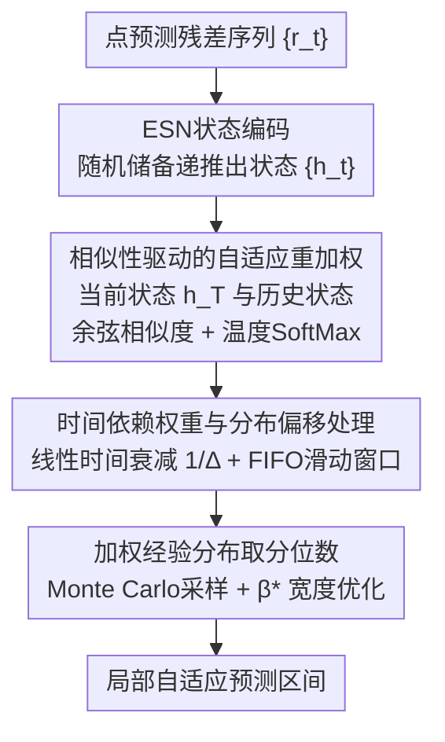

# ResCP: Reservoir Conformal Prediction for Time Series Forecasting

**会议**: ICLR 2026  
**arXiv**: [2510.05060](https://arxiv.org/abs/2510.05060)  
**代码**: 无  
**领域**: 时间序列/不确定性量化  
**关键词**: conformal prediction, reservoir computing, echo state network, prediction interval, training-free

## 一句话总结
首次将储备计算（Echo State Network）引入保形预测，通过随机初始化ESN编码残差序列的时间动态，利用状态相似性自适应重加权历史残差构建局部预测区间，无需任何训练即在4个真实数据集上实现SOTA的Winkler分数，速度比HopCPT快20-80×。

## 研究背景与动机

**领域现状**：保形预测（Conformal Prediction, CP）是构建无分布假设预测区间的强大框架，但要求数据可交换性（exchangeability），时间序列的时间依赖性天然违反这一假设。

**现有痛点**：
- NexCP 等固定衰减方法不能自适应局部动态，区间过于保守（宽度大）
- HopCPT 用 Hopfield/Transformer 注意力做数据依赖的重加权，但训练昂贵（Solar数据集4574秒 vs ResCP的53秒）且分布变化时需重训练
- SPCI 每步拟合分位数随机森林，计算需求限制实用性
- 小样本时训练型方法（CP-QRNN、ResCQR）在ACEA/Exchange数据集上严重欠覆盖（>10%）

**核心矛盾**：需要数据依赖的自适应重加权来捕捉局部动态 → 但训练模型代价高、分布变化时脆弱。

**本文目标** 在不引入任何训练的前提下，实现时间序列保形预测的局部自适应性。

**切入角度**：储备计算（Reservoir Computing）的ESN——随机初始化的RNN，无需训练但能将输入序列映射到高维状态空间，产生有意义的动态表示。

**核心 idea**：用ESN状态间的相似性作为残差重加权的数据依赖权重，相当于用免费的"动态编码器"实现局部保形预测。

## 方法详解

### 整体框架

ResCP 要解决的问题是：时间序列的残差不满足保形预测要求的可交换性，又不想为此训练任何模型。它的整体思路是把点预测模型留下的残差序列 $\{r_t\}$ 当作输入，先用一个**随机初始化、永不训练**的 Echo State Network（ESN，回声状态网络）把残差编码成状态序列 $\{\boldsymbol{h}_t\}$，再用「当前状态与历史各状态的相似度」作为权重去重加权历史残差，最后在重加权后的经验分布上取分位数，构建出随局部动态自适应伸缩的预测区间。整条流水线没有一个可学习参数。

### 关键设计

**1. ESN状态编码：用随机储备把残差序列变成能比较的动态指纹**

保形预测要做局部自适应，前提是有办法判断"现在这个时刻"和历史哪些时刻动态相似。ResCP不去训练一个编码器，而是直接用一个随机初始化、永不更新的 Echo State Network 来做这件事。残差 $x_t$ 喂进 ESN，状态按 $\boldsymbol{h}_t = (1 - l)\boldsymbol{h}_{t-1} + l\,\sigma(\boldsymbol{W}_x \boldsymbol{x}_t + \boldsymbol{W}_h \boldsymbol{h}_{t-1} + \boldsymbol{b})$ 递推，其中输入矩阵 $\boldsymbol{W}_x$、循环矩阵 $\boldsymbol{W}_h$ 随机生成后固定不动，$l$ 是 leak rate，$\sigma=\tanh$。之所以这样的"免费编码器"靠得住，是因为只要满足 Echo State Property（谱半径 $\rho(\boldsymbol{W}_h)<1$），ESN 会渐进遗忘初始条件，对相似的输入子序列产生相似的状态，并且整体是 Lipschitz 连续映射——这同时给后面"用状态相似度近似残差条件分布"的理论保证打了地基。

**2. 相似性驱动的自适应重加权：动态越像的历史时刻，残差权重越大**

有了状态序列，就可以把"哪些历史残差更值得参考"量化成权重，而不是像 vanilla SCP 那样一视同仁。ResCP 把当前状态 $\boldsymbol{h}_t$ 和校准集里每个状态 $\boldsymbol{h}_s$ 做余弦相似度，再经温度 softmax 归一化成权重 $w_s(\boldsymbol{h}_t) = \text{SoftMax}\left(\frac{\text{Sim}(\boldsymbol{h}_t, \boldsymbol{h}_s)}{\tau}\right)$，于是动态最接近的时刻贡献最大。把这些权重套到残差经验分布上，就得到了对条件分布的近似：

$$\hat{F}(r \mid \boldsymbol{h}_t) = \sum_{s} w_s(\boldsymbol{h}_t)\,\mathbb{1}(r_{s+H} \leq r)$$

温度 $\tau$ 在这里扮演偏差-方差旋钮：$\tau$ 小则权重集中到最相似的少数状态，偏差低但容易方差大；$\tau$ 大则权重趋于均匀，退化成 vanilla SCP，方差低但失去局部性。为保证一致性，等效有效样本量 $m_n = (\sum_i w_i^2)^{-1}$ 必须随 $n\to\infty$ 而发散——这也是温度不能调得过低的约束。

**3. 时间依赖权重与分布偏移处理：在相似性之上再叠一层温和的时间衰减**

光看动态相似还不够，非平稳序列里"久远但碰巧相似"的残差不该和近期残差等价对待。ResCP 在相似性权重上再乘一个随时间间隔衰减的因子 $w_i(\boldsymbol{h}_t, t) = \gamma(\Delta(t,i)) \cdot w_i(\boldsymbol{h}_t)$，并刻意选线性衰减 $\gamma(\Delta) = 1/\Delta$ 而非指数衰减——线性衰减更温和，不会过快削掉远期样本，从而保住足够的有效样本量。配合 FIFO 滑动窗口持续吐旧纳新地更新校准集，使参考集始终跟着当前分布走。正因为整套机制没有任何可学习参数，分布发生漂移时 ResCP 不必重训，靠滑窗加时间衰减就能自动适应。

### 损失函数 / 训练策略

ResCP **完全无需训练**——ESN权重随机初始化后固定。超参数（谱半径、leak rate、输入缩放、温度、窗口大小）通过在验证集上最小化 Winkler score 做网格搜索，由于无训练过程，搜索速度极快。

预测区间通过 Monte Carlo 采样近似加权分位数，并用最优 $\beta^*$ 优化区间宽度：$\beta^* = \arg\min_{\beta \in [0,\alpha]} [\hat{Q}_{1-\alpha+\beta}(\boldsymbol{h}_t) - \hat{Q}_\beta(\boldsymbol{h}_t)]$。

## 实验关键数据

### 主实验（α=0.1，RNN基线模型）

| 数据集 | 方法 | ΔCov(%) | PI宽度↓ | Winkler↓ |
|--------|------|---------|---------|----------|
| Solar | HopCPT | -1.64 | 60.49 | 112.46 |
| Solar | CP-QRNN | -0.26 | 55.74 | **78.42** |
| Solar | **ResCP** | **0.74** | **62.25** | 104.24 |
| Exchange | HopCPT | 2.75 | 0.0404 | 0.0482 |
| Exchange | **ResCP** | **1.13** | **0.0210** | **0.0264** |
| ACEA | HopCPT | -2.18 | 18.90 | 27.56 |
| ACEA | CP-QRNN | -12.37 | 15.86 | 32.61 |
| ACEA | **ResCP** | **1.56** | **9.61** | **12.91** |

### 运行时间对比（秒，RNN基线）

| 数据集 | SPCI | HopCPT | CP-QRNN | **ResCP** | SCP |
|--------|------|--------|---------|-----------|-----|
| Solar | 1040 | 4575 | 172 | **53** | 18 |
| Beijing | 351 | 1839 | 82 | **35** | 9 |
| Exchange | 51 | 318 | 37 | **7** | 2 |
| ACEA | 228 | 2263 | 95 | **71** | 7 |

### 消融实验

| 配置 | Exchange Winkler↓ | ACEA Winkler↓ | 说明 |
|------|-------------------|---------------|------|
| ResCP（完整） | **0.0264** | **12.91** | 时间衰减 + 滑动窗口 |
| No decay | 0.0269 | 13.41 | 去掉时间衰减，欠覆盖加剧 |
| No window | 0.0284 | 14.80 | 用所有历史而非滑动窗口 |
| No window, no decay | 0.0291 | 15.25 | 退化为全局相似性 |

### 关键发现
- ResCP在ACEA和Exchange上Winkler分数大幅领先所有方法（包括训练型），在Solar和Beijing上与训练型方法持平
- 训练型方法（CP-QRNN、ResCQR）在小数据集ACEA上严重欠覆盖（-12%至-27%），ResCP始终保持有效覆盖
- 校准曲线显示ResCP在所有覆盖水平上都提供准确估计，NexCP虽然校准良好但区间宽度大得多
- 运行速度比HopCPT快20-80×，且不需要GPU集中训练

## 亮点与洞察
- **储备计算的妙用**：ESN作为免费的"时间动态编码器"—不需训练但能产生足够区分局部动态的表示，这是本文最核心的insight
- **理论保证完备**：在 α-mixing + ESP + 条件CDF连续性等合理假设下，证明了加权经验CDF的一致性（Theorem 3.6）和渐近条件覆盖（Corollary 3.7）
- **对分布偏移天然鲁棒**：ResCP无可学习参数，分布变化时无需更新模型，仅通过滑动窗口和时间衰减自动适应

## 局限与展望
- ESN超参数（谱半径、leak rate、温度等）需要网格搜索调优，虽然快但增加了用户负担
- 理论保证是渐近的，有限样本下的覆盖偏差未被量化
- 仅处理单变量时间序列的单步预测，多步联合预测和时空数据扩展是未来方向
- 在数据量大且有信息量外生变量的场景（如Solar），训练型方法CP-QRNN仍可能更优

## 相关工作与启发
- **vs HopCPT**：同样用数据依赖的注意力权重，但HopCPT需端到端训练Transformer，ResCP完全无训练且效果更好
- **vs NexCP**：NexCP用数据无关的指数衰减，覆盖率可靠但区间宽度是ResCP的1.5-2×
- **vs SPCI**：SPCI每步拟合分位数随机森林，计算昂贵且难扩展；ResCP用固定ESN实现类似的局部自适应

## 评分
- 新颖性: ⭐⭐⭐⭐ 储备计算+保形预测的首次结合，理念简洁但effective
- 实验充分度: ⭐⭐⭐⭐⭐ 4个数据集×3种基线模型×3种覆盖率水平+完整消融+运行时间分析
- 写作质量: ⭐⭐⭐⭐ 理论推导清晰，实验设计系统
- 价值: ⭐⭐⭐⭐ 为时间序列不确定性量化提供了一个简单、快速、有理论保证的实用工具

<!-- RELATED:START -->

## 相关论文

- [\[AAAI 2026\] HydroDCM: Hydrological Domain-Conditioned Modulation for Cross-Reservoir Inflow Prediction](../../AAAI2026/time_series/hydrodcm_hydrological_domain-conditioned_modulation_for_cross-reservoir_inflow_p.md)
- [\[ICML 2026\] Simulation-Augmented Multi-Step Split Conformal Prediction for Aggregated Forecasts](../../ICML2026/time_series/simulation-augmented_multi-step_split_conformal_prediction_for_aggregated_foreca.md)
- [\[ICLR 2026\] Online Time Series Prediction Using Feature Adjustment](online_time_series_prediction_using_feature_adjustment.md)
- [\[ICLR 2026\] JAPAN: Joint Adaptive Prediction Areas with Normalising-Flows](japan_joint_adaptive_prediction_areas_with_normalising_flow.md)
- [\[ICLR 2026\] Delta-XAI: A Unified Framework for Explaining Prediction Changes in Online Time Series Monitoring](delta-xai_a_unified_framework_for_explaining_prediction_changes_in_online_time_s.md)

<!-- RELATED:END -->
