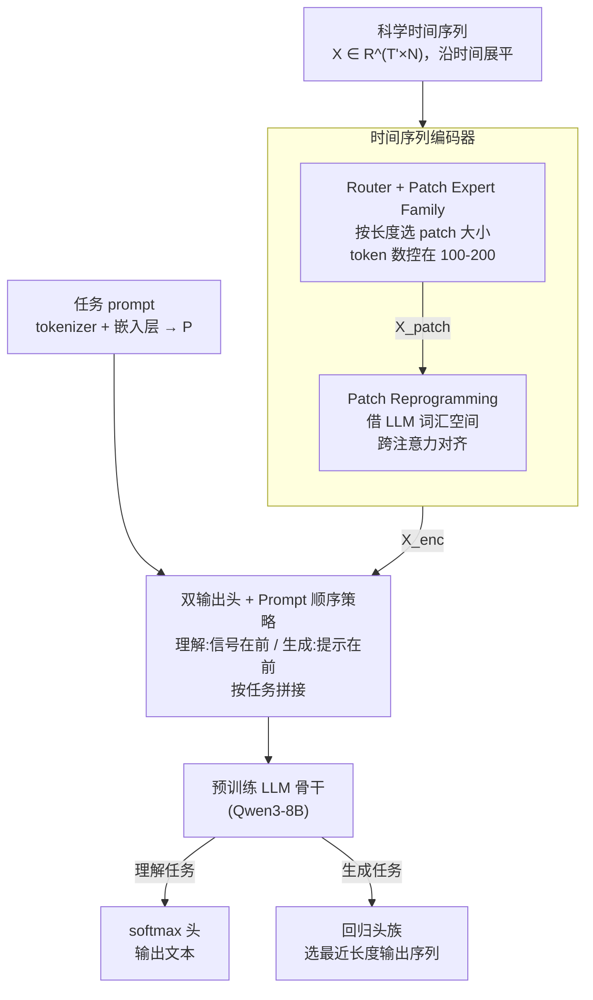

# SciTS: Scientific Time Series Understanding and Generation with LLMs

**会议**: ICLR 2026  
**arXiv**: [2510.03255](https://arxiv.org/abs/2510.03255)  
**代码**: [https://github.com/OpenTSLab/TimeOmni](https://github.com/OpenTSLab/TimeOmni)  
**领域**: 时间序列  
**关键词**: 科学时间序列, LLM, benchmark, 多任务统一模型, patch expert

## 一句话总结

本文提出 SciTS——一个覆盖 12 个科学领域、43 个任务、54K+ 样本的科学时间序列基准，并构建 TimeOmni 框架通过多 patch expert 路由和 LLM 骨干统一处理理解和生成两类时间序列任务，在全基准上取得最佳综合表现。

## 研究背景与动机

**领域现状**：LLM 的科学推理能力备受关注，但时间序列作为科学数据的基础模态被严重忽视。现有多模态 LLM 要么将数值序列编码为文本（序列过长），要么转为图像（丢失数值精度），都不足以全面理解科学时间序列。

**现有痛点**：现有统一时间序列模型通常只专注于预测或分析单一任务类型。更重要的是，它们主要在周期性商业数据（天气、交通、金融）上训练和评估，面对非周期性、异质性极强的科学信号（引力波、脑电图、生物声学）时效果不明。

**核心矛盾**：科学时间序列的多样性极端——频率从日级到 MHz 级，长度从几个点到百万级，维度从单变量到 58 通道，任务从分类到合成。现有模型和基准都无法覆盖这种多样性。

**本文目标**：(1) 构建覆盖面最广的科学时间序列基准；(2) 全面评测 17 个 SOTA 模型的科学时间序列处理能力；(3) 提出 TimeOmni 作为工作示例探索 LLM 处理科学时间序列的关键要素。

**切入角度**：科学领域的时间序列（天文光变曲线、地震波、EEG 等）与商业领域有本质不同，需要专门的基准和方法。通用 LLM 的泛化能力可能比专用时间序列模型更强。

**核心 idea**：构建大规模科学时间序列基准 SciTS 全面评估，同时提出 TimeOmni 作为探索方案——通过多 patch expert 自适应选择 patch 大小处理不同尺度的信号，统一理解和生成任务。

## 方法详解

### 整体框架

TimeOmni 接收时间序列信号 $\mathbf{X} \in \mathbb{R}^{T' \times N}$ 和任务 prompt。时间序列先沿时间维度展平，经时间序列编码器（Time Series Encoder）编码：先由 Router 按信号实际长度选出合适的 Patch Expert 把序列切片成 token，再经 Patch Reprogramming 借 LLM 词汇空间对齐，得到 $\mathbf{X}_{enc} \in \mathbb{R}^{T_{enc} \times D_{llm}}$（其中 $T_{enc}$ 通常 100-200）。Prompt 经文本 tokenizer 编码为 $\mathbf{P}$。两者按任务类型调换顺序后拼接，输入预训练 LLM 骨干。最后由双输出头分流：理解任务过 softmax 输出文本，生成任务过回归头输出时间序列。

### 关键设计

**1. Router + Patch Expert Family：让一套编码器吃下从几个点到百万级的信号**

科学信号的长度横跨 $10^0$ 到 $10^7$ 个数量级，任何固定的 patch 大小都会顾此失彼——切太细则编码后 token 数爆炸、超出 LLM 上下文，切太粗又丢掉关键细节。TimeOmni 的做法是先让 Router 看信号的实际长度再决定怎么切。对展平后长度为 $T = NT'$ 的输入，Router 选择 patch 大小 $D_{patch}$，使编码后的序列长度稳定落在 100–200 之间，即 $T/200 < D_{patch} < T/100$。选定后，对应的 Patch Expert 把输入 reshape 成 $\mathbb{R}^{\lceil T/D_{patch} \rceil \times D_{patch}}$，再用 1D 卷积映射到统一维度 $D_{enc}$。不同 patch 大小各配一个专属的 Patch Expert，于是无论信号长短，最终交给 LLM 的 token 数都被控制在一个既不溢出上下文、又保留足够信息的窗口里。

**2. Patch Reprogramming：用 LLM 自己的词汇空间来"翻译"时间序列**

把时间序列嵌入直接塞进 LLM 会撞上模态鸿沟——数值表示和语言表示根本不在一个空间里。这里的办法是借 LLM 已有的语义空间来重新表示时间序列：取词汇嵌入 $\mathbf{E} \in \mathbb{R}^{vocab\_size \times D_{llm}}$，先线性投射到 $\mathbb{R}^{1000 \times D_{llm}}$ 压成一组语义原型，再做一次多头交叉注意力，让 patch 嵌入 $\mathbf{X}_{patch}$ 作为 query、$\mathbf{E}$ 作为 key/value 去检索，最后线性投射得到编码输出。相当于每段时间序列都被表达成 LLM 词汇语义的加权组合，时间序列和语言的表示空间因此被隐式对齐，后续 LLM 处理起来就顺了。

**3. 双输出头 + Prompt 顺序策略：一个模型同时干理解和生成两件事**

理解任务要输出文本、生成任务要输出时间序列，两者天然冲突；而且两类任务"先看什么后看什么"的依赖方式也不同。TimeOmni 用两套机制拆解这对矛盾。输出端预备双头：理解走 softmax 生成文本 token，生成则把输出展平后经线性层映射为目标长度的时间序列，并预定义多个回归头覆盖不同输出长度、由模型自动选最接近的那个。输入端则按任务调换信号和提示的顺序——理解用 Prompt-as-suffix（信号在前、提示在后），让模型先把数据看完再读问题；生成用 Prompt-as-prefix（提示在前、信号在后），让模型先吃透任务要求再处理数据。

### 损失函数 / 训练策略

TimeOmni 基于 Qwen3-8B 初始化，使用 DoRA 微调。理解任务用标准语言模型的交叉熵损失，生成任务用回归损失。训练数据为 SciTS 的 54K+ 样本。

## 实验关键数据

### 主实验

| 模型类别 | 代表模型 | 理解 AvgRk | 生成 AvgRk | 任务覆盖率 | 成功率 |
|---------|---------|-----------|-----------|----------|--------|
| Text LLM | GPT-4.1-mini | 6.1 | 6.7 | ~90% | 中等 |
| MLLM | Gemini2.5-Flash | 5.8 | - | ~95% | 中等 |
| 时序模型 | UniTS | 7.9 | - | ~30% | 高(支持的任务) |
| TimeOmni | Qwen3-8B base | **1.9** | **1.4** | **100%** | **100%** |

### 消融实验

| 分析维度 | 关键发现 |
|---------|---------|
| 文本 vs 图像输入 LLM | 图像输入在理解任务上通常更好（压缩长序列效果更好） |
| 通用 LLM vs 专用时序模型 | 在未见科学域上 LLM 泛化能力更强 |
| 开源 vs 闭源 LLM | 闭源模型任务覆盖率和成功率更高 |
| 多 Patch Expert vs 固定 patch | 多 expert 路由对不同尺度信号至关重要 |

### 关键发现

- SciTS 极具挑战性：即使是最强的闭源 LLM，在天文学、神经科学等域的 F1 也很低（<15%），生物声学和雷达几乎低于 10%
- 通用 LLM 在未见过的科学域上泛化能力优于专用时间序列模型——专用模型虽然在支持的任务上成功率高，但任务覆盖面极窄
- TimeOmni 是唯一实现 100% 任务覆盖和 100% 实例成功率的模型，证明了显式时间建模+LLM 骨干的优势

## 亮点与洞察

- **SciTS 基准**本身是一项重要贡献——12 个科学领域、7 种任务类型、频率/长度/维度跨越多个数量级，填补了科学时间序列评估的空白
- **多 Patch Expert 路由**的设计简洁有效，通过控制编码后 token 数在 100-200 之间，优雅地解决了科学信号长度跨度大的问题
- **"通用 LLM 泛化强于专用模型"**这个发现很重要——说明在数据稀缺的科学领域，LLM 的预训练知识比专用架构更有价值

## 局限与展望

- TimeOmni 需要在 SciTS 上微调，零样本能力未验证——是否能泛化到 SciTS 未覆盖的科学领域尚不清楚
- 展平多变量信号为单维度的方式可能丢失通道间的相关性信息
- 生成任务预定义固定的回归头集合，缺乏灵活性
- 基准中合成数据的比例和质量可能影响评估的代表性

## 相关工作与启发

- **vs UniTS (Gao et al., 2024)**: UniTS 也统一问答和预测，但架构独立不兼容 LLM 训练；TimeOmni 可直接嵌入通用 LLM
- **vs Time-MoE (Shi et al., 2025)**: Time-MoE 用 MoE 做时间序列预测，但只支持预测任务；TimeOmni 覆盖 7 种任务
- **vs SFE (Zhou et al., 2025)**: SFE 用图像格式的科学基准，丢失了数值精度；SciTS 直接用时间序列格式保留完整信息

## 评分

- 新颖性: ⭐⭐⭐⭐ 基准贡献突出，TimeOmni 方法部分偏增量式组合
- 实验充分度: ⭐⭐⭐⭐⭐ 17个模型、43个任务、12个领域的全面对比
- 写作质量: ⭐⭐⭐⭐ 结构清晰，基准描述详尽
- 价值: ⭐⭐⭐⭐⭐ SciTS 基准对科学 AI 领域有长期价值

<!-- RELATED:START -->

## 相关论文

- [\[ICLR 2026\] TimeOmni-1: Incentivizing Complex Reasoning with Time Series in Large Language Models](timeomni-1_incentivizing_complex_reasoning_with_time_series_in_large_language_mo.md)
- [\[ICLR 2026\] Omni-iEEG: A Large-Scale, Comprehensive iEEG Dataset and Benchmark for Epilepsy Research](omni-ieeg_a_large-scale_comprehensive_ieeg_dataset_and_benchmark_for_epilepsy_re.md)
- [\[ICLR 2026\] A Unified Federated Framework for Trajectory Data Preparation via LLMs](a_unified_federated_framework_for_trajectory_data_preparation_via_llms.md)
- [\[ICLR 2026\] EDINET-Bench: Evaluating LLMs on Complex Financial Tasks using Japanese Financial Statements](edinet-bench_evaluating_llms_on_complex_financial_tasks_using_japanese_financial.md)
- [\[ICML 2026\] TimeOmni-VL: Unified Models for Time Series Understanding and Generation](../../ICML2026/time_series/timeomni-vl_unified_models_for_time_series_understanding_and_generation.md)

<!-- RELATED:END -->
