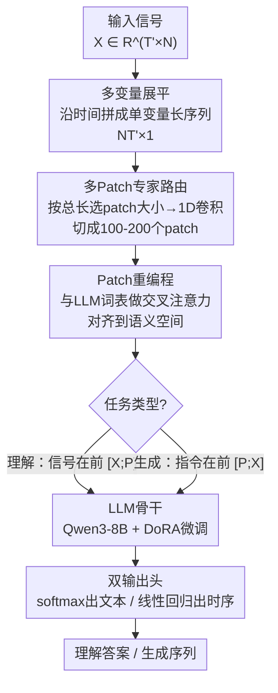

# SciTS: Scientific Time Series Understanding and Generation with LLMs

## 一句话总结
提出SciTS基准覆盖12个科学领域43个任务54K+实例（长度从$10^0$到$10^7$、频率达10MHz），系统评估17个模型发现通用LLM比专用时序模型泛化更好但文本/图像编码各有局限，据此设计TimeOmni框架用多Patch专家+路由机制+Patch重编程显式建模时间动态并与LLM联合训练。

## 研究背景与动机

**领域现状**：LLM的科学推理能力近年受到广泛关注，时间序列作为科学数据中最基本的模态之一（物理、天文、生物、工程等），却在当前多模态LLM中被严重忽视。现有方法要么将数值序列编码为文本（产生极长序列），要么转换为图像（损失数值精度），均不能充分支撑科学时序的理解与生成。

**现有局限**：(1) 现有时序基准主要集中在预测/异常检测等常规任务，缺乏对科学领域（天文、地球科学、神经科学等）的覆盖；(2) 统一时序模型要么只做预测要么只做分析，无法同时处理理解+生成；(3) 科学时序信号异质性极大（天文光变曲线 vs 脑电信号 vs 地震波 vs 雷达通信），现有模型难以适配。

**切入角度**：构建首个全面的科学时序基准SciTS → 系统评估发现问题 → 设计LLM-native的时序处理框架TimeOmni。

**关键挑战**：科学时序信号频率跨度从$10^{-5}$Hz到$10^7$Hz，长度从几个点到百万级别，维度从1到58，这种极端异质性对统一建模提出了严峻挑战。

**已有尝试的不足**：UniTS虽然整合了QA和预测，但依赖独立的架构设计，不兼容通用LLM训练。Moirai、TimeMoE等专用模型仅支持预测，无法处理填补、事件定位等任务。

**本文动机**：需要一个既能利用LLM的推理和知识能力，又能显式建模时间动态的统一框架，同时保持与通用LLM训练管线的兼容性。

## 方法详解

### 整体框架

TimeOmni 要解决的核心难题是：让一个通用 LLM 既能"读懂"又能"生成"频率跨 12 个数量级、长度从几个点到百万级的科学时序。它的做法不是把数值硬转成文本或图像，而是把一个"显式时序编码器"嫁接到通用 LLM 上，让数值序列以原始精度被编码、再对齐进 LLM 的语义空间。整条流水线串起三个部件：时序编码器（路由器 + Patch 专家族 + Patch 重编程）、LLM 骨干（Qwen3-8B 配 DoRA 微调）、任务特定输出头（理解任务用 softmax 出文本，生成任务用线性回归头）。

数据怎么流：给定输入信号 $\mathbf{X} \in \mathbb{R}^{T' \times N}$，先沿时间维展平成单变量长序列 $\mathbf{X}' \in \mathbb{R}^{NT' \times 1}$；路由器按展平后的总长度挑一个合适的 patch 专家，把信号切成 100-200 个 patch；这些 patch 经重编程模块借 LLM 词表对齐到语义空间，得到 $\mathbf{X}_{\text{enc}} \in \mathbb{R}^{T_{\text{enc}} \times D_{\text{llm}}}$（$T_{\text{enc}}$ 落在 100-200）；最后按任务类型与文本提示嵌入按不同顺序拼接，喂给 LLM，再由对应输出头给出文本答案或时序。

### 关键设计

**1. 多Patch专家路由：让任意长度信号都落到 100-200 个 token**

科学时序的长度跨度极大，从 $10^0$ 到 $10^7$，固定 patch 大小根本兜不住——patch 太小时长序列的 patch 数会爆炸吃光内存，patch 太大时短序列又会坍缩成单个 patch 丢光信息。TimeOmni 用一个路由器按展平后的总长度 $T = NT'$ 挑选 patch 大小 $D_{\text{patch}}$，约束它落在 $\frac{T}{200} < D_{\text{patch}} < \frac{T}{100}$ 之间，这样无论原始信号多长，切出来的 patch 数都被压在 100 到 200 之间。被选中的 Patch 专家把信号从 $\mathbb{R}^{T \times 1}$ 重塑为 $\mathbb{R}^{\lceil T/D_{\text{patch}} \rceil \times D_{\text{patch}}}$，再用 1D 卷积映射到 $\mathbf{X}_{\text{patch}} \in \mathbb{R}^{\lceil T/D_{\text{patch}} \rceil \times D_{\text{enc}}}$。这种 scale-adaptive patching 把"序列过长"和"信息坍缩"这对矛盾一次性化解，也是后面消融里固定 patch 大小会让极端长度序列性能严重退化的原因。

**2. Patch重编程：借 LLM 自己的词表把时序对齐到语义空间**

直接把时序嵌入塞进 LLM 会撞上模态不对齐的墙，因为 LLM 从没在数值 patch 上训练过。TimeOmni 的做法（沿用 Time-LLM 的 reprogramming 思路）是拿 LLM 已有的词嵌入 $\mathbf{E} \in \mathbb{R}^{\text{vocab\_size} \times D_{\text{llm}}}$ 当桥梁，先用线性层把它压缩到 $\mathbb{R}^{1000 \times D_{\text{llm}}}$ 的一组语义原型，再让 patch 表示以 query 身份、词嵌入以 key/value 身份做多头交叉注意力：

$$\mathbf{X}_{\text{enc}} = \text{Linear}(\text{CrossAttn}(\mathbf{X}_{\text{patch}}, \mathbf{E}, \mathbf{E}))$$

换句话说，每个时序 patch 被重写成 LLM 词表语义的加权组合，落进 LLM 本就熟悉的表示空间。消融里把这个模块换成简单 MLP 后性能一致下降，说明"借词表对齐"确实比硬投影更能消除模态鸿沟。

**3. Prompt策略与双输出头：理解先看数据、生成先看指令**

理解和生成两类任务的认知流程是反的，所以拼接顺序和输出方式也分开设计。理解任务（分类/异常检测/QA）走 Prompt-as-suffix，把信号放前、问题放后拼成 $[\mathbf{X}_{\text{enc}}; \mathbf{P}]$，模拟人先观察数据再回答，输出经 softmax 生成文本 token；生成任务（预测/填补/合成）走 Prompt-as-prefix，把指令放前、信号放后拼成 $[\mathbf{P}; \mathbf{X}_{\text{enc}}]$，先理解任务要求再处理信号，输出经展平加线性层映射回目标时序长度。由于生成长度各异，框架预定义了一组覆盖不同输出长度的回归头，运行时按最近长度匹配选头并做必要截断。

**4. 多变量信号处理：展平成单序列，让 patch 专家顺手吃掉跨通道依赖**

科学信号维度从 1 到 58 不等，若给每个通道单配编码器会让架构复杂度失控。TimeOmni 索性把 $\mathbf{X} \in \mathbb{R}^{T' \times N}$ 沿时间维展平为 $\mathbf{X}' \in \mathbb{R}^{NT' \times 1}$，统一当一条单变量长序列处理，再交给上面的路由器按展平后的总长度自动选 patch 大小。这样既复用了同一套 scale-adaptive patching，又让卷积 patch 专家在展平序列上自然捕捉跨通道的时间依赖；代价是丢掉一部分通道间的结构信息（如 EEG 的空间拓扑），这一点也在局限里被点名。

## 实验关键数据

### 理解任务结果（F1%，各学科平均）

| 模型 | 天文 | 生物声学 | 地球科学 | 经济 | 气象 | 制造 | 神经科学 | 生理 | 雷达 | 城市 | 平均排名 |
|------|------|---------|---------|------|------|------|---------|------|------|------|---------|
| GPT-4.1-mini | 41.4 | 6.7 | 67.0 | 90.4 | 45.3 | 31.7 | 13.5 | 26.8 | 17.6 | 64.4 | 6.1 |
| Gemini2.5-Flash | 40.2 | 10.3 | 67.6 | 87.8 | 51.8 | 28.8 | 12.7 | 31.8 | 17.2 | 64.6 | 5.5 |
| GPT-5-mini (多模态) | 42.3 | 10.7 | 67.6 | 83.8 | 45.3 | 38.4 | 13.9 | 25.0 | 16.5 | 64.8 | 6.0 |
| UniTS | 38.2 | 8.1 | 0.0 | 27.1 | 9.8 | 48.5 | 25.9 | 22.9 | 10.6 | 67.4 | 7.9 |
| ChaTS | 11.3 | — | 64.8 | 79.2 | 51.2 | — | 22.7 | 30.9 | 13.9 | 65.4 | 9.2 |
| **TimeOmni** | **73.2** | **58.1** | **82.5** | **96.4** | **61.3** | **82.0** | **60.1** | **45.9** | **68.9** | **64.8** | **1.9** |

### 生成任务结果（swMAPE，越低越好）

| 模型 | 天文 | 地球科学 | 气象 | 经济 | 神经科学 | 能源 | 生理 | 城市 | 数学 | 平均排名 |
|------|------|---------|------|------|---------|------|------|------|------|---------|
| GPT-4.1-mini | 100.9 | 65.0 | 85.0 | 112.2 | 61.4 | 2.0e3 | 610.6 | 670.0 | 1.2e3 | 6.7 |
| Gemini2.5-Flash | 116.6 | 63.0 | 107.5 | 4.5 | 38.7 | 307.6 | 60.5 | 391.4 | 477.5 | 4.6 |
| Moirai-Large | — | — | 51.7 | 1.8 | — | — | — | — | 360.1 | 8.3 |
| UniTS | 3.3e6 | — | 42.0 | — | 147.3 | — | 216.3 | — | — | 9.8 |
| **TimeOmni** | **2.8** | **2.2** | **37.5** | **5.3** | **46.6** | **66.4** | **91.7** | **402.7** | **656.5** | **4.1** |

## 关键发现

1. **通用LLM泛化优于专用TS模型**：在SciTS的12个科学领域上，通用LLM（如GPT-4.1-mini、Gemini2.5-Flash）展现了比专用时序模型（Moirai、TimeMoE等）更强的跨领域泛化能力。专用模型在训练分布外的科学信号上表现急剧退化。

2. **文本vs图像编码的任务依赖性**：理解任务中图像输入优于文本输入（高层理解不依赖精确数值，且图像压缩长序列更有效）；生成任务中文本输入优于图像输入（数值精确性至关重要）。这揭示了两种编码方式的互补性和各自局限。

3. **SciTS极具挑战性**：生物声学和雷达领域F1值普遍低于10%，高频长序列（百万级采样点）导致大量模型context溢出或指令遵循失败。开源LLM约10%的任务完全无法处理。

4. **TimeOmni实现全覆盖+全成功**：TimeOmni是唯一一个在所有43个任务上都能成功处理所有实例的模型，同时在理解（平均排名1.9）和生成（平均排名4.1）任务上均达到最优或接近最优。

5. **消融实验验证关键设计**：(1) Patch重编程替换为MLP→性能一致下降；(2) 固定patch大小→极端长度序列性能严重退化；(3) 微调Qwen2.5VL和TimeMoE无法弥补架构局限→问题源于架构而非训练数据。

## 亮点与洞察

- **SciTS填补重要空白**：首个覆盖12个科学领域的时序基准，包含7种任务类型和极端异质信号（频率跨12个数量级），为LLM处理科学时序提供了标准化评估平台。
- **"通用 > 专用"的反直觉发现**：专用时序模型在非周期性科学信号上反而不如通用LLM，说明LLM的通用推理与世界知识比领域特化设计更重要。
- **Patch路由机制的理论优雅性**：通过约束$T/200 < D_{\text{patch}} < T/100$，将任意长度信号统一映射到100-200个token，既避免了序列过长问题，又保证了信息密度，设计简洁而有效。
- **框架兼容性设计**：TimeOmni可无缝集成到通用LLM训练管线，与其他模态（文本/图像/音频）联合训练，这为构建真正的科学多模态LLM奠定基础。

## 局限性

- 所有基线模型均在零样本设置下评估，未进行领域特定微调，可能低估了部分模型的真实能力。
- TimeOmni基于Qwen3-8B微调，模型规模相对较小，scaling效果未充分探索。
- SciTS数据主要来自开源数据集和模拟数据，与真实科学研究中的原始实验数据可能存在分布差异。
- 多变量信号简单展平可能丢失通道间的结构信息（如EEG的空间拓扑关系）。
- 闭源LLM的"thinking"模式未被评估（初步实验表明无改善但成本高昂）。

## 相关工作与启发

### vs Chronos/Moirai/TimeMoE（专用时序模型）
这些模型在特定预测任务上表现很好（如Moirai在经济和数学领域的swMAPE最低），但**任务覆盖率极低**（仅支持预测），无法处理分类、QA、填补等任务。SciTS的评估揭示了它们在科学领域的泛化瓶颈：专为常规周期性信号设计的架构无法适应异质科学信号。

### vs UniTS/ChaTS（统一时序模型）
UniTS尝试整合QA和预测但依赖独立架构无法融入LLM训练；ChaTS支持分析任务但对部分领域（生物声学、制造）完全失效。TimeOmni通过LLM-native设计**同时实现了理解和生成的统一**，并保持LLM训练兼容性。

### vs 多模态LLM（GPT-5-mini/InternVL/QwenVL）
图像编码在高层理解任务上有优势（压缩长序列），但在需要数值精度的生成任务上严重受限。TimeOmni通过显式时序编码器避免了文本/图像编码的两难，在两类任务上均表现优异。

## 评分

- **新颖性**: ⭐⭐⭐⭐⭐ 首个全面科学TS基准+LLM-native TS框架，填补重要空白
- **实验充分度**: ⭐⭐⭐⭐⭐ 17模型×43任务×12领域的大规模系统评估+消融实验
- **写作质量**: ⭐⭐⭐⭐ 基准设计严谨，图表信息量大，motivation清晰
- **价值**: ⭐⭐⭐⭐⭐ 对LLM科学应用有重要推动，基准和框架均开源

<!-- RELATED:START -->

## 相关论文

- [\[ICLR 2026\] Rating Quality of Diverse Time Series Data by Meta-learning from LLM Judgment](rating_quality_of_diverse_time_series_data_by_meta-learning_from_llm_judgment.md)
- [\[ICML 2026\] TimeOmni-VL: Unified Models for Time Series Understanding and Generation](../../ICML2026/time_series/timeomni-vl_unified_models_for_time_series_understanding_and_generation.md)
- [\[ICLR 2026\] CTBench: Cryptocurrency Time Series Generation Benchmark](ctbench_cryptocurrency_time_series_generation_benchmark.md)
- [\[ICLR 2026\] Understanding Transformers in Time Series Forecasting: A Case Study on MOIRAI](understanding_transformers_for_time_series_forecasting_a_case_study_on_moirai.md)
- [\[AAAI 2026\] Finding Time Series Anomalies using Granular-ball Vector Data Description](../../AAAI2026/time_series/finding_time_series_anomalies_using_granular-ball_vector_data_description.md)

<!-- RELATED:END -->
