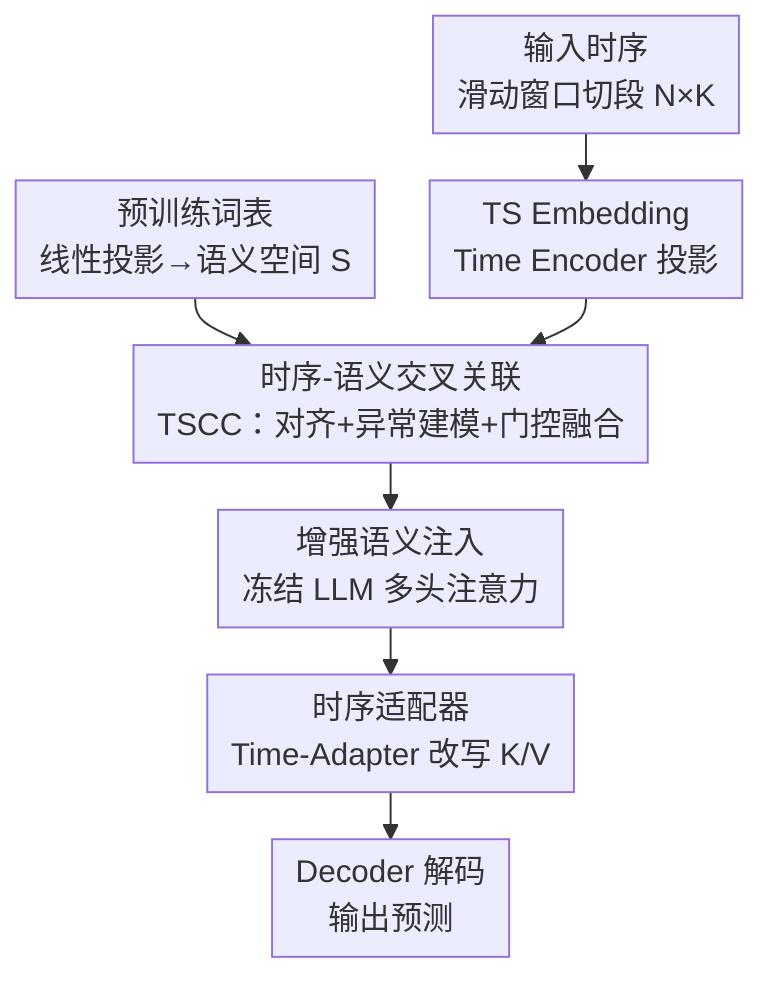

# Semantic-Enhanced Time-Series Forecasting via Large Language Models

**会议**: ICLR 2026  
**OpenReview**: [https://openreview.net/forum?id=GZ9uSxY3Yn](https://openreview.net/forum?id=GZ9uSxY3Yn)  
**代码**: https://github.com/LH325/SE-LLM  
**领域**: 时间序列预测 / LLM4TS  
**关键词**: 时间序列预测, 大语言模型, 语义增强, 异常建模, 适配器微调

## 一句话总结
SE-LLM 把时间序列的周期与异常特性注入预训练 LLM 的语义空间来增强 token 表示（TSCC 模块），再用一个内嵌 LSTM 的适配器（Time-Adapter）补齐 LLM 对长短期时序依赖的建模能力，在冻结 LLM、压缩序列长度的前提下做到长/短期与零样本预测全面 SOTA。

## 研究背景与动机
**领域现状**：用 LLM 做时间序列预测是近两年的热门方向。主流做法是把时序数据投影成 embedding，再和 LLM 预训练词表的语义空间做对齐，或者把时序转成文本 prompt 喂给冻结的 LLM（如 Time-LLM、S2IP-LLM、LLM4TS），借 LLM 的泛化能力捕捉时序依赖。

**现有痛点**：这些方法绝大多数停留在 **token 级别的模态对齐**——把时序 embedding 和语义空间对齐后当成隐式 prompt 引导 LLM。但 token 级对齐忽略了时序内部的**时间依赖和通道依赖**，难以刻画动态变化的时序模式；引入文本描述又会带来噪声和额外算力开销。

**核心矛盾**：语言知识的结构和时序数据的模式之间存在**本质的模态鸿沟**。LLM 的 Transformer 擅长捕捉长程依赖，却天然弱于建模时序里**短期异常/突变**；而把所有参数都微调又会破坏 LLM 预训练得到的通用语义能力，导致跨域不稳定。

**本文目标**：在不微调 LLM 主干的前提下，(1) 让 token embedding 真正携带时序模式（含周期与异常）而非只做表面对齐；(2) 补齐 LLM 对长短期时序依赖的建模短板。

**切入角度**：作者观察到，由 token 和时间步共同构成的语义空间里其实蕴含可被利用的结构先验。如果能把时序的异常/去异常模式显式拆出来注入语义空间，token 对 LLM 就有了更高的**可解释性**，等于给 LLM 喂了一个带时序语义的隐式 prompt。

**核心 idea**：用「语义增强」替代「token 对齐」——通过跨模态对齐 + 异常建模 VAE + 门控融合把时序模式灌进语义空间（TSCC），再用一个 LSTM 适配器把这些语义转成 LLM 的时序建模能力（Time-Adapter）。

## 方法详解

### 整体框架
SE-LLM 的输入是一段批量时序矩阵（batch $B$、长度 $L$）。先用**滑动窗口**把时间维切成 $N$ 个长度为 $K$ 的片段，得到 $\tilde{T}\in\mathbb{R}^{B\times N\times K}$，这一步把 LLM 实际处理的序列长度从 $L$ 降到 $N$，自注意力复杂度从 $O(L^2)$ 降到 $O(N^2)$，是「冻结 LLM + 省算力」的基础。

切段后兵分两路：一路经 Time Encoder 投影成 TS Embedding $H=F_2(\sigma(F_1(\tilde{T})))\in\mathbb{R}^{B\times N\times C}$；另一路把预训练词表矩阵 $W\in\mathbb{R}^{V\times C}$ 线性映射成语义空间 $S\in\mathbb{R}^{K_s\times C}$，作为通用语言先验。两者一起送进 **TSCC 模块**得到增强语义，再把增强语义注入冻结 LLM 的多头注意力——此处的 key/value 被 **Time-Adapter** 改写以补足时序依赖。最后 Decoder 把 LLM 输出解码成预测 $O=F_2(\sigma(F_1(Y)))$。整条管线只有 TSCC、Time-Adapter、编解码器是可训练的，LLM 全程冻结。

### 关键设计

**1. TSCC 模块：把时序的异常/去异常模式灌进语义空间**

这是针对「token 级对齐忽略时序动态」痛点的核心组件，内部有四步串联。**第一步跨模态对齐**：用 Cross Attention 把 TS Embedding $H$ 和语义空间 $S$ 对齐成联合空间（Joint Space）$C=\text{CrossAttn}(H,S)\in\mathbb{R}^{B\times N\times C}$，让时序特征自适应地融进语义先验。**第二步异常建模（AM-VAE）**：时序里的非平稳异常噪声会让预测偏差变大，作者用一个变分自编码器估计联合表示 $C$ 的隐分布——编码器预测均值 $\mu$ 与对数方差，经重参数化采样 $z=\mu+\epsilon\odot\sigma$，解码出**异常语义** $D_C=F_d(z)$，再用 $D_A=C-D_C$ 得到**去异常语义**。注意它不是直接预测未来观测，而是在语义隐空间里重建出和异常相关的分量，把异常显式拆出来。

**第三步结构先验注入**：先对时序和语义特征做 $L_2$ 归一化算相似度 $M=\text{Norm}_2(\text{Mean}_N(H))\times\text{Norm}_2(S)^T$（接近余弦相似度），按样本级相似度选出 top-K 语义原型聚合成结构先验，分别条件化 $D_A$ 和 $D_C$。**第四步通道依赖增强 + 门控融合**：把 TS Embedding 与 $D_A$/$D_C$ 拼接后过 MLP 得到通道注意力 $\text{Attn}_a=\text{MLP}([H,D_A])$，再门控融合把时序模式注回联合空间 $G_A=F_{llm}(\text{Attn}_a\odot H+(1-\text{Attn}_a)\odot D_A)$（$D_C$ 同理得 $G_C$）。最终 $Y=\text{LLM}(G_A+G_C)$——去异常语义与异常语义都被时序模式增强后融合，喂给 LLM 分析。这样得到的 token 对 LLM 而言可解释性更高，等于一个携带周期与异常信息的隐式 prompt。

**2. Time-Adapter：用 LSTM 替换低秩矩阵补齐 LLM 的长短期时序建模**

针对「Transformer 强于长程依赖、弱于短期异常」的痛点，作者在 LoRA 的框架上做改造：把 LoRA 原本的低秩矩阵**换成双线性层 + 两个串联 LSTM**。四步顺序执行——低秩投影降维、第一个 LSTM 把压缩特征升维捕捉长期依赖、第二个 LSTM 经反向投影（高维到低维）隔离局部短期动态、最后一个线性层把这些时序依赖整合进自注意力的 key $k$ 和 value $v$ 矩阵。和直接上 LoRA 的区别在于：普通适配器只增强 LLM 对语义结构的理解，并不为时序模式设计；Time-Adapter 用 LSTM 路径显式建模长短期依赖，并精准嵌在多头注意力的 K/V 上，让冻结的 LLM 真正获得处理时序的能力。实验里它在长期预测上明显优于 LoRA，证明 LoRA 缺乏对时序的泛化增益。

### 损失函数 / 训练策略
LLM 主干全程冻结，只训练 TSCC、Time-Adapter 与编解码器；AM-VAE 用重参数化技巧采样，配合常规预测损失端到端优化。滑动窗口把序列长度从 $L$ 压到 $N$，显著降低自注意力与 FFN 的算力消耗，使整个框架在冻结大模型的同时保持轻量。

## 实验关键数据

### 主实验
长期预测（输入长度 672，预测 {96,192,336,720}），MSE/MAE 越低越好：

| 数据集 | 指标 | SE-LLM | 最强基线 | 说明 |
|--------|------|--------|----------|------|
| ETTh1 | MSE/MAE | **0.381 / 0.415** | 0.396 / 0.419 (Time-CMA) | 全面领先 |
| Traffic | MAE | **0.261** | 0.274 (iTransformer) | MAE 相对降约 4.7% |
| ECL | MSE/MAE | **0.161 / 0.255** | 0.161 / 0.258 | 周期消费模式下最稳 |
| Solar | MSE/MAE | **0.192 / 0.242** | 0.207 / 0.246 (AutoTimes) | 季节/趋势显著场景领先 |

短期预测（M4，全子集平均）：SE-LLM 的 SMAPE 11.778 / MASE 1.578 / OWA 0.847，较次优分别约降 0.42% / 0.13% / 0.35%。零样本（M3↔M4 频率迁移）：M3→M4 SMAPE 13.024、M4→M3 12.560，均优于 AutoTimes（13.036 / 12.750），M4→M3 相对提升约 1.4%。

### 消融实验
TSCC 各组件消融（ETTh1，平均 MSE/MAE）：

| 配置 | MSE / MAE | 说明 |
|------|-----------|------|
| Full model | **0.381 / 0.415** | 四模块齐全最优 |
| w/o AM-VAE | 0.393 / 0.423 | 去掉异常建模，掉点明显 |
| w/o Cross Attn | 0.396 / 0.425 | 改成线性拼接，跨模态对齐变弱 |
| w/o Gated Fusion | 0.399 / 0.432 | 丢掉通道依赖建模，掉点最多 |
| w/o Semantic Space | 0.402 / 0.431 | 换成可学习参数矩阵，失去显式语义引导 |

逐模块叠加消融（Qwen2.5-0.5B，ECL/Traffic）：Baseline→+TSCC→+Time-Adapter，ECL 的 MSE 从 0.167→0.166→0.161，Traffic 从 0.405→0.389→0.386，两个创新模块逐步带来增益。

### 关键发现
- **门控融合（通道依赖）贡献最大**，去掉后掉点最猛（MSE 0.381→0.399），说明在跨模态融合后显式补回通道维信息至关重要。
- **AM-VAE 的收益不均匀**：对分布漂移强、不规则动态明显的数据集帮助大；对相对平稳的时序，显式建模随机变化收益较弱——作者诚实地指出了这一点。
- **Time-Adapter > LoRA**：在长期预测上 LoRA 缺乏泛化增益，而 Time-Adapter 用 LSTM 路径显式建模长短期依赖才真正让 LLM 适配预测任务。
- TSCC + Time-Adapter 作为**即插即用插件**接进 Time-LLM / AutoTimes / TimeCMA 后均能提升，验证了通用性。

## 亮点与洞察
- **把「异常」当成可建模的语义分量**：用 VAE 在语义隐空间重建 $D_C$、再相减得到 $D_A$，把时序里最难刻画的突变显式拆出来注入 LLM，比单纯 token 对齐多了一层时序语义，思路很巧。
- **改造 LoRA 而非另起炉灶**：保留 LoRA 的低秩注入位置（K/V），但把低秩矩阵换成 LSTM，既复用了高效微调的工程范式，又精准补上 Transformer 的时序短板，可迁移到其他「需要时序归纳偏置」的 LLM 微调场景。
- **冻结 + 切段降复杂度**：滑动窗口把 $O(L^2)$ 降到 $O(N^2)$，在不训练 LLM 的同时保证轻量，是效率与效果兼顾的实用设计。

## 局限与展望
- 作者承认 AM-VAE 的异常建模收益依赖数据特性，平稳序列上提升有限，缺乏一个自适应判断「何时该启用异常建模」的机制。
- top-K 语义原型选择在不同数据/架构上可能引入噪声或幅度扰动，需要额外归一化才能稳定，超参（K、片段长度 K）的敏感性正文披露不充分。
- 用 Qwen2.5-0.5B / GPT2 这类小模型验证，扩展到更大 LLM 时语义空间增强与算力收益的 trade-off 是否还成立有待观察。
- 异常建模与定性分析主要靠 STL 残差与 t-SNE 可视化佐证，缺少对「重建语义=真实异常」的定量度量。

## 相关工作与启发
- **vs Time-LLM / S2IP-LLM**: 它们把时序转成文本原型或语义 prompt 做 token 级对齐，本文认为这忽略了时间与通道依赖；SE-LLM 用 TSCC 把异常/去异常模式显式注入语义空间，对齐之外还携带时序动态。
- **vs LLM4TS / TimeCMA**: 同样冻结 LLM 做跨模态对齐，但本文额外用 Time-Adapter 改写注意力 K/V 补足长短期建模，且这两个模块能作为插件反哺它们带来提升。
- **vs AutoTimes（LoRA + GPT-2）**: AutoTimes 直接上 LoRA 做长程预测，本文实验显示 LoRA 时序泛化弱，Time-Adapter 用 LSTM 替换低秩矩阵后在长/短/零样本均更优。

## 评分
- 新颖性: ⭐⭐⭐⭐ 「异常语义分解 + LSTM 化适配器」组合切入 LLM4TS 的真实短板，角度新颖。
- 实验充分度: ⭐⭐⭐⭐ 长/短/零样本 + 多 LLM 主干 + 插件迁移消融齐全，但超参敏感性披露偏弱。
- 写作质量: ⭐⭐⭐⭐ 框架图与算法描述清晰，部分公式记号略密。
- 价值: ⭐⭐⭐⭐ 即插即用模块对 LLM4TS 社区有直接复用价值。

<!-- RELATED:START -->

## 相关论文

- [\[ICLR 2026\] TimeOmni-1: Incentivizing Complex Reasoning with Time Series in Large Language Models](timeomni-1_incentivizing_complex_reasoning_with_time_series_in_large_language_mo.md)
- [\[ICLR 2026\] Multi-Scale Hypergraph Meets LLMs: Aligning Large Language Models for Time Series Analysis](multi-scale_hypergraph_meets_llms_aligning_large_language_models_for_time_series.md)
- [\[ICML 2026\] Building Social World Models with Large Language Models](../../ICML2026/time_series/building_social_world_models_with_large_language_models.md)
- [\[ICML 2026\] Semantics-Enhanced Retrieval-Augmented Time Series Forecasting](../../ICML2026/time_series/semantics-enhanced_retrieval-augmented_time_series_forecasting.md)
- [\[ICLR 2026\] Towards Multimodal Time Series Anomaly Detection with Semantic Alignment and Condensed Interaction](towards_multimodal_time_series_anomaly_detection_with_semantic_alignment_and_con.md)

<!-- RELATED:END -->
