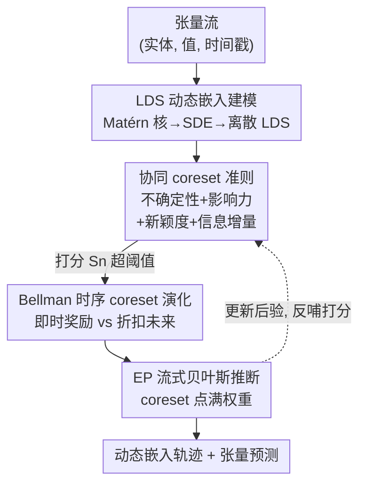

# SONATA: Synergistic Coreset Informed Adaptive Temporal Tensor Factorization

**会议**: ICLR 2026  
**OpenReview**: [https://openreview.net/forum?id=P1PZBR6a4S](https://openreview.net/forum?id=P1PZBR6a4S)  
**代码**: https://github.com/Applied-Machine-Learning-Lab/ICLR2026_SONATA  
**领域**: 时序张量分解 / 流式学习  
**关键词**: 动态张量流, 张量分解, coreset 选择, 线性动力系统, 贝叶斯流式推断

## 一句话总结
SONATA 把"表达力强的动态嵌入建模"和"自适应 coreset 样本筛选"统一进一个流式张量分解框架：用 Matérn 核导出的线性动力系统（LDS）刻画实体嵌入的多尺度时序演化，再用「不确定性 + 影响力 + 新颖度 + 信息增量」四准则打分、配合 Bellman 方程动态维护一个紧凑高信息量的 coreset，从而在只扫一遍数据流的前提下，把 CA Traffic 等数据集的 RMSE 相对次优方法压低多达 61.5%。

## 研究背景与动机
**领域现状**：现实中的多路数据（推荐、交通、环境监测、神经科学）天然是张量，而且越来越多地以"高速连续流"的形式到来。从这种流里在线学到能编码实体演化属性的动态嵌入 $u_j^{(k)}(t)$，是这个方向的核心任务。经典分解（CP、Tucker）只学静态嵌入；早期时序扩展把时间当成一个额外的 mode 或离散化处理；近期连续时间模型（CT-CP 用样条、THIS-ODE 用神经 ODE、NONFAT 等）才开始刻画连续演化。

**现有痛点**：作者点出两个长期并存的难题。其一是**建模表达力不足**——静态方法和简单时序扩展用的时序表示太粗糙，抓不住非平稳的复杂动态；连样条这类连续时间变体在不规则采样 / 流式场景下也很吃力。其二是**流式效率**——把流里每一个观测都拿来更新计算上不可承受，而现有流式方法要么不加区分地处理全部数据、要么用启发式采样。

**核心矛盾**：流式观测的"信息价值极不均匀"——大量样本是冗余的，只有一小撮样本对提升表示质量和预测精度起决定性作用。不显式地优先学习这些高价值样本，模型就会把算力浪费在低价值观测上，还可能漏掉最关键的那几个点。而要"只学最有用的样本"，又必须先有一个表达力够强的模型去评估"什么叫有用"——两件事必须同时解决。

**本文目标**：构造一个既有足够建模能力、又能原则性地筛选信息样本的流式张量分解框架，分解为两个子问题：(1) 如何用可处理流式 / 不规则时间的方式刻画细粒度、多尺度的时序演化；(2) 如何在线判断每个观测的价值并维护一个有限预算的高信息量子集。

**切入角度**：在表达力侧，把嵌入建模成由 Matérn 等表达性核导出的**线性动力系统（LDS）**，天然支持连续时间和多尺度动态；在效率侧，引入一个**动态 coreset**，联合评估不确定性、新颖度、影响力和信息增量来决定谁进 coreset，并用 Bellman 方程做面向长期收益的选择。

**核心 idea**：用"LDS 时序嵌入 + 四准则协同打分 + Bellman 长期优化的动态 coreset"，把表达性建模和样本高效性对齐到同一个流式贝叶斯推断里——据作者所知，这是第一个把时序考量完整纳入的 coreset 流式张量分解。

## 方法详解

### 整体框架
SONATA 处理的是 $K$-mode 张量流：数据以三元组 $(\ell_n, y_n, t_n)$ 持续到来，$\ell_n$ 是涉及的实体索引、$y_n$ 是 $t_n$ 时刻的观测值，目标是在线学到每个实体随时间变化的嵌入 $u_j^{(k)}(t)$ 并预测张量值。整条流水线可以理解成"先用动力系统给每个实体配一条平滑的嵌入轨迹，再对每个到来的样本算一个重要性分、决定它是否值得纳入 coreset，最后只用（或重点用）coreset 里的样本去做贝叶斯更新"。

具体地，每个实体的嵌入由 LDS 驱动，隐状态按随机微分方程（SDE）演化，观测嵌入是隐状态的线性投影；CP 形式把若干实体嵌入按元素积相乘求和得到张量值预测。每来一个候选样本，模型用四个准则（不确定性 / 影响力 / 新颖度 / 信息增量）合成重要性分 $S_n$，超过自适应阈值的点进入 coreset；coreset 的纳入 / 剔除被建模成一个序贯决策问题，用 Bellman 方程在"即时收益"和"折扣后的未来收益"之间权衡，避免只盯眼前的贪心。整套参数（嵌入、噪声精度）通过期望传播（EP）做流式贝叶斯更新，coreset 内的点拿满权重、coreset 外的点权重衰减。

### 关键设计

**1. LDS 驱动的动态隐因子模型：用核诱导的状态空间刻画多尺度时序演化**

这一步直接回应"建模表达力不足"的痛点。作者不再把时间当额外 mode 或粗糙离散化，而是给每个实体 $j$（mode $k$）的嵌入 $u_j^{(k)}(t)\in\mathbb{R}^R$ 配一条由底层隐状态 $x_j^{(k)}(t)\in\mathbb{R}^S$（$S\ge R$）驱动的连续轨迹。隐状态服从 SDE

$$\mathrm{d}x_j^{(k)}(t) = F\,x_j^{(k)}(t)\,\mathrm{d}t + L\,\mathrm{d}w(t),\qquad u_j^{(k)}(t)=H\,x_j^{(k)}(t),$$

其中动力矩阵 $F$、投影矩阵 $H$ 和稳态协方差 $P_\infty$ 都由所选的时序核（典型为 Matérn 族）决定。比如 Matérn-$\nu=3/2$ 核对应 $S=2R$，隐状态正好是 $[u_j^{(k)}(t)^\top, \dot u_j^{(k)}(t)^\top]^\top$——既建模嵌入本身、也建模它的变化速度。离散时间下 SDE 化为标准 LDS：$x_{j,t}^{(k)}=A(\Delta t)x_{j,t-\Delta t}^{(k)}+w$，其中 $A(\Delta t)=e^{F\Delta t}$、$Q(\Delta t)=P_\infty - A(\Delta t)P_\infty A(\Delta t)^\top$。这样做的好处是：核的选择直接控制轨迹的平滑度与时间尺度，连续时间形式天然容纳不规则采样和流式到达，比样条 / 加性时间 mode 更能抓住非平稳的多尺度动态；实验里 Matérn-3/2 比 Matérn-1/2 把 RMSE 又压低约 49% 也印证了这一点。

**2. 协同 coreset 构造准则：用四个互补准则合成一个重要性分**

这是论文最核心的贡献，针对"信息价值极不均匀、不能无差别处理"的痛点。SONATA 维护一个随时间动态更新的 coreset $C_t$，对每个候选点 $n$ 算重要性分

$$S_n = w_u\,I_{\text{unc}}(n) + w_i\,I_{\text{inf}}(n) + w_n\,I_{\text{nov}}(n) + w_m\,I_{\text{mart}}(n),$$

四项各管一个互补的角度。**不确定性** $I_{\text{unc}}$ 取该点涉及实体的预测协方差对角元（各维边际方差）在 $M$ 个 mode 上的平均，模型越没把握的点越值得学。**影响力** $I_{\text{inf}}$ 把点 $n$ 的交互向量 $z_n=\bigodot_m \mu^{(m)}_{\ell_{n,m}}$（各实体预测均值的 Hadamard 积，刻意对齐 CP 的元素积结构）与 coreset 已有成员做余弦相似度并取平均，衡量它和已选集合的关联度。**新颖度** $I_{\text{nov}}$ 是"索引新颖度"（$\ell_n$ 里有多少实体索引是 coreset 里没出现过的比例）和"时间新颖度" $1-\exp(-\lambda\,\Delta t_{\min})$（离 coreset 里最近时间戳越远越新）的加权和。**信息增量** $I_{\text{mart}}$ 是基于鞅的"惊讶度"，用预测平方误差 $\Delta E_n=(y_n-\hat y_n)^2$ 经 $\tanh(\alpha\cdot\max(0,\Delta E_n))$ 压到 $[0,1)$，估计纳入该点能带来多少误差下降。超过自适应阈值 $\theta_t$（并配 $\epsilon$-greedy 探索）的点进入 $C_t$；超出预算 $M_{\max}$ 时只保留 top-$M_{\max}$。四准则协同的意义在于：单一启发式（只看不确定性或只看误差）会偏科，而这四项分别覆盖"没把握 / 和已选不冗余 / 时空上新 / 能降误差"，合起来才能选出真正多样且高信息量的子集。

**3. Bellman 方程驱动的时序 coreset 演化：把样本选择做成面向长期收益的序贯决策**

只按当前 $S_n$ 贪心地挑点是短视的——某些点眼下分不高，但保留它能让未来学得更好。作者把"每一步选哪些候选进 coreset"建成最优停止 / 动态规划问题：定义价值函数 $V(C_t,\Theta_t)$ 表示给定当前 coreset 和参数下的期望未来模型表现，动作 $a_t$ 是从候选集 $\mathcal{D}_{\text{cand},t}$ 里选一个子集加入、并剔除 $P_t$ 以满足预算，得到 $C_{t+1}=(C_t\cup a_t)\setminus P_t$。选择由 Bellman 方程

$$V(C_t,\Theta_t)=\max_{a_t\subseteq \mathcal{D}_{\text{cand},t}}\Big[R(C_t,a_t,\Theta_t)+\gamma_B\,\mathbb{E}_{\Theta_{t+1}}\big[V(C_{t+1},\Theta_{t+1})\big]\Big]$$

驱动，即时奖励 $R$ 可取所选点重要性分之和或模型拟合 / 不确定性的即时改善，$\gamma_B\in[0,1]$ 折扣未来。求解（常用 lookahead 或值函数近似）让模型做"战略性"的数据保留，而非只图眼前。一个被实验佐证的副产物是：算法不会盲目填满预算——把 $M_{\max}$ 从 2000 提到 3000，最终 coreset 只从 1597 涨到 1654、利用率从 79.9% 跌到 55.1%，因为随着 coreset 变得有代表性，新颖度下降、不确定性降低、误差收敛，隐式的纳入阈值自动抬高。

### 损失函数 / 训练策略
SONATA 用流式贝叶斯方法在线学习动态隐因子 $\{u_j^{(k)}(t)\}$ 和观测噪声精度 $\tau$。每个时刻 $t_n$，Kalman 滤波的预测步给出隐状态先验 $p(x_{j,t_n}^{(k)}\mid D_{<t_n})$，进而得到嵌入先验。由于 CP 映射 $f(\cdot)$ 非线性、精确后验不可解，作者用**期望传播（EP）**近似后验 $p(\{u^{(k)}\},\tau\mid y_n, D_{<t_n})$；噪声精度 $\tau$ 的 Gamma 后验也按期望平方预测误差和 $f(\cdot)$ 的方差经 EP 更新。关键之处在于：**一个点是否在 coreset 里决定了它在消息更新里的权重**——coreset 点拿满权重、非 coreset 点权重衰减，从而让模型选择性地从最有信息的数据学习。整体上 SONATA 刻意只用成熟的统计机器学习技术（LDS、GP/核、EP），不依赖深度神经网络，在表达力和计算效率之间取得平衡。

## 实验关键数据

### 主实验
在四个真实数据集（CA Traffic 30K 交通、ServerRoom 机房、BeijingAir 环境、FitRecord 用户行为）上，秩 $R=5$、十次平均，SONATA 在 RMSE 上全面领先。最突出的是 CA Traffic 30K：相对次优的 SFTL-CP（0.231）把 RMSE 降到 0.089，相对降幅 61.5%（$p<0.05$），且全程只扫一遍数据。

| 数据集 (RMSE) | 本文 SONATA | 次优方法 | 提升 |
|--------|------|----------|------|
| CA Traffic 30K | **0.089** | 0.231 (SFTL-CP) | −61.5% |
| ServerRoom | **0.115** | 0.117 (NONFAT) | −1.7% |
| BeijingAir | **0.237** | 0.248 (SFTL-CP) | −4.4% |
| FitRecord | **0.414** | 0.424 (SFTL-CP) | −2.4% |

相对静态方法（需多趟扫描）和近期连续时间分解，SONATA 在单趟流式处理下仍取得更高精度，作者归因于：自适应跟随演化模式、天然侧重近期更具预测性的观测、避免过拟合非平稳噪声、以及 coreset 把学习聚焦到最有信息的样本。

### 消融 / 分析实验

| 配置 | 关键指标 | 说明 |
|------|---------|------|
| Matérn-3/2 vs 1/2 | RMSE 0.1293 vs 0.2539 | 换成更平滑的 3/2 核，RMSE 降 49.1%、MAE 降 47.0% |
| lengthscale 0.1/0.3/0.5/0.9 | RMSE 最低 0.1293 @0.3 | 太小过拟合噪声、太大过度平滑 |
| 运行时间 (Server) | 0.338s/iter | 比 THIS-ODE 的 7.19s 快一个量级，精度还更高 |
| $M_{\max}$ 2000→3000 | RMSE 0.0938→0.0891 | coreset 仅 1597→1654，利用率 79.9%→55.1%，呈饱和 |
| 折扣因子 $\gamma$ | Server 0.5 最优 / CA Traffic 0.9 最优 | $\gamma$ 的最优值随数据集而变 |

### 关键发现
- **核与 lengthscale 决定上限**：Matérn-3/2 显著优于 1/2，lengthscale=0.3 在 Server 上最优——说明"用对时序核"是表达力的关键来源，而非靠堆参数。
- **coreset 会自动饱和**：算法不盲目填满预算，1600 个高质量样本就够抓住数据流的本质信息，再加点边际收益骤降，验证了四准则协同抬高隐式阈值的机制。
- **$\gamma$ 的数据依赖性**：Server 偏好即时奖励（$\gamma=0.5$），CA Traffic 偏好长期效用（$\gamma=0.9$）；$\gamma=0$（纯贪心）在两者上都明显变差，证明 Bellman 长期优化确实有用。
- **coreset 因子更"干净"**：可视化显示 coreset 内因子轨迹结构清晰、有周期性（如每日备份），非 coreset 因子则杂乱噪声大，提供了信号-噪声区分。

## 亮点与洞察
- **把"选样本"和"建模型"耦合成一个闭环**：coreset 准则依赖模型当前的预测均值 / 协方差，模型又只重点学 coreset 的点——选择影响学习、学习反哺选择，比"先建模再采样"或"固定采样再建模"更自洽。
- **四准则的设计很有迁移价值**：不确定性 / 影响力 / 新颖度 / 信息增量这套"互补打分"思路可以搬到任何流式 / 主动学习场景，关键是让每个准则各管一个正交维度、避免单一启发式偏科。
- **influence 用 Hadamard 积对齐 CP 结构**：交互向量取实体嵌入的逐元素积，刻意复刻 CP 预测的计算方式，让"相似度度量"和"模型预测机制"对齐——这种"度量跟着模型走"的细节很巧妙。
- **不用深度网络也能打过神经 ODE**：纯 LDS+核+EP 的统计路线在精度和速度上同时压过 THIS-ODE，提醒大家在结构化时序问题上，经典贝叶斯状态空间仍极具竞争力且可解释。

## 局限与展望
- **张量分解的非唯一性**：作者自己承认学到的因子轨迹只是系统动态的一种解读，神经网络可能给出同样有效但不同的解释；轨迹的可解释性需谨慎对待。
- **超参较多且数据依赖**：四准则权重 $w_u,w_i,w_n,w_m$、阈值 $\theta_t$、衰减率 $\lambda$、缩放 $\alpha$、折扣 $\gamma_B$ 等都要调，且 $\gamma$、lengthscale 的最优值随数据集变化，缺乏自动选取方案。
- **Bellman 求解是近似的**：长期价值函数靠 lookahead / 值函数近似，论文未深入分析近似误差对最终 coreset 质量的影响。
- **CP 形式为主**：方法详解主要围绕 CP 分解展开，对 Tucker 等更一般结构的适配和效果讨论较少。

## 相关工作与启发
- **vs 流式张量方法（POST / ADF-CP / BASS-Tucker）**：它们增量更新 CP/Tucker 因子但缺乏连续时间动态建模；SONATA 用 LDS+Matérn 学多尺度时序，且全程领先这些 streaming baseline。
- **vs 连续时间分解（CT-CP / CT-GP / NONFAT / THIS-ODE）**：这些能刻画连续演化，但需要完整数据集和多 epoch 训练，不适合高速流；SONATA 单趟流式即可，且精度更高、比神经 ODE 快一个量级。
- **vs 张量 coreset 方法（如 Chhaya et al. 的 LineFilter/KernelFilter）**：前者局限于对称张量、产出静态 coreset、靠局部准则，忽略演化动态和长期效用；SONATA 联合四准则 + Bellman 长期优化，是首个完整纳入时序考量的 coreset 流式张量分解。

## 评分
- 新颖性: ⭐⭐⭐⭐⭐ 首次把"表达性 LDS 嵌入"和"四准则 + Bellman 动态 coreset"统一进流式张量分解，视角自然且此前缺失。
- 实验充分度: ⭐⭐⭐⭐ 四个真实数据集 + 合成数据 + 核 / lengthscale / 预算 / $\gamma$ 多维消融，但部分数据集提升幅度有限。
- 写作质量: ⭐⭐⭐⭐ 动机与方法叙述清晰、公式完整，符号偏多但自洽。
- 价值: ⭐⭐⭐⭐ 给流式 / 主动学习场景的"信息样本筛选"提供了一套可迁移的协同准则，且不依赖深度网络、可解释。

<!-- RELATED:START -->

## 相关论文

- [\[ICLR 2026\] Tensor learning with orthogonal, Lorentz, and symplectic symmetries](tensor_learning_with_orthogonal_lorentz_and_symplectic_symmetries.md)
- [\[ICLR 2026\] Improving Extreme Wind Prediction with Frequency-Informed Learning](improving_extreme_wind_prediction_with_frequency-informed_learning.md)
- [\[ICLR 2026\] Learning Mixtures of Linear Dynamical Systems via Hybrid Tensor-EM Method](learning_mixtures_of_linear_dynamical_systems_via_hybrid_tensor-em_method.md)
- [\[ICLR 2026\] ASTGI: Adaptive Spatio-Temporal Graph Interactions for Irregular Multivariate Time Series Forecasting](astgi_adaptive_spatio-temporal_graph_interactions_for_irregular_multivariate_tim.md)
- [\[ICLR 2026\] JAPAN: Joint Adaptive Prediction Areas with Normalising-Flows](japan_joint_adaptive_prediction_areas_with_normalising_flow.md)

<!-- RELATED:END -->
