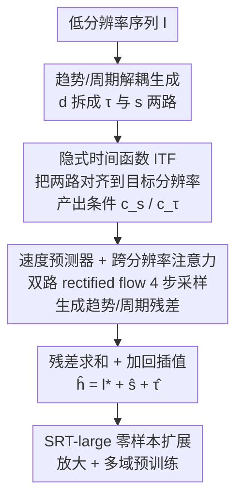

# SRT: Super-Resolution for Time Series via Disentangled Rectified Flow

**会议**: ICLR2026  
**OpenReview**: [https://openreview.net/forum?id=I94Eg6cu7P](https://openreview.net/forum?id=I94Eg6cu7P)  
**代码**: 待确认  
**领域**: 时间序列  
**关键词**: 时间序列超分、Rectified Flow、序列解耦、隐式神经表示、零样本

## 一句话总结
SRT 把图像超分的思路搬到时间序列上：先把低分辨率序列拆成趋势与周期两路、用隐式时间函数把它们对齐到目标分辨率，再用两个 rectified flow 模型配合跨分辨率注意力补出高频细节，在 9 个数据集上对采样型和聚合型两类超分任务都拿到 SOTA，且推理只需 4 步采样。

## 研究背景与动机

**领域现状**：细粒度、高时间分辨率的时间序列对下游分析至关重要——医疗里高分辨率心电能捕捉低频记录里被抹掉的细微心律失常，工业 IoT 的千赫兹振动信号能提前发现机械故障，气候建模也依赖时间上稠密的数据。但采集高分辨率数据常受设备电量、通信带宽、存储与算力等约束，导致现实中大量数据是被粗采样或被聚合过的。

**现有痛点**：一个自然的想法是把图像超分（image super-resolution）的成熟工具——GAN、扩散、flow matching——直接搬过来，从低分辨率序列重建高分辨率序列（作者称之为 TSSR，time series super-resolution）。但直接迁移效果往往不理想，因为图像和时间序列的先验本质不同、需要放缩的数据维度与轴也不一样，图像超分依赖的视觉先验在时序上并不成立。

**核心矛盾**：另一条看似相近的路是时序补全（imputation），它同样要"基于观测上下文推断缺失点"。但两者的缺失本质不同：补全处理的是一条本就高分辨率序列里随机缺的点，可以靠局部平滑、全局一致这类假设；而 TSSR 要从一条被系统性降采样的输入里**凭空合成本不存在的高频成分**（尖峰、瞬态抖动），平滑假设直接失效。更棘手的是，作者进一步区分出两类 TSSR：采样型 SSR（低分辨率值就是高分辨率某点的抽样，$l_i^{(k)}=h_i^{(p_k)}$）和聚合型 ASR（低分辨率值是一个窗口内的平均，$l_i^{(k)}=\frac{1}{\alpha}\sum_{j=p_k}^{p_{k+1}} h_i^{(j)}$）。ASR 因为原始高频分布被完全平均掉、只剩统计摘要，本质上更病态、更欠定。

**本文目标**：在一个统一框架里同时解决 SSR 和这个更难的 ASR，既要点对点准、又要整体形状像、还要把高频细节补真。

**切入角度**：作者的关键观察是——时间序列天然可以按趋势/周期解耦，两种成分的时序动态截然不同（趋势反映整体走向，周期反映短期规律波动），把它们分开建模既好拟合又能提升可解释性；同时低分辨率输入里其实埋着大量可用线索，应该显式拿来引导高频细节的生成，而不是让模型盲生成。

**核心 idea**：用序列解耦把 rectified flow 超分过程拆成趋势、周期两条并行流，再用从低分辨率序列里抽出的对齐条件去约束生成空间，让高分辨率细节"有据可补"。

## 方法详解

### 整体框架

SRT 不直接生成高分辨率序列 $h$，而是生成"细节残差" $d$——即把低分辨率输入做线性插值得到 $l^*$ 后，高分辨率真值相对 $l^*$ 丢失的那部分细节。整条管线是：把输入低分辨率序列用 Autoformer 式分解拆成趋势 $\tau$ 与周期 $s$ 两个分量（$d=s+\tau$，$\tau=\text{AvgPool}(\text{Padding}(d))$）；两路分量各自先经隐式时间函数（ITF）从长度 $L$ 对齐到目标长度，产出高分辨率条件 $c_s,c_\tau$；再用两个结构相同但独立的 rectified flow 速度预测器 $V_s,V_\tau$，以这些条件和原始低分辨率序列为引导，分别生成趋势/周期残差；最后把两路残差求和、加回线性插值的 $l^*$ 得到最终高分辨率结果 $\hat h=l^*+\hat s+\hat\tau$。SRT-large 则是把这套架构放大并大规模预训练，换取零样本超分能力。

### 关键设计

**1. 趋势/周期解耦的双路 rectified flow：把一个病态生成问题拆成两个好建模的子问题**

直接对整条残差 $d$ 做生成，混在一起的整体走向和短期波动会互相干扰、难以拟合。SRT 先用 Autoformer 的滑动平均分解把残差拆成趋势 $\tau$ 和周期 $s$，再用两条 rectified flow 各管一路。rectified flow 学的是从先验分布 $\pi_0$ 到目标 $\pi_1$ 的近乎直线的 ODE 传输路径：给定 $s_t=ts_1+(1-t)s_0$ 的线性插值路径，速度预测器 $V_s,V_\tau$ 被优化去拟合端点差，目标是
$$\min \int_0^1 \mathbb{E}\big[(s_1-s_0-V_s(s_t,t,c_s,l))^2+(\tau_1-\tau_0-V_\tau(\tau_t,t,c_\tau,l))^2\big]\,dt.$$
因为学到的传输路径近乎笔直，生成时只需 4 步 Euler 采样（$\hat s_{k_{i+1}}=\hat s_{k_i}+(k_{i+1}-k_i)V_s(\cdot)$，初值取标准高斯）就能高保真到达目标，而换成 DDPM 即便 200 步效果仍更差。这种解耦不只让拟合更容易，还提升可解释性——降雨从日聚合还原到小时时，趋势路反映高分辨率降水的整体移动趋势，周期路揭示短期规律涨落，两者贡献被显式隔离。

**2. 隐式时间函数 ITF：用隐式神经表示把低分辨率条件"插值"到目标时间轴**

两路分量要给 rectified flow 当条件，必须先从长度 $L$ 对齐到高分辨率时间轴 $H'$，但简单线性插值补不出有用的高频结构。ITF 借鉴隐式神经表示思路，把分量当成时间的连续函数、用一个可学习插值器跨越粒度鸿沟，分三步走。**时间富集（temporal enrichment）**：以半径 $r$ 取一组膨胀窗口偏移 $\delta\in\{\pm 2^i\}\cup\{0\}$，把窗口内各通道拼接进每个时间步，用膨胀窗口换取大感受野以捕捉长程依赖。**值预测（value prediction）**：给定原轴候选步 $j_c^{(o)}$ 及其富集值，用一个小网络 $g(\cdot;\phi)$ 预测目标轴第 $k^{(t)}$ 步的值，输入里带上两轴坐标差 $k^{(t)}-T(j_c^{(o)})$。**模式平滑（pattern smoothness）**：对趋势按局部性聚合——以与目标步的距离倒数 $w_{\Delta j}=1/|k^{(t)}-T((j_n+\Delta j)^{(o)})|$ 为权对邻近候选加权平均；对周期则额外把"隔一个主周期 $f$（FFT 取得）"的两个距离 $d_{-1},d_1$ 也纳入，权重取 $1/\min\{d_{-1},d_0,d_1\}$，让平滑既照顾局部又照顾周期性复现。此外 ITF 不一次跳到 $H$，而是按"每次放缩不超过 3 倍"的 schema 级联调用（如周→日的 $[3L,H]$ 用两级 ITF），避免一步放太大失真。

**3. 速度预测器与跨分辨率注意力 CRA：让生成同时看齐 ITF 条件和原始低分辨率值**

速度预测器是 decoder-only Transformer，在原始设计上加了 RoPE、Pre-LN，核心是为速度预测专门设计的跨分辨率注意力（CRA）。CRA 由两层级联交叉注意力组成：第一层对 ITF 对齐后的高分辨率条件做交叉注意力（周期用 $c_s$、趋势用 $c_\tau$，$\hat x=\text{CrossAttn}(\text{LN}(x),c_s,c_s)$），先让生成吃进解耦后的高分辨率协变量信息。第二层再用原始低分辨率序列做调制，且按任务分流：SSR 时用目标掩码 $m$ 门控，只在已有低分辨率时间步上算注意力（$y=m\cdot\text{CrossAttn}(\text{LN}(\hat x),l,l)$），因为分解会让 $\{d_t|t\in p\}$ 偏离 0、需要在已知点上把生成结果拽回去对齐；ASR 时则把 $l$ 广播到所有高分辨率步得到 $l'$ 再算交叉注意力，让模型学会每段的聚合约束。两层级联让模型先条件于高分辨率协变量、再用更高层上下文线索做调制，这也是消融里贡献最稳的部件之一。

**4. SRT-large：放大 + 多域预训练换零样本超分**

标准 SRT 需要目标域的高分辨率训练样本，但很多 TSSR 场景里高分辨率数据根本拿不到。SRT-large 把注意力头数、FFN 隐藏维和 decoder block 数都放大到约 3000 万参数，在零售、网络搜索趋势、电力、交通等多域大规模数据上预训练。为适配不同数据集的维度差异，它做成通道独立的单变量预训练模型（思路同 Lag-Llama / TimesFM / Sundial）。结构上去掉了 dropout，并把 ITF 里的 MLP 拿掉、只保留时间富集与模式平滑——因为放大后的 decoder 泛化能力足够强，原本属于 ITF 的值预测步被搬进 decoder 内部，直接处理更粗的条件序列。即便在零样本设定下，SRT-large 也能在多样数据集上取得 SOTA，且在不同放缩倍数下比基线更稳定。

### 损失函数 / 训练策略
训练目标即上面 rectified flow 的速度匹配损失：两路速度预测器同时优化，各自拟合"目标态减初态"的端点差。推理用 4 步 Euler 采样从高斯初值滚到目标态，两路残差相加后加回线性插值输入。SRT-large 额外做多域大规模预训练并移除 dropout。

## 实验关键数据

### 主实验
在 9 个公开数据集（ETTh1/h2/m1/m2、weather、PEMS-SF、MotorImagery、SCP1、SCP2）上、对 SSR 与 ASR 两类任务评测，指标用 MSE（点误差）和 DTW 距离（整体误差），对比 8 个来自图像超分、补全、时序生成的基线。

| 任务 | 数据集 | 指标(MSE/DTW) | SRT | 次优基线 |
|------|--------|---------------|-----|----------|
| SSR | ETTm1 | MSE/DTW | **0.026 / 0.057** | IDM 0.036 / CSDI 0.063 |
| SSR | PEMS-SF | MSE/DTW | **0.097 / 0.070** | IDM 0.108 / IDM·CSDI 0.072 |
| ASR | weather | MSE/DTW | **0.035 / 0.068** | ResShift 0.047 / ResShift 0.075 |
| ASR | PEMS-SF | MSE/DTW | **0.125 / 0.073** | IDM 0.126 / CSDI 0.074 |

SRT 在绝大多数设置上同时拿下 MSE 与 DTW 第一，仅在 weather 的 SSR 任务上以 DTW 距离丢掉次优位置。综合三数据集×两任务×两指标的平均排名，SRT 为 **1.25**，远超第二名 CSDI（3.25），且生成只需 0.04 s（与 FlowTS 并列最快），而同样快的 FlowTS 平均排名仅 6.58——SRT 兼顾精度与效率。

### 消融实验
在 SSR 任务上报告各变体相对完整 SRT 的性能差距（数值越正表示掉得越多）。

| 配置 | weather (MSE/DTW) | 说明 |
|------|-------------------|------|
| Full SRT | 基准 | 完整模型 |
| w/o ITF | +0.021 / +0.018 | 去掉整个 ITF，对齐条件没了 |
| w/o pattern smoothness | +0.013 / +0.009 | 去掉 ITF 内平滑 |
| w/o CRA（两层都去） | +0.029 / +0.052 | 跨分辨率注意力失效，DTW 掉最多 |
| w/o RoPE | +0.005 / +0.007 | 去掉旋转位置编码 |
| w/o disentanglement（d 与 l 都不解耦） | +0.048 / +0.047 | 掉点最严重 |

### 关键发现
- **解耦贡献最大**：同时去掉对残差 $d$ 和对输入 $l$ 的解耦，weather 上 MSE/DTW 掉 +0.048/+0.047，是所有变体里最严重的，印证"趋势/周期分开建模"是 SRT 的根基。
- **CRA 第二层在难数据上尤为关键**：weather 上去掉 CRA 第二层 DTW 掉 +0.026、两层都去掉 +0.052，说明用低分辨率值做调制对整体形状重建很重要。
- **速度预测器设计有效**：把自研速度预测器换成 MLP/TCN/UNet/LSTM/vanilla Transformer（参数量相当），性能普遍明显下降，vanilla Transformer 在 ETTm1 上 MSE 掉 +0.085，说明 RoPE+Pre-LN+CRA 的组合不是简单堆模块。
- **rectified flow 省步数**：4 步采样即可，换 DDPM 200 步仍更差，直线传输路径是高速高保真的来源。

## 亮点与洞察
- **把"图像超分"问题重新定义到时序上**：作者没有生搬硬套，而是先厘清 TSSR 与 imputation 的本质差异、再细分出 SSR/ASR 两类病态程度不同的子问题，并给出统一框架——问题定义本身就是贡献。
- **解耦既提精度又提可解释性**：趋势/周期双路不只是工程拆分，降雨日→小时的例子里两路各自有清晰物理含义，这种"可解释的分而治之"思路可迁移到任何有趋势+周期结构的生成任务。
- **ITF 把"对齐"做成可学习连续函数**：用隐式神经表示 + 膨胀窗口 + 周期感知平滑替代死板插值，且按"每步≤3 倍"级联放缩，是处理任意倍率超分的一个稳妥范式。
- **CRA 的任务自适应门控**：同一注意力结构靠掩码门控（SSR）与广播（ASR）切换两种约束，优雅地用一套网络覆盖两类病态程度不同的任务。
- **放大即可零样本**：SRT-large 证明把通道独立 + 多域预训练这套基础模型范式用到超分上同样奏效，且放大后能把 ITF 的值预测内化进 decoder。

## 局限与展望
- ITF 的级联 schema、膨胀窗口半径 $r$、主周期 $f$ 的 FFT 估计都引入超参，论文未充分讨论其在非平稳/多周期序列上的鲁棒性。
- ASR 本质病态，论文虽给出聚合约束注意力，但极端高倍聚合下能否真实还原高频分布（而非生成貌似合理的均值回填）仍需更细的保真度分析。
- 评测以 MSE/DTW 为主，对"高频细节真不真"主要靠可视化定性，缺少频域/谱保真的定量指标。
- SRT-large 30M 参数与多域预训练成本不低，零样本能力对预训练数据域覆盖的依赖程度值得进一步考察。

## 相关工作与启发
- **vs 图像超分（SRDiff / ResShift / IDM / FlowIE）**: 它们针对视觉先验设计，直接迁移到时序因先验与维度不匹配而失效；SRT 用趋势/周期解耦 + ITF 注入时序专属先验，在所有数据集上反超。
- **vs 时序补全（CSDI）**: 补全靠局部平滑/全局一致填随机缺失点，无法合成系统降采样后完全丢失的高频；SRT 显式建模 LR→HR 对应、生成残差细节。
- **vs 时序生成（Diffusion-TS / FTS-Diff / FlowTS）**: 这些方法多为无条件或弱条件生成，不显式建模低分辨率到高分辨率的结构对应，细节保真不足；SRT 用 CRA 把低分辨率值与对齐条件同时引入，结构一致性更强，且推理速度与最快的 FlowTS 持平而精度远超。

## 评分
- 新颖性: ⭐⭐⭐⭐⭐ 首次系统化定义 TSSR（含 SSR/ASR 区分），解耦 rectified flow + ITF + CRA 组合是面向时序的原创设计
- 实验充分度: ⭐⭐⭐⭐ 9 数据集×2 任务×2 指标 + 多维消融 + 速度预测器选型，扎实；但频域保真量化偏弱
- 写作质量: ⭐⭐⭐⭐ 问题定义清晰、方法分层讲透；ITF 部分公式较密、初读门槛偏高
- 价值: ⭐⭐⭐⭐⭐ 给一个被忽视的实际问题（时序超分）立了基准与统一框架，SRT-large 还提供零样本落地路径

<!-- RELATED:START -->

## 相关论文

- [\[CVPR 2026\] Probabilistic Precipitation Nowcasting with Rectified Flow Transformers](../../CVPR2026/time_series/probabilistic_precipitation_nowcasting_with_rectified_flow_transformers.md)
- [\[ICLR 2026\] Language in the Flow of Time: Time-Series-Paired Texts Weaved into a Unified Temporal Narrative](language_in_the_flow_of_time_time-series-paired_texts_weaved_into_a_unified_temp.md)
- [\[ICLR 2026\] TSPulse: Tiny Pre-Trained Models with Disentangled Representations for Rapid Time Series](tspulse_tiny_pre-trained_models_with_disentangled_representations_for_rapid_time.md)
- [\[ICLR 2026\] Time-Gated Multi-Scale Flow Matching for Time-Series Imputation](time-gated_multi-scale_flow_matching_for_time-series_imputation.md)
- [\[ICLR 2026\] Understanding Transformers for Time Series: Rank Structure, Flow-of-ranks, and Compressibility](understanding_transformers_for_time_series_rank_structure_flow-of-ranks_and_comp.md)

<!-- RELATED:END -->
