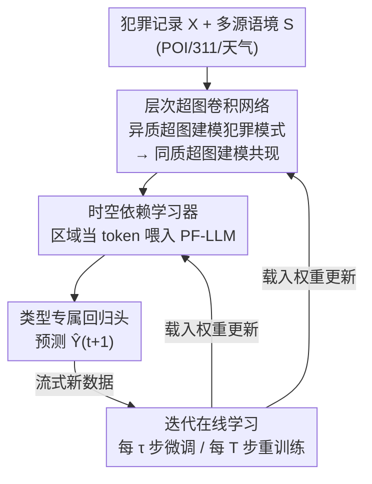

# ST-HHOL: Spatio-Temporal Hierarchical Hypergraph Online Learning for Crime Prediction

**会议**: ICLR 2026  
**OpenReview**: [https://openreview.net/forum?id=Nc3dl43s5Z](https://openreview.net/forum?id=Nc3dl43s5Z)  
**代码**: https://github.com/777Rebecca/ST-HHOL  
**领域**: 时空预测 / 时间序列 / 超图神经网络  
**关键词**: 犯罪预测、层次超图、概念漂移、在线学习、部分冻结 LLM

## 一句话总结
ST-HHOL 用「异质超图建模犯罪模式 + 同质超图建模共现关系」的层次超图刻画稀疏犯罪数据背后的高阶语境因素，再配上「频繁微调适应短期波动 + 周期重训练应对长期漂移」的在线学习策略和一个部分冻结的 GPT-2，在四个真实城市犯罪数据集上把 MAE/MAPE 一致压过所有离线与在线 baseline。

## 研究背景与动机
**领域现状**：城市犯罪预测是典型的时空预测任务。近年主流做法是用注意力机制建模动态犯罪相关性，或用 GNN（STGCN、DCRNN、AGCRN、GMAN 等）捕捉空间异质性和时间演化；为了缓解犯罪记录稀疏的问题，不少工作还会引入 POI、311 报修、出行数据等辅助信息。

**现有痛点**：单看稀疏的犯罪计数无法揭示「带空间和犯罪类型双重特异性」的多面犯罪模式。真实风险来自多种时空因素（环境、人流、天气）的联合作用，而且它们的类型和强度因区域、因犯罪类别而异——比如深夜酒吧附近多发斗殴，白天地铁站附近多发盗窃。但既有引入辅助数据的方法大多把它建成同质图、成对图或简单特征拼接，捕捉不到多个因素共存时形成的高阶、双特异交互。另一方面，犯罪数据高度非平稳，几天内不同区域的犯罪量会剧烈起伏，导致 $P_{train}(Y|X)\neq P_{test}(Y|X)$ 的概念漂移；传统离线模型假设分布平稳，难以适应这种漂移，而试图抽取不变量的方法又通常假设数据完整、变量关系静态。

**核心矛盾**：稀疏记录的「信息不足」需要靠高阶语境建模来补，而高阶语境本身又随时间空间不断漂移；既有超图犯罪模型直接从稀疏犯罪记录建同质或扁平的超图，忽略了异质语境因素和犯罪语义之间的高阶交互，稀疏条件下语义混杂、模式不稳。

**本文目标**：(1) 把异质语境因素融进超图，挖出带空间/犯罪双特异性的潜在犯罪模式及其共现关系；(2) 让模型在流式数据下分别适应短期波动和长期漂移；(3) 在稀疏监督下增强时空推理。

**核心 idea**：用「层次超图」把语境因素 → 犯罪模式 → 共现关系两级建模，再用「短期微调 + 长期重训练」的迭代在线学习对抗概念漂移，并借部分冻结的预训练 LLM 注入序列先验补足稀疏监督。

## 方法详解

### 整体框架
ST-HHOL 是一个在线学习框架，要同时解决两件事：犯罪模式的双重特异性、以及数据的非平稳概念漂移。它由两大组件串成一条预测流水线：(1) **层次超图卷积网络 HHGCN**，先用异质超图把犯罪记录和多源语境因素融合成潜在犯罪模式，再用同质超图建模这些模式之间的高阶空间共现；(2) **时空依赖学习器**，用部分冻结的 GPT-2（PF-LLM）把每个区域当 token，在稀疏噪声数据上做时空推理，最后经犯罪类型专属回归头预测下一时隙的犯罪量 $\hat Y_{t+1}$。

在这条前向流水线之外，套了一层迭代在线学习循环：先用前 25% 数据 warm-up，随后进入流式更新——每隔 $\tau$ 步做一次微调（冻结空间不变参数，只更新动态参数和 PF-LLM），每隔 $T$ 步（$T>\tau$）做一次完整重训练。论文实测「两个月重训练 + 半个月微调」最优。

### 关键设计

**1. 层次超图卷积网络 HHGCN：用两级超图把稀疏计数变成可解释的犯罪模式**

针对「稀疏犯罪计数看不出双特异性模式」这个痛点，HHGCN 把建模拆成两级超图。第一级是**异质超图** $G^e_t$：顶点集同时包含犯罪节点 $\{x^t_{n,c}\}$ 和语境节点 $\{s^t_{n,m}\}$，每个犯罪嵌入 $x^t_{n,c}$ 作为主节点，和它所在区域的若干语境节点共同构成一条异质超边——这就把「一个区域某类犯罪受哪些环境/人流/天气因素联合影响」显式编码成一条超边。潜在犯罪模式由 $\tilde X_t=f(\sigma(\Theta^t_e[X_t\,\|\,S_t]))$ 算出，其中 $\Theta^t_e$ 是可学习的关联矩阵，主节点位置取 1、语境节点位置取关联强度 $p^t_{i,n,c}\in(0,1)$、其余取 0，从而量化每个语境因素对该犯罪模式的贡献。第二级是**同质超图** $G^o_t$：在已经提炼出的潜在犯罪模式之上，用超图卷积聚合高阶空间共现关系（式 4），并把度归一化的关联算子近似成一个可学习矩阵 $\Theta^t_o\in\mathbb R^{H_o\times NC}$，$H_o$ 为同质超边数（设 64）。两级合起来既建了「犯罪模式怎么由语境塑造」，又建了「不同模式之间怎么共现」，比同质/扁平超图更能在稀疏下保住稳定且可解释的表示。

**2. 部分冻结 LLM（PF-LLM）作时空依赖学习器：借预训练序列先验补足稀疏监督**

稀疏犯罪记录监督信号有限，从头训的 Transformer 容易过拟合。作者的直觉是：自注意力是模态无关的，预训练前馈网络（FFN）里编码了可迁移的序列先验和少样本推理能力，即便面对稀疏噪声的犯罪数据仍然有用。于是 PF-LLM 基于 GPT-2（Small，2 层、12 头、隐藏维 768）**冻结 FFN 保留这些可迁移推理能力，只微调注意力层和归一化层**去适配犯罪特有的时空结构与非平稳动态。输入端把每个区域当作一个 token，区域 $n$ 的犯罪模式序列 $E_n\in\mathbb R^{T\times C}$ 经类型专属非线性投影对齐到 GPT-2 隐空间；时间语义靠 day-of-week 和 month-of-year 的 one-hot 加正弦位置编码注入：$E_T=\sin(t_d)+\sin(t_m)$。每层走 Pre-LN 的 $\bar H^l=\text{MHA}(\text{LN}(H^l))+H^l$、$H^{l+1}=\text{FFN}(\text{LN}(\bar H^l))+\bar H^l$（FFN 冻结）。消融里 PF-FFN（只冻 FFN）在「保留预训练知识」和「适配目标域」之间取得最佳折中，优于全冻结的 FPT（适应性差）和全微调（方差大、过拟合）。

**3. 迭代在线学习策略：把空间不变与时间易变参数解耦，分频率更新对抗概念漂移**

概念漂移被形式化为存在 $\tau>0$ 使 $D_{KL}(P_t(Y|X)\,\|\,P_{t+\tau}(Y|X))\ge\delta$。作者的关键观察是：犯罪共现随时间剧烈波动，但驱动犯罪模式的异质成分及其强度在空间上相对稳定。于是把参数拆成两类：$\Theta_s$ 编码空间不变与长期缓变（绑定第一级异质超图，依赖 socioeconomic、POI 等稳定属性，$\frac{d\Theta_s}{dt}\approx 0$，只受极小噪声扰动）；$\Theta_d(t)$ 捕捉短期时间波动（绑定第二级同质超图，对区域突变 $\|\Delta E^t_i\|_1\gg 0$ 快速反应，演化噪声方差 $\sigma_t^2\gg\sigma^2$）。据此设计两阶段更新：**微调阶段**每 $\tau$ 步冻结 $\Theta_s$，只更新 $\Theta_d(t)$ 和 $\Theta_{\text{PF-LLM}}$，快速吸收近期波动；**重训练阶段**每 $T$ 步（$T>\tau$）解冻 $\Theta_s$ 与 $\Theta_d(t)$ 联合更新，吸收长期缓变和演化的共现结构。这样把短期响应力和长期稳定性分开，避免过频更新带来的灾难性遗忘。

### 损失函数 / 训练策略
最终预测由各犯罪类型专属的回归卷积头拼接得到 $\hat Y_{t+1}=\text{Concat}(\text{RConv}_1(H^{l+1}_1),\dots,\text{RConv}_c(H^{l+1}_c))$。损失含预测项和两个超图正则项：

$$\mathcal L=\|Y_{t+1}-\hat Y_{t+1}\|_2^2+\lambda_1\|\Theta^{t+1}_e\|_2^2+\lambda_2\|\Theta^{t+1}_o\|_2^2,$$

其中 $\lambda_1=\lambda_2=0.1$。优化用 Adam，batch=32，初始学习率 $1\text{e}{-3}$，衰减 $1\text{e}{-4}$；数据按时间 25:75 划分为 warm-up 与在线阶段，输入时间长度 7、预测步长 1。

## 实验关键数据

### 主实验
四个真实城市犯罪数据集：Chicago(CHI, 77 区)、New York(NYC, 123 区)、Philadelphia(PHI, 6 区)、Toronto(TOR, 158 区)，均带 311/天气/POI 多源语境，按天预测。Baseline 覆盖统计法（SVM、ARIMA）、时空预测（DCRNN/STGCN/AGCRN/MTGNN/GMAN/MoSSL）、犯罪预测（DeepCrime/ST-HSL/ST-SHN）、在线学习（DLF/FSNet/OneNet），离线模型分 Pre-trained 与 Re-trained 两套评。

**犯罪数量预测（MAE/MAPE，越低越好，节选 CHI / NYC）**：

| 数据集·类型 | 指标 | 最强 baseline | ST-HHOL |
|--------|------|------|------|
| CHI·Theft | MAE | 0.99 (AGCRN-RT) | **0.95** |
| CHI·Battery | MAE | 0.88 (AGCRN-RT) | **0.87** |
| NYC·Larceny | MAE | 0.98 (MoSSL) | **0.97** |
| NYC·Assault | MAE | 0.70 (AGCRN-RT) | **0.66** |
| TOR·Assault | MAE | 0.62 (AGCRN-RT) | **0.58** |
| TOR·B&E | MAE | 0.98 (AGCRN-RT) | **0.96** |

平均 MAE/MAPE 降幅：CHI 5.37%/9.21%、NYC 3.52%/8.83%、PHI 2.97%/5.85%、TOR 6.45%/11.32%。

**犯罪发生预测（NYC/CHI，越高越好）**：

| 数据集 | 指标 | 最强 baseline | ST-HHOL |
|--------|------|------|------|
| NYC | Micro-F1 | 0.638 (DLF) | **0.644** |
| NYC | TZR | 0.652 (DLF) | **0.663** |
| CHI | Micro-F1 | 0.710 (ST-SHN) | **0.715** |
| CHI | TZR | 0.714 (ST-SHN) | **0.736** |

TZR（True Zero Rate，正确识别真·零发生场景的比例）在所有数据集一致领先，说明它在稀疏、偏斜分布下尤其稳。

### 消融实验

| 配置 | 说明 |
|------|------|
| Full model | 完整 ST-HHOL，全数据集最优 |
| w/o $G^e$ | 去掉多源输入+异质超图，犯罪特异性建模崩，掉点 |
| w/o $G^o$ | 去掉同质超图，丢失共现依赖，掉点 |
| w/o $E_T$ | 不输入时间信息，时序语义缺失 |
| w/o PF-LLM | 换成普通 Transformer，少样本推理迁移变差 |
| w/o OL | 退回离线，无法适应概念漂移 |

PF-LLM 变体对比：FPT（全冻结）适应性差；Full Tuning 误差低但 RMSE 方差大、过拟合稀疏数据；**PF-FFN（只冻 FFN）折中最佳**。

### 关键发现
- **频率有甜点**：半个月（biweekly）微调一致优于每周，说明犯罪动态大约以两周为尺度演化，过频更新反而引发灾难性遗忘；重训练以两个月为最佳适应性/稳定性折中。这一选择由 FFT 分解佐证——犯罪序列存在 1–3 周短周期和 1–4 月长周期两个尺度。
- **超参敏感性**：超边数 $H_o$=64 最优（128 引入冗余增大误差）；隐藏维 16 最优（过高放大误差）；PF 冻结层数 2 最优（解冻超 2 层会破坏预训练归纳偏置、过拟合长尾犯罪）。
- **可解释性**：同质超边能聚类不同频率区域（$e_8$ 低频、$e_{51}$ 高频）；异质超边揭示跨区域跨类型异质性——Loop 商业区受餐馆/车站密度主导，Austin 低收入区受失业率主导；六月高温显著加剧商业区盗窃与斗殴。

## 亮点与洞察
- **两级超图分工明确**：第一级异质超图回答「犯罪模式由哪些语境塑造」，第二级同质超图回答「模式之间怎么共现」，把「语义混杂」问题在结构上拆开，可解释性直接来自超边的物理含义。
- **概念漂移 → 参数分频更新**：把「空间稳定」和「时间易变」映射成两组演化速率不同的参数（$\frac{d\Theta_s}{dt}\approx 0$ vs $\sigma_t^2\gg\sigma^2$），再用「冻结慢参数微调快参数 / 周期解冻全参」对应两个尺度，思路干净，可迁移到任何「慢-快混合」的非平稳时空任务。
- **冻 FFN 微调注意力**：把「FFN 存通用先验、注意力适配领域结构」当作可迁移 LLM 的拆解原则，在数据稀疏域比全微调更抗过拟合——这条经验对一切「小数据上用预训练 LLM」的场景都有参考价值。

## 局限与展望
- 在线频率（$\tau$=半月、$T$=两月）是在 CHI 上调出的甜点，不同城市/犯罪类型的最优周期可能不同，迁移到新城市需重新做 FFT+频率搜索。
- PF-LLM 仅用 GPT-2 Small（2 层），是否换更大模型能带来收益、以及随之而来的推理成本，论文未充分探讨。
- 把每个区域当单 token、依赖固定 7 天输入窗，对突发性、跨城市级别的事件（如大型集会、政策突变）的反应能力有限。
- 异质超边的关联强度 $p^t_{i,n,c}$ 学到的因果含义仍是相关性层面的解释，并非真正的因果归因。

## 相关工作与启发
- **vs ST-SHN / ST-HSL（超图犯罪模型）**：它们直接从稀疏犯罪记录建同质/扁平超图，本文先用异质超图把语境因素融进来再建共现，并补上分尺度在线适应——这正是作者点名的「既有超图方法缺失的两种能力」。
- **vs DLF / FSNet / OneNet（在线学习）**：这些方法按各自原生策略增量更新，但未针对犯罪数据的「空间稳定+时间易变」结构做参数解耦；ST-HHOL 显式分离 $\Theta_s/\Theta_d$ 并分频更新，在 TZR 等稀疏鲁棒性指标上更稳。
- **vs AGCRN / GMAN（通用时空 GNN）**：它们用成对图建模空间依赖，捕捉不到多语境因素共存的高阶交互；超图的「一条边连多点」天然适合这种联合影响。

## 评分
- 新颖性: ⭐⭐⭐⭐ 层次超图（异质→同质）+ 参数分频在线学习的组合针对犯罪数据特性，切口具体。
- 实验充分度: ⭐⭐⭐⭐ 四城市、数量/发生双任务、三类 baseline、频率与超参敏感性、可解释性可视化都齐。
- 写作质量: ⭐⭐⭐⭐ 动机—方法—实验逻辑清晰，公式与图配合到位。
- 价值: ⭐⭐⭐⭐ 对非平稳时空预测和稀疏域用预训练 LLM 都给出可迁移的设计经验。

<!-- RELATED:START -->

## 相关论文

- [\[ICLR 2026\] Online Time Series Prediction Using Feature Adjustment](online_time_series_prediction_using_feature_adjustment.md)
- [\[ICLR 2026\] Delta-XAI: A Unified Framework for Explaining Prediction Changes in Online Time Series Monitoring](delta-xai_a_unified_framework_for_explaining_prediction_changes_in_online_time_s.md)
- [\[ICLR 2026\] TRIDENT: Cross-Domain Trajectory Spatio-Temporal Representation via Distance-Preserving Triplet Learning](trident_cross-domain_trajectory_spatio-temporal_representation_via_distance-pres.md)
- [\[ICLR 2026\] Improving Extreme Wind Prediction with Frequency-Informed Learning](improving_extreme_wind_prediction_with_frequency-informed_learning.md)
- [\[ICLR 2026\] Enabling Arbitrary Inference in Spatio-Temporal Dynamic Systems: A Physics-Inspired Perspective](enabling_arbitrary_inference_in_spatio-temporal_dynamic_systems_a_physics-inspir.md)

<!-- RELATED:END -->
