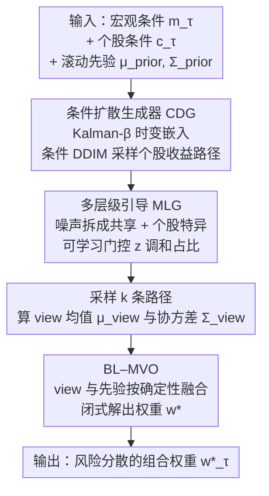

# STABLE: Shift-Tolerant Allocation via Black–Litterman Using Conditional Diffusion Estimates

**会议**: ICLR 2026  
**OpenReview**: [https://openreview.net/forum?id=VltZQpfarw](https://openreview.net/forum?id=VltZQpfarw)  
**领域**: 时间序列 / 金融 AI / 扩散模型  
**关键词**: 投资组合配置, 条件扩散, Black–Litterman, 市场 regime, 风险分散

## 一句话总结
STABLE 用条件扩散模型生成"随市场 regime 变化"的个股收益分布，再把这些分布当作 Black–Litterman 的投资者观点（views）注入均值-方差优化，从而在四大区域股市上把夏普比率提升最多 122.9%、同时压低回撤和波动。

## 研究背景与动机
**领域现状**：投资组合配置（portfolio allocation）是金融 AI 里最实用的方向之一。主流做法分两派：一是经典现代组合理论（MPT），如 Markowitz 均值-方差优化（MVO）和 Black–Litterman，用历史收益估计均值与协方差然后求解权重；二是深度强化学习（RL），让策略网络直接输出权重去最大化风险调整后收益（如 AlphaStock、MetaTrader、AlphaMix）。

**现有痛点**：MPT 方法严重依赖历史窗口估计，只有在"再平衡时刻的估计足够准"时才有效；一旦配置之后市场 regime 发生切换、真实分布偏离历史，盈利和稳定性就会急剧恶化。RL 方法虽然引入了 regime 感知，但它们主要从宏观信号里选 regime，容易过拟合当前宏观状态，捕捉不到个股层面的特异性波动（idiosyncratic movements）。

**核心矛盾**：宏观因子对每只股票的影响强度是**因股而异、随时而变**的——危机时宏观主导、个股齐涨齐跌；平稳期个股自身信号更重要。现有方法要么只看历史、要么把宏观影响"一刀切"地施加到所有股票上，没有把"宏观影响 vs 个股影响"在每只股票、每个时刻上分离开。

**本文目标**：在 regime 不断切换的市场里，做到既能准确预测未来收益时间序列、又能据此分散风险得到稳健权重。拆成三个子问题——(C1) regime 切换下如何准确估计未来时序；(C2) 如何在每个时刻、每只股票上分离宏观因子与个股因子的影响；(C3) 当逐步估计的"确定性"随时间变化时如何保持稳健配置。

**切入角度**：对数收益在随机游走视角下被建模为高斯噪声，而扩散模型恰好在前向过程注入高斯扰动、反向过程学习去除它——噪声假设天然对齐。于是把条件扩散当作"生成 regime 感知收益路径"的工具，再用生成分布算出的均值/协方差去喂给 Black–Litterman。

**核心 idea**：用条件扩散生成"带 regime 的个股收益分布"作为 Black–Litterman 的 views，把生成式预测和经典组合优化拼接起来，替代"只看历史"或"只过拟合宏观"的旧范式。

## 方法详解

### 整体框架
STABLE 要解决的是：给定宏观条件 $m_\tau$、个股条件 $c^{(s)}_\tau$、以及由最近 $\nu$ 个交易日算出的先验均值 $\mu_{prior,\tau}$ 和协方差 $\Sigma_{prior,\tau}$，在预算约束 $\mathbf{1}^\top w_\tau = 1$ 下输出能最大化夏普比率的权重 $w^\star_\tau$。整条管线分三段串行：先用**条件扩散生成器（CDG）**在个股级别采样出 regime 感知的收益路径；再用**多层级引导（MLG）**把每步噪声拆成"共享系统性"和"个股特异性"两部分、用可学习门控调和；最后把扩散采样得到的均值/协方差当作 views 喂给 **Black–Litterman 均值-方差优化器（BL–MVO）**，融合滚动先验后求解出稳健权重。

### 关键设计

**1. 条件扩散生成器（CDG）：把"regime 感知"的收益路径生成出来**

CDG 针对的是痛点 C1——经典方法只看历史窗口、regime 一变就失准。它用一个 DDIM（去噪扩散隐式模型）作为条件采样器，在每个再平衡时刻 $\tau$ 同时以宏观状态和个股身份为条件，生成长度为 $\ell$ 的个股收益段 $\hat{r}^{(s)}_{0,\tau}$。宏观特征 $m_\tau$（由市场指数、美元指数、美债期限利差、VIX、黄金指数等组成，经 $\nu$ 日滚动归一化与对数差分）过线性层 $W_m$ 得到精炼宏观条件 $h_{m,\tau}$；个股特征 $c^{(s)}_\tau$ 过线性层 $W_c$ 得到 $h^{(s)}_{c,\tau}$，二者拼成完整条件 $h^{(s)}_{f,\tau}=[h_{m,\tau}\,\|\,h^{(s)}_{c,\tau}]$。DDIM 的去噪器预测噪声 $\hat\epsilon$ 并更新 $\hat{r}^{(s)}_{0,\tau}=\frac{r^{(s)}_{n,\tau}-\sqrt{1-\bar\alpha_n}\,\hat\epsilon}{\sqrt{\bar\alpha_n}}$。

这里一个关键巧思是个股条件里的**时变嵌入 $\beta^{(s)}_\tau$**：以往用静态行业标签或价格序列的神经嵌入，要么固定不变、要么反映不了宏观 regime。STABLE 改用卡尔曼滤波，把个股对数收益 $y^{(s)}_\tau$ 当因变量、宏观向量 $m_\tau$ 当自变量，递归估计出一个"当下宏观敏感度向量" $\beta^{(s)}_\tau$。它是后验估计，融合了截至当前的全部观测，因此是一个**随 regime 变化、稳健的个股表示**——这正是 RL baseline 缺的"个股级 regime 适应"。

**2. 多层级引导（MLG）：把噪声拆成宏观影响和个股影响，让门控自己学占比**

MLG 针对痛点 C2——宏观因子对每只股票的影响因股而异、随时而变。它把扩散每一步的引导噪声显式分解为两部分：

$$\hat\epsilon = \underbrace{\hat\varepsilon_{n,\tau}}_{\text{共享(系统性)}} + z^{(s)}_\tau\underbrace{\big(\hat\varepsilon^{(s)}_{n,\tau}-\hat\varepsilon_{n,\tau}\big)}_{\text{个股特异(非系统性)}}$$

其中共享项 $\hat\varepsilon_{n,\tau}=u_\phi(r^{(s)}_{n,\tau},n,h_{m,\tau})$ 只用宏观条件求得，全条件项 $\hat\varepsilon^{(s)}_{n,\tau}=u_\phi(r^{(s)}_{n,\tau},n,h^{(s)}_{f,\tau})$ 用完整条件求得，二者之差即个股残差；门控 $z^{(s)}_\tau=g_\pi(h^{(s)}_{f,\tau})\in[0,z_{max}]$ 是一个由个股条件产生的标量，在股票层面调节宏观影响与个股动态的相对权重。训练时优化会**自动把门控压低**（当条件指示宏观高度同步时）、在解耦 regime 下**抬高门控**（给个股残差更多权重）——这正好对应"危机宏观主导、平稳期个股主导"的两个实证规律。相比只用单一条件的 Diffusion-TS，这种双层建模让条件的相对重要性随股随时变化，因而对齐更准、误差更低。

**3. Black–Litterman 均值-方差优化器（BL–MVO）：把生成分布当观点，按确定性融合先验**

BL–MVO 针对痛点 C3——逐步估计的确定性随时间变化，要让配置据此自适应。它对每只股票生成 $k$ 条引导路径 $\hat{R}^{(s)}_{0,\tau}\in\mathbb{R}^{k\times\ell}$，由样本算出 view 均值 $\mu^{(s)}_{view,\tau}=\frac{1}{k}\sum_i \bar{r}^{(s,i)}_{0,\tau}$ 和无偏样本协方差 $\Sigma_{view,\tau}=\frac{1}{k-1}\sum_i (r^{(i)}_{0,\tau}-\mu_{view,\tau})(r^{(i)}_{0,\tau}-\mu_{view,\tau})^\top$，后者捕捉跨资产的联合估计误差。然后用**确定性加权**把 view 与滚动先验融合：先验确定性 $\Phi_\tau=\Sigma^{-1}_{prior,\tau}$、view 确定性 $\Omega_\tau=\Sigma^{-1}_{view,\tau}$，BL 后验为

$$\mu_{BL,\tau}=(\Phi_\tau+\Omega_\tau)^{-1}(\Phi_\tau\mu_{prior,\tau}+\Omega_\tau\mu_{view,\tau}),\quad \Sigma_{BL,\tau}=(\Phi_\tau+\Omega_\tau)^{-1}.$$

最后夏普最大化权重有闭式解 $w^\star_\tau=\frac{\Sigma^{-1}_{BL,\tau}\mu_{BL,\tau}}{\mathbf{1}^\top\Sigma^{-1}_{BL,\tau}\mu_{BL,\tau}}$，靠归一化天然满足预算约束。这种"用生成协方差的逆当确定性权重"的设计，意味着当某时刻生成路径分歧大（估计不确定）时，view 自动让位给先验，从而在不确定时段保持稳健——这是它比"直接用预测值替换历史均值"的 plug-in MVO 更鲁棒的根本原因。

### 损失函数 / 训练策略
扩散部分最小化跨所有股票、再平衡时刻和 DDIM 步的去噪 MSE，并加 $\ell_2$ 正则防过拟合：$L(\theta)=\mathbb{E}\,\|\epsilon-\epsilon_\theta(r^{(s)}_{n,\tau},n,h^{(s)}_{f,\tau})\|^2_2+\beta\|\theta\|^2_2$，可训练参数 $\theta=\{\phi,\pi,W_m,W_c\}$（门控、去噪 UNet 及两个条件投影线性层联合训练）。由于 $\epsilon\sim\mathcal{N}(0,I)$，目标渐近使 $\hat\epsilon\sim\mathcal{N}(0,I)$。

## 实验关键数据

### 主实验
四个区域股市（美 S&P500、中 CSI300、欧 EUROSTOXX、韩 KOSPI200），按 GICS 11 个行业各取头部股票构建 sector-diversified 数据集，2013-01 起训练、2024-09 截断、测试至 2025-03。指标：年化夏普 ASR（↑）、相对最大回撤 RMDD（↓）、年化波动 AVol（↓）。

| 市场 | 指标 | STABLE | 最强 baseline | 说明 |
|------|------|--------|--------------|------|
| S&P500 (US) | ASR | **1.85** | 1.18 (MVO) | 全部三指标第一 |
| S&P500 (US) | RMDD% / AVol% | **7.82 / 13.43** | 8.89 / 13.92 | 回撤波动同时最低 |
| EUROSTOXX | ASR | **2.92** | 1.42 (MOM) | 提升最显著 |
| EUROSTOXX | RMDD% / AVol% | **3.84 / 10.88** | 5.40 / 11.77 | — |
| KOSPI200 | ASR | **1.61** | 1.47 (AlphaMix) | — |
| CSI300 (China) | ASR | **-0.41** | -0.47 (MOM) | 熊市仍最优（亏损最少） |

STABLE 在每个区域的 ASR、RMDD、AVol 三项指标上**全部排名第一**。论文摘要给出的夏普提升上界 122.9%、回撤下降最多 1.56 个百分点、波动下降最多 7.56%。

### 时间序列预测（Q2）
预测 task 用 MSE（×10⁻⁴）和归一化 DTW（×10⁻³），对比三类生成式预测器。

| 配置 | S&P500 MSE | EUROSTOXX MSE | KOSPI200 MSE | 说明 |
|------|-----------|---------------|--------------|------|
| Diffusion-TS | 3.90 | 3.05 | 9.41 | 最强 baseline |
| AEC-GAN | 4.27 | 3.70 | 10.18 | GAN + 误差修正 |
| KoVAE | 4.58 | 2.61 | 9.83 | VAE + Koopman |
| **STABLE** | **3.51** | **2.49** | **8.15** | 四市场 MSE/DTW 全最低 |

STABLE 在所有四个市场上 MSE 和 DTW 都最低，MSE 相对最佳竞品最多降 15.7%、DTW 最多降 13.8%。

### 关键发现
- **个股级 regime 适应是涨点关键**：AlphaMix 是最强 RL 竞品（它按市场状态在多个神经配置器间路由），但它不建模"随时变化的个股特异性"；STABLE 靠 Kalman-β 时变嵌入适应股票级 regime 变化，这解释了 ASR/RMDD/AVol 的一致领先。
- **宏观-个股噪声分解胜过单一条件**：Diffusion-TS 为泛化而设计、不在个股级别调节条件重要性；STABLE 的双层噪声分解让条件权重随股随时变化，对齐更好、预测误差更低。
- **嵌入捕捉到真实板块关系且随时间漂移**（Q3 案例）：TSLA 的最近邻在 2021 年是 AAPL/AVGO 等大科技股，到 2024 年底漂移为 NVDA/MSFT 等 AI 公司，刚好对应市场的 AI 热潮；BAC 在两个时点都贴近 JPM/WFC，反映稳定的金融板块关系。
- **熊市中也最优**：在 CSI300 这种测试期普遍亏损的市场，STABLE 的 ASR(-0.41) 仍是所有方法里亏损最少的，说明风险分散在下行时同样起作用。

## 亮点与洞察
- **把扩散当"观点生成器"接进 Black–Litterman**：传统 BL 的 view 靠人主观给定，这里改成从条件扩散的 $k$ 条采样路径里统计出均值和协方差，且用协方差的逆当 view 确定性——生成模型的"分歧度"自然变成了 BL 里"该信观点还是信先验"的权重，设计极其自洽。
- **噪声分解 = 系统性 + 个股特异**：把 classifier-free guidance 式的"全条件减弱条件"差值解释成金融里的特异性风险，再用可学习门控调和，是一个把领域先验（CAPM 式的系统/非系统风险分解）塞进扩散引导的漂亮迁移。
- **Kalman-β 做时变股票嵌入**：用经典卡尔曼滤波估计个股对宏观的时变敏感度，既轻量又自带"随 regime 更新"的能力，可迁移到任何需要"随市场状态变化的资产表示"的任务。

## 局限与展望
- **特征仍限于数值型宏观/价格信号**：作者承认未来应纳入文本等更丰富特征（如新闻、财报）来刻画宏观与个股状态。
- **股票池偏小且经过幸存者筛选**：每个市场只取行业头部 37–55 只、且剔除了历史不全的股票，这会引入幸存者偏差，能否推广到更宽的全市场 universe 存疑。
- **缺少模块级消融**：正文主要给的是与外部 baseline 的对比（Table 3/4）和案例分析（Table 5），CDG/MLG/BL-MVO 三模块各自贡献多少、去掉门控掉多少点等消融在正文未充分展开（部分放在附录）。
- **跨市场结论不可直接横比**：不同区域测试期的市场状态差异巨大（如 CSI300 整体亏损 vs EUROSTOXX 高夏普），ASR 绝对值不可直接比大小，应在同一市场内看相对排名。

## 相关工作与启发
- **vs MVO / Black–Litterman（经典 MPT）**：它们靠历史窗口估计均值协方差，regime 一变就失准；STABLE 用条件扩散生成 regime 感知的未来分布去替换"历史 plug-in"，本质是把估计从"回看"换成"前瞻"。
- **vs DeepTrader / MetaTrader / AlphaMix（RL 配置）**：这些方法 regime 感知主要来自宏观信号、易过拟合宏观状态；STABLE 用 MLG 门控在个股级别分离宏观/个股影响、用 Kalman-β 做个股级 regime 适应，补上了"宏观影响因股而异"这一缺口。
- **vs Diffusion-TS / AEC-GAN / KoVAE（生成式时序预测）**：它们为通用泛化设计、不在个股级调节条件；STABLE 的系统性+特异性噪声分解让条件权重随股随时变化，因此 MSE/DTW 全面更低。

## 评分
- 新颖性: ⭐⭐⭐⭐ 把条件扩散的采样分布接成 Black–Litterman 的 view、并用生成协方差当确定性权重，是一个少见且自洽的拼接。
- 实验充分度: ⭐⭐⭐ 四市场、两任务、案例分析都有，但正文缺少模块级消融，股票池偏小且有幸存者筛选。
- 写作质量: ⭐⭐⭐⭐ 三阶段动机（C1/C2/C3↔I1/I2/I3）对应清晰，公式完整。
- 价值: ⭐⭐⭐⭐ 对金融 AI 实务有直接意义，"扩散当观点生成器"的范式可复用到其他资产配置场景。

<!-- RELATED:START -->

## 相关论文

- [\[ICLR 2026\] Relational Feature Caching for Accelerating Diffusion Transformers](relational_feature_caching_for_accelerating_diffusion_transformers.md)
- [\[ICLR 2026\] A Study of Posterior Stability in Time-Series Latent Diffusion](a_study_of_posterior_stability_in_time-series_latent_diffusion.md)
- [\[ICLR 2026\] ICDiffAD: Implicit Conditioning Diffusion Model for Time Series Anomaly Detection](icdiffad_implicit_conditioning_diffusion_model_for_time_series_anomaly_detection.md)
- [\[ICLR 2026\] Latent-to-Data Cascaded Diffusion Models for Unconditional Time Series Generation](latent-to-data_cascaded_diffusion_models_for_unconditional_time_series_generatio.md)
- [\[CVPR 2026\] Stable Spike: Dual Consistency Optimization via Bitwise AND Operations for Spiking Neural Networks](../../CVPR2026/time_series/stable_spike_dual_consistency_optimization_via_bitwise_and_operations_for_spikin.md)

<!-- RELATED:END -->
