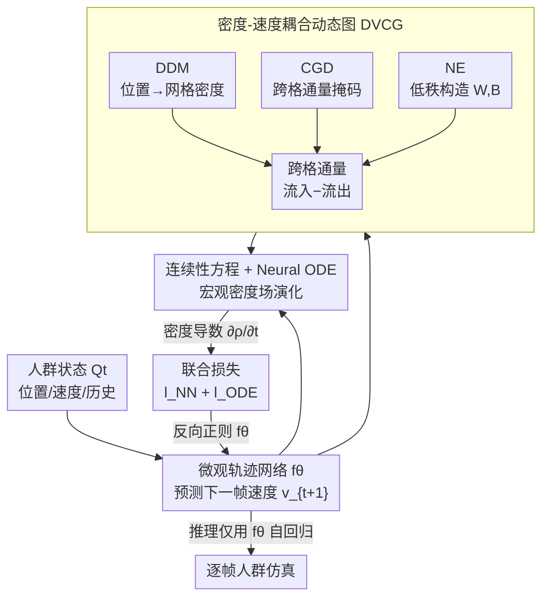

# STDDN: 用流体连续性方程引导的人群仿真深度学习框架

**会议**: ICLR 2026  
**OpenReview**: [https://openreview.net/forum?id=t21xf6rxqY](https://openreview.net/forum?id=t21xf6rxqY)  
**代码**: 无  
**领域**: 时空预测 / 轨迹预测 / 物理引导深度学习  
**关键词**: 人群仿真, 连续性方程, Neural ODE, 动态图网络, 密度-速度耦合

## 一句话总结
STDDN 把人群当成连续流体介质，用流体力学的连续性方程作为强物理约束、Neural ODE 建模宏观密度场演化来反过来正则化微观轨迹预测网络，在四个真实数据集的长程仿真上同时刷新精度并把推理延迟大幅降低（最高减少 90%）。

## 研究背景与动机
**领域现状**：人群仿真（crowd simulation）是公共安全、应急疏散、智能交通的基础技术，主流做法分三类——基于物理的方法（如社会力模型 SFM、元胞自动机 CA）、数据驱动的深度学习方法（STGCNN、PECNet、MID 等轨迹预测模型）、以及把物理先验塞进网络的物理引导方法（PCS、NSP、SPDiff）。

**现有痛点**：纯物理方法建立在简化的线性力学假设上，遇到高密度、强交互场景就失效；纯数据驱动方法缺乏物理约束，会预测出违反基本物理规律的行为（不合理的拥堵、无视避让的碰撞）；现有物理引导方法虽然改善了物理一致性，但**几乎都只盯着微观的个体间交互**（把人群建模成一堆独立的个体轨迹），无法刻画宏观的密度演化规律。

**核心矛盾**：微观视角下，每个个体轨迹独立迭代预测，误差会随时间逐步累积放大，长程仿真稳定性崩坏；而像 SPDiff 这类基于扩散模型的方法，单帧仿真需要多次前向去噪，推理又慢又贵，根本没法做大规模高效仿真。物理一致性、长程稳定性、推理效率三者很难兼得。

**本文目标**：找一个既能注入宏观物理规律、又能压住误差累积、还能单次前向完成推理的人群仿真框架。

**切入角度**：作者从流体力学借来一个观察——人群在高密度下的集体行为很像连续介质的流动，而描述质量守恒的**连续性方程** $\frac{\partial \rho}{\partial t} + \nabla\cdot(\rho v)=0$ 天然把时间和空间解耦：时间演化由密度的时间导数控制，空间输运由速度场引导。把人群轨迹演化重新表述成「密度场里的物质输运过程」，就能从全局密度的视角去约束微观轨迹。

**核心 idea**：用连续性方程当强物理先验，让 Neural ODE 建模宏观密度场的演化，再把这个宏观约束端到端地反向正则化微观轨迹预测网络——用宏观物理管住微观预测，而不是反过来。

## 方法详解

### 整体框架
STDDN（Spatio-Temporal Decoupled Differential Equation Network，时空解耦微分方程网络）要解决的是「微观轨迹预测误差累积、长程不稳定」，它的整体转法是把仿真拆成两条耦合的链路：一条**微观链路**用轨迹预测网络 $f_\theta$ 逐步预测个体的加速度/速度（位置和速度按标准积分规则 $v_{t+1}=v_t+a_t\Delta t$、$p_{t+1}=p_t+v_t\Delta t$ 更新）；一条**宏观链路**用 Neural ODE 求解密度场 $\rho$ 随时间的演化。两条链路通过一个**密度-速度耦合动态图模块（DVCG）**连接：DVCG 吃进相邻时刻的密度场和速度场，用动态图神经网络算出密度场的时间导数 $\frac{\partial\rho}{\partial t}$，作为 Neural ODE 的演化函数。

关键在于，宏观密度演化的「驱动力」恰恰来自微观轨迹网络 $f_\theta$ 预测的速度——于是连续性方程这个宏观守恒律就被端到端地施加成对 $f_\theta$ 的物理正则。训练时两条链路联合优化；而**推理时只用训练好的 $f_\theta$ 按 Eq.1 自回归逐帧生成，完全不需要 ODE 部分**，所以单次前向就能跑完，省掉了扩散模型的多次采样开销。

DVCG 内部又含三个子模块：可微密度映射（DDM）把连续个体位置软分配到离散网格得到密度、连续跨网格检测（CGD）算出跨格通量掩码、节点嵌入（NE）用低秩外积构造权重矩阵。三者协同算出密度导数，同时保证训练时的梯度连续与质量守恒。

### 关键设计

**1. 宏微观耦合：连续性方程 + Neural ODE 反向正则微观预测**

这一设计直接针对「现有物理引导方法只管微观交互、忽略宏观密度演化导致误差累积」的痛点。作者不再把人群看成一堆独立个体，而是当成连续介质，用流体力学的连续性方程 $\frac{\partial\rho}{\partial t}+\nabla\cdot(\rho v)=0$ 作为可微的结构约束。具体做法是用 Neural ODE 建模宏观密度场的演化：从初始密度 $\rho_0$ 出发，用 ODE 求解器在 $\tau$ 个时间步上积分密度导数，得到密度序列 $\rho_{1:\tau}=\text{ODESolver}(\rho_0, F_G, \Phi, [0:\tau])$。而密度导数 $F_G$ 的计算又内嵌了微观轨迹网络 $f_\theta$ 预测的速度——这样宏观守恒律就能端到端地把物理正则反向施加到微观轨迹预测上，把模型推向全局最优解、压住误差随时间的传播。这与 SPDiff 等只在个体层面建模的方法形成鲜明对比：宏观密度的全局视角天然抑制了局部误差的滚雪球。

**2. 密度-速度耦合动态图（DVCG）：把轨迹预测转成密度输运问题**

DVCG 是 Neural ODE 的核心演化函数，要解决「怎么从微观轨迹算出宏观密度的时间导数」。作者把空间离散成规则网格、当作图节点，并构造一张**跨时间步的动态图**：当前时刻所有个体的速度作为节点的**入边**，下一时刻预测的速度作为**出边**，每个网格节点的通量由个体速度和当前节点密度共同决定。密度导数因此写成流入项减流出项：

$$\frac{\partial\rho}{\partial t}=F_G(\Phi,t,\rho_t)=G_{in}(\Phi,t,\rho_t)-G_{out}(\Phi,t,\rho_t)$$

其中 $G_{in}=\rho_t(m_t\odot A_t\odot W\odot\|V_t\|+A_t\odot B)$、$G_{out}$ 则用下一时刻预测的速度 $V_{t+1}(V_t;\theta)$ 和密度 $\rho_{t+1}$ 构造（$\odot$ 为逐元素乘，$A_t$ 是动态连接矩阵，$m_t$ 是来自 CGD 的跨格掩码）。这等于把轨迹预测任务**重写成密度场上的时空输运优化问题**——用「入边速度带来质量、出边速度带走质量」的物理直觉显式建模密度通量，比单纯回归轨迹更有物理可解释性，也让动态图随个体速度变化而真正「动」起来。

**3. 两个可微结构（DDM + CGD）：消除离散化带来的梯度断裂**

把连续位置往离散网格上映射、统计跨格事件，传统硬分配（hard assignment）会在网格边界产生不连续梯度，端到端训练根本走不通。作者用两个可微结构对症下药。其一是**可微密度映射 DDM**：用基于径向基的温度软分配代替硬分配，先算预测位置 $p_t$ 到各网格中心的平方欧氏距离，再用带温度 $\beta$ 的 softmax 转成概率分布 $q_i(p_t)=\frac{\exp(-\beta\|p_t-c_i\|^2)}{\sum_j\exp(-\beta\|p_t-c_j\|^2)}$，对所有个体求和得到连续可微的密度表示 $\rho_t=\sum_i q_i(p_t)$。其二是**连续跨网格检测 CGD**：净通量只来自跨越网格边界的轨迹，作者用相邻时刻概率分布之间的 Jensen-Shannon 散度 $J(q(p_t)\|q(p_{t+1}))$ 来量化跨格程度，再用带温度的 sigmoid 把散度转成连续的跨格掩码 $m=\sigma(\alpha(J-\tau))\in[0.01,0.99]$。两者一起既保证了梯度连续可反传，又维持了质量守恒的物理约束——这也是消融里去掉 CGD 掉点明显的原因（flux-based 方法离了它物理约束就失效）。

**4. 节点嵌入（NE）：把权重矩阵从 $O(N^2)$ 压到 $O(N\cdot d)$**

网格划分越细，连续性方程的约束越精细，但传统权重矩阵随网格数按 $O(N^2)$ 膨胀，显存吃不消。NE 给每个网格节点配一对可学习的嵌入向量和偏置向量 $w\in\mathbb{R}^{N\times d}$、$b\in\mathbb{R}^{N\times d}$，再用外积动态构造权重和偏置矩阵 $W=ww^T$、$B=bb^T$。这把存储复杂度降到 $O(N\cdot d)$，在保持建模能力的同时大幅省显存，让模型敢用更细的网格。

### 损失函数 / 训练策略
训练把轨迹预测网络和微分方程耦合，用联合损失同时监督速度和密度：

$$l_{joint}=l_{NN}+l_{ODE}=\lambda_1\|v-v_\theta\|+\lambda_2\|\rho-\rho_\theta\|$$

$\lambda_1$、$\lambda_2$ 平衡速度预测精度与密度演化一致性。消融显示两项权重设得相当时效果最好，体现了数据驱动学习与物理建模的协同。ODE 求解器默认用一阶 Euler，与自回归式的离散时间建模天然对齐。

## 实验关键数据

### 主实验
四个真实轨迹数据集（GC、UCY、ETH、HOTEL），指标含轨迹精度（MAE↓、OT↓）和效率（参数量 #Pars↓、单帧延迟 Latency↓，单位 ms），结果对 5 次运行取平均。STDDN 相比次优的 SPDiff 全面占优：

| 数据集 | 指标 | STDDN | SPDiff(次优) | 提升 |
|--------|------|-------|--------------|------|
| GC | MAE↓ | 0.8875 | 0.9116 | 2.6% |
| GC | OT↓ | 1.3582 | 1.3925 | 2.46% |
| GC | Latency↓ | 86.85 | 206.99 | -50% |
| UCY | MAE↓ | 1.7747 | 1.8760 | 5.39% |
| UCY | OT↓ | 3.6503 | 4.0564 | 10.01% |
| UCY | Latency↓ | 44.66 | 471.05 | -90% |
| ETH | MAE↓ | 0.5185 | 0.5527 | 6.0% |
| ETH | OT↓ | 0.6918 | 0.8706 | 19.81% |
| HOTEL | MAE↓ | 0.2952 | 0.3380 | 12.66% |
| HOTEL | OT↓ | 0.1445 | 0.1646 | 12.21% |

精度普遍超过纯物理（SFM/CA）、纯数据驱动（STGCNN/PECNet/MID）和物理引导（PCS/NSP/SPDiff）三类基线；同时参数量在所有数据集上都做到最小（如 UCY 仅 0.07M vs SPDiff 0.22M），且单次前向避免了扩散模型的多次采样，延迟大幅下降。误差累积分析显示 STDDN 与 SPDiff 都呈「先升后降」趋势，但 STDDN 整体误差始终最低，长程最不受误差累积影响。

### 消融实验（GC / UCY，MAE / OT）

| 配置 | GC MAE | UCY MAE | 说明 |
|------|--------|---------|------|
| Ours (Euler) | 0.8875 | 1.7747 | 完整模型 |
| w/o ODE | 1.3784 | 2.4867 | 去掉连续性方程约束，退化为纯自回归，掉点最猛 |
| w/o Cross-net (CGD) | 0.9784 | 1.8926 | 去掉跨格检测，物理约束被显著削弱 |
| w/o NN loss | 1.2387 | 1.9327 | 只用密度 ODE 损失，纯物理驱动抓不住真实运动 |
| w/o NE | 0.8921 | 1.7917 | 去掉节点嵌入，轻微掉点 |
| Trans | 0.8901 | 1.7833 | 用静态注意力权重替换动态图，略差 |
| Dopri5 / RK4 | 1.13/1.23 | 1.97/2.04 | 高阶 ODE 求解器反而更差 |
| Discrete NN | 0.8875 | 1.7747 | 用一阶离散残差更新替代 ODE 求解器，与完整模型持平 |

### 关键发现
- **去掉 ODE 约束掉点最严重**（GC MAE 0.89→1.38），证明连续性方程作为物理约束是压住长程误差累积的关键。
- **CGD 不可或缺**：方法本质是 flux-based，去掉跨格检测后质量守恒约束失效，掉点明显。
- **纯物理也不行**（w/o NN loss 退化明显），说明数据驱动 + 物理先验的协同才是性能来源。
- **高阶求解器反而更差**：Dopri5/RK4 引入的中间插值状态和实际观测时间步对不齐，增加开销还更易过拟合；Euler 与自回归离散建模天然对齐，效率精度最优。
- **Discrete NN 与完整模型持平**这一现象很有意思：说明 STDDN 本质上是在离散时空网格上建模帧间人群流转，而非平滑连续的动力系统。

## 亮点与洞察
- **跨学科借力**：把流体力学连续性方程引入人群仿真，靠它天然的时空解耦特性，把「逐个体轨迹预测」重写成「密度场物质输运」，是个漂亮的视角切换——宏观守恒律反过来当微观预测的正则。
- **训练用 ODE、推理丢 ODE**：训练时让宏观密度演化约束微观网络，推理时只留下轻量的 $f_\theta$ 单次前向。既拿到物理一致性又不背扩散模型的推理包袱，这个「训练重、推理轻」的拆法很值得迁移到其他物理引导生成任务。
- **可微化离散操作的两招**：DDM 用 RBF 软分配、CGD 用 JS 散度 + sigmoid 把「位置入格」「跨格统计」这两个本来不可导的离散操作变成可端到端训练的连续结构，是物理网格 + 神经网络结合时通用的工程 trick。
- **低秩外积省显存**：NE 用 $W=ww^T$ 把 $O(N^2)$ 压到 $O(N\cdot d)$，让模型敢用更细网格，思路可复用到任何「图节点权重矩阵随节点数平方膨胀」的场景。

## 局限与展望
- **依赖高密度假设**：连续介质 + 连续性方程的前提是人群足够稠密能近似成流体，在稀疏人群下密度场约束可能失去意义；论文挑的本就是 GC/UCY 的稠密长时段。
- **网格离散化引入超参敏感**：grid size、ODE 时间步 $\tau$、嵌入维度、$\lambda_1/\lambda_2$ 都会影响结果（敏感性分析证实），实际部署需要调参。
- **Discrete NN 与 ODE 持平**反过来暗示 Neural ODE 的「连续动力学」叙事可能被弱化——既然一阶离散更新就够，ODE 求解器带来的额外建模收益有限，这点作者也坦诚指出。
- **环境/障碍建模偏简**：状态里障碍只用静态位置 $E$ 表示，复杂场景几何、动态障碍、群体异质性（年龄/目的差异）还没纳入，是后续可扩展的方向。

## 相关工作与启发
- **vs SPDiff（次优基线）**: SPDiff 把社会力模型与扩散模型结合做个体级去噪，物理约束停在微观，且单帧要多次前向去噪。STDDN 改用宏观连续性方程约束 + 单次前向，既压住了误差累积又把延迟大幅降低（UCY 上 -90%）。
- **vs PCS / NSP**: 这两者也是物理引导，但 PCS 把 SFM 当先验双分支联训、NSP 把物理参数嵌进网络，都聚焦微观个体交互；STDDN 的差异在于引入**宏观密度演化**这层全局约束，长程稳定性更好。
- **vs STDEN / Air-DualODE 等物理信息时空模型**: STDEN 同样基于连续性方程做交通流预测，STDDN 的延伸是把连续性方程 + 动态图 + Neural ODE 用到人群轨迹，并通过「入边/出边速度」的图构造显式刻画密度通量、解耦时空维度。

## 评分
- 新颖性: ⭐⭐⭐⭐⭐ 用流体连续性方程从宏观密度视角反向正则微观轨迹预测，视角切换扎实且少见。
- 实验充分度: ⭐⭐⭐⭐ 四数据集 + 误差累积 + 消融 + 敏感性分析较完整，但都偏稠密室外场景、缺更极端/稀疏验证。
- 写作质量: ⭐⭐⭐⭐ 动机与方法链路清晰，公式完整；个别符号（如 Eq.4 矩阵形式）略密集需对照原文。
- 价值: ⭐⭐⭐⭐ 物理一致 + 可解释 + 推理高效，对公共安全/智能交通的大规模仿真有实际工程意义。

<!-- RELATED:START -->

## 相关论文

- [\[ICLR 2026\] Learning Koopman Representations with Controllability Guarantees](learning_koopman_representations_with_controllability_guarantees.md)
- [\[ICLR 2026\] Delta-XAI: A Unified Framework for Explaining Prediction Changes in Online Time Series Monitoring](delta-xai_a_unified_framework_for_explaining_prediction_changes_in_online_time_s.md)
- [\[ICLR 2026\] Random Controlled Differential Equations](random_controlled_differential_equations.md)
- [\[ICLR 2026\] Tuning the burn-in phase in training recurrent neural networks improves their performance](tuning_the_burn-in_phase_in_training_recurrent_neural_networks_improves_their_pe.md)
- [\[ICLR 2026\] EDINET-Bench: Evaluating LLMs on Complex Financial Tasks using Japanese Financial Statements](edinet-bench_evaluating_llms_on_complex_financial_tasks_using_japanese_financial.md)

<!-- RELATED:END -->
