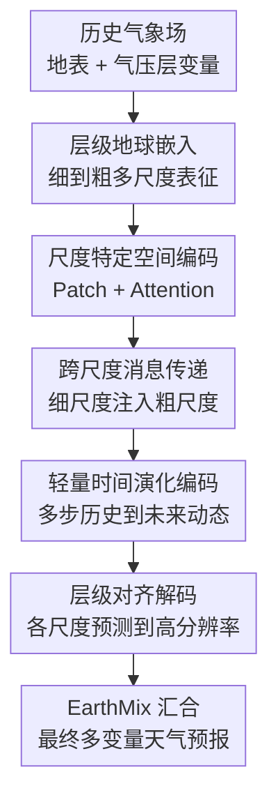

# STORM: Synergistic Cross-Scale Spatio-Temporal Modeling for Weather Forecasting

**会议**: ICLR2026  
**OpenReview**: [https://openreview.net/forum?id=JLF6XDnscF](https://openreview.net/forum?id=JLF6XDnscF)  
**代码**: https://github.com/h505023992/STORM  
**领域**: 时间序列 / 时空建模 / 天气预报  
**关键词**: 天气预报, 多尺度建模, 时空预测, ERA5, 长期滚动预报  

## 一句话总结
STORM 把全球气象场显式拆成细到粗的多尺度表征，并通过跨尺度消息传递、轻量时间演化编码和层级对齐解码，在 ERA5 全球与区域天气预报上同时提升短期精度和 7-10 天长期稳定性。

## 研究背景与动机

**领域现状**：天气预报长期依赖数值天气预报系统，它们通过求解大气动力学方程保证物理一致性，但在高分辨率、长时距、多变量场景下计算成本很高。近几年深度学习模型开始直接从 ERA5 等再分析数据中学习气象状态的演化，Pangu-Weather、GraphCast、FourCastNet、FuXi 等模型已经证明，数据驱动方法可以在全球预报中达到很强的精度和速度。

**现有痛点**：气象数据和普通视频序列不同。全球环流、季风、气压槽这类现象更像低频、粗尺度结构；降水、局地风场、区域温度异常又包含高频、细尺度变化。很多深度模型虽然有较强的空间编码器或时间预测器，但通常把输入压到一个统一尺度里处理，或者只学习从当前状态到下一步状态的映射。这会让模型在短期内还能跟住局部纹理，但滚动到多天后容易积累误差，粗尺度环流和细尺度细节也难以互相校正。

**核心矛盾**：天气预报需要同时满足两个要求：一方面要保留细网格上的局地结构，另一方面又要让预测服从更大尺度的时空演化。若只强调细尺度，模型容易过拟合局部变化并丢掉大范围稳定性；若只强调粗尺度，预测会变得平滑，区域细节和极端变化被抹掉。真正困难的是让不同空间尺度在同一个时间演化过程中协同工作，而不是各自独立做预测。

**本文目标**：作者把问题定义为多步时空预测：给定过去 $T$ 个时刻的气象状态 $X_{t-T+1:t}$，直接预测未来 $L$ 个时刻的状态 $\hat{X}_{t+1:t+L}$。在更长预报时距上，再用块状多步结果递归滚动。这样做的目标不是单纯提高一次预测的精度，而是降低长期 rollout 中的误差积累。

**切入角度**：STORM 的观察是，大气本身就是层级系统：粗尺度结构提供大范围背景，细尺度结构负责局地变化，二者在时间上一起演化。因此模型也应该先构造多尺度表示，再在每个尺度上学习空间依赖和时间演化，并让细尺度信息向粗尺度流动，最后把所有尺度的预测对齐回同一物理变量空间。

**核心 idea**：用“多尺度分解 + 跨尺度桥接 + 层级对齐重建”替代单尺度的时空映射，让天气模型在同一框架里同时看见局地细节、全球环流和长期时间演化。

## 方法详解

### 整体框架

STORM 的输入是过去 $T$ 个时刻的多变量气象场，包含地表变量和 13 个气压层上的大气变量，统一记作 $X \in \mathbb{R}^{T \times H \times W \times C}$。模型先用层级地球嵌入器把原始网格逐层下采样成多尺度表征，再用尺度桥接时空编码器在每个尺度上建模空间结构、时间变化和相邻尺度之间的信息流，最后用层级对齐预测解码器把每个尺度都投影到未来 $L$ 步的高分辨率气象场，并通过 EarthMix 汇合成最终预测。

这条 pipeline 的关键在于：STORM 不是只在最后融合多尺度特征，而是从输入嵌入、编码、解码到输出整合都保持多尺度路径存在。细尺度路径负责保留局部高频信息，粗尺度路径负责稳定大范围背景，跨尺度消息传递则让两者在编码阶段就发生交互。

形式上，模型以历史窗口 $X_{t-T+1:t}$ 为输入，输出未来块 $\hat{X}_{t+1:t+L}=\mathrm{Model}(X_{t-T+1:t};\Theta)$。当需要 7 天、10 天这类远超 $L$ 的预报时，STORM 不做一步一步的纯自回归，而是把最近 $T$ 个预测状态重新喂回模型，按块继续生成下一个 $L$ 步。这种 block-wise 多步滚动能减少一步预测反复迭代造成的误差放大。

### 关键设计

**1. 层级地球嵌入：先把同一气象场拆成细到粗的多尺度表征**

普通气象网格的每个时刻都包含大量变量和空间位置，如果直接在原始分辨率上建模，模型很容易被局地细节占满容量，难以稳定捕捉大尺度环流。STORM 因此先用一个 $3 \times 3$ 卷积把原始输入嵌入到隐藏维度，得到细尺度表示 $H_0$，再通过多层 stride 为 2 的卷积逐步下采样，构造 $H=\{H_0,H_1,\ldots,H_M\}$。

每一层下采样可写成 $H_m=\mathrm{LeakyReLU}(\mathrm{GroupNorm}(\mathrm{Conv2d}(H_{m-1})))$。这不是简单为了省计算，而是把“局地扰动”和“大范围背景”放进不同分辨率的表示里：$H_0$ 更接近细网格上的局地结构，$H_M$ 更容易表达粗尺度环流。GroupNorm 和 LeakyReLU 保证下采样过程中训练更稳定，也避免不同气象变量尺度差异过大时嵌入崩掉。

**2. 尺度桥接时空编码：空间、尺度、时间不再分开学**

得到多尺度表示后，STORM 对每个尺度先做独立空间编码。作者借鉴 ViT 的 patch 化思路：把第 $m$ 个尺度的网格切成二维 patch，用多头自注意力捕捉该尺度内部的空间依赖，然后再 DePatch 回网格结构。这样每个尺度都能学习自己的空间关系，细尺度关注局部结构，粗尺度关注更宽范围的依赖。

关键的跨尺度协同发生在 spatial encoding 之后。STORM 用 stride-2 卷积把更细一级的空间表示对齐到更粗一级，并加到粗尺度表示上：$H^{(n)}_{c,m}=\mathrm{CrossScaleMessaging}(H^{(n)}_{s,m-1})+H^{(n)}_{s,m}$。这一步让局地细节不是只在细尺度路径里孤立存在，而是能向上影响粗尺度背景；同时粗尺度预测也不只是模糊平均，而是在整合细尺度证据后形成。对天气预报来说，这等价于让局地异常和大尺度环流在特征层面先互相解释，再进入时间建模。

**3. 轻量时间演化编码：用低成本线性层学习多步动态而非单步映射**

气象数据的空间网格很大，若对每个空间位置和每个尺度都做完整时间自注意力，计算代价会非常高。STORM 选择更轻量的线性时间编码器，用两层线性映射和 GELU 在时间维上建模历史变化：$H^{(n)}_{t,m}=W_2\,\mathrm{GELU}(W_1 H^{(n)}_{s,m}+B_1)+B_2$。论文中强调这个时间网络参数量很小，少于 100 个参数，却能在多个尺度上提取历史步之间的动态关系。

这个设计的价值在于把“预测未来多个时间步”当成显式目标，而不是只学习当前到下一帧。对于长期天气预报，错误往往不是单步突然爆炸，而是在许多递归步骤中逐渐积累。STORM 通过 $T \rightarrow L$ 的块状预测和尺度内时间演化编码，让每个尺度都学习自己对应的时间节奏：粗尺度变化慢但影响久，细尺度变化快但局地性强，二者不必被同一个单步映射强行统一。

**4. 层级对齐解码：每个尺度都生成未来场，再在同一物理空间汇合**

很多多尺度模型在编码端做金字塔，在输出端只保留一个最高层特征或简单跳连。STORM 的解码器更强调“每个尺度都要能解释未来”。对第 $m$ 个尺度，模型先用尺度专属的时间线性层把历史特征映射成未来 $L$ 步表示 $Z_m$，再用与深度匹配的反卷积逐步上采样：$U_m=\mathrm{DeConv}_m(Z_m)$。粗尺度需要经过更多上采样层回到原始分辨率，细尺度则更直接地保留局地细节。

所有尺度被上采样到 $L \times H \times W \times D$ 后，共享一个变量维线性投影，把隐藏维映射回完整气象变量空间 $C$，得到 $V_m \in \mathbb{R}^{L \times H \times W \times C}$。最后 EarthMix 直接对多尺度预测进行整合，形成 $\hat{X}$。这种做法让粗尺度输出和细尺度输出都落在同一个物理变量空间中，避免“某个尺度只是辅助特征、没有被约束到真实天气场”的问题，也让多尺度贡献在最终预报里更可解释。

### 一个完整示例

假设模型要用过去若干个 6 小时间隔的 ERA5 状态预测未来 24 小时。输入中既有 T2M、U10、V10、MSLP、降水等地表变量，也有 500 hPa 或 925 hPa 上的风、温度、湿度、位势高度等大气变量。STORM 首先把这些变量拼成同一个时空张量，并在原始网格上得到 $H_0$。

接着，层级地球嵌入器把 $H_0$ 逐层下采样成例如 scale0、scale1、scale2。scale0 仍能看到东亚局地温度或降水结构，scale2 则更像在看大范围气压场和环流背景。每个尺度经过 patch attention 后，scale0 的细粒度信息会通过 stride-2 的跨尺度消息传递注入 scale1，再进一步影响 scale2。

时间编码器随后在每个尺度上把历史窗口转成未来 $L$ 步的动态表示。解码阶段，scale2 的粗尺度预测经过两次上采样回到原始网格，scale1 经过一次上采样，scale0 直接保留更细的空间结构。三路预测都投影回同一组气象变量后由 EarthMix 汇合。这样最终的 24 小时预报既能保持局地结构，又不容易偏离大范围天气形势。

在 7-10 天预报中，上述过程会按块重复：前一个块的最新 $T$ 个预测状态成为下一块输入。由于每个块本身是多步预测，模型不需要每 6 小时都独立滚动一次，误差累积压力比纯一步自回归更小。

### 损失函数 / 训练策略

论文主要把训练和评估设定放在标准 ERA5 多步预测框架中。训练数据为 1993-2017 年，验证集为 2018-2019 年，测试集为 2020-2021 年。模型直接学习从历史 $T$ 步到未来 $L$ 步的映射，长时距结果通过递归 rollout 得到。

评估时，所有预测会先反归一化，再计算气象预报常用的纬度加权 RMSE 和 ACC。RMSE 对不同纬度位置使用 $\alpha(h)$ 加权，以免高纬网格密度影响整体误差；ACC 则比较预测异常和真实异常相对于经验气候态 $C$ 的相关性。论文给出的核心指标形式是：

$$
\mathrm{RMSE}=\frac{1}{L}\sum_{\ell=1}^{L}\sqrt{\frac{1}{HW}\sum_{h,w}\alpha(h)(y_{\ell hw}-\hat{x}_{\ell hw})^2}
$$

其中 $\alpha(h)=\cos(h)/(\frac{1}{H}\sum_{h'}\cos(h'))$。ACC 使用去气候态后的 $\tilde{y}=y-C$ 和 $\tilde{\hat{x}}=\hat{x}-C$ 做加权相关，适合衡量大尺度天气形势是否仍然对齐。

## 实验关键数据

### 主实验

论文在 ERA5 上构造三种空间尺度：全球 5.625° 分辨率、南美洲 1° 分辨率、东亚 0.25° 分辨率。对比方法包括 Triton、Pangu-Weather、FourCastNet、FuXi、SimVP 和 U-Net，所有 baseline 都在相同变量和数据划分上重新训练，避免拿不同训练设置的公开数字直接比较。

| 场景 | 变量/指标 | STORM | 最强对比方法 | 提升解读 |
|------|-----------|-------|--------------|----------|
| 全球短期 24h | T2M RMSE↓ | 0.675 | Triton 0.873 | 地表温度短期误差明显更低 |
| 全球短期 24h | MSLP RMSE↓ | 71.8 | Triton 93.7 | 海平面气压保持更好的全局一致性 |
| 全球短期 24h | U500 RMSE↓ | 1.903 | Triton 2.500 | 中层风场的空间结构更准 |
| 全球短期 24h | Prec ACC↑ | 0.923 | Triton 0.891 | 降水这种局地高频变量也受益于多尺度建模 |
| 全球短期 24h | Z500 ACC↑ | 1.000 | Triton 1.000 | 位势高度在短期内几乎保持完美相关 |

长期全球预报是论文更能体现方法价值的部分。作者报告 7、8、9、10 天平均结果，STORM 在多种变量上都比强 baseline 更稳定。

| 场景 | 变量/指标 | STORM | 最强对比方法 | 提升解读 |
|------|-----------|-------|--------------|----------|
| 全球长期 7-10 天 | T2M RMSE↓ | 2.596 | SimVP 3.168 | 长期地表温度误差最低 |
| 全球长期 7-10 天 | U10 RMSE↓ | 3.857 | SimVP 3.901 | 低层风场略优于最强对比方法 |
| 全球长期 7-10 天 | Prec RMSE↓ | 1.4E-03 | SimVP 1.5E-03 | 降水长期预测仍有小幅优势 |
| 全球长期 7-10 天 | Q925 RMSE↓ | 3.3E-07 | SimVP 4.0E-07 | 低层湿度变量优势明显 |
| 全球长期 7-10 天 | Z925 ACC↑ | 0.981 | SimVP 0.971 | 大尺度位势高度形势保持最好 |

区域高分辨率实验说明 STORM 不只适用于粗分辨率全球网格。南美洲 1° 和东亚 0.25° 两个区域都覆盖 6 小时、1 天、4 天、7 天、10 天预报，模型在长时距上的优势更明显。

| 数据集 | 时距 | 指标 | STORM | 最强对比方法 | 说明 |
|--------|------|------|-------|--------------|------|
| 南美洲 1° | 6h | RMSE↓ / ACC↑ | 0.874 / 0.945 | Fuxi 0.913 / 0.941 | 短期已优于各 baseline |
| 南美洲 1° | 10d | RMSE↓ / ACC↑ | 3.510 / 0.499 | Fuxi 3.797 / 0.466 | 长期区域预测优势扩大 |
| 东亚 0.25° | 6h | RMSE↓ / ACC↑ | 14.53 / 0.980 | Triton 14.55 / 0.976 | 高分辨率短期仍领先 |
| 东亚 0.25° | 10d | RMSE↓ / ACC↑ | 200.9 / 0.524 | SimVP 202.5 / 0.523 | 10 天高分辨率区域预测略胜 |

### 消融实验

作者对三个关键组件做消融：去掉时间演化编码器记为 w/o T；把多尺度嵌入、编码、解码替换为单尺度建模记为 w/o M；去掉空间编码器记为 w/o S。论文用 T2M、U10、V10、PREC、MSLP、U500、V500、T500、Q500、Z500 等变量的 RMSE 做分析。

| 配置 | 关键指标 | 说明 |
|------|----------|------|
| Full STORM | 各变量 RMSE 最低 | 完整模型同时包含多尺度、空间编码和时间演化 |
| w/o T | RMSE 上升 | 没有时间演化编码后，多步动态学习不足，长期 rollout 更容易累积误差 |
| w/o M | RMSE 上升 | 单尺度版本难以同时处理局地高频和大尺度环流 |
| w/o S | 下降最明显之一 | 空间编码器对网格气象场的变量间和区域间依赖非常关键 |
| 尺度数分析 | 三个尺度较优 | 增加尺度能提升性能，但超过三个尺度后收益变小 |

### 关键发现

- 多尺度不是锦上添花，而是天气预报场景中的核心结构假设。图 7 的尺度分析显示，最细尺度更擅长捕捉局地细节，最粗尺度更擅长表示全球环流，单独使用任一尺度都会有偏差，融合后预测最准确。
- 空间编码器贡献很大，说明天气预报不能只当作每个网格点的独立时间序列。气象变量之间存在明显的空间传播和大范围耦合，patch attention 对这种结构有帮助。
- 长期预报的优势比短期更能说明 STORM 的价值。短期内强 baseline 也能靠局部拟合取得不错结果，但到 7-10 天后，多尺度时间演化和块状 rollout 的稳定性开始显现。
- 区域高分辨率实验很重要，因为它验证了 STORM 不是只在低分辨率全球数据上有效。0.25° 东亚区域仍能保持优势，说明细尺度路径确实在起作用。

## 亮点与洞察

- STORM 的核心亮点是把多尺度贯穿到整个模型生命周期，而不是只在输入或输出处做一次金字塔融合。这样每个尺度既有自己的空间编码和时间预测，也能通过跨尺度消息传递互相影响。
- 论文没有追求复杂的时间 Transformer，而是用非常轻量的线性时间编码器建模多步历史。这一点很务实：天气数据的空间维度巨大，把计算预算留给空间和尺度结构可能比堆时间注意力更划算。
- Level-Aligned Forecasting Decoder 的思路值得迁移。很多时空预测任务也存在“粗尺度趋势 + 细尺度细节”的问题，比如交通流、空气质量、海洋温度、遥感时序变化，都可以让不同尺度各自预测未来，再对齐到同一输出空间。
- 论文的实验覆盖全球、洲际、区域三个尺度，并同时看短期和长期预报，比只在单一 ERA5 分辨率上报一个表更有说服力。特别是 7-10 天结果，直接对应天气预报中最容易暴露误差累积的问题。

## 局限与展望

- 论文主要在 ERA5 再分析数据上验证，尚未充分说明模型在真实业务预报链路中的表现，例如与实时观测误差、资料同化误差、不同数据源缺测噪声结合时是否仍稳定。
- STORM 强调数据驱动的跨尺度学习，但没有显式加入物理约束。对于守恒关系、极端天气、物理一致性更强的场景，未来可以考虑把能量、水汽或风场约束以 loss 或结构先验方式加入模型。
- EarthMix 使用直接求和整合多尺度预测，简单高效，但也可能限制不同地区、变量、时距下的自适应融合能力。后续可以探索变量感知或 lead-time 感知的尺度权重，让模型在降水、温度、位势高度等变量上采用不同融合策略。
- 论文展示了三尺度较优，但不同分辨率、不同区域、不同预报任务下最优尺度数可能变化。若要部署到更高分辨率全球预报，尺度深度、patch 大小和计算成本之间还需要系统调参。
- 实验重点是 deterministic forecasting，未来可以扩展到集合预报或概率预报，给出不确定性估计，而不仅是单一路径的未来气象场。

## 相关工作与启发

- **vs Pangu-Weather**: Pangu-Weather 代表 Transformer 式全球天气模型，重点是高效学习三维气象场映射；STORM 更强调多尺度时空协同，尤其是细到粗的信息传递和多步时间演化，因此在长期 rollout 上更有针对性。
- **vs FourCastNet**: FourCastNet 使用 Fourier neural operator 类思想建模全球场，擅长高效捕捉大范围模式；STORM 则通过显式层级尺度把粗尺度环流和细尺度局地结构分开处理，再在输出阶段融合，细节保持能力更强。
- **vs FuXi / Triton**: FuXi 和 Triton 都是强天气预报 baseline，Triton 尤其适合短期预测；STORM 的优势在于短期不输，长期和区域高分辨率场景更稳，说明其改进不是只针对某个特定 lead time。
- **vs SimVP / U-Net**: SimVP 和 U-Net 更像通用视频或图像预测架构，能作为网格时空建模基线，但缺少面向大气层级结构的设计。STORM 的启发是，天气预报不能只套通用视觉时序模型，必须把领域中的尺度耦合写进架构。

## 评分

- 新颖性: ⭐⭐⭐⭐☆ 显式把层级嵌入、跨尺度消息传递、多步时间演化和对齐解码整合到天气预报框架中，方向清晰但组件本身多来自成熟模块组合。
- 实验充分度: ⭐⭐⭐⭐⭐ 全球、洲际、区域、多分辨率、短期、长期、消融和尺度分析都覆盖到了，结论支撑比较扎实。
- 写作质量: ⭐⭐⭐⭐☆ 方法结构清楚，图表完整，但部分公式和符号排版略粗糙，个别地方如 EarthMix 的具体实现解释还可以更细。
- 价值: ⭐⭐⭐⭐⭐ 对数据驱动天气预报很有参考价值，尤其适合启发后续多尺度时空模型和长期滚动预报架构设计。

<!-- RELATED:START -->

## 相关论文

- [\[ICLR 2026\] Are Global Dependencies Necessary? Scalable Time Series Forecasting via Local Cross-Variate Modeling](are_global_dependencies_necessary_scalable_time_series_forecasting_via_local_cro.md)
- [\[ICLR 2026\] TRIDENT: Cross-Domain Trajectory Spatio-Temporal Representation via Distance-Preserving Triplet Learning](trident_cross-domain_trajectory_spatio-temporal_representation_via_distance-pres.md)
- [\[ICML 2026\] Nested Spatio-Temporal Time Series Forecasting](../../ICML2026/time_series/nested_spatio-temporal_time_series_forecasting.md)
- [\[ICLR 2026\] SONATA: Synergistic Coreset Informed Adaptive Temporal Tensor Factorization](sonata_synergistic_coreset_informed_adaptive_temporal_tensor_factorization.md)
- [\[ICML 2026\] Generalizing Multi-scale Time-Series Modeling with a Single Operator](../../ICML2026/time_series/generalizing_multi-scale_time-series_modeling_with_a_single_operator.md)

<!-- RELATED:END -->
