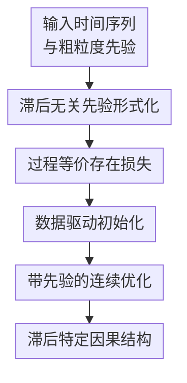

# Structure Learning from Time-Series Data with Lag-Agnostic Structural Prior

**会议**: ICLR 2026  
**OpenReview**: [https://openreview.net/forum?id=kdJsB0J4Ic](https://openreview.net/forum?id=kdJsB0J4Ic)  
**代码**: 无  
**领域**: 时间序列结构学习 / 动态因果发现  
**关键词**: 滞后无关先验, 时间序列因果发现, 结构学习, 连续优化, DYNOTEARS

## 一句话总结

这篇论文研究如何把“变量 $j$ 会影响变量 $i$，但不知道具体滞后几步”的粗粒度因果先验融入时间序列结构学习，并通过过程等价的先验损失与数据驱动初始化，更稳定地恢复细粒度的滞后因果结构。

## 研究背景与动机

**领域现状**：时间序列结构学习希望从多变量序列 $X \in \mathbb{R}^{T \times d}$ 中恢复动态因果机制：变量之间既可能有瞬时影响，也可能有滞后影响。以 DYNOTEARS 为代表的连续优化方法会把每个滞后 $\tau$ 对应成一张结构矩阵 $W_\tau$，其中 $W_0$ 表示同一时间片内的瞬时边，$W_\tau, \tau>0$ 表示从 $t-\tau$ 到 $t$ 的跨时间片边；再用 NOTEARS 的光滑 DAG 约束保证 $W_0$ 无环。

**现有痛点**：现实里研究者往往知道一些高层因果关系，例如“某个基因调控另一个基因”或“某个脑区影响另一个脑区”，但通常不知道这个影响发生在第 $1$ 个、$2$ 个还是第 $L$ 个滞后步。已有带先验的动态结构学习方法更偏向处理 lag-specific prior，也就是直接指定 $(W_s)_{ij}$ 这条具体滞后边存在或不存在；一旦先验里的滞后标错，方法就会把错误信息硬塞进模型。

**核心矛盾**：lag-agnostic prior 的语义是“至少有一个滞后上存在 $j \to i$”，不是“某个预先选定的滞后一定存在”。如果直接用 $\max_\tau |(W_\tau)_{ij}|$ 这类看似自然的约束，优化早期哪个滞后权重大一点，后续梯度就可能只推这个滞后，模型会过早把一个粗粒度先验误当成具体滞后先验。于是，约束在最终逻辑上可能满足了，但优化过程已经偏离了先验真正想表达的“滞后未知”。

**本文目标**：作者要解决三个子问题：第一，形式化什么叫滞后无关的边存在和边不存在；第二，设计既能在收敛后满足先验、又不会在优化过程中偏向某个滞后的损失；第三，处理这种“多个滞后任选一个满足”的 OR 语义带来的额外非凸性，让优化更不容易掉进错误滞后的局部最优。

**切入角度**：论文把问题放在连续结构学习框架里，而不是重新发明一套离散搜索算法。这样做的好处是，现有的 DYNOTEARS、LIN、RHINO、NTS-NOTEARS 等优化型动态因果发现方法都可以作为 backbone，只要在目标函数上补充合适的 lag-agnostic prior loss，并给出更稳的初始化策略。

**核心 idea**：用“同时考虑所有候选滞后”的过程等价损失，替代会早期锁定单一滞后的 maximum-based penalty，再用数据驱动初始化先找到与观测数据更一致的滞后方向，从而把粗粒度先验转化为细粒度时间因果结构的有效引导。

## 方法详解

### 整体框架

本文从标准时间序列结构学习出发：输入是多变量时间序列 $X$、最大滞后 $L$，以及两类滞后无关先验矩阵 $C_p$ 和 $C_a$。$C_p$ 表示某个变量对之间“应该存在因果边，但具体滞后未知”，$C_a$ 表示某个变量对之间“所有滞后都不应有边”。方法输出的是一组滞后特定结构矩阵 $W_{0:L}$，也就是每条边不仅知道是否存在，还知道落在哪个时间滞后上。

整体流程可以理解成“先定义先验语义，再把语义变成不会误导优化的损失，最后用两阶段优化稳定求解”。边不存在先验比较直接：如果 $(C_a)_{ij}=1$，就把所有滞后上的 $(W_\tau)_{ij}$ 都压为 $0$。难点在边存在先验：如果 $(C_p)_{ij}=1$，只要求存在某个 $\tau$ 使 $|(W_\tau)_{ij}|>\delta$，但不能提前指定是哪一个 $\tau$。

在优化上，论文仍然保留原始的时间序列拟合损失 $\mathcal{L}(X; W_{0:L})$ 和瞬时图无环约束 $h(W_0)=0$，并把滞后无关存在先验作为软惩罚加入目标：

$$
\min_{W_{0:L}} \mathcal{L}(X; W_{0:L}) + \lambda_p \sum_{i,j} (C_p \circ p(W))_{ij}, \quad \text{s.t. } h(W_0)=0.
$$

这里 $p(W)$ 是本文真正要设计的先验损失。它必须满足两个层次的要求：结果上等价，即损失为 $0$ 当且仅当至少一个滞后边超过阈值；过程上也等价，即优化时不应因为初始化中某个滞后略大，就只推动那一个滞后。

### 关键设计

**1. 滞后无关先验形式化：把粗粒度边存在写成跨滞后的 OR 约束**

论文首先明确了先验的语义。对于边不存在先验 $(C_a)_{ij}=1$，要求所有滞后 $\tau \in \{0,1,\ldots,L\}$ 上都有 $(W_\tau)_{ij}=0$，这本质上是跨滞后的 AND 约束：每个候选滞后都必须不存在。对于边存在先验 $(C_p)_{ij}=1$，要求至少一个滞后上满足 $|(W_\tau)_{ij}|>\delta$，也就是

$$
W_{0:L} \vDash C_p \Longleftrightarrow \forall (i,j), (C_p)_{ij}=1,\ \max_\tau |(W_\tau)_{ij}| > \delta.
$$

这个定义看起来简单，但它把任务难点暴露出来了：存在先验不是一个点约束，而是跨多个滞后候选的 OR 关系。若训练过程只关注当前最大的 $|(W_\tau)_{ij}|$，优化器就会把 OR 关系退化成“当前最大那个滞后必须存在”。这也是作者提出“consequential equivalence”和“process equivalence”的原因：前者只看最终是否满足约束，后者要求优化轨迹也尊重“滞后未知”的语义。

**2. 过程等价存在损失：同时推动所有候选滞后，避免早期锁死错误滞后**

论文指出，直觉上的 maximum-based formulation

$$
(p_{\max}(W))_{ij}=\operatorname{ReLU}\left(\delta-\max_\tau |(W_\tau)_{ij}|\right)
$$

虽然结果上等价，但过程上不等价。假设所有候选滞后都被数据拟合项和稀疏正则往 $0$ 推，而初始化时 $\tau_0$ 的绝对权重刚好比其他滞后大一点，那么最大值损失只会给 $\tau_0$ 这条边反向推力；其他滞后完全没有机会被探索。只要 $\tau_0$ 超过阈值，先验惩罚就消失，模型也就停止寻找真正更符合数据的滞后。

为避免这个问题，作者提出 binary-masked formulation：当所有滞后都低于阈值时，统一惩罚所有候选滞后；只要有任意一个滞后达标，惩罚关闭。

$$
(p_{\mathrm{bin}}(W))_{ij}=\mathbb{I}\left(\max_\tau |(W_\tau)_{ij}| < \delta\right) \sum_\tau \operatorname{ReLU}\left(\delta-| (W_\tau)_{ij} |\right).
$$

它的关键不是“把所有滞后都变大”，而是在约束未满足前给所有滞后同等机会；真正哪个滞后先越过阈值，由数据拟合损失的梯度冲突程度决定。若某个滞后与数据最一致，它受到的数据项阻力更小，就会更早满足先验，从而自然成为被选择的 lag-specific edge。

**3. 逻辑对偶损失：用乘积表达 OR 语义，让优化更平滑**

binary-masked formulation 有一个指示函数，语义清楚但不够平滑。论文进一步从“不存在”的逻辑对偶推出存在约束。边不存在要求所有滞后都不存在，是 AND；边存在则是只要有一个滞后存在即可，是 OR。于是可以用乘积来表达：

$$
(p_{\mathrm{or}}(W))_{ij}=\prod_\tau \operatorname{ReLU}\left(\delta-| (W_\tau)_{ij} |\right).
$$

只要任意一个滞后上的边超过阈值，对应 ReLU 项为 $0$，整个乘积就为 $0$，先验被满足。与 maximum-based formulation 不同，乘积项在未满足约束时仍然同时依赖所有候选滞后，因此不会只把梯度给当前最大的那个滞后。它还避免了 indicator 带来的不连续，使优化动态更平滑。

不过乘积也有尺度问题：当候选滞后数 $L$ 很大时，多个小于 $1$ 的项相乘会让损失迅速变小，先验信号可能变弱。作者用归一化版本缓解这个问题：

$$
(\bar{p}_{\mathrm{or}}(W))_{ij}=\prod_\tau \frac{1}{\delta}\operatorname{ReLU}\left(\delta-| (W_\tau)_{ij} |\right).
$$

这样在所有候选边都为 $0$ 时，损失规模不会随最大滞后数改变而系统性缩小，比较适合不同 $L$ 设置下复用。

**4. 数据驱动初始化：先让数据决定滞后倾向，再引入粗粒度先验**

lag-agnostic prior 的 OR 结构会带来额外非凸性。即便基础 VAR 拟合问题本身是凸的，加入“某个滞后达标即可”的先验后，也会形成多个局部最优：第 $0$ 个滞后达标、第 $1$ 个滞后达标、第 $2$ 个滞后达标都可能满足同一个粗粒度先验，但只有其中一个真正符合数据生成过程。

作者用一个两变量三时间步的 toy example 展示了这种现象：同一个 $X_2 \to X_1$ 的滞后无关先验可以由 $W_0$、$W_1$ 或 $W_2$ 满足，三个解都满足约束，但损失不同，只有 $W_2=1$ 的解更好。这说明直接从零初始化或随机初始化开始，优化很容易先撞上一个“能满足先验但滞后不对”的盆地。

因此论文采用两阶段优化。第一阶段不使用滞后无关先验，只解标准结构学习问题：

$$
\hat{W}^{\mathrm{data}}_{0:L}=\arg\min_{W_{0:L}} \mathcal{L}(X; W_{0:L}), \quad \text{s.t. } h(W_0)=0.
$$

第二阶段用这个数据驱动解作为初始化，再优化带先验损失的目标：

$$
\min_{W_{0:L}} \mathcal{L}(X; W_{0:L}) + \lambda_p \sum (C_p \circ p(W)), \quad \text{s.t. } h(W_0)=0,\ W^{(0)}_{0:L}=\hat{W}^{\mathrm{data}}_{0:L}.
$$

这种做法的直觉很清楚：先让数据告诉模型哪些滞后更可疑，再让先验补足数据不足的边。相比从零开始让先验主导早期方向，它更不容易把粗粒度先验落到错误滞后上。

### 一个完整示例

假设有三个变量 $A,B,C$，最大滞后 $L=3$。领域专家只给出一个粗粒度先验：“$B$ 会影响 $A$”，但没有说明是即时影响、滞后 $1$ 步、滞后 $2$ 步还是滞后 $3$ 步。于是 $(C_p)_{A,B}=1$，对应四个候选边：$(W_0)_{A,B}$、$(W_1)_{A,B}$、$(W_2)_{A,B}$、$(W_3)_{A,B}$。

如果用 maximum-based loss，而初始化时四个权重绝对值分别是 $0.04, 0.05, 0.03, 0.02$，模型很可能只推动 $W_1$，因为它当前最大。即便真实数据更支持 $B_{t-3}\to A_t$，$W_3$ 也可能在先验项里一直拿不到足够梯度。最后 $W_1$ 超过阈值 $\delta=0.1$ 后，先验惩罚关闭，模型输出“滞后 $1$ 步有边”。

用本文的 binary-masked 或 logic-dual loss 时，约束未满足前四个候选滞后都会被纳入损失。数据拟合项如果更支持 $W_3$，那么 $W_3$ 受到的阻力更小，更可能先到达阈值。再配合数据驱动初始化，第一阶段已经会让 $W_3$ 比其他滞后更接近可解释方向，第二阶段的先验就更像“确认并强化这条边”，而不是“随便找一个滞后把约束凑满”。

### 损失函数 / 训练策略

基础数据拟合沿用线性 VAR 形式：

$$
X_t=\sum_{\tau=0}^{L} W_\tau X_{t-\tau}+\epsilon_t.
$$

瞬时结构 $W_0$ 通过 NOTEARS 的光滑无环约束控制：

$$
h(W_0)=\operatorname{Tr}\left(e^{W_0 \circ W_0}\right)-d=0.
$$

训练目标由三部分组成：时间序列拟合损失、无环约束对应的增广拉格朗日优化、以及 lag-agnostic prior penalty。默认实验设置中，先验比例 $p=80$，先验损失权重 $\lambda_p=0.5$，边阈值 $\delta=0.1$，最大滞后 $L=3$。作者分别测试了 binary-masked loss（记作 Backbone&）和 logic-dual loss（记作 Backbone*），并比较了零初始化、随机初始化和数据驱动初始化。

推断结束后，结构通过阈值化得到：

$$
\hat{W}_\tau=\mathbb{I}(|W_\tau|>\delta)\circ W_\tau.
$$

这一步也说明本文的先验不是只恢复 summary graph，而是最终仍然输出 lag-specific structure：粗粒度知识只是训练时的指导，输出仍保留具体滞后。

## 实验关键数据

### 主实验

论文在合成数据和真实 DREAM4 基因调控数据上做评估。合成数据主要基于 ER 随机图、线性 VAR 过程、Gaussian/Exponential 噪声，并改变节点数、样本数、图密度、先验比例和最大滞后。真实数据 DREAM4 的 ground truth 给的是 summary graph 而非具体滞后，因此正好适合测试 lag-agnostic prior。

| 设置 | 方法 | SHD↓ | F1↑ | 结论 |
|------|------|------|-----|------|
| 20节点 ER4, Gaussian, $L=5$, 50% priors | DYNOTEARS | 13.00±3.10 | 0.91±0.02 | 无先验 baseline |
| 同上 | LS-0, Perfect Lags | 4.83±1.33 | 0.97±0.01 | 需要 oracle 级准确滞后信息 |
| 同上 | LS-50, 50% Error | 11.83±1.94 | 0.92±0.01 | lag-specific 先验对滞后错误很脆弱 |
| 同上 | DYNOTEARS& (Init Data) | 6.17±2.71 | 0.95±0.02 | 二值掩码损失接近 oracle |
| 同上 | DYNOTEARS* (Init Data) | 5.50±1.76 | 0.96±0.01 | 逻辑对偶损失表现最稳 |

这个结果最能体现论文的实际价值：如果有人真的知道完美的具体滞后，lag-specific prior 当然最好；但现实中只要具体滞后有 10% 以上错误，本文的 lag-agnostic 方法就开始更有竞争力。到 50% 错误时，lag-specific prior 几乎退回 baseline，而本文仍明显改善结构恢复。

在 DREAM4 上，作者报告了不同样本规模下的回归损失和 summary graph AUROC。下面摘取 75% priors 的结果：

| 方法 | DREAM4-63 Loss↓ / AUROC↑ | DREAM4-126 Loss↓ / AUROC↑ | DREAM4-189 Loss↓ / AUROC↑ | 结论 |
|------|--------------------------|----------------------------|----------------------------|------|
| NOTEARS | 8.20±0.73 / 0.54±0.03 | 8.02±0.92 / 0.55±0.03 | 7.89±0.73 / 0.55±0.03 | 静态无先验 baseline |
| NOTEARS+Prior | 6.68±0.42 / 0.89±0.01 | 6.61±0.53 / 0.89±0.01 | 6.65±0.42 / 0.89±0.01 | summary graph 上有提升，但不建模滞后 |
| DYNOTEARS | 7.81±1.14 / 0.58±0.03 | 5.61±1.04 / 0.62±0.04 | 4.08±0.60 / 0.65±0.05 | 动态无先验 baseline |
| DYNOTEARS-RandomLag | 7.45±0.98 / 0.70±0.02 | 6.20±0.72 / 0.75±0.03 | 5.43±0.84 / 0.77±0.05 | 随机指定滞后会损害预测 |
| DYNOTEARS& (Init Data) | 6.02±0.78 / 0.90±0.01 | 4.46±0.64 / 0.91±0.01 | 3.25±0.33 / 0.92±0.02 | 同时提升结构和预测 |
| DYNOTEARS* (Init Data) | 6.22±0.72 / 0.89±0.01 | 4.88±0.85 / 0.91±0.01 | 3.40±0.42 / 0.92±0.02 | 稳定优于 baseline |

真实数据结果说明，随机给先验分配滞后可能让 AUROC 看起来变好，但会损害测试回归损失；本文的做法则能在不伪造具体滞后的情况下，同时改善 summary graph recovery 和预测质量。

### 消融实验

| 消融问题 | 代表结果 | 说明 |
|----------|----------|------|
| 是否需要过程等价损失 | DYNOTEARS* 通常优于 maximum-based DYNOTEARSˆ，尤其在 Init 0 下差距明显 | 最大值损失会过早选择某个滞后，违反 lag-unknown 语义 |
| 是否需要数据驱动初始化 | 在 30节点合成图上，Init Data 比随机初始化方差更小、平均表现更好 | 先由数据给出滞后倾向，可减少错误局部最优 |
| 是否能迁移到非线性 backbone | NTS-NOTEARS* 在 ANM/AIM 非线性数据上随先验比例增加提升 F1，prior recovery 达到 1.00 | 方法不依赖线性 DYNOTEARS，本质是 prior loss 插件 |
| presence vs absence priors | 80% absence priors 能改善 baseline，但幅度小于 presence priors | 不存在先验主要删假边，存在先验能主动找回漏边 |
| 最大滞后过大时是否过拟合 | 真实 $L=5$、模型设 $L=10$ 时，额外滞后上的最大边权接近 0 | 方法能优先使用真实时间范围内的滞后 |
| 先验错误鲁棒性 | presence prior 错误率到 30% 仍优于 baseline；absence prior 对错误更敏感 | “错说有边”可被软约束和数据抵消，“错说无边”会直接删除真边 |

### 关键发现

- 过程等价是本文性能提升的核心。maximum-based formulation 不是因为最终约束错，而是因为训练过程错：它把滞后未知的先验变成了当前最大滞后的特定先验。
- 数据驱动初始化对 binary-masked loss 尤其重要，因为 indicator 会让优化面更不平滑；logic-dual loss 本身较平滑，即使 Init 0 也更稳，但 Init Data 仍通常更好。
- 与 lag-specific prior 的比较很有说服力：在完美滞后信息下本文不是 oracle，但只要具体滞后不可靠，lag-agnostic prior 更符合现实，也更稳。
- 真实 DREAM4 数据上，方法不仅提升 AUROC，还降低测试回归损失，说明它不是单纯把已知 summary graph “贴”到输出上，而是在动态模型里找到了更有预测意义的滞后结构。

## 亮点与洞察

- 提出“process-equivalence”这个视角很有价值。很多约束设计只证明最终解满足某个逻辑条件，但在非凸优化里，训练轨迹本身会决定落到哪个局部最优；本文把“先验语义是否在优化过程中被尊重”单独拿出来分析，抓住了 lag-agnostic prior 的关键坑。
- binary-masked 和 logic-dual 两个损失都很简洁。前者直观地在未满足时统一推动所有候选滞后，后者用乘积把 OR 逻辑连续化，都是可以直接接到现有连续结构学习框架里的小改动。
- 两阶段初始化不是复杂 trick，但非常贴合问题。它承认 lag-agnostic prior 会增加非凸性，因此先让数据拟合项给出一个合理出发点，再让先验补充召回，避免先验在冷启动时主导错误滞后选择。
- 这篇论文的思想可以迁移到其他“存在但位置未知”的结构先验里。例如静态图里的路径存在、时空图里的空间邻域未知边、神经网络中的跨层连接先验，都可能面临“最终 OR 条件满足但过程过早锁定某个候选”的问题。

## 局限与展望

- 方法当前默认没有潜在混杂和缺失变量。真实时间序列常见未观测驱动因素，如果某条 lag-agnostic prior 实际来自共同原因而非直接因果边，模型可能仍会恢复出直接边。
- 两阶段优化缓解但不能消除非凸性。作者也明确说明方法不保证全局最优，尤其在节点数大、最大滞后长、先验密集时，优化迭代成本会上升。
- presence prior 的软约束比较鲁棒，但 absence prior 对错误更敏感。实际使用时，“确定不存在”的专家知识需要比“可能存在”的知识更谨慎，否则会直接压掉真边。
- 当前主要处理 lag-agnostic edge presence/absence。未来可以进一步扩展到更弱但更常见的先验，比如“存在从 $i$ 到 $j$ 的动态路径”、变量组之间的偏序、或只知道影响发生在某个时间窗口内。
- 实验主要围绕结构恢复指标和预测损失，真实科学发现里还需要更强的外部验证，例如干预实验、领域专家审阅或跨数据集复现。

## 相关工作与启发

- **vs DYNOTEARS**: DYNOTEARS 把 NOTEARS 扩展到时间序列，通过 $W_{0:L}$ 同时学习瞬时和滞后结构；本文保留这个连续优化框架，但加入了滞后无关先验，使模型能利用现实中更常见的 summary causal knowledge。
- **vs NTS-NOTEARS**: NTS-NOTEARS 支持带具体滞后的先验监督，适合已知 $(W_s)_{ij}$ 的场景；本文处理的是只知道 $i \to j$、不知道 $s$ 的场景，避免把不可靠的滞后信息硬编码进模型。
- **vs 静态结构先验方法**: 静态因果发现中常用边、路径、偏序等先验，但它们不需要决定具体时间滞后。本文的贡献在于把这些粗粒度知识接到动态结构学习中，并分析了“时间维度上的不确定性”带来的特殊非凸性。
- **vs maximum-based surrogate**: 最大值 surrogate 最像定义本身，也最容易被误用；本文清楚展示了它结果等价但过程不等价，提醒后续做 differentiable constraints 时不能只看约束集合，还要看梯度如何分配。

## 评分

- 新颖性: ⭐⭐⭐⭐⭐ 明确提出 lag-agnostic structural prior 在时间序列结构学习中的形式化问题，并给出过程等价这一有辨识度的分析角度。
- 实验充分度: ⭐⭐⭐⭐⭐ 合成数据、真实 DREAM4、多 backbone、初始化、损失形式、先验比例、最大滞后、先验错误鲁棒性都有覆盖，实验面很完整。
- 写作质量: ⭐⭐⭐⭐☆ 主线清楚，理论和实验互相支撑；不足是附录实验非常多，读者需要花时间区分哪些是核心结果、哪些是补充验证。
- 价值: ⭐⭐⭐⭐⭐ 现实里准确滞后先验很少见，粗粒度因果知识更常见；这篇论文把这种知识可靠接入动态因果发现，实用意义很强。

<!-- RELATED:START -->

## 相关论文

- [\[ICLR 2026\] Understanding Transformers for Time Series: Rank Structure, Flow-of-ranks, and Compressibility](understanding_transformers_for_time_series_rank_structure_flow-of-ranks_and_comp.md)
- [\[ICLR 2026\] Rating Quality of Diverse Time Series Data by Meta-learning from LLM Judgment](rating_quality_of_diverse_time_series_data_by_meta-learning_from_llm_judgment.md)
- [\[ICLR 2026\] Latent-to-Data Cascaded Diffusion Models for Unconditional Time Series Generation](latent-to-data_cascaded_diffusion_models_for_unconditional_time_series_generatio.md)
- [\[ICML 2026\] Parametric Prior Mapping Framework for Non-stationary Probabilistic Time Series Forecasting](../../ICML2026/time_series/parametric_prior_mapping_framework_for_non-stationary_probabilistic_time_series_.md)
- [\[ICLR 2026\] AutoDA-Timeseries: Automated Data Augmentation for Time Series](autoda-timeseries_automated_data_augmentation_for_time_series.md)

<!-- RELATED:END -->
