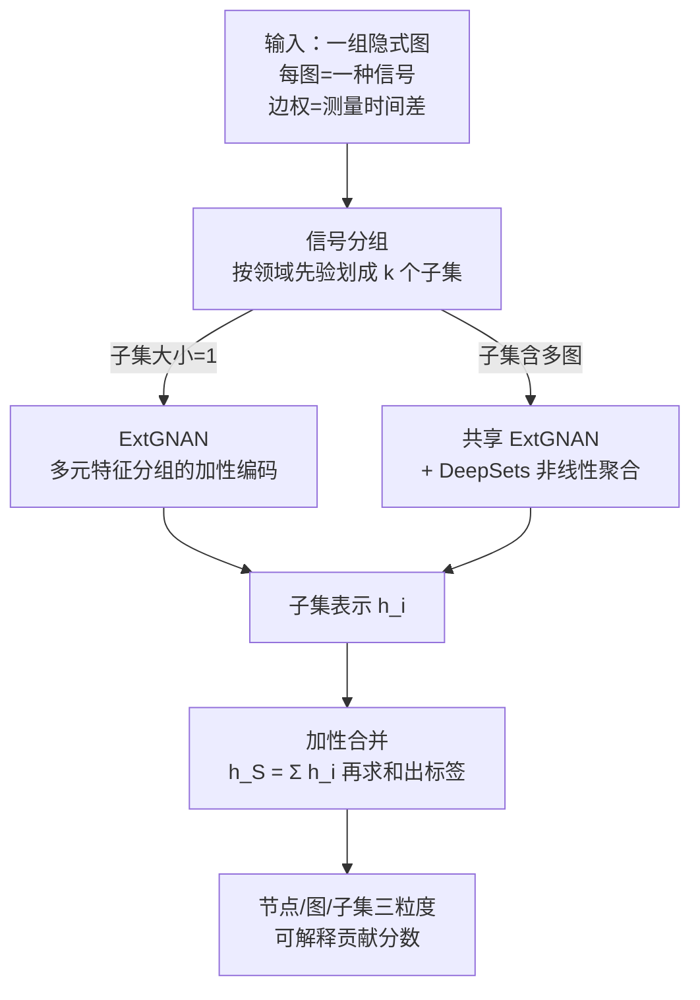

# SuperMAN: Interpretable and Expressive Networks over Temporally Sparse Heterogeneous Data

**会议**: ICLR 2026  
**OpenReview**: [https://openreview.net/forum?id=1MVeSLvfxU](https://openreview.net/forum?id=1MVeSLvfxU)  
**代码**: https://github.com/azerio/Super-Mixing-Additive-Networks---SuperMAN  
**领域**: 时序学习 / 图神经网络 / 可解释性 / 临床预测  
**关键词**: 不规则时序, 隐式图, 加性网络, 可解释性, 表达力

## 一句话总结
SuperMAN 把"多类型、采样间隔不规则、异步"的稀疏时序数据建模成"一组隐式图"，用一种扩展的图加性网络（ExtGNAN）+ 子集分组机制直接学习，既能给出节点/图/子集三个粒度的可解释贡献分数，又能在有领域先验时用"分组"换取更强表达力，在 Crohn 病发病预测、ICU 住院时长、假新闻检测上都拿到 SOTA。

## 研究背景与动机
**领域现状**：现实里的时序数据常常是"多种信号、各自按自己的频率在不同时间点被记录"。比如一个病人的血检记录，不同生化指标的测量时间和频率都不一样，整体就是一组碎片化、稀疏、不对齐的时间信号；新闻在社交网络里的传播树、系统的事件日志也是同样的形态。主流做法是把这些信号对齐到一个固定大小的时间网格，强行造一条共享时间轴，然后靠裁剪/聚合 + 插值或学习式 imputation 把缺失补齐，再喂给 Transformer / RNN / ODE。

**现有痛点**：这种"先对齐再补齐"的范式有两个硬伤。一是补缺会造成实质性的信息损失，甚至扭曲动力学，很多研究发现 imputation 并不一定提升下游预测；二是它把"不规则"本身当噪声抹掉了，而恰恰是测量间隔的疏密、不同指标采样节奏的差异里藏着信息（病人某段时间频繁查某项血指标，本身就是临床信号）。更要命的是，在医疗这种高风险场景，临床医生不仅要预测结果，还要知道"模型凭什么这么判"，而上述黑盒方法几乎不提供内建可解释性。

**核心矛盾**：表达力和可解释性之间存在 trade-off——纯加性、特征不混合的模型（如 GNAN）完全透明但表达力受限，遇到特征间强交互的任务就拉胯；而能建模非线性交互的强模型又变回黑盒。同时还有一个结构矛盾：已有能直接建模稀疏性的方法（如 Raindrop）只能处理"路径状"信号，处理不了任意结构的图，也不给可解释性。

**本文目标**：(1) 不做对齐、不做 imputation，直接从异构稀疏不规则信号学习；(2) 在节点、图、子集三个粒度提供可解释贡献；(3) 当有领域先验时，允许用户用"牺牲细粒度可解释性"去换"更强表达力"，并从理论上证明这种交换确实严格提升表达力。

**切入角度**：把每一种信号类型建模成一张有向图——节点是单次测量，边权是两次测量之间的时间差。这样"不规则采样"被显式编码进图结构，不用补齐；而图加性网络（GNAN）天然可解释，正好作为可解释骨架来扩展。

**核心 idea**：用"一组隐式图 + 加性分解"代替"固定时间网格 + imputation"，并引入"信号分组 / 特征分组"作为可解释性↔表达力之间可调的旋钮。

## 方法详解

### 整体框架
SuperMAN 作用在一个**图集合** $S=\{G_1,\dots,G_m\}$ 上：每张图来自一种信号类型（如一个生化指标），节点是这种信号的单次测量（带特征值 $x_v$ 和时间戳 $t_v$），有向边上的距离 $\Delta_{uv}=t_u-t_v$ 编码两次测量的时间差（无路径则为 0）。图可以是显式给定的（如假新闻的传播树），也可以由时间戳现场构造成有向路径图（如血检数据）。

整条 pipeline 是"分组 → 子集内编码 → 加性求和 → 出标签"：先把 $m$ 张图按领域先验划分成 $k$ 个**不相交子集** $S_1,\dots,S_k$；每个子集用一个独立的 $\Phi_i$ 编码成向量 $h_i\in\mathbb{R}^d$；整集合表示就是各子集表示**直接相加** $h_S=\sum_i h_i$；最后把 $h_S$ 的 $d$ 个分量再求和得到标量预测：

$$\mathrm{SUPERMAN}(S)=\sum_{c=1}^{d}\sum_{i=1}^{k}[\Phi_i(S_i)]_c.$$

关键在于 $\Phi_i$ 怎么定。对**大小为 1 的子集**（单张图），$\Phi_i$ 就是一次 ExtGNAN，得到的是可被拆解到节点/特征的透明表示；对**含多张图的子集**，先对每张图跑共享的 ExtGNAN，再用一个 DeepSets 把这些图向量非线性聚合成一个子集向量。这样"是否分组"就成了一个开关：不分组 → 全部子集大小为 1 → 完全可解释但表达力弱；分组 → 子集内允许非线性混合 → 表达力强但可解释性退到子集粒度。整套设计保证"子集之间永远是加性的"，所以无论怎么分组，最终预测都能被无损地归因到各子集。

### 关键设计

**1. 隐式图建模：把不规则采样编码进图结构而非补齐**

这一设计直击"对齐 + imputation 损失信息"的痛点。SuperMAN 不造共享时间轴、不补缺失值，而是把每种信号类型单独建成一张有向图：节点 $v$ 是该信号的一次测量，携带特征 $x_v\in\mathbb{R}^d$ 和时间戳 $t_v$；任意两节点之间的"距离"用时间差定义 $\Delta_{uv}=t_u-t_v$（仅当存在 $u\to v$ 的路径时，否则为 0）。这样不同信号"测量次数不同、间隔不同、特征空间不同"被自然地表达成"结构/大小/特征都不同的一组图"，不规则性本身被保留下来作为信号而非被抹平。相比 Raindrop 这类只能吃路径状信号的方法，SuperMAN 对图结构没有限制——传播树这种任意结构也能直接处理。

**2. ExtGNAN：把单变量加性网络推广到多元特征组，在透明度里挤出表达力**

GNAN 的可解释来自"特征互不非线性混合"——它对每个节点的每个特征单独跑一个单变量网络再线性叠加，所以能精确说出每个特征、每个节点对结果的贡献；代价是特征间真有交互时性能上不去。ExtGNAN 把这一限制放松到"特征组"粒度：把特征划成 $K$ 个子集 $\{F_l\}$，对大小 > 1 的子集用一个**多元**网络一起处理组内特征，组之间仍保持加性。具体地，它学一个距离函数 $\rho(\cdot)$ 和一组特征形状函数 $\psi_l$，节点 $j$ 在特征组 $F_l$ 上的表示由图内所有节点的贡献加权求和得到：

$$[h_j]_{F_l}=\sum_{w\in V}\rho(\Delta(w,j))\cdot\psi_l([X_w]_{F_l}),$$

图表示再对节点求和 $h_G=\sum_{i\in V}h_i$。这里 $\rho$ 把"时间差"翻译成权重（编码了不规则结构），$\psi_l$ 负责组内特征的非线性变换。好处是：只在被分到一组的特征上牺牲特征级可解释（换成"这一组整体的重要性"），其余特征仍然完全透明——是一种"按需局部放弃可解释性"的精细控制。

**3. 信号/特征分组：用可证明的表达力提升换取可调的可解释粒度**

这是连接"可解释"和"强表达力"的旋钮，也是和领域先验对接的入口。把图（信号）分组进同一子集后，子集内用 DeepSets 做非线性聚合——$g\big(\sum_{i}f(h_i)\big)$，$f,g$ 是任意深宽的网络——于是子集内的信号可以非线性交互；代价是可解释性从"单个节点/图"上移到"整个子集"。论文给出两条定理支撑这个交换不是白送的：定理 3.2 证明，只要存在一个大小 ≥ 2 的子集，在该划分上训练的 SuperMAN 严格比全是大小为 1 子集的版本更有表达力；定理 3.1 进一步证明 SuperMAN 严格强于 GNAN。在医疗场景，这一点尤其实用——临床先验天然就把生化指标分成"免疫反应 / 炎症 / 氧运输 / 肝功能"这类组，而临床上往往也只需要子集粒度的解释，正好对上这个 trade-off。

**4. 加性归因：三粒度可解释由架构保证"忠实"而非事后估计**

因为最终预测就是各节点/图/子集贡献的加性求和，SuperMAN 的重要性分数不是事后近似，而是直接读架构里被相加的那些值。对处于大小为 1 子集（未被非线性混合）的节点，其总贡献由跨所有特征组的项求和给出：

$$\mathrm{TotalContribution}(j)=\sum_{l=1}^{K}[h_j]_{F_l}=\sum_{w\in V}\rho(\Delta(w,j))\sum_{l=1}^{K}\psi_l([x_w]_{F_l}),$$

图的贡献是其节点贡献之和；对被非线性混合的图（子集大小 > 1），由于内部不可拆，则给出整个子集对预测的贡献 $\mathrm{TotalContribution}(S)=\sum_l [S]_{F_l}$。论文强调这种"by design"的可解释比 post-hoc 归因更可信：做扰动分析（如沿某生化指标组的第一主成分加 PCA 结构噪声、看预测漂移）时，扰动效应恰好等于该组特征的真实贡献，因为它本就是被加进输出的那一项，所以可解释性"忠实可审计"。

### 损失函数 / 训练策略
任务都是二分类（CD 是否发病 / ICU 住院是否超 72 小时 / 假新闻与否），按标准分类目标训练。针对 P12 高度类别不平衡（约 93% 正样本），用 batch 内少数类上采样；CD 数据则通过按年龄下采样对照人群构造成平衡两类。分组配置（不分组 vs. 5 种按公共临床知识划的子集分组）通过在验证集上 grid search 选最优，再在测试集报告 3 个随机种子的均值±标准差。

## 实验关键数据

### 主实验
两个医疗临床预测任务（指标为 AUPRC，3 个随机种子均值±标准差）：

| 数据集 | 指标 | SuperMAN | 之前最好 baseline | 提升 |
|--------|------|----------|-------------------|------|
| P12（ICU 住院时长 > 72h） | AUPRC | 97.41 ± 0.38 | DGM2 97.00 | +0.41 |
| CD onset（Crohn 病发病） | AUPRC | 83.93 ± 0.27 | GRU-D 83.36 | +0.57 |

对比的 8 个 baseline 覆盖序列模型与图模型：Transformer / Trans-mean / GRU-D / SeFT / mTAND / DGM2 / MTGNN / Raindrop。

假新闻检测（GossipCop，传播树拆成有向路径图集合，指标为 Accuracy）：

| 数据集 | 指标 | SuperMAN | 最好 baseline | 提升 |
|--------|------|----------|---------------|------|
| GossipCop | Accuracy | 97.34 ± 0.2 | GraphConv 96.77 | +0.57 |

这里因为 CD/P12 的 baseline 只能处理路径状图、吃不下传播树，所以改与 4 个 GNN（GATv2 / GraphConv / GraphSAGE / GCNFN）比较——侧面说明 SuperMAN 对任意图结构的通用性。

### 消融实验
在 CD 数据上把最优配置逐组件拆掉，报告 AUPRC 相对下降：

| 配置 | AUPRC 下降 | 说明 |
|------|-----------|------|
| Full model | — | 完整模型 |
| (i) DeepSet → mean pooling | −19.98% ± 0.28% | 去掉学习式非线性聚合，掉得最狠 |
| (ii) $\rho \to 1$（距离函数置常数） | −12.39% ± 1.39% | 抹掉时间结构信息 |
| (iii) ExtGNAN → 逐节点 MLP | −15.00% ± 2.09% | 去掉图归纳偏置 |
| (iv) ExtGNAN → Identity | −17.70% ± 0.15% | 不做特征学习的下界 |
| (v) ExtGNAN → 标准 GNAN | −4.38% ± 2.85% | 去掉多元特征分组 |

### 关键发现
- **DeepSet 的非线性子集聚合贡献最大**：换成 mean pooling 掉近 20%，说明"分组后子集内非线性混合"是表达力的主来源，和定理 3.2 的"分组严格提升表达力"互相印证。
- **时间结构确实有用**：把距离函数 $\rho$ 置为常数 1（即忽略测量间隔）掉 12%+，证明不规则采样的时间差本身是有效信号，而非可丢弃的噪声——这正是反对"对齐 + imputation"的实证。
- **可解释性与生物学先验高度吻合**：节点级重要性在 CD 上突出了 F-Cal、血小板、淋巴细胞等炎症/免疫标志物，在 P12 上突出肾功能、肝损伤、心脏应激、代谢失衡标志物，都与既有临床知识一致；子集级分析显示炎症子集对 CD 预测影响最大且呈明显非线性，可用于揭示疾病发展的相变阶段。

## 亮点与洞察
- **把"不规则性"从负担变成信号**：用边权 = 时间差的隐式图直接编码采样节奏，绕开 imputation；消融里 $\rho\to1$ 掉 12% 是这一思路最直接的证据，可迁移到任何异步多源时序（事件日志、IoT 传感器）。
- **可解释性↔表达力做成连续旋钮且有理论背书**：分组粒度既是先验注入口又是表达力/可解释的调节器，并用定理把"分组提升表达力"证严，不是经验性 hand-waving。
- **忠实可解释"by design"**：重要性分数就是被加进输出的那些项，扰动分析与内部计算完全对齐，避开了 post-hoc 归因"近似不忠实"的通病——这套加性归因思路可迁移到任何需要可审计解释的高风险场景。
- **一套框架吃下三种异构数据**：路径状血检 + 传播树假新闻，靠的是"对图结构无假设"，比只能处理路径信号的 Raindrop 更通用。

## 局限与展望
- **依赖领域先验来分组**：表达力提升的红利来自"有意义的分组"，在没有清晰临床/领域先验的场景，怎么分组（论文也试了 data-driven grouping）就成了额外的调参负担，分错可能既损可解释又不涨表达力。
- **绝对提升幅度偏小**：医疗两任务相对最优 baseline 只高 0.41 / 0.57 点，假新闻 +0.57，方差区间存在重叠，主卖点更偏"同等或更优精度 + 内建可解释"而非纯精度碾压。
- **理论与可解释的边界**：一旦子集大小 > 1 引入非线性混合，节点/图级可解释就失效、只能给子集级——细粒度可解释和强表达力无法同时拿满，这是设计上的固有取舍。
- **可解释的临床验证仍是定性**：节点/子集重要性"与已知生物学一致"是描述性证据，缺少前瞻性临床验证来证明这些解释能真正改变决策。

## 相关工作与启发
- **vs GNAN（Bechler-Speicher 2024）**：GNAN 对单张图、单变量特征做加性建模，完全透明但表达力受限；SuperMAN 把它扩成"图集合 + 多元特征组 + 子集分组"，理论证明严格更强表达力（定理 3.1），并把可解释从节点/特征扩展到图/子集级。
- **vs 对齐 + imputation 类（CSDI/SAITS/GRU-D 等）**：它们造固定时间网格再补缺，可能损信息且不一定提升预测；SuperMAN 不补齐、把不规则直接编码进图，消融证明时间结构有效。
- **vs Raindrop（图式稀疏 EHR 模型）**：Raindrop 直接建模稀疏性但限于路径状信号且无内建可解释；SuperMAN 对任意图结构都适用（能吃传播树），并自带三粒度忠实归因。
- **vs Neural/Latent ODE**：ODE 用连续动力学处理不规则间隔但计算重、依赖 missingness 编码；SuperMAN 用静态隐式图避开连续积分，更轻且天然可解释。

## 评分
- 新颖性: ⭐⭐⭐⭐ 把异构稀疏时序建模成隐式图集合 + 可调粒度的加性可解释，并有表达力定理支撑，角度新颖。
- 实验充分度: ⭐⭐⭐⭐ 覆盖医疗与假新闻三任务 + 完整消融 + 可解释性定性验证，但绝对提升较小、方差区间偏紧。
- 写作质量: ⭐⭐⭐⭐ 动机—方法—理论—实验—可解释一条线清晰，公式与归因定义完整。
- 价值: ⭐⭐⭐⭐ 高风险医疗场景里"同精度 + 内建忠实可解释"很有落地价值，框架对异步多源时序通用性强。

<!-- RELATED:START -->

## 相关论文

- [\[ACL 2026\] A Unified Framework for Modeling Heterogeneous Financial Data via Dual-Granularity Prompting](../../ACL2026/time_series/a_unified_framework_for_modeling_heterogeneous_financial_data_via_dual-granulari.md)
- [\[ICLR 2026\] Weight-Space Linear Recurrent Neural Networks](weight-space_linear_recurrent_neural_networks.md)
- [\[ICLR 2026\] Learning Linear State-Space Models with Sparse System Matrices](learning_linear_state-space_models_with_sparse_system_matrices.md)
- [\[ICLR 2026\] Tuning the burn-in phase in training recurrent neural networks improves their performance](tuning_the_burn-in_phase_in_training_recurrent_neural_networks_improves_their_pe.md)
- [\[ICLR 2026\] Enhancing Sparse Event Detection in Healthcare Time-Series via Adaptive Gate of Context–Detail Interaction](enhancing_sparse_event_detection_in_healthcare_time-series_via_adaptive_gate_of_.md)

<!-- RELATED:END -->
