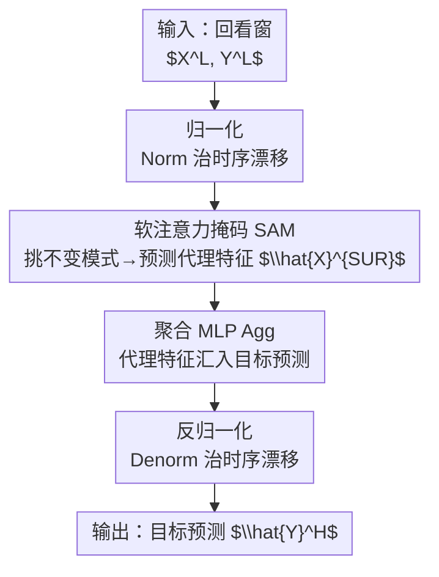

# Tackling Time-Series Forecasting Generalization via Mitigating Concept Drift

**会议**: ICLR 2026  
**OpenReview**: [https://openreview.net/forum?id=emkvZ7NanK](https://openreview.net/forum?id=emkvZ7NanK)  
**代码**: https://github.com/AdityaLab/ShifTS  
**领域**: 时间序列预测  
**关键词**: 概念漂移, 时序漂移, 分布偏移泛化, 不变模式, 软注意力

## 一句话总结
本文把时间序列预测的分布偏移拆成「时序漂移」和「概念漂移」两类，提出软注意力掩码 SAM 从回看窗与预测窗的外生特征里挖出稳定的不变模式来缓解概念漂移，并用一个模型无关的框架 ShifTS「先治时序漂移、再治概念漂移」，在多数据集多模型上稳定提升预测精度。

## 研究背景与动机

**领域现状**：深度学习时间序列预测（Informer / PatchTST / iTransformer 等）已经很强，但时序数据本身是动态演化的，模型在训练分布上学到的规律到测试时可能失效。学界把这种分布偏移建模为预测要解决的核心难题之一。

**现有痛点**：作者指出时序里的分布偏移其实有两种，但现有工作几乎只盯着一种。第一种是**时序漂移（temporal shift）**，即边缘分布随时间变化（均值、方差、自相关漂移），条件分布不变——这正是 RevIN / N-S Transformer / SAN 这些归一化方法在治的「非平稳」问题。第二种是**概念漂移（concept drift）**，即条件分布 $P(Y^H \mid X^L)$ 随时间变化而边缘分布不变——外生因素与目标的相关关系本身在漂移，这一块在时序预测里几乎被忽略。

**核心矛盾**：通用机器学习里治概念漂移的主流武器是**不变学习（invariant learning，如 IRM / GroupDRO / VREx）**，但它们搬到时序预测上水土不服。一是它们需要显式的环境标签（如图像分类里标注的旋转角度/噪声类别），而时序数据集根本没有这种标签；二是它们假设所有决定目标的相关外生特征都可见，但时序里**回看窗 $X^L$ 往往不足以决定预测窗目标 $Y^H$**。少数不靠不变学习、专为时序设计的概念漂移方法又只适用于在线（online）设置，需要逐时间步迭代重训，无法用于标准的离线时序预测任务。

**切入角度**：作者的关键观察是——条件分布之所以不稳，是因为光看回看窗 $X^L$ 信息不够；而**预测窗里的外生特征 $X^H$ 与目标之间存在跨未来时间步的因果关系**（且未来不能影响过去，$X^H_{t+1} \nrightarrow Y^H_t$，因果方向干净）。如果能把 $[X^L, X^H]$ 里**始终与目标稳定相关的那部分模式**抽出来建模，条件分布就稳了。

**核心 idea**：不直接建 $P(Y^H \mid X^L, X^H)$（那等于要先预测整个未来 $X^H$，和直接预测 $Y^H$ 一样难），而是只挑出 $[X^L, X^H]$ 中相关性跨时间步稳定的「不变模式」聚合成一个代理外生特征 $X^{SUR}$，转而建模更稳的 $P(Y^H \mid X^{SUR})$；同时把时序漂移当作前置步骤先归一化处理掉。

## 方法详解

### 整体框架

ShifTS 是一个**模型无关**的框架：任何时序预测骨干（Crossformer、PatchTST、iTransformer……）都能套进来。它把预测拆成「先治时序漂移、再治概念漂移」的统一流水线，核心是一个**两阶段预测**——第一阶段预测能稳定支撑目标的代理外生特征 $\hat{X}^{SUR}$，第二阶段再用 $\hat{X}^{SUR}$ 连同 $Y^L$ 一起预测目标 $Y^H$。整条流程是：先把输入归一化（治时序漂移）→ 用 SAM 找出并预测代理特征（治概念漂移）→ 用聚合 MLP 把代理特征汇入目标预测 → 反归一化输出。

整图自上而下的顺序就对应下面三个关键设计：归一化/反归一化这对操作合起来是「先治时序漂移」（设计 2），SAM 是概念漂移处理核心（设计 1），而把两阶段预测 + 聚合 + 联合损失串成一体的就是 ShifTS 框架本身（设计 3）。

### 关键设计

**1. SAM 软注意力掩码：从回看窗+预测窗里挖出稳定的不变模式**

这是治概念漂移的核心，针对的痛点是「光看回看窗 $X^L$ 不足以决定目标、条件分布不稳」。SAM 的做法分两步。先**切片**：把 $[X^L, X^H]$ 拼成长度 $L+H$ 的整段序列，用大小为 $H$ 的滑动窗扫过，得到 $L+1$ 个局部片段（每个时间步 $t$ 对应 $[X^H_{t-L}, \dots, X^H_t]$），这些片段就是「不变模式」的候选。再**加权筛选**：对每个候选片段建条件分布，并用一个可学习的软注意力矩阵 $M$ 给它们打分加权，$M$ 依次过三个操作：

$$\text{Softmax}: M_j = \text{Softmax}(M_j), \quad \text{Sparsity}: M_{ij} = M_{ij}\cdot \mathbb{1}_{(M_{ij}-\mu(M_j))\geq 0}, \quad \text{Normalize}: M_j = \frac{M_j}{|M_j|}$$

直觉是：softmax 算出每个候选模式对目标 $Y^H$ 的贡献权重，sparsity 把低权重的模式（只在零星/局部时间步与目标相关的，多半是虚假相关）滤掉，只留下**在所有时间步上都稳定贡献目标的高权重模式**——这些就是不变模式（$P(Y^H_i \mid X^H_{i-k}) \approx P(Y^H_j \mid X^H_{j-k})$）。最后对这些不变模式按贡献加权求和，聚成代理特征 $X^{SUR} = \text{SAM}([X^L, X^H]) = \sum_{L+1} M(\text{Slice}([X^L, X^H]))$。因为目标可能由多个模式共同决定（论文举例：流感样疾病在冬天可能由严寒触发、夏天可能由热浪触发），加权求和恰好能把多个不变诱因都纳进来。这样建出来的 $P(Y^H \mid X^{SUR})$ 比 $P(Y^H \mid X^L)$ 稳得多；虽然估计 $X^{SUR}$ 会引入误差，但 $X^{SUR}$ 只含部分信息、比预测整个 $X^H$ 容易，实测稳定性的收益盖过估计误差。

测试时 $X^H$ 是未知的未来值，所以 SAM 用骨干模型去**估计** $\hat{X}^{SUR}$，并加一个代理损失 $L_{SUR} = \text{MSE}(X^{SUR}, \hat{X}^{SUR})$ 来监督这个估计。

**2. 先治时序漂移：把它当作治概念漂移的前置条件**

这一设计回应的是一个被作者强调的依赖关系：SAM 想学的是稳定条件分布 $P(Y^H \mid X^{SUR})$，但如果边缘分布 $P(Y^H)$、$P(X^{SUR})$ 本身随时间漂移（即存在时序漂移），这个「稳定」就无从谈起。所以必须**先**把边缘分布标准化、再谈条件分布。做法是用实例归一化：模型处理前把序列归一化、输出后再反归一化，保证 $P(X^L_{Norm}) \approx P(X^H_{Norm}) \sim \text{Dist}(0,1)$、$P(Y^L_{Norm}) \approx P(Y^H_{Norm}) \sim \text{Dist}(0,1)$，从而消掉边缘分布随时间的漂移。在众多方法里作者选了 **RevIN**（可逆实例归一化），因为它简单有效、不需要改骨干结构或额外预训练；SAN、N-S Transformer 等更强的归一化也能用，但它们要改模型或加预训练，不是本文重点（论文也展示了在 Exchange 上把 RevIN 换成 SAN 能进一步涨点，说明这个槽位是可插拔的）。

**3. ShifTS 统一框架：两阶段预测 + 聚合 MLP + 联合损失**

前两个设计是零件，这个设计把它们拼成一台模型无关的机器。ShifTS 的工作流是四步：(1) 归一化输入；(2) 用 SAM 预测能不变支撑目标的代理外生特征 $\hat{X}^{SUR}$；(3) 一个**聚合 MLP** $\text{Agg}(\cdot)$ 用 $\hat{X}^{SUR}$ 来修正目标预测，即 $\hat{Y}^H_{Norm} = \hat{Y}^H_{Norm} + \text{Agg}(\hat{X}^{SUR}_{Norm})$；(4) 反归一化输出。概念上，步骤 1/4 治时序漂移，步骤 2 治概念漂移，步骤 3 做外生特征的加权聚合以支撑目标序列。训练用一个联合目标把代理估计和最终预测一起优化：

$$L = L_{SUR}(X^{SUR}, \hat{X}^{SUR}) + L_{TS}(Y^H, \hat{Y}^H)$$

其中 $L_{SUR}$ 鼓励模型学会预测代理外生特征，$L_{TS}$ 就是常规时序预测的 MSE 损失。这个设计的价值在于「模型无关」——SAM 区分出的稳定条件分布可以被任意骨干学习，所以 ShifTS 像个外挂，套在任何预测模型上都能用，而非另起炉灶设计新骨干。

### 损失函数 / 训练策略
总损失为代理损失 + 预测损失：$L = L_{SUR}(X^{SUR}, \hat{X}^{SUR}) + L_{TS}(Y^H, \hat{Y}^H)$。训练时 $X^{SUR}$ 由 SAM 在可见的 $[X^L, X^H]$ 上算出作为监督目标；测试时只给 $X^L, Y^L$，由骨干估计 $\hat{X}^{SUR}$ 再走聚合与反归一化得到 $\hat{Y}^H$。实验聚焦带外生特征的单变量预测（$d_Y=1$、$d_X\geq 1$）。

## 实验关键数据

### 主实验
在 6 个时序数据集（Exchange、ILI、ETTh1/h2、ETTm1/m2）、多个骨干模型、4 个预测 horizon 上，对比加不加 ShifTS（ERM）。下表为 IMP.（ShifTS 相对 ERM 在所有 horizon 上的平均提升）摘录：

| 数据集 | Crossformer (MSE/MAE) | PatchTST (MSE/MAE) | iTransformer (MSE/MAE) |
|--------|------|------|------|
| ILI | 81.9% / 64.0% | 12.0% / 7.1% | 13.8% / 6.5% |
| Exchange | 53.5% / 38.9% | 20.9% / 12.6% | 15.2% / 6.9% |
| ETTh1 | 68.2% / 48.8% | 14.5% / 7.2% | 5.1% / 3.3% |
| ETTm2 | 71.3% / 52.0% | 15.9% / 8.6% | 4.8% / 2.1% |

ShifTS 对所有骨干都稳定降低预测误差，对越弱的骨干（如 Crossformer、Informer）提升越大，对 SOTA（iTransformer）仍有约 15% 的提升（ILI、Exchange）。

与分布偏移基线对比（Crossformer 为骨干，平均结果，越低越好）：

| 类别 | 方法 | ILI MSE | Exchange MSE | ETTh1 MSE | ETTh2 MSE |
|------|------|------|------|------|------|
| Base | ERM | 3.705 | 0.819 | 0.254 | 0.937 |
| 概念漂移 | IRM | 2.248 | 0.846 | 0.201 | 0.878 |
| 时序漂移 | SAN | 0.757 | 0.415 | 0.088 | 0.199 |
| 组合 | FOIL | 0.735 | 0.497 | 0.081 | 0.206 |
| **本文** | **ShifTS** | **0.668** | **0.470** | **0.076** | **0.194** |

ShifTS 在 8 项评测（4 数据集 × MSE/MAE）里 6 项第一、2 项第二，全面优于纯概念漂移、纯时序漂移和组合基线（含 SOTA 的 FOIL）。

### 消融实验
在 Exchange、horizon=96、三个骨干上，对比完整 ShifTS 与去掉模块的变体（Figure 3(b)）：

| 配置 | 说明 |
|------|------|
| Base | 不治任何分布偏移 |
| ShifTS\TS | 去掉 RevIN（不治时序漂移） |
| ShifTS\CD | 去掉 SAM（不治概念漂移） |
| ShifTS (Full) | 两者都治，误差最低 |

另外把 ShifTS 里的 RevIN 换成更强的 SAN（Exchange，MSE）：ShifTS 0.470、SAN 0.415、ShifTS+SAN 0.407（全 horizon 最佳），说明归一化槽位可插拔且能进一步涨点。

### 关键发现
- **同时治两类漂移 > 只治一类 > 都不治**：时序漂移和概念漂移在时序数据里相互关联、并存，两者都治才拿到最低误差。
- **谁更重要取决于骨干自带什么**：对本身已带 norm/denorm 的骨干（PatchTST、iTransformer），补治概念漂移（SAM）带来的增益比再补 RevIN 更大；对完全不治时序漂移的骨干（Crossformer），先治时序漂移的增益反而更大——印证「先治时序漂移是治概念漂移的前置」这一核心论点。
- **增益与 $X^H$ 的信息量正相关**：作者用互信息 $I(X^H; Y^H)$ 量化预测窗外生特征对目标的有用信息，散点图显示它与 ShifTS 的性能增益呈正线性相关（$p=0.012$）。信息越多、相关/因果越清晰，ERM 忽略掉的依赖越多，ShifTS 提升越大——这也解释了为何 ILI、Exchange 提升大于 ETT。

## 亮点与洞察
- **把分布偏移拆成两类并指出依赖顺序**：明确「时序漂移（边缘变）vs 概念漂移（条件变）」的区分，并论证「先治时序漂移才能谈治概念漂移」，这个先后关系既有理论直觉又被消融印证，是全文最有结构感的一点。
- **用「代理外生特征」绕开不变学习的两个硬约束**：不需要环境标签、也不假设回看窗信息充分，而是从 $[X^L, X^H]$ 里软筛出稳定模式聚成 $X^{SUR}$，把无标签时序场景里没法用的不变学习思想落了地。
- **模型无关的外挂式设计**：SAM + 归一化 + 聚合 MLP 包成一层壳，套在任意骨干上都能涨点、且至少不掉点，可复用性强；归一化槽位还能从 RevIN 平替成 SAN 继续涨。
- **互信息解释增益来源**：用 $I(X^H; Y^H)$ 把「什么时候该用 ShifTS」量化成可观测指标，给实践者提供了判断依据。

## 局限与展望
- 论文聚焦**带外生特征的单变量预测**（$d_Y=1$），多变量目标的扩展未在正文充分展开。
- 排除了近平稳数据集（Traffic、Weather），意味着方法主要在分布偏移显著的数据上验证；近平稳场景下 ShifTS 的额外开销是否划算未知。
- 代理特征 $\hat{X}^{SUR}$ 的估计误差与稳定性收益之间的 trade-off 是经验性结论，何时收益会被估计误差吞掉缺乏理论刻画。
- 归一化默认用 RevIN，更强的 SAN/N-S Transformer 虽展示了潜力但被划在范围外，最优组合仍待系统探索。

## 相关工作与启发
- **vs 不变学习（IRM / GroupDRO / VREx / EIIL）**：它们靠环境标签 + 「相关特征全可见」假设来治概念漂移，在时序里两条假设都不成立；本文用 SAM 从可见的 $[X^L,X^H]$ 软筛不变模式，无需环境标签，主实验里也明显优于这些通用方法。
- **vs 时序归一化（RevIN / N-S Trans. / SAN）**：它们只治时序漂移（标准化边缘分布），本文把归一化当作前置步骤复用，真正的新增是上层治概念漂移的 SAM；ShifTS 全面优于单纯的归一化基线。
- **vs FOIL（SOTA 时序分布偏移）**：FOIL 也用不变学习思路做时序 OOD 泛化，本文在多数数据集上优于它，核心差异在于用代理外生特征 + 软注意力替代显式不变学习，更契合时序无环境标签的特点。

## 评分
- 新颖性: ⭐⭐⭐⭐ 首次系统地把概念漂移与时序漂移区分并指出依赖顺序，SAM 的代理特征思路在时序里较新颖。
- 实验充分度: ⭐⭐⭐⭐ 6 数据集 × 6 骨干 × 4 horizon + 与三类分布偏移基线对比 + 消融 + 互信息分析，较全面。
- 写作质量: ⭐⭐⭐⭐ 动机递进清晰，问题定义与方法对应严谨，公式略密但可跟。
- 价值: ⭐⭐⭐⭐ 模型无关、外挂式、稳定涨点且不掉点，对时序预测实践有较强可用性。

<!-- RELATED:START -->

## 相关论文

- [\[AAAI 2026\] DeepBooTS: Dual-Stream Residual Boosting for Drift-Resilient Time-Series Forecasting](../../AAAI2026/time_series/deepboots_dual-stream_residual_boosting_for_drift-resilient_time-series_forecast.md)
- [\[ICML 2026\] Dynamic-TMoE: A Drift-Aware Dynamic Mixture of Experts Framework for Non-Stationary Time Series](../../ICML2026/time_series/dynamic_tmoe_a_drift-aware_dynamic_mixture_of_experts_framework_for_non-stationa.md)
- [\[ICLR 2026\] ResCP: Reservoir Conformal Prediction for Time Series Forecasting](rescp_reservoir_conformal_prediction_for_time_series_forecasting.md)
- [\[ICLR 2026\] PhaseFormer: From Patches to Phases for Efficient and Effective Time Series Forecasting](phaseformer_from_patches_to_phases_for_efficient_and_effective_time_series_forec.md)
- [\[ICLR 2026\] Semantic-Enhanced Time-Series Forecasting via Large Language Models](semantic-enhanced_time-series_forecasting_via_large_language_models.md)

<!-- RELATED:END -->
