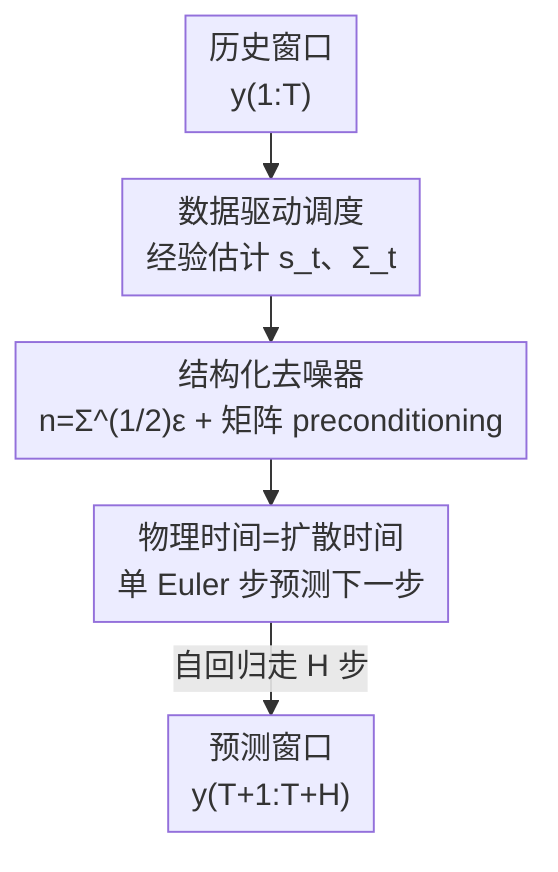

# TEDM: 用阐明化扩散模型做时间序列预测

**会议**: ICLR 2026  
**OpenReview**: [https://openreview.net/forum?id=kQee8MObMc](https://openreview.net/forum?id=kQee8MObMc)  
**代码**: https://gitlab.com/dlr-dw/tedm  
**领域**: 扩散模型 / 时间序列预测  
**关键词**: 扩散预测, EDM, 数据驱动噪声调度, 自回归, 概率预测

## 一句话总结
TEDM 把图像生成里的 EDM（Elucidated Diffusion Models）框架移植到多变量时间序列预测，关键是让**扩散时间轴和物理时间轴重合**，并用**从数据里经验估计的噪声/尺度调度**取代人为预设的调度，从而把采样复杂度从 $O(SH)$ 降到 $O(H)$，在多个长序列预测基准上用一个轻量网络刷出 SOTA。

## 研究背景与动机

**领域现状**：多变量时间序列预测目前两条主线，一是 Transformer 系（Informer、Autoformer、iTransformer），靠注意力机制刷榜；二是扩散模型系（TimeGrad、TimeDiff、TSDiff、ARMD），借生成式建模天然支持概率预测和不确定性量化。

**现有痛点**：Transformer 系是 $O(T^2)$ 的时间/显存开销，且长程预测往往退化、只给点估计。扩散模型系则继承了图像域 DDPM 的两个包袱——一是采样要跑 $S$ 步扩散，每个预测步又要重复，总复杂度 $O(SH)$，慢；二是它们直接照搬图像域那套**人为预设**的噪声调度 $\sigma_t$ 和尺度调度 $s_t$，并把噪声当成 i.i.d. 高斯注入，这对有强自相关、各特征量纲/方差差异巨大的时间序列并不合适。

**核心矛盾**：扩散模型的成功来自 EDM 那套"把架构/训练/采样解耦成模块化设计空间"的方法论，但搬到时间序列时，设计空间没被真正阐明（elucidate）——时间序列的**顺序结构**和图像的**无序结构**根本不同，照搬调度等于强行给数据塞进错误的归纳偏置。

**本文目标**：把 EDM 的理论从图像扩展到时间序列预测，让噪声/尺度调度、时间离散化、求解器都能针对序列结构去优化，同时把采样复杂度压下来。

**切入角度**：作者重新推导扩散过程的反向 ODE，发现一旦把噪声协方差写成矩阵形式 $\Sigma_t$，**反向 ODE 里时间增量 $dt$ 会消失**——这意味着不再需要任何"如何切分扩散时间步"的策略，可以直接把时间序列的物理时间轴当作扩散时间轴。

**核心 idea**：用"物理时间 = 扩散时间 + 数据驱动调度"取代"人为调度 + 独立扩散步"，让一个 Euler 步同时完成"前进一个时间步预测"和"完成一步去噪"。

## 方法详解

### 整体框架

TEDM 是一个自回归扩散预测框架：输入历史窗口 $y_{1:T}\in\mathbb{R}^{C\times T}$（$C$ 个特征、$T$ 个时间步），输出未来 $H$ 步 $\hat y_{T+1:T+H}$。它把预测看成"沿物理时间轴做扩散数值积分"：每个历史点想象成一个被扩散过程"推送"到对应未来点的粒子，整窗粒子由同一个去噪网络并行处理。

整条管线分三件事：① 从输入窗口**经验估计**尺度 $s_t$ 和噪声协方差 $\Sigma_t$（不靠外部调度）；② 训练一个**去噪器** $D_\theta$，它用结构化噪声 $n=\Sigma^{1/2}\varepsilon$ 破坏数据再学着复原，并把 EDM 的 preconditioning 推广到矩阵值 $\Sigma$；③ 推理时由于扩散轴和物理轴重合，**一个 Euler 步就预测下一个时间步**，自回归走 $H$ 步得到整段预测，复杂度 $O(H)$ 而非 $O(SH)$。三个贡献组件依次对应下面三个关键设计。

### 关键设计

**1. 数据驱动的噪声与尺度调度：让扩散调度具有物理意义**

以往所有扩散预测模型都从图像域借来 $\sigma_t$、$s_t$ 的人为调度（如线性、log-normal），这对时间序列是错误的归纳偏置——各特征方差和重要性不同，统一注噪并不合理。TEDM 把噪声写成矩阵 $\Sigma_t := s_t^{-2}\mathrm{Cov}(x_t)$，让广义前向 ODE 变成 $\frac{dx_t}{dt}=\frac{\dot s_t}{s_t}x_t-\frac12 s_t^2\dot\Sigma_t\nabla_x\log p_t(x_t)$。一旦扩散沿时间序列的时间轴展开，$s_t$ 和 $\Sigma_t$ 就有了物理含义，可以**直接从输入数据估计**而不是预设。具体作者证明 $\mathbb{E}(x_t)=s_t\,\mathbb{E}(x_0)$、$\mathrm{Cov}(x_t)=s_t^2\Sigma_t$，于是给出两种估计：

$$\hat s_t = \mathrm{Mean}(y_{1:t})\odot y_{1:1}^{-1},\qquad \hat\Sigma_t = \hat S_t\,\mathrm{Cov}(y_{1:t})\,\hat S_t^{\top}$$

即**累积估计**（用前 $t$ 步的累积均值/协方差，$\hat S_t=\mathrm{diag}(\hat s_{t}^{-1})$ 做同余缩放以保正定）；以及**滑窗估计**（用固定长度滑窗的均值/协方差），后者更能贴合局部统计变化，还规避了窗口首点方差为零、以及 $y_{1:1}$ 接近零导致累积尺度爆炸的数值问题。这是首个完全用数据经验调度的扩散模型，去掉了人为调度带来的偏置——消融里这一项相对 EDM 带来高达 85% 的 MSE 提升。

**2. 结构化噪声去噪器与矩阵值 preconditioning：把 EDM 的去噪训练搬到序列上**

EDM 假设噪声 i.i.d.，但时间序列每个时间步、每个特征的噪声水平都不同，注入 i.i.d. 噪声会破坏自相关结构。TEDM 改用结构化噪声 $n=\Sigma^{1/2}\varepsilon$（$\varepsilon\sim\mathcal{N}(0,I)$），让去噪器 $D_\theta$ 学着在这种非 i.i.d. 噪声下复原干净信号（见原文 Fig.1a）。为了稳定训练，作者把 EDM 的标量 preconditioning 推广到矩阵值 $\Sigma$：去噪器写成 $D_\theta(x,\Sigma)=C_{\Sigma;\text{skip}}\,x + c_{\Sigma;\text{out}}\,F_\theta(C_{\Sigma;\text{in}}\,x;\,C_{\Sigma;\text{noise}})$，其中

$$C_{\Sigma;\text{in}}=(\mathrm{Cov}(y)+\Sigma)^{-1/2},\quad C_{\Sigma;\text{skip}}=\mathrm{Cov}(y)(\mathrm{Cov}(y)+\Sigma)^{-1}$$

这些系数由"要求 $F_\theta$ 的输入和训练目标单位方差、且尽量不放大误差"解析推出，当 $\Sigma=\sigma^2 I$ 时正好退回 EDM 的标量形式。一个关键好处是去噪器的职责（估计 score）和预测任务**解耦**了，所以架构选择很自由——从 $O(Td)$ 空间复杂度的 Linear 网络到 UNet 都行，可选地条件在历史数据上做 conditional denoising。

**3. 物理时间轴与扩散时间轴对齐：把采样复杂度从 $O(SH)$ 压到 $O(H)$**

这是 TEDM 最核心的观察。把反向 ODE 写成差分形式 $dx_t=-(d\log s_t)x_t+\frac12 s_t(d\Sigma_t)\Sigma_t^{-1}[D(x_t/s_t,\Sigma_t)-x_t/s_t]$ 后，**$dt$ 不再出现**，于是不需要任何量化时间增量的策略，可以直接把时间序列的物理时间轴当扩散时间轴。这样一个 Euler 步就同时是"前进一个物理时间步"和"完成一步去噪"，推理规则（对角近似下）化简为

$$\hat y_{t+1}=\Big[I-\log\tfrac{s_t}{s_{t-1}}\Sigma_t^{1/2}\Sigma_{t-1}^{-1/2}\Big]\hat y_t + s_t\Big[\log\Sigma_t^{1/2}\Sigma_{t-1}^{-1/2}\Big]D_\theta(\hat y_t/s_t;\Sigma_t)$$

从给定窗口 $\hat y_1:=y_{1:T}$ 出发，一个 Euler 步把它推到 $\hat y_2:=y_{2:T+1}$，假设 $T=H$，走 $H$ 步即得整段预测 $y_{T+1:T+H}$。因为**一个 Euler 步替代一个扩散步**，推理时间是 $O(H)$ 而非传统扩散的 $O(SH)$。值得一提的是，该对角近似推理规则在"$\Sigma_t$ 主轴不随时间变、只有特征值变"时是精确成立的（如气候空间模态、脑信号稳定空间模式）。

### 损失函数 / 训练策略

训练沿用 denoising score matching：给定干净子序列 $y\sim p_\text{data}$ 算出对应的经验 $\Sigma$，采结构化噪声 $n=\Sigma^{1/2}\varepsilon$，最小化 $\mathbb{E}_{y,\varepsilon}\big[\lambda_\Sigma\|D_\theta(y+n;\Sigma)-y\|^2\big]$，其中损失权重 $\lambda_\Sigma=1/c_{\Sigma;\text{out}}^2$。数据仅做 z-score 归一化，无复杂预处理；窗口长度训练时取 $T=H$，验证/测试时窗口为 $2H$（前 $T$ 步给模型、后 $H$ 步当真值），并加 padding 以计算 Eq.(10) 里的时间位移。所有数据集固定 $H=96$。

## 实验关键数据

### 主实验

在 8 个多变量基准（ETTh1/h2、ETTm1/m2、Exchange、Solar、Stock、Weather）上对比扩散类方法（$H=96$，z-score 归一化下的 MSE/MAE，越低越好）：

| 数据集 | 指标 | TEDM | 最强扩散基线 | 说明 |
|--------|------|------|--------------|------|
| ETTh2 | MSE/MAE | **0.214 / 0.319** | ARMD 0.311 / 0.338 | TEDM 最优 |
| ETTm2 | MSE/MAE | **0.135 / 0.253** | ARMD 0.181 / 0.255 | TEDM 最优 |
| Exchange | MSE/MAE | **0.069 / 0.183** | ARMD 0.093 / 0.203 | TEDM 最优 |
| ETTm1 | MSE/MAE | 0.419 / 0.421 | ARMD 0.337 / 0.376 | 第二，略逊 ARMD |
| Weather | MSE/MAE | 0.223 / 0.261 | TMDM 0.180 / 0.241 | 第二 |
| ETTh1 | MSE/MAE | 0.595 / 0.524 | TimeDiff 0.417 / 0.456 | 落后，大幅振荡场景 |

与非扩散 SOTA（iTransformer、PatchTST、DLinear 等）对比，TEDM 在 ETTh2、ETTm2、Exchange、Stock 上仍领先（如 Stock MSE 0.056 vs iTransformer 0.342），但在高维 Solar（137 维）上对角近似失效，MSE 1.061 明显变差。

### 消融实验

阐明化模型对比（ETTh2/ETTm2/Exchange，括号内为相对 EDM 的 MSE 提升）：

| 配置 | ETTh2 MSE | ETTm2 MSE | Exchange MSE | 说明 |
|------|-----------|-----------|--------------|------|
| iDDPM+DDIM | 0.730 | 0.756 | 1.276 | 最弱基线 |
| EDM | 0.419 | 0.293 | 0.448 | 阐明化但用预设调度 |
| TEDM（累积 $\Sigma_t$，$s_t=1$） | 0.303 (28%) | 0.137 (53%) | 0.110 (75%) | 加结构化噪声 |
| TEDM（累积 $\Sigma_t$，经验 $s_t$） | 0.242 (42%) | 0.135 (54%) | 0.068 (85%) | 再加经验尺度 |
| TEDM（滑窗 $\Sigma_t$，经验 $s_t$） | 0.216 (49%) | 0.142 (52%) | 0.075 (83%) | 滑窗最优 |

效率对比（ETTm2，每 batch 平均）：TEDM 训练 0.004s / 21.3MB、测试 0.11s / 23.9MB、MSE 0.135，是所有方法里最快最省的（TimeDiff 测试 21.38s、TMDM 显存 15600MB）。

### 关键发现
- **数据驱动调度是涨点主力**：从 EDM 到"累积 $\Sigma_t + s_t=1$"已经吃掉大头（ETTh2 降 28%），再叠加经验尺度 $s_t$ 进一步到 42%~85%，证明"去掉人为调度"是核心收益来源。
- **物理轴对齐换来极致效率**：复杂度从 $O(SH)$ 到 $O(H)$，资源开销与轻量的 ARMD 相当，但 ARMD 没有阐明设计空间，所以精度被 TEDM 反超。
- **失败场景明确**：ETTh1 这类大幅振荡序列违反 TEDM 对"平滑流"的假设（Assumption A.1）；高维 Solar 上对角协方差近似失效——边界很诚实。

## 亮点与洞察
- **"$dt$ 消失"是整篇的题眼**：把噪声写成矩阵后反向 ODE 不含时间增量，一步把"扩散步"和"物理预测步"合二为一，这是把 $O(SH)$ 砍成 $O(H)$ 的根因，比单纯加速采样的工程 trick 高明。
- **让扩散调度"接地气"**：把 $\sigma_t/s_t$ 从抽象超参变成可由数据估计的物理量（累积/滑窗均值与协方差），这个视角可迁移到其他需要噪声调度的生成任务——与其调度搜参，不如从数据里读出来。
- **去噪器与预测解耦**：score 估计独立于预测任务，因此可以用极简 Linear（$O(Td)$）就跑出 SOTA，对在线/实时部署友好。

## 局限与展望
- 理论基于 Itô 扩散过程，**无法刻画长记忆动态**（分数布朗运动）、重尾/幂律噪声（α-stable）和跳跃过程，这些都违反扩散正则性假设。
- 有效性主要在**对角协方差近似**下展示，高维特征空间（如 137 维的 Solar）很可能失效，主结果也印证了这点。
- 对大幅振荡序列（ETTh1）的"平滑流"假设不成立，是已知短板。
- 作者计划补充概率预测的 skill 分析、无需集成的预测区间采样方法，并把 TEDM 扩展到异常检测、数据压缩与插补。

## 相关工作与启发
- **vs EDM (Karras et al. 2022)**：EDM 在图像域阐明设计空间但用预设调度、i.i.d. 噪声；TEDM 把它扩展到矩阵值 $\Sigma$、用数据经验调度和结构化噪声，并让扩散轴等于物理轴，消融显示相对 EDM 最高提升 85% MSE。
- **vs ARMD (Gao et al. 2025)**：ARMD 靠监督一个 devolution 网络学会"跳过" $S$ 个扩散步来提效，但没有阐明设计空间；TEDM 效率与之相当却精度更高，因为它从调度优化本身拿到收益。
- **vs TimeDiff / TSDiff / NsDiff**：这些大多是图像域 DDPM 的直接适配，没充分利用时间序列的多变量+时序结构；TEDM 从设计空间根上重做调度与噪声结构。

## 评分
- 新颖性: ⭐⭐⭐⭐⭐ "物理时间=扩散时间 + 数据驱动调度"是真正的范式级洞察，不是工程加速
- 实验充分度: ⭐⭐⭐⭐ 8 数据集 + 扩散/非扩散双向对比 + 效率表 + 长 horizon，但高维场景偏弱
- 写作质量: ⭐⭐⭐⭐ 理论推导扎实、消融拆解清晰，但核心公式高度依赖附录
- 价值: ⭐⭐⭐⭐⭐ 轻量、低延迟、SOTA，适合在线实时部署，且打开了扩散预测的设计空间

<!-- RELATED:START -->

## 相关论文

- [\[ICLR 2026\] Understanding Transformers in Time Series Forecasting: A Case Study on MOIRAI](understanding_transformers_for_time_series_forecasting_a_case_study_on_moirai.md)
- [\[ICLR 2026\] End-to-End Probabilistic Framework for Learning with Hard Constraints](end-to-end_probabilistic_framework_for_learning_with_hard_constraints.md)
- [\[ICLR 2026\] MMPD: Diverse Time Series Forecasting via Multi-Mode Patch Diffusion Loss](mmpd_diverse_time_series_forecasting_via_multi-mode_patch_diffusion_loss.md)
- [\[ICLR 2026\] Delta-XAI: A Unified Framework for Explaining Prediction Changes in Online Time Series Monitoring](delta-xai_a_unified_framework_for_explaining_prediction_changes_in_online_time_s.md)
- [\[ICLR 2026\] TimeOmni-1: Incentivizing Complex Reasoning with Time Series in Large Language Models](timeomni-1_incentivizing_complex_reasoning_with_time_series_in_large_language_mo.md)

<!-- RELATED:END -->
