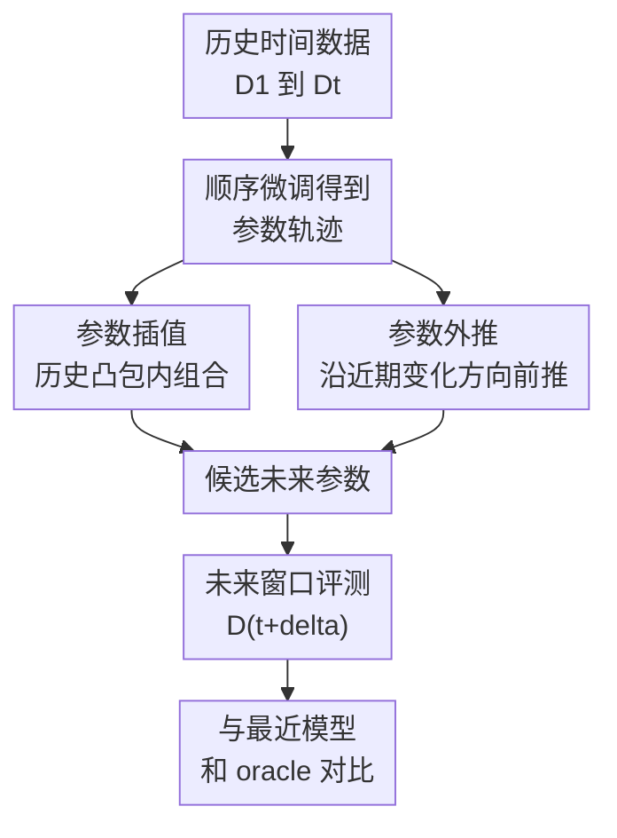

# Temporal Generalization: A Reality Check

**会议**: ICLR 2026  
**OpenReview**: [https://openreview.net/forum?id=Wz0ILlbh9U](https://openreview.net/forum?id=Wz0ILlbh9U)  
**代码**: https://github.com/divyam3897/TG  
**领域**: 时间序列 / 时间泛化 / 分布漂移  
**关键词**: 时间泛化, 分布漂移, 参数插值, 参数外推, 持续学习  

## 一句话总结
这篇论文在严格“不看未来数据”的设定下系统评测用历史 checkpoint 插值或外推未来模型参数的做法，发现模型平均和 Taylor 外推通常不如直接使用最近模型，只有简单参数缩放在部分语言任务上较稳，但也不是普适解。

## 研究背景与动机
**领域现状**：许多机器学习系统会先在历史数据上训练，再被部署到未来环境中；新闻、医学、金融、遥感和学术文本等场景的数据分布都会随时间改变，因此“训练时刻表现好”并不等于“未来几个月或几年仍然可靠”。已有 temporal domain generalization 工作试图让模型跨时间保持性能，常见做法包括持续更新、领域泛化、持续学习，以及从历史模型轨迹中推断未来状态。

**现有痛点**：问题在于，很多看似能“预测未来”的方法并没有处在真正严格的部署设定里。有的方法需要未标注未来数据，有的方法用未来验证集调超参，还有的方法只在小模型或 toy setup 上验证；一旦换成 T5、DistilBERT、DenseNet 这类实际规模模型，直接学习整套参数随时间的非线性轨迹会非常昂贵，也需要远比现实数据更密集的时间采样。

**核心矛盾**：时间泛化的根本矛盾是：模型只能看到过去，但未来分布可能以任意方式变化。历史 checkpoint 的参数轨迹看起来携带时间信息，但深度网络参数又存在非凸性和不可辨识性，同一个函数可以由多组不同参数表示。于是，“参数沿时间平滑移动”这个直觉未必能转化成可靠的未来预测。

**本文目标**：作者把问题收紧为一个现实检验：给定过去一串按时间训练得到的参数 $\{\theta_1, \ldots, \theta_t\}$，在没有未来数据、没有未来验证集、也不假设知道数据生成过程的条件下，是否能构造一个 $\widetilde{\theta}_{t+\delta}$，让它在未来数据 $D_{t+\delta}$ 上优于直接部署最近模型 $\theta_t$。

**切入角度**：论文没有再提出一个复杂预测器，而是把“只依赖历史参数”的方案分成两类：一类是在过去参数凸包内做保守插值，另一类是沿历史参数变化方向显式外推。这个分类很有价值，因为它覆盖了模型平均、参数缩放、Taylor 外推等许多轻量且可扩展的现实候选方案。

**核心 idea**：用统一的、严格不访问未来的评测框架，对参数插值和参数外推做大规模压力测试，检验它们是否真的比“最近模型”更能经受时间漂移。

## 方法详解
### 整体框架
论文的整体流程可以理解为“先按时间生成历史模型轨迹，再用这个轨迹构造候选未来模型，最后在未来窗口上评测”。在每个时间步 $t$，模型只利用已经发生的数据训练或微调得到 $\theta_t$；评测时，方法只能看见 $\theta_1$ 到 $\theta_t$，然后生成 $\widetilde{\theta}_{t+\delta}$ 去面对未来 $\delta$ 个时间步的数据。

这个框架的重要之处在于它把未来访问彻底切断：没有未来训练样本，没有未来验证集，也不允许为了某个未来测试点倒调超参。因此，任何方法如果要赢过最近模型，必须真的从历史参数序列中提取到可迁移的时间结构。

### 关键设计
**1. 严格无未来评测：把时间泛化从“事后调参”拉回真实部署**

本文最关键的设计不是某个复杂模型，而是评测约束本身。作者把可用信息限制为历史 checkpoint 序列 $\{\theta_1, \ldots, \theta_t\}$，目标是在未来 $t+\delta$ 的数据上评测 $\widetilde{\theta}_{t+\delta}$。这个设定明确排除了两类常见捷径：用未来无标注数据适配语言模型，或者用未来标注验证集选择超参。

这种约束会让许多已有 temporal generalization 结论变得更难成立。因为在真实部署里，未来验证集本来就不存在；如果一个方法的优势依赖未来调参，那它测到的更像是“未来信息泄露后的性能”，而不是可部署的时间泛化能力。论文用这个设定给后续所有比较划了一条很硬的线。

**2. 参数插值族：在历史 checkpoint 凸包内寻找保守未来模型**

参数插值把未来参数写成历史模型的加权组合：$\widetilde{\theta}_{t+\delta}=\sum_i \alpha_i \theta_i$，其中 $\alpha_i \ge 0$ 且 $\sum_i \alpha_i=1$。这覆盖了直接用最近模型、历史平均、指数移动平均等做法。它的直觉是过去模型可能各自保留了不同时间段的知识，把它们合起来或许能减少对最近分布的过拟合。

但论文指出，这个直觉在自然时间漂移下并不稳。旧参数可能来自已经过时的分布，把它们平均进来会引入噪声；更麻烦的是，不同时间模型若落在损失面不同 basin 里，线性连线会穿过高损失区域。即使模型功能上相近，参数表示也可能因为神经网络不可辨识性而不对齐，所以“平均参数”并不一定等价于“平均能力”。

**3. 参数缩放：把最近模型向原点收缩以降低对当前分布的过度自信**

参数缩放是插值族里最简单也最有意思的一支：只保留最近模型方向，把参数写成 $\widetilde{\theta}_{t+\delta}=\alpha\theta_t$，其中 $\alpha\in[0,1]$。它不是试图预测未来会朝哪里走，而是承认未来不可知，于是先削弱模型对当前时间点的“确信程度”。

论文给出的经验观察是，在持续学习的时间训练过程中，参数 $L_2$ 范数会随时间增大；较大的范数可能对应更尖锐的解或更强的当前分布依赖。把 $\theta_t$ 稍微缩小，相当于保留最近模型的方向性知识，同时降低对当下数据细节的押注。这解释了为什么 downscaling 在 NewsRoom 语言建模和摘要任务上能接近甚至略优于最近模型，但它本质上仍是保守校准策略，不是万能未来预测器。

**4. Taylor 外推与顺序微调：让参数轨迹尽量可读，但不假装它一定可预测**

外推方案假设参数可以看作时间的可微函数，用一阶近似 $\widetilde{\theta}_{t+\delta}\approx\theta_t+\alpha(\theta_t-\theta_{t-\Delta t})/\Delta t$ 沿最近变化方向前推。这个设计把“时间信息在权重中”的想法显式化：如果模型参数真的沿着稳定轨迹演化，有限差分就可能提供未来方向。

为了让这个方向至少有意义，论文采用顺序微调：训练 $D_t$ 时从 $\theta_{t-1}$ 初始化，而不是每个时间点都从同一个预训练模型独立训练。这样相邻 checkpoint 更接近，PCA/UMAP 可视化也更平滑。可是实验显示，这只是不让轨迹完全破碎的必要条件，不是充分条件；最优外推系数 $\alpha$ 经常小于 1，甚至为负，说明真实未来有时反而要求反向或更保守的移动。

### 损失函数 / 训练策略
训练过程采用按时间顺序的持续学习式微调。对每个时间步 $t$，模型从上一时刻参数 $\theta_{t-1}$ 初始化，并在当前数据 $D_t$ 上最小化交叉熵损失：$\theta_t=\arg\min_{\theta_t}\sum_{(x_i^t,y_i^t)\in D_t} CE(f(x_i^t;\theta_t),y_i^t)$。这个选择不是为了优化旧任务回放，而是为了让参数轨迹在时间上更连续，减少独立训练带来的随机 basin 跳变。

超参选择也按部署逻辑做“历史内模拟”。例如对于缩放或外推系数 $\alpha$，作者在当前可见数据上模拟上一时刻会如何选择超参，再把这个选择用于生成未来候选参数。形式上，$\alpha^*=\arg\min_{\alpha\in S} L(f(\cdot;\widetilde{\theta}_t(\alpha)),D_t^{val})$，这里验证集来自当前时间而不是未来时间。这个细节保证了结果不是通过未来验证集调出来的。

实验覆盖两类模型与任务。NewsRoom 上使用 T5-small 和 T5-large 做语言建模与新闻摘要；WILDS-Time 上用 Yearbook、HuffPost、arXiv 和 FMoW 分别评测图像、文本和遥感场景中的时间漂移。指标包括 perplexity、ROUGE-L、accuracy，以及 $\delta$-forward transfer，用来衡量模型从训练时间向未来若干步迁移的平均或最差表现。

## 实验关键数据

### 主实验
NewsRoom 的结果显示，简单最近模型非常难被稳定击败。以 T5-small 为例，在语言建模上，最近模型平均 perplexity 为 32.51，downscaling 为 32.37，历史平均为 34.04，Taylor 外推为 35.69；在新闻摘要上，downscaling 的 perplexity 为 5.82，优于最近模型 6.05，但 Taylor 和平均都明显更差。Oracle 代表知道未来并在未来数据上训练的上界，因此不属于可部署方法。

| 任务 / 模型 | 指标 | Oracle | 最近模型 | 参数平均 | Downscaling | Taylor 外推 |
|-------------|------|--------|----------|----------|-------------|-------------|
| NewsRoom 语言建模 / T5-small | Perplexity ↓ | 30.02±0.02 | 32.51±0.02 | 34.04±0.02 | 32.37±0.02 | 35.69±0.05 |
| NewsRoom 新闻摘要 / T5-small | Perplexity ↓ | 5.53±0.06 | 6.05±0.07 | 6.37±0.04 | 5.82±0.05 | 6.42±0.12 |
| NewsRoom 新闻摘要 / T5-large | Perplexity ↓ | 3.45±0.02 | 3.67±0.03 | 3.78±0.02 | 3.64±0.02 | 3.78±0.04 |
| NewsRoom 新闻摘要 / T5-large | ROUGE-L ↑ | 41.92±0.86 | 40.50±0.86 | 38.02±0.60 | 40.51±0.90 | 39.59±1.21 |

在 WILDS-Time 上，结论更不支持某个统一赢家。Yearbook、HuffPost、arXiv、FMoW 四个数据集跨越视觉、文本和遥感任务，作者比较 ERM、GroupDRO、IRM、DeepCORAL、AGEM、EWC、Average、Downscaling、Recent 和 Taylor。图 3 的整体结论是：没有任何方法在所有数据集上稳定优于其他方法；downscaling 在 NewsRoom 上较稳，但在 WILDS-Time 上并不总是强。

| 数据集 | 任务 | 模型 | 未来评测跨度 | 主要观察 |
|--------|------|------|--------------|----------|
| Yearbook | 年鉴照片二分类 | 4-layer CNN | 10 年 | 图像风格随年代变化，DG/CL/插值外推没有统一胜者 |
| HuffPost | 新闻标题主题分类 | DistilBERT | 3 年 | 文本话题和语言随时间漂移，最近模型仍很有竞争力 |
| arXiv | 论文标题学科分类 | DistilBERT | 6 年 | 学术术语和领域热度变化明显，简单参数预测不稳定 |
| FMoW | 卫星图像土地利用分类 | DenseNet-121 | 6 年 | 遥感场景存在基础设施变化，但论文主题不是遥感专用方法 |

### 消融实验
论文最有解释力的分析来自三个方向：参数范数、外推系数和持续学习。参数范数分析说明 downscaling 为什么有时有效；外推系数分析说明 Taylor 前推为什么不可靠；持续学习分析说明如果不让 checkpoint 形成连续轨迹，参数插值/外推会更糟。

| 分析项 | 现象 | 对时间泛化的含义 |
|--------|------|------------------|
| 参数范数增长 | 持续学习下 T5 参数 $L_2$ 范数随时间上升 | 最近模型可能越来越贴合当前分布，缩放可缓解过度自信 |
| 外推系数 $\alpha$ | 最优 $\alpha$ 经常小于 1，甚至为负 | 历史有限差分方向不一定指向可用未来，外推假设过强 |
| 持续学习 vs 独立训练 | 持续学习显著优于每月独立从预训练模型微调 | 平滑参数轨迹是插值/外推的必要基础 |
| 二阶/学习偏移扩展 | 学习全局参数变化或时间系数仍未超过最近模型 | 给外推加更多参数不自动解决未来不可预测问题 |

### 关键发现
- 最近模型 $\theta_t$ 是一个很强的基线；许多复杂或看似更“时间感知”的方法反而因为引入旧分布噪声而退化。
- 参数平均在自然时间漂移中不稳定，尤其当过去时间段与未来分布差异较大时，旧 checkpoint 不是正则化，可能是污染源。
- Downscaling 的价值在于保守：它不预测未来方向，只降低当前模型范数和过度自信，因此在 NewsRoom 上表现相对稳健。
- Taylor 外推暴露出参数轨迹预测的根本难点：即使低维投影看起来有时间结构，高维空间中的有效方向仍可能非常不可靠。
- 持续学习能让相邻参数更近、更平滑，但这只是让参数操作“不至于完全无意义”，并不保证未来泛化。

## 亮点与洞察
- 这篇论文的最大亮点是把“时间泛化”放回一个非常严格的现实部署设定。很多方法在论文里看起来能预测未来，实际却借用了未来数据或未来验证信号；本文把这些入口关掉后，结论立刻冷静许多。
- “最近模型很难打败”是一个重要但容易被低估的发现。它提醒研究者，时间泛化方法不能只和过时模型或弱 baseline 比，而要证明自己在没有未来信息时确实超过 $\theta_t$。
- 参数缩放这个简单方法给出了一个有启发的方向：当未来不可知时，与其大胆外推，不如先降低模型对当前分布的置信押注。这和校准、sharpness、norm control、持续学习中的 plasticity 问题都有连接。
- 论文对 Taylor 外推的负结果很有价值。它说明“权重中编码了时间”不等于“权重轨迹可以被线性预测”，尤其在深度网络参数不可辨识、数据时间粒度粗、未来分布任意变化时更是如此。
- 对其他任务的启发是：如果要研究跨时间鲁棒性，应先明确未来访问边界和超参选择规则。否则方法提升可能来自评测泄漏，而不是泛化能力本身。

## 局限与展望
- 本文主要评测轻量、可扩展的参数插值与外推方案，没有覆盖所有可能的显式时间建模方法；不过作者也解释了为什么 RNN/autoencoder 这类直接预测大模型参数的方案在现实规模上很难。
- 实验数据虽然覆盖新闻、年鉴、HuffPost、arXiv 和 FMoW，但公开时间数据的粒度仍有限。许多数据集只有年度切片，很难支撑对复杂非线性时间动力学的可靠估计。
- Downscaling 的超参在不同模型和数据集上仍需选择，且它在 WILDS-Time 上并不稳定。未来如果要把它变成实用方法，需要更稳的历史内选择策略和更清楚的适用条件。
- 论文没有给出理论保证，这一点其实和结论一致：在没有未来数据和强数据生成假设时，No Free Lunch 式限制意味着不存在普适未来预测器。后续研究可能更应该显式建模特定领域的时间变化假设，而不是寻找无条件通用算法。
- 对实际系统而言，一个自然延伸是把本文的“严格评测协议”作为基准，再加入可解释的领域先验，例如医学编码政策变化、新闻主题周期、遥感土地利用趋势或科学领域关键词演化。

## 相关工作与启发
- **vs Time Vectors**: Time Vectors 认为微调语言模型权重中编码了时间，并可用时间方向做模型外推；本文指出其成功依赖未来无标注数据和未来验证信号等条件，而在严格无未来访问设定下，简单 Taylor 外推明显不稳。
- **vs 经典领域泛化方法**: IRM、GroupDRO、DeepCORAL 等方法试图学习跨域稳定特征；本文把时间戳看成有序域，发现这些方法在 WILDS-Time 上同样没有统一优势，说明时间顺序带来的未来不可知性比普通多域泛化更苛刻。
- **vs 持续学习方法**: EWC、AGEM 等持续学习方法主要关注避免遗忘过去；本文关心的是 forward transfer，即不再更新时能否面对未来。持续学习在这里更多是生成平滑 checkpoint 轨迹的训练机制，而不是最终答案。
- **vs 模型合并 / model soups**: 模型合并通常在相近任务或可访问验证数据时有效；本文显示，当 checkpoint 来自自然时间漂移且不能用未来数据筛选时，平均历史模型可能把过时分布混进来，反而伤害未来表现。
- **启发**: 时间泛化研究应把“可用信息边界”写清楚，并把最近模型作为必备强基线。若没有领域级时间演化假设，保守校准往往比激进外推更可信。

## 评分
- 新颖性: ⭐⭐⭐⭐ 不是提出华丽新算法，而是用严格设定重审时间泛化声明，问题意识很强。
- 实验充分度: ⭐⭐⭐⭐⭐ 覆盖多任务、多模型、多时间粒度，并包含参数范数、外推系数和轨迹可视化分析。
- 写作质量: ⭐⭐⭐⭐ 逻辑清楚，负结果解释充分；部分图表数值依赖曲线而非完整表格，读者复现结论时需要看附录。
- 价值: ⭐⭐⭐⭐⭐ 对 temporal generalization、持续学习和模型部署评测都有提醒作用，尤其适合作为未来工作设定 baseline 和防止未来信息泄漏的参考。

<!-- RELATED:START -->

## 相关论文

- [\[ICLR 2026\] Benchmarking ECG FMs: A Reality Check Across Clinical Tasks](benchmarking_ecg_fms_a_reality_check_across_clinical_tasks.md)
- [\[ICLR 2026\] Tackling Time-Series Forecasting Generalization via Mitigating Concept Drift](tackling_time-series_forecasting_generalization_via_mitigating_concept_drift.md)
- [\[NeurIPS 2025\] StRap: Spatio-Temporal Pattern Retrieval for Out-of-Distribution Generalization](../../NeurIPS2025/time_series/strap_spatio-temporal_pattern_retrieval_for_out-of-distribution_generalization.md)
- [\[ICLR 2026\] A General Spatio-Temporal Backbone with Scalable Contextual Pattern Bank for Urban Continual Forecasting](a_general_spatio-temporal_backbone_with_scalable_contextual_pattern_bank_for_urb.md)
- [\[ICLR 2026\] SONATA: Synergistic Coreset Informed Adaptive Temporal Tensor Factorization](sonata_synergistic_coreset_informed_adaptive_temporal_tensor_factorization.md)

<!-- RELATED:END -->
