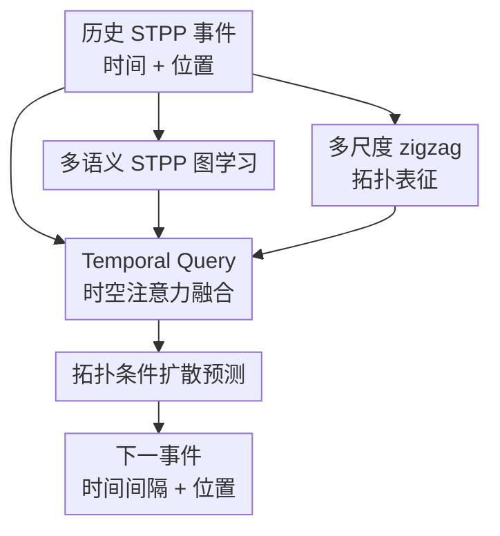

# TEN-DM: Topology-Enhanced Diffusion Model for Spatio-Temporal Event Prediction

**会议**: ICLR 2026  
**OpenReview**: [https://openreview.net/forum?id=BZ1vutP53o](https://openreview.net/forum?id=BZ1vutP53o)  
**代码**: https://github.com/yl3564/TEN-DM  
**领域**: 时间序列 / 图学习 / 时空点过程  
**关键词**: 时空点过程, 扩散模型, zigzag persistence, 图神经网络, 事件预测  

## 一句话总结
TEN-DM 把时空点过程同时转成多语义事件图和多尺度时间序列图像，用图表示、zigzag 拓扑特征和 temporal query 注意力共同条件化扩散去噪过程，从而更准确地预测下一次事件的发生时间与空间位置。

## 研究背景与动机
**领域现状**：时空点过程（spatio-temporal point process, STPP）用于描述“事件在何时何地发生”，典型应用包括地震、疫情、城市犯罪、311 服务请求等。传统统计模型通常围绕条件强度函数或影响核建模，例如 Poisson、Hawkes、Cox、Neyman-Scott 及其时空扩展；近年的深度方法则用 RNN、Transformer、normalizing flow、neural latent process 或扩散模型来学习更复杂的历史依赖。

**现有痛点**：STPP 的难点不只是时间序列预测，也不只是空间密度估计，而是时间、空间和事件间高阶关系同时变化。许多深度 STPP 方法会分别编码时间和空间，再在后端做拼接或条件生成，这容易漏掉事件之间由地理邻近、时间相似性和周期模式共同形成的结构。数据稀疏或噪声较大时，这个问题更明显：模型能看到单个事件的坐标和时间，却难以稳定识别“这些事件整体上构成了什么形状、哪些关系在时间中持续出现”。

**核心矛盾**：STPP 预测需要同时建模局部交互和全局结构。局部层面，某些事件之间可能因为时间接近、纬度接近或经度接近而互相影响；全局层面，事件云在不同时间窗口中会呈现连通区域、空洞、聚集簇等拓扑形状。只用序列注意力容易缺少空间结构，只用图又可能忽略随时间变化的形状；只用普通扩散模型则缺少对 STPP 结构的显式条件。

**本文目标**：作者希望构造一个统一框架，让模型在预测下一事件时同时使用三类信息：第一，事件之间的多语义图关系；第二，时空事件分布随时间演化的拓扑特征；第三，时间维度中的周期性和趋势变化。最终输出是下一事件的时间间隔和空间位置。

**切入角度**：论文的观察是，STPP 虽然是离散事件序列，但可以被重表达成两种更适合深度学习的对象：事件之间的图，以及按时间窗口栅格化后的图像序列。前者让 GNN 捕获多类型事件依赖，后者让 cubical zigzag persistence 抽取跨时间窗口保持或消失的拓扑形状。再把这些表征作为条件注入扩散模型，就能让生成式预测不只拟合点坐标分布，还能被结构信息约束。

**核心 idea**：用“多语义事件图 + 多尺度 zigzag 拓扑图像”去条件化 STPP 扩散模型，让下一事件预测同时感知事件局部关系、时间周期和动态拓扑结构。

## 方法详解

### 整体框架
TEN-DM 的输入是一段历史事件 $H_t=\{x_1,\dots,x_n\}$，其中每个事件 $x_i=(t_i,g_i)$ 包含发生时间和地理位置。模型先从同一段事件历史中抽取多种视图：用时间、纬度、经度构造多语义事件图；把事件按时间 patch 栅格化成图像序列；分别做时间编码和空间编码。随后，图表示、拓扑表示、时间表示和空间表示被送入拓扑引导的多头注意力，再作为条件指导扩散模型从噪声中恢复下一事件的时间间隔和位置。

这个框架的关键在于，TEN-DM 没有把拓扑特征当作事后分析指标，而是让拓扑嵌入 $\tilde z$ 直接充当 topology-guided spatio-temporal multi-head attention 的 query；空间、时间和图嵌入则作为 key/value。这样得到的综合表示再进入条件去噪扩散过程，模型的每一步反向采样都能参考历史事件的结构上下文。

### 关键设计
**1. 多语义 STPP 图学习：把离散事件变成可学习的关系结构**

普通 STPP 序列只显式给出事件时间和坐标，却没有告诉模型哪些事件应该互相影响。TEN-DM 先把每个事件当成图节点，再分别基于时间、纬度、经度构造 $R=3$ 种 $\epsilon$-graph。对任意两个事件 $u,v$，第 $r$ 种关系下的相似度用余弦相似度计算：$s^r_{uv}=(x^r_u\odot x^r_v)/(\|x^r_u\|_2\|x^r_v\|_2)$；当 $s^r_{uv}>R_r$ 时连接边 $e^r_{uv}$。这样，时间上相似、纬度上相近、经度上相近的事件可以通过不同边类型表达不同语义。

多关系图不是简单堆在一起，而是用可学习或可调的权重聚合邻接矩阵：$A=\sum_{r=1}^R \alpha_r A_r$。随后模型用 GNN 预训练得到图级表示 $o_G=Pool(GNN(X,A))$，其中节点特征 $X$ 是多视图特征拼接。这个设计解决的是 STPP 里“事件之间没有天然边”的问题：作者主动为事件补上一层关系结构，让扩散模型后续能看到历史事件的高阶交互，而不是只看到一串孤立坐标。

**2. 多尺度 zigzag 拓扑表征：捕获随时间出现和消失的空间形状**

STPP 的空间分布常常不是单点模式，而是一片区域、一组簇或多个空洞随时间变化。TEN-DM 先把事件序列切成长度为 $P$、步长为 $S$ 的 patch，再把每个 patch 内的地理坐标栅格化成二值图像：有事件的空间 cell 记为 1，没有事件的 cell 记为 0。这样，一段 STPP 就被转成图像序列 $M=\{m^{(1)},m^{(2)},\dots,m^{(N)}\}$。

如果只对每张图像独立做 persistent homology，模型只能看到静态空间形状，无法知道某个连通簇是在相邻窗口中持续存在，还是突然出现又消失。论文因此使用 cubical zigzag persistence：在相邻图像之间引入 $m^{(i)} \rightarrow m^{(i)}\cup m^{(i+1)} \leftarrow m^{(i+1)}$ 这样的双向 zigzag 结构，跟踪 0 维连通分量和 1 维空洞跨时间的 birth/death。得到的 zigzag persistence diagram 再被向量化为 zigzag persistence image（ZPI）。

作者还考虑了多尺度时间窗口，使用多个 patch length $P_1,\dots,P_Q$ 生成不同尺度的 ZPI，并按 $PI_Z=\sum_{q=1}^{Q}\beta_q PI_Z^{P_q}$ 混合。论文默认 4 个时间尺度且 $\beta_q=0.25$。最后，两层 CNN、LayerNorm 和全连接层把混合 ZPI 映射为动态拓扑嵌入 $\tilde z$。这个设计的价值在于，它把“事件云的形状随时间怎样变”变成神经网络可用的条件，而 zigzag persistence 的稳定性定理也说明小幅灰度扰动不会导致拓扑图大幅变化。

**3. Temporal Query 时空注意力融合：用拓扑嵌入对齐时间、空间和图信息**

仅有图嵌入和拓扑嵌入还不够，因为下一事件预测对周期模式很敏感，例如犯罪在节假日或特定时段上升、服务请求在日周期里波动。TEN-DM 对事件时间使用正弦/余弦位置编码，并在自注意力里引入 learnable temporal query matrix $W_{TQ}$。具体地，query 由 $Q_{TQ}=W_{TQ}W^Q$ 给出，key/value 来自时间编码 $\tilde t$，从而得到 $Self\text{-}Attention_{TQ}(\tilde t)=Softmax(Q_{TQ}K_{\tilde t}^\top/\sqrt{d_{\tilde t}})V_{\tilde t}$。残差和 LayerNorm 后形成时间表示 $\tilde o_t$。

空间位置则通过轻量 MLP 和普通自注意力得到 $\tilde o_s$。真正的融合发生在 topology-guided spatio-temporal multi-head attention（TST-MHA）：拓扑嵌入 $\tilde z$ 作为 query，时间、空间和图嵌入拼接后的 $\tilde r=\oplus(\tilde t,\tilde g,o_G)$ 作为 key/value。直观上，这相当于让动态拓扑形状来“询问”哪些时间模式、空间模式和图关系最相关。相比简单拼接，这种融合方式更适合弥合时间域和空间域之间的表示差异。

**4. 拓扑条件扩散预测：把结构上下文注入下一事件生成**

TEN-DM 的预测头是扩散模型。对每个事件 $x_i=(\tau_i,g_i)$，其中 $\tau_i$ 是与上一次事件的时间间隔，前向过程逐步向时间和空间变量加 Gaussian 噪声：$q_{st}(x_i^k|x_i^{k-1})=(q(\tau_i^k|\tau_i^{k-1}),q(g_i^k|g_i^{k-1}))$，基本形式是 $q(x^k|x^{k-1})=\mathcal N(x^k;\sqrt{1-\beta_k}x^k,\beta_k I)$。这里原文公式把均值写成 $\sqrt{1-\beta_k}x^k$，按 DDPM 常见写法通常应依赖上一步 $x^{k-1}$，因此这一处实现细节应以代码和原文最终版本为准。

反向过程要从噪声恢复干净的下一事件，并显式条件化在历史上下文 $\tilde o_{i-1}$ 上：$p_\theta(x_i^{k-1}|x_i^k,\tilde o_{i-1})=p_\theta(\tau_i^{k-1}|\tau_i^k,g_i^k,\tilde o_{i-1})p_\theta(g_i^{k-1}|\tau_i^k,g_i^k,\tilde o_{i-1})$。论文采用 cross-attentive conditional denoising decoder，把预测的时间/空间值、图表示 $o_G$、扩散步 $k$ 和综合时空拓扑嵌入一起用于去噪。最终预测不再是一个单纯回归头，而是一个由图结构和拓扑形状引导的条件生成过程。

### 损失函数 / 训练策略
训练上，论文使用 AdamW，$\beta_1=0.9,\beta_2=0.99$，学习率先 warm-up 到 $\{10^{-3},3\times10^{-4}\}$ 中选出的峰值，再线性衰减到 $5\times10^{-5}$，训练 1000 个 epoch。扩散训练/采样步数从 $\{200,500\}$ 中选择，batch size 从 $\{32,64\}$ 中调参，扩散目标尝试 $\ell_1$、$\ell_2$ 和 Euclidean loss。

拓扑部分的 ZPI grid size 设为 $50\times50$。图预训练采用 graph auto-encoder，GAT 作为 encoder，每个序列图独立训练；优化器为 Adam，学习率 0.01，训练 400 个 epoch。实验使用 4 张 NVIDIA RTX A5000 GPU。论文报告 3 个随机种子的均值和标准差，空间误差用 Euclidean distance，时间误差用 RMSE。

## 实验关键数据

### 主实验
论文在 5 个真实 STPP 数据集上比较 17 个 baseline，包括 3 个 SPP 方法、10 个 TPP 方法和 4 个 STPP 方法。下表摘出最关键的 STPP runner-up DSTPP 与 TEN-DM 的对比；数值越低越好，星号表示论文报告的统计显著性。

| 数据集 | 指标 | TEN-DM | DSTPP | 变化 |
|--------|------|--------|-------|------|
| JPN Earthquake | Spatial Euclidean | 6.649±0.041 | 6.770±0.000 | 更低 |
| JPN Earthquake | Temporal RMSE | 0.371±0.003 | 0.375±0.000 | 更低，但时间维不是全表最优 |
| COVID-19 | Spatial Euclidean | 0.391±0.001* | 0.419±0.000 | 明显更低 |
| COVID-19 | Temporal RMSE | 0.087±0.001* | 0.093±0.000 | 明显更低 |
| US Earthquake | Spatial Euclidean | 38.543±0.200* | 38.892±0.104 | 更低 |
| US Earthquake | Temporal RMSE | 0.077±0.000* | 0.078±0.000 | 小幅更低 |
| Theft | Spatial Euclidean | 0.0700±0.0001 | 0.0701±0.0001 | 几乎持平，略低 |
| Theft | Temporal RMSE | 0.363±0.017* | 0.425±0.002 | 明显更低 |
| 311 Service | Spatial Euclidean | 0.0547±0.0002* | 0.0551±0.0001 | 小幅更低 |
| 311 Service | Temporal RMSE | 0.792±0.026* | 0.821±0.001 | 更低 |

相对 SPP runner-up，TEN-DM 在 JPN Earthquake、COVID-19、US Earthquake、Theft、311 Service 的空间维分别带来 21.97%、42.97%、9.37%、0.29%、0.55% 的相对提升。相对 TPP runner-up，TEN-DM 在 5 个数据集的时间维相对提升分别为 6.74%、42.53%、57.14%、38.02%、13.89%。这说明它不是只在某一类 baseline 上占便宜，而是在空间密度模型、时间点过程模型和联合 STPP 模型之间都有竞争力。

### 消融实验
作者在 JPN Earthquake、COVID-19、311 Service 和 Theft 上移除关键模块，验证图学习、Temporal Query 自注意力和 TTL 的贡献。下表摘取代表性结果。

| 数据集 | 配置 | Spatial | Temporal | 说明 |
|--------|------|---------|----------|------|
| JPN Earthquake | Full TEN-DM | 6.649±0.041 | 0.371±0.003 | 完整模型 |
| JPN Earthquake | w/o Graph | 6.665±0.054 | 0.372±0.000 | 图学习移除后空间和时间均变差 |
| COVID-19 | Full TEN-DM | 0.391±0.001 | 0.087±0.001 | 完整模型 |
| COVID-19 | w/o TQ-SA | 0.396±0.004 | 0.088±0.000 | temporal query 移除后空间误差增加约 1.28% |
| COVID-19 | w/o TTL | 0.405±0.003 | 0.091±0.001 | 拓扑学习移除后退化最明显 |
| 311 Service | Full TEN-DM | 0.0547±0.0002 | 0.792±0.026 | 完整模型 |
| 311 Service | w/o TTL | 0.0549±0.0002 | 0.816±0.004 | 时间 RMSE 增加约 3.03% |
| Theft | Full TEN-DM | 0.0700±0.0001 | 0.363±0.017 | 完整模型 |
| Theft | w/o TTL | 0.0701±0.0001 | 0.425±0.001 | 时间维下降显著 |

### 关键发现
- TTL 是最能体现论文主张的模块。COVID-19、311 Service、Theft 上去掉 TTL 后时间误差明显变大，说明动态拓扑特征确实补充了普通时间/空间编码难以捕获的结构信息。
- Graph learning 的收益在一些数据集上数值不大，但方向稳定。它更像是给扩散模型提供事件关系先验，尤其适合多种关系语义同时存在的场景。
- TQ-SA 对周期和趋势有帮助。COVID-19 的空间误差、311 Service 的时间误差在移除 TQ-SA 后都变差，说明 temporal query 不只是参数量增加，而是在时间模式建模上有实际作用。
- 额外实验显示 TEN-DM 在 human mobility、wildfire、Twitter 数据上也优于 DSTPP；在 311 Service 的拓扑超参数、空间分辨率和重复事件敏感性分析中，结果总体稳定。

## 亮点与洞察
- **把 STPP 图构造作为一等组件**：论文没有默认事件序列天然适合 Transformer，而是先问“事件之间的边从哪里来”。用时间、纬度、经度分别构图，再学习关系权重，是一个对 STPP 很直接也很可复用的建模步骤。
- **zigzag persistence 用得比较贴合任务**：普通 PH 更像静态图像描述符，而 STPP 的核心恰恰是结构随时间变。zigzag filtration 允许相邻窗口之间出现反向包含关系，能表达拓扑特征的出现、持续和消失，这比把每个窗口独立做拓扑摘要更合理。
- **拓扑特征不是外挂，而是注意力 query**：很多拓扑深度学习工作会把 persistence image 拼到特征后面，TEN-DM 则让 $\tilde z$ 主动查询时间、空间和图表示。这个设计让拓扑信息参与融合过程，而不是被动等待下游 MLP 使用。
- **扩散模型用于 STPP 的条件信息更丰富**：DSTPP 已经把扩散带到时空点过程里，TEN-DM 的区别在于去噪条件更结构化。它不是只靠历史 embedding，而是把图结构、拓扑图像和 temporal query 融合后再指导反向扩散。
- **可迁移性较强**：凡是“离散事件 + 空间位置 + 时间演化”的任务，都可以借鉴这套表达方式。例如交通事故、社交媒体地理事件、疾病病例、城市服务请求等，即使不使用完整扩散模型，也可以单独复用多语义图或 zigzag 拓扑表征。

## 局限与展望
- **方法复杂度较高**：TEN-DM 同时包含图构造、GNN 预训练、ZPI 离线生成、CNN 拓扑编码、注意力融合和扩散采样。虽然论文报告了每 epoch 运行时间，但实际部署时，工程成本和调参成本会明显高于普通 STPP 模型。
- **图阈值和空间栅格仍依赖经验选择**：$\epsilon$-graph 的阈值、ZPI 分辨率、patch size 等都会影响结构表示。论文做了敏感性分析并显示总体稳定，但在新领域中仍可能需要交叉验证或领域知识。
- **拓扑信息的可解释性还可以更强**：论文证明 zigzag persistence 稳定，也展示了性能收益，但没有深入展示具体哪些拓扑特征对应哪些真实时空模式。未来可以把 ZPD/ZPI 中高权重区域和实际事件地图对齐，增强解释性。
- **部分公式表述需要读者谨慎核对**：前向扩散公式中均值项按常见 DDPM 直觉应依赖 $x^{k-1}$，原文写法可能是排版或符号问题。复现时应以代码实现为准。
- **稀疏/噪声优势还可进一步系统化**：论文做了噪声扰动实验，并指出拓扑特征适合 noisy sparse regime；但不同稀疏程度、不同事件强度、不同空间分辨率下的系统曲线仍值得补充。

## 相关工作与启发
- **vs 传统 STPP / Hawkes 系列**: Hawkes、Cox、Poisson 等方法通常围绕条件强度和影响核建模，可解释但对复杂非线性结构能力有限。TEN-DM 不再显式写出简单核函数，而是用图、拓扑和扩散学习复杂依赖，优势是表达力强，劣势是统计解释性和计算成本更重。
- **vs NSTPP / DeepSTPP**: NSTPP 和 DeepSTPP 代表神经 STPP 的主流路线，通过注意力、latent process 或 neural intensity 学习时空动态。TEN-DM 的区别在于额外引入图抽象和动态拓扑描述符，特别针对事件分布的高阶结构，而不只是历史序列 embedding。
- **vs DSTPP**: DSTPP 已经使用条件扩散预测下一事件时间和位置，是本文最直接的对照。TEN-DM 可以看作 DSTPP 的结构增强版本：它保留扩散预测范式，但把条件从普通历史表示升级为图学习、TQ-SA 和 TTL 融合后的时空拓扑表示。
- **vs DiffSTG / ControlTraj 等时空扩散**: 这些方法多面向规则路网、交通流或图时空预测，通常已有天然图结构。TEN-DM 面对的是 STPP 事件集合，本身没有显式图，因此它的 STPP graph construction 更关键，也更适合没有固定道路网络或传感器网络的事件数据。
- **启发**：这篇论文提醒我们，生成模型在结构化时空预测里不应只关注采样器本身。很多性能提升来自“给生成过程什么条件”：如果条件能够表达事件之间的关系和跨时间保持的形状，扩散模型的预测会更稳。

## 评分
- 新颖性: ⭐⭐⭐⭐☆ 把 STPP 图构造、cubical zigzag persistence 和条件扩散组合到下一事件预测中，整体思路新颖；各个组件本身已有相关工作，但融合方式有辨识度。
- 实验充分度: ⭐⭐⭐⭐☆ 5 个主数据集、17 个 baseline、多组消融和额外敏感性分析比较扎实；如果能补更多可解释可视化会更完整。
- 写作质量: ⭐⭐⭐⭐☆ 论文结构清楚，方法组件交代完整；个别公式和符号有小瑕疵，需要读者结合上下文理解。
- 价值: ⭐⭐⭐⭐☆ 对 STPP、时空事件预测、拓扑深度学习和扩散预测都有参考价值，尤其适合研究稀疏噪声时空事件数据的结构条件生成方法。

<!-- RELATED:START -->

## 相关论文

- [\[ICLR 2026\] ST-HHOL: Spatio-Temporal Hierarchical Hypergraph Online Learning for Crime Prediction](st-hhol_spatio-temporal_hierarchical_hypergraph_online_learning_for_crime_predic.md)
- [\[ICLR 2026\] ICDiffAD: Implicit Conditioning Diffusion Model for Time Series Anomaly Detection](icdiffad_implicit_conditioning_diffusion_model_for_time_series_anomaly_detection.md)
- [\[ICLR 2026\] GTM: A General Time-series Model for Enhanced Representation Learning](gtm_a_general_time-series_model_for_enhanced_representation_learning_of_time-series.md)
- [\[ICLR 2026\] Enabling Arbitrary Inference in Spatio-Temporal Dynamic Systems: A Physics-Inspired Perspective](enabling_arbitrary_inference_in_spatio-temporal_dynamic_systems_a_physics-inspir.md)
- [\[ICLR 2026\] TRIDENT: Cross-Domain Trajectory Spatio-Temporal Representation via Distance-Preserving Triplet Learning](trident_cross-domain_trajectory_spatio-temporal_representation_via_distance-pres.md)

<!-- RELATED:END -->
