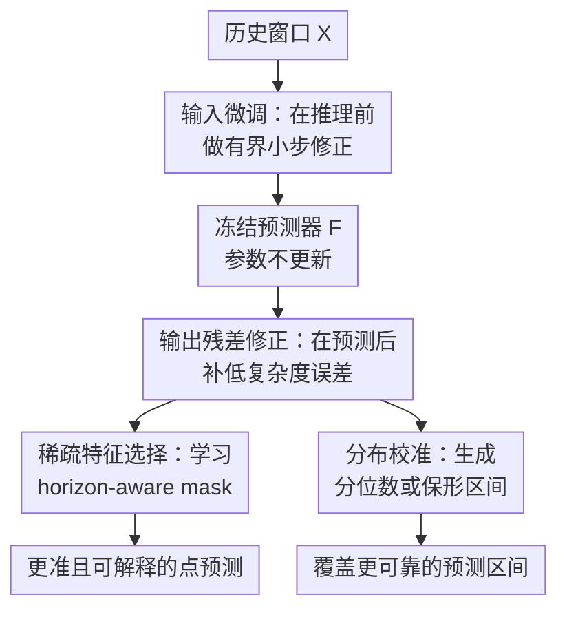

# The Forecast After the Forecast: A Post-Processing Shift in Time Series

**会议**: ICLR2026  
**OpenReview**: [https://openreview.net/forum?id=syfWdclGE1](https://openreview.net/forum?id=syfWdclGE1)  
**代码**: 待确认  
**领域**: 时间序列预测  
**关键词**: 后处理适配器, 时间序列预测, 分布校准, 特征选择, 概念漂移  

## 一句话总结
这篇论文提出 δ-Adapter：在冻结时间序列预测骨干模型的前后各加一个受 $\delta$ 约束的轻量后处理模块，用输入微调、输出残差修正、稀疏特征选择和不确定性校准，在不改模型结构、不重训骨干的情况下稳定提升预测精度与区间覆盖质量。

## 研究背景与动机
**领域现状**：时间序列预测过去几年主要靠更强的 backbone 往前推，从 TCN、Transformer、PatchTST、iTransformer，到 TimeMixer、Sundial、TTM 这类预训练或 foundation-style 模型，核心努力大多集中在“预测器本身怎么建模历史窗口”。这些方法能把平均误差压得越来越低，但在真实部署里，预测系统通常已经上线，接口、延迟和运维流程都固定，想为了一个新季节、新市场或新传感器分布去重新训练整套模型并不现实。

**现有痛点**：上线后的时间序列会持续遇到条件漂移，比如用电需求的季节性变了、交通传感器分布变了、汇率波动尺度变了。传统补救方案包括全量微调、在线更新、集成多个预测器，或者在测试时根据最近样本动态调整模型；它们的问题是要么训练/推理成本高，要么会改变已经验证过的生产模型，要么在论文实验里依赖未来标签，实际部署时存在 label leakage 风险。

**核心矛盾**：很多误差并不是 backbone 完全不会建模，而是最后一公里的低复杂度残差没有被吸收：某些 horizon 上有系统偏差，预测峰值附近尺度偏小，输入协变量里有一小部分近期片段更关键，或者点预测没有可靠区间。这些问题看起来不值得为整个大模型再来一次训练，但如果完全不处理，又会在部署场景里长期累积误差和不确定性失准。

**本文目标**：作者想回答一个更工程化的问题：能不能保持已有预测器 $F$ 完全冻结，只在输入/输出接口附近学习一个很小、可控、低成本的模块，让它做有限幅度的后处理修正？具体目标包括点预测误差下降、修正过程稳定可控、模块对不同 backbone 即插即用、同时还能给出更可信的预测区间和可解释的输入选择。

**切入角度**：论文的观察是，部署后的误差常常有结构，例如 horizon-wise bias、scale miscalibration、phase lag、日历或局部窗口导致的偏差。这样的结构不一定需要高容量模型才能捕捉；一个小 MLP、低秩 head 或稀疏 mask，只要方向和残差对齐，再用小步长 $\delta$ 约束，就可能像 shrinkage residual learning 一样带来稳定收益。

**核心 idea**：用一个有信任域约束的后处理适配器替代重训 backbone，把“改模型”转成“在输入前轻推一下、在输出后补一笔、再校准区间”。

## 方法详解
### 整体框架
δ-Adapter 的基本设定很干净：给定历史窗口 $X \in \mathbb{R}^{L \times d}$ 和冻结预测器 $F$，原始预测是 $\hat{Y}=F(X)$；论文不更新 $F$ 的参数，而是在 $F$ 的输入侧、输出侧或二者组合处训练一个很小的 adapter $A_\theta$。输入侧负责把 $X$ 变成轻微改动后的 $\tilde{X}$，输出侧负责把 $F$ 的预测变成残差修正后的 $\tilde{Y}$，所有改动都由小系数 $\delta$ 控制幅度。

更重要的是，论文没有把 δ-Adapter 只当成一个普通误差修补器。它把同一套“冻结骨干 + 受限后处理”的思想扩展成三类用途：第一类是 Ada-X/Ada-Y 提升点预测；第二类是 mask adapter 从输入窗口中选出最关键的时间-变量位置；第三类是 Quantile Calibrator 和 Conformal Calibrator，把点预测扩展成有覆盖保证或覆盖更可靠的预测区间。

从这个框架看，输入微调和输出残差修正是核心预测路径；稀疏特征选择是输入 adapter 的可解释实例；分布校准是输出侧 adapter 的不确定性实例。论文的理论部分也围绕这条路径展开：只要 adapter 的方向与残差或 loss gradient 有正向对齐，小的 $\delta$ 就能带来局部下降；只要 $F$ 是 Lipschitz 且 adapter 输出有界，预测漂移就是 $O(\delta)$。

### 关键设计
**1. 输入微调：把测试时漂移转成受限的输入空间小步移动**

输入侧 adapter 不是重写历史序列，而是在原始窗口附近做很小的软编辑。加性形式写作 $\tilde{X}=X+\delta A^{in}_\theta(X)$，乘性形式写作 $\tilde{X}=X \odot (1+\delta A^{in}_\theta(X))$，实现里通过 $\tanh$ 或 clipping 让 $\|A^{in}_\theta(X)\|_\infty \le 1$。这样 $\delta$ 不再只是一个超参，而是直接约束每个输入位置最多能被改多少。

这个设计针对的是部署后的 covariate shift：如果近期输入里某些变量尺度、相位或局部模式和训练期略有偏移，完全重训 $F$ 太重，但把输入往更适合 $F$ 的方向轻推一步可能足够。论文用一阶展开解释这一点：$F(X+\delta u) \approx F(X)+\delta J_F(X)u$，于是输入微调在预测空间里等价于一个由 Jacobian 映射出的有效修正。如果 $J_Fu$ 和残差 $r=Y-F(X)$ 对齐，足够小的 $\delta$ 会降低风险。

**2. 输出残差修正：只学习 backbone 没吃掉的低复杂度误差**

输出侧 adapter 更像一个保守版 residual learner。加性形式是 $\tilde{Y}=F(X)+\delta A^{out}_\theta(F(X),X)$，也可以用乘性形式处理尺度误差。对平方误差来说，如果记 $g(X)=A^{out}_\theta(F(X),X)$、$r(X)=Y-F(X)$，输出 adapter 的风险可展开为 $\frac{1}{2}\mathbb{E}\|r-\delta g\|^2$，其中一阶收益来自 $\mathbb{E}\langle r,g\rangle$。

这意味着 adapter 不需要像新 backbone 一样重新建模全部时间序列规律，它只要捕捉残差里的简单结构即可，比如不同预测步长上的系统偏差、峰值附近低估、尺度漂移或特定数据集上的平均偏移。$\delta$ 的 shrinkage 作用让它即使学错一点也不至于大幅破坏原模型，而当 $g$ 与残差正相关时，理论上存在一段正的 $\delta$ 区间使风险低于原始模型。

**3. 稀疏特征选择：用 mask adapter 让输入修正变得可解释**

论文把输入 adapter 的一个重要实例设计成特征选择器：它输出 $M(X;\theta) \in [0,1]^{L\times d}$，并用 $X'=X\odot M(X;\theta)$ 喂给冻结预测器。$M$ 接近 1 的位置表示保留信息，接近 0 的位置表示抑制信息；为了让 mask 既能训练又能接近离散选择，论文使用 Gumbel-Sigmoid/Concrete relaxation 或 straight-through estimator。

这个设计解决了一个常被忽略的问题：后处理如果只是提升误差，读者不知道它到底在修哪里。mask adapter 通过稀疏、低熵、时间平滑和预算约束，把“哪些历史位置真的影响预测”显式暴露出来。训练目标包含预测损失、$\|M\|_1$ 稀疏项、entropy 项、temporal variation 项和预算项 $({\bar m}-\kappa)_+$，其中 $\bar m$ 是平均保留率，$\kappa$ 控制最多保留多少输入。这样得到的 mask 不只是解释图，而是会真实参与预测；实验里保留这些 learned features 会降误差，移除它们会明显伤害性能。

**4. 分布校准：在不改点预测器的情况下补上可靠区间**

时间序列系统上线后，只有点预测往往不够，用户还需要知道预测可信到什么程度。论文把输出侧 adapter 进一步扩展成两个 calibrator：Quantile Calibrator 直接学习多个 horizon-wise quantile，Conformal Calibrator 学一个异方差 scale function 再做 normalized residual conformal prediction。

Quantile Calibrator 把分位数写成 $q_{\tau,\theta}(X)=\hat{Y}+\epsilon a_\theta(X,\hat{Y},\tau)\odot s_\theta(X,\hat{Y})$，其中偏移是有界的；为了避免不同分位数交叉，它用 $q_{\tau_{j+1}}=q_{\tau_j}+\mathrm{softplus}(d_{j,\theta})$ 保证单调。Conformal Calibrator 则学习 $w_\theta(X,\hat{Y})>0$ 估计残差尺度，在校准集上计算归一化残差分位数 $\kappa_\alpha$，最终区间近似为 $\{y:\|y-\hat{Y}\|\le \kappa_\alpha w_\theta(X,\hat{Y})\}$。前者更像学习式分布校准，后者保留 exchangeability 条件下的有限样本覆盖保证。

### 一个完整示例
假设一个电力负荷预测系统已经部署，骨干模型 $F$ 每小时用过去 $L$ 个时间点预测未来 $H$ 个时间点。进入夏季后，空调负荷带来新的峰值形态，原模型还能捕捉日周期，但经常低估晚高峰，且不同传感器/用户的误差尺度不一致。

使用 δ-Adapter 时，系统先让输入微调模块对历史窗口做很小的有界修正，比如把最近几个与温度、工作日模式相关的 covariates 稍微放大，同时不触碰大多数位置。接着冻结的 $F$ 产生原始预测，输出残差模块根据 $F(X)$ 与当前窗口再补一个 horizon-specific correction，把第 8 到第 12 个预测步的低估往上修。

如果开启 mask adapter，它会给 $L\times d$ 个输入位置打分：多数普通时段被压低，晚高峰前的几个温度/负荷变量保留下来。若还需要不确定性，Quantile Calibrator 会在峰值附近给出更宽的上分位数，Conformal Calibrator 则用校准集的归一化残差给每个样本生成 personalized interval。整个过程中，原始预测器 $F$ 的参数和服务接口都不变，改动只发生在输入输出两端。

### 损失函数 / 训练策略
训练时冻结 $F$，只更新 adapter 参数。点预测场景用 MSE/MAE 或 horizon-aware loss 训练，组合 adapter Ada-X+Y 可以端到端联合优化：先前向计算 $\hat{Y}=F(X+\delta A^{in}_\theta(X))$，再计算 $\tilde{Y}=\hat{Y}+\delta A^{out}_\theta(\hat{Y})$，一次 backward 后同时更新两个 adapter。

实现上 adapter 是小 MLP 或低秩 head，学习率主要用 Adam 的 $10^{-4}$；主实验里 $\delta=0.1$，ETT 数据集上取 $0.01$。mask adapter 的目标是预测损失加结构正则：$\mathcal{L}_{pred}+\lambda_1\|M\|_1+\lambda_{ent}\mathcal{H}(M)+\lambda_{tv}\mathrm{TV}(M)+\lambda_{bud}(\bar m-\kappa)_+$。Quantile Calibrator 用 pinball loss 加 reliability regularization；Conformal Calibrator 先学习尺度 $w_\theta$，再用 held-out calibration set 计算经验分位数。

## 实验关键数据

### 主实验
论文在 ETT、Electricity、Exchange、Traffic、Weather 等常用时间序列数据集上测试，覆盖预训练模型、SOTA backbone、在线/批量训练方式和不确定性校准。下面只摘最能说明问题的数字，重点看 δ-Adapter 是否在冻结 backbone 的情况下带来稳定收益。

| 设置 | 数据集 / Backbone | 原始模型 MSE | δ-Adapter 结果 | 主要结论 |
|------|-------------------|--------------|----------------|----------|
| 预训练模型 | Sundial-S / Weather | 0.427 | Ada-X 0.025, Ada-Y 0.039 | 输入/输出后处理都大幅降低误差，Weather 上收益极大 |
| 预训练模型 | Sundial-S / ETTm2 | 0.348 | Ada-X 0.201, Ada-Y 0.254 | 输入侧微调更强，说明输入分布修正很关键 |
| 预训练模型 | TTM-R2 / ELC | 0.180 | Ada-X 0.167, Ada-Y 0.168 | 多变量预训练模型上也有稳定小幅提升 |
| SOTA backbone | DistPred / Exchange | 0.350 | Ada-X 0.302, Ada-Y 0.319 | 对强模型仍能修正残差，Exchange 提升明显 |
| SOTA backbone | Autoformer / Traffic | 0.972 | Ada-X 0.959, Ada-Y 0.918 | 输出残差修正对较弱 backbone 帮助更大 |
| 组合训练 | DistPred / Weather | 0.1710 | Ada-X+Y Online 0.1560 | 在线组合 adapter 是图中最低误差设置 |

| 对比设置 | DistPred 平均对比 | iTransformer 平均对比 | Autoformer 平均对比 | 观察 |
|----------|-------------------|------------------------|----------------------|------|
| Offline vs Ada-X+Y | 8 个数据集 Ada-X+Y 都低于 Offline | 8 个数据集 Ada-X+Y 都低于 Offline | 8 个数据集 Ada-X+Y 都低于 Offline | 在去除 label leakage 后仍稳定胜出 |
| SOLID / TAFAS / LoRA | 多数只带来小幅变化或局部退化 | LoRA 有时改善但不如 Ada-X+Y | Ada-X+Y 对 Autoformer 提升最明显 | 小接口 adapter 比改内部或在线更新更稳 |
| OneNet / FSNet | 只在部分数据集有竞争力 | 不适用同一列所有 backbone | 在 ELC、Traffic 等不如 Ada-X+Y | δ-Adapter 插到标准 backbone 上仍有优势 |

### 消融实验
| 配置 | 关键指标 | 说明 |
|------|----------|------|
| PatchTST 原始模型 | ELC MSE 0.167, Weather MSE 0.178, Traffic MSE 0.463 | 作为复合 adapter 消融的 frozen backbone |
| PatchTST + Ada-X+Y | ELC 0.159, Weather 0.161, Traffic 0.451 | 加性输入+输出组合整体约 5.6% MSE 下降 |
| PatchTST + Ada-X×Y | ELC 0.159, Weather 0.165, Traffic 0.448 | 乘性组合也有效，整体约 5.1% MSE 下降 |
| TimeMixer 原始模型 | ELC 0.145, Weather 0.168, Traffic 0.475 | 更强 backbone 的可提升空间较小 |
| TimeMixer + Ada-X+Y | ELC 0.143, Weather 0.166, Traffic 0.465 | 加性组合仍能带来约 1.6% MSE 下降 |
| TimeMixer + Ada-X×Y | ELC 0.143, Weather 0.164, Traffic 0.467 | 乘性组合约 1.8% MSE 下降，Weather 更好 |
| Mask adapter | ELC 0.163 → 0.159, Exchange 0.099 → 0.093 | 无预算时最佳 mask ratio 多在 92%-98%，说明它更多是精细抑制而非极端裁剪 |
| δ / 学习率消融 | $\delta=0.1$ 附近较稳，$0.2$ 收益变小或不一致 | 过大的修正会破坏信任域；学习率从 $10^{-2}$ 到 $10^{-6}$ 整体仍较稳定 |

### 关键发现
- 输入侧 Ada-X 在不少数据集上比 Ada-Y 更强，尤其在 Weather、ETTm2、Exchange 等分布/尺度变化明显的场景，说明先把输入推回 backbone 熟悉的局部区域很有价值。
- 输出侧 Ada-Y 对残差结构明显的模型也很重要，例如 Autoformer 在 Traffic 上从 0.972 降到 0.918，说明低复杂度 residual correction 可以弥补旧模型的系统偏差。
- Ada-X+Y 通常比单独 Ada-X 或 Ada-Y 更稳，论文的组合稳定性理论和实验趋势一致：输入修正负责给 backbone 更好的上下文，输出修正负责最后补残差。
- mask adapter 的可解释性实验很有说服力：选中 learned features 比随机选择误差更低，反过来移除 learned features 会让误差显著上升，说明 mask 找到的是真正影响预测的片段。
- 校准实验里，Quantile Calibrator 和 Conformal Calibrator 在 ETT、Traffic、Electricity、Weather 上取得最高 PICP；QC 更保守、区间略宽，CC 覆盖高且更紧，适合需要覆盖保证的部署场景。

## 亮点与洞察
- 这篇论文最实用的地方是把时间序列预测的改进焦点从“再造一个更复杂 backbone”移到“部署后如何便宜地修最后一公里”。这对于已经有预测服务、不能频繁重训的生产系统很贴近现实。
- $\delta$ 约束让 adapter 的行为更像信任域内的小步优化，而不是无界的补丁网络。这个设计同时服务于理论、稳定性和工程可控性，是论文比普通 residual head 更清楚的地方。
- 输入侧和输出侧的分工很自然：Ada-X 处理“给模型看的上下文不太对”，Ada-Y 处理“模型已经输出了但还有系统残差”。这种分工可以迁移到很多冻结模型场景，例如需求预测、异常检测后的分数校正，甚至非时间序列的回归系统。
- mask adapter 把“提升预测”和“解释输入重要性”绑在同一个训练目标里，比事后做 saliency map 更可信。因为它不是观察模型，而是在被约束的情况下真实参与预测。
- 不确定性校准部分把论文从单纯 accuracy trick 扩展成部署工具箱：如果业务只关心点预测，用 Ada-X/Y；如果需要解释，用 mask；如果需要区间，用 QC/CC。几个模块都围绕 frozen forecaster 的接口展开，整体设计统一。

## 局限与展望
- 论文大量实验显示 δ-Adapter 有效，但 adapter 仍需要带标签的训练/校准数据。如果部署场景突然发生很强的无标签漂移，如何在不泄漏未来标签的前提下持续更新 adapter，还需要更严格的在线协议。
- 理论保证依赖局部对齐、小步长、Lipschitz 或 smoothness 等条件，能解释“为什么小修正会稳”，但不能保证所有非凸神经 backbone 和所有漂移类型都有效。真实系统里仍需要监控 adapter 是否开始过度补偿。
- mask adapter 的最佳 mask ratio 在多数数据集上接近 92%-98%，说明它在默认设置下更像“轻微抑制噪声”而不是强稀疏解释器。如果用户期待非常稀疏、可人工审查的解释，需要更强预算或领域先验。
- 校准部分依赖 conformal prediction 的 exchangeability 假设；时间序列本身存在自相关和分布漂移，有限样本覆盖在非平稳在线场景下可能会变弱。后续可以考虑 rolling calibration、drift-aware conformal 或 coverage monitoring。
- 论文没有把计算成本、参数量、训练时长以统一表格充分展开到所有 backbone；虽然文本强调 negligible compute，但生产落地时还需要更细的 latency、memory 和 batch/online 更新开销评估。

## 相关工作与启发
- **vs SOLID / TAFAS / PETSA / DynaTTA**: 这些测试时适应方法主要通过选择层更新、线性 adapter、周期检测或动态 gating 应对漂移，但容易在实验协议里依赖未来标签，或者需要对模型内部做更多假设。δ-Adapter 把适应限制在输入/输出接口，明确保持 backbone 冻结，并把 label leakage 风险作为对比重点。
- **vs LoRA / NLP adapter / prefix tuning**: LoRA 和 NLP adapter 通常插入模型内部层，适合白盒大模型微调。本文借鉴“冻结大模型、训练小模块”的思想，但把模块放在时间序列预测器的 I/O 边界，因此更适合黑盒或生产接口固定的 forecaster。
- **vs residual boosting**: 输出侧 Ada-Y 和 shrinkage boosting 很像，都是用小步长学习残差方向。区别在于本文把这个思想系统化到多步时间序列预测，并同时考虑输入侧 Jacobian 诱导的修正、组合稳定性和校准用途。
- **vs conformal prediction / CQR / EnbPI / SPCI**: 传统 conformal 或 quantile 方法关注预测区间覆盖，未必改善点预测，也不一定与冻结 backbone 的后处理统一起来。本文的 QC/CC 是 δ-Adapter 的分布版本，把区间宽度学习和 point forecaster 保持冻结结合在一起。
- **启发**: 对很多已经上线的预测系统，可以优先检查残差是否有 horizon-wise bias、尺度漂移或条件相关结构。如果有，与其重训整个 backbone，不如先尝试一个受限 residual adapter，并用 drift bound/coverage monitoring 给上线风险设护栏。

## 评分
- 新颖性: ⭐⭐⭐⭐☆ 把后处理 adapter 系统化到时间序列预测的输入、输出、特征选择和校准接口，思路不完全新，但组合完整且针对部署痛点明确。
- 实验充分度: ⭐⭐⭐⭐☆ 覆盖多数据集、多 backbone、预训练模型、SOTA、在线/批量和校准实验，证据较多；但统一的效率表和更严格真实在线漂移实验还可以加强。
- 写作质量: ⭐⭐⭐⭐☆ 主线清楚，理论与实验能互相支撑；部分图表排版和符号细节略粗糙，个别文字也有小问题。
- 价值: ⭐⭐⭐⭐⭐ 对已有时间序列系统很实用，尤其适合不能频繁重训、又需要精度和区间可靠性的部署场景。

<!-- RELATED:START -->

## 相关论文

- [\[ICLR 2026\] Quadratic Direct Forecast for Training Multi-Step Time-Series Forecast Models](quadratic_direct_forecast_for_training_multi-step_time-series_forecast_models.md)
- [\[ICLR 2026\] Panda: A Pretrained Forecast Model for Chaotic Dynamics](panda_a_pretrained_forecast_model_for_chaotic_dynamics.md)
- [\[ICLR 2026\] Aurora: Towards Universal Generative Multimodal Time Series Forecasting](aurora_towards_universal_generative_multimodal_time_series_forecasting.md)
- [\[ICLR 2026\] Characteristic Root Analysis and Regularization for Linear Time Series Forecasting](characteristic_root_analysis_and_regularization_for_linear_time_series_forecasti.md)
- [\[ICLR 2026\] Bridging Past and Future: Distribution-Aware Alignment for Time Series Forecasting](bridging_past_and_future_distribution-aware_alignment_for_time_series_forecastin.md)

<!-- RELATED:END -->
