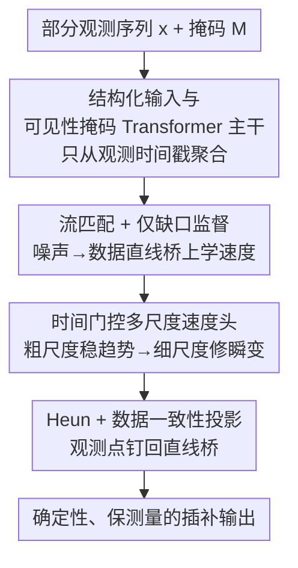

# Time-Gated Multi-Scale Flow Matching for Time-Series Imputation

**会议**: ICLR 2026  
**OpenReview**: [https://openreview.net/forum?id=txvc61ONbs](https://openreview.net/forum?id=txvc61ONbs)  
**代码**: 无  
**领域**: 时间序列 / 缺失值插补 / 流匹配  
**关键词**: 时序插补, 流匹配, 多尺度速度场, 数据一致性投影, 确定性 ODE

## 一句话总结
把多变量时序缺失值插补建模成一条「噪声→数据」的数据条件 ODE，用流匹配学速度场，靠可见性掩码注意力防泄漏、时间门控多尺度速度头调度「先粗后细」的频率内容、Heun+数据一致性投影把观测点钉死在直线桥上，从而在十个基准上以确定性、低算力拿到有竞争力或更优的插补精度。

## 研究背景与动机

**领域现状**：传感器、医疗、交通、金融的多变量时序普遍存在缺失。早期用 GRU-D、BRITS 这类带衰减机制的 RNN 处理不规则观测；近年主流是基于自注意力的编码-解码器（SAITS、PatchTST、iTransformer、TimesNet 等），把缺失位置当点估计回归出来。另一条线是扩散式概率插补（CSDI、PriSTI、SSSD），把观测当条件、对缺失坐标做反向去噪，天然给不确定性。

**现有痛点**：判别式点估计器不显式建模「从噪声演化到数据」的轨迹，面对长块缺失（blockwise gap）时边界容易漂移、误差往缺口内部传播。扩散模型虽然能给分布，但推理要几十上百步反向采样，且在确定性评测协议下存在采样方差噪声；把 Transformer 直接套到插补上还有一个隐患——注意力会从**未观测**时间戳聚合信息，造成标签泄漏。

**核心矛盾**：插补同时面对三个耦合难题——不规则采样/块状缺口打断短程连续性、慢趋势与尖锐瞬变共存（考验模型的谱偏置）、以及要在适中算力下做到可复现的可靠推理。点估计与扩散各占了一头，没人在「确定性、轻量、又能调度频率内容」这个角落里把三件事一起做好。

**本文目标**：给长缺口插补提供一个轻量、任务对齐的确定性方案——训练目标只盯缺失位置，推理约束严格保留观测，且能用一个旋钮（Heun 步数）在精度与算力间平滑权衡。

**切入角度**：作者观察到流匹配（flow matching / rectified flow）在「噪声—数据」直线桥上学一个**常速**速度场，测试时积分这条 ODE 就是确定性采样，能拿到有竞争力的速度-质量权衡。于是把插补改写成「数据条件 ODE」，并针对时序补三件任务专属武器：可见性掩码注意力、时间门控多尺度速度参数化、Heun+逐步数据一致性投影。

**核心 idea**：用「数据条件 ODE + 流匹配」代替点估计/扩散，让速度场沿轨迹**先稳全局趋势、后修高频细节**，同时把观测坐标硬投影回直线桥上，做确定性、保测量的插补。

## 方法详解

### 整体框架
输入是部分观测的多变量序列 $x \in \mathbb{R}^{T\times D}$ 和二值观测掩码 $M$，输出是缺失位置上的确定性重建。整套流程是：先把观测序列包成一个「结构化端点」$\tilde{x}$，送进带可见性掩码的时间感知 Transformer 拿到共享表示 $h$；$h$ 在固定的 1D 金字塔上分尺度提速度、用时间门把多尺度速度混成最终速度场 $v_\theta$，定义出 ODE $\dot z_t = v_\theta(z_t,t;\tilde x)$；测试时从高斯噪声 $z_0$ 出发，用二阶 Heun 积分器逐步前进，每步做一次数据一致性投影把观测坐标钉回直线桥，最终得到一条确定性、保测量的插补轨迹。训练只在缺失坐标上监督速度（gap-only），观测坐标交给推理时的投影硬约束。

### 关键设计

**1. 结构化输入 + 可见性掩码 Transformer 主干：从源头堵住对未观测点的泄漏**

朴素地把 Transformer 套到插补上，注意力会去聚合那些本该被推断的缺失时间戳，等于偷看答案。作者先把输入扩成结构化端点 $\tilde x = [\,x\odot M,\, m,\, x^L,\, x^R\,] \in \mathbb{R}^{T\times(D+3)}$：除了被掩码遮过的观测值，还拼上逐时刻可见性标志 $m_t$（该时刻只要有任一通道被观测就为 1）和左右两侧观测点的滑动平均 $x^L, x^R$（窗长 $w=10$，概括局部上下文）。这三条辅助通道被当作「已知」，既喂给注意力也参与推理时的数据一致性。主干是时间感知 Transformer $f_\phi$，吃 $(z_t, t, \tilde x)$ 产出共享表示 $h$，其自注意力按时间可见性掩码：查询 $\tau$ 只能 attend 到 $m_t=1$ 的键，logits 写成 $a_{\tau t} = q_\tau^\top k_t/\sqrt{d_k}$ 当 $m_t=1$、否则 $-\infty$，等价于在 softmax 前加一个 $-\infty$ 偏置矩阵 $B$。标量时间 $t$ 用正弦/时间步嵌入加到 token 特征上。这样信息只从真实观测时间戳流出，从结构上杜绝了泄漏。

**2. 仅缺口监督的流匹配：把建模容量全砸在「真正要推断的部分」**

作者在「高斯噪声—数据端点」的线性桥上做确定性流匹配。对每个样本采 $z_0\sim\mathcal N(0,I)$，令 $z_1=\tilde x$，$z_t=(1-t)z_0+t z_1$，$t\sim\mathrm{Uniform}[0,1]$；这条直线桥上的教师速度是常数 $v(z_t,t)=z_1-z_0$。训练让 $v_\theta$ 去匹配它，但监督集只取缺失坐标 $\Omega=\{(t,d)\mid M_{t,d}=0,\,d\in\mathcal D\}$：

$$\mathcal L_{\mathrm{FM}} = \frac{1}{|\Omega|}\sum_{(t,d)\in\Omega}\big\|\,[v_\theta(z_t,t;\tilde x)]_{t,d} - [z_1-z_0]_{t,d}\,\big\|_2^2.$$

为什么不监督观测坐标？因为观测坐标在推理时已被数据一致性机制硬约束（设计 4），再加 loss 是冗余的，反而会引入相互冲突的梯度、损害对未知部分的重建。另有一阶/二阶时间差分和轻度高频抑制两个可选稳定性正则，权重很小、固定，放进附录不进主目标。这一招把训练信号和插补目标严格对齐——「该学的只有缺口」。

**3. 时间门控多尺度速度头：让谱偏置随流的阶段确定性地演化**

慢趋势和尖锐瞬变共存，单一感受野调和不了。作者把共享表示 $h$ 扇出到固定 1D 金字塔（步幅 $S=\{1,2,4\}$，平均池化下采样 + 线性上采样）上的多个速度头：每尺度 $h^{(s)}=\mathrm{Down}_s(h)$，经轻量局部模块 $\mathrm{Head}_s$（如 Conv-GELU-Conv）提出尺度专属速度 $u^{(s)}$，再上采样回 $\tilde u^{(s)}$。最终速度由一个**时间相关的门**混合：

$$\alpha(t)=\mathrm{softmax}(\mathrm{MLP}(t))\in\Delta^{|S|-1},\qquad v_\theta(z_t,t;\tilde x)=\sum_{s\in S}\alpha_s(t)\,\tilde u^{(s)}.$$

门让谱重心随 $t$ 移动：$t\approx 0$ 时偏重粗尺度先把全局轨迹稳住，$t\to 1$ 时把权重转向最细分支去解尖锐瞬变。为压住最细分支的高频振铃，对它加一个固定的 1D 抗混叠滤波器（3–5 抽头、单位直流增益），并用 tanh 之类的逐元素挤压限定速度幅值（不影响 ODE 不动点）。相比只在编码器里融多尺度特征，这里是直接给**速度场**装上 scale-specific 头和时间门，让求解器自己走出一条「先粗后细」的轨迹。

**4. Heun + 逐步数据一致性投影：确定性积分且严格保测量**

测试时从 $z_0\sim\mathcal N(0,I)$ 把学到的速度当 ODE 从 $t=0$ 积到 1。用二阶 Heun（预测-校正 / 显式梯形法）：先预测 $\hat z = z_n + \Delta t\, v_\theta(z_n,t_n)$，再校正 $z^{\mathrm{ode}}_{n+1}=z_n+\tfrac{\Delta t}{2}(v_\theta(z_n,t_n)+v_\theta(\hat z,t_n+\Delta t))$，可选一个单调时间扭曲 $t_{\mathrm{eff}}(t)=t^k,\,k\ge 1$。每步之后做数据一致性（DC）投影：设 $K$ 为观测数据坐标加 conditioning 通道（对所有 $t$ 视为已知），令观测坐标走精确的线性桥 $z_{n+1}[K]\leftarrow(1-t_{\mathrm{eff}})z_0[K]+t_{\mathrm{eff}}z_1[K]$，未知坐标用 ODE 结果 $z_{n+1}[\bar K]\leftarrow z^{\mathrm{ode}}_{n+1}[\bar K]$。于是已知项每步都精确贴在直线桥上、未知项在 ODE 下演化。作者还给了一条性质：若 $v_\theta\equiv z_1-z_0$（完美速度），Heun 对常速精确、DC 又把 $K$ 钉在同一条直线上，整套 Heun+DC 会对所有坐标恢复出精确线性桥。这把训练（只盯缺口）和推理（保观测）两端的约束对齐，显著减少边界伪影和漂移，长缺口下尤其稳。步数 $N$ 给了一个精度-算力旋钮（推荐 $N\in[200,300]$，快速验证用 $[80,120]$）。

### 损失函数 / 训练策略
主目标就是上面的仅缺口流匹配损失 $\mathcal L_{\mathrm{FM}}$，外加两个小权重、固定的可选时间差分/高频抑制正则做数值稳定（不影响主结果）。超参跨数据集**全部固定**：金字塔步幅 $S=\{1,2,4\}$、滑窗 $w=10$、抗混叠 3–5 抽头单位直流增益、时间扭曲 $k\in[1,2]$、推理步数 $N\in[200,400]$，默认 $N=300$。计算量上，主干是 $O(LT^2Hd)$ 时间、$O(T^2)$ 注意力显存（掩码不改变量级），多尺度头每次前向加 $O(|S|TD)$，Heun 每步两次速度评估（$N$ 步约 $2N$ 次前向），DC 投影对 $|K|$ 线性。

## 实验关键数据

### 主实验
十个公开基准（ETTh1/h2/m1/m2、Electricity、Traffic、Weather、Illness、Exchange、PEMS03），指标只在缺失位置上算 MSE/MAE，对缺失率 $\{0.1,0.3,0.5,0.7\}$ 和 5 个随机种子取平均，超参跨数据集不调。

| 数据集 | 指标 | 本文 TG-MSFM | 最强基线 | 说明 |
|--------|------|------|----------|------|
| ETTh2 | MSE | **0.044** | 0.093 (Mtsci) | 大幅领先 |
| ETTm2 | MSE | **0.020** | 0.030 (PatchTST) | |
| Illness | MSE | **0.064** | 0.167 (SAITS) | 长缺口/高方差仍稳 |
| Exchange | MSE | **0.029** | 0.067 (PriSTI) | burst+trend 提升大 |
| PEMS03 | MSE | **0.047** | 0.065 (PatchTST) | |
| Electricity | MSE/MAE | **0.101 / 0.198** | 0.114/0.216 (SAITS) | |

跨十个数据集，TG-MSFM 在 MSE 和 MAE 的平均都最强，且无需逐数据集调参。周期族（ETTh/m）增益稳但温和——可见性掩码注意力已把季节信息从观测点搬过来，多数提升来自缺口边界（Heun+DC 防观测点漂移、抑制误差往缺口内传）；burst+trend 族（Traffic/Exchange）提升更大——早期粗尺度稳全局、轻抗混叠的细头只在接近端点时做局部修正，缓解过冲；相比随机扩散（CSDI），确定性 ODE 在标准协议下 MAE 一致更低，消掉了采样方差这个评测噪声源。

### 消融实验
在 Electricity 和 ETTh1 上逐个拆主组件（MS=多尺度头 / Gate=时间门 / Heun=积分器）：

| 配置 | Electricity MSE/MAE | ETTh1 MSE/MAE | 说明 |
|------|------|------|------|
| Full（MS✓ Gate✓ Heun✓） | **0.101 / 0.198** | **0.126 / 0.231** | 完整模型 |
| 单尺度（s=1） | 0.116 / 0.227 | 0.158 / 0.276 | 去多尺度，单一感受野调和不了趋势与瞬变 |
| 静态混合（无门） | 0.212 / 0.223 | 0.147 / 0.261 | 去时间门，谱重心不随流阶段变 |
| Euler（无 Heun） | 0.115 / 0.218 | 0.143 / 0.257 | 用一阶 Euler，边界误差变大 |

### 关键发现
- 三个组件互补：门负责「强调什么」，Heun+DC 负责「更新怎么在缺口里传播」。去掉任一都掉点，去多尺度在 ETTh1 上 MSE 从 0.126 涨到 0.158、掉得最狠。
- 用 Euler 替 Heun 边界误差上升——预测-校正的平均恰好在 DC 约束观测坐标的位置降低了局部截断误差，减少向邻近缺失时刻的泄漏。
- 步数效率：ETTh1 上 $N\approx 250$ 后收益明显递减，$N\lesssim 100$ 时因粗到细的门控仍优雅退化；CSDI 的曲线更平（多加反向步主要在压采样噪声而非纠结构偏差）。速度-质量曲线 TG-MSFM 的 AUPC=0.626 远高于 CSDI 的 0.380。
- 鲁棒性：中心缺口从 12 拉长到 72 小时，所有方法误差都涨，但 TG-MSFM 增长最慢、各长度都最准。

## 亮点与洞察
- 把「训练只监督缺口」和「推理硬投影保观测」做成一对互锁约束，是全文最巧的点：观测坐标既然在推理时被钉死，训练就别去管它，省下的容量全给真正要推断的部分，还避免了冲突梯度。
- 多尺度建模的注入点选在**速度场**而非编码器特征：让 ODE 求解器沿轨迹走「先粗稳趋势、后细修瞬变」的路径，时间门把谱偏置变成一个随 $t$ 确定性演化的调度器，这个视角可迁移到任何流匹配/扩散的生成任务。
- 「完美速度下 Heun+DC 精确恢复线性桥」这条性质给确定性插补一个干净的理论锚点——方法在理想极限下不会引入额外偏差。
- 一个旋钮（Heun 步数）调精度-算力，工程上很友好：线上要准就 $N\in[200,300]$，要快就 $[80,120]$。

## 局限与展望
- 作者明确只做**确定性单轨迹**插补：每个窗口由随机种子固定一个 $z_0$、跑确定性 Heun+DC，不做多样本聚合，也**不给标定的不确定性**。需要后验/置信区间的场景（如风险敏感决策）它不替代扩散/一致性模型。
- 金字塔步幅、滑窗、抗混叠抽头等都是固定手工设定，没探索自适应尺度或可学门控结构；时间扭曲 $k$、步数 $N$ 的最优值可能随数据集变化但本文为了「免调参」卖点统一固定。
- 评测都在标准多变量时序基准上，未涉及显式图结构/空间关系（作者定位为 graph-agnostic），与 GRIN、ImputeFormer 这类有可靠图时的强基线没正面比。
- 改进思路：把单轨迹扩成多 $z_0$ 采样得到条件分布并做标定，或让时间门/尺度集合可学，可能进一步拿下「确定性 + 不确定性」两头。

## 相关工作与启发
- **vs CSDI / PriSTI（扩散式插补）**: 它们用条件反向随机过程去噪、天然给不确定性，但推理多步且确定性协议下有采样方差；本文用确定性流匹配 ODE，目标是可复现的点估计，MAE 一致更低、速度-质量更优，定位为「互补」而非替代。
- **vs SAITS / PatchTST / iTransformer（判别式点估计）**: 它们直接回归缺失值、不显式建模噪声到数据的演化；本文显式学速度场走 ODE，长缺口下靠 DC 投影防边界漂移，增益主要落在缺口边界与 burst 区。
- **vs Sinkhorn OT / TDM（对齐/传输式插补）**: 它们靠手工匹配代价、确定且高效，但不暴露显式连续时间生成轨迹；本文只隐式用 OT 思想（线性桥 + DC 投影），换来透明的 ODE 演化。
- **vs 一致性模型 / CoSTI**: 它们逼近概率流 ODE 做少步确定性采样且保留不确定性；本文更简单，专攻长缺口、可复现点估计，不追后验采样。

## 评分
- 新颖性: ⭐⭐⭐⭐ 把流匹配 + 时间门控多尺度速度 + 逐步数据一致性三件套组合到时序插补，组件各有出处但整体定位清晰。
- 实验充分度: ⭐⭐⭐⭐ 十个基准、固定超参、消融/步数/缺口长度都覆盖，但缺与图结构强基线的正面对比。
- 写作质量: ⭐⭐⭐⭐ 动机、定位、性质陈述都清楚，公式与组件对应明确。
- 价值: ⭐⭐⭐⭐ 给「确定性、轻量、可复现」长缺口插补提供了实用且任务对齐的方案。

<!-- RELATED:START -->

## 相关论文

- [\[ICML 2026\] Spatiotemporal Imputation with Graph-Informed Flow Matching](../../ICML2026/time_series/spatiotemporal_imputation_with_graph-informed_flow_matching.md)
- [\[ICLR 2026\] TrajFlow: Nationwide Pseudo GPS Trajectory Generation with Flow Matching Models](trajflow_nation-wide_pseudo_gps_trajectory_generation_with_flow_matching_models.md)
- [\[ICLR 2026\] Learning Recursive Multi-Scale Representations for Irregular Multivariate Time Series Forecasting](learning_recursive_multi-scale_representations_for_irregular_multivariate_time_s.md)
- [\[ICLR 2026\] Multi-Scale Hypergraph Meets LLMs: Aligning Large Language Models for Time Series Analysis](multi-scale_hypergraph_meets_llms_aligning_large_language_models_for_time_series.md)
- [\[ICLR 2026\] T1: One-to-One Channel-Head Binding for Multivariate Time-Series Imputation](t1_one-to-one_channel-head_binding_for_multivariate_time-series_imputation.md)

<!-- RELATED:END -->
