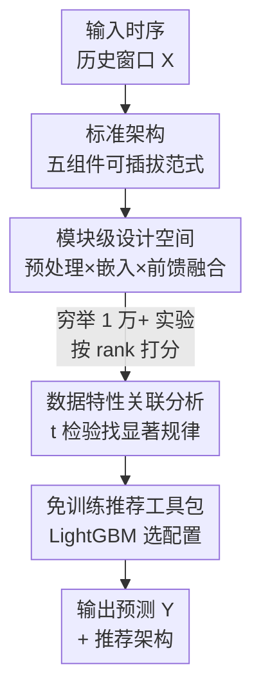

# TimeRecipe: A Time-Series Forecasting Recipe via Benchmarking Module Level Effectiveness

**会议**: ICLR 2026  
**OpenReview**: [https://openreview.net/forum?id=CsoR8ztROC](https://openreview.net/forum?id=CsoR8ztROC)  
**代码**: https://github.com/AdityaLab/TimeRecipe  
**领域**: 时间序列预测 / 基准评测 / AutoML  
**关键词**: 时序预测, 模块级基准, 标准架构, 设计空间搜索, 免训练模型选择

## 一句话总结
作者把现代时序预测模型拆成「预处理 / 嵌入 / 前馈建模 / 投影 / 后处理」五大组件的标准架构（Canonical Architecture），用超过 1 万次实验在模块粒度上系统评测每种设计在不同数据/任务下的效果，发现穷举设计空间得到的组合在 90% 以上场景能超过现有 SOTA，并据此训练了一个免训练的 LightGBM 工具包，根据数据特性直接推荐架构配置。

## 研究背景与动机
**领域现状**：深度学习时序预测百花齐放——Transformer 系（Informer、PatchTST、iTransformer）、MLP 系（DLinear、FITS、TimeMixer）、以及序列分解、实例归一化等模块层出不穷。但这些方法各自端到端地堆叠模块，社区对「到底哪个组件、在什么条件下有用」始终争论不休。

**现有痛点**：已有的时序预测 benchmark（FoundTS、GiftEval、TFB 等）几乎都停留在**模型级**评测——给出的结论是「在某数据集上某个完整模型最好」。这种结论一旦换到 benchmark 之外的真实场景就不可迁移，而且只告诉你「谁赢了」，却说不清「为什么赢」「赢在哪个模块」。

**核心矛盾**：时序预测模型的性能其实是由内部一个个模块（要不要归一化、用 token 还是 patch 嵌入、用 MLP 还是 Transformer、按时间还是按特征融合）共同决定的；但现有评测把模型当黑箱，模块的贡献被整体性能掩盖，导致设计选择只能靠经验和直觉。

**本文目标**：把「哪些模块和设计在什么样的时序预测场景下最有效」这个问题，从模型级下沉到**模块级**来回答，并把答案变成可操作的工具。

**切入角度**：作者观察到 Informer 之后的主流模型其实收敛到了一个共同范式——都能分解成五个标准组件。既然如此，就可以把这套范式抽象成一个统一的「标准架构」，再把每个组件的候选模块当成可插拔的超参数，从而把成百上千个模型变成同一个设计空间里的不同坐标点，在公平的统一管线下穷举评测。

**核心 idea**：用「标准架构 + 模块级穷举 benchmark + 数据特性关联分析 + 免训练推荐器」替代「整模型对比」，让时序预测从「试模型」变成「按数据特性选模块」。

## 方法详解

### 整体框架
TimeRecipe 不是又一个新预测模型，而是一个**统一的模块级评测框架**。它的核心是把 Informer 之后主流时序预测模型共有的结构抽象成一个**标准架构（Canonical Architecture）**，包含五个组件：预处理（pre-processing）、嵌入（embedding）、前馈建模（feed-forward modeling）、投影（projection）、后处理（post-processing，与预处理配对）。框架把每个组件下的「用哪个模块」做成可控超参数，给定一组超参数就能自动调整隐藏维度、初始化模块连接、安排前向传播的张量操作，从而拼出一个完整可训的预测模型。

作者只重点 benchmark 前三个组件（预处理、嵌入、前馈建模），因为投影通常就是一层线性、后处理则与预处理天然配对（评了预处理就等于评了后处理）。在这套设计空间里穷举，可覆盖 100+ 种架构，iTransformer / PatchTST / DLinear / Autoformer / Informer 等已发表模型都只是其中的特定坐标。跑完超过 1 万次实验后，框架进一步把「数据特性 → 最优模块配置」的规律提炼成关联分析，并训练一个 LightGBM 充当免训练的架构推荐器。

### 关键设计

**1. 标准架构：把成百上千个模型收编进一个五组件可插拔范式**

现有 benchmark 把每个模型当独立黑箱，无法跨模型对齐到「同一个模块」上做公平比较。作者的破局点是观察到 Informer 之后的主流模型已经收敛到同一范式，于是定义标准架构：输入先经**预处理**（归一化 / 分解），再经**嵌入**把原始时序映射到表示空间，送入**前馈建模**捕捉依赖，最后由**投影**还原维度、**后处理**把预测映射回原始空间。关键在于后处理与预处理配对——比如实例归一化的反归一化 $\hat{Y}_t = \hat{Y}_t^{\text{Norm}}\sqrt{\sigma^2(X_t)+\epsilon}+\mu(X_t)$、序列分解的趋势/季节预测相加 $\hat{Y}=\hat{Y}^{\text{Trend}}+\hat{Y}^{\text{Season}}$。这样 iTransformer、PatchTST、DLinear、Autoformer、Informer 等就都成了这个架构里「开关不同」的实例（如 DLinear = 无 IN + 有 SD + 时间融合 + 无嵌入 + MLP），从而第一次能在统一管线里把它们对齐到模块级别比较。

**2. 模块级设计空间：把每个组件的候选做成可控超参数，覆盖 100+ 架构**

要回答「哪个模块有用」，就得能自由组合模块。作者为三个被 benchmark 的组件各自枚举了主流候选：预处理有**实例归一化（IN）**（按样本独立归一到 0–1 分布，公式 $X_t^{\text{Norm}}=\frac{X_t-\mu(X_t)}{\sqrt{\sigma^2(X_t)+\epsilon}}$）和**序列分解（SD）**（用滑动平均拆趋势与季节，$X_t^{\text{Trend}}=\text{AvgPool}(\text{Padding}(X_t))$、$X_t^{\text{Season}}=X_t-X_t^{\text{Trend}}$）；嵌入有 **Token**（沿时间轴卷积，每个时间戳当一个 token）、**Patch**（按段切片、通道独立处理）、**Invert**（把单变量整段 lookback 当一个 token、建模变量间依赖）、**Frequency**（rFFT 变到频域、非参数操作）以及 None（对照基线）；前馈建模在架构维度有 **MLP / Transformer / RNN**，在融合维度区分**时间融合（temporal fusion）**（建模时间依赖）和**特征融合（feature fusion）**（建模特征相关）。TimeRecipe 用一组开关控制这些选择，自动适配张量形状（这也隐式涵盖了 channel-independence，如 Invert + MLP + 时间融合即为通道独立建模）。组合起来覆盖 100+ 种架构，使穷举评测成为可能。

**3. 排名归一化 + 数据特性关联分析：把「谁有用」升级成「在什么数据上有用」**

不同数据集误差量纲差异巨大，直接比 MSE/MAE 数值不公平。作者改用**平均排名分数（average rank score）**——某配置若 MSE 排第 1、MAE 排第 2，则其排名分为 1.5——统一不同数据集的可比性。在此基础上，作者先建立一套时序数据特性的 taxonomy（季节性、趋势、平稳性、transition、shifting、相关性，外加是否多变量、特征数 N-Feature、horizon-lookback 比 HL-Ratio），再用 **t 检验**逐一判断「某模块配置在某种数据条件下是否显著更好」（p ≤ 0.05 才保留）。这套分析直接产出可读的规律表：比如实例归一化在 shifting 大、季节性低时最有用（与它本就为分布漂移设计的直觉一致），RNN 在 HL-Ratio 低时更灵活（长 horizon 误差会累积），Patch 嵌入在趋势强时占优。这让 benchmark 第一次给出了「为什么」而非仅「谁赢」。

**4. 免训练推荐工具包：用 LightGBM 把经验规律变成可直接用的选型器**

光有规律还不够实用，作者把它落地成一个免训练的模型选择器：训练一个 **LightGBM 回归模型**，输入为「数据特性 + 模型配置」，输出为该配置在 TimeRecipe 里 benchmark 出的排名分。面对一个新预测任务，只需先算出它的数据特性，再对一批候选配置预测排名分，选预测排名最低（即最优）的那个——全程**无需训练任何预测模型**。即便用这种简单的树模型，它在 in-distribution（ETTh1 短期多变量）和 out-of-distribution（Time-MMD 失业率单变量预测）场景下都能选出比现有最佳模型更接近全局最优的架构，证明模块级洞察可以直接转化为实际选型收益。

## 实验关键数据

实验覆盖 LTSF（ETT 系列、ILI、ECL、Weather、Exchange）、PEMS（03/04/07/08）、M4 等数十个数据集，横跨单变量/多变量、短期/长期共四类任务，超过 1 万次实验、每个结果取 4 个随机种子平均，在 32GB V100 上完成。

### 主实验：穷举设计空间能超过 SOTA

| 场景 | 配置 | 关键结果 | 说明 |
|------|------|---------|------|
| PEMS03, horizon=12 短期多变量 | TimeRecipe 最优组合 | MSE **0.714** | 设计空间内 rank 第 1 |
| 同上 | iTransformer | MSE 0.739 | 仅排第 7 |
| 102 个评测场景统计 | TimeRecipe 最优 vs 现有最佳 | 92/102 场景胜出（>90%） | 平均误差再降 **5.4%**（std 2.88%，t 检验 p=0.0069） |
| 同上 | — | 现有最佳平均落后 13.66 个排名位 | 现有 SOTA 远非最优坐标 |

### 工具包选型（OOD 失业率 Social_12_S）

| 来源 | 配置（IN/SD/Fusion/Embed/FF） | Rank | MSE | 相对 |
|------|------|------|------|------|
| TimeRecipe 全局最优 | ✓/✗/Feature/Patch/MLP | 1.0 | 0.0854 | 基准 |
| 现有最佳（PatchTST） | ✓/✗/Temporal/Patch/Trans | 25.5 | 0.0994 | -16.4% |
| 推荐 Top-3 之一 | ✓/✓/Temporal/Invert/RNN | 5.5 | 0.0897 | 仅差全局最优 -5.0% |

免训练推荐的 Top-3 中至少有一个稳定优于现有最佳，并逼近穷举得到的全局最优。

### 关键发现
- **没有万能架构**：最优配置随数据集大幅变化——ETT 多变量偏好 Patch 嵌入 + MLP/RNN，而 Electricity 上 Invert 嵌入 + Transformer 更好；实例归一化在多数 LTSF 上有益，但在 PEMS 上反而掉点。
- **模块效果与数据特性强相关**：t 检验给出一张可读规律表（如 SD 在多变量下 shifting 小时有用、在单变量下 shifting 大时有用），说明设计选择应与数据特性对齐，这正是「为什么」层面的洞察。
- **现有 SOTA 普遍非最优**：平均落后最优组合 13.66 个排名位，说明设计空间远未被现有模型充分探索。

## 亮点与洞察
- **把「比模型」重构成「比模块」**：标准架构这一抽象是全文的支点——它让成百上千个看似不同的模型变成同一空间的坐标点，从而第一次能做公平的模块级穷举评测，思路本身极具复用价值。
- **rank 归一化解决跨数据集不可比**：用平均排名分而非原始误差，巧妙绕开了不同数据集量纲悬殊的老问题，是任何跨数据集 benchmark 都能借鉴的 trick。
- **从洞察到工具的闭环**：不止给出规律，还用一个轻量 LightGBM 把「数据特性 → 推荐架构」做成免训练选型器，让 benchmark 的结论真正可被下游使用，而非停留在论文表格里。
- **可迁移性**：这套「定义标准架构 → 枚举模块 → 穷举评测 → 关联数据特性 → 训练选型器」的范式，可直接搬到其他存在「模块组合爆炸」的领域（如时序分类、异常检测、图神经网络设计）。

## 局限与展望
- **设计空间被刻意裁剪**：为避免组合爆炸，框架省略了高度特化的设计（如 Crossformer 的纠缠式时间-特征融合）和数据增强类操作（如 TimeMixer 的下采样增强），因此「覆盖 100+ 架构」并不等于覆盖全部 SOTA 设计。
- **只针对监督学习范式**：框架明确不评测基础模型 / prompt 类方法（Time-MOE、TimesFM、Chronos 等），理由是改动单个模块会破坏预训练组件，但这也意味着结论对当前最热的时序基础模型适用性有限。
- **关联分析是相关而非因果**：t 检验给出的「某模块在某数据条件下显著更好」是统计相关，作者自己也指出像 SD 与 shifting 的交互在单/多变量下方向相反，机制层面仍需进一步研究。
- **推荐器依赖 benchmark 覆盖**：LightGBM 选型器的可靠性受限于训练时见过的配置与数据特性范围，对结构差异极大的全新任务外推能力存疑。

## 相关工作与启发
- **vs 模型级 benchmark（FoundTS / GiftEval / TFB）**：它们评测整模型、给出 case-specific 的最佳模型；本文下沉到模块级，能解释「为什么」并跨场景给出可迁移的选型规律，互补而非替代（基础模型评测仍交给 GiftEval 这类工作）。
- **vs 单点架构论文（DLinear / PatchTST / iTransformer / TimeMixer）**：这些工作各自主张某个模块（MLP、patch、invert、分解）更优；本文不站队，而是把它们全收进标准架构里统一穷举，结论是「没有万能设计，要看数据特性」。
- **vs 时序 AutoML（AutoForecast 等）**：以往 AutoML 多做模型级搜索 + 超参优化；本文的标准架构把搜索空间细化到模块级，为更细粒度的时序 AutoML 提供了基础设施。

## 评分
- 新颖性: ⭐⭐⭐⭐⭐ 首个系统化的模块级时序预测 benchmark，标准架构抽象是真正的概念贡献
- 实验充分度: ⭐⭐⭐⭐⭐ 1 万+ 实验、数十数据集、四类任务、4 种子平均，覆盖度极强
- 写作质量: ⭐⭐⭐⭐ 动机清晰、规律表可读，但部分模块细节需对照附录才完整
- 价值: ⭐⭐⭐⭐⭐ 既挑战「一招鲜」叙事，又给出可直接用的免训练选型工具，对社区实用价值高

<!-- RELATED:START -->

## 相关论文

- [\[ICLR 2026\] Unlocking the Value of Text: Event-Driven Reasoning and Multi-Level Alignment for Time Series Forecasting](unlocking_the_value_of_text_event-driven_reasoning_and_multi-level_alignment_for.md)
- [\[ICLR 2026\] Benchmarking ECG FMs: A Reality Check Across Clinical Tasks](benchmarking_ecg_fms_a_reality_check_across_clinical_tasks.md)
- [\[ICML 2026\] Position: Current Benchmarking Hinders Real Progress in Deep Learning for Time Series](../../ICML2026/time_series/position_current_benchmarking_hinders_real_progress_in_deep_learning_for_time_se.md)
- [\[ICLR 2026\] Understanding Transformers in Time Series Forecasting: A Case Study on MOIRAI](understanding_transformers_for_time_series_forecasting_a_case_study_on_moirai.md)
- [\[ICLR 2026\] MMPD: Diverse Time Series Forecasting via Multi-Mode Patch Diffusion Loss](mmpd_diverse_time_series_forecasting_via_multi-mode_patch_diffusion_loss.md)

<!-- RELATED:END -->
