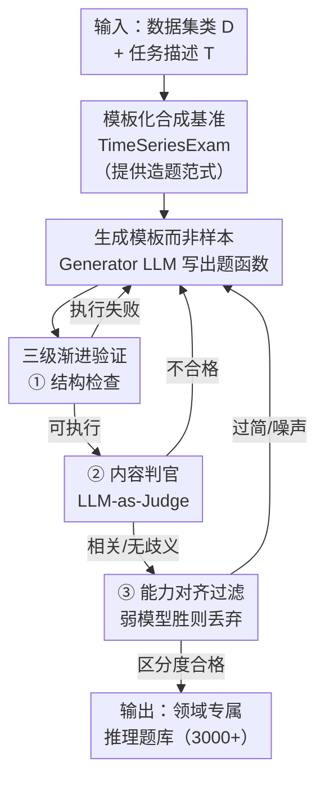

# TimeSeriesExamAgent: Creating Time Series Reasoning Benchmarks at Scale

**会议**: ICLR 2026  
**OpenReview**: [https://openreview.net/forum?id=DewXWSvQPH](https://openreview.net/forum?id=DewXWSvQPH)  
**代码**: https://github.com/magwiazda/TimeSeriesExamAgent  
**领域**: 时间序列 / 评测基准 / LLM推理 / Agent  
**关键词**: 时间序列推理、自动出题、多智能体、LLM-as-Judge、领域基准

## 一句话总结
本文提出一套"可扩展造题"方法：先用人工模板 + 合成时间序列搭出域无关的 TimeSeriesExam 选择题基准，再用多智能体框架 TimeSeriesExamAgent 把这套思路推广到任意真实数据集——让生成器 LLM 写"出题模板"（Python 函数）、再经三级验证过滤，最终自动生成与人工基准多样性相当的领域专属推理题；实验发现即便最强 VLM 在这些题上平均准确率也只有 51.5%。

## 研究背景与动机
**领域现状**：LLM/VLM 已经被广泛用于时间序列的预测、异常检测、分类等任务，并取得不错的成绩。于是一个根本问题浮出水面——这些模型到底是真的"理解"了时间序列背后的抽象概念（趋势、信噪、因果），还是只是靠领域捷径在蒙？为回答这个问题，社区陆续提出了一批时间序列推理评测基准。

**现有痛点**：现有基准几乎都是**人工策划**的，存在三个老毛病：(1) 构造昂贵、难以扩展；(2) 只覆盖很窄的领域或单一技能（如 ECG-QA、ECG-Expert-QA 只管心电图，EngineMT-QA 只管工业场景）；(3) 想给自己的新数据集造一套评测，需要领域专家逐题标注，而专家根本没时间。这让"想全面评测自己模型"的研究者陷入无米之炊。

**核心矛盾**：自动出题（用 LLM 直接生成问答对）看似是扩展性的解药，但**质量与多样性无法保证**——LLM 生成的题往往需要大量人工返修，反而抵消了自动化的好处；而且大多数现成的 agent 出题框架并非为时间序列设计，难以生成"条件于数值数据"的题目。**可扩展**和**高质量/领域贴合**之间存在矛盾。

**本文目标**：把问题拆成两步——先证明"模板化造题"在受控合成数据上可行（域无关、可控），再把这套范式自动推广到真实领域数据集，且只需专家提供极少输入。

**切入角度**：作者观察到，模板把"问题结构"和"具体实例"解耦了——只要有一小批设计良好的模板，就能通过变参数、换上下文自动批量生成多样题目。于是把"专家直接出题"这件难事，转化成"让 LLM 出模板、再机器化验证模板"，把人的工作量压到最低。

**核心 idea**：**用"生成模板 + 三级验证"代替"直接生成样本 + 人工返修"**——让生成器 LLM 写出可参数化采样的出题函数，再通过结构检查、内容判官、能力对齐过滤三道关卡筛掉坏模板，从而在任意数据集上规模化造出可靠的时间序列推理题。

## 方法详解

### 整体框架
全文有两个递进的产物。第一个是 **TimeSeriesExam**：一个人工策划、配置化的**合成**选择题基准，作为"概念验证"，用来证明模板化造题在受控环境下确实能批量生成多样、可控、能区分模型能力的题目，同时暴露出"LLM 在抽象时间序列推理上仍然很弱"这一现象。第二个是 **TimeSeriesExamAgent**：一个多智能体框架，把模板化范式从合成数据推广到**真实领域数据集**，由 Generation Agent 和 Verification Agent 协同迭代——生成器写出题模板，验证器三级把关，被拒模板带着反馈回炉，直到产出或被丢弃。

TimeSeriesExam 这一侧的机制是：用一个**合成时间序列生成器**，从基础模式池（周期/非周期/随机过程）里采样若干分量，用加法/乘法/序列三种组合方式拼成具有已知属性的时间序列；每道题对应一个**模板**（含问题、选项、ICL 示例、可选提示与术语定义），每个选项都挂一个"假设该选项为真"的合成生成器，从而批量产出"随机但答案精确"的题；再用 Item Response Theory (IRT) 迭代优化题目参数，最大化对候选模型的区分度。

TimeSeriesExamAgent 这一侧是一条"生成 → 验证 → 反馈回炉"的循环管线，框架如下：

### 关键设计

**1. 模板化合成基准 TimeSeriesExam：把"答案精确"焊死在生成过程里**

直接让 LLM 出时间序列推理题的最大风险是"题与答不自洽"——生成的曲线未必真有题目声称的属性。本文用一套**合成时间序列组合模型**从根上解决这点：基础模式分三类——非周期模式（线性、指数，用于加趋势）、周期模式（正弦、锯齿、方波，用于加周期）、随机过程（AR、MA 等，用于刻画自然时变）；再用三种组合算子拼装——加法（叠趋势+季节）、乘法（用趋势放大季节）、序列拼接（模拟相位/regime 切换），最后按模板需要注入白噪声/红噪声或异常（翻转、变速、截断等传感器失效）。

关键巧思在于**每个选项都绑定一个"假设该选项为真"的生成器**：例如题问"该序列是否平稳"，选项 (A) Yes 就挂一个随机平稳序列生成器，(B) No 挂一个非平稳生成器。这样"正确答案"和"被生成的数据"天然一致，可以**规模化产出随机但答案精确的题**。基准覆盖五大类推理——模式识别、噪声理解、相似性比较、异常检测、因果（Granger 因果），每类再细分子类（平稳性、regime 个数、信噪比、shape/分布比较等），共 100+ 个与时序专家共同校验的模板。生成后再用 **IRT** 做多轮精修，把题目参数优化到能最大化区分候选 LLM 的能力——这一步把"模板化能造可控题"和"题目有区分度"两件事都坐实了。

**2. 生成模板而非样本：让 Agent 输出"出题函数"以获得可扩展性与抗错性**

把 TimeSeriesExam 推广到真实数据集时，最自然的想法是让 LLM 直接对着数据出问答对，但这既不可扩展、又容易出人为错误。本文受 TimeSeriesExam 启发，让 **Generation Agent 生成模板而不是样本**——具体是让生成器 LLM 输出一个 Python 函数 `question(num_samples) -> List[QAPair]`，函数内部既定义问题与选项格式，又封装"在数据集里挑哪些记录、怎么算答案"的逻辑（通过用户提供的 `Dataset Handler` 的 `getDataframe()` / `query(id)` 等接口取数）。

这样设计的好处是：一个模板能参数化采样出任意数量实例（实验里每模板采 4–5 个），把"出一道题"的成本摊薄成"写一次逻辑"；而且生成器以**数据集结构 + 领域概念**为条件产出多样模板，覆盖面比逐题硬写更广。输入侧用户只需给两样东西——带最少加载代码的数据集类 D，和一段自然语言任务描述 T（可含出题指引、数据集背景等），专家投入被压到最低。

**3. 三级渐进验证：用结构、内容、能力三道关卡过滤坏模板**

LLM 生成经常产出错误或不相关的输出，所以 Verification Agent 设计了一条**多级过滤**链，任一级不过就带反馈回炉重生成；迭代有最大次数上限，超限则永久丢弃该模板，避免反复失败把上下文和成本撑爆。三级分别是：

① **结构检查（Structure check）**：先验证生成的模板能否成功执行（语法、输出格式），把"技术性失败"和"内容性失败"隔开，让后续判官只面对可运行的候选。② **内容验证（Content verification）**：用 **LLM-as-a-judge** 评估模板是否合格——问题是否相关、是否有歧义、是否真的需要看时间序列才能答。为缓解单模型偏置，本文借鉴 G-Eval（给概率化、可解释的打分）和 panel-based 评测（多模型组陪审团聚合，降低 intra-model bias）。③ **能力对齐过滤（Capability-Aligned Filtering）**：把候选模板发给一组能力高低不同的"考生 LLM"做题，依据教育学的**专家逆转效应（expertise reversal effect）**判断——如果**弱模型平均准确率反而高于强模型**，说明这题多半是有缺陷/有噪声而非真有区分度，永久丢弃；如果准确率随模型能力单调上升、或所有模型都很差（可能确有难度），则保留。这一步把 TimeSeriesExam 里的 IRT 思路下沉到了单模板粒度。

### 一个完整示例
以给 PTB-XL 心电图数据集造题为例：用户提供 PTB-XL 的数据集类（实现 `query(id)` 取第 i 条记录）和一句任务描述"生成评估心电推理的题"。Generator LLM 产出一个模板函数，比如问"该记录里存在哪种房室传导异常？(A)…(B)…(C)…(D)…"，函数内部规定"从数据集里挑符合条件的 ECG 记录、按标签算正确选项"。模板先过①结构检查——能否跑通、输出是否是合法 QAPair 列表；通过后进②内容判官——这题是否需要真看波形、选项是否有歧义；最后进③能力对齐过滤——让 gpt-4o、GPT-5 等强弱不一的模型试做，若发现弱模型反而答得更准则判定该模板有问题丢弃。通过三关的模板被采样 4–5 个实例并入题库，整个过程一道合格模板的 API 成本约 \$0.09，最终在五个真实数据集上攒出 3000+ 道题（PTB-XL 151、MIT-BIH 197、MIMIC-IV W 205、YFinance 209、WeatherBench2 95）。

## 实验关键数据

### 主实验：SOTA 模型在自动生成的题上集体翻车
在五个真实数据集（医疗 MIT-BIH / PTB-XL / MIMIC-IV Waveform、金融 YFinance、气象 WeatherBench2）上测六个 VLM，随机猜测基线为 0.25：

| 模型 | MIT-BIH | PTB-XL | MIMIC-IV W | YFinance | WeatherBench2 | 平均 |
|------|---------|--------|-----------|----------|---------------|------|
| random guess | 0.25 | 0.25 | 0.25 | 0.25 | 0.25 | 0.25 |
| gpt-4o | 0.416 | 0.424 | 0.385 | 0.586 | 0.389 | 0.440 |
| o3-mini | 0.442 | 0.477 | 0.356 | 0.555 | 0.379 | 0.442 |
| Qwen2.5-VL-Instruct | 0.411 | 0.490 | 0.439 | 0.572 | 0.368 | 0.456 |
| Gemma-3-27b-it | 0.497 | 0.517 | 0.370 | 0.534 | 0.232 | 0.430 |
| **GPT-5** | 0.533 | 0.450 | 0.424 | 0.617 | **0.547** | **0.515** |
| Gemini-2.5-Pro | 0.614 | 0.457 | 0.400 | 0.624 | 0.453 | 0.510 |

即便最强的 GPT-5 平均也只有 51.5%，所有模型平均准确率均低于 55%。GPT-5 在气象题上表现好、但在医疗题上明显更弱，说明通用推理能力**未必能跨域迁移**，尤其当任务需要领域专长和对生理信号的细粒度解读时。同时 GPT-5 在所有类别上都严格优于 GPT-4o，说明该基准能有效区分同家族模型的能力差异。

### 多样性与质量评测
**多样性**（随机抽 50 题算两两嵌入距离 / 归一化 Levenshtein 距离，越大越多样）：

| 基准 | 嵌入距离 | 归一化 Levenshtein |
|------|---------|-------------------|
| ECG-QA（人工） | 0.207 ± 0.079 | 0.519 ± 0.157 |
| TimeSeriesExamAgent（本文） | 0.301 ± 0.070 | 0.542 ± 0.039 |

**质量**（G-Eval 陪审团给 1–10 分，四维度）：

| 域 | 基准 | 专属性 | 无歧义 | 领域相关 | 可答性 |
|----|------|--------|--------|---------|--------|
| 金融 | TimeSeriesExamAgent | 8.29 | 7.24 | 8.89 | 8.57 |
| 医疗 | ECG-QA | 5.60 | 5.77 | 8.17 | 8.47 |
| 医疗 | TimeSeriesExamAgent | 8.43 | 8.40 | 9.00 | 9.10 |

本文自动生成的题在多样性上与人工 ECG-QA 相当甚至更高，质量四维度全面超过 ECG-QA（尤其专属性、可答性）。

### 微调迁移实验
用 TimeSeriesExamAgent 在 PTB-XL 上生成 2000 条训练样本微调 Qwen2.5-VL-3B-Instruct，在 ECG-QA 的 MIMIC-IV QA 测试集（12000 题，严格隔离数据来源）上测：

| 方法 | General | Parsable |
|------|---------|----------|
| 随机作答 | 34.9% | 34.9% |
| Base（未微调） | 21.8% | 34.6% |
| Fine-tuned-confounded（用金融/气象题训） | 39.7% | 42.3% |
| Fine-tuned（用 ECG 题训） | 47.0% | 49.7% |

用本文生成的同域 ECG 题微调后，准确率从 21.8% 升到 47.0%；而用其他域题微调（confounded，隔离掉"学到结构"的混淆因素）只到 39.7%，说明提升不只是学会答题格式，而是**确实学到了可迁移的推理技能**。

### 关键发现
- 迭代精修很高效：多数被接受的模板在 1–2 轮验证内通过；失败模板早丢，不会陷入不稳定的反馈死循环；一道合格模板约 \$0.09。
- 两类主要失败模式：**感知**（输入分辨率 DPI、文本 vs 视觉模态的选择会影响表现，最佳输入方式因题而异）和**组合推理**（模型不是栽在简单识别，而是栽在需要多步推理的题上）。
- 失败模式是**系统性而非随机**的，因而可诊断、可纠正。

## 亮点与洞察
- **"选项绑定生成器"是保证答案精确的核心 trick**：把"正确答案"直接编码进数据生成过程，让合成题天然自洽，避免了 LLM 直接出题"题答不一致"的通病——这个思路可迁移到任何需要可控合成数据的评测构造。
- **生成模板而非样本**：把"出 N 道题"摊薄成"写一个可参数化采样的函数"，既省成本又抗人为错误，是把出题任务规模化的关键抽象。
- **用"专家逆转效应"反向筛题**很巧妙：以"弱模型是否反超强模型"作为模板有缺陷的信号，把心理测量学/教育学的判别思想直接用作质量过滤器，比单纯靠 LLM 判官更稳。
- 把 IRT 从 TimeSeriesExam 的全局精修下沉到 TimeSeriesExamAgent 的单模板能力对齐过滤，体现了"同一套区分度思想在两个尺度复用"的设计连贯性。

## 局限与展望
- TimeSeriesExam 仅限**合成数据上的域无关技能**，无法直接评估真实领域的专门推理；这正是 Agent 版本要补的，但合成与真实之间仍有 gap。
- 验证高度依赖 **LLM-as-a-judge**，尽管用了 G-Eval + 多模型陪审团缓解偏置，判官本身的盲区/偏好仍可能漏放或误杀模板。
- 能力对齐过滤的判据"弱模型反超即丢弃"是启发式的——对"所有模型都差"的题选择保留，可能把真正坏题和真正难题混在一起，需要更细的区分。
- 迁移实验只在 ECG 单域、单一小模型（Qwen2.5-VL-3B）上验证，跨域、跨规模的可迁移性还需更多证据。
- 改进方向：作者指出在领域专属基准上要做好，可能需要带显式工具调用和结构化推理的多模态 agent 流水线，而非单纯堆大模型。

## 相关工作与启发
- **vs ECG-QA / ECG-Expert-QA / EngineMT-QA**：这些是人工/模板策划的单域基准，范围窄、扩展差；本文用 Agent 自动造题，多样性与质量反超 ECG-QA，且能套到任意数据集。
- **vs Time-MQA / Time-MMD**：它们规模大但靠 LLM 直接生成、缺乏充分验证，往往要重度人工返修；本文以"模板 + 三级验证"把质量控制做进管线。
- **vs 单步出题方案（如仅含时序但缺验证的近期工作）**：本文是多智能体、带渐进式过滤与反馈回炉的迭代设计，鲁棒性更强。
- **vs 通用 agent 造题框架（planning/generation/validation/evaluation 多 agent 流水线）**：那些大多不针对时间序列、难以"条件于数值数据"出题；本文专门解决时序的数值条件造题。

## 评分
- 新颖性: ⭐⭐⭐⭐ 把"模板化合成 + 生成模板而非样本 + 三级能力对齐验证"组合成时序自动造题管线，思路清晰且对症。
- 实验充分度: ⭐⭐⭐⭐ 覆盖 5 数据集 6 模型，并补了多样性、质量、微调迁移三类佐证，但迁移实验规模偏小。
- 写作质量: ⭐⭐⭐⭐ 两段式叙事（PoC → Agent）逻辑顺，图示清楚；部分细节散落附录。
- 价值: ⭐⭐⭐⭐ 给"想给自己数据集造时序推理评测"的研究者提供了低专家成本的可扩展工具，且揭示了当前 VLM 时序推理的真实短板。

<!-- RELATED:START -->

## 相关论文

- [\[ICLR 2026\] pyrregular: A Unified Framework for Irregular Time Series, with Classification Benchmarks](pyrregular_a_unified_framework_for_irregular_time_series_with_classification_ben.md)
- [\[ICLR 2026\] TimeOmni-1: Incentivizing Complex Reasoning with Time Series in Large Language Models](timeomni-1_incentivizing_complex_reasoning_with_time_series_in_large_language_mo.md)
- [\[ICLR 2026\] Reasoning on Time-Series for Financial Technical Analysis](reasoning_on_time-series_for_financial_technical_analysis.md)
- [\[ICLR 2026\] Time-Gated Multi-Scale Flow Matching for Time-Series Imputation](time-gated_multi-scale_flow_matching_for_time-series_imputation.md)
- [\[ICML 2026\] Adaptive Time Series Reasoning via Segment Selection](../../ICML2026/time_series/adaptive_time_series_reasoning_via_segment_selection.md)

<!-- RELATED:END -->
