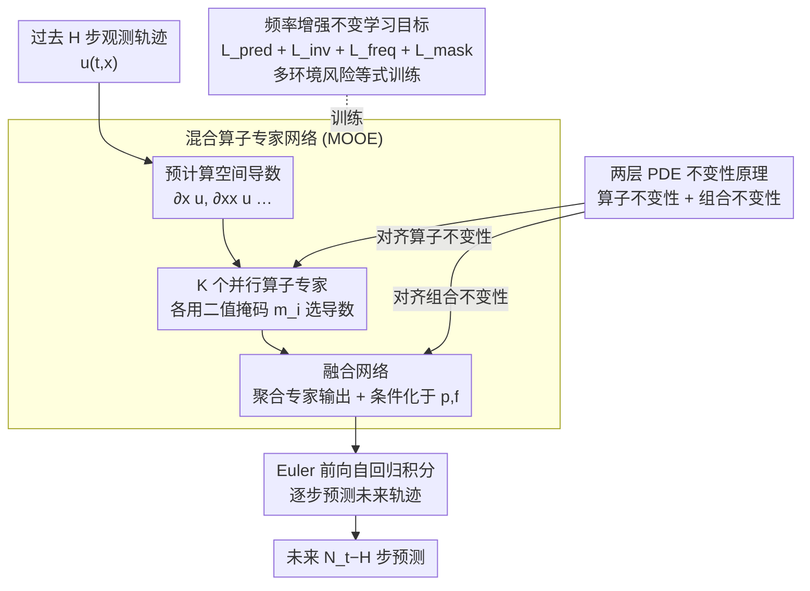

# Towards Generalizable PDE Dynamics Forecasting via Physics-Guided Invariant Learning

**会议**: ICLR 2026  
**arXiv**: [2509.24332](https://arxiv.org/abs/2509.24332)  
**代码**: [GitHub](https://github.com/LSY-Cython/iMOOE)  
**领域**: 时间序列 / PDE动力学预测  
**关键词**: PDE不变性学习, 零样本OOD泛化, 混合算子专家, 频率增强, 神经算子

## 一句话总结

提出 iMOOE 框架，通过显式定义 PDE 系统中的"算子不变性 + 组合不变性"两层物理不变性原理，设计与之对齐的混合算子专家网络和频率增强的风险等式目标，在不需要任何测试时适应的条件下实现多种 OOD 情景下的 SOTA 零样本 PDE 动力学预测。

## 研究背景与动机

**领域现状**：基于深度学习的 PDE 动力学预测在气象、电池设计、化学合成等领域广泛应用。神经算子 (Neural Operators) 如 FNO、DeepONet 等能从观测轨迹中学习未知 PDE 规律，但它们在 OOD 泛化上表现不佳。现有应对 OOD 的方法主要分三类：(1) 基于元学习的领域感知方法如 CoDA、GEPS，将网络参数分为领域不变和领域特定部分；(2) 参数条件化方法如 CAPE，将 PDE 参数编码进模型；(3) 大规模预训练方法如 DPOT，在多样 PDE 数据上预训练增强迁移性。

**现有痛点**：上述方法的零样本 OOD 泛化能力仍然不足。元学习方法需要测试时少样本适应才能正常工作，参数条件化方法依赖已知的参数范围，预训练方法需要大量多样数据。**根本原因**是它们都没有显式地揭示和利用 PDE 系统中的基本物理不变性原理。

**核心矛盾**：真实物理环境（如 PDE 系统参数）总是变化无常的，但传统方法只关注学习领域泛化的表示，而未触及 PDE 系统中真正不变的本质结构——算子及其组合关系。这导致即使在有限训练环境上表现良好，也无法推广到未见的 OOD 场景。

**本文目标**：在只有有限训练轨迹的条件下，如何实现零样本（不访问任何测试时数据）OOD 泛化的 PDE 动力学预测？具体需要解决两个子问题：(1) 如何定义 PDE 系统中的基本不变性原理？(2) 如何设计网络架构和训练目标来捕获这种不变性？

**切入角度**：作者从算子分裂法 (Operator Splitting) 获得灵感——复杂 PDE 可以分解为几个简单算子的组合。例如反应-扩散方程由拉普拉斯算子的扩散过程和非线性反应函数组成。无论系统参数如何变化，这些基本算子和它们的组合关系保持不变。结合不变学习理论 (IRM/REx)，通过等化不同训练域上的风险来发现不变相关性。

**核心 idea**：将 PDE 系统的物理对称性形式化为"算子不变性 + 组合不变性"两层原理，并通过与之对齐的混合算子专家架构和频率增强风险等式目标来捕获这种不变性，实现零样本 OOD 泛化。

## 方法详解

### 整体框架

iMOOE 的整体 pipeline：输入是过去 $H$ 步的观测轨迹 $\mathbf{I}^e = \{\mathbf{u}^e(t,\mathbf{x})\}_{t=0}^{H-1}$，输出是未来 $N_t - H$ 步的预测轨迹。整套方法先立起一个**两层 PDE 不变性原理**作为理论地基，再让网络结构和训练目标分别去对齐它：网络这边是**混合算子专家网络 (MOOE)**——一组并行的神经算子专家分别捕获不同物理过程（对齐算子不变性），外加一个融合网络聚合专家输出并条件化于物理参数（对齐组合不变性）；目标这边是**频率增强不变学习目标**——结合最大预测损失、风险等式损失和频率增强损失，从多训练域中估计 PDE 不变性。推理时采用自回归方式，用 Euler 前向法逐步积分，每步预测 $\hat{\mathbf{u}}_{t+1} = \int_t^{t+1} h(\{\sigma_i\}_{i=1}^K, \mathbf{p}, \mathbf{f}) dt + \mathbf{u}_t$。

### 关键设计

**1. 两层 PDE 不变性原理：指明 PDE 系统中到底什么跨域不变**

传统方法之所以零样本泛化不行，是因为它们学的是领域表示，没抓住 PDE 系统里真正不变的东西。作者把这件事拆成两层来形式化。第一层是**算子不变性**——PDE 动力学由一组空间算子 $\{\sigma_i(\mathbf{x}, \mathbf{u}, \partial_\mathbf{x}\mathbf{u}, \ldots)\}_{i=1}^K$ 的组合支配，每个基本算子对应一种物理过程（扩散、对流、反应），它们在不同域和系统演化中保持不变。第二层是**组合不变性**——算子与外部条件（物理参数 $\mathbf{p}$、强迫项 $\mathbf{f}$）的聚合方式 $F = h(\sigma_1, \ldots, \sigma_K, \mathbf{p}, \mathbf{f})$ 对于某个特定 PDE 系统是固定的。这个划分受经典算子分裂法启发（把复杂 PDE 分解为若干简单算子求解，如 Navier-Stokes 的分裂求解），作者进一步用结构因果模型 (SCM) 论证：无论初始条件、物理参数、强迫项怎么变，算子及其组合关系始终不变。这两层不变性就是后面架构和损失函数要对齐的目标。

**2. 混合算子专家网络 (MOOE)：用并行专家组+融合网络分别落地两层不变性**

有了不变性原理，网络结构就照着它搭。针对算子不变性，设计 $K$ 个并行的神经算子专家，每个专家 $\sigma_i = \text{NO}_i(\mathbf{x}, \mathbf{u}_{t-W+1:t}, \mathbf{m}_i \odot [\partial_\mathbf{x}\mathbf{u}_t, \partial_{\mathbf{xx}}\mathbf{u}_t, \ldots]^\mathbb{T})$，其中二值掩码 $\mathbf{m}_i \in \{0,1\}^S$ 让每个专家自适应地挑出对自己有用的空间导数。为了逼不同专家学不同物理过程、而非塌缩成同一个，加一项掩码多样性损失 $\mathcal{L}_{mask} = \frac{1}{K^2}\sum_{i,j}\exp(-\|\mathbf{m}_i - \mathbf{m}_j\|_2^2)$。针对组合不变性，融合网络负责聚合专家输出：强非线性 PDE 用一个额外网络学组合方式，加性关系则直接求和。和算子分裂法不同的是这里用并行而非串行结构，避免串行求解的计算瓶颈；而且每个专家可以换成任意现有神经算子（FNO/DeepONet/OFormer/VCNeF），所以整个框架是即插即用的。

**3. 频率增强不变学习目标：从有限训练域估出不变性，顺手治神经算子的频谱偏置**

架构对齐还不够，得靠损失函数真正把不变性从有限训练域里学出来。总损失

$$\mathcal{L}_{total} = \lambda_{pred}\mathcal{L}_{pred} + \lambda_{inv}\mathcal{L}_{inv} + \lambda_{freq}\mathcal{L}_{freq} + \lambda_{mask}\mathcal{L}_{mask}$$

由四项构成，前三项各管一件事。最大预测损失 $\mathcal{L}_{pred}$ 管充分性，是自回归预测误差的跨域平均；风险等式损失 $\mathcal{L}_{inv} = \text{Var}(\{\mathcal{R}_{pred}^e\}_{e \in \mathcal{E}_{tr}})$ 管不变性，让不同训练域的风险方差最小，这一步借的是 IRM/REx 的不变学习思想；频率增强损失 $\mathcal{L}_{freq}$ 则用波数加权 $\|\xi\|_2^2$ 放大高频模式的监督。最后这项是因为神经算子天生偏好低频，若只用空间域损失会忽略高频信息，而在自回归预测里高频误差会一步步传播到整个频谱域、严重拖垮 OOD 泛化。值得一提的是，这里的环境划分不只按物理参数，还按自回归步数划分——因为输入分布 $p(\mathbf{I}^e)$ 本身随时间步漂移，这一点对流体动力学预测尤其关键。

### 损失函数 / 训练策略

总训练损失为 $\mathcal{L}_{total} = \lambda_{pred}\mathcal{L}_{pred} + \lambda_{inv}\mathcal{L}_{inv} + \lambda_{freq}\mathcal{L}_{freq} + \lambda_{mask}\mathcal{L}_{mask}$，其中 $\lambda_{pred}=1, \lambda_{freq}=0.1, \lambda_{mask}=0.001$。$\lambda_{inv}$ 采用线性调度策略（上限 $0.001$），保留初始阶段仅用预测损失的经验风险最小化阶段来学习丰富的预测表示。训练 500 epochs，Adam 优化器，初始学习率 $0.001$，A100 GPU，$K=2$ 个专家，FNO (4层, 宽度64) 作为默认 backbone。

## 实验关键数据

### 主实验：五个 PDE 系统零样本 OOD 泛化（nMSE）

| PDE 系统 | CoDA | CAPE | DPOT | VCNeF | GEPS | **iMOOE** | 提升 |
|----------|------|------|------|-------|------|-----------|------|
| DR (OOD) | 6.05e-1 | 7.16e-2 | 5.67e-2 | 7.84e-2 | 7.94e-2 | **4.23e-2** | ↓25% vs DPOT |
| NS (OOD) | 9.14e-1 | 3.56e-1 | 5.08e-1 | 3.81e-1 | 4.13e-1 | **3.12e-1** | ↓12% vs CAPE |
| BG (OOD) | 9.22e-1 | 3.04e-2 | 8.41e-2 | 4.68e-2 | 7.56e-2 | **1.08e-2** | ↓64% vs CAPE |
| SW (OOD) | n.a. | 6.18e-5 | 4.85e-4 | 6.12e-4 | 2.76e-4 | **3.02e-5** | ↓51% vs CAPE |
| HC (OOD) | 2.37e+0 | 3.65e+0 | 2.12e+0 | 1.42e+0 | 1.35e+0 | **1.22e+0** | ↓10% vs GEPS |

平均 OOD 提升：nMSE 40.21%，fRMSE 30.78%。

### 消融/兼容性实验：不同神经算子 + iMOOE（DR-OOD 平均 nMSE）

| 算子 Backbone | Naive | +MOOE | +iMOOE | 提升 |
|--------------|-------|-------|--------|------|
| FNO | 7.94e-2 | 5.16e-2 | **4.23e-2** | ↓47% |
| DeepONet | 6.15e-1 | 6.10e-1 | **5.49e-1** | ↓11% |
| VCNeF | 7.84e-2 | 5.73e-2 | **5.52e-2** | ↓30% |
| OFormer | 5.75e-2 | 4.96e-2 | **4.34e-2** | ↓25% |

### 关键发现

- **iMOOE 的提升是普适的**：无论底层神经算子是什么类型（傅里叶/分支-主干/神经场/Transformer），都能一致降低 OOD 误差的均值和方差，验证了 PDE 不变性学习的通用价值
- **频率增强至关重要**：从 +MOOE 到 +iMOOE（加上频率增强训练）带来显著额外提升，说明单纯的架构对齐不够，必须在目标函数层面解决频谱偏置
- **专家数量 $K$ 的敏感性**：$K=3$ 最优，$K=1$ 不足以捕获算子不变性，$K=4$ 开始冗余（真实 PDE 只有少量组合算子），且计算开销线性增长
- **真实数据也有效**：在 SST（海表温度）和 SSE（海表高程）两个真实海洋动力学数据集上，iMOOE 同样取得最低均值和方差，表明方法能捕捉真实世界中带噪声的物理规律
- **时间外推性能突出**：在训练 $[0, N_t]$、测试 $[0, 2N_t]$ 的时间外推场景下，iMOOE 的 nMSE 平均提升 32.51%，说明学到的算子不变性在更长时间跨度上也保持有效

## 亮点与洞察

- **物理不变性的形式化**：将 PDE 系统的算子分裂性质提升为机器学习可用的不变性原理，是连接物理 PDE 理论和 OOD 泛化理论的精巧桥梁。这比简单地将参数编码进网络（如 CAPE）或分割网络参数空间（如 CoDA）更接近问题本质
- **掩码多样性驱动专家特化**：通过可学习的二值掩码让不同专家选择不同阶导数作为输入，这比传统 MoE 中的 router 更具物理可解释性——对流项自然需要一阶导 $\partial_\mathbf{x}\mathbf{u}$，扩散项需要二阶导 $\partial_{\mathbf{xx}}\mathbf{u}$
- **频率加权的 OOD 正则化**：用 $\|\xi\|_2^2$ 加权频域损失来弥补神经算子的频谱偏置，思路简洁但效果显著。这种频率增强策略可迁移到任何基于神经算子的时空预测任务
- **环境按自回归步划分**：在自回归预测中，不同步数的输入分布 $p(\mathbf{I}^e)$ 本身就在漂移，因此按步数划分环境来施加风险等式约束，是一个非常贴切且新颖的做法

## 局限与展望

- **仅验证了有限多样性的 PDE 系统**：5 个模拟系统 + 2 个真实数据集，尚未验证对不规则网格、非周期边界条件、高维 PDE（3D+）的适用性
- **专家数和 PDE 算子数的对应关系**：论文固定 $K=2$（默认）或 $K=3$（最优），但不同 PDE 系统的实际算子数不同，缺乏自动确定 $K$ 的机制
- **物理参数需要已知编码**：融合网络要求将 $\mathbf{p}$ 和 $\mathbf{f}$ 作为输入，但在实际场景中物理参数不一定可观测。SST 实验中用全1向量代替，但效果是否稳定有待验证
- **计算开销随专家数线性增长**：$K$ 个并行神经算子的内存和时间开销较大，在资源有限场景下是瓶颈。若能引入稀疏激活的真 MoE 路由机制可能更高效
- **不变性假设对混沌系统的适用性**：对于强混沌 PDE（如高雷诺数湍流），算子不变性假设是否仍然成立值得深入研究

## 相关工作与启发

- **vs CoDA/GEPS (元学习)**：将网络参数分为领域不变/特定两部分，需要测试时少样本适应。iMOOE 则从 PDE 物理结构出发定义不变性，完全零样本，且 OOD 性能大幅领先
- **vs CAPE (参数条件化)**：直接将PDE参数注入通道注意力模块。iMOOE 额外引入算子分裂结构和不变学习目标，在大多数场景上优于 CAPE，特别是 BG 和 SW 系统上提升显著（分别 64% 和 51%）
- **vs DPOT (预训练)**：Transformer 架构 + 去噪预训练。iMOOE 不需要大规模多样数据预训练，仅在有限训练环境上就能实现更好的 OOD 泛化，说明物理结构先验比数据量更重要
- **vs REx/IRM (不变学习)**：经典不变学习方法在视觉/图任务上验证，本文首次将其扩展到 PDE 动力学预测，关键贡献是定义了 PDE 特有的两层不变性原理并设计了对齐的网络架构

## 评分

- 新颖性: ⭐⭐⭐⭐ 首次形式化 PDE 系统的两层物理不变性原理并将其与不变学习理论结合，idea 清晰有深度
- 实验充分度: ⭐⭐⭐⭐⭐ 5个模拟系统+2个真实数据集，4种神经算子兼容性验证，多种OOD场景覆盖全面
- 写作质量: ⭐⭐⭐⭐ 理论-方法-实验的衔接流畅，公式推导清晰，SCM图辅助理解
- 价值: ⭐⭐⭐⭐ 为神经算子的 OOD 泛化提供了通用即插即用框架，物理先验+不变学习的结合范式有广泛参考价值

<!-- RELATED:START -->

## 相关论文

- [\[ICML 2025\] A Generalizable Physics-Enhanced State Space Model for Long-Term Dynamics Forecasting in Complex Environments](../../ICML2025/time_series/a_generalizable_physics-enhanced_state_space_model_for_long-term_dynamics_foreca.md)
- [\[ICLR 2026\] Enabling Arbitrary Inference in Spatio-Temporal Dynamic Systems: A Physics-Inspired Perspective](enabling_arbitrary_inference_in_spatio-temporal_dynamic_systems_a_physics-inspir.md)
- [\[ICLR 2026\] CPiRi: Channel Permutation-Invariant Relational Interaction for Multivariate Time Series Forecasting](cpiri_channel_permutation-invariant_relational_interaction_for_multivariate_time_se.md)
- [\[ICLR 2026\] Repurposing Foundation Model for Generalizable Medical Time Series Classification](repurposing_foundation_model_for_generalizable_medical_time_series_classificatio.md)
- [\[ICLR 2026\] Panda: A Pretrained Forecast Model for Chaotic Dynamics](panda_a_pretrained_forecast_model_for_chaotic_dynamics.md)

<!-- RELATED:END -->
