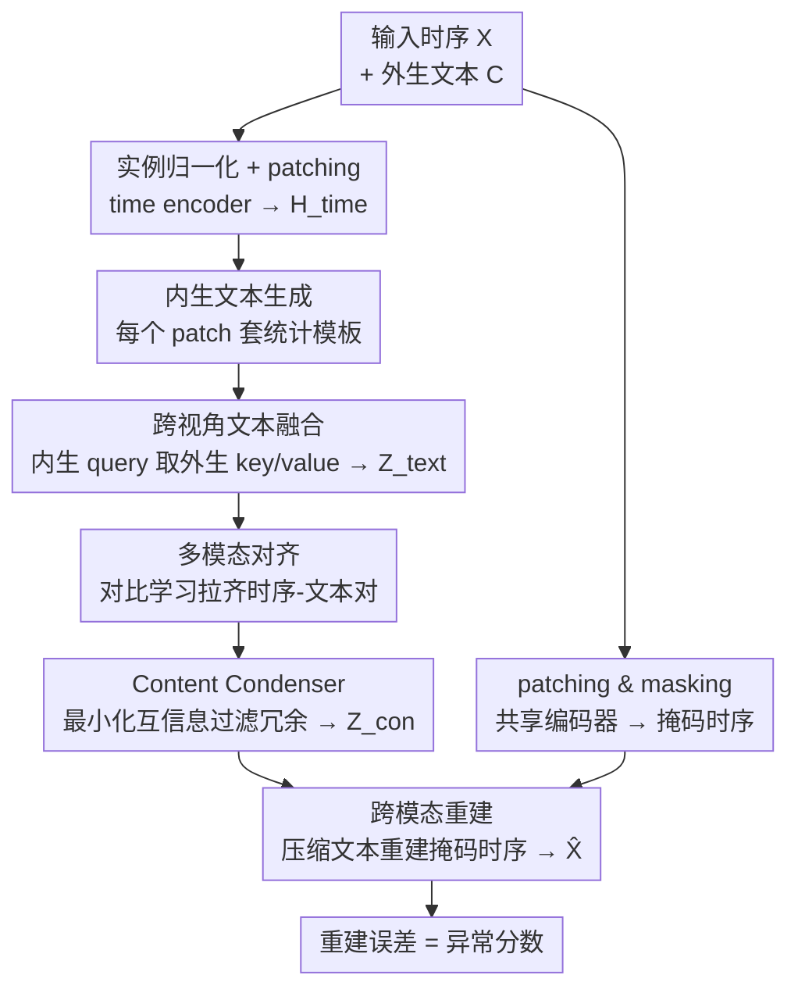

# Towards Multimodal Time Series Anomaly Detection with Semantic Alignment and Condensed Interaction

**会议**: ICLR 2026  
**OpenReview**: [https://openreview.net/forum?id=fNFbGqu6Rg](https://openreview.net/forum?id=fNFbGqu6Rg)  
**代码**: https://github.com/decisionintelligence/MindTS  
**领域**: 时间序列 / 多模态 / 异常检测  
**关键词**: 时间序列异常检测, 多模态对齐, 对比学习, 信息瓶颈, 内生/外生文本

## 一句话总结
MindTS 把时间序列异常检测从单模态数值数据推进到「时序 + 文本」多模态：先用跨视角融合把内生文本（从序列本身生成的统计描述）和外生文本（外部背景知识）对齐到时序表示，再用基于信息瓶颈的 content condenser 过滤冗余文本、并用压缩后的文本去重建被掩码的时序，从而在 6 个真实多模态数据集上全面超过 17 个单模态/多模态基线。

## 研究背景与动机

**领域现状**：时间序列异常检测（healthcare、金融反欺诈、网络入侵等）长期被单模态数值方法主导——重建式（Anomaly Transformer、DADA）、预测式（GDN）、对比式（DCdetector）都只盯着数值序列本身，把异常定义为「重建误差大」或「与其他点相关性弱」。

**现有痛点**：现实数据往往天然多模态，文本模态尤其廉价且信息丰富（金融专家会结合交易数据 + 政策报告判断市场异常）。但把文本接进时序有两条不通的路：(1) **LLM 生成内生文本**——直接让 LLM 把序列翻译成自然语言，天然对齐但语义贫瘠，只能描述序列内部的统计模式，引不进外部知识；(2) **检索外生文本**——从网络抓背景知识，信息丰富但来源零散，和具体时间片段语义弱相关，硬靠时间步同步「对齐」其实没对上。

**核心矛盾**：内生文本「对得齐但没料」、外生文本「有料但对不齐」，二者是互补而非互斥；而且无论哪种文本都掺杂大量冗余/无关描述，现有多模态方法（Time-MMD、LLM-Mixer）做直接融合，默认「所有文本都有用」，冗余内容会稀释真正有判别力的信息。NLP 里的随机掩码/改写过滤又不看文本和时序的相关性，可能把高价值文本掩掉、留下低价值文本。

**本文目标**：分解为两个子问题——(1) 如何在异构多模态间做**语义一致**的对齐；(2) 如何**过滤冗余文本**以增强跨模态交互。

**切入角度**：把文本拆成「外生视图」和「内生视图」两路互补信号，用跨视角注意力让外生背景知识被「锚定」到具体时间片段上，再用信息瓶颈原理压掉冗余、只保留对重建时序有用的文本。

**核心 idea**：用「内生 query 去取外生 key/value」的跨视角融合实现细粒度时序-文本对齐，再用「最小化互信息 + 跨模态重建」的 content condenser 把对齐后的文本压成精华，去重建被掩码的时序——重建误差即异常分数。

## 方法详解

### 整体框架

MindTS 解决的是「时序 X + 外生文本 C → 逐时刻异常标签」的多模态异常检测。整条管线可以看成两大块串联：前半段把异构的时序和文本对齐到统一表示空间（Fine-grained Time-text Semantic Alignment），后半段把对齐后的文本压缩去冗、再拿压缩文本反过来重建被掩码的时序（Content Condenser Reconstruction）。最终用「原始时序与重建时序的均方误差」作为异常分数——异常点更难被跨模态线索重建出来，误差自然偏大。

具体地，输入时序先经 instance norm 做实例归一化和通道独立处理，再 patching 后用 time encoder 得到 patch 表示 $H_{time}\in\mathbb{R}^{N\times d}$；同时对每个 patch 用预设模板生成内生文本 $O$，并对 $X$ 做 patching & masking 经共享权重 time encoder 得到掩码时序表示 $\tilde H_{time}$。内生文本 $O$ 和外生文本 $C$ 各自经 text encoder 编码，进入跨视角融合得到融合文本 $Z_{text}$，再经多模态对齐层与 $H_{time}$ 做对比对齐。随后 content condenser 把 $Z_{text}$ 过滤成压缩文本 $Z_{con}$，最后用 $Z_{con}$ 和 $\tilde H_{time}$ 做跨模态重建输出 $\hat X$。

### 关键设计

**1. 内生文本生成：把单模态序列翻成「时间局部」的统计描述，避免语义漂移**

直接让 LLM 把整段时序翻成一句话会有语义漂移和输出不确定性，而且一个全局 prompt 抓不住序列的动态变化。MindTS 改成对**每个 patch** 套统一模板（均值、极值、趋势等），生成 patch 级的内生文本 $o_i$，再用开源 LLM 当 text encoder 编码成时间局部的文本表示 $H^O_{text}\in\mathbb{R}^{N\times d}$。这样内生文本天然和对应时间片段对齐，既规避了单条全局 prompt 的局限，又匹配了时序的动态性——它的角色是「对得齐」的那一路。

**2. 跨视角文本融合 + 对比对齐：让外生背景知识被锚定到具体时间片段**

外生文本有料但零散、对不齐时间步，内生文本对得齐但只有内部统计。MindTS 用跨视角注意力把两路捏到一起：以**内生文本 $H^O_{text}$ 作 query、外生文本 $H^C_{text}$ 作 key/value**，让模型从外生背景里选择性地抽取与当前 patch 最相关的信息，融合成 $Z_{text}$：

$$\hat Z_{text} = \mathrm{LayerNorm}\big(H^O_{text} + \mathrm{CrossAttn}(H^O_{text}, H^C_{text}, H^C_{text})\big),\quad Z_{text} = \mathrm{LayerNorm}\big(\hat Z_{text} + \mathrm{FFN}(\hat Z_{text})\big)$$

外生文本被当成所有 patch 共享的背景（编码为 $H^C_{text}\in\mathbb{R}^{1\times d}$），保证不会因单个 patch 视野太窄而丢掉上下文。融合后再用**对比学习**显式对齐：时序-文本相似度矩阵 $K_{TT}\in\mathbb{R}^{N\times N}$ 中对角线（同一时间片段的时序与文本）为正样本，其余为负样本，对称 InfoNCE 损失

$$L_{MA} = -\frac{1}{2N}\Big(\sum_j \log\frac{\exp(k(h^j_{time}, z^j_{text})/\tau)}{\sum_g \exp(k(h^j_{time}, z^g_{text})/\tau)} + \sum_g \log\frac{\exp(k(h^g_{time}, z^g_{text})/\tau)}{\sum_j \exp(k(h^j_{time}, z^g_{text})/\tau)}\Big)$$

把正对拉近、负对推远。相比传统的 add/concat 直接拼接，对比对齐才真正建立了连续时序与离散文本之间的语义一致映射。

**3. Content Condenser：用信息瓶颈最小化互信息，把文本压成「够重建时序」的精华**

文本即使对齐了仍掺冗余，直接融合会稀释判别信号；NLP 的随机掩码又不看文本与时序的相关性。MindTS 借**信息瓶颈（IB）**思想，目标是在保留重建时序所需信息的前提下，最小化对齐文本 $Z_{text}$ 与压缩文本 $Z_{con}$ 的互信息：

$$Z^*_{con} = \arg\min_{P(Z_{con}|Z_{text})} I(Z_{text}; Z_{con}) + R(\hat X, Z_{con})$$

实现上用 MLP 对 $Z_{text}$ 算出概率矩阵 $\Psi=[\psi_i]$，再按 $F\sim\mathrm{Bernoulli}(\Psi)$ 采样二值掩码，$Z_{con}=Z_{text}\odot F$，用 straight-through estimator 让梯度可回传。互信息无法直接算，论文给出可优化上界 $I(Z_{text};Z_{con})\le \mathbb{E}_{Z_{text}}[\mathrm{KL}(P(Z_{con}|Z_{text})\,\|\,G(Z_{con}))]$，其中先验 $G(Z_{con})\sim\prod_i\mathrm{Bernoulli}(\mu)$ 由超参 $\mu\in(0,1)$ 控制压缩强度，落到损失：

$$L_{CC} = \sum_i \psi_i\log\frac{\psi_i}{\mu} + (1-\psi_i)\log\frac{1-\psi_i}{1-\mu}$$

为避免相邻 patch 的掩码跳变导致重建不稳定，再加一项平滑损失 $L_{SM}=\frac{1}{N}\sum_i \phi_i$（$\phi_i=\sqrt{(\psi_{i+1}-\psi_i)^2}$），condenser 总损失 $L_{CL}=L_{CC}+L_{SM}$。调 $\mu$ 即可调节去冗强度，这是和「随机过滤」最本质的区别——它按「对重建时序是否有用」来选文本，而非随机。

**4. 跨模态重建：用压缩文本重建被掩码的时序，强迫模型抓深层跨模态依赖**

如果直接用完整时序 + 压缩文本去重建，时序自身信息太充足，模型会偷懒、学不到真正的跨模态依赖。MindTS 故意把任务做难：先对 $X$ 做 patching & masking 得到掩码时序 $\tilde X$、经共享权重编码器得 $\tilde H_{time}$，再让压缩文本 $Z_{con}$ 去补全被掩盖的部分：

$$\hat X = \mathrm{Projection}(U_{TT}),\quad U_{TT} = \mathrm{FFN}\big(\tilde H_{time} + \mathrm{CrossAttn}(\tilde H_{time}, Z'_{con}, Z'_{con})\big)$$

其中 $Z'_{con}=\mathrm{MSA}(Z_{con},Z_{con},Z_{con})$ 是文本自注意力。重建损失 $L_{Rec}=\|X-\hat X\|_F^2$。掩码逼着模型只能依赖压缩文本里的跨模态线索来填空，从而既强化了模态交互，又反过来要求压缩文本保留足够多与时序相关的信息。推理时直接用原始时序与重建输出的 MSE 当异常分数。

### 损失函数 / 训练策略

总损失由三部分组成：多模态对齐损失、condenser 损失、跨模态重建损失，简单相加联合优化：

$$L = L_{MA} + L_{CL} + L_{Rec}$$

推理阶段，当前时刻的异常分数 = 该时刻输入 $X$ 与重建输出 $\hat X$ 的均方误差。关键超参：patch size $p$ 通常设 6，时序掩码比例 $m$ 在 ~50% 附近最佳，压缩强度 $\mu\in(0.1,0.9)$ 都稳。

## 实验关键数据

### 主实验

6 个真实多模态数据集（Weather、Energy、Environment、KR、EWJ、MDT），每个都含数值时序 + 对应外生文本。评测指标用标签型 Affiliated-F1（Aff-F）和分数型 VUS-PR（V-PR）、VUS-ROC（V-ROC）。对比 17 个基线（LLM 类、预训练类、深度学习类、非学习类）。

| 数据集 | 指标 | MindTS | 次优基线 | 提升 |
|--------|------|--------|----------|------|
| Weather | Aff-F | **82.66** | 81.06 (G4TS) | +1.6 |
| Weather | V-PR | **57.48** | 55.03 (LODA) | +2.45 |
| Energy | V-ROC | **74.44** | 65.05 (Modern) | +9.4 |
| KR | Aff-F | **90.28** | 89.55 (Timer) | +0.7 |
| MDT | V-PR | **65.44** | 52.18 (Modern) | +13.3 |
| MDT | Aff-F | **89.19** | 80.81 (G4TS/Modern) | +8.4 |

MindTS 在全部 6 个数据集、3 个指标上都拿到 SOTA。论文还把 11 个表现好的近期方法用多模态框架 MM-TSFLib（线性插值时序模型输出 + 词袋文本嵌入）扩成多模态版（Table 2，带 ∗），即便基线也吃上了文本，MindTS 仍在所有数据集上最优或最具竞争力，说明优势来自细粒度对齐 + 去冗，而非单纯「多用了文本」。

### 消融实验

在 MDT 和 Energy 上做了 6 组消融（数值来自论文柱状图 Figure 3，为定性区间）：

| 配置 | 效果 | 说明 |
|------|------|------|
| Full (Ours) | 最优 | 完整模型 |
| (a) w/o 外生文本 | 明显下降 | 丢掉外部背景知识 |
| (b) w/o 内生文本 | 明显下降 | 丢掉时间局部统计描述 |
| (c) w/o 时序-文本对齐 | 下降 | 模态对齐对可靠检测至关重要 |
| (d) w/o content condenser | **显著下降** | 冗余文本反噬最严重 |
| (e) w/o 跨模态重建 | 下降 | 模态交互/判别特征提取受损 |
| (f) 对齐与压缩顺序对调 | 下降 | 先压后对齐会过早丢掉有用的时序相关信息 |

### 关键发现
- **content condenser 去掉掉点最多**（配置 d），印证「冗余文本会稀释判别信号」是多模态时序异常检测的核心瓶颈，过滤机制比单纯多加文本更关键。
- **顺序很重要**（配置 f）：必须先对齐再压缩。先压会在文本还没和时序对齐时就把潜在有用信息掐掉，属于「过早剪枝」。
- **超参鲁棒**：压缩强度 $\mu$ 在 0.1~0.9 全程都保持高性能，说明 condenser 在「保语义」和「去冗余」间能自适应平衡；patch size 先升后降、约 6 最佳（太小内存开销大）；掩码比例 ~50% 最佳，太高则重建过难掉点。

## 亮点与洞察
- **「内生 query 取外生 key/value」是点睛之笔**：用对得齐的内生文本去主动检索对不齐的外生背景，等于让背景知识被时间片段「锚定」，一举把两类文本「有料 vs 对齐」的矛盾化解掉，比硬靠时间步同步聪明得多。
- **把信息瓶颈落到「Bernoulli 掩码 + KL 到先验」很实用**：用可调先验 $\mu$ 控制压缩度，加一项平滑正则防相邻 patch 跳变，给「按相关性过滤文本」提供了一个可微、可控的范式，可迁移到其他多模态去冗场景。
- **「故意掩码时序、逼文本来填空」是巧妙的自监督代理任务**：把跨模态交互从「锦上添花」变成「雪中送炭」，强迫压缩文本携带时序判别信息，同时天然产出重建误差作异常分数，对齐了训练目标和推理目标。

## 局限与展望
- 作者明确把范围限定在时序 + 文本两模态，不处理图像/视频，未声称是通用多模态框架。
- 方法强依赖外生文本的可得性与质量——6 个数据集都自带对应文本，但很多真实场景文本稀缺或噪声大时表现如何未充分验证。
- 消融的关键数值来自柱状图而非精确表格，去各模块的掉点幅度只能定性判断；内生文本依赖 LLM 生成统计描述，prompt 模板设计与 LLM 选择的敏感性讨论较少。
- 推理仍用单一重建 MSE 当异常分数，对「重建得好但其实异常」的对抗性异常可能不敏感，可结合预测/对比多视角分数互补。

## 相关工作与启发
- **vs DCdetector / Anomaly Transformer（单模态对比/重建）**：它们只在数值序列内部找「相关性弱/重建误差大」的点，MindTS 引入文本模态补充语义背景；优势是复杂真实场景更鲁棒，代价是需要配套外生文本。
- **vs Time-MMD / LLM-Mixer（直接融合多模态）**：它们默认所有文本都有用、靠时间步硬对齐或直接拼接，MindTS 用跨视角融合做语义对齐 + IB 去冗，解决了「对不齐」和「冗余稀释」两个它们忽略的问题。
- **vs NLP 随机掩码/改写过滤**：那类方法不看文本与时序相关性，可能误删高价值文本；MindTS 的 condenser 按「是否有助重建时序」来选，是任务感知的过滤。

## 评分
- 新颖性: ⭐⭐⭐⭐⭐ 首次把内生/外生文本拆视图融合 + 信息瓶颈去冗引入多模态时序异常检测，两个矛盾各有针对性解法
- 实验充分度: ⭐⭐⭐⭐ 6 数据集 × 17 基线 × 3 主指标 + 6 组消融 + 超参分析，扎实；但消融数值仅给柱状图、缺精确表
- 写作质量: ⭐⭐⭐⭐ 动机层层递进、图示清晰，公式完整；个别符号（如 $Z'_{con}$ 自注意力）需对照原文
- 价值: ⭐⭐⭐⭐ 把异常检测推向多模态、且证明「去冗 > 多加文本」，对工业时序监控有实用启发

<!-- RELATED:START -->

## 相关论文

- [\[ICLR 2026\] ICDiffAD: Implicit Conditioning Diffusion Model for Time Series Anomaly Detection](icdiffad_implicit_conditioning_diffusion_model_for_time_series_anomaly_detection.md)
- [\[ICML 2026\] AnomSeer: Reinforcing Multimodal LLMs to Reason for Time-Series Anomaly Detection](../../ICML2026/time_series/anomseer_reinforcing_multimodal_llms_to_reason_for_time-series_anomaly_detection.md)
- [\[ICLR 2026\] Point-wise Anomaly Detection via Fold-bifurcation ODE](point-wise_anomaly_detection_via_fold-bifurcation_ode.md)
- [\[ICLR 2026\] Enhancing Sparse Event Detection in Healthcare Time-Series via Adaptive Gate of Context–Detail Interaction](enhancing_sparse_event_detection_in_healthcare_time-series_via_adaptive_gate_of_.md)
- [\[ICLR 2026\] When Foundation Models Are One-Liners: Limitations and Future Directions for Time Series Anomaly Detection](when_foundation_models_are_one-liners_limitations_and_future_directions_for_time.md)

<!-- RELATED:END -->
