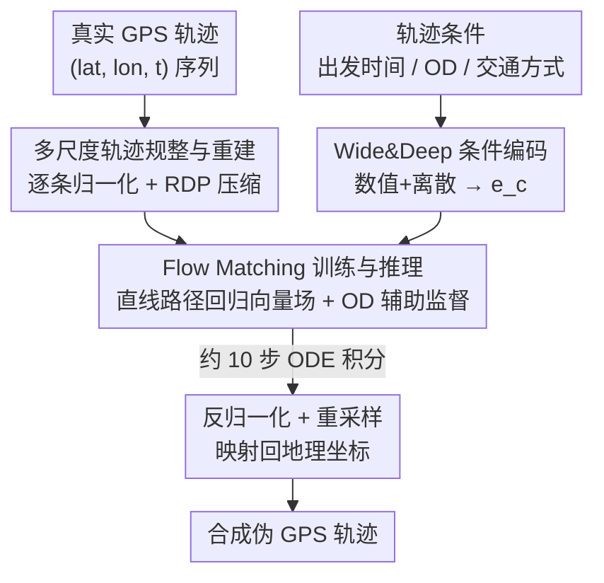

# TrajFlow: Nationwide Pseudo GPS Trajectory Generation with Flow Matching Models

**会议**: ICLR 2026  
**OpenReview**: [https://openreview.net/forum?id=BDOldEjwCE](https://openreview.net/forum?id=BDOldEjwCE)  
**代码**: https://github.com/ZeroCSIS/TrajFlow  
**领域**: 时序 / 时空数据 / 轨迹生成 / 流匹配生成模型  
**关键词**: 伪 GPS 轨迹生成、Flow Matching、多尺度、轨迹规整、OD 条件

## 一句话总结
TrajFlow 把 Flow Matching 首次引入 GPS 轨迹生成，配合「逐条轨迹规整 + RDP 压缩 + OD 条件归一化」策略，用约 10 步 ODE 积分就在城市、都市圈、全国三种空间尺度上稳定生成伪 GPS 轨迹，在覆盖全日本数百万条真实轨迹的数据上全面超过扩散和其他深度生成基线，尤其在全国尺度优势明显。

## 研究背景与动机
**领域现状**：手机 GPS 轨迹数据在城市研究、疫情防控、交通规划里都很关键，但真实数据受隐私、可获取性、采集成本的限制难以共享，于是「生成与真实分布相近的伪 GPS 轨迹」成了热门方向。近两年扩散模型（以 DiffTraj 为代表）在城市尺度的出租车轨迹生成上拿到了很高的保真度。

**现有痛点**：作者指出 SOTA 方法有三个绕不开的缺口。其一是**多尺度能力差**：现有模型基本只在城市尺度有效，一旦把范围从街区扩展到都市圈乃至全国，多项指标会急剧退化（论文 Fig. 2a 显示 DiffTraj 随尺度上升精度断崖式下跌）。其二是**交通方式单一**：现有方法大多只在出租车轨迹上训练，无法覆盖火车、汽车、自行车、步行等真实出行方式。其三是**效率与鲁棒性**：扩散框架依赖逐步去噪，即便用 DDIM 加速仍需多步迭代、计算昂贵。

**核心矛盾**：作者把多尺度失败归因到扩散范式本身的两个机制缺陷。一是**信噪比（SNR）失衡**——当地理范围扩大时，细粒度局部轨迹在整体里占比极小、信号微弱，逆向去噪过程要从高噪声里重建精细结构，而 MSE 目标只看绝对误差、进一步放大了尺度间的不平衡。二是**固定幅度加噪**——扩散前向过程不管轨迹是微观短途还是宏观长途都注入近乎相同幅度的噪声，这种「尺度无关加噪」与跨数量级的数据范围根本不匹配。

**本文目标 / 切入角度**：与其在扩散框架里修补，不如换一套生成范式。Flow Matching 直接沿预设的条件概率路径回归目标向量场，绕开了固定步长的去噪链，训练更稳、采样更省步；同时再用数据侧的「规整—重建」显式补偿尺度失衡。

**核心 idea**：用 Flow Matching 取代扩散去噪，并在其之上叠加逐条轨迹归一化 + RDP 压缩 + OD 条件预测，把可扩展性、多样性、效率统一在一个框架里解决。

## 方法详解

### 整体框架
TrajFlow 的输入是一组「轨迹条件」（出发时间、区域级 OD、交通方式），输出是一条符合条件的合成 GPS 轨迹。整条管线可以拆成三段：先把原始轨迹做**规整与重建**（逐条归一化到统一有界坐标空间 + RDP 几何压缩），把杂乱、跨数量级的原始坐标变成稳定、紧凑的表示；再用 **Wide&Deep 条件编码**把数值特征和离散上下文融合成条件向量 $e_c$，注入到参数化向量场的骨干网络里；最后在这个规整空间里用 **Flow Matching 训练 / 推理**——训练时回归直线路径上的目标向量场，推理时从高斯噪声出发对学到的 ODE 做积分，再反归一化映射回真实地理坐标。

### 关键设计

**1. Flow Matching 取代扩散去噪：用确定性向量场避开尺度失配**

这是全文的范式级创新，直接针对扩散「固定幅度加噪」与「长去噪链误差累积」两个痛点。Flow Matching 学习一个时间相关的向量场 $v_\theta(x,t)$，把简单先验 $p_0$（标准高斯）连续搬运到真实轨迹分布 $p_1$，生成时只需解常微分方程 $\frac{dx_t}{dt}=v_\theta(x_t,t)$。作者采用最简单的条件流匹配（CFM）形式——直线路径，目标向量场就是 $u_t(x\mid x_1)=x_1-x_0$，训练目标是一个干净的回归损失：

$$\mathcal{L}_{FM}=\mathbb{E}_{t,\,p(x_1),\,p(x_0)}\Big[\big\|v_\theta\big((1-t)x_0+tx_1,\,t\big)-(x_1-x_0)\big\|^2\Big]$$

其中 $t\sim\mathcal{U}[0,1]$。相比扩散需要在每个噪声水平上做加权 ELBO 优化，CFM 每个样本只采一个时间步、直接回归向量场，训练更稳；推理时用 ODE 求解器、约 10 步就能积出轨迹，而 DDPM 即便到 300 步仍达不到 TrajFlow 的精度。关键在于：扩散的固定幅度加噪在「微观短途 vs 宏观长途」混合的多尺度场景里会造成根本性失配，而流匹配学的是确定性传输场，不沿长链累积误差，因此跨异质区域更鲁棒。

**2. 多尺度轨迹规整与重建：把跨数量级坐标压成稳定紧凑表示**

针对 SNR 失衡，作者不让模型直接面对跨数量级的原始 GPS 坐标，而是**逐条轨迹单独归一化**，把所有点重缩放到一个共享的有界坐标空间；模型在这个归一化空间里预测区域 OD 内的精细 OD 位置和途经点，生成完再反归一化回真实地理坐标。这样既防止微小的局部位移被大尺度变化淹没，又稳定了优化时的梯度幅度、加快收敛。

在归一化之上还叠了一步**轨迹特征变换（几何压缩）**：递归地剔除那些落在相邻点连线 $\epsilon$ 容差内的冗余点，把长直段压成少数代表点、保留转弯和高曲率处，从而把轨迹长度从 $L$ 降到远小于 $L$ 的 $D$，降低计算开销、提升训练稳定性。作者比较了多种规整方法，发现经典的 Ramer–Douglas–Peucker（RDP）算法在压缩率和保真度之间取得最好平衡。整套策略可以类比特征预处理里的「归一化—反归一化」：先压成紧凑表示便于高效训练，部署时再展开回原尺度。

**3. Wide&Deep 条件编码 + OD 精细预测：把出行语境注入向量场并锚定起讫点**

轨迹生成是条件生成，需要把「什么时间、从哪到哪、用什么交通方式」喂给模型。作者沿用 Wide&Deep 模块编码条件：数值特征 $Z_n$（平均速度、平均点间距、耗时、累计距离/步数等标准化标量）经线性投影得到 $e_{wide}$；离散特征 $Z_d$（一天中的出发时间、交通方式、区域级 OD）先各自嵌入、拼接后过两层带非线性的 MLP 得到 $e_{deep}$；二者融合为

$$e_c=\text{LayerNorm}(e_{wide}+e_{deep})$$

连续流时间 $t$ 经正弦/傅里叶映射加小 MLP 得到时间向量 $e_t$，与 $e_c$ 合成统一控制信号 $\tilde{e}=e_c+e_t$，再以可学习的加性偏置广播注入向量场骨干的每个 block：$h^{(\ell)}\leftarrow f^{(\ell)}(h^{(\ell)}+A^{(\ell)}\tilde{e})$，保持条件通路轻量、与 ODE 参数化一致。此外训练时还引入一个**对精细 OD 位置的辅助监督损失**，让模型预测条件 OD 区域内的起讫点坐标，增强空间与语义感知——消融显示这个 OD 头在大尺度上对形状保真和稳定性贡献明显。

### 损失函数 / 训练策略
训练时，真实轨迹先用 RDP 规整、再 padding 到统一长度并带有效性 mask；对每条轨迹算出数值/离散条件、过 Wide&Deep 得到 $e_c$，采样流时间 $t$ 和噪声端点 $x_0$，按式 $(1)$ 构造直线路径点 $x_t$ 及目标向量场。总损失 = 有效 token 上的 masked 回归损失（流匹配主目标）+ 精细 OD 位置的辅助监督损失，可选叠加平滑性与有界支撑正则项。推理时给定条件算出 $e_c$，从高斯噪声初始化 $x_0$，在 $[0,1]$ 上数值积分学到的流 ODE（每步注入 $e_c$），末态 $x_1$ 再做均匀重采样、反归一化映射回地理坐标、按长度先验裁剪/插值，得到最终轨迹。

## 实验关键数据

### 主实验
数据集为 2023 年全日本 Blogwatcher 手机 GPS 数据集（数百万条轨迹，含匿名 ID、经纬度、时间戳、交通方式）。基线为扩散代表 DiffTraj、深度生成代表 TrajVAE、对抗代表 TrajGAN。评估分两层：聚合级用空间密度的 Jensen–Shannon 散度（density JS）衡量人口级地理分布；轨迹级用 DTW 和连续 Fréchet 距离（Fr）衡量轨迹相似度，报告中位数与 P10/P90。下表为各尺度中位数指标（越低越好，单位 km）：

| 尺度 | 方法 | Density JS ↓ | DTW_med ↓ | Fr_med ↓ |
|------|------|------|------|------|
| 中心东京（城市） | TrajFlow | 0.0674 | 20.350 | 0.304 |
| 中心东京 | TrajFlow-w/o RDP&OD | **0.0323** | **8.179** | **0.184** |
| 中心东京 | DiffTraj | 0.1340 | 44.321 | 0.651 |
| 东京都市圈 | TrajFlow | 0.1239 | 18.167 | 0.335 |
| 东京都市圈 | TrajFlow-w/o RDP&OD | **0.0800** | **14.416** | 0.303 |
| 东京都市圈 | DiffTraj | 0.2918 | 88.559 | 1.220 |
| 全日本（全国） | TrajFlow | **0.2270** | **10.977** | **0.192** |
| 全日本 | DiffTraj | 0.6727 | 451.042 | 5.329 |
| 全日本 | TrajVAE | 0.5228 | 135.377 | 2.216 |

可以看到：城市尺度上最佳配置是 TrajFlow-w/o RDP&OD（仍属流匹配家族），说明小范围、相对同质时直接生成原始坐标已够用、RDP 规整非必需；到都市圈，最佳指标开始向带 OD/RDP 的配置迁移；到全国尺度，完整 TrajFlow 优势变得显著（DTW_med=10.977、Fr_med=0.192、density JS 最低），而扩散和其他基线中位数和长尾都急剧变大。TrajFlow 家族是唯一在所有尺度都能同时兼顾形状保真、稳定性（IQR/P90）和空间分布的一类方法。

### 消融实验

| 配置 | 变化 | 说明 |
|------|------|------|
| Full TrajFlow | — | 完整模型，全国尺度最稳 |
| w/o-FM | 流匹配换回 DDPM 去噪 | 随步数单调微增但始终逊于流匹配，证实 FM 是保真与稳定的主驱动 |
| w/o-RDP | 去掉 RDP 规整 | 保留微抖动和冗余点，Fr/DTW 中位数及尾部升高，全日本 split 上 density JS 也变差 |
| w/o-OD | 去掉精细 OD 预测头 | 小区域有时降低 density JS，但 DTW/Fr 和离散度一致变差，全国尺度形状与密度都退化 |
| w/o-RDP&OD | 同时去掉两者 | 退化最严重，凸显二者在全国尺度的关键作用 |

### 关键发现
- **Flow Matching 是性能主因**：w/o-FM 把 CFM 换成 DDPM 后，即便用大步数预算也始终打不过流匹配，验证了范式切换才是多尺度保真度和稳定性的根本来源。
- **效率优势悬殊**：TrajFlow 训练每样本只需单个时间步、推理约 10 步 ODE 积分；DDPM 对去噪步数高度敏感，最佳折中约在 200 步、300 步仅边际提升却成本大增，且 300 步仍达不到 TrajFlow 的精度。
- **尺度越大优势越大**：小范围内 DDPM 的 SNR 问题不严重、差距有限；一旦全国尺度把城市/都市圈/全国模式混在一起，扩散的尺度失配就拖垮各尺度表现，而流匹配能更好化解。
- **交通方式多样性**：在东京按四种代表性交通方式比较生成与真实的人均出行距离分布，生成数据能匹配各模式的特征轮廓，说明 TrajFlow 不只抓空间保真、也保住了交通方式多样性。

## 亮点与洞察
- **把生成范式换掉而非修补**：面对扩散的多尺度失败，作者没有在去噪链里加 trick，而是直接换成 Flow Matching，用确定性传输场绕开固定幅度加噪和长链误差累积——这是一个干净利落的「换框架解决根因」思路。
- **数据侧规整与模型侧范式互补**：RDP 压缩 + 逐条归一化负责把跨数量级坐标抹平 SNR 失衡，流匹配负责高效稳定的概率传输，两者一个治数据、一个治机制，组合起来才在全国尺度站稳。
- **「按需启用组件」的尺度自适应观察很有价值**：城市尺度反而是 w/o RDP&OD 最好、全国尺度才需要全套组件，这提示轨迹生成里的归一化/重建并非越多越好，可迁移到其他多尺度时空生成任务里做「按尺度选配」。

## 局限与展望
- **不建模个体偏好**：受隐私和数据访问限制，作者不使用任何用户属性（年龄、性别、家—工作标识）或持久化伪 ID，因此模型无法捕捉个体出行偏好，只生成群体级一致的轨迹。
- **数据集为私有、单国**：实验基于私有的全日本 Blogwatcher 数据，跨国/跨数据源的泛化未验证；交通方式多样性也只在东京、四种代表性模式上展示。
- **改进方向**：作者计划把 TrajFlow 从 GPS 轨迹生成扩展到更广义的人类移动建模；此外 RDP 容差 $\epsilon$、OD 区域粒度、ODE 步数预算这些超参对不同尺度的最优取值如何自适应，也值得进一步研究。

## 相关工作与启发
- **vs DiffTraj（扩散）**：DiffTraj 在城市出租车轨迹上保真度高，但依赖固定幅度加噪和多步去噪，扩展到都市圈/全国时 SNR 失衡、尺度失配导致精度断崖下跌；TrajFlow 用流匹配的确定性传输场 + 数据规整，在保持城市尺度竞争力的同时把全国尺度的 DTW/Fr/density JS 全面拉低一个量级，且步数少得多。
- **vs TrajVAE / TrajGAN（深度生成 / 对抗）**：VAE/GAN 类方法捕捉潜在移动表示，但在大尺度异质轨迹上中位数和长尾都明显更大、稳定性差；TrajFlow 在三尺度上都更稳。
- **vs 扩散加速（DDIM 等）**：DDIM 虽能加速采样仍需迭代去噪、本质未脱离去噪链；TrajFlow 直接回归向量场，约 10 步 ODE 即可，效率与稳定性同时受益。

## 评分
- 新颖性: ⭐⭐⭐⭐⭐ 首个把 Flow Matching 用于 GPS 轨迹生成、且首个做到全国多尺度的生成模型。
- 实验充分度: ⭐⭐⭐⭐ 覆盖三尺度、四基线、完整消融与效率分析；但数据集单一私有、缺跨国验证。
- 写作质量: ⭐⭐⭐⭐ 动机—机制—消融逻辑清晰，扩散失败的两因分析到位。
- 价值: ⭐⭐⭐⭐⭐ 隐私友好的全国级伪轨迹生成对城市规划、交通管理、灾害响应有直接应用价值。

<!-- RELATED:START -->

## 相关论文

- [\[ICLR 2026\] Time-Gated Multi-Scale Flow Matching for Time-Series Imputation](time-gated_multi-scale_flow_matching_for_time-series_imputation.md)
- [\[ICML 2026\] Spatiotemporal Imputation with Graph-Informed Flow Matching](../../ICML2026/time_series/spatiotemporal_imputation_with_graph-informed_flow_matching.md)
- [\[ICLR 2026\] Latent-to-Data Cascaded Diffusion Models for Unconditional Time Series Generation](latent-to-data_cascaded_diffusion_models_for_unconditional_time_series_generatio.md)
- [\[ICLR 2026\] A Unified Federated Framework for Trajectory Data Preparation via LLMs](a_unified_federated_framework_for_trajectory_data_preparation_via_llms.md)
- [\[ICLR 2026\] TRIDENT: Cross-Domain Trajectory Spatio-Temporal Representation via Distance-Preserving Triplet Learning](trident_cross-domain_trajectory_spatio-temporal_representation_via_distance-pres.md)

<!-- RELATED:END -->
