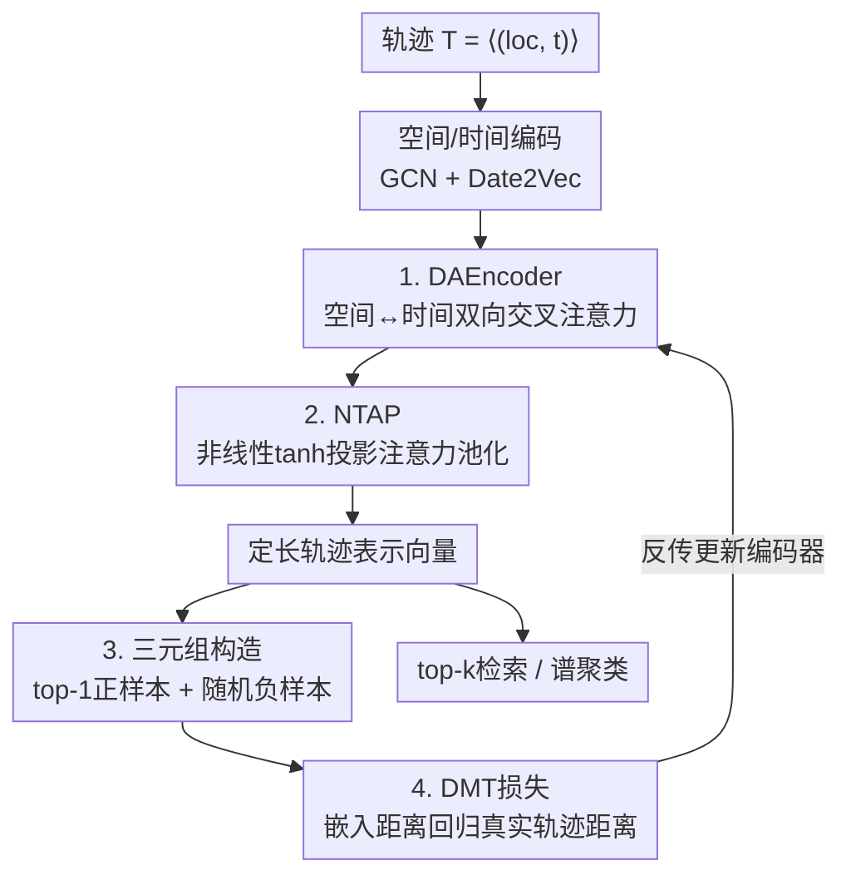

# TRIDENT: Cross-Domain Trajectory Spatio-Temporal Representation via Distance-Preserving Triplet Learning

**会议**: ICLR 2026  
**OpenReview**: [https://openreview.net/forum?id=gOk3o4lMRD](https://openreview.net/forum?id=gOk3o4lMRD)  
**领域**: 时空序列 / 轨迹表示学习 / 自监督度量学习  
**关键词**: 轨迹相似度, 时空表示, 三元组学习, 距离保持, 跨域泛化

## 一句话总结
TRIDENT 用一套统一架构（GCN 空间嵌入 + Date2Vec 时间嵌入 + 双向交叉注意力编码器 + 非线性 tanh 投影池化）同时建模连续 GPS 轨迹和离散羽毛球落点轨迹，并提出"距离保持的多核三元组损失"让嵌入空间距离对齐原始轨迹空间距离，从而在检索精度、训练效率和跨域泛化上全面超越强基线。

## 研究背景与动机

**领域现状**：轨迹聚类与相似度检索是时空数据挖掘的核心任务，主流做法分两类——手工距离（EDR、Hausdorff、TP 等）直接在原始坐标上算相似度；深度方法（NeuTraj、ST2Vec、TrajCL 等）从数据中学习任务相关的轨迹表示，再在嵌入空间做最近邻检索。

**现有痛点**：现有方法几乎都假设轨迹是平滑、连续、密集采样的运动（典型就是出租车 GPS 轨迹），因此在三件事上栽跟头。其一，泛化差——换一个采样率、长度或运动风格的数据集就要重新设计距离和模型组件；其二，时空融合弱——点级方法只看局部空间依赖，形状级方法只看全局轮廓，很难同时兼顾，更别说把"时序顺序"和"空间序列结构"一起编码；其三，对噪声脆弱——GPS 在城市峡谷里漂移、采样不规则、视频标注因标记点位置（左/右脚、前掌/脚跟）产生标注者间差异，这些都会扭曲轨迹及其导出特征。

**核心矛盾**：离散的事件驱动轨迹（如羽毛球：按击球索引逐拍记录、击球后回中、回合式时序结构）和连续的 GPS 轨迹遵循完全不同的运动机制，二者的时空动态根本不重叠。但现有 SOTA 都偏向连续平滑轨迹，在羽毛球数据上几乎失效（HR@10 普遍只有 0.01~0.08）。同时，经典对比/三元组损失只约束相对排序（正样本比负样本近），不约束距离的绝对大小，容易把局部邻域压塌或把远距离夸大，造成维度坍缩、几何失真。

**本文目标**：用**一套统一架构 + 一个统一损失**，既能学连续运动轨迹也能学离散动作序列轨迹，同时保持原始时空几何、并去掉对超参（margin、温度、正负比、难负样本挖掘）的敏感依赖。

**切入角度**：作者把出租车轨迹（低弯曲度、连续）和羽毛球轨迹（高弯曲度、离散）当作轨迹谱系的两个极端，认为只要架构能同时吃下这两端，中间形态（篮球、足球）自然涵盖。关键观察是：度量学习的几何失真来自损失只管排序不管距离量级，于是把"排序损失"换成"距离回归"。

**核心 idea**：用"距离保持的三元组学习"代替"只排序的三元组学习"——让嵌入空间里锚点-正/负样本的距离直接回归到原始轨迹空间的真实距离，并用多核高斯加权在多个尺度上平衡局部邻域与全局结构。

## 方法详解

### 整体框架
TRIDENT 要解决的是"一套模型吃下连续 + 离散两类轨迹并保持时空几何"。整条管线分两条线协同：**表示线**把一条轨迹 $T=\langle s_1,\dots,s_n\rangle$（每个 $s_i=(loc_i,t_i)$）先拆成空间嵌入（GCN，把坐标投到网格顶点上做图卷积）和时间嵌入（Date2Vec），再喂进**双向交叉注意力编码器 DAEncoder** 让空间与时间互相 attend，最后用 **NTAP 非线性池化**把变长序列压成定长向量；**训练线**用相似度量 TP 自监督地为每个锚点构造三元组，再用 **DMT 损失**把嵌入距离回归到真实轨迹距离。学好的嵌入直接用于 top-k 检索和谱聚类（羽毛球战术分析）。

### 关键设计

**1. DAEncoder：让空间与时间双向交叉注意力，而不是简单拼接或门控**

现有方法要么只编码空间、偶尔加点时间属性，要么用 average pooling/线性注意力把两路特征草草混合，结果丢掉了跨段依赖和频域结构。DAEncoder 采用 post-schedule 的两路并行经典交叉注意力：在每一层里，空间嵌入先 attend 到时间嵌入，然后时间嵌入再 attend 到刚更新过的空间嵌入，两个方向用各自独立的参数。变长与缺失步通过为每路表示各自学习一个 CLS token、根据真实长度生成 padding mask、并在位置编码后把 padding 位置清零来处理。作者刻意**不用门控、也不做相加融合**，而是把两路的池化结果直接拼接，让空间和时间信息等权贡献——这样既保留各自的语义，又能扩展到新的属性分支或多主体轨迹。

**2. NTAP：用非线性 tanh 投影 + 可学习上下文向量做注意力池化，专治离散事件结构**

羽毛球这类离散轨迹有个特点：球员频繁回中，导致轨迹被切成一段段碎片，普通 average pooling 或线性注意力会漏掉跨段依赖。传统的 masked attention pooling 只用单个线性投影算注意力分数，表达力不够。NTAP 在算分数之前先加一层非线性变换：每个特征向量先经可学习矩阵投影再过 tanh，$u_i=\tanh(W_\omega^\top z_i)$，捕捉特征维度间的高阶非线性交互——它既能保留连续轨迹的平滑曲线，又能凸显离散轨迹里的急转弯和高曲率事件点。然后用一个可学习的上下文向量 $u_\omega$ 决定"从什么视角总结这条序列"，配合 mask 处理变长（padding 位置打 $-\infty$），经 softmax 得到权重 $\alpha_i=\mathrm{softmax}(u_\omega^\top u_i+\mathrm{mask}_i)$，最后加权求和 $r=\sum_i \alpha_i z_i$。这样事件触发点和回中点会被自动加权放大，让离散运动轨迹的表示质量能逼近连续 GPS 轨迹。

**3. 无超参三元组构造：top-1 正样本 + 随机负样本**

经典三元组/对比损失高度依赖 margin、温度、正负样本比例、难负样本挖掘等敏感超参，调起来不稳定还会扭曲几何。TRIDENT 借助相似度量 TP 自监督地构造三元组：对每个锚点轨迹，取与它最相似的那一条作为正样本（捕捉最强的局部结构关系，避免用多正样本造成过度平滑），负样本则从"既不是锚点也不是其 top-1 正样本"的轨迹里**随机抽取**。这套"top-1 正 + 随机负"背后有两层动机：局部身份由最近邻定义，互为 top-1 的关系本身就是强约束，无需人为压缩距离；全局几何则靠随机负样本带来的多样性来学，用户完全不必指定负正比。整套构造不含任何要调的超参。

**4. DMT 损失：把嵌入距离回归到真实轨迹距离，并用多核高斯在多尺度上加权**

这是全文的核心。经典三元组损失（哪怕带 margin）只强制相对顺序 $d'_{ap}<d'_{an}$，不约束距离量级，于是常把局部邻域压塌、或把远距离夸大，损害检索精度和跨域泛化。DMT 把损失从"排序"改成"距离对齐"：记嵌入空间的锚-正、锚-负距离为 $d'_{ap}=\|A'-P'\|_2$、$d'_{an}=\|A'-N'\|_2$，真实轨迹空间的对应距离为 $d_{ap},d_{an}$，目标就是最小化二者的平方误差 $E^2=(d'-d)^2$。但直接用原始平方误差会被大距离偏差主导，控不住局部邻域。于是作者引入**多核高斯重加权**：用 batch 内真实距离的中位数作为基础带宽 $\sigma_\mathrm{base}=\mathrm{median}(d)$，乘上固定倍率 $m=[0.5,1.0,2.0]$ 得到 $\kappa$ 个尺度的 $\sigma$，每个核给出权重

$$W=\exp\!\left(-\frac{d^2}{2\sigma^2+\epsilon}\right)\in\mathbb{R}^{2b\times\kappa}.$$

小 $\sigma_k$ 强调小距离（局部邻域）的精确匹配，大 $\sigma_k$ 把注意力摊到大距离（全局结构）。每个尺度的损失做归一化 $\ell_k=\frac{\mathbf{1}^\top(W\odot E^2)_{:,k}}{\mathbf{1}^\top W_{:,k}+\epsilon}$，让每个核只惩罚对自己距离区间有意义的偏差，最终对 $\kappa$ 个尺度取平均 $L_\mathrm{dmt}=\frac{1}{\kappa}\sum_k \ell_k$。这就同时避免了小尺度核被大距离淹没、大尺度核被微小局部扰动牵着走，训练更稳，也是作者声称"首次在训练中把原始数据特征的几何保持到嵌入空间"的关键。

### 损失函数 / 训练策略
最终训练目标即 DMT 损失 $L_\mathrm{dmt}$，无 margin、无温度、无难负样本挖掘。相似度学习目标选用 TP（Trajectory Pattern）距离作为构造三元组与回归的"真值距离"，理由是 TP 对序列顺序依赖较弱、同时兼顾空间与时间维度、且天然适配最近邻匹配。多核倍率固定为 $[0.5,1.0,2.0]$，带宽由 batch 中位数自适应，因此几乎是零超参设计。

## 实验关键数据

### 主实验
三个公开数据集（Badminton、T-Drive、Rome），每个切 10,000 训练 / 4,000 验证 / 其余测试，统一用 HR@10、HR@50、R10@50 三指标。

| 数据集 | 指标 | TRIDENT | 最强基线 | 说明 |
|--------|------|---------|----------|------|
| Badminton | HR@10 | **0.190** | 0.084 (TrajCL) | 离散轨迹，提升最大 |
| Badminton | R10@50 | **0.484** | 0.212 (ST2Vec) | 翻倍以上 |
| T-Drive | HR@10 | **0.564** | 0.496 (ST2Vec) | 连续 GPS |
| T-Drive | R10@50 | **0.916** | 0.844 (ST2Vec) | — |
| Rome | HR@10 | **0.535** | 0.479 (ST2Vec) | 跨城连续 GPS |
| Rome | R10@50 | **0.913** | 0.830 (ST2Vec) | — |

三指标平均后，TRIDENT 在 Badminton / T-Drive / Rome 上分别超过所有基线均值 271% / 96% / 127%。效率方面，相比 SOTA 在 Badminton 和 T-Drive 上训练总时长分别减少 34.8% 和 72.4%，平均查询时延低 8.3%。

### 消融实验

| 配置 | T-Drive HR@10 | 说明 |
|------|---------------|------|
| DMT + DAEncoder (Full) | **0.5643** | 完整模型 |
| DMT + Transformer | 0.5038 | 容量过高、小数据上收敛不稳 |
| DMT + BiLSTM | 0.5168 | 不足以建模复杂时空模式 |
| DMT + GRU | 0.4044 | 欠拟合最明显 |
| Pairwise Logistic CL + DAE | 0.5481 | 换损失，掉点 |
| Siamese Contrastive + DAE | 0.2201 | 对比损失大幅崩坏 |
| RBF-Triplet + DAE | 0.5094 | 普通核三元组不如 DMT |

| 池化方式 | Badminton HR@10 | T-Drive HR@10 |
|----------|-----------------|---------------|
| None | 0.1477 | 0.5540 |
| Std-AP（标准注意力池化）| 0.1444 | 0.5506 |
| **NTAP** | **0.1978** | **0.5643** |

### 关键发现
- **DMT 损失贡献最大**：把损失从 DMT 换成 Siamese Contrastive，T-Drive HR@10 从 0.5643 暴跌到 0.2201；换成 RBF-Triplet 也掉到 0.5094。说明"距离保持"比单纯排序关键得多。
- **NTAP 在离散轨迹上增益尤其明显**：Badminton 上 NTAP（0.1978）相比 Std-AP（0.1444）和无池化（0.1477）提升约 34%，而在平滑的 T-Drive 上提升较小——正好印证它是为离散事件结构设计的。
- **编码器需匹配数据规模**：Transformer 容量过高在小数据上不稳，BiLSTM/GRU 又欠拟合，DAEncoder 训练动态最稳。
- **跨域迁移仍有竞争力**：T-Drive↔Rome 互测（不含羽毛球，因运动机制完全不同），TRIDENT 约保留 31% 原性能且仍超基线（ST2Vec 跨城几乎归零，HR@10=0.0019）；性能下降主要源于城市间 GPS 分布、路网拓扑、交通规则的内在差异。
- **数据多样性鲁棒**：训练数据削减到 50% 时 T-Drive HR@10 仅从 0.5643 微降到 0.5195。

## 亮点与洞察
- **把"度量学习"从排序改成距离回归**：这是最"啊哈"的一点——别人都在调 margin 让正负样本拉开，TRIDENT 直接让嵌入距离去拟合真实距离，几何不失真，还顺带去掉了一大堆超参。这个思路可迁移到任何需要保持原始空间几何的检索/聚类任务（如分子、用户行为序列）。
- **多核高斯重加权解决"尺度不公平"**：用 batch 中位数自适应带宽 + 固定倍率，让局部邻域和全局结构在同一个损失里各管各的区间，是个轻巧又通用的 trick。
- **统一架构吃两类极端轨迹**：用连续（出租车）和离散（羽毛球）作为谱系两端来验证泛化，论证逻辑干净；NTAP 的 tanh 非线性投影专门照顾离散事件点，是架构层面的针对性设计。
- **下游战术分析有实用价值**：用学到的嵌入做谱聚类（k=6），挖出羽毛球"网前-挑球-杀球循环"这类可解释战术，形成"发现-验证"闭环，比直接对原始坐标聚类更能同时捕捉时序与空间。

## 局限与展望
- **跨城/跨任务迁移仍掉点明显**：T-Drive↔Rome 只保留约 31% 性能，羽毛球与 GPS 间因运动机制不重叠根本无法迁移；作者归因于数据内在差异而非模型，但这也意味着"统一架构"更多是"同架构分别训练"而非真正的一模型通吃。
- **真值依赖 TP 距离**：三元组构造和距离回归都以 TP 作为真值距离，整套表示质量被 TP 本身的优劣绑定；若 TP 在某类轨迹上不准，DMT 会忠实地把这种偏差也学进去。
- **评测主要限于单打羽毛球与出租车**：作者也承认未来才会扩到行人轨迹、双打回合、篮球等；离散轨迹仅羽毛球单打一类，泛化结论仍待更多离散场景验证。
- **绝对检索精度仍偏低**：Badminton HR@10 仅 0.190，虽远超基线但离实用还远，说明离散高弯曲度轨迹本身极难。

## 相关工作与启发
- **vs ST2Vec / TrajCL（对比学习路线）**：它们靠对比正负采样，在 Badminton 这类快速变化轨迹上反而比平滑数据更适应，但缺少锚点约束——TrajCL 的损失没有三元组结构来锚定"谁最近、谁最远"，t-SNE 上会把轨迹混成一团；TRIDENT 用 top-1 正样本作锚 + 距离回归，聚类边界明显更清晰，且在连续数据上锚点尤其关键（无锚的 CL 在 T-Drive/Rome 上相对 ST2Vec 差约 54%）。
- **vs NeuTraj / ConDTC**：这些方法在离散羽毛球数据上几乎失效（HR@10 仅 0.009），暴露了"只为连续平滑轨迹设计"的通病；TRIDENT 用 NTAP 的非线性池化专门补上离散事件结构这一块。
- **vs 经典手工距离（EDR / Hausdorff / TP）**：手工距离在局部空间细节与全局形状之间二选一、且换数据集就失效；TRIDENT 把 TP 当作真值监督信号蒸馏进可学习嵌入，既保留 TP 的时空兼顾特性，又获得深度表示的泛化与检索效率。

## 评分
- 新颖性: ⭐⭐⭐⭐ 把三元组从排序改成多核距离回归、并号称首次在训练中保持原始特征几何到嵌入空间，思路确实新颖。
- 实验充分度: ⭐⭐⭐⭐ 三数据集 + 损失/编码器/池化多组消融 + 跨域迁移 + 数据削减 + 战术案例，覆盖较全，但离散轨迹仅羽毛球一类。
- 写作质量: ⭐⭐⭐ 公式和框架交代清楚，但行文有不少语法瑕疵、个别记号（如 $\tau$）未充分定义。
- 价值: ⭐⭐⭐⭐ 统一连续/离散轨迹表示 + 零超参 + 大幅降训练时长，对时空检索与体育战术分析都有实际价值。

<!-- RELATED:START -->

## 相关论文

- [\[ICLR 2026\] ST-HHOL: Spatio-Temporal Hierarchical Hypergraph Online Learning for Crime Prediction](st-hhol_spatio-temporal_hierarchical_hypergraph_online_learning_for_crime_predic.md)
- [\[ICLR 2026\] GTM: A General Time-series Model for Enhanced Representation Learning](gtm_a_general_time-series_model_for_enhanced_representation_learning_of_time-series.md)
- [\[AAAI 2026\] HydroDCM: Hydrological Domain-Conditioned Modulation for Cross-Reservoir Inflow Prediction](../../AAAI2026/time_series/hydrodcm_hydrological_domain-conditioned_modulation_for_cross-reservoir_inflow_p.md)
- [\[ICLR 2026\] Enabling Arbitrary Inference in Spatio-Temporal Dynamic Systems: A Physics-Inspired Perspective](enabling_arbitrary_inference_in_spatio-temporal_dynamic_systems_a_physics-inspir.md)
- [\[ICLR 2026\] Uni-NTFM: A Unified Foundation Model for EEG Signal Representation Learning](uni-ntfm_a_unified_foundation_model_for_eeg_signal_representation_learning.md)

<!-- RELATED:END -->
