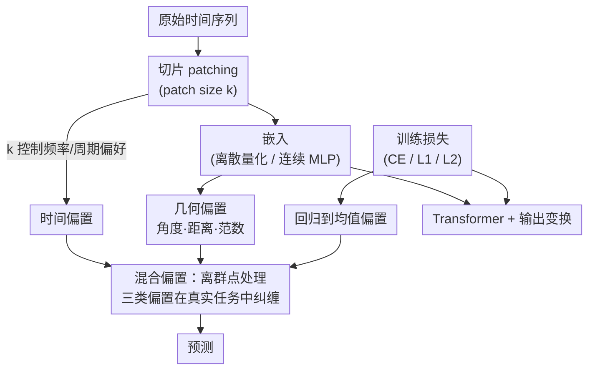

# Understanding the Implicit Biases of Design Choices for Time Series Foundation Models

**会议**: ICLR 2026  
**OpenReview**: [https://openreview.net/forum?id=5jkzTzV5Ao](https://openreview.net/forum?id=5jkzTzV5Ao)  
**代码**: https://github.com/amazon-science/TSFM-Biases (有)  
**领域**: 时间序列基础模型  
**关键词**: 时间序列基础模型, 归纳偏置, patch size, 量化嵌入, 损失函数

## 一句话总结
这篇论文不造新模型、不刷榜，而是系统地把时间序列基础模型（TSFM）的三个常见设计旋钮——patch size、嵌入方式（离散量化 vs 连续）、训练损失（CE vs L1/L2）——映射到三类「隐式偏置」（时间偏置、几何偏置、回归到均值偏置），用理论加受控实验说明每个旋钮如何塑造模型的频率/周期偏好、几何结构和不确定性下的预测形态，并以离群点处理为例展示这些偏置如何复杂地相互纠缠。

## 研究背景与动机
**领域现状**：TSFM（如 Chronos、Chronos-Bolt、Moirai、TimesFM、Time-MoE）正在成为预测领域的通用工具，做法都是把时间序列切成 patch、嵌入到 Transformer 隐空间、再解码出预测。研究者调旋钮（patch size、嵌入策略、损失函数）时，靠的是一套朴素直觉：相邻点该映得近、低频比高频更稳更有信息、回归算法该回归到均值。

**现有痛点**：这套调参流程围绕 M4、ETT、Electricity、Traffic 等成熟 benchmark 反复试错，得到一个在这些 benchmark 上「更好」的模型。但这种改进往往经不起时间考验——当数据量/算力大幅增长，或当数据与训练 benchmark 在性质上不同（如混沌系统、准周期信号）时，同样的旋钮调法会产生完全不同甚至有害的效果。

**核心矛盾**：设计选择会编码进模型的「隐式偏置」，而这些偏置的好坏是**数据相关**的。在标准 benchmark 上有益的直觉性偏置（大 patch、连续嵌入、连续损失），在性质迥异的数据上可能恰恰是毒药，反而是相反的旋钮设定更有利。问题在于：社区想造「前向兼容」更多更杂数据的基础模型，却不清楚每个旋钮在「与 benchmark 不同的数据」上到底引入了什么偏置。

**本文目标**：不发明「又一个」模型，而是搞清楚 patch size / 嵌入 / 损失这三类设计决策各自编码了什么效应（隐式偏置），以及这些效应如何随数据和模型性质变化。

**切入角度**：把每一类设计旋钮和一类基本模型属性（时间行为、几何结构、回归到均值的激进程度）对应起来，用理论刻画 + 受控实验佐证。为了「可比」，作者主打 Chronos 与 Chronos-Bolt 的对照——它们共享同尺寸 T5 骨干、训练语料相近，但恰好张成了所有主要旋钮的对立面（Chronos：无 patch、4096 桶量化嵌入、CE 损失；Chronos-Bolt：patch=16、MLP 连续嵌入、L1 分位回归损失）。

**核心 idea**：用「设计旋钮 → 隐式偏置」的三组对应关系（patch size→时间偏置、嵌入→几何偏置、损失→回归到均值偏置）作为分析框架，把模型行为的好坏拆解成可解释、可调的偏置，并指出不存在对所有预测场景一致最优的旋钮设定。

## 方法详解

### 整体框架
TSFM 的推理管线本身就是一条固定流水：原始序列先被**切片（patching）**成长度 $k$ 的 patch，再经**嵌入**映入 Transformer 隐空间，**Transformer** 做上下文建模，最后**输出变换**解码成预测。本文的核心论点是：这条流水线上的三个旋钮各自在某个环节注入一类偏置——patch size 在「切片」处注入**时间偏置**，嵌入方式在「嵌入」处注入**几何偏置**，损失函数在「输出/训练」处注入**回归到均值偏置**。前三个「关键设计」就是逐一拆解这三类偏置怎么来、表现成什么、何时有益何时有害；第四个则把它们放回离群点处理这个真实场景，看它们如何**叠加纠缠**。

### 关键设计

**1. 时间偏置：patch size 决定模型偏爱哪段频谱、能否对齐周期**

这一类偏置针对「TSFM 如何学习时间」。作者把它拆成两个相连的视角：频率偏置和周期偏置。频率偏置指模型更擅长学低频还是高频。关键洞察是：频率偏置在序列**被嵌入的那一刻**就已注入。一个嵌入函数 $\phi:\mathbb{R}^k\to\mathbb{R}^d$ 把长度 $k$ 的 patch 映入隐空间，定理 1 给出了一个精确刻画——用 $\varepsilon$-秩和稳定秩 $\text{stab-rank}(\phi(V))=\|\phi(V)\|_F/\|\phi(V)\|_2$ 度量列空间「维度」：**频率相近的 patch 被嵌入到同一个低维子空间**（有效维度正比于带宽 $\omega$，即 $\text{stab-rank}=O(\omega)$），而**频率差异大的 patch 被嵌入到近乎正交的子空间**（$\text{stab-rank}=\Omega(n)$）。

patch size $k$ 在这里扮演开关：$k$ 小时所有 patch 必有 $\omega\le k$，于是带宽窄、都挤进低维子空间，高频信息得以保留；$k$ 大时（如 Chronos-Bolt 的 16）低频与高频被劈到正交子空间，而训练中 $W_Q,W_K,W_V$ 会更对齐低频子空间，于是模型偏向低频、对高频/混频/混沌系统失手。实验（图 3）里 $k=16$ 的 Chronos-Bolt 在高频模态上的频谱损失显著偏大，$k=1$ 则能抓住高频。周期偏置则由「patch size 与 motif 周期是否对齐」「架构（encoder 双向 vs decoder 单向）」「是否有未屏蔽的 `[REG]` token」共同控制：patch 与周期不整除会引入混叠、破坏周期感（图 4c 在 1 万条序列上显示 motif 匹配质量随 $k$ 增大而下降）；`[REG]` token 因汇聚全局信息、其大值会沿自注意力反向传播污染本该周期的通道，屏蔽它即可恢复周期结构。

**2. 几何偏置：离散 vs 连续嵌入决定角度、距离、范数三种几何属性的保真度**

这一类偏置针对「TSFM 如何学习几何」，即嵌入对输入域内积几何的扭曲/保持。连续嵌入 $\phi_C$（MLP）天然由连续性保住 $\mathbb{R}$ 的拓扑；量化嵌入 $\phi_Q$ 把实轴分成若干桶、每桶给一个初始随机向量，实轴的序关系得在训练中重新学回，通常学不全。作者从三个几何量度量这个偏置：

- **角度（局部性）**：$\theta(x,y)=\arccos\!\big(\tfrac{|\phi(x)\cdot\phi(y)|}{\|\phi(x)\|_2\|\phi(y)\|_2}\big)$。量化嵌入的 $\theta_Q$ 随 $|x-y|$ 增长显著大于 $\theta_C$，让输入显得「和近邻更不同」，桶越多越明显。结果是 Chronos 的自注意力呈双峰（强烈关注近邻、忽略远处），更擅长「鹦鹉学舌」式复制——这正是它在混沌系统上更好的原因；代价是跨上下文混合弱，难以综合远处信息。
- **距离（尺度）**：$d(x,y)=\tfrac{\|\phi(x)-\phi(y)\|_2}{\|\phi(x)\|_2+\|\phi(y)\|_2}$。连续嵌入诱发距离偏置，使细尺度模式更难学；量化反而放大小尺度、让相邻数字在隐空间更可分。多尺度信号实验里只有 Chronos 能学好小尺度成分，且随两尺度比值增大，依赖连续嵌入的 Chronos-Bolt/TimesFM/Moirai 在小尺度上的相对误差快速恶化。
- **范数（偏移）**：因 ReLU 正齐次，$\phi_C$ 把大数映成大范数向量、小数映成小范数向量，于是大幅值 motif 在隐空间「压制」小幅值的；量化嵌入因每桶同分布初始化，对范数无偏好、各输入更均匀对待。这对常规多偏移信号是种不利失衡，但对稀疏信号反而有用（自动聚焦非零、忽略零）。

一句话：是否保几何并非总是好——保几何（连续）让大尺度/大幅值占优、细节被淹；不保几何（量化）牺牲全局混合，却换来对局部、细尺度、混沌复制的敏感。好坏取决于任务。

**3. 回归到均值偏置：损失函数决定不确定时是折中还是押注一个模态**

这一类偏置针对「未来随机时，模型是收敛到一个中心预测，还是保持尖锐/多峰的结果」。机制直白地由训练损失决定：当目标来自一个大方差未知分布时，**L2 损失偏向均值**（平均所有可能结果）、**L1 损失偏向中位数**（把概率质量对半切）、**交叉熵损失建模整个分布、可落在某个「模态（mode）」上**，从而避免在多个可能结果间「和稀泥」，能更忠实地表示大方差、强异质的分布。

作者用图 8 的桥接实验量化：对周期游走以概率 $p$ 注入扩散（$0\le p\le 1/2$），用「回归分数」$\min(|\hat y|,|1-\hat y|)$ 度量预测向中心收缩的程度。$p$ 增大、上下文越不确定时，连续损失的 TimesFM（→均值）、Chronos-Bolt（→中位数）回归得越狠，而 CE 的 Chronos 回归得最少，甚至能在混沌（Lorentz）系统里「鹦鹉式」复制出多个不同的结果分支。意义在于：传统智慧认为低 MAE/MSE 就好，但时序预测不只是逐点拟合——混沌系统的分形维度刻画长期几何，回归到均值/中位数会严重破坏它；「回归到模态」让预测反映尖锐高概率结果而非被抹平的中心趋势。

**4. 混合偏置：离群点处理是三类偏置纠缠的真实案例**

前三个设计单独看清晰，但真实场景里它们会复杂地交织。作者以正弦波注入离群点为例（两种设定：增大固定数量离群点的幅值；增多 i.i.d. 高斯离群点），同时观察到三类偏置同时起作用：① **时间偏置**——对比 $k=1$ 与 $k=16$ 的 Chronos-Bolt，无离群点时 $k=1$ 更好，但离群点注入高频扰动后，大 patch 因在更宽窗口上平均而更擅长去噪，出现交叉（图 9c）。② **几何（距离）偏置**——污染较轻时 Chronos 靠量化把极端值压进相邻桶、缩小其表观尺度，孤立尖峰不再主宰局部距离，更利于学回底层正弦（图 9d）；**几何（范数）偏置**——Chronos-Bolt 的连续嵌入让大幅值离群点的嵌入向量过大、把注意力拉向离群时刻，幅值越大预测越差（图 9a,e）。③ **回归到均值偏置**——Chronos 平均表现好，但方差更大，因为不确定离群点是否属于底层上下文时，它的「找模态」倾向会偶尔自己吐出一个离群预测（图 9b），揭示了「期望意义上的鲁棒」与「条件方差更高」之间的根本权衡。

## 实验关键数据

本文是分析型论文，实验都是受控诊断而非刷榜。下面两张表分别量化几何偏置的「距离」与「范数」两个维度，指标是相对 MSE（越接近 1 越保真，越大越差）。

### 主实验：距离偏置——多尺度信号小尺度成分的相对误差（随两尺度比值增大）

| 尺度比值 | Chronos (小尺度) | Bolt (小尺度) | TimesFM (小尺度) | Moirai (小尺度) |
|---------|------------------|---------------|------------------|-----------------|
| 1 | 1.000 | 1.000 | 1.000 | 1.000 |
| 4 | 1.076 | 1.221 | 1.380 | 1.192 |
| 8 | 1.188 | 1.369 | 1.512 | 1.319 |
| 20 | 1.360 | 1.726 | 2.018 | 1.771 |
| 40 | **1.556** | 2.679 | 3.201 | 2.482 |

> 量化嵌入的 Chronos 在小尺度上的相对误差增长最慢（比值 40 时仅 1.556），连续嵌入的三者都恶化更快——印证「连续嵌入诱发距离偏置、细尺度更难学」。大尺度成分上四者都接近 1.0，差异主要在小尺度。

### 分析实验：范数偏置——多偏移信号低偏移成分的相对误差（随偏移增大）

| 偏移 gap | Chronos (低偏移) | Bolt (低偏移) | TimesFM (低偏移) | Moirai (低偏移) |
|---------|------------------|---------------|------------------|-----------------|
| 1 | 1.000 | 1.000 | 1.000 | 1.000 |
| 4 | 1.069 | 1.219 | 1.381 | 1.423 |
| 8 | 1.108 | 1.357 | 1.478 | 1.552 |
| 20 | 1.342 | 2.185 | 2.688 | 2.826 |
| 40 | **1.622** | 3.162 | 3.417 | 3.615 |

> 近零（小幅值）周期上，ReLU 连续嵌入把小数映成小范数向量、易被大幅值上下文淹没，于是 Bolt/TimesFM/Moirai 误差随偏移急剧上升；量化的 Chronos 因对范数无偏好而稳得多。高偏移成分上四者都接近 1.0。

### 关键发现
- **没有一致最优的旋钮**：大 patch、连续嵌入、连续损失在标准 benchmark 上的「直觉性」偏置，在混沌/准周期/多尺度/含离群点数据上可能恰恰有害，相反设定反而更好——这是全文的核心结论。
- **偏置在源头注入**：频率偏置在嵌入那一刻就由 patch size 决定（定理 1 的正交/低维子空间刻画），而非在 Transformer 深处才形成。
- **混沌系统上的「鹦鹉」优势**：Chronos 的量化+CE 组合让它强烈关注近邻、能押注模态并复制多分支，这解释了它为何在混沌系统上反而更强。
- **离群点是偏置的「试金石」**：同一现象（离群点）下，patch size（去噪）、距离偏置（压缩尺度）、范数偏置（放大尖峰）、回归到均值（偶发离群预测）四股力同时拉扯，方向并不一致。

## 亮点与洞察
- **「分析而非刷榜」的研究范式**：作者明确不造新模型、不在 benchmark 上宣称更好，而是把模糊的「调参直觉」转译成可证、可量化的「设计旋钮→隐式偏置」对应表——这种把工程经验上升为机制理解的工作，对整个领域比再多一个 SOTA 更有长期价值。
- **可比性设计极巧**：选 Chronos vs Chronos-Bolt 做主对照，因为它们共享 T5 骨干、相近语料，却在三个旋钮上全部对立，几乎构成一组天然的「控制变量」实验，让偏置归因干净可信。
- **定理 1 把频率偏置几何化**：用 $\varepsilon$-秩/稳定秩刻画「相近频率→低维共享子空间、不同频率→近正交子空间」，给「为什么大 patch 偏低频」一个可计算的解释，而不只是经验观察。
- **可迁移的诊断思路**：角度/距离/范数三量度 + 回归分数 $\min(|\hat y|,|1-\hat y|)$ 这套探针，可以直接搬去诊断任何新 TSFM 的嵌入几何与不确定性行为。

## 局限与展望
- **主要靠 Chronos/Chronos-Bolt 对照**：虽有其他 TSFM 的消融，但深度归因集中在这一对，结论在结构差异更大的模型（如 SSM 类、纯 decoder）上是否同样成立，验证相对有限。
- **受控合成信号为主**：多尺度、多偏移、注入离群点的正弦波等是为隔离单一偏置而设计的合成场景，真实业务数据里多种偏置同时被多种数据特性触发，定量结论未必直接外推。
- **只诊断不开方**：论文识别了偏置却未给出系统的「如何动态调偏置」方案，仅在结论里提出 in-context learning、检索、RL 自适应是可能方向——把诊断转成可操作的自适应机制是明确的后续工作。
- **偏置间的交互缺乏统一理论**：离群点案例展示了纠缠，但三类偏置如何在一般任务上加权/抵消，仍停留在案例层面，没有定量的交互模型。

## 相关工作与启发
- **vs 频率偏置/谱偏置研究（Rahaman 等、Yu 等）**: 既有工作在一般神经网络和序列模型上证明「先学低频」，本文把它专门落到 TSFM 的 patch 嵌入上，用定理 1 说明 patch size 才是控制旋钮，并指出在混沌/准周期数据上低频偏好反而有害。
- **vs TSFM 经验对比研究（Liang 等、Zhao 等）**: 他们横向 benchmark 各 TSFM 谁强谁弱，本文不比排名，而是解释「为什么不同模型在不同设定下各擅胜场」，把性能差异归因到具体旋钮诱发的偏置。
- **vs tokenization / scaling law / 架构选择的单点研究（PatchTST、TOTEM、Moirai、Time-MoE 等）**: 既有工作各自分析某一个设计点，本文把 patch size、嵌入、损失三类旋钮统一进一个「偏置」框架，并首次系统刻画它们的相互作用。

## 评分
- 新颖性: ⭐⭐⭐⭐⭐ 把 TSFM 的调参直觉系统转译为「设计旋钮→隐式偏置」的可证框架，视角新且稀缺。
- 实验充分度: ⭐⭐⭐⭐ 受控诊断扎实、理论+实证互证，但深度归因集中在 Chronos/Bolt 一对、以合成信号为主。
- 写作质量: ⭐⭐⭐⭐⭐ 三类偏置层层递进、图文对照清晰，离群点案例收束有力。
- 价值: ⭐⭐⭐⭐⭐ 给 TSFM 设计提供可解释的取舍地图，长期价值高于再添一个 SOTA。

<!-- RELATED:START -->

## 相关论文

- [\[ICLR 2026\] Beyond Accuracy: Are Time Series Foundation Models Well-Calibrated?](beyond_accuracy_are_time_series_foundation_models_well-calibrated.md)
- [\[ICLR 2026\] Understanding Transformers for Time Series: Rank Structure, Flow-of-ranks, and Compressibility](understanding_transformers_for_time_series_rank_structure_flow-of-ranks_and_comp.md)
- [\[ICLR 2026\] ICDiffAD: Implicit Conditioning Diffusion Model for Time Series Anomaly Detection](icdiffad_implicit_conditioning_diffusion_model_for_time_series_anomaly_detection.md)
- [\[ICLR 2026\] Adapt Data to Model: Adaptive Transformation Optimization for Domain-shared Time Series Foundation Models](adapt_data_to_model_adaptive_transformation_optimization_for_domain-shared_time_.md)
- [\[ICLR 2026\] FeDaL: Federated Dataset Learning for General Time Series Foundation Models](fedal_federated_dataset_learning_for_general_time_series_foundation_models.md)

<!-- RELATED:END -->
