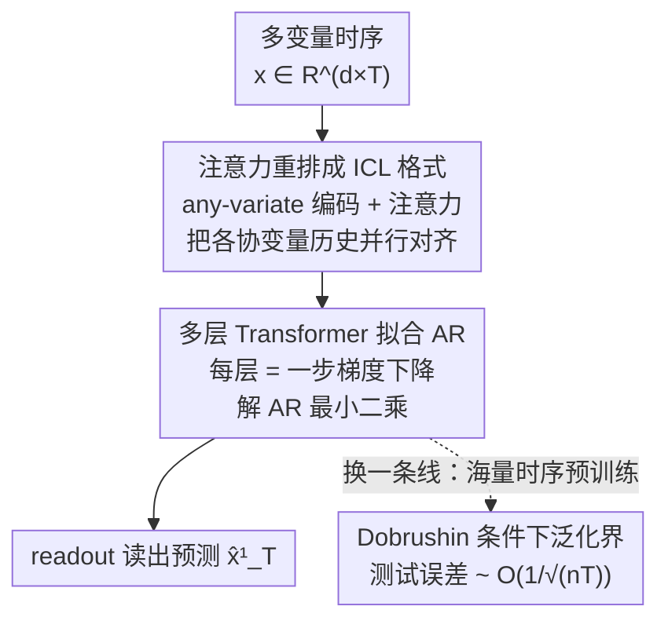

# Understanding Transformers in Time Series Forecasting: A Case Study on MOIRAI

**会议**: ICLR 2026  
**OpenReview**: [https://openreview.net/forum?id=iAPSx90gwJ](https://openreview.net/forum?id=iAPSx90gwJ)  
**代码**: 无  
**领域**: 时间序列  
**关键词**: 时序预测、Transformer 理论、In-context Learning、自回归、泛化界

## 一句话总结
这篇论文从理论上回答"为什么 Transformer（尤其是 MOIRAI）在时序预测上这么强"——证明存在一个 Transformer 能通过 in-context learning 用梯度下降在输入序列上拟合自回归（AR）模型，并进一步证明 MOIRAI 的 any-variate 编码与注意力机制能把任意数目协变量的 AR 回归自动并行装进同一套权重，最后在 Dobrushin 条件下给出预训练的 $O(1/\sqrt{nT})$ 泛化界。

## 研究背景与动机
**领域现状**：Transformer 已经在时序预测上全面铺开，Chronos、TimesFM、MOIRAI 等"时序基座模型"靠在海量异构时序上预训练，做到了惊人的零样本预测。改进方向大多集中在改架构（CrossFormer、iTransformer、Autoformer）或改数据处理（patch embedding、RevIN）。

**现有痛点**：这些工作几乎全是启发式的——大家知道 Transformer 好用，但说不清"它到底在时序数据上做了什么计算"。即便在最简单的设定下，社区也缺乏严格的理论解释，更没人回答 MOIRAI 那些为工程而生的"古怪设计"（把多变量拍平成一条长序列、给注意力加偏置项）究竟为什么有效。

**核心矛盾**：Vaswani 原版 Transformer 是为固定词表设计的，而时序预测的根本难点是要处理**任意数目的协变量**。MOIRAI 用 any-variate encoding（拍平 + 时间/变量 ID）和 any-variate attention（带可学偏置）绕过了这个限制，但这套机制为什么能 work、它和经典统计模型有什么关系，一直是黑盒。

**本文目标**：把问题拆成两半——(1) 逼近能力：是否存在一个 Transformer，能在给定时序上"算出"AR 模型？MOIRAI 的特殊设计是否正好支撑这件事？(2) 泛化能力：在非 i.i.d. 的时序上预训练，测试误差能不能被控住？

**切入角度**：作者从时序回归里最经典的算法——自回归（AR）回归切入。如果能证明 Transformer 的前向传播等价于"在上下文里跑梯度下降解 AR 最小二乘"，那它在时序上的强表现就有了第一性原理的解释。

**核心 idea**：把 MOIRAI 的前向计算还原成"in-context learning 解 AR 回归"，用 ICL 的逼近理论 + Dobrushin 条件下的依赖数据泛化理论，给时序 Transformer 一个完整的逼近 + 泛化刻画。

## 方法详解

### 整体框架
这是一篇纯理论分析论文，没有提出新模型，而是把 MOIRAI 这台"黑盒"拆开，证明它的前向传播在做一件可解释的事：**在上下文里用梯度下降拟合自回归模型，再读出预测**。整条分析链是这样转的——给定多变量时序，先用 any-variate 编码把它摊成一条带时间 ID 和变量 ID 的长序列；一层 any-variate 注意力把每个协变量的历史滞后值并行地重排成"特征-标签"对齐的 ICL 标准格式；接着多层 Transformer 每一层等价于对 AR 最小二乘损失 $L_{\mathrm{reg}}$ 做一步梯度下降，层数越多逼近越准；最后 readout 算子从末列读出对目标变量 $x^1_T$ 的预测。逼近之外，作者再单开一条线分析预训练：当数据满足 Dobrushin 条件（一种比平稳/混合更弱的依赖正则性）时，给出 ERM 的泛化界。

### 关键设计

**1. 注意力把原始时序重排成 ICL 标准格式：单变量到多变量的对齐基石**

经典的 in-context learning 理论（Bai et al. 2024 等）都假设输入已经摆成"特征列 + 标签列"的整齐格式 $[x_1,\dots,x_N; y_1,\dots,y_N]$，但时序数据天生不长这样——每个时刻的值既是当前标签、又是未来的特征，而且滞后阶数 $q$ 还是未知的。作者的第一块基石（Lemma 3.2）证明：对单变量 $\mathrm{AR}_1(q)$，存在一个 **单层、$q_{\max}$ 头的注意力层**，能把原始输入 $H$ 重排成每一列携带 $[x_i, x_{i-1}, \dots, x_{i-q}]$ 滞后窗口的 ICL 格式，从而把"未知 $q$ 的时序"接回标准 ICL 理论。

多变量是这块设计真正出彩的地方。MOIRAI 的 any-variate encoding 先把 $x\in\mathbb{R}^{d\times T}$ **拍平成一条长度 $Td$ 的单序列**，再给每个位置拼上时间索引 $p_i$ 和 one-hot 的变量索引 $e_i$。配套的 any-variate attention 在标准注意力分数里加了两个可学偏置：

$$\mathrm{Attn}_{\theta_1}(H) := H + \frac{1}{N}\sum_{m=1}^{M}(V_m H)\,\sigma\!\big((Q_m H)^\top(K_m H) + u^1_m * U + u^2_m * \bar U\big),$$

其中 $U$ 是块大小为 $T$ 的块对角全 1 矩阵、$\bar U = I - U$，分别标记"同一变量内"与"跨变量"的注意力。Lemma 3.4 证明：靠这套偏置，**单层 any-variate 注意力就能把每个协变量的历史矩阵 $A_i(q)$ 并行重排**，互不干扰。这正是 MOIRAI 那些"为工程而生"的怪设计为什么有效的根因——它们让 Transformer 能以变量为单位、并行地整理历史，再叠一层注意力就能堆成统一的 ICL 格式。

**2. 多层 Transformer 逐层做梯度下降，在上下文里解出 AR 模型**

把数据对齐到 ICL 格式之后，接力的是 ICL 逼近理论：一个多层 Transformer 的每一层可以模拟对最小二乘损失的**一步梯度下降**。作者据此给出两个存在性定理。单变量（Proposition 3.3）：对任意 $\mathrm{AR}_1(q)$（$q\le q_{\max}$），存在一个 $L=L_1+L_2$ 层、每层至多 3 头的 MOIRAI Transformer，其 readout 输出与最小二乘估计 $\hat w_{\mathrm{ERM}}$ 的预测误差 $\le \epsilon$，其中 $L_1=\lceil 2\kappa\log(B_xB_w/2\epsilon)\rceil$、$\kappa=\beta/\alpha$ 是损失的条件数。多变量（Theorem 3.6）把它推到 $\mathrm{AR}_d(q)$：只要协变量数 $d\le d_{\max}$、滞后阶 $q\le q_{\max}$，就存在一个 MOIRAI Transformer 自动把 AR 维度调到合适大小、做出 $\le\epsilon$ 的预测。

这里有两条值得记住的 trade-off。其一，$q_{\max}\cdot d_{\max}$ 受隐藏维 $D$ 上界约束——容量有限，能同时容纳的"滞后阶 × 变量数"是有上限的；超过 $d_{\max}$ 不会彻底崩，但只会用前 $d_{\max}$ 个协变量拟合，性能会有可预期的下降。其二，逼近误差大约是 $O(e^{-L})$，**随层数指数级收敛**——因为每层等价于一步梯度下降，层数就是迭代步数。这条定理直接给出了 MOIRAI 零样本泛化的一个机制解释：它不是在背模式，而是在前向里"现场把底层 AR 模型推断出来"。

**3. Dobrushin 条件下的预训练泛化界：非 i.i.d. 时序也能给出 $O(1/\sqrt{nT})$ 收敛**

逼近能力说明"存在好模型"，泛化能力才说明"在数据上训得出来"。但时序数据天然不是 i.i.d.，经典学习理论用不上。作者改用 **Dobrushin 唯一性条件**——用 Dobrushin 系数 $\alpha(X)=\max_i\sum_{j\neq i} I_{j\to i}(X)$ 度量变量间的相互影响，$\alpha<1$ 即满足条件，$\alpha=0$ 退化为 i.i.d.。相比混合性（mixing），它的好处是**不要求数据平稳**，而平稳性在真实时序里极易被破坏。

在此条件下，Theorem 4.4 给出预训练 ERM $\hat\theta$ 的泛化界：

$$L(\hat\theta) \le \inf_{\theta} L(\theta) + O\!\left(\frac{B_x^2}{1-\alpha^n(P^{(T)})}\sqrt{\frac{L(MD^2+DD')\zeta + \log(1/\varepsilon)}{nT}}\right),$$

其中 $n$ 是时序条数、$T$ 是每条长度。它揭示两件事：增大 $n$ 既以 $1/\sqrt n$ 收紧界、又指数级缓解 $1/(1-\alpha)$ 带来的依赖性惩罚。当数据确由 $\mathrm{AR}_d(q)$ 生成时，Proposition 4.5 把逼近误差项 $O(B_xB_w e^{-L/\kappa})$ 也并进来，适当选 $L$ 即可把总界优化到 $\lesssim (nT)^{-1/2}$；Corollary 4.6 进一步在 AR(1) 上给出可显式验证 Dobrushin 系数（$\alpha(\mathrm{AR}(1))\le\min\{1/2,\,2\sqrt{2/\pi}\,B_x\|w\|_*/\sigma_\epsilon\}$）的实例。这套结果第一次为 MOIRAI 的大规模时序预训练给了形式化的统计保证。

### 一个完整示例
以多变量 $\mathrm{AR}_d(q)$ 预测为例走一遍前向（对应框架图的纵向主线）：输入 $x\in\mathbb{R}^{d\times T}$，目标是预测目标变量的 $x^1_T$（输入里被置 0）。第一步 any-variate 编码把 $d\times T$ 矩阵拍平成一条长序列，并给每列拼上时间 ID $p_i$ 与变量 ID $e_i$。第二步，一层 any-variate 注意力靠偏置 $u^1,u^2$ 把第 $i$ 个协变量的历史滞后值整理成历史矩阵 $A_i(q)$，$d$ 个协变量并行完成；再叠一层注意力把所有 $A_i(q)$ 堆到同一批列里，凑成 ICL 的"特征-标签"格式。第三步，接下来的 $L_2$ 层每层做一步梯度下降，逐步逼近 AR 最小二乘解 $\hat w$，层数越多越准（误差 $\sim e^{-L}$）。最后 readout 从第 $T$ 列首项读出 $\hat x^1_T = \langle \hat w, [x^1_{T-1:T-q};\dots;x^d_{T-1:T-q}]\rangle$。整条链解释了"为什么把输入拉长会让 MOIRAI 更准"——更长的输入＝更多可供拟合 AR 的样本。

## 实验关键数据
实验目的不是刷 SOTA，而是**验证理论**：用 MOIRAI-base（12 层）在合成 AR 数据上预训练（patch size 设为 1 以剔除 patch embedding 干扰，MSE 损失），看模型行为是否与最小二乘（LSR）一致，并测它对未见 $d,q$ 的外推。

### 主实验

| 设定 | 对比对象 | 关键观察 | 对应理论 |
|------|---------|---------|---------|
| 不同输入长度（$d\in\{3,4,5\}, q=5, \sigma^2=1$） | LSR（已知 $q$） | 输入越长，MOIRAI 预测误差越像最小二乘一样下降，并随 $q$ 增大收敛到噪声方差 1 | Theorem 3.6（输入长度＝拟合 AR 的样本数） |
| Softmax → ReLU（MOIRAI-relu） | MOIRAI-base | 性能差距可忽略 | 逼近构造不依赖具体激活 |
| 标准注意力（保留 any-variate 编码但用标准 attention） | any-variate attention | 标准注意力误差明显更高 | 印证 any-variate 注意力的优势 |

### 消融 / 外推实验

| 配置 | 设定 | 说明 |
|------|------|------|
| 训练分布内 | 预训练 $d\in\{4,5\}, q\in\{4,5\}$ | 基线，行为贴合最小二乘 |
| 高维外推 | 测 $d=10$（未见） | MOIRAI 仍能有效做 AR 回归，且样本复杂度优于 LSR（LSR 在 $d=10$ 需更多样本才追平 $d=5$） |
| 低维外推 | 测 $d=2$（未见） | 各模型都表现良好，验证理论 |
| $d,q$ 双未见 | 测 $d=3, q=7$ | 即便阶数与维度都没见过，预测仍准确 |

### 关键发现
- **输入长度↔拟合样本数**是核心机制证据：拉长输入序列＝给 in-context 梯度下降喂更多样本，误差随之向噪声下界收敛，与 Theorem 3.6 的"每层一步 GD、误差 $\sim e^{-L}$"严丝合缝。
- **any-variate 注意力确有实质收益**：换成标准注意力误差明显升高，与 MOIRAI 原文"去掉 any-variate 注意力误差涨约 40%"互相印证，从理论侧（Lemma 3.4 的并行重排）解释了这一现象。
- **Softmax 不是关键**：换成 ReLU 几乎不掉点，说明强表现来自"注意力能并行重排历史 + 多层模拟 GD"这一结构性事实，而非某个具体激活函数。
- **超出容量优雅退化**：协变量数超过 $d_{\max}$ 时只用前 $d_{\max}$ 个拟合，性能有可预期下降而非崩溃；但若真有非零权重落在 $>q_{\max}$ 的滞后上，预测可能失效。

## 亮点与洞察
- 把"Transformer 为何擅长时序预测"这个工程直觉问题，干净利落地归约为"它在上下文里跑梯度下降解 AR 回归"，第一性原理级别的解释，比"它学到了模式"这种话有信息量得多。
- 最"啊哈"的一点：MOIRAI 那些看起来很 hacky 的设计（拍平多变量、给注意力加块对角偏置 $U/\bar U$）在理论里恰好是实现"逐变量并行重排历史"的关键齿轮——Lemma 3.4 把工程 trick 翻译成了数学必需品。
- 用 Dobrushin 条件而非混合性来处理非 i.i.d. 时序，避免了"数据必须平稳"这一现实里几乎站不住的假设，而且能在 AR(1) 上显式验证系数，这套泛化框架对一大类时序模型可复用。
- 逼近误差 $O(e^{-L})$ 把"深度"直接翻译成"梯度下降迭代步数"，给"时序基座模型为什么要堆层数"提供了量化直觉，这个视角可迁移到分析其他 ICL 式架构。

## 局限与展望
- 结论是**存在性**而非"训练一定收敛到该构造"——证明的是"存在一个 Transformer 能做 AR 回归"，并不保证实际优化器一定学到这台机器，实验只是行为上吻合。
- 覆盖面有边界：分析适配把注意力作用在时间维的模型（标准 Transformer、Chronos、MOMENT、TimesFM 等），但**不覆盖** iTransformer、CrossFormer（注意力作用在变量维）、Autoformer（auto-correlation）、Time-LLM / Lag-Llama（语言输入 / 滞后特征），这些需要新工具。
- 假设偏理想：数据由 AR 过程生成、特征有界、Dobrushin 系数 $<1$，真实时序的非线性、非平稳与重尾未必满足；容量上界 $q_{\max}d_{\max}\lesssim D$ 也限定了可处理的复杂度。
- 可拓展方向：放宽 Dobrushin 条件、把单步预测推广到多步/多变量预测（作者指出可套 Bai et al. Proposition A.5，隐藏维线性增长），以及把分析框架延伸到 variate-attention 这一类未覆盖的架构。

## 相关工作与启发
- **vs MOIRAI（Woo et al. 2024）**：MOIRAI 提出 any-variate 编码/注意力并用实验证明其有效，本文则为这些设计提供**理论解释**——证明它们正是让 Transformer 能并行做任意变量数 AR 回归的机制，是"解释者"而非"竞争者"。
- **vs ICL 逼近理论（Bai et al. 2024）**：Bai 等证明 Transformer 能在标准"特征-标签"格式上用 GD 做线性回归；本文的贡献是**放宽其格式假设**，证明注意力自己就能把原始时序（标签兼作未来特征、$q$ 未知）重排成该格式，从而把 ICL 理论接到时序预测上。
- **vs 依赖数据泛化（Dagan et al. 2019 等 Dobrushin 路线 / Mohri 等 mixing 路线）**：本文沿用 Dobrushin 条件给出**首个 MOIRAI 预训练泛化界**，相比 mixing 不需平稳假设，并在 AR(1) 上给了可验证实例。

## 评分
- 新颖性: ⭐⭐⭐⭐⭐ 首次给 MOIRAI/时序 Transformer 同时给出逼近与泛化的严格刻画，把工程怪设计翻译成数学必需。
- 实验充分度: ⭐⭐⭐⭐ 合成数据上对长度/外推/激活/注意力类型的验证扎实，但主要是验证理论、真实数据结果放在附录。
- 写作质量: ⭐⭐⭐⭐ 定理-引理-备注结构清晰，trade-off 与覆盖范围交代到位；纯理论密度较高，门槛偏陡。
- 价值: ⭐⭐⭐⭐⭐ 为"时序基座模型为何 work、该怎么设计"提供第一性原理级指引，对架构设计者有长期参考价值。

<!-- RELATED:START -->

## 相关论文

- [\[ICLR 2026\] Understanding Transformers for Time Series: Rank Structure, Flow-of-ranks, and Compressibility](understanding_transformers_for_time_series_rank_structure_flow-of-ranks_and_comp.md)
- [\[ICLR 2026\] A Study of Posterior Stability in Time-Series Latent Diffusion](a_study_of_posterior_stability_in_time-series_latent_diffusion.md)
- [\[ACL 2026\] Temporal Leakage in Search-Engine Date-Filtered Web Retrieval: A Retrospective Forecasting Case Study](../../ACL2026/time_series/temporal_leakage_in_search-engine_date-filtered_web_retrieval_a_retrospective_fo.md)
- [\[ICLR 2026\] SciTS: Scientific Time Series Understanding and Generation with LLMs](scits_scientific_time_series_understanding_and_generation_with_llms.md)
- [\[ICLR 2026\] Understanding the Implicit Biases of Design Choices for Time Series Foundation Models](understanding_the_implicit_biases_of_design_choices_for_time_series_foundation_m.md)

<!-- RELATED:END -->
