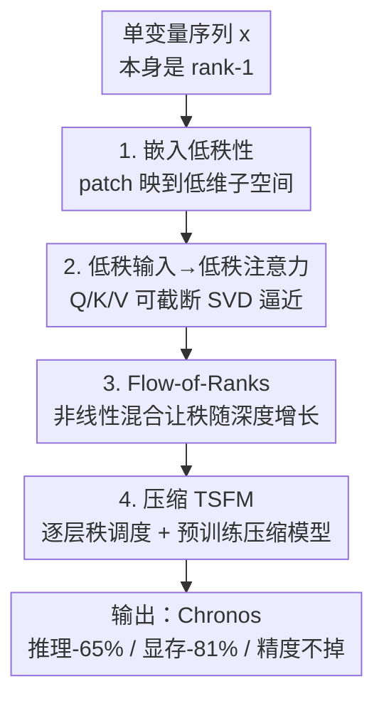

# Understanding Transformers for Time Series: Rank Structure, Flow-of-ranks, and Compressibility

**会议**: ICLR 2026  
**OpenReview**: [https://openreview.net/forum?id=axR2KZwaD3](https://openreview.net/forum?id=axR2KZwaD3)  
**代码**: https://github.com/amazon-science/tsfm-compression  
**领域**: 时间序列 / 可解释性 / 模型压缩  
**关键词**: 时间序列基础模型, 数值秩, 低秩注意力, flow-of-ranks, Chronos 压缩

## 一句话总结
本文从「数值秩」的视角剖析时间序列 Transformer：证明时间序列的 patch 嵌入天然落在极低秩子空间，从而 Q/K/V 注意力矩阵可被低秩逼近，并提出 flow-of-ranks 解释「秩随深度增长、浅层最易压缩」的现象；据此把时间序列基础模型 Chronos 压缩到推理时间降 65%、显存降 81% 而精度不掉。

## 研究背景与动机

**领域现状**：Transformer 最初为文本设计，如今被直接搬到时间序列、图像、分子、DNA 等模态上。一个常见做法是把文本模型的架构超参（宽度 $d$、头数 $h$、层数 $D$）原封不动地迁移过来，假定「对文本好用的就该泛化到别处」。近两年时间序列基础模型（TSFM，如 Chronos、TimesFM、Moirai）正是沿着这条路把 LLM 的配方照搬过来。

**现有痛点**：这个假设其实很脆弱。文本和时间序列在「信号如何被 tokenize、如何被嵌入」这件根本性的事情上差异巨大，但社区缺乏一套原理性的工具去刻画这种差异，更没人系统回答过：从文本上总结出来的预训练与调参经验，到底有多少能搬到别的模态？在数据远不如文本充裕的领域，这个问题尤其关键——盲目照搬很可能意味着严重的过参数化。

**核心矛盾**：模型的结构性质（注意力矩阵能不能被低秩逼近、要分多少宽度/深度/头）本质上是由**数据模态的结构性质**决定的，而文本与时间序列的数据结构正好处在两个极端：文本是大词表、高秩；单变量时间序列本身是 rank-1 的信号。用同一套超参去配两种秩结构完全不同的数据，必然在某一边浪费容量。

**本文目标**：把这件事拆成三个可证明的子问题——(1) 时间序列嵌入到底是不是低秩、为什么；(2) 低秩输入会不会让注意力矩阵也变得可低秩逼近；(3) 多层 Transformer 里秩沿深度怎么演化——并最终落到一个可操作的应用：怎样压缩一个真实的 TSFM。

**切入角度**：作者选择用线性代数里的「数值秩」（numerical rank）作为统一标尺。对容差 $\varepsilon>0$，算子 $U$ 的 $\varepsilon$-秩定义为相对最大奇异值仍显著的奇异值个数：

$$\mathrm{rank}_\varepsilon(U) = \big|\{\,j \mid \sigma_j(U)/\sigma_1(U) > \varepsilon\,\}\big|.$$

低数值秩意味着 $U$ 可被一个秩等于 $\mathrm{rank}_\varepsilon(U)$ 的算子很好地逼近。这个角度有希望，是因为它能把「模态差异」「注意力可压缩性」「层间演化」统一成对奇异值衰减速度的分析。

**核心 idea**：时间序列的 patch 嵌入把低维输入映进高维隐空间后仍然落在低维子空间里——奇异值急速衰减——于是 Q/K/V 可以被截断 SVD 逼近；而非线性混合让秩沿深度增长（flow-of-ranks），所以浅层最可压。用这套秩结构理论指导逐层秩调度，就能在不掉精度的前提下大幅压缩 TSFM。

## 方法详解

### 整体框架

本文不是提出一个新模型，而是搭一套「数据模态 → 模型秩结构 → 压缩策略」的分析框架，再把它应用到 Chronos 上。整条逻辑链是：先在嵌入层证明时间序列输入是低秩的（第 2 节），再证明低秩输入会让单层注意力矩阵可低秩逼近、而高秩输入（文本/视觉）则不可压（第 3 节），接着用 flow-of-ranks 把单层结论推广到深层网络、说明秩为何随深度增长（第 4 节），最后用这套理论指导两种互补的压缩方法（第 5 节）。四个环节正好对应下面四个关键设计，自上而下与框架图一一对应。

### 关键设计

**1. 嵌入低秩性：证明时间序列 patch 映进高维后仍是低秩**

要解释 TSFM 为何好压，第一步得说清「输入到底有多低秩」。作者把长度 $T$ 的单变量序列切成大小为 $k$ 的 patch，用嵌入函数 $\phi:\mathbb{R}^k\to\mathbb{R}^d$（$k\ll d$）逐 patch 映射，得到 $\Phi(x)\in\mathbb{R}^{d\times L}$。直觉是：如果 $\phi$ 足够「规整」，它只会把低维 patch 空间 $\mathbb{R}^k$ 嵌成 $\mathbb{R}^d$ 里的一个低维子流形。

作者对两类主流嵌入分别给了支撑。对**连续嵌入**（用神经网络 $\phi(\cdot;\theta)$，如 Chronos-Bolt、TimesFM、Time-MoE），Theorem 1 证明：当 $k=1$ 且 $\phi$ 光滑时，奇异值有保证的衰减率——$\phi$ 有 $\nu$ 阶连续导数时多项式衰减 $\sigma_{j+1}=O(j^{-\nu}\sqrt{dL})$，解析函数则指数衰减 $\sigma_{j+1}=O(\rho^{-j}\sqrt{dL})$。对一般 patch 大小，Theorem 2 针对两层残差 MLP 嵌入 $\Phi(X)=W_3X+W_2\,\omega(W_1X)$ 给出更直接的界：

$$\big|\{\,j \mid \sigma_j(\Phi(X)) > \varepsilon\|W_2\|_2\|W_1X\|_2\,\}\big| \le \min\{d,\,(1+\varepsilon^{-2})k\}.$$

也就是说，数值秩只**线性依赖 patch 大小 $k$**，而不是大得多的环境维度 $d$。一个反直觉但被作者解释清楚的现象是：Chronos-Bolt（$k=16$）反而比 Chronos（$k=1$）嵌入更低秩——因为基于量化的 Chronos 一开始把相邻值映成随机无结构向量，得在训练中慢慢学出实数轴的几何；而连续嵌入用光滑网络，从随机初始化起就天然把低维 patch 空间映成低维子流形。这一节也是全文第一次直接回答「哪些模态特征让 Transformer 可被截断 SVD 逼近」。

**2. 低秩输入→低秩注意力：把数据的低秩翻译成权重的可压缩性**

输入低秩本身只是说 $U\approx U_1U_2$，但这种分解需要昂贵的揭秩分解、反传时尤其费。作者要的是更可用的结论：**权重矩阵本身**可低秩逼近。Theorem 3 在固定低秩「词表」$\Xi$ 上给出一致界：若 $\sigma_{\tilde d+1}(\Xi)\le 1$，则存在秩为 $\tilde d$ 的 $\tilde W_Q,\tilde W_K,\tilde W_V$，对任意由 $\Xi$ 列构成的输入 $U$ 都满足

$$\big\|\mathrm{Attention}(U;W_Q,W_K,W_V)-\mathrm{Attention}(U;\tilde W_Q,\tilde W_K,\tilde W_V)\big\|_F \le O\!\big(\sqrt{d}\,\sigma_{\tilde d+1}\big).$$

关键在于这是个**与输入无关**的一致界：低秩逼近只取决于嵌入子空间 $\Xi$ 的内在低维性，而非某条序列恰好平缓。Theorem 3 第二条还证明这个界是紧的——对高秩输入（文本、视觉、表格模型），逼近误差有下界 $\tfrac14\sigma_{\tilde d+1}$，即注意力矩阵**不可压**。这正好解释了 Figure 4 的对比：同样架构同样规模，只是预训练模态不同，Chronos 的 $W_Q$ 数值秩随 $d$ 增大基本保持低秩，而 T5 LLM 的秩几乎随 $d$ 线性增长。值得注意的是，理论只保证「存在」低秩权重，而实验发现**训练本身**也会把权重压向低秩，这为后续压缩提供了现实基础。

**3. Flow-of-Ranks：量化秩为何随深度增长，浅层为何最可压**

第 2 步只管单层。但一个深层 Transformer 有很多层，后面层的输入还低秩吗？线性变换至多保持秩，可每层都有非线性（激活、残差混合、归一化），作者证明这些非线性会**抬高**输入的秩——这个「秩随深度增长」的现象被命名为 flow-of-ranks。Theorem 4 量化了这种增长：对残差注意力层输出 $Z=U+Y/\sqrt{D}$（$Y$ 为多头注意力，$D$ 为层数），给出上界

$$\sigma_k(Z)/\sigma_1(Z) \le 2\min_{1\le j\le k}\Big(\sigma_{k-j+1} + \tfrac{e^2 h}{\sqrt{D}}\,\sigma_{\lfloor (j-1)/h\rfloor+1}\Big),$$

并证明该界是紧的。Corollary 1 给出更直观的简化版：过一层注意力后，输出第 $k$ 个奇异值至多被抬到输入第 $\lfloor k/h\rfloor$ 个奇异值的量级。这里头数 $h$ 扮演了关键角色——下标里除以 $h{+}1$ 意味着头越多、奇异值衰减越快时，秩被抬得越高。直觉上，flow-of-ranks 像 Koopman 算子那样把低维但复杂的信号逐层抬进更高维、自相关更简单的空间。实证上（Figure 5、6）Chronos、Moirai、WaveToken、VisionTS 都能观察到：注意力权重的数值秩随层号增长，所以**浅层比深层更容易被 SVD 逼近**。

**4. 压缩 TSFM：用秩结构指导两种互补的压缩**

前三个设计是「为什么可压」，这一步是「怎么压」。作者给出两条互补路线。其一是**压缩已预训练模型**：直接对每个注意力矩阵做截断 SVD，$\big\|W-\sum_{j=1}^{\mathrm{rank}_\varepsilon(W)}\sigma_j u_jv_j^\top\big\|_2\le\varepsilon\|W\|_2$，不微调即可减参。其二是**从头预训练一个天生压缩的模型**：把 $d\times d$ 注意力矩阵直接参数化成秩 $\tilde d$，并且——这是 flow-of-ranks 最直接的工程兑现——让秩**逐层递增**：

$$\tilde d(i) = \big\lceil \tilde d_0\,(1+i)^\alpha \big\rceil,$$

其中 $\tilde d_0>0,\ \alpha\ge0$ 为超参，$i$ 为层号。因为浅层秩低、深层秩高，给浅层分配更小的秩、深层更大的秩，能在同样的总压缩比下显著优于「每层统一秩」的方案。和 LoRA 不同，这里是把注意力权重本身分解，因此直接带来推理期加速，并能用压缩骨干做预训练。

### 损失函数 / 训练策略
压缩评估用 Chronos 原文的 WQL 与 MASE 损失，并以相对原模型的几何平均「score」衡量（<1 表示压缩后更好，>1 表示更差）。截断 SVD 路线无需微调；从头预训练路线则按上式的逐层秩调度训练，可选「嵌入矩阵从头随机初始化」或「复用原预训练嵌入」两种设置。

## 实验关键数据

### 主实验：压缩已预训练的 Chronos / T5

| 压缩比 (Ratio) | Chronos In-Domain WQL↓ | Chronos In-Domain MASE↓ | Chronos Zero-Shot WQL↓ | T5 LPPL↓ |
|----------------|------------------------|--------------------------|------------------------|----------|
| 1.000（原模型） | 1.000 | 1.000 | 1.000 | 1.000 |
| 0.393 | 1.009 | 1.024 | 0.990 | 1.544 |
| 0.237 | 1.053 | 1.005 | 1.030 | 1.652 |
| 0.151 | 1.991 | 2.412 | 1.566 | 2.530 |
| 0.073 | 4.409 | 4.095 | 3.562 | 3.313 |

（分数为相对原模型的几何平均，越接近 1 越无损。）Chronos 可压到约 **23.7%** 大小几乎无损（score≈1.0），继续压到 ~15% 则急剧恶化；同样的截断对 T5 LLM 在任何压缩比下都明显掉点（LPPL 一路 >1.5），印证了「高秩输入不可压」的理论。综合下来，作者报告压缩后的 Chronos **推理时间降 65.4%、显存降 81.4% 且精度无损**。

### 消融 / 分析：从头预训练压缩模型 + flow-of-ranks 调度

| 配置 | Size Ratio | 推理时间 | In-Domain WQL↓ | 说明 |
|------|-----------|---------|----------------|------|
| 基线（$\tilde d_0{=}64,\alpha{=}0$） | 1.000 | 1.000 | 1.000 | 原始 Chronos |
| $\tilde d_0{=}3,\alpha{=}0.27$ | 0.075 | 0.346 | 1.034 | 复用嵌入近乎无损 |
| $\tilde d_0{=}5,\alpha{=}0.35$ | 0.150 | 0.398 | 1.048 | 中等压缩 |
| $\tilde d_0{=}7,\alpha{=}0.40$ | 0.250 | 0.494 | 1.021 | 较轻压缩 |
| 逐层秩 vs 统一秩（Moirai，附录 K） | 固定压缩比 | — | 逐层显著更优 | flow-of-ranks 调度有效 |

### 关键发现
- **可压缩性是模态属性，不是模型规模属性**：同样大小、同样架构，仅预训练数据不同，Chronos 高度可压而 T5 几乎不可压——根因在输入嵌入的秩结构，而非「序列是否平缓」。
- **压已训模型有硬上限**：截断 SVD 压到 ~20% 以下性能崩塌（Table 2 从 0.237 到 0.151 时 WQL 从 1.05 跳到 1.99）；想要更激进的压缩，必须改走「从头预训练压缩模型」，后者把时间-精度 Pareto 前沿往外推。
- **逐层秩调度优于统一秩**：在固定压缩比下，按 flow-of-ranks 给深层更高秩的模型显著优于每层同秩，直接验证了 Theorem 4 的工程价值。
- **头数 $h$ 的双面性**：理论上单/多头的表示复杂度结论相同（与 $h$ 无关），但实测多头层权重数值秩更高——可用「sketching」解释，也说明多头主要帮的是鲁棒性与训练稳定，而非纯表达力。

## 亮点与洞察
- **用一把尺子统一三件事**：数值秩同时刻画了「模态差异 / 注意力可压性 / 层间演化」，并且每一步都配了可证明的定理 + 紧界，理论与实证咬得很紧，不是事后解释。
- **flow-of-ranks 是最漂亮的概念**：它把「浅层易压、深层难压」从经验观察升级成可量化规律，并直接催生「逐层秩调度」这个简单却有效的设计——理论指导工程的范例。
- **反直觉点讲透了**：连续嵌入（$k=16$）比量化嵌入（$k=1$）更低秩，本质是「光滑性从初始化就被强加 vs 训练中慢慢学几何」，这个洞察能迁移去指导 TSFM 的嵌入选型。
- **可迁移的判据**：Theorem 3 不依赖时间序列，只依赖嵌入子空间 $\Xi$ 低秩。任何模态只要嵌入低秩，这套压缩就成立——给「该不该照搬 LLM 超参」提供了一个可计算的体检指标（直接量嵌入奇异值衰减）。

## 局限性 / 可改进方向
- **主要针对单变量/少变量**：作者明说当输入变量很多时嵌入未必低秩，分析可能不适用；多变量大规模时间序列的秩结构仍是开口。
- **量化嵌入只有实证、缺理论**：Theorem 1/2 覆盖的是连续嵌入，量化嵌入（Chronos、WaveToken）的低秩性依赖训练动力学，本文未给定理。
- **压缩验证集中在 Chronos 系**：虽然附录补了 Moirai，但 flow-of-ranks 调度的最优 $\alpha$、$\tilde d_0$ 如何随模型/数据自适应选取，仍需更系统的研究。
- **可改进**：把 flow-of-ranks 与宽度/头数的联合分配做成自动化的「预算分配器」，按嵌入谱衰减自动给出每层秩，会比手调超参更实用。

## 相关工作与启发
- **vs LoRA 等低秩微调**：LoRA 是对权重加低秩**更新**、主要省微调显存；本文是把注意力权重**本身**分解成低秩，带来推理期加速，还能用压缩骨干从头预训练，目标完全不同。
- **vs Performer / Scatterbrain 等高效注意力**：它们改注意力的计算形式（核近似、稀疏+低秩）来降序列长度上的复杂度；本文不改注意力机制，而是论证 Q/K/V 投影矩阵在 TSFM 上天然低秩、可直接截断。
- **vs 直接照搬 LLM 超参的 TSFM**：本文用秩结构证明这种照搬会让 TSFM 比同规模 LLM 过参数化得多，给出「按模态秩结构分配宽度/深度/头」的原则性指导。

## 评分
- 新颖性: ⭐⭐⭐⭐⭐ 首次用数值秩把模态差异、注意力可压性、flow-of-ranks 串成可证明的统一框架。
- 实验充分度: ⭐⭐⭐⭐ 跨 Chronos/T5/Moirai/WaveToken/VisionTS 多模型验证，压缩有真实收益；但多变量与量化嵌入留白。
- 写作质量: ⭐⭐⭐⭐⭐ 理论与实证逐节对应、图示清晰，反直觉现象都给了机制解释。
- 价值: ⭐⭐⭐⭐⭐ 既有理论洞察又有「Chronos 推理-65%/显存-81% 无损」的落地结论，对 TSFM 部署直接有用。

<!-- RELATED:START -->

## 相关论文

- [\[ICLR 2026\] Understanding Transformers in Time Series Forecasting: A Case Study on MOIRAI](understanding_transformers_for_time_series_forecasting_a_case_study_on_moirai.md)
- [\[ICLR 2026\] Understanding the Implicit Biases of Design Choices for Time Series Foundation Models](understanding_the_implicit_biases_of_design_choices_for_time_series_foundation_m.md)
- [\[CVPR 2026\] Probabilistic Precipitation Nowcasting with Rectified Flow Transformers](../../CVPR2026/time_series/probabilistic_precipitation_nowcasting_with_rectified_flow_transformers.md)
- [\[ICLR 2026\] Time-Gated Multi-Scale Flow Matching for Time-Series Imputation](time-gated_multi-scale_flow_matching_for_time-series_imputation.md)
- [\[ICLR 2026\] SciTS: Scientific Time Series Understanding and Generation with LLMs](scits_scientific_time_series_understanding_and_generation_with_llms.md)

<!-- RELATED:END -->
