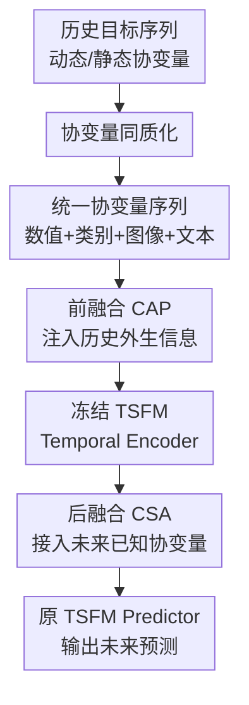

# UniCA: Unified Covariate Adaptation for Time Series Foundation Model

**会议**: ICLR2026  
**OpenReview**: [https://openreview.net/forum?id=I8q4MZb4OP](https://openreview.net/forum?id=I8q4MZb4OP)  
**代码**: https://github.com/hanlu-nju/UniCA  
**领域**: 时间序列基础模型 / 协变量适配  
**关键词**: [时间序列基础模型, 协变量适配, 异构协变量, 多模态预测, Adapter]

## 一句话总结
UniCA 把类别、图像、文本等异构协变量先映射成统一的“隐式时间序列”表示，再用前融合与后融合注意力模块接入冻结的时间序列基础模型，在不破坏预训练泛化能力的前提下提升协变量感知预测效果。

## 研究背景与动机
**领域现状**：时间序列基础模型（Time Series Foundation Model, TSFM）已经开始像 NLP 和视觉里的 foundation model 一样，通过大规模预训练获得跨领域的零样本或少样本预测能力。Chronos、TimesFM、Moirai、Time-MoE 等模型大多把输入看作目标序列本身，重点学习跨数据集共享的时间依赖、趋势、季节性和尺度变化。

**现有痛点**：现实预测任务通常不只有目标序列。电力负荷会受天气影响，零售销量会受门店、商品、节假日和促销影响，太阳能发电还可能依赖卫星图像，宏观指标预测则可能依赖文本报告。问题在于，很多 TSFM 的架构和预训练方式默认输入是实值时间序列，最多能自然处理和目标同形的数值协变量；一旦协变量变成类别、文本、图像或任务特有的静态属性，就很难直接塞进模型。

**核心矛盾**：如果为每个任务重新训练一个协变量感知模型，可以适配本任务的外部信息，但会丢掉大规模 TSFM 的泛化优势；如果直接使用冻结的 TSFM，又会忽略大量关键外生信号。更棘手的是，协变量的类型和时间可见性不同：有些只在历史窗口可见，有些未来已知，有些是静态 ID，有些是多模态观测。一个真正通用的方案需要同时满足兼容性、普适性和泛化保持。

**本文目标**：作者希望构造一个轻量适配框架，让已有 TSFM 不需要大改架构、不需要全参数重训，就能处理一般协变量感知预测任务。这里的一般协变量既包括实值同构协变量，也包括类别变量、文本、图像等异构协变量，还要能区分历史协变量、未来已知协变量和静态协变量的作用位置。

**切入角度**：论文的关键观察是，异构协变量难用，并不一定是因为它们必须保持原始模态进入 TSFM；如果能把它们转成随时间变化的高层连续表示，它们就可以和普通数值协变量一起被当作“时间序列协变量”处理。这样既绕开了为每种模态定制预测器的问题，也让 TSFM 继续在自己擅长的时间序列表示空间里工作。

**核心 idea**：UniCA 用协变量同质化（Covariate Homogenization）把异构协变量变成统一的连续序列表示，再用前后两处注意力融合模块把过去和未来协变量注入冻结 TSFM，从而把“协变量丰富但模态混杂”的预测任务改写成 TSFM 可处理的统一适配问题。

## 方法详解
### 整体框架
UniCA 的输入是历史目标序列 $Y_{1:T}$、动态协变量 $C_{1:T+H}$ 和静态协变量 $S$，输出是未来预测 $\hat{Y}_{T+1:T+H}$。它把一个预训练 TSFM 拆成 tokenizer $T(\cdot)$、temporal encoder $E(\cdot)$ 和 predictor $P(\cdot)$ 三段，然后只在这些段之间插入轻量 adapter，TSFM 主干参数保持冻结。

整体流程可以理解成三步：先把图像、文本、类别等异构协变量转成同质化的连续协变量序列；再在进入 temporal encoder 之前，用历史协变量补充目标 token；最后在 encoder 之后，用未来已知协变量再次校正隐表示并交给原 predictor 预测。

这里的“统一”不是简单拼接原始特征，而是把各种异构输入都投影到时间对齐的连续协变量空间。对 TSFM 来说，后续看到的是一组额外的同构序列；对下游任务来说，类别 ID、卫星图像、文本报告等信息仍然能通过 adapter 影响预测。

### 关键设计
**1. 协变量同质化：把异构模态变成 TSFM 能理解的隐式时间序列**

现有 TSFM 不擅长直接处理图像、文本、类别 ID 这类协变量，因为它们和目标序列不在同一个表示空间。UniCA 的做法是先用模态专属编码器提取异构特征，例如图像用 CNN，文本用预训练文本 encoder，类别变量用 embedding，然后通过一个协变量同质化器（Covariate Homogenizer, CH）映射成连续的时间序列协变量：$C^{het}_{1:T+H}=CH(H^{het}_{1:T+H})$。

这个设计的关键不在于 CH 很复杂，恰恰相反，论文默认使用简单线性层。它更像一个“模态到时间序列空间”的连接器，把图像/文本中的高层语义压成若干条随时间变化的隐藏协变量。映射后，观察到的数值协变量和同质化后的异构协变量可以沿时间维对齐并拼接成统一的 $C_{1:T+H}\in\mathbb{R}^{(T+H)\times M}$。这样，后续融合模块不需要知道某条协变量原本来自卫星图像还是商品 ID，只需要判断它在当前预测场景里是否有用。

这个处理同时解决了 universality 和 compatibility 两个问题：universality 体现在各种协变量最终都进入同一套融合机制；compatibility 体现在 TSFM 主干仍然只处理时间序列 token，不需要为每种新模态重写骨干架构。

**2. 前融合 CAP：在编码前让历史协变量参与时间模式抽取**

很多外生因素只在历史窗口中可见，例如过去的天气、过去的销售促销、过去的图像观测。若等 temporal encoder 已经把目标序列编码完再加这些信息，模型可能已经错过了“目标走势为什么这样变化”的解释线索。UniCA 因此在 encoder 前加入 pre-fusion module，用 Conditional Attention Pooling（CAP）把历史协变量注入目标 token。

具体来说，目标序列先经过 TSFM tokenizer 得到 $Z=T(Y_{1:T})$。历史动态协变量 $C_{1:T}$ 也通过同一个 tokenizer 形成 $E_{C_{1:T}}$，静态协变量 $S$ 通过新初始化 embedding 层得到 $E_S=\rho(S)$。CAP 用 GRN 生成每个时间 token 上不同协变量的注意力权重，再对协变量表示做加权池化：$Z_{C_{1:T}}=CAP(E_{C_{1:T}}\mid E_S)$。随后 UniCA 不是直接替换目标 token，而是用 GLU 做门控残差：$\tilde{Z}=Z+GLU(Z_{C_{1:T}})$。

这一点很重要，因为协变量在不同数据集上的价值差异很大，有些协变量是强信号，有些只是噪声。CAP 让模型可以按样本、时间和静态条件选择协变量，GLU 则控制注入强度，避免 adapter 把目标序列本身的预训练表示冲掉。换句话说，pre-fusion 的角色不是“把所有特征都塞进去”，而是让 encoder 在抽取时间依赖时看到经过筛选的外部上下文。

**3. 后融合 CSA：在预测前补入未来已知协变量而不改 TSFM 主干**

未来已知协变量对预测尤其关键，例如节假日、计划促销、天气预报或未来时间特征。这些信息天然对应预测区间 $T+1:T+H$，如果只在历史编码阶段处理，会很难精确影响每个未来时间点。UniCA 因此在 temporal encoder 之后加入 post-fusion module，把未来已知协变量接到 encoded representation 上。

做法是先把未来协变量 $C_{T+1:T+H}$ token 化，再用同样的 CAP 机制选出相关的未来协变量表示 $Z_{C_{T+1:T+H}}=CAP(E_{C_{T+1:T+H}}\mid E_S)$。然后 UniCA 将历史目标的编码表示 $\tilde{H}$ 与未来协变量表示拼接，送入一个 self-attention 层：$[\hat{H},\hat{Z}_{C_{T+1:T+H}}]=SelfAttn([\tilde{H},Z_{C_{T+1:T+H}}])$。最后仍然用原 TSFM predictor 输出 $\hat{Y}_{T+1:T+H}=P(\hat{H})$。

这个 post-fusion 设计相当于把“未来条件”放在离预测头更近的位置。它不要求 TSFM 在预训练时就见过这些任务特定协变量，也不需要改 predictor 的语义；adapter 只负责把未来外生信息转成与隐藏状态可交互的上下文。论文的融合位置消融显示，不同前后位置组合差异不算大，说明 UniCA 的注意力融合本身较稳健，但默认的过去前融合、未来后融合符合信息可见性的直觉。

### 一个完整示例
假设要预测未来 24 小时的太阳能发电。输入里有过去发电量 $Y_{1:T}$，还有数值天气预报、站点经纬度和按时间对齐的卫星图像。传统 TSFM 只能直接读过去发电序列；普通 covariate-aware 模型可以拼数值天气，但很难自然利用图像。

UniCA 会先用图像 encoder 把每个时间点的卫星图像转成 dense feature，再用线性 CH 投成几条隐藏协变量序列，例如某一维可能捕捉云层周期性，另一维可能反映整体辐照趋势。数值天气协变量和这些隐藏图像协变量合并后，在 pre-fusion 中影响历史 token 的编码，让模型知道过去发电波动可能来自云层或温度变化；到 post-fusion 阶段，未来天气预报或未来已知协变量继续与隐藏状态交互，使预测头在生成 24 小时曲线时能参考未来外部条件。

这个例子也解释了论文可视化里的现象：同质化后的图像协变量不再像原始图片那样难解释，而是呈现出与发电目标相关的周期和趋势；attention map 则显示模型会在不同时间点关注不同协变量，而不是机械地平均所有外生信号。

### 损失函数 / 训练策略
UniCA 的训练目标跟所接入的 TSFM 保持一致。Chronos 和 TimesFM 使用 quantile loss，Time-MoE 使用 Huber loss，Moirai 使用 negative log likelihood。这样的选择避免了 adapter 训练目标和原 foundation model 预训练目标发生错位。

训练时，TSFM 主干参数冻结，只更新 CH、pre-fusion、post-fusion 和相关 embedding 等适配模块。优化器使用 Adam，学习率在 $10^{-3}$、$10^{-4}$、$10^{-5}$、$10^{-6}$ 中搜索，batch size 在 8 到 64 中选择，最大 100 epoch，并使用 ReduceLROnPlateau 和 early stopping。为处理不同序列尺度，论文还对每个目标实例按历史均值和标准差做 instance normalization。

异构协变量的同质化维度 $d_{het}$ 是一个重要但不需要很大的超参。论文搜索 $\{1,2,4,8,16\}$，并在更细消融中观察到从 1 增加到 4 收益明显，超过 8 后收益趋缓甚至可能过拟合，因此默认采用 $d_{het}=4$。

## 实验关键数据
### 主实验
论文在 12 个单模态协变量数据集、Time-MMD 文本协变量多模态数据集和 MMSP 图像协变量多模态数据集上评估 UniCA。所有指标都相对 Naive baseline 做归一化，越低越好；Time-MMD 和单模态主要报告 MAPE，MMSP 因为目标接近 0 时 MAPE 不稳定，主指标使用 MAE。

| 场景 | 代表模型 | 主指标 | 结果 | 对照结论 |
|------|----------|--------|------|----------|
| 12 个单模态协变量数据集 | Chronos-Bolt + UniCA | 平均 MAPE | 0.506 | 优于 Chronos-Bolt ZS 的 0.522、SFT 的 0.514，也优于多数专用模型 |
| 12 个单模态协变量数据集 | TimesFM + UniCA | 平均 MAPE | 0.514 | 明显优于 TimesFM LR 的 0.557，与强 TSFM 适配方法处于第一梯队 |
| Time-MMD（TS-Text） | TimesFM + UniCA | 平均 MAPE | 0.601 | 优于 TimesFM ZS 的 0.648、SFT 的 0.776，也强于 Time-LLM 的 0.766 |
| MMSP（TS-Image） | Chronos-Bolt + UniCA | MAE | 0.193 | 优于 Chronos-Bolt ZS 的 0.200 与 SFT 的 0.225 |
| MMSP（TS-Image） | TimesFM + UniCA | MAE | 0.229 | 优于 TimesFM SFT 的 0.258，低于 TFT+CH 的 0.168 |

一个值得注意的结论是，UniCA 并不是在所有单项上都压过最强专用模型。例如 MMSP 上 TFT+CH 的 MAE 最好，说明在某些特定图像-时间序列场景里，强任务专用结构仍有优势。但 UniCA 的价值在于同一套适配框架能跨 TSFM、跨单模态/多模态协变量稳定提升，而不需要为每个任务重新设计完整模型。

### 消融实验
| 配置 | 关键指标 | 说明 |
|------|---------|------|
| Moirai ZS | 单模态平均 MAPE 0.593 | 直接使用预训练模型时，协变量依赖难以被充分学习 |
| Moirai + UniCA | 单模态平均 MAPE 0.523 | 适配后所有指标均优于预训练零样本版本，说明 covariate adapter 有效 |
| Chronos-Bolt + UniCA，全量微调主干 | 单模态平均 MAPE 0.535 | 全参数微调没有带来更好泛化，可能破坏预训练知识 |
| Chronos-Bolt + UniCA，冻结主干 | 单模态平均 MAPE 0.506 | 冻结 TSFM + adapter 更稳，符合“保留泛化能力”的设计目标 |
| 线性 CH | MMSP/Time-MMD 综合表现略优 | 简单线性同质化器已经足够，MLP 没有稳定收益 |
| CH 维度 $d_{het}=4$ | 多指标进入稳定低误差区间 | 从 1 到 4 收益明显，继续增大收益递减且可能冗余 |
| TFT + CH | MMSP MAE 0.168，Time-MMD MAPE 1.035 | CH 也能迁移到专用模型，MMSP 明显受益但文本任务仍不如 UniCA+TSFM |
| TiDE + CH | MMSP MAE 0.206，Time-MMD MAPE 0.856 | 相比原 TiDE，MMSP 和 Time-MMD 都有提升，说明同质化本身是通用 trick |

### 关键发现
- UniCA 最核心的收益来自“冻结主干 + 轻量适配”。在 Chronos-Bolt 上，冻结主干的 UniCA 平均 MAPE 为 0.506，而全量微调版本为 0.535，说明下游数据并不一定足以安全重塑 TSFM 参数。
- 协变量同质化不是只服务 TSFM 的工程补丁。把 CH 加到 TFT、TiDE 这类专用模型上也能提升 MMSP 和 Time-MMD，说明“先把多模态协变量变成时间对齐的连续序列”本身就是有效建模假设。
- 注意力融合带来一定可解释性。案例分析中，模型会把较高权重分给与目标走势相关的协变量，例如 MMSP 里的特定图像协变量和 GFC14 里的温度类协变量，而不是平均使用所有输入。
- 效率开销较小。UniCA 主要增加线性同质化器、CAP/GLU 和少量 self-attention，推理时间和参数量增幅在论文报告中都较低，适合当作 TSFM 的 plug-in adapter。

## 亮点与洞察
- **把异构协变量“时间序列化”很干净**：论文没有试图让 TSFM 直接理解文本或图像，而是把模态信息先压成高层连续协变量。这让复杂多模态问题重新落回时间序列基础模型熟悉的表示空间，是一个很朴素但很有效的抽象。
- **前后融合对应协变量的信息可见性**：历史协变量用于解释过去目标走势，所以放在 encoder 前；未来已知协变量直接影响预测区间，所以放在 encoder 后、predictor 前。这个结构比“所有协变量一次性拼接”更符合 forecasting 任务的时间因果关系。
- **冻结主干的结果比全量微调更有说服力**：很多 TSFM 适配论文容易默认微调越多越好，但 UniCA 的实验显示，保留预训练 temporal encoder 的泛化能力往往更重要。adapter 的职责是补外生信息，不是重新学习时间序列世界。
- **CH 是可复用组件**：即便不用 UniCA，把 CH 接到 TFT 或 TiDE 上也能改善多模态预测。这说明论文提出的并不是只依赖某个 TSFM 的小技巧，而是一种处理异构协变量的通用接口。
- **对未来实际系统很友好**：现实业务预测里协变量来源经常变化，今天加文本报告，明天加图像或类别 ID。UniCA 的模块化设计意味着新增协变量主要改 encoder/CH，而 TSFM 主干和融合逻辑可以保持稳定。

## 局限与展望
- UniCA 依赖外部模态 encoder 的质量。图像用简单 CNN、文本用 GIST 这类选择在基准上可行，但如果协变量模态很复杂，CH 之前的表示是否包含足够任务信息会成为瓶颈。
- 同质化维度较小带来效率优势，也可能限制表达能力。论文显示 $d_{het}=4$ 在实验中较稳，但更复杂的多模态或高频场景可能需要动态维度、稀疏协变量选择或结构化表示。
- 当前实验覆盖了图像和文本协变量，但还没有充分探索音频、图结构、事件序列、空间网格等更复杂异构输入。UniCA 的原则可迁移，但具体 encoder 和时间对齐方式仍需验证。
- 对未来未知协变量的处理仍然受限。论文统一记号里包含 future-unknown covariates，但实际预测时这些未来值不可见；若未来协变量本身也需要预测，误差传播会影响最终效果。
- 多模态场景并非全面 SOTA。MMSP 上 TFT+CH 的 MAE 优于 TSFM+UniCA，说明在特定数据规模和模态结构下，专用模型仍可能更强。后续可以研究 UniCA 与任务专用结构的混合适配，而不是只在 TSFM 上做 adapter。

## 相关工作与启发
- **vs Moirai**: Moirai 原生支持协变量，通过统一训练机制处理多变量时间序列，但仍主要面向同构时间序列输入。UniCA 更强调下游适配，把类别、文本、图像等异构协变量先同质化，再接入冻结 TSFM。
- **vs ChronosX / LR Adapter**: ChronosX 和线性回归式 adapter 主要围绕数值外生变量或特定 TSFM 结构设计，常需要对未来协变量可见性做假设。UniCA 的优势是把过去、未来和静态协变量分开建模，并用统一 CH 处理异构模态。
- **vs TFT / TiDE / DeepAR**: 这些专用 covariate-aware 模型能从头学习协变量关系，但泛化能力通常依赖单个数据集。UniCA 则借用 TSFM 的预训练能力，只让 adapter 学习协变量如何进入已有时间表示。
- **vs FusionSF / MM-TSF / Time-LLM**: 多模态预测方法通常围绕特定模态组合设计，例如 TS-image 或 TS-text。UniCA 的启发是把多模态协变量当作可转换的时间序列外生信号处理，从而让同一个框架覆盖图像、文本和普通数值协变量。
- **对后续研究的启发**: 更强的方向可能不是继续堆大 TSFM，而是围绕“协变量接口”做文章：如何自动判断协变量价值、如何处理缺失/噪声协变量、如何在不同任务间共享 CH，以及如何让 adapter 对协变量贡献给出可靠解释。

## 评分
- 新颖性: ⭐⭐⭐⭐☆ 把异构协变量同质化后接入冻结 TSFM 的思路简洁明确，创新点不在复杂架构，而在问题抽象和统一接口。
- 实验充分度: ⭐⭐⭐⭐⭐ 覆盖 12 个单模态数据集、两个多模态基准、多个 TSFM 主干和多组消融，证据链比较完整。
- 写作质量: ⭐⭐⭐⭐☆ 论文结构清楚，方法公式和算法流程完整；部分附录表格很长，主文对多模态失败/强弱场景的讨论还可以更细。
- 价值: ⭐⭐⭐⭐⭐ 对真实业务预测很有启发，因为现实场景几乎总是协变量丰富且类型混杂，UniCA 提供了一个可插拔、可迁移的适配范式。

<!-- RELATED:START -->

## 相关论文

- [\[AAAI 2026\] A Unified Shape-Aware Foundation Model for Time Series Classification](../../AAAI2026/time_series/a_unified_shape-aware_foundation_model_for_time_series_class.md)
- [\[ICLR 2026\] Uni-NTFM: A Unified Foundation Model for EEG Signal Representation Learning](uni-ntfm_a_unified_foundation_model_for_eeg_signal_representation_learning.md)
- [\[ICLR 2026\] Adapt Data to Model: Adaptive Transformation Optimization for Domain-shared Time Series Foundation Models](adapt_data_to_model_adaptive_transformation_optimization_for_domain-shared_time_.md)
- [\[ICLR 2026\] COSA: Context-aware Output-Space Adapter for Test-Time Adaptation in Time Series Forecasting](cosa_context-aware_output-space_adapter_for_test-time_adaptation_in_time_series_.md)
- [\[ICLR 2026\] Repurposing Foundation Model for Generalizable Medical Time Series Classification](repurposing_foundation_model_for_generalizable_medical_time_series_classificatio.md)

<!-- RELATED:END -->
