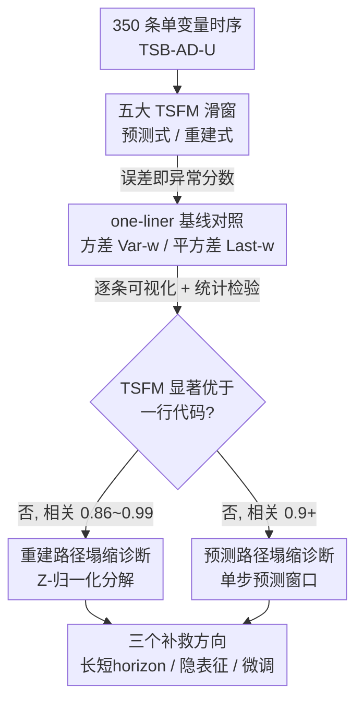

# When Foundation Models Are One-Liners: Limitations and Future Directions for Time Series Anomaly Detection

**会议**: ICLR 2026  
**OpenReview**: [https://openreview.net/forum?id=H27kvyG4qf](https://openreview.net/forum?id=H27kvyG4qf)  
**领域**: 时序异常检测  
**关键词**: 时序基础模型, 异常检测, 重建误差, 预测误差, 基线诊断

## 一句话总结
这篇论文系统验证了 MOMENT、Chronos、TimesFM、Time-MoE、TSPulse 五大时序基础模型（TSFM）在时序异常检测（TSAD）上的真实表现，发现它们在零样本下与「移动窗口方差」「平方差」这两条一行代码就能写完的朴素基线没有显著差别，根因是「异常更难重建/预测」这一核心假设根本不成立，并据此提出三条让 TSFM 真正发挥作用的补救方向。

## 研究背景与动机

**领域现状**：自然语言里「大规模预训练 → 下游涌现能力」的范式被搬到了时序领域，于是出现了一批时序基础模型（TSFM）。它们用单一目标（预测下一个值或重建一段子序列）在海量时序上预训练，期望像 LLM 一样泛化到预测、分类、异常检测等多种下游任务。异常检测（TSAD）是其中一个高价值场景——欺诈检测、故障诊断、健康监测都依赖它。

**现有痛点**：把 TSFM 用于 TSAD 的标准做法是「误差即异常分数」：预测式模型用预测误差当分数，重建式模型用重建误差当分数，背后都假设「异常点更难被预测/重建」。已有的大型评测（Liu & Paparrizos, 2024）声称 TSFM「前景广阔、零样本超越多数统计与神经网络方法」，但这个结论建立在聚合指标（VUS-PR 取平均）之上，而且每个模型族只测了单一尺寸、单一短上下文窗口。

**核心矛盾**：聚合指标会掩盖单条时序上的反直觉细节，而模型尺寸与上下文长度恰恰是 LLM 性能的关键变量却没被扫过。换句话说，「TSFM 在 TSAD 上有效」这个结论可能只是指标的假象——真正该问的是：当前把 TSFM 用于 TSAD 的范式本身是否成立？

**本文目标**：严格回答研究问题——「当前将时序基础模型应用于时序异常检测的方法是否有效？」并在两条主流方法学（预测式、重建式）下，扫遍模型族、模型尺寸（base/large）、上下文窗口（64/256/512，乃至 1024）做敏感性分析。

**切入角度**：作者不迷信聚合指标，而是回到最原始的中间产物——异常分数曲线、重建误差直方图——逐条时序做可视化与一对一比较，并刻意构造两条「一行代码基线」作为照妖镜：如果一个动辄数亿参数的基础模型打不过一行代码，那它在这个任务上的「能力」就值得怀疑。

**核心 idea**：用极简的 one-liner 基线（移动窗口方差、平方差）逐条时序对照 TSFM 的异常分数，证明「异常更难重建/预测」的假设不成立，从而揭示当前范式失效，并指出三条绕开该假设的补救路径。

## 方法详解

### 整体框架

本文不是提出一个新模型，而是一套「诊断 + 处方」的实证研究：先把五大 TSFM 按预训练目标分成预测式（Chronos、TimesFM、Time-MoE）和重建式（MOMENT）两类，再加上同时带两种头的 TSPulse；对每条时序滑动上下文窗口，按标准做法把预测/重建误差转成异常分数。关键一步是引入两条「一行代码基线」——重建式对照移动窗口方差 Var-$w$，预测式对照平方差 Last-$w$/Centered-$w$——在 TSB-AD-U（350 条单变量时序）上用 VUS-PR 评测，但**不依赖聚合指标下结论**，而是逐条做异常分数可视化、一对一散点、重建误差直方图和统计检验（相关系数、$p$ 值、Cohen's $d$）。诊断出失效根因后，作者给出三条补救方向并用定性实验佐证。

### 关键设计

**1. One-liner 基线 + 可视化驱动审视：用一行代码当照妖镜**

针对「聚合指标掩盖真相」这个痛点，作者刻意构造两条朴素到能一行写完的基线。重建式对照**移动窗口方差** Var-$w$：异常分数直接取子序列的方差 $s_{i+\lfloor w/2\rfloor}=\mathrm{variance}(T_{i,i+w-1})$；预测式对照**平方差** Last-$w$/Centered-$w$：用邻域均值当「预测」，分数为 $s_{i+w}=(\mathrm{mean}(T_{i,i+w-1})-x_{i+w})^2$。这两条基线完全不学习、零参数。配套的方法论是「可视化优先」——不满足于看 VUS-PR 平均值，而是把每条时序的原始信号、TSFM 异常分数、基线异常分数叠在一起逐条肉眼比对，再辅以一对一散点图和直方图。正是这种「看中间产物而非看指标」的方式，让作者发现了聚合指标下被平均掉的塌缩现象——这一点呼应了 Wu & Keogh (2023) 的呼吁，却长期被社区低估。

**2. 重建路径塌缩诊断：Z-归一化把异常分数拽成方差的代理**

重建式 MOMENT 为什么几乎等价于移动窗口方差？作者从 MOMENT 流水线里的 z-归一化/反归一化步骤入手做分解：异常分数可以拆成窗口方差 $\sigma_i^2$ 与「归一化后窗口」重建 MSE 的乘积：

$$s_{i+\lfloor w/2\rfloor}\approx \sigma_i^2\cdot \mathrm{MSE}\big(T^{\mathrm{norm}}_{i,i+w-1},\,F^{(\text{reconstruct})}(T^{\mathrm{norm}}_{i,i+w-1})\big)$$

关键观察是：MOMENT-base 对所有归一化窗口的重建 MSE 都恒定地高在 ~1.1 附近，**无论窗口里有没有异常**——这直接戳破了「异常更难重建」的假设。于是乘积里第二个因子几乎不变，异常分数就退化成只由第一个因子 $\sigma_i^2$（即窗口方差）主导，自然和 Var-$w$ 高度一致。把归一化换成 Min-Max 或全局 z-归一化后与基线的相关性下降，反向印证了正是逐窗 z-归一化制造了这种塌缩。即便换成 MOMENT-large、重建 MSE 分布更分散，异常窗口与正常窗口的 MSE 分布仍完全重叠，相对基线依旧没有稳定优势。

**3. 预测路径塌缩诊断：单步预测窗口让异常「不再意外」**

预测式 TSFM 为什么打不过平方差、且只擅长点异常而抓不住序列异常？根因是异常分数只用「给定上下文窗口预测下一个值」的单步误差。当窗口随滑动逐渐覆盖一段序列异常时，模型看到的最近若干观测本身就是异常值，于是预测下一个异常值时它一点也「不意外」、误差很小，异常因此漏检——这再次违背「异常更难预测」的假设。作者指出补救的关键在于**拉长预测 horizon**：当从同一上下文窗口向前预测多步 $\hat T_{t:t+h-1}$ 时，预测不再依赖异常输入，序列异常就会被预测得很差从而暴露出来。这一诊断为后面的补救方向 6.1 埋下伏笔。

**4. 三条补救方向：绕开「误差即异常」的范式**

既然失效根因是「误差即异常分数」这一假设站不住，作者给出三条处方。其一**长短 horizon 集成**：单一固定 horizon $h$ 存在 trade-off——大 $h$ 利于长异常但牺牲短异常灵敏度（Table 6 里 $h$ 从 1 升到 64，长度 170 的序列异常 VUS-PR 从 0.04 升到 0.65，而点异常从 1.0 跌到 0.27），于是用 MAX 操作跨多个 horizon 聚合分数，使观测在「短 horizon 或长 horizon 任一视角下异常」时都拿到高分。其二**在隐表征里检测异常**：TSFM 的隐表征本就编码了趋势、幅度、频率、相位等特征，直接对隐表征做 KNN 即可——MOMENT 用重建误差时 VUS-PR 仅 0.003（32 个检测器里排 31），改用隐表征 KNN 后跃升到 0.250（排第 5）。其三**用带标注异常做端到端微调**：预测/重建目标与「检测异常」根本不对齐，继续在预训练任务上微调只会提升预测/重建而非检测能力；类比 LLM 微调做序列标注，用少量标注异常端到端微调有望让 TSFM 适配到新领域。

## 实验关键数据

### 主实验

实验覆盖五大模型族，每族（除 TSPulse）测两个尺寸、至少三个上下文窗口（64/256/512），在 TSB-AD-U 的 350 条单变量时序上用 VUS-PR 评测。核心结论是 TSFM 与对应 one-liner 基线**统计上无显著差别**：相关系数极高、$p$ 值近乎为 0、效应量 Cohen's $d$ 极小。

| 设置 | TSFM 均值 | 基线均值 | 相关系数 | Cohen's $d$ |
|------|----------|---------|---------|-------------|
| MOMENT-base-512（重建） | 0.311 | 0.313 | 0.991 | -0.047 |
| MOMENT-large-512（重建） | 0.313 | 0.313 | 0.857 | 0.003 |
| Chronos-Bolt-base-512（预测） | 0.297 | 0.284 | 0.927 | 0.102 |
| Time-MoE-large-512（预测） | 0.303 | 0.284 | 0.923 | 0.146 |
| TimesFM-2.0-512（预测） | 0.302 | 0.284 | 0.923 | 0.142 |

TSPulse 即便额外带了频域重建头，零样本下也打不过基线：其重建头 Head$_{\text{time}}$（0.42）与 Var-96（0.42）持平，预测头 Head$_{\text{future}}$（0.30）与 Last-3（0.28）持平，三角化/集成后两者也几乎一样（0.48 vs 0.46）。

### 消融与分析实验

| 配置 / 分析 | 现象 | 说明 |
|------------|------|------|
| 换归一化（Min-Max/全局 z/mean-scaling） | 与基线相关性下降 | 印证逐窗 z-归一化是重建路径塌缩主因 |
| MOMENT-base → large | MSE 分布更分散但异常/正常仍重叠 | 增大模型不改变「异常不更难重建」 |
| 上下文窗口 64→512(→1024) | 无稳定提升 | 增大上下文也救不回来 |
| 预测 horizon $h$=1→64（序列异常） | VUS-PR 0.04→0.65 | 长 horizon 利于长异常 |
| 预测 horizon $h$=1→64（点异常） | VUS-PR 1.0→0.27 | 但牺牲短异常，需 MAX 集成 |
| 隐表征 KNN vs 重建误差（MOMENT） | 0.003→0.250，排名 31→5 | 隐表征路线有潜力 |
| 非 TSFM 检测器 vs 基线 | 相关性普遍很低 | 塌缩是 TSFM 特有，非基线本身强 |

### 关键发现

- **塌缩与模型尺寸/上下文/预测重建性能全都无关**：无论模型多大、窗口多长、预测或重建本身多准，TSFM 在 TSAD 上都退化到一行代码的水平，说明问题出在范式假设而非工程规模。
- **重建路径塌缩源于 z-归一化**：异常分数被分解证明退化为窗口方差的代理；这也解释了为什么少数高相关的非 TSFM 检测器（如 TimesNet）恰好也用了 z-归一化。
- **预测路径塌缩源于单步 horizon**：滑窗使异常进入上下文后「不再意外」，因而漏检序列异常；拉长 horizon 是直接解药，但需跨 horizon 集成兼顾长短异常。
- **方法论启示**：很多高 VUS-PR 其实来自标注问题与指标对微小差异的放大，剔除这些样本后差距进一步缩小——再次说明应看中间产物而非只看聚合指标。

## 亮点与洞察
- **「一行代码当照妖镜」极具说服力**：与其用复杂指标争论谁强一点，不如证明数亿参数模型打不过零参数一行代码——这种对照让结论几乎无可辩驳，是可迁移到任何「基础模型是否真有用」质疑的研究范式。
- **把异常分数做代数分解**：$s\approx\sigma^2\cdot\mathrm{MSE}$ 这一步把「为什么塌缩」从经验观察上升到机制解释，并自然引出归一化消融，逻辑闭环漂亮。
- **诊断与处方一一对应**：单步 horizon 的诊断直接催生长短 horizon 集成，预测/重建目标不对齐的诊断直接催生标注微调——每个未来方向都钉在一个具体失效点上，不是泛泛而谈。
- **「可视化中间产物」被重新强调**：聚合指标会平均掉单条时序的塌缩，这个教训对整个 TSAD 评测社区都有警示意义。

## 局限与展望
- 作者承认三条补救方向只给了定性/案例级证据（如隐表征 KNN、horizon 集成的单条时序示例），尚未做系统化大规模验证，端到端微调更是「超出本文范围」。
- 评测聚焦单变量时序（因多数 TSFM 只原生支持单变量），多变量、跨通道依赖的 TSFM（如 Chronos-2、Toto）只在附录给了初步定性结果。
- 隐表征路线虽优于重建误差，但仍被 KMeansAD 等专用检测器超过，说明「用 TSFM 的表征」本身不是银弹，还需配合更好的检测头。
- 改进思路：把三条方向（长短 horizon 集成、隐表征检测、标注微调）组合成统一框架，并在多变量、多领域 benchmark 上系统评测，是顺理成章的下一步。

## 相关工作与启发
- **vs Liu & Paparrizos (2024)**：他们用聚合 VUS-PR 在单一尺寸/短窗口下得出「TSFM 前景广阔」，本文用同一 benchmark 和指标、但扫遍尺寸与窗口并改看中间产物，得出相反结论——差别在于评测粒度与是否质疑指标本身。
- **vs 标准重建/预测式 TSAD（Schmidl et al., 2022）**：这些方法默认「异常更难重建/预测」，本文用直方图与代数分解证明该假设在 TSFM 上不成立，从根上挑战了误差即分数的范式。
- **vs TSPulse（Ekambaram et al., 2025）**：TSPulse 加频域头并用三角化选头，但仍依赖传统重建/预测方法学，本文证明它因此同样塌缩到 one-liner 水平——多加一个头不解决范式问题。

## 评分
- 新颖性: ⭐⭐⭐⭐⭐ 用一行代码基线证伪「TSFM 适合 TSAD」，视角与执行都犀利
- 实验充分度: ⭐⭐⭐⭐ 五模型族×多尺寸×多窗口扫得很全，但补救方向只给定性证据
- 写作质量: ⭐⭐⭐⭐⭐ 诊断—机制—处方逻辑闭环，可视化与代数分解相互印证
- 价值: ⭐⭐⭐⭐⭐ 既纠正了社区的过度乐观，又给出可操作的三条未来方向

<!-- RELATED:START -->

## 相关论文

- [\[ICLR 2026\] ICDiffAD: Implicit Conditioning Diffusion Model for Time Series Anomaly Detection](icdiffad_implicit_conditioning_diffusion_model_for_time_series_anomaly_detection.md)
- [\[ICLR 2026\] Towards Multimodal Time Series Anomaly Detection with Semantic Alignment and Condensed Interaction](towards_multimodal_time_series_anomaly_detection_with_semantic_alignment_and_con.md)
- [\[ICLR 2026\] T1: One-to-One Channel-Head Binding for Multivariate Time-Series Imputation](t1_one-to-one_channel-head_binding_for_multivariate_time-series_imputation.md)
- [\[ICLR 2026\] Point-wise Anomaly Detection via Fold-bifurcation ODE](point-wise_anomaly_detection_via_fold-bifurcation_ode.md)
- [\[ICML 2026\] IMPACT: Influence Modeling for Open-Set Time Series Anomaly Detection](../../ICML2026/time_series/impact_influence_modeling_for_open-set_time_series_anomaly_detection.md)

<!-- RELATED:END -->
