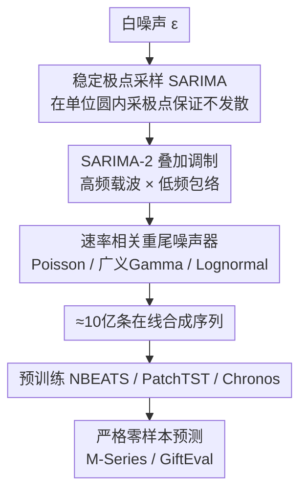

# Zero-shot Forecasting by Simulation Alone

**会议**: ICLR 2026  
**OpenReview**: [https://openreview.net/forum?id=ZOLUTSU5gk](https://openreview.net/forum?id=ZOLUTSU5gk)  
**代码**: 待确认  
**领域**: 时序预测 / 零样本学习 / 合成数据  
**关键词**: 零样本预测, 时序仿真, SARIMA, 合成数据预训练, 基础模型

## 一句话总结
这篇论文提出 SarSim0——一个完全基于稳定 SARIMA 过程的快速时序仿真器，用它在线生成约 10 亿条纯合成序列来预训练通用预测骨干网络，使小模型在严格零样本协议下的预测精度追平甚至超过用真实数据训练的大型基础模型（Chronos、MOIRAI、TimesFM），并在 GiftEval 上出现"学生超过老师"（神经网络超过生成它训练数据的 AutoARIMA）的现象。

## 研究背景与动机

**领域现状**：零样本时序预测（冻结预训练模型、直接在新序列上推理、不做任何参数更新）正在兴起，因为它能省去每个数据集的调参循环、满足低延迟低成本部署需求，并天然契合隐私合规（推理只在本地、没有梯度回传泄露信息）。当前主流路线是仿照 NLP/CV 造"基础模型"——TimeGPT、Chronos、MOIRAI、TimesFM 等，在大规模真实时序语料上预训练。

**现有痛点**：真实时序语料有三个绕不开的问题。一是**规模与许可受限**，可公开汇编的真实序列既少又有版权/隐私约束；二是**领域与采样率偏倚**，汇编数据天然偏向某些频率和行业；三是最致命的**泄漏（leakage）**——train/test 数据集重叠、以及在目标侧做超参搜索，会污染"零样本"的评测完整性，让报出来的零样本能力名不副实。

**核心矛盾**：纯合成数据本可以一举解决上述问题（可控覆盖、可编程稀有事件、保证无泄漏），但此前的合成方案撑不起"只用合成数据"这条路。Chronos 的 KernelSynth 发现只用合成数据会显著掉点、必须掺真实数据；ForecastPFN 用手工拼的趋势/季节模板，表达力和保真度都不够。而且基于高斯核（GP kernel）的生成器**慢得无法在线生成**，导致数据规模被磁盘和生成速度卡死。

**本文目标**：造一个**既快到能在线生成、又保真到能单独支撑零样本预训练**的单变量时序仿真器，让"只用合成数据训练"真正可行，并系统验证它在工业风格基准（趋势/季节/间歇性）上的零样本泛化。

**切入角度**：作者没有去手工拼模板，而是回到统计时序建模的根基——SARIMA。SARIMA 既深植于随机过程理论、又能把指数平滑、Holt-Winters、随机游走、Theta 等经典模型作为特例统一进来，还正是最强零样本基线 AutoARIMA 的内核，因此它天然是一个"老师"。关键观察是：朴素 SARIMA 仿真常因自回归分量不稳定而发散成废序列，但只要**直接在极点空间采样**就能从构造上保证稳定。

**核心 idea**：用"稳定极点采样的 SARIMA + 多季节叠加调制 + 速率相关重尾噪声"三段式仿真器在线造数据，把零样本预测的瓶颈从"找真实数据"转移到"造可控的高保真合成数据"。

## 方法详解

### 整体框架

SarSim0（SARIMA Simulator for Zero-Shot Forecasting）把一条合成序列的生成形式化为三个算子的复合：

$$y_{1:T} = N \circ I \circ S(\epsilon)$$

其中 $S$ 是**结构化基信号生成器**（稳定 SARIMA），负责产出带趋势/季节的良态基波形；$I$ 是**交互/叠加组件**（SARIMA-2），把多条基信号通过加性或乘性调制组合成富含跨频结构的多季节波形；$N$ 是**噪声器**（Noiser），在结构化信号上叠加重尾、速率相关的随机扰动以刻画突发性与间歇性。整条管线的设计被三条预训练需求牵引：(i) 对真实序列母题（季节、趋势、间歇）的结构保真；(ii) 可扩展到十亿级样本而无需存储；(iii) 足够的多样性以支撑跨异质基准的泛化。生成出来的约 10 亿条序列在线喂给 NBEATS / PatchTST / Chronos / MLP 等骨干做预训练，得到的模型在严格零样本协议下直接用于真实目标序列。

### 关键设计

**1. 稳定极点采样的 SARIMA 基生成器：把"会发散"的仿真改造成"构造即稳定"**

朴素地随机给定 ARIMA 的系数 $\alpha, \vartheta$ 再按时域递推展开，会因自回归分量不稳定而产生指数发散的废序列（论文 Figure 2 下半给出了量级达 $10^{22}$ 的发散例子），完全无法用于训练。本文的做法是**不直接采系数，而是直接在极点空间采样**。利用多项式的求和形式与乘积（极点）形式之间的等价关系：

$$\phi(L) = 1 - \sum_{i=1}^{p}\phi_i L^i = \prod_{i=1}^{p}(1 - \varphi_i L)$$

只要所有极点落在单位圆内 $|\varphi_i| < 1$，AR 部分就被理论保证为良态。于是流程变成：先在 $[0, r_{\max}]$ 均匀采半径、在 $[0, 2\pi]$ 采复角得到极点，再用乘积展开（如 numpy 的 `np.poly`）把极点反推回系数。加入季节部分后，AR 侧是一个**稀疏（lacunary）多项式**，季节与非季节因子不可分解、稳定域非凸且数值上很"薄"——$(\phi, \Phi)$ 的微小变化就能把极点推出单位圆。为回避这个数值难题，作者用**混合策略**：以 0.5 概率只取非季节 AR（令所有 $\Phi_j=0$）、以 0.5 概率只取季节 AR（令所有 $\phi_i=0$），每个子情形都易于稳定。整数差分阶固定 $d=D=1$（更高阶易数值发散），并额外引入 $[0,1]$ 间的**分数差分**（用 Hosking 的二项式系数 FIR 滤波器近似 $\varrho_i = \Gamma(i-d')/(\Gamma(-d')\Gamma(i+1))$）来丰富趋势形态。时域递推本身有跨时间的串行依赖无法向量化，作者改为**跨轨迹向量化**：同一组参数下并行展开 $B$ 套不同初值，既加速又因不同初态产生多样实现。

**2. SARIMA-2 叠加调制：用"载波 × 包络"复现真实的双季节与异方差结构**

很多真实序列是**双季节**的——快节奏被慢节奏调制，比如道路交通、网页活跃度、呼叫中心话务的"日内高峰被星期几效应调制"，电力负荷的"日内周期被工作日和年度模式塑形"。单季节模型能抓住快节奏，却抓不住幅度调制和由此诱发的异方差。SARIMA-2 因此组合两条独立、极点稳定的 SARIMA：一条高频"基波/载波" $y^{(b)}$、一条低频"包络" $y^{(e)}$，把包络上采样到基波速率后，用加性或乘性方式组合：

$$\text{加性：}\ y_t \leftarrow y^{(b)}_t + y^{(e)}_t, \qquad \text{乘性：}\ y_t \leftarrow (1 + \omega\,\tilde{y}^{(e)}_t)\,y^{(b)}_t$$

乘性情形里 $\tilde{y}^{(e)}_t$ 被归一化到 $[-1,1]$，调制深度 $\omega \sim \text{Uniform}(0,1)$。这一组合产生**受控的幅度调制**，正好复现"包络压在载波上"的真实结构（如工作日强度的来回摆动）。消融实验证明它是泛化的最大功臣（去掉它掉点最猛），因为它把仿真器从"单一时间尺度"升级为"多尺度耦合"，逼近了工业序列最常见的跨频形态。

**3. 速率相关重尾噪声器：补上季节动力学之外的间歇性与突发性**

纯季节动力学有固定时间尺度，刻画不了零售/备件需求的间歇尖峰与长串零、互联网流量的重尾突发、降水量的伽马型正向冲击这些**非高斯、随局部水平变化**的统计特征。Noiser 模块 $N$ 实现一个随机速率噪声过程 $\eta_t \sim \mathcal{N}_\kappa(\lambda_t)$，其中速率 $\lambda_t = g(y_t) \ge 0$ 把噪声强度系在局部均值水平上（异方差），形状超参 $\kappa$ 控制过离散与偏度。速率按下式归一化并采样强度：

$$\lambda_t = \lambda_0 (y_t - \min_t y_t)/(\max_t y_t - \min_t y_t), \qquad \lambda_0 \sim \text{LogUniform}[\lambda_{\min}, \lambda_{\max}]$$

作者实现三种互补噪声族：**Poisson** $\eta_t \sim \text{Poisson}(\lambda_t)$ 产生间歇需求的计数尖峰；**广义 Gamma** 先 $\eta'_t \sim \text{Gamma}(\lambda_t, \kappa)$ 再做随机幂变换 $\eta_t = [\eta'_t]^\zeta$ 引入可控突发性；**Lognormal** $\eta'_t \sim \text{LogNormal}(\lambda_t, \kappa)$ 产生乘性重尾冲击模拟波动率。三者构成一个紧凑、仿真友好的工具箱，覆盖实践中主要的非高斯、水平相关扰动，同时保持大规模在线生成的高效。⚠️ 三种噪声族的具体参数化以原文为准。

### 损失函数 / 训练策略

骨干网络以**多步多分位**经验风险最小化训练。给定分位点 $\tau=(\tau_1,\dots,\tau_Q)$，单个分位损失为 $\rho_\tau(y,\hat y) = \tau(y-\hat y)_+ + (1-\tau)(\hat y-y)_+$，单样本的多步多分位损失对 $H$ 个 horizon 和所有分位求平均：

$$L_{H,Q} = \frac{1}{HQ}\sum_{h=1}^{H}\sum_{\tau\in\boldsymbol{\tau}}\rho_\tau\big(y_{T+h}, \hat y^{(\tau)}_{T+h}\big)$$

训练设置：NBEATS 训练 250k 步、PatchTST 与 Chronos 训练 500k 步，模型一次性预测 512 个 horizon。零样本协议严格——所有模型选择只在合成源语料的划分上做，推理时对真实目标序列**不调任何参数或超参**。同样设置下还训练了 ForecastPFN 与 KernelSynth 两种基线合成生成器作对照（KernelSynth 因生成太慢只能落盘 1000 万条）。

## 实验关键数据

### 主实验

在 GiftEval（23 个数据集、7 个领域、10 种采样频率）与 M-Series（M1/M3/M4/Tourism，超 10 万条序列）上，用 sCRPS 和 MASE 评测（越低越好）。下表为加权聚合主结果节选：

| 模型 | GiftEval sCRPS | GiftEval MASE | M-Series sCRPS | M-Series MASE | 推理时间(分) | 零样本 |
|------|------|------|------|------|------|------|
| Chronos-Base（真实数据预训练） | 0.647 | 0.870 | 0.103 | 0.878 | 2103 | ✓ |
| MOIRAI-Large | 0.599 | 0.874 | 0.128 | 1.027 | 3976 | ✓ |
| TimesFM | 0.680 | 1.077 | 0.098 | 0.930 | 155 | ✓ |
| AutoARIMA（每条序列拟合，"老师"） | 0.912 | 1.074 | 0.096 | 0.843 | 420 | ✗ |
| NBEATS-KernelSynth | 0.686 | 0.978 | 0.116 | 1.033 | - | ✓ |
| NBEATS-ForecastPFN | 1.070 | 1.354 | 0.113 | 0.979 | - | ✓ |
| **NBEATS-SarSim0** | 0.602 | 0.849 | 0.096 | 0.869 | **46** | ✓ |
| **PatchTST-SarSim0** | **0.573** | **0.837** | 0.097 | 0.877 | 47 | ✓ |
| **Chronos-SarSim0** | 0.608 | 0.878 | 0.100 | 0.896 | 52 | ✓ |

关键观察：(1) 纯合成数据训练的 PatchTST-SarSim0 在 GiftEval 上 sCRPS=0.573、MASE=0.837，**优于所有真实数据预训练的大基础模型**；(2) SarSim0 全面碾压更昂贵的 KernelSynth / ForecastPFN 合成管线；(3) 小模型（NBEATS）配 SarSim0 就追平甚至略超 Chronos 这类大模型，且推理时间快一两个数量级（46 分 vs 2103 分）；(4) 在 GiftEval 上 SarSim0 训练的模型反超生成其训练数据的 AutoARIMA——"学生超过老师"。

### 消融实验

逐组件去除，验证 SARIMA-2 与 Noiser 的贡献（越低越好）：

| 配置 | GiftEval sCRPS | GiftEval MASE | M-Series sCRPS | M-Series MASE | 说明 |
|------|------|------|------|------|------|
| PatchTST-SarSim0-500K | 0.573 | 0.837 | 0.097 | 0.877 | 完整模型 |
| PatchTST No SARIMA-2-250K | 0.647 | 0.926 | 0.103 | 0.929 | 去掉叠加调制，GiftEval 掉点最猛 |
| PatchTST No Noisers-250K | 0.594 | 0.859 | 0.096 | 0.861 | 去噪声器在 GiftEval 掉点、M-Series 反升 |
| NBEATS-SarSim0 | 0.602 | 0.849 | 0.096 | 0.869 | 完整模型 |
| NBEATS No SARIMA-2 | 0.655 | 0.913 | 0.104 | 0.941 | 去掉叠加调制，跨骨干一致掉点 |
| NBEATS No Noisers | 0.609 | 0.856 | 0.096 | 0.860 | 去噪声器影响较小 |

### 关键发现
- **SARIMA-2 是泛化的最大功臣**：去掉它在两个骨干、两个基准上一致造成最大掉点（如 PatchTST GiftEval sCRPS 0.573→0.647），印证"多季节调制"才是把仿真器与真实工业序列对齐的关键。
- **Noiser 的作用与数据集/预算相关**：在 250K 训练预算下，去掉 Noiser 在嘈杂异质的 GiftEval 上掉点，但在规整、短、低噪的 M-Series 上反而略升；把 PatchTST 预算加到 500K 后，带 Noiser 才在 M-Series 上恢复、同时保住 GiftEval 优势——说明重尾噪声需要更多迭代才能被充分利用。
- **"学生超过老师"是数据集相关的**：在异质、嘈杂的 GiftEval 上神经网络明显反超 AutoARIMA；但在规整低噪的 M-Series 上 AutoARIMA 仍很强、效应是混合的。这种涌现式泛化更出现在异质噪声大的基准上。
- **保真度可视化（Figure 3）**：M4-Monthly 真实窗口与 SARIMA 合成窗口在 UMAP 嵌入里按季节分层且局部交织，说明仿真器不仅匹配边缘分布，还匹配短滞后自协方差与窄带峰。
- **超参鲁棒**：对 SarSim0 配置做敏感性研究，各配置在两基准上表现都与默认接近，说明它不处于脆弱的"甜点"，配置基本与基准无关。

## 亮点与洞察
- **在极点空间采样保证稳定**：这是全文最巧的一招——不直接采会发散的系数，而是采单位圆内的极点再反推系数，把"祈祷别发散"变成"构造上一定稳"，让 SARIMA 真正可用于大规模在线造数据。这个思路可迁移到任何需要稳定 IIR/线性递归系统采样的仿真场景。
- **把"老师"当数据引擎而非预测器**：AutoARIMA 一直是强零样本基线，本文不直接用它预测，而是用它的生成过程（SARIMA）造训练数据去训神经网络，最后学生反超老师——这把经典统计模型的归纳偏置"蒸馏"进了神经骨干。
- **速度即规模**：因为仿真器比核方法快几个数量级，才得以在线生成约 10 亿条序列、不落盘，彻底绕开真实数据的许可/泄漏/偏倚问题。"快"在这里不是工程细节，而是让"纯合成预训练"成立的前提。
- **小模型 + 多样合成数据 ≈ 大模型**：结果暗示数据多样性与规模能部分替代架构复杂度，NBEATS 这种全连接设计配 SarSim0 就能逼近大基础模型，对算力受限的部署很有吸引力。

## 局限与展望
- **目标域偏工业风格**：方法面向趋势/季节/间歇主导的工业序列；作者也承认在更规整低噪的 M-Series 上"学生超过老师"效应是混合的、AutoARIMA 仍很强，泛化优势是数据集/领域相关的。
- **只做单变量**：SarSim0 是单变量仿真器，没有覆盖多变量/跨通道依赖（对比 TimePFN 等多变量合成方案），跨变量耦合的零样本预测仍是开放问题。
- **季节稳定性的工程妥协**：因季节-非季节联合多项式稳定域非凸难采，作者退而用"0.5 概率只取非季节 / 0.5 只取季节"的混合策略，并非直接采任意双重季节 SARIMA，表达力上有所牺牲（双季节靠 SARIMA-2 在外层补回）。
- **噪声器参数化偏经验**：三种噪声族及其 LogUniform 强度采样更多是经验工具箱，⚠️ 具体超参以原文为准；不同领域是否需要定制噪声族未充分探讨。
- **改进思路**：把极点采样推广到多变量稳定性约束、或让噪声族/季节结构按目标域元信息自适应采样，可能进一步提升对超出工业风格序列（论文也测了目标域外行为）的泛化。

## 相关工作与启发
- **vs KernelSynth (Chronos)**：他们用高斯核组合生成合成样本来**增强**真实数据，发现纯合成会显著掉点；本文用稳定 SARIMA，既快几个数量级又保真到能**纯合成**训练，且全面优于 KernelSynth。
- **vs ForecastPFN**：他们手工拼趋势/季节模板 + 乘性 Weibull 噪声；本文扎根随机过程动力学（稳定 SARIMA + 分层季节 + 重尾噪声），保真度和实验结果都远胜（ForecastPFN 在 GiftEval sCRPS 高达 1.07）。
- **vs AutoARIMA**：AutoARIMA 是每条序列在线拟合的强统计基线（非零样本）；本文把它的生成内核 SARIMA 当数据引擎，训出的神经网络在 GiftEval 上反超它，且推理快近 10 倍。
- **vs Chronos / MOIRAI / TimesFM 等真实数据基础模型**：它们靠大规模真实语料预训练、面临泄漏与许可风险；本文证明纯合成数据训练的小模型在严格零样本协议下就能追平甚至超过它们。

## 评分
- 新颖性: ⭐⭐⭐⭐⭐ 首个快到能在线造 10 亿条、又保真到能纯合成支撑零样本预训练的时序仿真器，极点空间采样的思路干净有力。
- 实验充分度: ⭐⭐⭐⭐⭐ 两大基准、多骨干、与两种合成基线和多个真实数据基础模型对比，并有保真度可视化、消融、超参敏感性、域外测试。
- 写作质量: ⭐⭐⭐⭐⭐ 动机—方法—结论逻辑链清晰，三段式仿真器形式化简洁，"学生超过老师"的结论有节制（指出其数据集相关性）。
- 价值: ⭐⭐⭐⭐⭐ 把零样本预测从"找真实数据"解放到"造可控合成数据"，对隐私合规、低算力部署有直接落地意义。

<!-- RELATED:START -->

## 相关论文

- [\[ICLR 2026\] Relational Transformer: Toward Zero-Shot Foundation Models for Relational Data](relational_transformer_toward_zero-shot_foundation_models_for_relational_data.md)
- [\[NeurIPS 2025\] TiRex: Zero-Shot Forecasting Across Long and Short Horizons with Enhanced In-Context Learning](../../NeurIPS2025/time_series/tirex_zero-shot_forecasting_across_long_and_short_horizons_with_enhanced_in-cont.md)
- [\[ICML 2025\] VisionTS: Visual Masked Autoencoders Are Free-Lunch Zero-Shot Time Series Forecasters](../../ICML2025/time_series/visionts_visual_masked_autoencoders_are_free-lunch_zero-shot_time_series_forecas.md)
- [\[ACL 2025\] Revisiting LLMs as Zero-Shot Time-Series Forecasters: Small Noise Can Break Large Models](../../ACL2025/time_series/revisiting_llms_as_zero-shot_time_series_forecasters_small_noise_can_break_large.md)
- [\[ICLR 2026\] CPiRi: Channel Permutation-Invariant Relational Interaction for Multivariate Time Series Forecasting](cpiri_channel_permutation-invariant_relational_interaction_for_multivariate_time_se.md)

<!-- RELATED:END -->
