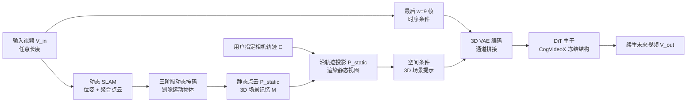

# 3D Scene Prompting for Scene-Consistent Camera-Controllable Video Generation

**会议**: ICLR 2026  
**OpenReview**: [https://openreview.net/forum?id=3XxoBwMusJ](https://openreview.net/forum?id=3XxoBwMusJ)  
**项目主页**: [https://cvlab-kaist.github.io/3DScenePrompt](https://cvlab-kaist.github.io/3DScenePrompt)  
**代码**: 待确认  
**领域**: 视频生成 / 相机可控视频生成  
**关键词**: 相机可控视频生成、场景一致性、3D 场景记忆、动态 SLAM、时空双重条件  

## 一句话总结
本文提出 **3DScenePrompt**，用「时序相邻帧 + 静态 3D 点云投影视图」的双重时空条件，从任意长度输入视频续生下一段视频，在精确相机控制的同时保持与整段历史的场景一致性。

## 研究背景与动机
- **领域现状**：相机可控视频生成已从「凭空生成可控视角视频」发展到「沿用户指定相机轨迹扩展一张图或一小段片段」。代表方法如 CameraCtrl、MotionCtrl、AC3D 把 Plücker 坐标等相机嵌入通过 ControlNet 注入扩散模型，能精确跟随轨迹。
- **现有痛点**：这些方法只能吃**极短的条件序列**（通常就几帧），无法理解更长的视频，因而丢失了长视频里丰富的场景上下文。video-to-future-video 方法（如 Cosmos-Predict2）用时序滑动窗只取最后几帧，当相机**回访早期视角**（窗口外）时无法维持长程空间一致性。
- **核心矛盾**：场景一致的相机可控生成需要同时满足三件互相冲突的事——① 静态元素要全程保持一致，而动态元素（行人、车）应从最近状态自然演化，**不能**把 50 帧前那个人僵在原位搬到 200 帧；② 相机控制需要理解底层 3D 几何（遮挡、合成、外推未观测区域）；③ 还得在可行算力内完成，naive 处理全部输入帧会因自注意力的平方复杂度而爆炸。
- **本文目标**：定义并解决 **scene-consistent camera-controllable video generation** 任务——给任意长度上下文视频 $V_{in}\in\mathbb{R}^{L\times H\times W\times3}$ 和目标相机轨迹 $C$，生成与整段场景几何一致的后续 $T$ 帧 $V_{out}$。
- **核心 idea**：**重新定义视频模型「引用历史」的方式**——视频里的「相邻」不只是时间上的，也可以是**空间上的**。当相机回访相似视角时，要生成的帧其实与很早之前的帧空间相邻。由此提出**双重时空条件**：时序窗口保运动连续性，空间窗口保场景一致性；并用**只含静态几何的 3D 场景记忆**把空间条件里的动态内容剔除，避免把过去的动态元素错误地"冻结复现"。

## 方法详解

### 整体框架
3DScenePrompt 基于 CogVideoX-I2V-5B，把它原本的单图条件通道改造成「时序+空间」双输入。整条管线分三步：① 对输入视频跑**动态 SLAM** 得到相机位姿和聚合点云；② 用**三阶段动态掩码**剔除运动物体，得到只含静态几何的点云 $P_{static}$，连同位姿构成 3D 场景记忆 $M$；③ 把 $M$ 沿用户指定轨迹**投影**出几何一致的渲染视图作为"3D 场景提示"，与最后几帧一起 channel-wise 拼接喂给冻结的 DiT 主干续生未来视频。

### 关键设计

**1. 双重时空滑动窗：把"相邻"从时间扩展到空间**。现有方法只沿时间轴取最后 $w$ 帧，相机一旦回访窗口外的区域就失忆。作者不去暴力增大 $w$（会触发自注意力的平方代价），而是新增一条**空间窗口**，按与目标视角的相似度检索"3D 视角接近"的帧，与时间无关。最终条件写成 $V_{out}=\mathcal{F}(\tilde V_{in},\mathcal{T},C)$，其中 $\tilde V_{in}=\{\text{Temporal}(w)\}\cup\{\text{Spatial}(T)\}$。这样模型既能从最近 $w$ 帧继承运动动态，又能引用很久以前观测过同一空间的帧来维持一致，而**不必处理全部 $L$ 帧**。但直接检索过去的原始帧会把当年的动态元素一起搬过来，于是空间条件必须只提供"持久的静态结构"——这就引出了 3D 场景记忆。

**2. 静态 3D 场景记忆 + 三阶段动态掩码：让空间提示只保留几何、放走动态**。先用动态 SLAM 估计位姿与聚合点云 $(\hat C, P)=\text{DSLAM}(V_{in})$；但 $P$ 里静态、动态混杂，直接聚合会让运动物体在多个位置留下"鬼影"。作者设计三阶段掩码彻底剔除动态：① **像素级运动检测**——用 SEA-RAFT 算光流，与相机自运动诱导的光流作差，超阈值 $\tau$ 的区域标记为潜在动态，$M_i^{pixel}=\mathbb{1}[\|\text{Flow}_{optical}-\text{Flow}_{warp}\|_1>\tau]$；② **反向跟踪聚合**——用 CoTracker3 把各帧采样点回溯到 $t=0$，捕捉"开始静止后来移动"的物体；③ **SAM2 传播**——把聚合点作 prompt 生成完整物体级掩码 $M_i^{obj}$。最终静态几何 $P_{static}=\bigcup_{i=1}^{L}P_i\odot(1-M_i^{obj})$，场景记忆 $M=(\hat C, P_{static})$。消融显示去掉掩码 PSNR 直降约 0.8dB（13.05→12.23），因为鬼影会污染空间条件。

**3. 3D 场景提示：投影代替检索，免额外相机编码就能精确控相机**。有了 $P_{static}$ 后，作者**不直接检索 $T$ 帧**，而是对每个目标位姿 $C_t$ 把最相关的若干输入帧的静态点投影出来：$\text{Spatial}(t)=\Pi(K\cdot C_t\cdot P_{static}^{(n)})$，其中 $P_{static}^{(n)}$ 取按视场重叠度排序的 top-$n$ 空间相邻帧（$n=7$）。投影天然只含静态内容、与目标位姿几何对齐，且多视角点云互补还能填补被动态物体遮挡的区域。这些投影视图就是"3D 场景提示"——它们**显式编码了相机应看到什么**，因此模型无需任何额外相机嵌入模块就能精确控相机；实验也证实增大时序窗口 $w$ 对控相机几乎无帮助，控制力来自空间提示而非更多时序上下文。

**4. 最小改动复用预训练先验**。时序条件取最后 $w=9$ 帧，空间条件取 $T$ 张投影视图，两者经冻结 3D VAE 编码后 channel 拼接 $Z_{cond}=E[\text{Concat}(\text{Temporal}(w),\text{Spatial}(T))]$，复用 CogVideoX 原有的图像条件通道。DiT 主干完全不动，保住全部预训练视频先验，仅用 4×H100 全量微调 4K 步（约 48 小时）。

## 实验关键数据

### 主实验
**空间与几何一致性**（对比唯一同任务基线 DFoT，回访轨迹上评估）：

| 方法 | RealEstate10K PSNR↑ | SSIM↑ | LPIPS↓ | MEt3R↓ | DynPose-100K PSNR↑ | MEt3R↓ |
|------|------|------|------|------|------|------|
| DFoT | 18.30 | 0.596 | 0.308 | 0.1812 | 12.15 | 0.1832 |
| **3DScenePrompt** | **20.89** | **0.717** | **0.212** | **0.0408** | **13.05** | **0.1242** |

几何一致性指标 MEt3R 误差**下降约 77%**（0.041 vs 0.181），多视角对齐显著更好。

**相机可控性**（DynPose-100K）：

| 方法 | mRotErr(°)↓ | mTransErr↓ | mCamMC↓ |
|------|------|------|------|
| MotionCtrl | 3.565 | 7.823 | 9.783 |
| CameraCtrl | 3.327 | 9.599 | 11.212 |
| AC3D | 3.068 | 9.704 | 11.163 |
| DFoT | 2.398 | 8.087 | 9.233 |
| **Ours (w=9)** | **2.377** | **7.417** | **8.635** |

**视频质量**（FVD↓ / VBench++）：3DScenePrompt FVD **127.5**，远低于 FloVD（171.3）、AC3D（281.2）、CameraCtrl（737.1）；主体/背景一致性、美学、成像、运动平滑等子项全面领先。

### 消融实验

| 配置 | 动态掩码 | PSNR↑ | SSIM↑ | LPIPS↓ | MEt3R↓ |
|------|------|------|------|------|------|
| n=1 | ✓ | 13.02 | 0.373 | 0.377 | 0.1248 |
| n=4 | ✓ | 13.04 | 0.373 | 0.376 | 0.1249 |
| n=7 | ✗ | 12.23 | 0.306 | 0.382 | 0.1349 |
| **n=7** | ✓ | **13.05** | 0.367 | 0.381 | 0.1242 |

### 关键发现
- **动态掩码不可或缺**：去掉后 PSNR 掉约 0.8dB、SSIM 从 0.367 崩到 0.306，鬼影污染空间条件。
- **空间相邻帧数 $n=7$ 即饱和**：再增加（甚至 $n=L$）几乎无提升，说明 7 帧已提供足够空间上下文且省算力。
- **控相机靠空间提示而非时序窗口**：$w=1$ 与 $w=9$ 在控相机指标上几乎相同。

## 亮点与洞察
- **重新定义"相邻"**：把视频条件从纯时序扩展到时空双轴，是一个简洁却切中长程一致性要害的视角转换。
- **用静态 3D 记忆解耦"该保持的"和"该演化的"**：静态几何持久、动态从最近时序自然生长，干净地化解了"过去动态不该复现"这一任务独有矛盾。
- **投影视图一举两得**：既当空间一致性提示，又因几何对齐天然成为相机控制信号，省掉额外相机编码模块。
- **最小侵入式**：DiT 主干完全冻结、仅复用图像条件通道，4K 步微调即可，工程成本低、保住预训练先验。

## 局限与展望
- **强依赖动态 SLAM 与掩码质量**：SLAM 位姿/重建出错或掩码漏检漏分（如缓慢运动、薄结构）会直接污染场景记忆与投影视图。
- **静态/动态二分假设**：对半静态、形变、流体等介于两者之间的内容，硬性二分可能失效。
- **未观测区域仍需生成模型外推**：投影只能填补曾被观测过的几何，全新区域的合理性仍受生成先验限制。
- **基线对比偏窄**：场景一致性维度只与 DFoT 一家直接可比（任务太新），可比性证据相对有限。
- 输出帧数 $T$ 固定、对超长序列的检索/投影开销随 $L$ 增长，超长 horizon 的可扩展性待验证。

## 相关工作与启发
- **单帧/多帧相机可控生成**（CameraCtrl、MotionCtrl、VD3D、CameraCtrl2、Seaweed-APT2）：只考虑时序相邻，受内存约束无法对长视频维持场景一致——本文用 SLAM 引入空间相邻。
- **几何接地视频生成**（Gen3C、TrajectoryCrafter）：同样用动态 SLAM 抬到 3D，但局限于输入时空覆盖内的动态新视角合成，整段 warp 不区分动静；本文核心差异是**跨越时间边界续生**，必须在 3D 构建时选择性掩除动态。
- **长程一致生成**（ReCamMaster、StarGen 假设静态世界、DFoT 用历史引导）：要么丢动态、要么受内存限制；本文双重时空 + SLAM 空间记忆按需检索最相关帧，兼顾算力与一致性。
- **启发**：把"3D 几何记忆 + 投影提示"作为可控条件的范式，可推广到长视频编辑、世界模型、仿真数据生成等需要"持久空间+自然动态"的场景。

## 评分
- **新颖性**: ⭐⭐⭐⭐⭐ — 把视频条件从时序拓展到时空双轴、并用静态 3D 记忆解耦动静，是切中长程一致性痛点的原创视角。
- **实验充分度**: ⭐⭐⭐⭐ — 一致性/可控性/质量三维度多基线对比 + 关键消融充分；但场景一致性维度可直接对比的基线偏少。
- **写作质量**: ⭐⭐⭐⭐⭐ — 动机层层递进、图示清晰、公式与管线对应良好。
- **价值**: ⭐⭐⭐⭐ — 面向影视、VR、机器人、合成数据等长视频续生场景有直接应用价值，工程改动小、易复用。

<!-- RELATED:START -->

## 相关论文

- [\[CVPR 2026\] CineScene: Implicit 3D as Effective Scene Representation for Cinematic Video Generation](../../CVPR2026/video_generation/cinescene_implicit_3d_as_effective_scene_representation_for_cinematic_video_gene.md)
- [\[CVPR 2026\] Geometry-as-context: Modulating Explicit 3D in Scene-consistent Video Generation to Geometry Context](../../CVPR2026/video_generation/geometry-as-context_modulating_explicit_3d_in_scene-consistent_video_generation_.md)
- [\[ICLR 2026\] MoCa: Modeling Object Consistency for 3D Camera Control in Video Generation](moca_modeling_object_consistency_for_3d_camera_control_in_video_generation.md)
- [\[ICLR 2026\] NewtonGen: Physics-consistent and Controllable Text-to-Video Generation via Neural Newtonian Dynamics](newtongen_physics-consistent_and_controllable_text-to-video_generation_via_neura.md)
- [\[CVPR 2026\] Diff4Splat: Repurposing Video Diffusion Models for Dynamic Scene Generation](../../CVPR2026/video_generation/diff4splat_controllable_4d_scene_generation_with_latent_dynamic_reconstruction_m.md)

<!-- RELATED:END -->
