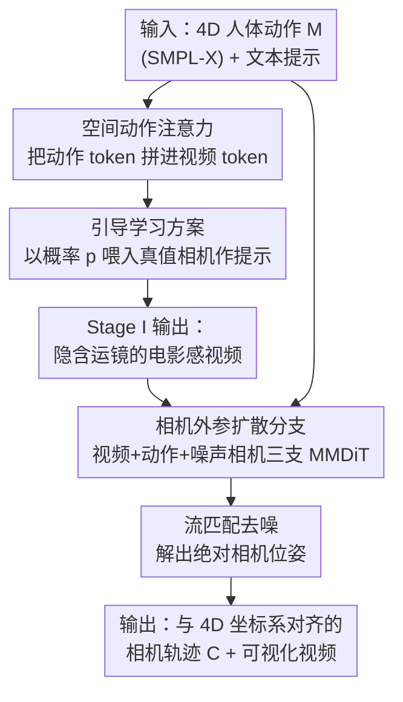

# AdaViewPlanner: Adapting Video Diffusion Models for Viewpoint Planning in 4D Scenes

**会议**: ICLR2026  
**OpenReview**: [https://openreview.net/forum?id=c2EfS9E5CJ](https://openreview.net/forum?id=c2EfS9E5CJ)  
**代码**: [项目主页](https://yuli0103.github.io/AdaViewPlanner/)  
**领域**: 视频生成 / 扩散模型 / 4D 视角规划  
**关键词**: 文本到视频扩散、相机轨迹规划、4D 场景、计算电影摄影、世界模型

## 一句话总结
把预训练文本到视频（T2V）扩散模型当成"虚拟摄影师"，通过两阶段范式——先让它根据 4D 人体动作生成隐含专业运镜的视频、再用一个相机外参扩散分支把视角显式抽出来——实现了在 4D 场景中自动规划相机轨迹，开放域泛化和文本可控性大幅超过专用模型。

## 研究背景与动机
**领域现状**：把 4D 场景（动态 3D 内容）渲染成好看的视频，关键在于设计虚拟相机的运镜。这件事过去靠"自动电影摄影/相机规划"技术来做，主流方案是在有限数据集上训练专用模型，比如 E.T.（文本+角色轨迹条件）、DanceCamera3D（音乐+舞蹈姿态条件）等。

**现有痛点**：这些专用模型在特定场景（如舞蹈）里效果不错，但有两个硬伤——一是**泛化差**，换到开放世界的多样场景就崩；二是**缺乏偏好控制**，很难用自然语言文本指令去指挥镜头风格。说到底，它们见过的数据太窄，学不到"什么动作配什么镜头"的通用电影知识。

**核心矛盾**：要让相机规划既泛化又可控，必须有一个见过海量影片、内化了"运镜—场景"对应关系的先验。专用模型天生没有这个先验，而从头训一个又拿不到那么多带相机标注的 4D 数据。

**本文目标**：在不重新训练大模型的前提下，给定 4D 人体动作（SMPL-X 关节序列）和文本提示，输出一条与场景坐标系对齐的相机外参序列 $C \in \mathbb{R}^{f\times 9}$（3D 平移 + 6D 旋转表示），并附带一段可视化视频。

**切入角度**：作者的关键洞察是——近年的 T2V 模型本身就是在大量影片上训练的，它生成的动态视频天然带着专业运镜，这说明模型内部已经隐式知道"镜头该怎么跟着动作走"。视频里本就隐含着视角，那何不把这份"电影摄影专长"借出来，用来反推相机轨迹？

**核心 idea**：不把相机规划当回归问题，而是**复用视频生成先验**——分两步走：第一步让 T2V 模型据动作生成隐含相机运动的视频（视角藏在画面里），第二步再用一个专门的相机扩散分支把视角从"视频+动作"里显式解码出来。

## 方法详解

### 整体框架
方法要解决的是：输入只有视角无关的 4D 人体动作 $M \in \mathbb{R}^{f\times k\times 3}$（$k=22$ 个 SMPL-X 关节）加文本提示，输出与该动作坐标系对齐的相机轨迹。整体走两阶段：**Stage I** 把动作注入冻结的 T2V 主干，让模型自主生成带电影感运镜的视频——此时相机轨迹"隐含"在生成画面中；**Stage II** 再搭一个相机外参扩散分支，把 Stage I 生成的视频 + 原始动作骨架一起喂进去，用流匹配去噪出绝对相机位姿。因为整条链路继承了 T2V 模型的能力，文本提示既能控制场景上下文也能控制运镜风格。

### 关键设计

**1. 空间动作注意力：把无相机标注的 4D 动作塞进冻结的视频模型**

第一个问题是怎么让 T2V 模型"看懂"人体动作，而又不破坏它的生成先验。作者借鉴 3DTrajMaster 的思路，用一个姿态编码器把动作序列 $M$ 映成隐嵌入 $z_m \in \mathbb{R}^{f'\times k\times d}$，其中时间下采样模块把时间分辨率 $f'$ 对齐到 VAE 编码后的视频隐变量。然后沿空间维度把视频 token $z_v^{(t)}$ 和动作 token $z_m$ 拼起来：$T = [z_v^{(t)}; z_m] \in \mathbb{R}^{f'\times(h\cdot w+k)\times d}$，再做标准自注意力 $z_v^{(t)} = z_v^{(t)} + \text{Truncate}(\text{Attn}(q,k,v))$，其中 Truncate 丢掉动作 token 的输出、只保留更新后的视频 token。这样做的好处是：注意力借助逐帧的天然对应关系让视频内容跟动作对齐，而且**只训练新增的动作编码器和注意力层、冻结视频主干**，从而最大限度保留预训练运镜知识。

**2. 引导学习方案：用课程式真值提示防止训练崩塌**

只给动作、让模型自己脑补出"既符合 3D 人体动力学、又满足电影构图、还要渲染出隐含相机轨迹"的视频，这个任务太难，直接无引导学习会训练崩塌——因为渲染视频和 4D 内容之间的投影关系是有歧义的（同一个动作可以配无数种运镜）。作者的解法是课程学习：以概率 $p$ 把真值相机位姿 $z_c$（用一个结构与人体姿态编码器对称的独立编码器编码）也拼进 token 序列：

$$T = \begin{cases} [z_v^{(t)}; z_m; z_c] \in \mathbb{R}^{f'\times(hw+k+1)\times d}, & \text{以概率 } p, \\ [z_v^{(t)}; z_m] \in \mathbb{R}^{f'\times(hw+k)\times d}, & \text{以概率 } 1-p. \end{cases}$$

也就是说有一半时间（实验里 $p=0.5$）给模型"偷看"正确相机当提示，先学会"给定视角下把动作渲染对"，再逐步过渡到自主设计相机。此外用 3D 空间 RoPE 编码动作 token、用姿态专属 RoPE 区分动作与相机 token。这一招把一个原本会发散的联合学习问题拆成了有难度梯度的渐进学习，是 Stage I 能稳定收敛的关键。

**3. 三分支 MMDiT 相机外参扩散：把视角从视频里显式"解码"出来而非"估计"出来**

Stage I 生成的视频里相机轨迹是隐含的，得把它显式抽出来并对齐到 4D 动作坐标系。一个直觉做法是用现成的相机估计算法（如从视频做 SfM），但作者指出两个致命问题：(1) 估出来的位姿还要复杂后处理才能对齐人体动作坐标系；(2) AI 生成视频常有几何/纹理不一致，基于特征匹配的估计会抖动、断裂甚至重建失败。于是作者改成**直接估计**：用 MMDiT 框架搭三个专门分支——视频分支（从预训练视频模型初始化）、相机分支、人体动作分支（后两者随机初始化、用简化的空间注意力+FFN）。采用流匹配目标训练模型预测把噪声相机参数搬向干净参数的向量场，训练时视频 token $z_v$ 和动作 token $z_m$ 作干净条件、相机 token $z_c^{(t)}$ 随时间步与噪声线性混合，多模态空间注意力作用在拼接 token 上：$q=[q_v; q_m; q_c^{(t)}]$，$k$、$v$ 同理。为什么有效：视频提供运镜信息、动作提供参考坐标系，两者一起约束，模型直接回归出**绝对**位姿，绕开了特征匹配对生成视频伪影的敏感，也省掉了坐标对齐的后处理。

**4. 合成数据 + 4D 重建统一坐标系：让训练拿到精确相机标注**

直接估计模型需要"视频—精确相机位姿"配对，真实数据很难拿。作者用 Unreal Engine 渲染合成数据（提供多样人体动作 + 精确相机参数），训练时混合 101k MultiCamVideo、43k HumanVid UE 和 100k 内部 UE 视频；并用 GVHMR 重建 4D 人体动作、把相机和人体动作数据统一到同一坐标系。Stage II 还分两阶段训：先训 10k 步预测相对相机位姿，再引入人体动作分支训 40k 步预测绝对位姿。这套数据管线解决了"绝对位姿监督从哪来"的根本困难。

### 损失函数 / 训练策略
Stage I：从 1B 参数的 Transformer T2V 主干初始化，先在 400k 未过滤视频（$384\times 672$）上训 15k 步，再在 10k 条精选带运镜的高质量内部视频上微调 10k 步；Adam，16 张 H800，批大小 64，学习率 $5\times 10^{-5}$，timestep shift=15，相机引导概率 0.5，冻结主干只训动作编码器与空间动作注意力层。Stage II：采用流匹配目标，分相对位姿（10k 步）→ 绝对位姿（40k 步）两阶段，timestep shift 降到 1。推理时两模型都用 50 步采样。

## 实验关键数据

### 主实验
在 E.T. 测试集（精修到 500 样本）和作者自建测试集（240 样本）上对比 E.T. 与 DanceCam*（用本文骨架格式重新实现的 DanceCamera3D）。评估分规则、MLLM（Gemini 2.5 Pro）、用户研究三类。

| 测试集 | 方法 | HMR↓ | Jerk_t↓ | Dist_t↑ | TCC↑ | CSD↑ | 用户偏好%↑ |
|--------|------|------|---------|---------|------|------|-----------|
| E.T. | E.T. | 0.064 | 0.001 | 0.538 | 0.850 | 0.608 | 23.81 |
| E.T. | DanceCam* | 0.053 | 0.013 | 1.236 | 0.975 | 0.569 | 14.29 |
| E.T. | **Ours (Full)** | **0.044** | 0.007 | **2.826** | **1.125** | **0.686** | **61.90** |
| Ours | E.T. | 0.048 | 0.001 | 0.700 | 0.790 | 0.623 | 20.83 |
| Ours | DanceCam* | 0.024 | 0.014 | 1.535 | 0.867 | 0.593 | 15.83 |
| Ours | **Ours (Full)** | **0.018** | 0.003 | 1.415 | **1.385** | **0.711** | **63.33** |

HMR（人体丢失率）更低说明镜头更以人为中心；Dist（镜头多样性）更高说明相机能在 360° 空间更自由地取景；TCC/CSD 说明轨迹更跟随文本、运镜风格更丰富；用户偏好两个测试集都超 60%，碾压两个 baseline。E.T. 因为把人体退化成单点轨迹，运镜简单；DanceCam* 即便同数据训练也因任务发散而收敛到单一轨迹。

### 消融实验
表 2 是 4D 人体动作控制的对比（用 GVHMR 从生成视频重建姿态算 MPJPE，单位 mm）：

| 配置 | TikTok WA-MPJPE↓ | General WA-MPJPE↓ | 说明 |
|------|------------------|-------------------|------|
| MTVCrafter (Wan-2.1-14B) | 73.47 | 224.50 | 固定正面视角 baseline |
| Ours w/o Guided Learning | 72.60 | 127.68 | 去掉引导学习，通用域大掉 |
| Ours w/o 3D RoPE | 82.59 | 122.13 | 去掉 3D RoPE，舞蹈域掉点 |
| **Ours (Full)** | **71.65** | **103.92** | 完整模型，通用域优势巨大 |

表 3 针对相机轨迹生成的设计消融：

| 配置 | HMR↓ | TCC↑ | Reproject IoU↑ | 说明 |
|------|------|------|----------------|------|
| Stage II w/o Motion | 0.027 | 0.931 | 0.226 | 去掉动作条件，出现视角错误 |
| Stage II Relative Cam | 0.039 | 1.413 | 0.325 | 只预测相对位姿，有尺度感知问题 |
| **Ours (Full)** | **0.018** | 1.385 | **0.338** | 预测绝对位姿，重投影最准 |

### 关键发现
- **引导学习是稳定训练的命脉**：去掉后通用域 WA-MPJPE 从 103.92 飙到 127.68，印证了无引导直接学会因投影歧义而退化。
- **动作条件不能省**：Stage II w/o Motion 重投影 IoU 从 0.338 掉到 0.226 并出现视角错误，说明人体动作分支提供的参考坐标系对正确解出视角至关重要。
- **绝对位姿优于相对位姿**：Relative Cam 变体虽 TCC 略高但有尺度感知问题、重投影 MSE 更大，证明直接预测绝对位姿更利于与 4D 坐标对齐。
- **通用域优势远大于舞蹈域**：在 TikTok 舞蹈域只是追平 MTVCrafter，但通用域大幅领先（103.92 vs 224.50），得益于在更广动作分布上训练。

## 亮点与洞察
- **"视频里本就藏着视角"这个洞察很巧**：与其把相机规划当成一个孤立的回归任务，不如承认 T2V 模型生成视频时已经隐式做了运镜决策，把它解码出来即可——这把一个数据稀缺的标注问题转化成了对生成先验的利用。
- **两阶段解耦"生成"与"提取"很干净**：先让模型在像素空间表达视角（它擅长），再用扩散分支把视角从像素回到参数空间（结构化输出），各司其职，避免了端到端硬回归相机参数的不稳定。
- **用扩散去噪做相机外参估计、绕开特征匹配**：AI 生成视频的几何不一致会坑死传统 SfM，改用条件扩散直接出绝对位姿，是处理"不完美视频"的可迁移思路——任何下游要从生成视频里提取几何量的任务都可借鉴。
- **课程式真值提示（概率 $p$ 喂相机）防崩塌**：这套"先看答案、再独立做"的渐进监督，对任何存在投影歧义、容易训练发散的条件生成任务都有参考价值。

## 局限与展望
- **只验证了"运动的人"这一类 4D 场景**：作者为简化只考虑人体作为主要语境，对多物体、复杂场景、非人主体的相机规划还未验证。
- **重度依赖合成数据（UE 渲染）**：Stage II 的绝对位姿监督主要来自 Unreal Engine 合成，真实拍摄场景与合成之间的域差可能影响落地效果。
- **继承了 T2V 主干的代价与约束**：1B 主干 + 50 步采样 + 两阶段各自的扩散，推理成本不低；且整套能力上限被预训练视频模型的运镜分布所框定。
- **评估指标仍较新**：作者自建了规则/MLLM/用户研究三套评估并承认旧指标（FCD、CS）有分布偏差，新指标的普适性与可复现性还有待社区检验。

## 相关工作与启发
- **vs E.T. (Director)**：E.T. 把角色建模成单点轨迹做文本+轨迹条件的相机生成，丢失了复杂动作信息导致轨迹单调；本文用完整 4D 骨架 + 视频先验，运镜多样性（Dist_t 2.826 vs 0.538）和电影感大幅领先。
- **vs DanceCamera3D**：DanceCamera3D 在舞蹈/音乐域专用训练，换任务会因发散而塌缩成单一轨迹；本文借 T2V 通用先验天生具备开放域泛化。
- **vs MTVCrafter / ISA-4D（人体视频控制）**：这些方法要么用固定视角 2D 姿态、要么需要 4D 姿态+相机参数作输入；本文只用归一化 4D 人体姿态，由视频模型自己规划视角与运镜，通用域 MPJPE 显著更优。
- **vs Uni3C / RealisMotion**：它们把角色嵌入统一 3D/世界坐标实现动作与相机联合控制，本文则强调"让视频模型当世界模型自主决定视角"，更进一步把相机交给生成先验而非显式约束。

## 评分
- 新颖性: ⭐⭐⭐⭐⭐ 首个把 T2V 生成先验用于 4D 视角规划、"视频隐含视角"洞察 + 两阶段解耦设计很有想象力
- 实验充分度: ⭐⭐⭐⭐ 规则/MLLM/用户研究三套评估 + 多组消融较扎实，但 baseline 偏少、依赖自建指标
- 写作质量: ⭐⭐⭐⭐ 动机推导清晰、两阶段叙述明确，公式与图配合到位
- 价值: ⭐⭐⭐⭐⭐ 为"视频生成模型作世界模型"的 4D 交互方向提供了有说服力的概念验证，思路可迁移

<!-- RELATED:START -->

## 相关论文

- [\[ICLR 2026\] Vid2World: Crafting Video Diffusion Models to Interactive World Models](vid2world_crafting_video_diffusion_models_to_interactive_world_models.md)
- [\[CVPR 2026\] DriveLaW: Unifying Planning and Video Generation in a Latent Driving World](../../CVPR2026/video_generation/drivelaw_unifying_planning_and_video_generation_in_a_latent_driving_world.md)
- [\[ICCV 2025\] SteerX: Creating Any Camera-Free 3D and 4D Scenes with Geometric Steering](../../ICCV2025/video_generation/steerx_creating_any_camera-free_3d_and_4d_scenes_with_geometric_steering.md)
- [\[ICLR 2026\] Target-Aware Video Diffusion Models](target-aware_video_diffusion_models.md)
- [\[ICLR 2026\] LikePhys: Evaluating Intuitive Physics Understanding in Video Diffusion Models via Likelihood Preference](likephys_evaluating_intuitive_physics_understanding_in_video_diffusion_models_vi.md)

<!-- RELATED:END -->
