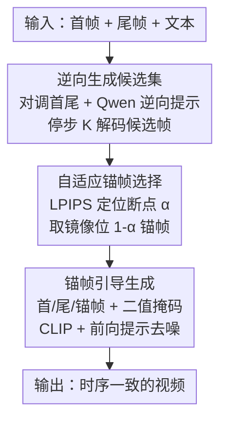

# Anchor Frame Bridging for Coherent First-Last Frame Video Generation

**会议**: ICLR2026  
**OpenReview**: [https://openreview.net/forum?id=isNjWnVsUR](https://openreview.net/forum?id=isNjWnVsUR)  
**代码**: 待确认  
**领域**: 视频生成  
**关键词**: 首尾帧视频生成, 锚帧, 训练无关, 时序一致性, 扩散模型

## 一句话总结
针对首尾帧视频生成（FLF2V）中间帧语义衰减、画面崩坏的问题，本文提出训练无关的 Anchor Frame Bridging（AFB）：在视频时序断裂最严重的位置自适应插入一帧"锚帧"，把首尾帧的语义"接力"到中段，在 Wan2.1-I2V 上 FVD 提升 16.58%、PSNR 提升 10.21%。

## 研究背景与动机
**领域现状**：首尾帧视频生成（First-Last Frame Video Generation, FLF2V）让用户给定第一帧和最后一帧，再加一句文本提示，模型自动补出中间连贯的运动过程，是可控视频生成里很有价值的一个新任务。由于从头训练一个能吃首尾帧条件的大模型代价极高，主流做法（如 Wan2.1-FLF2V、Make Pixels Dance）都是复用现成的图生视频（I2V）模型，把首尾帧当成控制条件拼进去。

**现有痛点**：这类复用 I2V 的方法存在严重的"中间帧信息衰减"。首尾帧携带的确定性语义在向中段传播时逐渐减弱，导致中间帧场景扭曲、主体变形、肢体错乱；而为了和结尾帧衔接，最后几帧又会突然"抢戏"采用结尾帧的属性，造成突兀跳变和时序抖动。

**核心矛盾**：作者通过可视化 DiT 自注意力发现根因——在自注意力层里，只有相邻帧之间有显著的帧间注意力值，首尾帧对中段帧的注意力权重很低。也就是说，首尾帧的确定性语义在"注意力传不到"的中段必然衰减，这是架构层面的固有问题，不是简单调参能解决的。配套的 LPIPS 分析也显示：靠近首帧的部分一致性高，中后段一致性骤降。

**本文目标**：在不重新训练大模型的前提下，把首尾帧的语义"补"到中段，消除连续性断点处的崩坏，恢复整段视频的时序一致性。

**切入角度**：既然注意力只在相邻帧之间强，那就在断裂最严重的位置直接放一帧高质量、语义对齐的"锚帧"——它作为新的局部锚点，能把首尾帧的语义通过相邻注意力一段段接力传递下去。

**核心 idea**：用"在时序断点处自适应插入一帧锚帧"代替"复杂的前向/反向去噪融合"，以训练无关、即插即用的方式桥接首尾帧到中间帧的语义连续性。

## 方法详解

### 整体框架
AFB 的输入是首帧 $I_0$、尾帧 $I_{N-1}$ 和文本提示，输出是一段中间帧连贯的视频。整体分两步：**第一步**用"自适应锚帧选择"模块挑出一帧最合适的锚帧及其插入位置；**第二步**用"锚帧引导生成"把首帧、尾帧、锚帧一起当条件喂回 I2V 模型，生成最终视频。

关键洞察是"逆向生成"：作者观察到中间帧质量低会拖累后续帧，所以视频前段质量普遍较好、断裂往往出现在中后段。如果把首尾帧位置对调再生成一遍，那么原本"中后段断点"对应的位置，在逆向视频里反而靠近开头、质量很高——正好可以拿来当锚帧。而且断点位置在前向/反向生成中近似关于中点对称，所以前向断点 $\alpha$ 对应的高质量锚帧就在逆向视频的镜像位置 $1-\alpha$。

### 关键设计

**1. 逆向生成构建候选锚帧集：让高质量帧出现在我们需要的地方**

直接在前向视频里找锚帧没用——断点处的帧本身就是崩坏的低质量帧。作者的巧思是把首尾帧位置对调：给定首帧 $I_0$、尾帧 $I_{N-1}$，交换后用 Qwen 生成一条逆向文本提示 $P^{rev}=\text{Qwen}(I_{N-1}, I_0)$，并把交换后的首末帧经 VAE 编码为条件 $z_c=E(I_{N-1}, I_0)$，再走一遍去噪 $z_{t-1}=\text{update}(z_t, u_\theta(z_t; t, z_c, c_{P^{rev}}); t)$。由于逆向视频"前段质量好"的位置正好对应前向视频"中后段崩坏"的位置，逆向序列就成了一个天然的高质量候选库。为了省算力，去噪不必跑满，可在停步 $K\le T$ 处终止，用预测的干净样本 $\hat z_0=\frac{z_t-\sqrt{1-\bar\alpha_t}\,\epsilon_\theta(z_t,t)}{\sqrt{\bar\alpha_t}}$ 解码出候选帧集合 $\{I_n\}_{n=0}^{N-1}$。$K=T$ 是完整逆向，$K<T$ 是加速变体。

**2. 自适应锚帧选择：用 LPIPS 定位断点并取镜像锚帧**

有了候选集还要解决两个问题：插在哪、用哪一帧。作者定义一个帧质量评估函数 $Q$，用 LPIPS 衡量——LPIPS 用预训练深度网络模拟人眼感知，相邻帧 LPIPS 越大说明连贯性越差。具体地，$Q(I_n)=-\frac{1}{2}(\text{LPIPS}(I_{n-1},I_n)+\text{LPIPS}(I_n,I_{n+1}))$，即局部平均 LPIPS 取负，所以 $Q$ 越小帧越烂。前向视频里质量最差帧的位置 $n_p=\arg\min_n Q(I_n)$ 就是最严重的断点，归一化为相对位置 $\alpha=n_p/(N-1)$。由于断点在前向/反向生成中近似对称，要修补前向 $\alpha$ 处的衰减，就从逆向候选集里取镜像位置 $n_a=(N-1)(1-\alpha)$ 的帧作为锚帧 $I_a$——这一帧在逆向生成里靠近开头、几乎不受信息衰减影响，质量高且语义对齐，是理想的锚帧。

**3. 锚帧引导生成：把锚帧当条件注入，掩码控制只生成缺失帧**

拿到锚帧后，要把首帧 $I_0$、尾帧 $I_{N-1}$、锚帧 $I_a$ 一起作为条件喂回模型，并且告诉模型"这三帧已经有了、别重新生成"。作者设计了一个指示器（indicator）来区分哪些帧需要生成、哪些已给定。以 Wan2.1-I2V 为例，引入二值掩码 $M\in\{0,1\}^{1\times N\times h\times w}$，1 表示保留、0 表示待生成。三帧条件与零填充帧沿时间轴拼成引导帧 $I_c\in\mathbb{R}^{C\times N\times H\times W}$，经编码得 $z_c=E(I_c)$。同时用 CLIP 图像编码器抽取首尾帧特征拼成条件向量 $c_i=[c_0, c_{N-1}]$，通过解耦交叉注意力注入 DiT。文本侧再用 Qwen 从首尾帧生成前向提示 $P^{fwd}=\text{Qwen}(I_0, I_{N-1})$ 得到 $c_{P^{fwd}}$。最终去噪 $z_{t-1}=\text{update}(z_t, u_\theta(z_t; t, m, c_i, c_{P^{fwd}}, z_c); t)$，锚帧位于 $\alpha$ 处，把首尾帧语义稳稳接力到中段，输出一致性更高的视频。

### 损失函数 / 训练策略
AFB 是**训练无关、即插即用**的，不引入任何新参数、不微调底座模型，所有操作都发生在推理阶段（逆向采样 + LPIPS 选帧 + 条件注入），可直接挂到 Wan2.1-I2V、HunyuanVideo-I2V 等现成 I2V 模型上。

## 实验关键数据

### 主实验
在自建的 436 对首尾帧数据集（采自 DAVIS、RealEstate10K 及公开视频）上，把 AFB 挂到 Wan2.1-I2V 与 HunyuanVideo-I2V，与 Wan2.1-FLF2V、ViBiDSampler、Generative Inbetweening 对比：

| 方法 | LPIPS ↓ | FVD ↓ | SSIM ↑ | PSNR ↑ | GPT-4o ↑ | Gemini ↑ |
|------|---------|-------|--------|--------|----------|----------|
| ViBiDSampler | 0.19 | 426.15 | 0.90 | 33.08 | 82.06 | 82.88 |
| Generative Inbetweening | 0.24 | 453.76 | 0.85 | 31.25 | 75.42 | 72.15 |
| HunyuanVideo-I2V | 0.25 | 496.32 | 0.82 | 31.48 | 73.28 | 71.69 |
| HunyuanVideo + AFB | 0.21 | 435.71 | 0.89 | 32.54 | 81.33 | 79.26 |
| Wan2.1-I2V | 0.22 | 449.68 | 0.87 | 32.13 | 79.31 | 76.43 |
| Wan2.1-FLF2V | 0.19 | 413.68 | 0.91 | 33.20 | 84.23 | 84.94 |
| **Wan2.1 + AFB** | **0.16** | **375.12** | **0.97** | **35.41** | **88.64** | **89.35** |

Wan2.1 + AFB 全面领先：相比 Wan2.1-I2V，FVD 从 449.68 降到 375.12（提升 16.58%），PSNR 从 32.13 升到 35.41（提升 10.21%）；挂到 HunyuanVideo 上也一致改善，说明方法对底座模型有泛化性。

### 消融实验

| 消融维度 | 配置 | 关键指标 | 说明 |
|----------|------|---------|------|
| 锚帧数量 $N_a$ | $N_a=1$ | FVD 375.12 / PSNR 35.41 | 5s 视频下单锚帧最优 |
| 锚帧数量 $N_a$ | $N_a=2$ | FVD 386.94 / PSNR 34.27 | 约束过强，运动流畅度下降 |
| 锚帧数量 $N_a$ | $N_a=3$ | FVD 397.50 / PSNR 30.49 | 多锚帧相互竞争，质量进一步退化 |
| 停步 $K$ | $K=15$ | FVD 388.45 / +35% 耗时 | 接近满步质量，性价比最高 |
| 停步 $K$ | $K=50$ | FVD 375.12 / +105% 耗时 | 满步最优但开销翻倍 |
| 文本提示 | 通用提示 | FVD 475.33 | "a nice video" 这类泛提示 |
| 文本提示 | Qwen 定制 | FVD 375.12 | 对齐首尾语义的详细提示 |

### 关键发现
- **单锚帧就够**：5s 视频下单个锚帧效果最好，加到 2、3 个反而退化。作者归因于多锚帧引入相互竞争的约束、过度约束生成轨迹，降低运动流畅度和多样性；但对更长视频，多锚帧配置可能有益。
- **停步 $K$ 是效率-质量旋钮**：$K=15$ 时 FVD 388.45 已非常接近满步的 375.12，且仍显著优于 Wan2.1-I2V（449.68）和 Wan2.1-FLF2V（413.68），推理时间仅比基线多 35%（27 min vs 20 min），是实用甜点。
- **文本提示质量影响大**：Qwen 生成的对齐首尾语义的详细提示，比通用提示带来明显增益，且 AFB 在两种提示下都优于基线。
- **注意力可视化验证机制**：加锚帧前，中间帧注意力图高度稀疏；加锚帧后稀疏现象明显缓解，直接证明 AFB 确实把首尾帧语义桥接到了中段。

## 亮点与洞察
- **"逆向 + 镜像对称"是全文最巧的一招**：把首尾对调生成，让原本崩坏位置对应的高质量帧自然浮现，再靠前向/反向断点近似对称的经验规律，用 $1-\alpha$ 镜像取锚帧——一个观察同时解决了"锚帧哪来"和"插哪"两个问题，不需要额外生成或人工标注。
- **从注意力机制反推方法**：作者先用自注意力可视化定位了"中间帧信息衰减"的架构根因（只有相邻帧注意力强），再针对性地用"局部锚点 + 相邻接力"去补，方法和病因严丝合缝，不是拍脑袋加模块。
- **训练无关、即插即用、可迁移**：纯推理期操作（逆向采样 + LPIPS 选帧 + 掩码注入），能挂到任意 I2V 底座。这套"在断点处插高质量锚点引导"的思路也可迁移到长视频生成、首尾帧间隔很大的极端可控生成等任务。

## 局限与展望
- **继承底座模型的缺陷**：作者承认 AFB 受限于底层 I2V 模型，在剧烈视角变化、严重遮挡、非刚性形变等极端场景下仍会出现运动扭曲和物理不合理的运动（失败案例见原文附录 D.1）。
- **对称性假设是经验性的**：镜像取锚帧 $n_a=(N-1)(1-\alpha)$ 依赖"前向/反向断点近似对称"这一经验观察（原文附录 E），在运动高度不对称的视频里这个假设可能失效，⚠️ 具体边界以原文为准。
- **推理开销增加**：逆向生成本质上要多跑一遍去噪，满步时推理时间翻倍；虽然停步 $K$ 能缓解，但相比纯前向方法仍有额外成本。
- **单锚帧对长视频不够**：5s 单锚帧最优的结论不能外推到长视频，长序列可能需要多锚帧配置，如何自适应决定锚帧数量是开放问题。

## 相关工作与启发
- **vs Wan2.1-FLF2V / Make Pixels Dance（FLF2V 方法）**：它们靠微调 I2V、把首尾帧拼进条件分支来做 FLF2V，但中间帧仍有语义衰减；AFB 不微调、不改架构，用一帧锚帧显式增强首尾语义传播，在同一底座上 FVD/PSNR 全面更优。
- **vs ViBiDSampler / Generative Inbetweening（视频帧插值）**：这类时间反演方法靠融合前向/反向去噪路径来贴合首尾帧，但首尾差异大时两条路径动态差异大、易出伪影，还常需多次噪声重注入、帧级约束或额外训练，开销大；AFB 用自适应加锚帧把首尾信息直接传到中段，省去复杂融合、结果更连贯。
- **vs 标准 I2V（SVD / CogVideoX / Wan2.1-I2V）**：标准 I2V 只锚定首帧，生成帧逐渐漂移、偏向文本而非输入图像；AFB 在 FLF2V 设定下同时锚定首尾并补中段锚帧，针对性解决漂移与中段崩坏。

## 评分
- 新颖性: ⭐⭐⭐⭐ "逆向生成 + 镜像对称取锚帧"思路精巧，从注意力根因反推方法
- 实验充分度: ⭐⭐⭐⭐ 两个底座 + 多基线对比 + 锚帧数/停步/提示三组消融 + 注意力可视化验证，自建数据集略小（436 对）
- 写作质量: ⭐⭐⭐⭐ 动机推导清晰、图示到位，公式记号基本自洽
- 价值: ⭐⭐⭐⭐ 训练无关即插即用，对 FLF2V 实用性强，思路可迁移到长视频生成

<!-- RELATED:START -->

## 相关论文

- [\[ICLR 2026\] Controllable First-Frame-Guided Video Editing via Mask-Aware LoRA Fine-Tuning](controllable_first-frame-guided_video_editing_via_mask-aware_lora_fine-tuning.md)
- [\[CVPR 2026\] FFP-300K: Scaling First-Frame Propagation for Generalizable Video Editing](../../CVPR2026/video_generation/ffp-300k_scaling_first-frame_propagation_for_generalizable_video_editing.md)
- [\[ICLR 2026\] Frame Guidance: Training-Free Guidance for Frame-Level Control in Video Diffusion Models](frame_guidance_training-free_guidance_for_frame-level_control_in_video_diffusion.md)
- [\[ICLR 2026\] Realtime Video Frame Interpolation Using One-Step Diffusion Sampling](realtime_video_frame_interpolation_using_one-step_diffusion_sampling.md)
- [\[CVPR 2026\] Towards Holistic Modeling for Video Frame Interpolation with Auto-regressive Diffusion Transformers](../../CVPR2026/video_generation/towards_holistic_modeling_for_video_frame_interpolation_with_auto-regressive_dif.md)

<!-- RELATED:END -->
