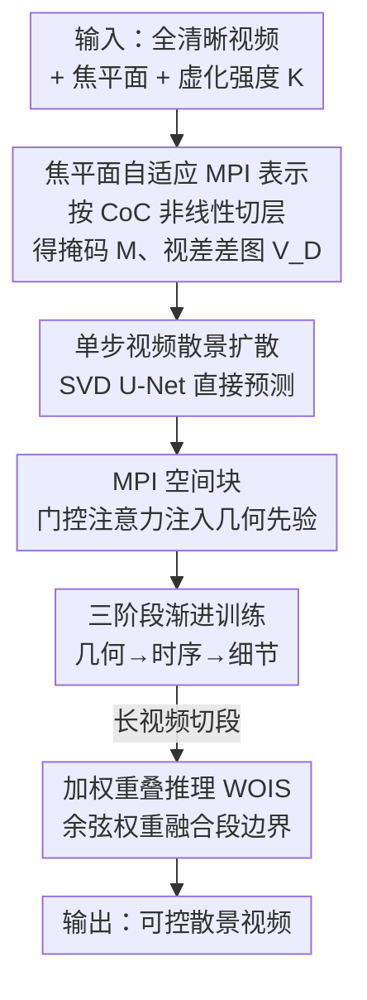

# Any-to-Bokeh: Arbitrary-Subject Video Refocusing with Video Diffusion Model

**会议**: ICLR2026  
**OpenReview**: [https://openreview.net/forum?id=h05AulYT7g](https://openreview.net/forum?id=h05AulYT7g)  
**代码**: 待确认（论文提供 project page）  
**领域**: 视频生成 / 扩散模型 / 计算摄影  
**关键词**: 视频虚化, 多平面图像(MPI), 单步扩散, 焦平面控制, 时序一致性

## 一句话总结
Any-to-Bokeh 把"视频重对焦/散景渲染"建模成一个由焦平面自适应 MPI 几何先验引导的**单步**视频扩散过程，让用户对任意输入视频自由指定焦平面和虚化强度，并通过三阶段渐进训练 + 加权重叠推理解决时序闪烁问题，在合成与真实数据上全面超越此前的图像/MPI 散景方法。

## 研究背景与动机
**领域现状**：扩散模型已经能很好地模拟相机的几何变换（移镜、变焦、平移），近期又被扩展到**光学效果**模拟，其中图像级散景（bokeh，即背景虚化）渲染借助生成先验已能产出视觉上很逼真的模糊过渡。

**现有痛点**：但这些工作几乎都停在**单张图像**上。把图像散景方法逐帧套到视频上会暴露两个硬伤——一是缺乏显式的时序建模、又依赖不完美的逐帧深度估计，叠加多步扩散里的随机噪声累积，导致**时序闪烁**和不稳定的模糊边界；二是即便直接用视频生成大模型，它们的"类散景"效果是隐式涌现的，**无法显式控制焦平面位置和虚化强度**。

**核心矛盾**：散景的本质是模糊半径随景深**非线性**变化（尤其在物体边界处深度突变），而现有 MPI（多平面图像）类方法把场景按**固定等间隔深度**切层，这种离散化与散景光学规律不匹配，导致边界处模糊过渡不准、出现伪影。换句话说，要想可控又时序连贯，既要显式注入场景几何，又要借助预训练视频模型的强 3D 先验。

**本文目标**：构建首个面向视频散景的扩散框架，要同时满足（i）时序连贯、（ii）几何/深度准确、（iii）可显式控制焦平面与虚化强度。

**切入角度**：作者的关键观察是——散景模糊半径只和"像素到焦平面的视差差"有关（弥散圆 CoC 公式），所以与其按绝对深度均匀切层，不如**围绕焦平面**自适应地采样视差，在焦平面附近切得细、远处切得粗，正好贴合 CoC 的非线性。

**核心 idea**：用**焦平面自适应的 MPI 表示**作为几何先验去条件化一个**单步**视频扩散模型，再用渐进训练和加权重叠推理把时序稳定性补齐。

## 方法详解

### 整体框架
整个 pipeline 要解决的是：给定任意一段全清晰（all-in-focus）视频，外加用户指定的焦平面和虚化强度 $K$，输出一段**深度感知、时序连贯、可控**的散景视频。它由三块串起来：先把每帧用预训练深度估计器算出视差图，按"离焦平面越近切得越细"的阈值函数构造**焦平面自适应 MPI 掩码** $M$ 和归一化视差差图 $V_D$，这两者连同 $K$ 一起构成几何先验与用户控制；再把这些先验通过 **MPI 空间注意力块**注入一个基于 Stable Video Diffusion(SVD) 的**单步** U-Net，直接预测散景帧；训练上采用三阶段渐进策略（几何引导 → 时序精炼 → 细节增强），推理时用**加权重叠策略 WOIS**把任意长视频切段处理再无缝拼接。

### 关键设计

**1. 焦平面自适应 MPI 表示：让切层贴合散景的非线性光学**

痛点很具体：传统 MPI 把场景按固定等深度切成前后若干层，但散景的弥散圆半径 $r$ 不是随深度线性变的。论文从光学出发给出关系式

$$r = K\left|\tfrac{1}{z}-\tfrac{1}{z_f}\right| = K\,|d - d_f|,$$

其中 $K$ 是用户控制的虚化强度，$z,d$ 是深度与视差，$z_f,d_f$ 是焦平面对应值。由于 $r$ 在浅焦平面附近变化快、远处变化慢，作者就把视差采样阈值定义成

$$h_i = \left(\tfrac{i}{N}\right)\tfrac{1}{d_f},\quad i=1,\dots,N-1,$$

其中 $1/d_f\in(0,1]$ 充当缩放因子，使浅焦时采样更细。按这些阈值把像素分配到 MPI 层，得到焦平面自适应掩码 $M=\{m_i \mid |d(m_i)-d_f| < h_i\}$，它高亮靠近焦点的区域、并在深度突变处给出更细的粒度。再配上一张由 $d,d_f$ 算出的归一化视差差图 $V_D$（隐式 CoC 代理）。和固定前后切层相比，这套表示是**相对焦平面定义**的，天然实现"焦点附近细、远处粗"的聚焦感知采样，从而把边界过渡做准。

**2. 单步扩散 + MPI 空间块：把几何先验门控注入 SVD U-Net**

多步扩散在视频上有两个麻烦——反复迭代带来跨帧时序不稳，多步推理又慢。作者干脆把散景生成formulate成**单步**扩散：在 SVD 基础上去掉随机采样，用一个单步 U-Net 直接预测输出帧，条件信号是三路显式量——视差差 $V_D$（聚焦远近）、虚化强度 $K$（散景强度）、焦平面 MPI 掩码 $M$（几何先验）。

几何怎么进网络？作者设计了 **MPI Attention**，一个受 GLIGEN 启发的门控注意力，嵌进 U-Net 的空间块：

$$\hat{Q} = Q + \tanh(\gamma)\cdot \mathrm{TS}\!\left(\mathrm{Attn}\big([Q+\Phi_M(E(K)),\ \Phi_A(V_A)],\ \bar{M}\big)\right),$$

这里 $Q$ 是当前块的 query token，$V_A$ 是输入视频的视觉 token，$\gamma$ 是初始化为 0 的可学习门控（保证微调初期不破坏预训练先验），$E(K)$ 是 $K$ 的 Fourier 嵌入，$\Phi_M,\Phi_A$ 是轻量 MLP，$\mathrm{TS}(\cdot)$ 是 token 选择算子（注意力后只保留对应 $Q$ 的输出、丢掉辅助 token $V_A$），$\bar{M}=[1,M]$ 是补了一列全 1 的掩码用于 masked-attention。作者还做了**分层注入**：浅层 U-Net 块注入近焦掩码精修局部过渡，深层块注入更宽间隔掩码维持全局结构。这样注意力被导向聚焦相关区域，散景就能贴合主体轮廓、即便在杂乱场景里也对得齐。

**3. 三阶段渐进训练：分别攻克时序、深度鲁棒、细节**

直接端到端训这个单步模型很难，因为时序一致、对不完美深度的鲁棒、高频细节这三件事会互相干扰。作者拆成三步逐个击破。**Stage 1 几何引导**：在干净数据上微调 MPI 空间块、时序块和 adapter，无随机噪声训练逼网络充分利用 MPI 掩码、学到空间准确的深度感知模糊，打好几何与初步时序基础。**Stage 2 时序精炼**：冻住空间 MPI 块、只在更长序列上训时序模块，并**主动注入视差扰动**——用 elastic transform 局部扭曲深度、加 Perlin 噪声模拟自然不一致、用形态学操作夸大边界过渡；这样既不冲垮空间模块，又教会时序块容忍深度噪声、减少闪烁，长出更长的时序记忆。**Stage 3 细节增强**：微调 VAE 解码器及其 adapter，从编码器加一条 skip connection 复用空间细节，并在 L1 之外加一个基于梯度的纹理损失

$$L_t = \sum_{x,y}\big(\nabla_x\hat{V}_B - \nabla_x V_B\big)^2 + \big(\nabla_y\hat{V}_B - \nabla_y V_B\big)^2,$$

鼓励更锐的边缘和更真实的纹理，补回 VAE 压缩丢掉的高频。

**4. 加权重叠推理 WOIS：让任意长视频在切段边界无缝衔接**

单步模型一次只能吃定长片段，朴素地把长视频切成重叠段各自处理，会在段边界出现闪烁、模糊错位。WOIS 把视频切成 $P$ 个各含 $2L$ 帧、相邻重叠 $L$ 帧的段，对重叠区第 $j$ 帧用余弦权重融合相邻两段：

$$\tilde{V}^i_B[j] = \gamma_j \hat{V}^i_B[j] + (1-\gamma_j)\hat{V}^{i+1}_B[j+L],\qquad \gamma_j = \tfrac{1}{2}\big(1+\cos(\tfrac{\pi j}{L})\big).$$

余弦权重给段中心帧更高权重、压低边界帧影响，从而平滑过渡、消除拼接处的伪影，使框架能处理任意长度的视频。

### 损失函数 / 训练策略
基座为 SVD，三阶段训练中 Eq.(2) 的 $N=4$。Stage 1 用 4 帧序列、Adam、学习率 1e-5；Stage 2 用 8 帧序列、学习率 5e-6、深度扰动概率 0.5；Stage 3 微调 VAE 解码器、学习率同 Stage 2。全程分辨率 $1024\times576$、batch size 1、4 张 H800 训练。推理时长视频切成 8 帧片段、相邻 4 帧重叠。Stage 3 的纹理损失见 $L_t$。

## 实验关键数据

### 主实验
合成测试集为作者自建的 200 段视频（缺少成对全清晰/散景视频数据，遂用光线追踪法合成、前景沿随机 3D 轨迹运动、每段 25 帧）。指标含 LPIPS/PSNR/SSIM（图像保真）、VFID-I/FVD（视频质量）、RM 与 FD（时序一致性，FD 为 RAFT 光流差异）、真实场景自设 VEPI（聚焦主体边缘细节保持）。

| 方法 | FD↓ | RM↓ | VFID-I↓ | FVD↓ | SSIM↑ | PSNR↑ | LPIPS↓ | VEPI↑ | Time↓ |
|------|-----|-----|---------|------|-------|-------|--------|-------|-------|
| DeepLens | 1.162 | 0.030 | 16.042 | 125.338 | 0.819 | 24.574 | 0.183 | 0.715 | 0.226 |
| BokehDiff | 0.660 | 0.021 | 7.395 | 65.678 | 0.834 | 27.525 | 0.127 | 0.859 | 0.799 |
| BokehMe | 0.536 | 0.013 | 8.633 | 39.102 | 0.936 | 27.992 | 0.060 | 0.937 | 0.103 |
| Dr.Bokeh | 0.522 | 0.011 | 6.097 | 32.710 | 0.950 | 31.273 | 0.046 | 0.863 | 2.729 |
| MPIB | 0.481 | 0.011 | 5.444 | 35.766 | 0.950 | 31.390 | 0.040 | 0.921 | 0.521 |
| **Ours** | **0.431** | **0.007** | **1.479** | **9.005** | **0.974** | **38.899** | **0.019** | **0.944** | 0.363 |

本文在所有指标上全面领先：FVD 从次优的 32.7 直降到 9.0、PSNR 高出 7+ dB、VFID-I 仅为次优的约 1/4，同时推理时间也比传统 MPI 方法（MPIB 0.521s、Dr.Bokeh 2.729s）更快。真实场景的人类偏好对比中，本文相对各 baseline 的胜率从 62.9%（vs MPIB）到 96.9%（vs DeepLens）不等。

### 消融实验
Tab.5 上 MPI/OS(单步)/WOIS/TR(时序精炼) 逐项开关：

| 配置 | MPI | OS | WOIS | TR | FD↓ | VFID-I↓ | FVD↓ | PSNR↑ |
|------|-----|----|------|----|----|---------|------|-------|
| #1 完整 | ✓ | ✓ | ✓ | ✓ | 0.517 | 3.865 | 18.922 | 32.250 |
| #2 去 TR | ✓ | ✓ | ✓ | - | 0.540 | 4.209 | 20.743 | 32.035 |
| #3 去 WOIS+TR | ✓ | ✓ | - | - | 0.551 | 4.521 | 21.941 | 31.936 |
| #4 再去 MPI | - | ✓ | - | - | 0.573 | 4.930 | 23.828 | 31.551 |
| #5 去单步(多步) | ✓ | - | - | - | 0.791 | 8.912 | 68.910 | 29.309 |

> 注：上表 PSNR 量级与主表不同，因消融在不同测试设置下评估，应纵向比较各行相对变化、不要与主表横向比大小。

VAE 细节增强（Tab.6，记为 FV）单独看：开启后 FVD 9.005 / PSNR 38.899 / LPIPS 0.019，关闭则退化到 FVD 18.922 / PSNR 32.250 / LPIPS 0.051，细节增强贡献巨大。

### 关键发现
- **单步是最大功臣**：从多步换成单步（#5→#3），FVD 从 68.9 暴降到 21.9、PSNR 涨近 2.6 dB，说明多步扩散的随机噪声累积正是视频散景闪烁的主因。
- **MPI 空间块对视频质量增益明显**：去掉 MPI（#4 vs #3）VFID/FVD 都变差，几何先验确实提升了时序一致与单帧质量。
- **深度扰动训练带来鲁棒性**：在视差扰动模式 II→IV 逐渐加重时，本文 PSNR 几乎不变、FVD 始终最低，而 BokehDiff 的 FVD 从 65 升到 80、MPIB 在模式 IV 急剧恶化——TR 阶段的扰动注入直接换来了对不准深度的抗性。

## 亮点与洞察
- **把光学公式直接写进表示设计**：用 CoC 的 $r=K|d-d_f|$ 反推出"围绕焦平面非线性采样视差"的 MPI 切层方式，是一个把物理先验显式编码进网络条件的范例，比盲目均匀切层优雅得多。
- **单步 + 几何条件的组合拳**：去掉随机采样既治了时序闪烁又顺带提速，说明对这类"确定性映射"任务，多步扩散的随机性是负担而非红利——这个思路可迁移到其他需要时序稳定的视频编辑任务。
- **门控 $\tanh(\gamma)$ 从 0 起步**：让新注入的几何注意力初期不破坏 SVD 预训练先验、再逐渐学习，是微调大模型时保护先验的实用 trick。
- **WOIS 的余弦权重**让任意长视频无缝拼接，是一个轻量但通用的视频分段推理后处理，可直接复用到别的定长视频扩散模型上。

## 局限与展望
- **依赖预训练深度估计器**：虽然 Stage 2 通过扰动训练增强了对深度噪声的鲁棒性，但极端错误深度下的表现仍受限于上游估计器质量。
- **训练数据为合成**：因缺乏成对全清晰/散景真实视频，训练全靠光线追踪合成数据，真实世界复杂运动模糊、透明/半透明物体下的泛化仍待更多验证。
- **大 backbone 的资源开销**：模型参数达 1880M、VRAM 13.6GB，相比 BokehMe(1.4GB) 等轻量方法在移动端实时部署仍有距离，尽管单帧推理时间已是最短(0.094s)。
- 可改进：把深度估计与散景渲染端到端联合优化，或引入更轻的蒸馏版本以适配真正的手机端后处理场景。

## 相关工作与启发
- **vs 图像散景扩散（BokehDiffusion / Generative Photography）**: 它们用生成先验在 2D 图像上做高质量散景，但限于静态图、无时序建模；本文把光学效果模拟与预训练视频先验结合，做出时序一致且可控的视频散景，填补了图像散景到视频域的空白。
- **vs 传统 MPI 方法（MPIB / Dr.Bokeh）**: 它们把场景按固定前后等深度切层、用定制 CUDA 渲染，深度突变处易出现颜色渗漏、且无法灵活控制焦平面/强度；本文的 MPI 相对焦平面自适应定义，边界过渡更准、还可显式控制，推理也更快。
- **vs 视频生成大模型（SVD 等）**: 它们提供强 3D 先验和跨帧一致性，但散景效果是隐式涌现、不可控；本文在 SVD 上加显式 MPI 条件与单步调度，把"隐式涌现"变成"显式可控"。

## 评分
- 新颖性: ⭐⭐⭐⭐⭐ 首个面向视频散景的专用扩散框架，焦平面自适应 MPI + 单步条件化是有原创性的组合。
- 实验充分度: ⭐⭐⭐⭐ 合成/真实双基准、5 个 baseline、完整消融与扰动鲁棒性分析；略减分于训练数据全为合成、缺真实成对数据。
- 写作质量: ⭐⭐⭐⭐ 动机—方法—实验逻辑清晰，公式与图示到位；部分符号（$\mathrm{TS}$、$\bar{M}$）需结合附录才完全清楚。
- 价值: ⭐⭐⭐⭐⭐ 直接服务于内容创作、电影级剪辑与手机后期，可控视频重对焦的实用价值很高。

<!-- RELATED:START -->

## 相关论文

- [\[ICLR 2026\] DreamSwapV: Mask-guided Subject Swapping for Any Customized Video Editing](dreamswapv_mask-guided_subject_swapping_for_any_customized_video_editing.md)
- [\[ICLR 2026\] MAGREF: Masked Guidance for Any-Reference Video Generation with Subject Disentanglement](magref_masked_guidance_for_any-reference_video_generation_with_subject_disentang.md)
- [\[ICLR 2026\] Arbitrary Generative Video Interpolation](arbitrary_generative_video_interpolation.md)
- [\[ICLR 2026\] TPDiff: Temporal Pyramid Video Diffusion Model](tpdiff_temporal_pyramid_video_diffusion_model.md)
- [\[ICLR 2026\] MTVCraft: Tokenizing 4D Motion for Arbitrary Character Animation](mtvcraft_tokenizing_4d_motion_for_arbitrary_character_animation.md)

<!-- RELATED:END -->
