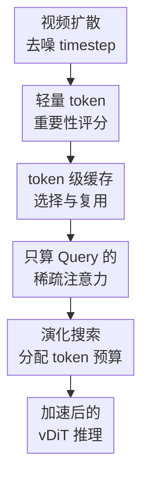

# Astraea: A Token-wise Acceleration Framework for Video Diffusion Transformers

**会议**: ICLR2026  
**OpenReview**: [https://openreview.net/forum?id=e8P4Oo8S6U](https://openreview.net/forum?id=e8P4Oo8S6U)  
**论文**: [Project Site](https://astraea-project.github.io/ASTRAEA/)  
**代码**: 暂未确认公开代码  
**领域**: 视频生成 / 视频扩散加速  
**关键词**: 视频扩散 Transformer, token 级加速, 稀疏注意力, token 缓存, 演化搜索

## 一句话总结
Astraea 面向视频扩散 Transformer 的推理瓶颈，提出一种 token 级选择、GPU 友好的稀疏注意力和演化式 token 预算搜索框架，在尽量保持生成质量的同时把单卡推理最高加速到约 2.4 倍、多卡场景最高扩展到 13.2 倍。

## 研究背景与动机
**领域现状**：高质量文生视频系统大多依赖 Video Diffusion Transformer（vDiT）。这类模型通过几十到上百个去噪 timestep，把随机噪声逐步还原成视频 latent，再解码成最终视频。视频任务的 token 序列很长，空间分辨率、时间帧数和 transformer 层数一起放大计算量，因此注意力、交叉注意力和 MLP 会在每个去噪步骤反复消耗大量 GPU 时间。

**现有痛点**：已有加速方法主要在两个粒度上动手。一类减少去噪步数，例如蒸馏或 step skipping；另一类在 block 级复用中间特征，例如 PAB、Delta-DiT、AdaptiveCache 等。它们确实能省计算，但很多策略依赖人工设定跳过哪些步骤、哪些块，调参成本高，而且对工业部署里“给定质量目标，自动找到最省计算方案”的需求不够友好。

**核心矛盾**：vDiT 的冗余不是均匀分布的。不同 timestep、不同 block、不同 token 对最终画面质量的影响差别很大；如果整步跳过或整块缓存，粒度太粗，容易错过真正重要的 token。反过来，如果像一些 token 级方法那样缓存或近似整张 attention map，又会带来过高显存和不适合 GPU 的稀疏计算开销。

**本文目标**：作者希望回答一个更细的问题：在给定性能目标或 token 预算时，每个去噪 timestep 到底应该计算哪些 token，才能尽量保留原模型的生成质量？这个目标可以拆成三个子问题：如何低开销估计 token 重要性，如何让被选中的 token 真正带来近似线性的 GPU 加速，以及如何把 token 预算分配到不同去噪步骤。

**切入角度**：论文的关键观察是，相邻去噪 timestep 的注意力 Log-Sum-Exp（LSE）分数高度稳定，Wan 2.1 上相邻 LSE 的平均余弦相似度达到 99.1%。这意味着作者不必重新计算昂贵的 attention map，就可以利用上一 timestep 的副产物判断 token 重要性。

**核心 idea**：Astraea 用“上一 timestep 的 LSE 重要性 × 当前 token 变化量”来选择值得重新计算的 token，只对这些 token 的 query 做完整注意力计算，其余 token 复用缓存，并用演化搜索自动决定各 timestep 的 token 预算。

## 方法详解

### 整体框架
Astraea 插在 vDiT 的反向扩散推理过程中，不改模型权重，也不需要重新训练。每个 compute block 前先根据 token 重要性和当前预算选出一部分 token；被选 token 正常经过 self-attention、cross-attention 和 MLP，未选 token 直接复用同一 block 在较早 timestep 缓存的输出。与此同时，一个离线搜索框架为不同 timestep 找到 token 预算表，让整个推理在目标质量约束下尽量少算。

从执行流看，Astraea 对每个 block 都维护上一轮输出缓存。假设某个 timestep 有一串输入 token，选择模块先按预算选出 top token，选中的 token 进入当前 block 重新计算并更新缓存；没选中的 token 不再经过该 block，而是从缓存里取旧输出。最终输出序列由“新算 token + 缓存 token”拼回完整 token 序列，再交给后续 block 和后续 timestep。

### 关键设计
**1. 轻量 token 重要性评分：不用重算 attention map 也能知道哪些 token 值得算**

token 选择最难的地方在于，重要性估计本身不能比省下的计算还贵。Astraea 的评分由两部分组成：token 显著性 $S_{sig}$ 和连续未选惩罚 $S_{penalty}$，整体写作 $S_{token}=w_\alpha S_{sig}+w_\beta S_{penalty}$。其中 $S_{sig}=S_{LSE,t-1}\Delta_{token,t}$，$S_{LSE,t-1}$ 来自上一 timestep softmax 计算中的 LSE 副产物，$\Delta_{token,t}$ 表示当前 token 与上一次被计算时输入 token 的变化量。

这个设计的好处是把“这个 token 在注意力里有多重要”和“这个 token 当前变化有多大”合在一起判断。只看 LSE 会偏向历史上重要但当前变化不大的 token，只看 token 差异又可能选到变化很大但对注意力输出影响不大的位置；二者相乘后，更容易挑出既重要又发生变化的 token。惩罚项 $S_{penalty}=e^{n_i}$ 则避免同一个 token 长期不被计算，降低缓存误差不断累积的风险。

**2. token 级缓存选择与复用：把粗粒度 block skipping 变成细粒度 token skipping**

传统 block caching 往往是一整个 block 复用或跳过，这对视频生成来说太粗，因为同一帧、同一 timestep 内不同空间时间位置的变化并不一致。Astraea 把复用粒度降到 token：每个 compute block 前都判断哪些 token 要重新经过该 block，未选 token 则直接拿这个 block 在过去 timestep 的输出。

这种做法相当于把“是不是要计算这个 block”改成“这个 block 里哪些 token 值得计算”。它比整步或整块跳过更柔性：运动剧烈、结构变化明显、对注意力贡献大的 token 可以被优先计算，静态背景或变化缓慢的 token 可以复用缓存。论文实验也显示，固定 token 或 timestep-level 的变体质量更差，说明重要 token 会随 block 和 timestep 改变，不能用一个固定集合粗暴代替。

**3. 只算 Query 的稀疏注意力：牺牲一点理论 FLOPs，换来正确语义和 GPU 友好性**

一个直觉做法是只对选中 token 同时裁剪 $Q$、$K$、$V$，让 attention map 从 $N\times N$ 变成更小的子矩阵。但这会改变 self-attention 的语义：每个 query 原本应该看见所有 key/value，并在完整行上做 softmax 归一化；如果 key 也被裁掉，LSE 和输出都会变成另一个问题的结果。若为了纠正这个问题缓存整张 attention map，又会让显存开销爆炸。

Astraea 采取看起来“少省一点”的方案：只对选中的 token 计算 query $Q_{sel}$，但 key 和 value 仍由全部 token 产生，然后计算 $\text{Softmax}(Q_{sel}K^\top/\sqrt{d})V$。这样每个被重新计算的 token 仍然在完整上下文上做注意力，输出语义保持正确；未选 token 直接复用缓存输出。更重要的是，这种 row-wise attention 结构可以接入 FlashAttention 这类 GPU kernel，因此实际延迟能随选中 token 数接近线性下降。

**4. 演化搜索分配 token 预算：把“该省多少 token”从人工调参变成自动搜索**

即使单个 block 内能选 token，仍然需要决定每个 timestep 的预算 $\theta_i$。Astraea 把搜索空间定义为 $\Theta=\{\theta_i\}$，其中 $\theta_i\in\{0,10\%,20\%,\ldots,100\%\}$ 表示第 $i$ 个去噪 timestep 选择多少比例的 token。直接在 block 级搜索太大，所以论文把预算固定在 timestep 级，再由 block 内评分决定具体 token。

搜索算法采用经典演化算法。初始保留 $K=50$ 个候选预算表，每代选出 MSE 更小的 top 候选作为父代，再通过 uniform crossover、block crossover、mutation 和 repair 产生新候选。repair 会把总 token 预算拉回目标范围，例如 $[0.9\Theta_\$,1.1\Theta_\$]$。候选的适应度用加速输出与原模型输出之间的 MSE 衡量，最终选择 MSE 最低的预算表。作者只用 4 个不同风格 prompt 做搜索，理由是不同 prompt 在“跳过某 timestep 后的 MSE 曲线”上趋势相似，增加 prompt 带来的收益有限。

### 一个完整示例
可以把一次 Wan 4 秒视频生成想成 50 个去噪 timestep 的长流程。原模型在每个 timestep 都对所有视频 token 完整跑每个 transformer block；Astraea 先通过离线演化搜索得到一张预算表，例如某些早中期 timestep 给 40% token，结构更敏感的阶段给 70% token，较稳的阶段只给 20% token。

推理到某个具体 block 时，Astraea 读取当前 token、上一轮输入 token、上一轮 LSE 分数和连续未选次数。假设当前预算是 40%，它就按 $S_{token}$ 选出得分最高的 40% token。选中 token 的 query 被重新投影并与所有 key/value 做完整 attention；未选的 60% token 直接从缓存拿这个 block 的旧输出。block 结束后，选中 token 的新输出写回缓存，完整 token 序列继续进入下一个 block。这样一个 timestep 内仍保留完整序列形状，但真正重算的 token 数明显减少。

### 损失函数 / 训练策略
Astraea 本身是 training-free 推理加速方法，不训练 vDiT 权重，也不引入新的生成损失。它的“优化目标”主要出现在离线搜索阶段：每个候选预算表生成视频后，与原始未加速模型输出计算 MSE，MSE 越低说明在相同 token 预算下越接近原模型。演化搜索使用 30 代、父代候选 $K=50$、每代新候选 $P=30$，mutation 概率从 $P_0=0.1$ 逐步降到 $P_{final}=0.01$，在早期鼓励探索、后期稳定收敛。

实验中的预算通常以 ASTRAEA 40%、50%、70% 表示，即总 token 计算预算比例。超参数方面，论文固定 $w_\alpha=1$，并发现 $w_\beta=0.5$ 附近效果最好；但敏感性实验显示 PSNR 波动小于 0.2，说明评分项权重不是特别脆弱。

## 实验关键数据

### 主实验
论文在 HunyuanVideo-T2V、Wan v2.1 1.3B 和 OpenSora v1.2 上评估，指标包括 VBench、PSNR、SSIM、LPIPS、端到端延迟、FLOPs 和显存。下面选取最能说明结论的几个设置：

| 模型 / 设置 | 方法 | VBench(%)↑ | PSNR(dB)↑ | A100 延迟(s)↓ | A100 加速比 | 显存(GB)↓ |
|--------|------|------------|-----------|---------------|------------|-----------|
| HunyuanVideo 5s | Original | 80.28 | - | 1226.99 | 1.00× | 45.81 |
| HunyuanVideo 5s | ASTRAEA 40% | 79.79 | 27.61 | 514.84 | 2.38× | 69.01 |
| HunyuanVideo 5s | ASTRAEA 50% | 80.20 | 28.71 | 636.35 | 1.93× | 69.01 |
| Wan 4s | Original | 80.28 | - | 155.01 | 1.00× | 8.97 |
| Wan 4s | TOCA 85% | 79.28 | 18.13 | 95.07 | 1.63× | 38.40 |
| Wan 4s | ASTRAEA 40% | 79.78 | 26.98 | 67.61 | 2.29× | 11.71 |
| Wan 4s | ASTRAEA 50% | 79.96 | 28.12 | 83.34 | 1.86× | 11.71 |
| OpenSora 4s | Original | 79.00 | - | 109.15 | 1.00× | 16.96 |
| OpenSora 4s | ASTRAEA 50% | 78.07 | 28.51 | 58.62 | 1.86× | 27.98 |

可以看到，ASTRAEA 40% 往往提供最高延迟收益，ASTRAEA 50%/70% 则在质量上更接近原模型。Wan 4s 上，ASTRAEA 50% 的 VBench 只比原模型低 0.32 个百分点，但 A100 延迟从 155.01 秒降到 83.34 秒；相比 TOCA 85%，PSNR 从 18.13 dB 提升到 28.12 dB，说明它更接近原始视频输出。

### 消融实验
论文在 Wan 4s 上比较了三个关键变体：同时选择 Q/K 的朴素稀疏注意力、timestep-level 选择、固定 token 集合选择。结果如下：

| 配置 | VBench(%)↑ | PSNR(dB)↑ | A100 延迟(s)↓ | A100 加速比 | 显存(GB)↓ | 说明 |
|------|------------|-----------|---------------|------------|-----------|------|
| Original | 80.28 | - | 155.01 | 1.00× | 8.97 | 原始 Wan 4s |
| SELECTQ&K | 79.01 | 18.10 | 96.84 | 1.60× | 38.40 | 同时裁剪 Q/K，语义和显存都不理想 |
| TIMESTEP-LEVEL | 79.50 | 22.71 | 78.51 | 1.97× | 8.97 | 整个 timestep 级跳过，快但一致性较差 |
| FIXED-TOKEN | 77.92 | 19.75 | 83.20 | 1.86× | 11.71 | 固定 token 集合，无法适应 block/timestep 变化 |
| ASTRAEA | 79.96 | 28.12 | 83.34 | 1.86× | 11.71 | token 级动态选择 + 只算 Q 的稀疏注意力 |

这组消融说明三个点：第一，朴素裁剪 $Q$ 和 $K$ 会明显破坏注意力语义，PSNR 只有 18.10 dB；第二，只按 timestep 选择虽然更快，但无法保留足够细粒度的画面一致性；第三，固定 token 集合掉点最大，说明重要 token 是动态变化的，Astraea 的 block 内动态选择是必要的。

### 关键发现
- 在多个 vDiT 上，ASTRAEA 的 VBench 损失大多控制在 0.5% 左右，同时提供约 1.8× 到 2.4× 的单卡加速。它不是单纯牺牲质量换速度，而是在 PSNR、SSIM、LPIPS 上更接近原模型输出。
- 稀疏 attention 的实现方式很关键。只算 selected query、保留完整 key/value 看似 FLOPs 省得不如朴素稀疏多，但实际能保持 attention 语义，还能利用 GPU 并行 kernel，因此综合效果更好。
- token 选择开销很低，论文给出的执行分解显示 token selection 只占总执行时间约 2.3%。这说明评分机制没有吞掉省下来的推理时间。
- 多卡扩展性较强。ASTRAEA 50% 在 8 张 GPU 上可达到 10× 以上加速，OpenSora 4s 场景最高报告 13.2×，说明它的稀疏注意力设计没有把并行性破坏掉。
- 预算敏感性实验显示，当计算预算低于约 30% 时 VBench 会快速下降；30% 到 50% 是更实用的速度-质量折中区间。

## 亮点与洞察
- 最巧妙的地方是把 attention softmax 的 LSE 副产物变成 token 重要性信号。它不需要额外计算整张 attention map，却能利用 attention 内部已经产生的信息，这是比纯启发式 token 差分更有根据的选择指标。
- “只稀疏 Q、不稀疏 K/V”是一个很工程化的取舍。论文没有追求纸面上最大的 FLOPs 削减，而是优先保证 attention 行语义正确和 GPU kernel 友好，这也是它能在真实 A100/A6000 延迟上跑出接近线性收益的关键。
- 演化搜索把视频扩散加速从“人工试 stride、试阈值”推进到“给定预算自动找 timestep allocation”。这个思想可以迁移到其他扩散模型加速问题，比如图像 DiT、3D diffusion 或音视频生成，只要能定义一个低成本质量代理指标。
- 消融很好地揭示了 token 级动态选择的必要性。固定 token 变体和 timestep-level 变体都能省时间，但质量一致性明显差，说明视频扩散里的冗余既有时间结构，也有 token/block 局部结构。
- 论文的评估覆盖了 HunyuanVideo、Wan 和 OpenSora 三类 vDiT，且同时看 VBench 与 frame-level consistency。对加速论文来说，这比只报告一个 benchmark score 更有说服力，因为用户真正关心的是加速后视频是否仍像原模型生成的结果。

## 局限与展望
- 搜索阶段仍有成本。论文说平均搜索约 82 GPU hours，具体设置中 OpenSora 2s 约 34 小时、Wan 4s 约 139 小时。对大公司部署可以接受，但对个人开发者或快速迭代的小模型仍然偏重。
- 方法主要以“接近原模型输出”为目标，适合保真加速，但不一定等价于人类偏好的最佳视频质量。有些加速输出可能与原模型不同但视觉上也合理，MSE/PSNR 会惩罚这种差异。
- 显存表现不是所有场景都完美。Astraea 避免缓存整张 attention map，但仍需要 token 输出缓存；例如 HunyuanVideo 上 ASTRAEA 的峰值显存高于原模型。这提示它更适合显存足够、延迟更关键的部署场景。
- 预算表是否能跨模型、跨分辨率、跨视频长度复用，论文没有完全展开。未来可以研究更通用的预算预测器，用少量 profiling 自动生成新模型的 token schedule。
- 当前设计仍依赖 diffusion 相邻 timestep 的稳定性。若模型采用极少步采样、强 distillation 或更激进的 sampler，相邻 timestep 的 LSE 稳定假设可能变弱，需要重新验证评分指标。

## 相关工作与启发
- **vs PAB / Delta-DiT 等 block caching**: 这些方法主要复用整块或整步中间结果，策略容易简单高效，但粒度较粗。Astraea 在 token 级决定哪些位置重新计算，因此能在类似甚至更高加速下保留更好的 frame-level consistency。
- **vs ToCa**: ToCa 也是 token-wise feature caching，但它的选择和 attention 处理带来较高显存开销，Wan 4s 上表格显示显存达到 38.40 GB。Astraea 不缓存整张 attention map，只利用 LSE 和 token 差异，显存和质量都更稳。
- **vs Sparse VideoGen / SVG2**: SVG/SVG2 从视频生成注意力稀疏性出发减少 attention 计算，适合利用时空稀疏结构。Astraea 的重点是 token 选择 + 缓存 + 预算搜索，更像一个通用 token-wise 推理框架，并且强调不破坏完整 key/value 上下文。
- **vs step reduction / distillation**: 蒸馏类方法可以把 diffusion 步数压得很低，但通常需要训练，且视频模型训练成本很高。Astraea 是 training-free 方法，更适合已有 vDiT 模型的部署侧加速。
- **启发**: 对生成模型加速来说，算法指标、缓存粒度和硬件实现必须一起设计。一个理论上省 FLOPs 的方法，如果破坏 attention 语义或无法映射到 GPU kernel，最终未必比“少省一点但并行友好”的方法更好。

## 评分
- 新颖性: ⭐⭐⭐⭐☆ token 级缓存已有先例，但 LSE 副产物评分、只稀疏 query 的 attention 和 timestep 预算搜索组合得很完整。
- 实验充分度: ⭐⭐⭐⭐⭐ 覆盖三个主流视频生成框架、多种 baselines、VBench 与 frame-level 指标，并有消融、敏感性和多卡扩展实验。
- 写作质量: ⭐⭐⭐⭐☆ 主线清楚，算法动机和工程取舍解释充分；部分表格信息很密，读者需要在速度、质量和显存之间来回对照。
- 价值: ⭐⭐⭐⭐⭐ 视频扩散推理成本是实际部署痛点，Astraea 给出了不改权重、可配置质量-速度目标、并且真实 GPU 友好的解决方案。

<!-- RELATED:START -->

## 相关论文

- [\[ICLR 2026\] BWCache: Accelerating Video Diffusion Transformers through Block-Wise Caching](bwcache_accelerating_video_diffusion_transformers_through_block-wise_caching.md)
- [\[ICML 2025\] AsymRnR: Video Diffusion Transformers Acceleration with Asymmetric Reduction and Restoration](../../ICML2025/video_generation/asymrnr_video_diffusion_transformers_acceleration_with_asymmetric_reduction_and_.md)
- [\[ICLR 2026\] UltraViCo: Breaking Extrapolation Limits in Video Diffusion Transformers](ultravico_breaking_extrapolation_limits_in_video_diffusion_transformers.md)
- [\[ICLR 2026\] TS-Attn: Temporal-wise Separable Attention for Multi-Event Video Generation](ts-attn_temporal-wise_separable_attention_for_multi-event_video_generation.md)
- [\[CVPR 2026\] VMonarch: Efficient Video Diffusion Transformers with Structured Attention](../../CVPR2026/video_generation/vmonarch_efficient_video_diffusion_transformers_with_structured_attention.md)

<!-- RELATED:END -->
