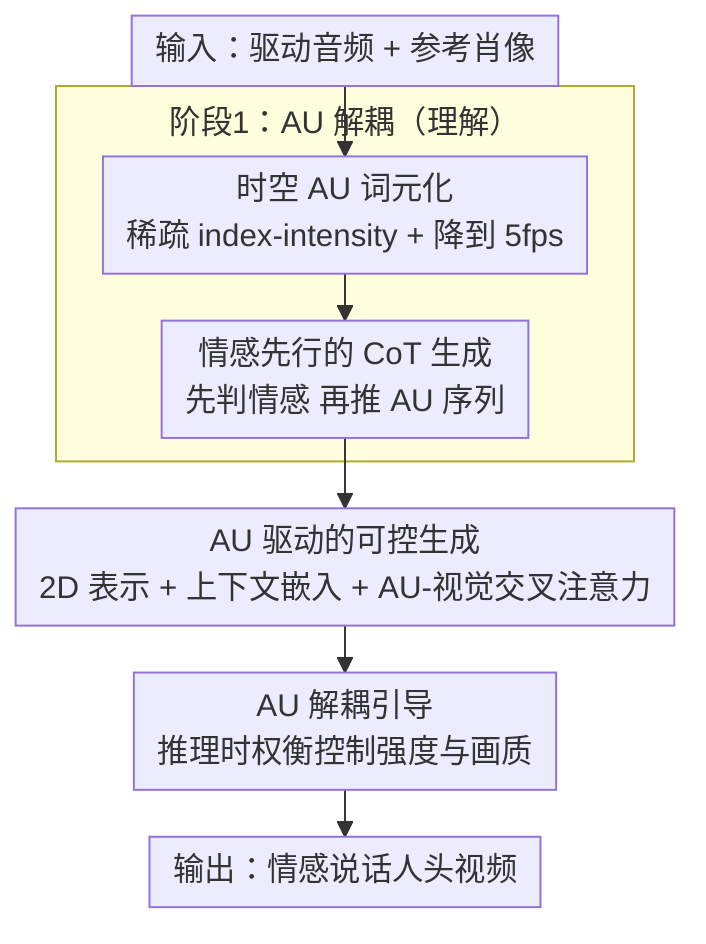

# AUHead: Realistic Emotional Talking Head Generation via Action Units Control

**会议**: ICLR 2026  
**OpenReview**: [https://openreview.net/forum?id=dmzlAUkulz](https://openreview.net/forum?id=dmzlAUkulz)  
**代码**: https://github.com/laura990501/AUHead_ICLR  
**领域**: 视频生成 / 说话人头生成  
**关键词**: 说话人头生成, 情感表达, 面部动作单元(AU), 音频语言模型, 可控扩散

## 一句话总结
AUHead 把"音频→情感视频"这个直接生成问题拆成两阶段：先用音频语言模型从语音里"听懂情感"并推理出离散的面部动作单元(AU)序列，再用一个 AU 驱动的可控扩散模型把 AU 渲染成既同步又有细腻表情的说话人头视频，在 MEAD/CREMA 上情感真实度与口型精度同时超过现有方法。

## 研究背景与动机

**领域现状**：音频驱动的说话人头生成（talking head）目前主流是把驱动音频 + 一张参考肖像直接喂给生成模型（早期是 GAN/运动系数，现在是扩散模型如 EMO、Hallo、MEMO），目标是口型同步、保持身份、产生自然的面部动作。

**现有痛点**：这类"音频直接进、视频直接出"的范式在口型同步和身份保持上已经很强，但表情往往**中性、平淡**——它们只把音频当作驱动信号，忽略了语音里更深层的情感线索（音调、节奏、语气），生成的脸"会说话但没情绪"。

**核心矛盾**：要表达细腻情感，需要一个**细粒度、可控、可解释**的情感中间表示来桥接音频模态和视觉模态。粗粒度的情感标签（happy/sad）信息太少，潜在情感码又不可解释、难以精确控制；同时，一旦把情感控制信号硬塞进扩散模型，又容易破坏口型同步和画质（**可控性 vs 画质**两难）。

**本文目标**：拆成两个子问题——(1) 如何从语音里准确、高效地解耦出情感信号；(2) 如何把这个信号注入扩散模型而不牺牲口型、身份和画质。

**切入角度**：作者选用**面部动作单元（Action Units, AU）**作为中间表示。AU 描述局部肌肉运动（嘴、下巴、脸颊、眉毛等），既有语义又有空间和强度信息，组合起来能覆盖广谱表情，天然适合同时承载"发音"和"情感"两类线索；而且语音本身就伴随协调的面部肌肉运动，音频→AU 的映射是有物理基础的。

**核心 idea**：用一个**音频语言模型（ALM）**像做语言任务一样"生成" AU 序列（先想情感、再推 AU），再用一个 **AU 驱动的可控扩散模型**把 AU 渲染成视频——把"理解"和"生成"显式分离。

## 方法详解

### 整体框架
AUHead 是一个两阶段 pipeline：输入是一段驱动语音 + 一张参考肖像，输出是情感丰富、口型同步的说话人头视频。**第一阶段（理解）**把语音交给音频语言模型 Qwen-Audio-Chat，让它先判断情感、再吐出一串离散的 AU token（5 fps 的稀疏 index–intensity 对）；**第二阶段（生成）**把这串 AU 上采样到 25 fps、映射成 2D 面部表示，经上下文感知嵌入后，通过插入预训练扩散模型的 AU 交叉注意力适配器驱动视频合成，推理时再用一个解耦引导策略灵活权衡 AU 控制强度与画质。

### 关键设计

**1. 时空 AU 词元化：把稠密 AU 压成 ALM 啃得动的稀疏 token**

痛点很直接：AU 序列太密——4 秒 25 FPS 的视频展开成约 13K 个 token，远超 Qwen-Audio-Chat 的上下文窗口，也超出它的 AU 建模能力。作者不把 AU 当回归目标，而是把它当"自然语言"来 token 化（对齐语言建模任务、复用预训练知识），并从空间和时间两个方向压缩。空间上利用 AU 激活的稀疏性（统计上每帧 24 维里平均只有约 7 维被激活），把稠密向量裁成"索引–强度对"的集合 $\hat{a}_{u_t}=\{(i, a_{u_{t,i}}) \mid a_{u_{t,i}} > \lambda\}$，其中 $\lambda$ 是稀疏系数（越大越稀疏，但可能丢细微表情）；时间上以因子 $\gamma$ 均匀下采样 AU 监督序列。关键约束是：**只压 AU 目标，音频始终按原始采样率处理**。25 fps 生成会超上下文，作者折中用 5 fps，并靠 AU 轨迹的连续性 + 生成模型补回短时损失。这套方案平均把输出序列长度砍掉 **80.95%**，让 ALM 真正能生成有效 AU。

**2. 情感先行的 CoT 生成：先判情感再推 AU，给解耦加一个高层锚点**

光把 AU token 化还不够——音频→AU 是个多步推断，直接硬猜不准。作者借鉴思维链(CoT)，让 ALM 走"粗到细"：先从音频预测情感类别（happiness / sadness / anger…），再以这个情感作为高层上下文、自回归地生成对应的 AU 序列。其依据是情感状态与 AU 激活模式高度相关，把中间的情感预测显式塞进解码过程，相当于给 AU 推理一个语义锚点。消融里这点很明显：相比"音频→AU"直接预测（精度 0.65、MAE 0.2447），"音频→情感→AU"（CoT）把精度推到 0.71、MAE 降到 0.2085，情感分类准确率 67%；而反过来"先 AU 后情感"只有 0.68 精度、51.76% 情感准确率——说明顺序很关键，情感必须当**前置高层线索**而不是后验副产物。0.2 的 AU 强度 MAE 已接近 FEAFA 的人工标注者间一致性。

**3. AU 驱动的可控生成：2D 表示 + 上下文嵌入 + 交叉注意力，把 AU 注进冻结扩散模型**

第二阶段要解决"如何注入 AU 又不毁掉口型/身份/画质"。它由三个互补组件构成（合并为一个设计点讲）：**(i) AU 表示**——先把 5 fps 的低分辨 AU 线性插值上采样回目标帧率（因子 $1/\gamma$），再做"AU→2D"映射，投影成结构化的 2D 面部表示（关键点 LMK 或网格渲染 RoM），把无空间结构的 1D 序列变成带显式面部拓扑的空间先验；**(ii) 上下文感知 AU 嵌入**——对第 $t$ 帧取长度 $n$ 的局部时间窗，拼接窗内 AU 特征经轻量时序卷积编码 $c_t = \mathrm{Conv_{AU}}([a_{u_{t-n}},\dots,a_{u_t},\dots,a_{u_{t+n}}])$，同时纳入历史与未来线索以保证表情时序平滑；**(iii) AU–视觉交互**——在预训练扩散骨干里插入一个由多层交叉注意力组成、**零初始化**的 AU adapter，让视觉潜变量在每个去噪步 $\hat{z}_t^{(s)} \leftarrow \mathrm{CrossAttn}(z_t^{(s)}, c_{AU})$ 自适应吸收 AU 表情线索。零初始化 + 冻结其余组件（只训 adapter）保证训练稳定、不破坏底模已学好的口型与身份能力。消融证实 2D 表示（LMK/RoM）在 PSNR/SSIM/FID/LMD 上全面优于 1D AU 序列，因为它提供了更强的空间先验。

**4. AU 解耦引导：推理时一根旋钮调 AU 控制强度与画质的平衡**

可控性 vs 画质的两难必须在推理时能调。作者为 AU 条件量身设计了一个解耦引导（类 classifier-free guidance，但把 AU 和其他条件分开）：训练时随机把各条件置零以支持无条件建模，推理时用两个独立的引导尺度 $s_H$（音频/运动先验等其他条件）与 $s_{AU}$（AU 条件）分别调制：

$$\hat{\epsilon} = L_\theta(z_t, \phi, c_{AU}) + s_H \cdot \big(L_\theta(z_t, c_H, \phi) - L_\theta(z_t, \phi, \phi)\big) + s_{AU} \cdot \big(L_\theta(z_t, c_H, c_{AU}) - L_\theta(z_t, c_H, \phi)\big)$$

其中 $\phi$ 是空条件。$s_{AU}$ 越大，情感准确率上升、AU 回归 MAE 下降，但 FID 会先降后升（和 Stable Diffusion 上的引导规律一致）；实测最佳画质–情感折中在尺度 3.5，让用户能在"表情更强"和"画面更干净"之间自由权衡。

### 损失函数 / 训练策略
阶段一用 LoRA 轻量微调 Qwen-Audio-Chat，以真值 AU 序列为监督、按下一 token 预测的交叉熵训练（4×A100 约 24 GPU 小时，$\lambda=0$、$\gamma=0.2$）。阶段二冻结其余全部组件、只训 AU adapter，用扩散损失 $L=\mathbb{E}\big[\lVert \epsilon - \epsilon_\theta(z_t,t,c)\rVert_2^2\big]$，条件 $c$ 含音频、参考图、AU 嵌入三者，训练时各条件随机置零以支持无条件建模（底模用 Hallo V1 与 MEMO，各 12 GPU 小时；上下文窗 $n=2$，即窗长 5 帧）。

## 实验关键数据

### 主实验
MEAD / CREMA 两个情感说话脸数据集，统一 25 fps、512×512、音频 16 kHz。AUHead 以 MEMO 为底模时在画质与口型几何上同时领先（Sync 略降，但人评无明显错位）：

| 数据集 | 方法 | PSNR ↑ | SSIM ↑ | FID ↓ | M-LMD ↓ | F-LMD ↓ |
|--------|------|--------|--------|-------|---------|---------|
| MEAD | MEMO* (底模) | 23.1910 | 0.7345 | 11.1237 | 2.0684 | 2.2473 |
| MEAD | **AUHead (MEMO)** | **23.3466** | **0.7395** | **10.9671** | **1.8608** | **2.1604** |
| MEAD | Sonic (2025) | 21.1874 | 0.7118 | 14.2623 | 2.5822 | 2.4025 |
| CREMA | MEMO* (底模) | 24.2808 | 0.7410 | 8.3881 | 1.9678 | 2.4296 |
| CREMA | **AUHead (MEMO)** | 24.2912 | 0.7413 | **8.2361** | **1.9313** | **2.3991** |

把 AU 注入两个不同底模（Hallo V1、MEMO）都能在原底模基础上降 FID、降 LMD，说明 AU 引导是即插即用的增益。

### 消融实验
| 配置 | 关键指标 | 说明 |
|------|---------|------|
| A → AU（直接） | Prec 0.65 / MAE 0.2447 | 音频直接预测 AU，最差 |
| A → AU → E | Prec 0.68 / ACCemo 51.76% | 先 AU 后情感，顺序错 |
| **A → E → AU (CoT)** | **Prec 0.71 / MAE 0.2085 / ACCemo 67%** | 情感先行，最优 |
| A+E → AU（上界参考） | Prec 0.72 / MAE 0.1928 | 真情感作输入的上界 |
| MEMO + 1D AU Seq | FID 11.11 (MEAD) | 1D 序列条件弱 |
| **MEMO + RoM/LMK (2D)** | FID 10.87 / 10.97 | 2D 空间先验显著更好 |

### 关键发现
- **情感先行（CoT）是阶段一的胜负手**：把情感当中间高层线索能逼近"直接喂真值情感"的上界（MAE 0.2085 vs 0.1928），而调换顺序立刻退化，说明收益来自语义锚点而非单纯多一步。
- **2D AU 表示 > 1D 序列**：LMK/RoM 提供显式面部拓扑这一空间先验，PSNR/SSIM/FID/LMD 全面提升；代价是 Sync 略降——多出的空间信息让模型更关注表情精度，轻微牺牲口型–音频时序对齐。
- **AU 引导尺度存在最佳折中点**：随 $s_{AU}$ 增大情感准确率升、MAE 降，但 FID 先降后升，3.5 是画质–情感的最佳平衡。
- **泛化与时序稳定**：在素描、油画、写实等多种风格的未见数据上能稳定生成 10 秒级、身份保持、运动连贯的视频。

## 亮点与洞察
- **把"音频→情感视频"重构成"理解 then 生成"**：用 ALM 显式产出可解释的 AU 中间表示，第一次把面部 AU 序列当语言任务用 ALM 生成，建立了一个可泛化、可解释的音频驱动面部控制空间——比情感标签细、比潜在码可控。
- **时空 token 化是让 ALM 能生成稠密信号的关键工程**：稀疏 index–intensity + 降帧把 13K token 砍到 ~80% 以下，这套"利用信号本身稀疏性来适配语言模型上下文"的思路可迁移到其它密集连续信号（如手势、身体动作）的 LLM 生成。
- **零初始化 adapter + 冻结底模**：以最小代价把新条件接进预训练扩散模型而不毁原能力，是即插即用扩展的可复用范式。
- **解耦引导给了一根"情感强度"旋钮**：把 AU 与其他条件分尺度调制，让用户在表情表达力和画面干净度之间显式权衡，落地性强。

## 局限与展望
- **Sync（口型置信度）相对下降**：2D AU 引入的空间信息会轻微挤占口型–音频时序对齐，作者靠人评说明实际影响小，但定量 Sync 确实不如纯口型方法（如 Wav2Lip）。
- **5 fps 的时间折中**：受 ALM 上下文窗限制，AU 只能在 5 fps 生成再插值回 25 fps，短时表情动态有损失，靠轨迹连续性和生成模型补，快速微表情可能丢细节。
- **依赖配对数据与情感分类器**：阶段一需要音频–AU 配对监督，情感准确率（67%）和 AU 回归仍受限于 Qwen-Audio-Chat 的容量与稠密 AU 表示的冗余；情感类别也较粗。
- **改进方向**：扩大 ALM 上下文或换更高效的 AU 序列建模以支持更高帧率；把粗粒度情感类别换成连续情感强度；探索 AU 之外更丰富（如带头部姿态/视线）的可控信号。

## 相关工作与启发
- **vs 情感适配器类（EAT / SAAS / DICE-Talk / MEMO）**：它们给冻结生成器挂一个紧凑情感码或记忆模块来注入情感；AUHead 改用**时序对齐的 AU 特征**做引导，控制更细粒度、更可解释（能看到具体哪块肌肉动）。
- **vs 直接生成范式（EMO / Hallo / Sonic）**：这些是"音频直接进、视频出"，强在口型/身份但表情平淡；AUHead 插入"ALM 理解→AU"的中间层，专攻情感表现力，且可叠加在 Hallo/MEMO 这些底模上增益。
- **vs 用 MLLM 产文本引导（OmniHuman-1.5）**：同样走"先理解后生成"，但 AUHead 的中间产物是结构化、可渲染成 2D 拓扑的 AU，而非文本指令，对面部表情的控制更直接精确。

## 评分
- 新颖性: ⭐⭐⭐⭐⭐ 首次用 ALM 把语音解耦成可生成的 AU 序列，"理解 then 生成"+ AU 控制空间的组合很新。
- 实验充分度: ⭐⭐⭐⭐ 两数据集、两底模、CoT 与 2D 表示消融齐全，但缺更大规模人评细节与跨语言/跨域测试。
- 写作质量: ⭐⭐⭐⭐ 两阶段动机清晰、图表对应到位，部分符号（如窗长 $n$ 的两处含义）需对照原文。
- 价值: ⭐⭐⭐⭐ 即插即用的细粒度情感控制对虚拟人/影视/交互很实用，AU 作为可解释控制空间有迁移潜力。

<!-- RELATED:START -->

## 相关论文

- [\[ICLR 2026\] ReactID: Synchronizing Realistic Actions and Identity in Personalized Video Generation](reactid_synchronizing_realistic_actions_and_identity_in_personalized_video_gener.md)
- [\[CVPR 2026\] VerseCrafter: Dynamic Realistic Video World Model with 4D Geometric Control](../../CVPR2026/video_generation/versecrafter_dynamic_realistic_video_world_model_with_4d_geometric_control.md)
- [\[ICLR 2026\] VideoPhy-2: A Challenging Action-Centric Physical Commonsense Evaluation in Video Generation](videophy-2_a_challenging_action-centric_physical_commonsense_evaluation_in_video.md)
- [\[ICLR 2026\] Video-As-Prompt: Unified Semantic Control for Video Generation](video-as-prompt_unified_semantic_control_for_video_generation.md)
- [\[ICLR 2026\] Learning Video Generation for Robotic Manipulation with Collaborative Trajectory Control](learning_video_generation_for_robotic_manipulation_with_collaborative_trajectory.md)

<!-- RELATED:END -->
