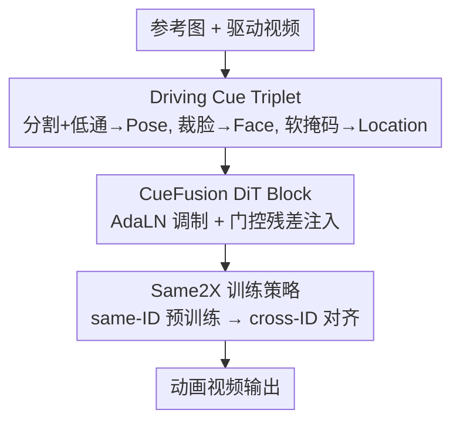

# Beyond Skeletons: Learning Animation Directly from Driving Videos with Same2X Training Strategy

**会议**: ICLR2026  
**OpenReview**: [https://openreview.net/forum?id=HdEpZE3wFa](https://openreview.net/forum?id=HdEpZE3wFa)  
**代码**: 待确认（项目页 https://directanimator.github.io/）  
**领域**: 视频生成 / 人体图像动画  
**关键词**: 人体图像动画, 驱动视频, 骨架替代, DiT, 表示对齐

## 一句话总结
本文提出 DirectAnimator，抛弃骨架/姿态估计这一中间表示，直接用驱动视频的原始像素把参考人物"动起来"：先把原始视频抽成 Pose/Face/Location 三元"驱动线索（Driving Cue）"，再用 CueFusion DiT Block 把线索注入去噪过程，并配一套 Same2X 训练策略把跨身份（cross-ID）阶段的特征对齐到同身份（same-ID）模型，最终在 TikTok / Unseen 两套测试集上达到 SOTA，且收敛快 6.7×、算力更省。

## 研究背景与动机
**领域现状**：人体图像动画（Human Image Animation, HIA）的任务是——给一张静态参考图，再给一段驱动视频，让参考图里的人按驱动视频的动作和表情动起来。当前主流做法（AnimateAnyone、StableAnimator、UniAnimate-DiT、Champ 等）几乎都先用姿态估计器把驱动视频抽成 2D 骨架图（或 DensePose / SMPL），再拿这个中间表示去引导扩散模型生成。

**现有痛点**：这条"先估姿态、再驱动"的路有两个硬伤。其一，姿态条件本身不可靠——遮挡、复杂肢体动作会让 OpenPose/DWPose 估错或估缺，于是出现前后混淆、手放错位置、肢体缺失，最终生成解剖学错误的画面（论文 Figure 1 里 StableAnimator 多画了一只手就是典型例子）。其二，68 点人脸关键点表达力太弱，捕捉不了细腻表情，导致动画表情僵硬、不自然。

**核心矛盾**：骨架是一种"有损压缩"——它把丰富的视觉信息压成稀疏关键点，估计误差会一路累积进生成结果。问题的根本在于：动画真正需要的是动作和表情这两类信息，而它们在骨架里被显式但失真地编码了。

**本文目标**：跳过姿态估计这个中间环节，直接拿原始驱动视频像素当驱动信号。但这件事并不简单，引出两个子挑战：(i) 原始像素里，动作/表情线索和外观细节（衣服、发型纹理）纠缠在一起，模型得自己学会从像素中"抽出并控制"这些线索，同时还要保住参考身份；(ii) 当驱动者和参考者身份不同（cross-ID）时，模型要同时做"跟随驱动动作"和"保持参考外观"两件事，梯度噪声大、收敛慢，朴素的 cross-ID 训练很不稳定。

**核心 idea**：用"原始视频抽成的结构化驱动线索"替代骨架来解耦动作/表情/对齐，并用"same-ID 教 cross-ID"的特征对齐来稳住跨身份训练。

## 方法详解

### 整体框架
DirectAnimator 整体是一个 DiT 扩散框架，输入是参考图 $I$ 和驱动视频序列 $D_{1:N}$，输出是参考人物按驱动视频动作/表情运动的视频。它把"如何驱动"这件事拆成两层：**表示层**——把原始驱动视频预处理成一个 Driving Cue Triplet（Pose Cue 管动作、Face Cue 管表情、Location Cue 管空间对齐），经冻结的 3D VAE 编码、patchify 后送入 DiT；**注入层**——CueFusion DiT Block 用自适应 LayerNorm（AdaLN）把三类线索调制进去噪过程，让"这个人是谁（身份）"走主去噪路径、"这个人怎么动怎么表情"走条件调制路径。在此之上，再叠一套 Same2X 训练策略：先在 same-ID 上预训练打底，再到 cross-ID 阶段用 Same2X 对齐损失把内部特征拉向 same-ID 模型，从而加速收敛、提升质量。

### 关键设计

**1. Driving Cue Triplet：把原始视频拆成动作/表情/对齐三路稳定线索**

针对"骨架有损、像素纠缠"的痛点，本文不再估关键点，而是从原始驱动视频里直接构造三类互补线索。**Pose Cue（动作）**：用分割模型（如 Grounded SAM）把前景人物抠出来——分割在遮挡、运动模糊下比姿态估计稳得多；再借鉴随机丢弃策略，把低质量分割帧扔掉，逼模型靠相邻帧做时序推理；最后在频域做低通滤波，压掉衣服/头发等高频外观细节、突出姿态动态，得到"细节被抑制的前景序列"作为 Pose Cue。**Face Cue（表情）**：68 点关键点表情力不足，于是直接把驱动视频里的人脸区域裁剪、缩放、居中，保留最大表情细节当条件。**Location Cue（对齐）**：cross-ID 下参考人物和驱动人物的位置/尺度差很大，需要先对齐；但 Pose Cue 是稠密前景像素而非稀疏骨架，直接做仿射变换会扭曲，所以本文改用身体掩码 + 人脸掩码做空间先验（沿用 StableAnimator 的对齐策略），并对掩码边界做网格软化以防身份泄漏。三路合起来既绕开了姿态估计的误差累积，又给出语义更丰富、更稳的控制表示。

**2. CueFusion DiT Block：用 AdaLN 调制 + 门控残差把线索稳定注入去噪**

线索抽出来后，还得"喂"进 DiT。现有注入方式有三种（拼接进 latent、cross-attention 注入视觉分支、AdaLN 调制），本文选第三种——计算开销低、条件化有效。具体做法是先用时间嵌入 $e_t$ 经 MLP 学出 pose/face 各自的缩放、平移、门控因子：

$$\alpha_p, \beta_p, \gamma_p, \alpha_f, \beta_f, \gamma_f = \mathrm{MLP}(\mathrm{SiLU}(e_t))$$

再用缩放 $\alpha$、平移 $\beta$ 调制归一化后的线索：$e^M_p = \mathrm{LN}(e_p)\cdot(1+\alpha_p)+\beta_p$（face 同理）。调制后的 $e^M_p, e^M_f$ 在进入 3D full attention 前与文本/视觉嵌入逐元素相加，保持通道维不变。为保证线索在整个去噪过程中稳定连续，再加门控残差把原始线索接回去：$e^G_p = e_p + \gamma_p\cdot e^M_p$。这样每个 DiT block 同时拿到原始和调制后的驱动线索，去噪可控性更强——身份走主路径，动作/表情走调制路径，二者不打架。

**3. Same2X 训练策略：让 same-ID 模型当老师，稳住并加速 cross-ID 训练**

直接在 cross-ID 上从零训很难：模型既要理解驱动者的动作表情，又要迁移到参考者身上，梯度噪、收敛慢。受 REPA / REPA-E / SRA 等 DiT 表示对齐工作启发，本文分两阶段训练。**same-ID 阶段**：用同一视频片段里的参考图—驱动视频对训练，先让模型在"简单设定"下学会按驱动线索驱动参考图。**cross-ID 阶段**：用 same-ID 阶段的驱动视频造伪驱动线索（StableAnimator 生成伪 Pose Cue、Face-Adapter 生成伪 Face Cue，每个参考身份造 0~3 个）来模拟跨身份条件，并引入 Same2X 对齐损失（S2X Loss）：

$$L_{\text{S2X}}(\theta_S, \theta_X) := -\mathbb{E}_{x,c,\epsilon,t}\left[\frac{1}{N}\sum_{n=1}^{N}\mathrm{sim}\big(h^{[D_n]}_s, h^{[D_n]}_x\big)\right]$$

其中 $\theta_S, \theta_X$ 分别是 same-ID 和 cross-ID 模型，$h^{[D_n]}_s, h^{[D_n]}_x$ 是第 $D$ 个 DiT block 的 patch 嵌入，$\mathrm{sim}$ 为余弦相似度。总损失 $L = L_{\text{Denoising}} + \lambda L_{\text{S2X}}$，用 same-ID 模型的中间特征当"内部引导"把 cross-ID 模型的特征动力学拉过来。论文称这是首个用"跨设定特征对齐"来训 HIA 模型的方法，效果上让 cross-ID 阶段达到同等 loss 快 6.7×。

### 损失函数 / 训练策略
基座为 CogVideoX1.5，只更新 DiT block，文本编码器与 VAE 冻结。same-ID 阶段 10K 步、cross-ID 阶段 30K 步，学习率均 2e-5，4×H20 GPU。训练数据为自采 4,000 段网络视频（5~20 秒）+ TikTok 训练集；cross-ID 阶段经严格筛选保留 3,300 对高质量 [参考, 伪驱动线索]。文本 prompt 由 Qwen2-VL 生成，训练用 bucket sampler 适配不同分辨率。

## 实验关键数据

### 主实验
TikTok / Unseen 两套测试集上的定量对比（表中 a/b 分别为 TikTok / Unseen 结果）：

| 数据集/指标 | DirectAnimator | StableAnimator | UniAnimate-DiT | 训练算力 |
|--------|------|------|------|------|
| FID↓ (TikTok/Unseen) | **25.87 / 27.62** | - / 31.89 | - / 29.92 | 4×H20×40K |
| SSIM↑ | **0.806 / 0.708** | 0.801 / 0.603 | 0.787 / 0.649 | — |
| PSNR↑ | 30.12 / **29.41** | 30.81 / 27.11 | 29.76 / 27.89 | — |
| FIS↑（身份保持） | **0.682 / 0.661** | 0.662 / 0.653 | 0.643 / 0.647 | — |
| FVD↓ | 142.60 / **276.34** | 140.62 / 365.52 | 306.17 / 289.45 | — |

DirectAnimator 在更具挑战的 Unseen 集（快速复杂舞蹈、姿态最易估错）上全指标领先，且训练步数（4×H20×40K）远少于 StableAnimator（4×A100×33M）。姿态/表情迁移上（Table 2），其 PLC=0.071/0.092、FLC=0.037/0.057，均为最低，说明肢体跟随和表情迁移最准。

### 消融实验
统一在 500 视频子集（same-ID/cross-ID 各 500）上、TikTok 测试集评估：

| 配置 | FID↓ | SSIM↑ | FIS↑ | FVD↓ | 说明 |
|------|------|------|------|------|------|
| 完整模型 | 27.61 | 0.752 | 0.638 | 180.52 | — |
| S1 w/o Face Cue | 28.21 | 0.729 | 0.418 | 245.48 | 去人脸线索，FIS 暴跌 |
| S5 w Skeleton Map | 29.74 | 0.710 | 0.578 | 216.38 | 退回骨架，全面变差 |
| S6 w/o Location Cue | 30.59 | 0.682 | 0.529 | 203.72 | 去对齐线索，SSIM 最低 |
| S8 w/o Same2X | 32.21 | 0.691 | 0.530 | 290.43 | 去训练策略，FVD/FID 最差 |

### 关键发现
- **Same2X 贡献最大**：去掉后 FID 从 27.61 涨到 32.21、FVD 从 180.52 涨到 290.43，是所有消融里掉点最猛的，印证了 cross-ID 训练确实是瓶颈、特征对齐是解药。
- **Face Cue 对身份/表情至关重要**：去掉后 FIS 从 0.638 跌到 0.418，专门的人脸分支不可省。
- **直接用骨架（S5）全面劣于驱动线索**：验证了"绕开姿态估计"这一核心主张。
- **Pose Cue 的低通滤波有用**：S3（RGB 不滤波）、S4（灰度不低通）都不如完整模型，说明压高频外观、留姿态动态是有效设计。

## 亮点与洞察
- **"换表示"而非"修表示"**：以往工作都在给骨架打补丁（加置信度、换 DensePose、加人脸 embedding），本文直接把骨架这个中间表示拿掉，从根上消除姿态估计误差源——这是问题重定义层面的创新。
- **Same2X 是可迁移的训练范式**：把 REPA 系列的"对齐到预训练视觉编码器"换成"对齐到 same-ID 自家模型"，本质是用一个更易学的设定去蒸馏更难的设定。这个"易设定教难设定"的思路可迁移到任何存在难易两档数据的生成/控制任务。
- **低通滤波抑外观、留动作**很巧妙：用频域操作显式解耦"该跟的动作"和"该丢的外观纹理"，比让网络隐式学解耦更省力。
- **伪数据造 cross-ID**：用 StableAnimator + Face-Adapter 从 same-ID 数据合成伪驱动线索，绕开了真实 cross-ID 配对数据稀缺的问题，也降低对真实数据的依赖。

## 局限与展望
- 方法依赖分割模型（Grounded SAM）抠前景，分割彻底失败的场景（极端遮挡、多人重叠）下 Pose Cue 质量无保证，论文用"丢弃低质帧 + 相邻帧推理"缓解但未根治。
- cross-ID 训练靠伪驱动线索，而伪线索由 StableAnimator 生成——相当于把基线方法的偏差部分引入训练，伪数据质量上限可能制约最终效果。
- 评测集相对集中（TikTok + 50 段 Unseen），对超长视频、剧烈视角变化、复杂背景交互的泛化性还需更大规模验证。
- Location Cue 的网格软化是启发式防身份泄漏，软化强度等超参的敏感性论文未充分展开。

## 相关工作与启发
- **vs StableAnimator / AnimateAnyone（骨架系）**：它们用 2D 骨架 + 各种增强（ArcFace 人脸 embedding、ReferenceNet）做驱动信号，本文直接用原始视频像素，绕开姿态估计误差累积，在遮挡/复杂动作下更鲁棒。
- **vs MagicAnimate / Champ（DensePose/SMPL 系）**：它们换更稠密的几何中间表示来提鲁棒性，本质仍是"估计中间表示"；本文连估计这一步都省了。
- **vs LIA / X-Portrait（无显式姿态的人脸动画）**：这类工作也避开关键点、在 latent/图像空间学运动，但只面向单脸或上半身说话头；本文针对全身动画，肢体大幅运动、空间范围大、背景杂乱，直接视频驱动难度更高。
- **vs REPA / REPA-E / SRA（DiT 表示对齐）**：它们把扩散特征对齐到预训练视觉编码器或自身深浅层；本文把这一思想搬进 HIA，用 same-ID 特征当 cross-ID 训练的内部引导，是表示对齐在动画任务上的新实例。

## 评分
- 新颖性: ⭐⭐⭐⭐⭐ 重定义驱动信号（去骨架）+ 首个跨设定特征对齐训 HIA，思路清晰且根本。
- 实验充分度: ⭐⭐⭐⭐ 两测试集 + 8 项消融 + 姿态/表情一致性，较完整；cross-ID 真实数据评测可再扩。
- 写作质量: ⭐⭐⭐⭐ 动机—挑战—方案逻辑顺，图示和公式到位。
- 价值: ⭐⭐⭐⭐⭐ 直击 HIA 长期痛点（姿态估计误差），算力更省、收敛快 6.7×，实用性强。

<!-- RELATED:START -->

## 相关论文

- [\[ICML 2026\] Rays as Pixels: Learning A Joint Distribution of Videos and Camera Trajectories](../../ICML2026/video_generation/rays_as_pixels_learning_a_joint_distribution_of_videos_and_camera_trajectories.md)
- [\[ICCV 2025\] Disentangled World Models: Learning to Transfer Semantic Knowledge from Distracting Videos for Reinforcement Learning](../../ICCV2025/video_generation/disentangled_world_models_learning_to_transfer_semantic_knowledge_from_distracti.md)
- [\[NeurIPS 2025\] RLGF: Reinforcement Learning with Geometric Feedback for Autonomous Driving Video Generation](../../NeurIPS2025/video_generation/rlgf_reinforcement_learning_with_geometric_feedback_for_autonomous_driving_video.md)
- [\[ICLR 2026\] ConsisDrive: Identity-Preserving Driving World Models for Video Generation by Instance Mask](consisdrive_identity-preserving_driving_world_models_for_video_generation_by_ins.md)
- [\[CVPR 2026\] Efficient Training for Human Video Generation with Entropy-Guided Prioritized Progressive Learning](../../CVPR2026/video_generation/efficient_training_for_human_video_generation_with_entropy-guided_prioritized_pr.md)

<!-- RELATED:END -->
