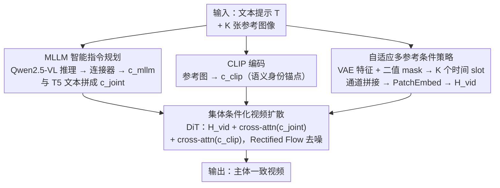

# BindWeave: Subject-Consistent Video Generation via Cross-Modal Integration

**会议**: ICLR 2026  
**arXiv**: [2510.00438](https://arxiv.org/abs/2510.00438)  
**代码**: [https://lzy-dot.github.io/BindWeave/](https://lzy-dot.github.io/BindWeave/) (项目页)  
**领域**: 视频生成 / 主体一致性  
**关键词**: Subject-to-Video, MLLM条件注入, DiT, 多参考图像, 跨模态推理  

## 一句话总结
BindWeave 用多模态大语言模型（MLLM）替代传统的浅层融合机制来解析多主体复杂文本指令，生成主体感知的隐状态作为 DiT 的条件信号，结合 CLIP 语义特征和 VAE 细粒度外观特征，实现高保真、主体一致的视频生成。

## 研究背景与动机
**领域现状**：DiT 架构的视频生成模型（Wan、HunyuanVideo 等）已能生成高质量长视频，但对主体身份、外观的精确控制仍然不足

**现有痛点**：
   - 现有 S2V 方法（Phantom、VACE 等）采用"分离-融合"的浅层信息处理范式——用独立编码器分别提取图像和文本特征，再通过拼接或 cross-attention 做后期融合
   - 对简单的外观保持指令尚可，但面对涉及复杂空间关系、时序逻辑、多主体交互的提示时，浅层融合无法建立深层的跨模态语义关联
   - 导致身份混淆、动作错位、属性混合等问题

**核心矛盾**：文本提示中的复杂语义（如"人物 A 向人物 B 递出礼物"）需要深度跨模态推理才能正确解析，浅层融合做不到

**本文目标**：建立文本命令与视觉实体之间的深层语义关联，准确解析多主体的角色、属性和交互

**切入角度**：用预训练的 MLLM 作为"智能指令解析器"，在生成前就完成深度跨模态推理

**核心 idea**：用 MLLM 的深度推理能力替代浅层编码器融合，生成同时编码主体身份和交互关系的条件信号来引导 DiT

## 方法详解

### 整体框架
BindWeave 要解决的是：当一条文本提示里挤进多个主体、还带上空间关系和交互逻辑（"人物 A 向人物 B 递礼物"）时，怎么让视频生成模型不把身份认混、不把动作错配。它的核心思路是把"理解指令"和"生成视频"两步拆开，前一步交给一个多模态大模型来做深度推理，后一步才是 DiT 扩散。

整条 pipeline 这样转：输入是文本提示 $\mathcal{T}$ 加 K 个参考图像 $\{I_k\}$，三路并行处理后在 DiT 里汇合。第一路把文本和图像拼成一段交错序列送进 MLLM，让它把角色/属性/交互绑定到对应的参考主体上、吐出一份"主体感知"的隐状态，经轻量连接器投影后与 T5 文本特征拼成联合条件 $c_{\text{joint}}$；第二路用 CLIP 把参考图编码成语义身份锚点 $c_{\text{clip}}$；第三路用 VAE 把参考图编码成像素级外观特征 $c_{\text{vae}}$，放进视频 latent 时间轴上专门 padding 出来的 K 个 slot，通道拼接后 PatchEmbed 成视频 token $H_{\text{vid}}$。最后 DiT 在 Rectified Flow 框架下，把 $c_{\text{joint}}$、$c_{\text{clip}}$ 通过 cross-attention 叠加到 $H_{\text{vid}}$ 上去噪，生成主体一致的视频。

### 关键设计

**1. MLLM 智能指令规划：用深度推理替代浅层编码器融合**

针对的痛点是浅层"分离-融合"范式建立不了真正的跨模态语义关联——独立编码器各提各的特征，到后期拼接时已经丢掉了"谁对谁做什么"的逻辑。BindWeave 改用 Qwen2.5-VL-7B 处理一段交错排列的文本+图像序列：把输入拼成统一多模态序列 $\mathcal{X} = [\mathcal{T}, \langle\text{img}\rangle_1, ..., \langle\text{img}\rangle_K]$，每张参考图用一个占位符 token 让 MLLM 在内部和对应图像对齐，从而在生成前就把文本命令绑定到对应视觉实体，输出隐状态 $H_{\text{mllm}} = \text{MLLM}(\mathcal{X}, \mathcal{I})$。由于 MLLM 是冻结的、特征空间和扩散模型不一致，这份隐状态再经一个可训练的轻量连接器投影成 $c_{\text{mllm}}$，最后与 T5 文本特征拼成联合条件 $c_{\text{joint}} = \text{Concat}(c_{\text{mllm}}, c_{\text{text}})$。之所以有效，是因为 MLLM 的多模态推理能力远超 CLIP/T5 这类独立编码器的浅层特征提取，能真正理解"谁做什么、对谁做、在哪里做"这种带角色和交互的复杂逻辑——这正是浅层融合做不到的那一层。

**2. 自适应多参考条件策略：给参考图像单开时间 slot，不和视频帧混在一起**

参考图像本质上不是视频帧（S2V 不同于 I2V），如果直接塞进视频序列会污染时序建模。BindWeave 的做法是先在视频 latent 的时间维度上 padding 出 K 个零位置 $\tilde{\mathbf{x}}_t = \text{pad}_T(\mathbf{x}_t, K)$，再把每张参考图像的 VAE 特征 $c_{\text{vae}} = \mathcal{E}_{\text{VAE}}(\{I_{\text{ref}}^i\})$ 和一张二值 mask 放到这些专用 slot 里（其余位置全 0），通道拼接后统一 PatchEmbed 成视频 token：

$$H_{\text{vid}} = \text{PatchEmbed}\big(\text{concat}_c(\tilde{\mathbf{x}}_t,\ \tilde{c}_{\text{vae}},\ \tilde{m}_{\text{ref}})\big)$$

二值 mask 的作用是强调主体区域，让模型知道这些位置是"参考"而非"待生成的帧"。这种专用时间 slot + mask 的设计既保留了像素级参考外观信息，又因为参考条件只在 padding 出的 slot 内生效、不碰原视频时间轴，避免了参考图直接与视频帧混合带来的时序干扰。

**3. 集体条件化视频扩散：高层推理、语义身份、底层外观三路分工注入**

光有 MLLM 的高层语义和参考外观还不够，关键是怎么让它们在 DiT 里协同而不互相打架，于是 BindWeave 让三个层次的条件信号各司其职。底层外观细节由上一个设计的 $c_{\text{vae}}$ 在输入层注入、已经融进 $H_{\text{vid}}$；高层关系推理走联合条件 $c_{\text{joint}}$ 通过 cross-attention 注入，负责场景构图；语义身份引导用 CLIP 特征 $c_{\text{clip}} = \mathcal{E}_{\text{CLIP}}(\{I_{\text{ref}}^i\})$ 走一路独立的 cross-attention 来锚定主体 ID。两路注意力的输出叠加在视频特征上：

$$H_{\text{out}} = H_{\text{vid}} + \text{Attn}(Q_{\text{vid}}, K_{\text{joint}}, V_{\text{joint}}) + \text{Attn}(Q_{\text{vid}}, K_{\text{clip}}, V_{\text{clip}})$$

这样高层负责"理解关系"、CLIP 负责"保身份"、VAE 负责"保细节"，三者结构化地分工，缺任何一层都会让生成结果在对应维度上退化（消融实验证实了这一点）。

### 损失函数 / 训练策略
- Rectified Flow + MSE 速度场预测损失：$\mathcal{L} = \|u_\Theta(z_t, t, c_{\text{joint}}, c_{\text{clip}}, c_{\text{vae}}) - v_t\|^2$
- 从 OpenS2V-5M 中精选 100 万高质量视频-文本对
- 两阶段训练：1000 步核心数据稳定 + 5000 步全量数据扩展
- 512 xPU，batch size 512，lr=5e-6，AdamW
- 参考图像随机旋转/缩放增强，防止 copy-paste 伪影
- 推理：50 步，CFG scale ω=5

## 实验关键数据

### 主实验 — OpenS2V-Eval Benchmark（180 prompts，7 类场景）

| 方法 | NexusScore↑ | NaturalScore↑ | GmeScore↑ | Total↑ |
|------|-----------|-------------|---------|--------|
| Phantom | 较低 | 中等 | 中等 | 中等 |
| VACE | 中等 | 较低（运动不自然）| 中等 | 中等 |
| SkyReels-A2 | 较高 | 较低（畸变）| 中等 | 中低 |
| Kling-1.6 | 中等 | 高 | 高 | 高 |
| **BindWeave** | **最高** | **竞争力强** | **竞争力强** | **最高** |

- BindWeave 在 NexusScore（主体一致性核心指标）上显著领先所有开源和商业模型
- 在 FaceSim、Aesthetics、MotionSmoothness 等其他指标上保持竞争力

### 消融实验

| 配置 | 效果 |
|------|------|
| Full BindWeave | 最优 |
| w/o MLLM（用简单编码器替代）| 多主体场景身份混淆，交互逻辑错误 |
| w/o CLIP 特征 | 主体身份保持下降 |
| w/o VAE 细节注入 | 外观细节丢失 |

### 关键发现
- **MLLM 深度推理是核心优势**：在多主体复杂交互场景中优势最明显，浅层融合方法在此场景下严重退化
- **三层条件信号互补**：MLLM 提供语义推理，CLIP 保 ID，VAE 保细节——缺任何一层都会降级
- **商业模型在美学上强但主体一致性弱**：Kling、Vidu 视觉质量好但常出现常识违反（如扭曲的肢体）

## 亮点与洞察
- **MLLM 作为指令解析器**的范式转换：不再是"分别编码再融合"，而是"先用 MLLM 深度理解再指导生成"——原理上更合理，效果上也更好
- **三层条件化的设计哲学**：高层推理（MLLM）→ 中层语义（CLIP）→ 底层像素（VAE），层次分明，各司其职
- **轻量连接器策略有效**：只用两层 MLP 就能对齐 MLLM 和 DiT 的特征空间，说明 MLLM 的隐状态已经携带了足够的结构化信息

## 局限与展望
- MLLM（Qwen2.5-VL-7B）增加了推理计算开销
- 训练数据仅 100 万条，扩大数据量可能进一步提升泛化能力
- 尚未处理视频中主体的遮挡和恢复问题
- 参考图像数量限制（1-4），极多主体的场景未验证

## 相关工作与启发
- **vs Phantom**：双分支独立处理 text/image 再注入 DiT，属于浅层融合；BindWeave 用 MLLM 做端到端深度推理
- **vs VACE**：统一输入格式通过残差块注入，但仍缺乏跨模态推理能力
- **vs per-subject optimization（CustomVideo 等）**：需要对每个主体单独微调，BindWeave 是端到端无需微调的

## 评分
- 新颖性: ⭐⭐⭐⭐ MLLM 作为指令解析器替代浅层融合是有新意的架构设计
- 实验充分度: ⭐⭐⭐⭐ OpenS2V 标准基准 + 开源/商业方法全面对比
- 写作质量: ⭐⭐⭐⭐ 架构描述清晰，动机阐述充分
- 价值: ⭐⭐⭐⭐⭐ 解决了多主体视频生成的关键痛点，实际应用价值高

<!-- RELATED:START -->

## 相关论文

- [\[ICLR 2026\] Phantom-Data: Towards a General Subject-Consistent Video Generation Dataset](phantom-data_towards_a_general_subject-consistent_video_generation_dataset.md)
- [\[CVPR 2026\] UniAVGen: Unified Audio and Video Generation with Asymmetric Cross-Modal Interactions](../../CVPR2026/video_generation/uniavgen_unified_audio_and_video_generation_with_asymmetric_cross-modal_interact.md)
- [\[CVPR 2026\] Cross-Subject EEG-to-Video Reconstruction and Beyond](../../CVPR2026/video_generation/cross-subject_eeg-to-video_reconstruction_and_beyond.md)
- [\[ICLR 2026\] MAGREF: Masked Guidance for Any-Reference Video Generation with Subject Disentanglement](magref_masked_guidance_for_any-reference_video_generation_with_subject_disentang.md)
- [\[ICLR 2026\] 3D Scene Prompting for Scene-Consistent Camera-Controllable Video Generation](3d_scene_prompting_for_scene-consistent_camera-controllable_video_generation.md)

<!-- RELATED:END -->
