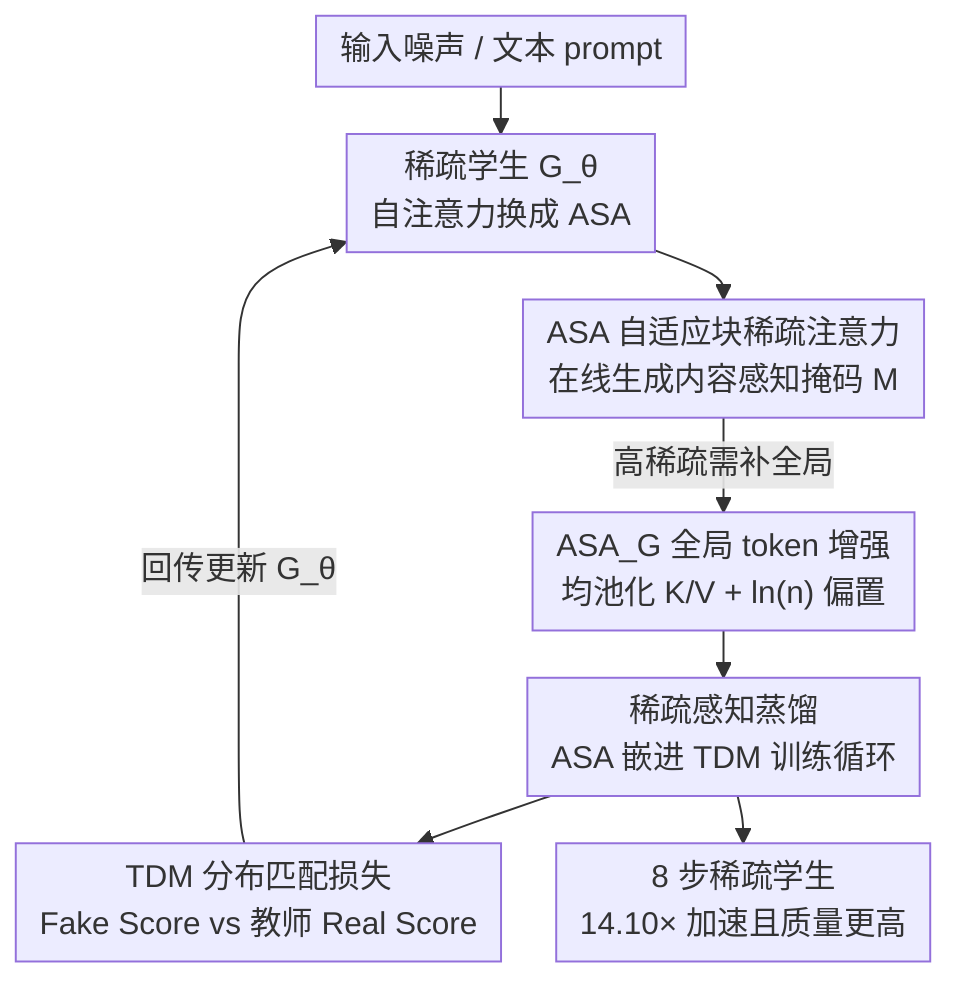

# BLADE: Block-Sparse Attention Meets Step Distillation for Efficient Video Generation

**会议**: ICLR2026  
**OpenReview**: [https://openreview.net/forum?id=O9J20MsmRl](https://openreview.net/forum?id=O9J20MsmRl)  
**代码**: [项目主页 ziplab.co/BLADE-Homepage](http://ziplab.co/BLADE-Homepage/)  
**领域**: 视频生成 / 扩散模型 / 模型效率  
**关键词**: 视频扩散, 块稀疏注意力, 步蒸馏, 轨迹分布匹配, data-free  

## 一句话总结
BLADE 把"动态块稀疏注意力"和"少步蒸馏"放进同一个 data-free 联合训练框架里协同优化，在 Wan2.1-1.3B 上做到 14.10× 端到端加速、CogVideoX-5B 上 8.89×，且 VBench-2.0 质量反而比 50 步原始模型还高。

## 研究背景与动机
**领域现状**：扩散 Transformer（DiT）是目前高质量视频生成的事实标准，但它有两个叠加的速度瓶颈——一是迭代去噪需要几十步采样，二是注意力随序列长度平方增长，而视频引入时间维后 token 数动辄上万到十几万，平方复杂度被进一步放大。

**现有痛点**：业界已有两条独立的提速路线。一条是**步蒸馏**（step distillation），把 50 步的"教师"蒸馏成 1–8 步的"学生"；另一条是**稀疏注意力**，降低每一步的注意力代价。但单独用任何一条都不够，真正的麻烦在于把两者**组合**起来：① 训练无关地把现成稀疏注意力直接套在已蒸馏模型上（training-free 拼接），效果次优，因为蒸馏过程对稀疏掩码"毫不知情"；② 先蒸馏、再单独微调稀疏（sequential pipeline），又会重新需要海量高质量视频数据来微调，把现代 data-free 蒸馏好不容易省下的数据成本又赔回去。

**核心矛盾**：稀疏和蒸馏被当成两个**互不相干的后处理步骤**串行执行，导致要么质量掉、要么数据成本回潮。更糟的是视频域的稀疏掩码本身就难设计——很多方法用**静态、与内容无关**的稀疏模式（固定局部窗、固定步长），无法适应视频多变的时空结构，高稀疏率下细节和长程依赖大量丢失；少数动态掩码方法（如 VSA）又假设规整的 3D token 网格，遇到不规则潜在形状要 padding 对齐，反而吃掉了稀疏带来的实际收益；SpargeAttention 能 training-free 但不能训练、稀疏率也上不去。

**本文目标**：设计一个既**计算高效**、又**内容自适应**、还能**同时支持 training-free 推理和训练感知模式**的稀疏注意力，并且让稀疏从训练第一刻起就被蒸馏过程"感知到"。

**切入角度**：作者的核心观察是——与其事后拼接，不如在蒸馏的每一步训练里就让学生模型"带着稀疏约束"去对齐教师的生成轨迹，让学生学到一条在稀疏条件下依然稳健的少步生成路径。

**核心 idea**：用一个 data-free 的"稀疏感知联合训练"框架，把动态块稀疏注意力（ASA）直接嵌进轨迹分布匹配（TDM）蒸馏循环，让稀疏和少步一起被学出来，而不是分两步压缩。

## 方法详解

### 整体框架
BLADE 是一个师生（teacher-student）框架。教师 $f_\phi$ 是预训练好的、高质量但慢的多步 DiT 视频扩散模型；学生 $G_\theta$ 一开始与教师同架构、同权重，唯一改动是把学生里标准的自注意力层**替换成 ASA（自适应块稀疏注意力）**。训练沿用 TDM（Trajectory Distribution Matching）范式：每次迭代里，稀疏学生 $G_\theta$ 生成一段中间轨迹，再通过一个 data-free 的 score 蒸馏损失，把学生轨迹的**分布**对齐到教师轨迹的分布上。这样学生在 ASA 施加的算力约束下，依然学会输出高质量结果。整条链路里没有用到任何真实视频训练数据，全部靠教师生成引导信号（data-free）。

具体到一个蒸馏区间 $[t_{i-1}, t_i)$：稀疏生成器 $G_\theta$ 对输入 $x_{t_i}$ 去噪得到 $x_{t_{i-1}}$，把这个输出**重新加高斯噪声**得到中间样本 $x_{t_j}$；一个专门的 **Fake Score 模型** $f_\psi$ 评估这个再加噪样本，其输出与 **Real Score 模型**（即预训练教师）的打分相减，得到分布匹配损失 $\nabla_\theta D_{\mathrm{KL}}$，直接回传更新学生生成器，逼它在分布层面对齐教师轨迹。

### 关键设计

**1. ASA 自适应块稀疏注意力：用在线低成本探针生成内容感知的块掩码**

针对"静态稀疏模式不适应视频多变时空结构"这个痛点，ASA 让每个 query 块在线地、根据内容动态地决定该关注哪些 key/value 块。它建立在块稀疏注意力之上，利用"视频潜在表示里相邻 token 语义相近"这一先验，让同一块内的 query 共享一个掩码。流程分三步：

首先是**保持局部性的 token 重排**。标准 raster-scan 分词会打乱 token 的空间邻接关系，ASA 先用 Gilbert 空间填充曲线把 token 重新排序再分块，使每个块内装的是空间上连续的信息、语义更连贯，让后续按阈值剪枝更准。

其次是**高效块重要度估计**。理想做法是算完整注意力 $P=\mathrm{softmax}(QK^\top/\sqrt{d_k})$ 再按 $b\times b$ 分块做 max-pooling 得到重要度矩阵——但算全矩阵就失去了提速意义。ASA 改成在线近似：从每个块里只采样 $k$ 个代表 token（$k<b$）构成更小的 $Q_s, K_s$，算一张低分辨率注意力图 $P_{\text{approx}}$，再 max-pool 得到块重要度 $P_{\text{imp}}$。这把掩码生成复杂度从 $O(N^2)$ 降到约 $O\!\left(N^2\cdot (k/b)^2\right)$。和 SpargeAttention 把每块塌缩成单个均值 token 不同，ASA 保留了块内结构（在采样 token 上算注意力再 max-pool），能更细地捕捉块内显著模式。

最后是**阈值掩码构造**。把 $P_{\text{imp}}$ 每一行降序排序，累加 key 块的注意力分直到超过设定阈值（如 90%/95%），取最少的那批 key 块进掩码 $M$。这种"按累积重要度截断"的动态剪枝保住了最显著的注意力路径、跳过低信息块，给精度和效率一个灵活的折中旋钮。实现上块大小取 $b=128$、每块采样 $k=16$。

**2. ASA_G 全局 token 增强：在高稀疏下软性保住全局上下文**

纯 ASA（标准版，training-free）在高稀疏率下有个隐患——剪掉大量块后会丢失全局信息。ASA_G 针对这个问题增强 K、V：对 K、V 各做窗口大小 $n$ 的均池化生成一组"全局 token"，长度压到原来的 $1/n$，拼接成 $K_{\text{aug}}=\mathrm{Concat}(K, \mathrm{MeanPool}_n(K))$（V 同理）。注意力计算时，query 与原始 K 区域的交互仍由二值稀疏掩码 $M$ 控制（保细粒度细节），而对全局 token 区域施加一个固定的加性偏置 $\ln(n)$：

$$\text{score}_{\text{global}} \mathrel{+}= \ln(n)$$

这个偏置用来补偿均池化的平均效应，让每个全局 token 的注意力贡献"等效于它所代表的 $n$ 个细粒度 token 的完整重要度"，从而软性地保证每个 query 始终对全局上下文有感知，避免大部分块被剪掉时发生灾难性的信息丢失。标准版称 ASA、增强版称 ASA_G，后者专门用于蒸馏训练场景。

**3. TDM 轨迹分布匹配：data-free 的分布级蒸馏地基**

BLADE 的蒸馏地基是 TDM。它不强求学生轨迹与教师**逐实例**严格对齐，而是在每个采样区间把学生中间样本的**分布**对齐到教师对应的扩散分布上，靠的是一个 data-free 的 score 蒸馏过程，只需预训练教师生成引导信号、不碰原始（常常私有的）训练集。它涉及三个组件：教师 $f_\phi$ 提供真实 score $s_\phi$；学生生成器 $G_\theta$ 通过 $K$ 步去噪生成样本；以及一个 **fake score 模型** $f_\psi$ 来近似学生那个不可解的样本 score。

fake score 模型被参数化成去噪器，用学生生成样本 $x_{t_i}$ 当去噪目标训练：

$$L(\psi)=\sum_{i=0}^{K-1}\mathbb{E}_{x_{t_i}\sim p_{\theta,t_i}}\mathbb{E}_{x_j\sim q(x_j|x_{t_i})}\,\lVert f_\psi(x_j,j)-x_{t_i}\rVert_2^2$$

学生生成器则最小化学生轨迹分布与教师轨迹分布的 KL 散度 $L(\theta)=\sum_i \lambda_i D_{\mathrm{KL}}(p_{\theta,t_i}\Vert p_{\phi,t_i})$，实际优化时把学生不可解的真 score 换成估计 score $s_\psi$，梯度近似为 $\sum \lambda_j[s_\psi(x_j,j)-s_\phi(x_j,j)]\frac{\partial x_{t_i}}{\partial\theta}$。两个工程选择让它实用：蒸馏区间 $[t_i,t_{i+1})$ 互不重叠，使单个 fake score 模型就够用所有阶段；学生反传每次只跨一个 ODE 步，省显存。

**4. 稀疏感知联合训练：把 ASA 直接塞进蒸馏循环，而不是事后压缩**

这是 BLADE 的"题眼"，也是它区别于前人"先蒸馏后压缩"的根本之处。BLADE 不把稀疏当训练后的压缩步骤，而是在 TDM 的**每一次训练迭代**里，学生 $G_\theta$ 都直接用 ASA 机制生成轨迹，分布匹配损失随即根据"在这些动态稀疏约束下的输出质量"来更新学生权重。这种共同设计（co-design）对模型形成强正则——逼学生学到一个在稀疏下依旧稳健的、语义化的表示，常常反而带来更高的感知质量。这也解释了论文一个有趣现象：尽管高稀疏 + 少步，BLADE 居然能**超过 50 步稠密教师**的质量——作者归因于联合训练的正则效应：50 步长轨迹会累积数值误差、过拟合到不连贯的细节，而稀疏感知蒸馏逼学生走一条更直接稳定的生成路径，隐式过滤掉教师过程里的"绕路"和噪声。

### 损失函数 / 训练策略
训练交替优化两个目标：fake score 模型按上面的去噪 MSE $L(\psi)$ 更新，学生生成器按分布匹配的 score 差梯度更新。训练 data-free——用 1 万条文本 prompt（采自 JourneyDB，并用 Qwen2.5-3B-Instruct 增强多样性）驱动教师生成引导信号，不需要真实视频数据。蒸馏典型只跑 100–200 次迭代，8×A800(80GB) 上完成，学生蒸到 8 步。

## 实验关键数据

### 主实验
在 VBench-2.0 上评测 CogVideoX-5B 与 Wan2.1-1.3B（除 Baseline 外其余均用 TDM 蒸到 8 步）：

| 模型 | 方法 | 稀疏率 | VBench-2.0 总分 | 加速比 |
|------|------|--------|------|------|
| CogVideoX-5B | Baseline（50 步稠密） | - | 0.534 | 1× |
| CogVideoX-5B | FA2 | - | 0.539 | 7.93× |
| CogVideoX-5B | **ASA_G（本文）** | 0.82 | **0.569** | **8.89×** |
| Wan2.1-1.3B | Baseline（50 步稠密） | - | 0.563 | 1× |
| Wan2.1-1.3B | STA | 0.74 | 0.528 | 10.53× |
| Wan2.1-1.3B | FA2 | - | 0.580 | 9.37× |
| Wan2.1-1.3B | **ASA_G（本文）** | 0.8 | **0.570** | **14.10×** |

亮点是 ASA_G 在两个模型上质量**都超过 50 步稠密 baseline**（0.534→0.569、0.563→0.570），同时拿到 8.89×/14.10× 加速；Wan2.1-1.3B 上 Human Fidelity 高达 0.918。

效率分解（Wan2.1-1.3B，H20 上测）：

| 指标 | FA2-50 | FA2-8 | ASA-8 |
|------|--------|-------|-------|
| Kernel 时间 (ms) | 73.25 | 73.25 | 22.21 |
| Kernel 加速 | 1.00× | 1.00× | 3.30× |
| 端到端时间 (s) | 338.41 | 36.11 | 24.00 |
| 端到端加速 | 1.00× | 9.37× | 14.10× |

注意力 kernel 单独提速 3.30×，但端到端只 1.504×（24.00s vs 36.11s）——说明蒸馏后注意力已不再是主瓶颈，VAE 编解码和非注意力层开始主导耗时。

### 消融实验
training-free 推理下纯 ASA 与其他稀疏注意力对比（Wan2.1-1.3B，8 步蒸馏模型，前两步用 FA2、其余用稀疏）：

| 方法 | 稀疏率 | PSNR | SSIM | 说明 |
|------|--------|------|------|------|
| STA | 0.74 | 16.72 | 0.6190 | 静态局部窗 |
| SVG | 0.75 | 16.68 | 0.6390 | 二选一预设掩码 |
| **ASA** | 0.75 | **19.55** | **0.7433** | 本文动态掩码，同稀疏率大幅领先 |
| RaA | 0.50 | 22.07 | 0.8191 | Radial Attention |
| **ASA** | 0.50 | **22.20** | **0.8290** | 同稀疏率仍最优 |

### 关键发现
- 同稀疏率下 ASA 的 PSNR/SSIM 全面碾压 STA、SVG、RaA，证明"内容自适应动态掩码 + 块内结构保留"确实比静态/粗粒度掩码更能保住视频细节。
- 稀疏感知联合训练带来的正则效应让 8 步稀疏学生质量**反超** 50 步稠密教师——这是本文最反直觉的发现，原因是它逼学生走更直接稳定的生成路径，过滤掉教师长轨迹累积的噪声与"绕路"。
- kernel 提速远大于端到端提速，暴露出蒸馏后注意力不再是瓶颈，后续优化重点应转向 VAE 与非注意力层。

## 亮点与洞察
- **"稀疏感知蒸馏"这个 co-design 视角很值**：把稀疏从"事后压缩"改成"训练时就被蒸馏感知"，一举绕开了 training-free 拼接质量差、sequential 微调要海量数据这两个老问题，是本文最核心的"啊哈"。
- **ASA 的在线探针很巧**：用每块采样 $k=16$ 个 token 算低分辨率注意力来估块重要度，把 $O(N^2)$ 降到 $O(N^2(k/b)^2)$，既让在线掩码生成可行、又比 SpargeAttention 的单均值 token 更准——保留块内结构是关键差别。
- **全局 token 的 $\ln(n)$ 偏置是个干净的小 trick**：用一个解析偏置补偿均池化的平均效应，软性保住全局上下文，避免高稀疏下信息崩塌，几乎零额外成本。
- **稀疏当正则**这一思路可迁移：作者明确指出可推广到 3D 内容生成、高分辨率图像合成等其他生成域。

## 局限与展望
- 作者承认实验只覆盖中等长度视频，分钟级、几十万 token 的超长序列上 ASA 是否依然有效仍待验证。
- 当前 ASA kernel 用 Triton 实现（图简单），未能完全兑现理论加速比，需要更优化的 CUDA 实现才能榨干潜力。
- 自己补一点：端到端加速已显著次线性，意味着继续优化注意力的边际收益在递减，真正的瓶颈（VAE、非注意力层）没被本文触及；另外质量"反超教师"的结论依赖 VBench-2.0 这类偏语义忠实度的指标，像素级保真（PSNR/SSIM）下是否同样成立值得留意。

## 相关工作与启发
- **vs 训练无关稀疏拼接（如把 SpargeAttention 套在蒸馏模型上）**：他们事后拼，蒸馏对稀疏无感知导致质量次优；本文把 ASA 嵌进训练循环，学生从一开始就在稀疏约束下学，质量反而更高。
- **vs 静态稀疏（STA / Radial Attention）**：他们用固定局部窗或固定步长，内容无关、高稀疏掉点严重；本文动态、内容感知地在线生成掩码，同稀疏率 PSNR/SSIM 大幅领先。
- **vs VSA**：VSA 用固定注意力立方体、假设规整 3D 网格，不规则形状要 padding 吃掉收益；ASA 在重排后的块上做阈值剪枝，支持任意分辨率、且同时覆盖 training-free 与训练两种模式。
- **vs 纯 TDM（Luo et al., 2025）**：本文以 TDM 作蒸馏地基，但把稀疏感知注入其训练循环，从"只压步数"扩展到"步数与稀疏同时压"。

## 评分
- 新颖性: ⭐⭐⭐⭐⭐ 把稀疏与蒸馏从串行后处理改为 data-free 联合训练，视角新且解决了真实痛点。
- 实验充分度: ⭐⭐⭐⭐ 两个不同规模模型 + VBench-2.0 + kernel/E2E 效率 + 同稀疏率横比，较扎实；超长视频与 CUDA 实现留作未来工作。
- 写作质量: ⭐⭐⭐⭐ 动机递进清晰、ASA 三步讲得明白；部分实现细节（如阈值在不同表里 90%/95% 不一致）需查附录。
- 价值: ⭐⭐⭐⭐⭐ 14.10× 加速且质量不降反升，对视频扩散落地部署有直接价值。

<!-- RELATED:START -->

## 相关论文

- [\[ICLR 2026\] DSA: Efficient Inference For Video Generation Models via Distributed Sparse Attention](dsa_efficient_inference_for_video_generation_models_via_distributed_sparse_atten.md)
- [\[ICLR 2026\] SANA-Video: Efficient Video Generation with Block Linear Diffusion Transformer](sana-video_efficient_video_generation_with_block_linear_diffusion_transformer.md)
- [\[CVPR 2026\] RAPID: Reusing Attention Sparsity with Inter-step Adaptation for Efficient Video Diffusion](../../CVPR2026/video_generation/rapid_reusing_attention_sparsity_with_inter-step_adaptation_for_efficient_video_.md)
- [\[ICML 2026\] DFSAttn: Dynamic Fine-Grained Sparse Attention for Efficient Video Generation](../../ICML2026/video_generation/dfsattn_dynamic_fine-grained_sparse_attention_for_efficient_video_generation.md)
- [\[ICLR 2026\] VMoBA: Mixture-of-Block Attention for Video Diffusion Models](vmoba_mixture-of-block_attention_for_video_diffusion_models.md)

<!-- RELATED:END -->
