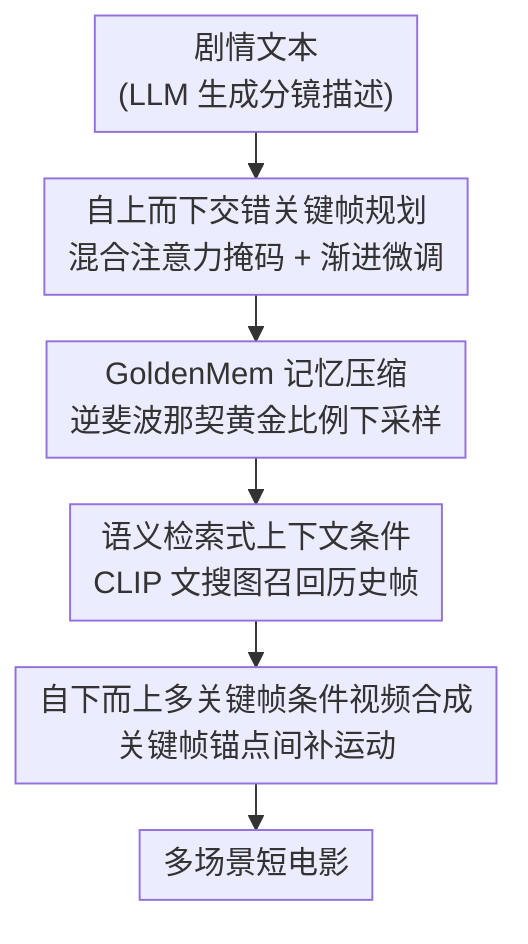

# Captain Cinema: Towards Short Movie Generation

**会议**: ICLR2026  
**OpenReview**: [https://openreview.net/forum?id=zlNZBxQZIC](https://openreview.net/forum?id=zlNZBxQZIC)  
**代码**: 待确认  
**领域**: 视频生成 / 扩散模型  
**关键词**: 短电影生成、长上下文、关键帧规划、记忆压缩、交错条件

## 一句话总结
Captain Cinema 把"生成一部短电影"拆成"自上而下先画一整套关键帧分镜、自下而上再把关键帧之间补成视频"两步，并用黄金比例记忆压缩（GoldenMem）把上千秒、几十个镜头的历史画面压进固定的 token 预算里，从而在长达数十个交错镜头上仍保持人物与场景一致。

## 研究背景与动机
**领域现状**：扩散类（DiT、Sora、CogVideo）和自回归类（VideoPoet、Emu）的视频生成模型，已经能产出 5–10 秒、视觉保真度很高的短片段，覆盖图像动画、视频编辑、风格化等任务。

**现有痛点**：这些方法本质都是"以片段为中心"的——它们擅长单镜头内部的局部时序连贯，却没有机制保证跨越多个镜头、多个场景的叙事连贯和视觉一致。一旦把生成时长拉到电影级（多场景、上千秒），就会撞上两堵墙：上下文长度爆炸（历史帧越堆越多，token 直接 OOM）和视觉漂移（人物长相、场景风格越生成越走样）。

**核心矛盾**：要讲清一个完整故事，模型既要捕捉长程依赖（记住几十个镜头前那个角色长什么样），又要保留细粒度细节（当前镜头的画质不能糊）。这两者在固定算力下天然冲突——把全部历史都塞进上下文则算不动，砍掉历史则一致性崩。

**本文目标**：在可控算力内，生成多场景、人物/场景一致、叙事连贯的短电影；并把"长程规划"和"局部运动合成"这两件难度不同的事解耦开。

**切入角度**：作者观察到，人类拍电影本就是先有分镜（storyboard）再补镜头之间的运动。于是把生成显式拆成两层：先用一个"导演"模型生成一串关键帧把整条叙事框定下来（全局把控），再用一个"摄影"模型在关键帧之间填运动（局部保真）。

**核心 idea**：用"自上而下交错关键帧规划 + 自下而上关键帧条件视频合成"两段式取代端到端长视频生成，并用黄金比例压缩的视觉记忆库 GoldenMem 让长上下文的 token 开销恒定。

## 方法详解

### 整体框架
Captain Cinema 接收一段详细的电影剧情文本，输出一部多场景的短电影。整条流水线分两半：**上半段（top-down）** 把剧情先变成一串带角色标注的关键帧——它在一个 Text-to-Image 模型（Flux 1.Dev）上做交错图文生成，每个关键帧既看自己的文本、又能回看压缩后的历史关键帧，从而在整部片子层面保持人物与场景一致；这一步的核心是 GoldenMem 记忆压缩和语义检索式条件。**下半段（bottom-up）** 把这串关键帧当作锚点，喂给一个支持长上下文的视频生成模型（Seaweed-3B），在相邻关键帧之间补出时空运动，生成每个镜头的完整画面。两半之间用统一的交错图文/视频-文本数据格式打通，整套模型直接在整部电影上训练（而非单场景片段），并配合渐进式长上下文微调稳定训练。

### 关键设计

**1. 自上而下交错关键帧规划：用混合注意力掩码让 MM-DiT 既高效又能聚合全局**

要在一个文生图模型上"一次画一整套有连贯性的关键帧"，难点是 P 个图文对之间既要各自清晰、又要互相对齐。作者把 Flux 的结构利用起来：它由 $D$ 个双流（图-文）块和 $S$ 个单流块串成。给定 $P$ 个图文对 $S=\{(x_i,y_i)\}_{i=1}^P$，每对拼成 $z_i=[x_i\|y_i]$。前 $D$ 个**局部块**用块对角掩码 $M_{\text{local}}=\mathrm{diag}(M_1,\dots,M_P)$，让每个 $z_i$ 只关注自己——这样早期计算保持局部、便宜；后 $S$ 个**全局块**把所有对拼成 $Z=[z_1\|\dots\|z_P]$，用全零掩码 $M_{\text{global}}\equiv 0$ 做双向跨对注意力（训练），或换成上三角掩码做因果自回归生成。先局部省算力、后全局聚一致性，正是关键帧之间风格与角色对齐的来源。

**2. GoldenMem：用黄金比例逆斐波那契下采样把长视觉记忆压成恒定开销**

随着镜头变多，历史关键帧的 token 会线性膨胀直至算不动。GoldenMem 的做法是：只把当前帧存全分辨率，越旧的帧编码得越粗。设黄金比 $\varphi=(1+\sqrt5)/2\approx1.618$，最新潜变量短边为 $s_0$（如 25），第 $i$ 帧短边按 $s_i=\lfloor s_{i-1}/\varphi\rfloor$ 缩小，于是得到逆斐波那契序列 $(25,15,9,5,3)$（$k=4$ 时）。每个 $s_i\times s_i$ 潜变量切成 $p\times p$ 块、贡献 $t_i=(s_i/p)^2$ 个 token。因为 $s_i$ 几何衰减，总条件开销

$$T=\sum_{i=0}^{k}t_i=t_0\big(1+\varphi^{-2}+\varphi^{-4}+\dots\big)<\frac{\varphi^2}{\varphi^2-1}t_0\approx 1.62\,t_0$$

也就是说，无论保留多少帧历史，总 token 量都被卡在单帧开销的 ~1.62 倍以内。实验里把"原始堆叠"和 GoldenMem 对比，前者 token 随对数线性涨到 3 万多，后者始终压在 1 万附近，并且能把上下文从 32 帧推到 48 帧而不 OOM。这是整套方法能"记住很久以前的角色长相"却不爆显存的关键。

**3. 语义检索式上下文条件：按语义相关而非时间距离召回历史帧**

电影里大量用闪回、伏笔、时间循环，最相关的历史帧未必是时间上最近的。作者因此不按时间顺序条件，而是按语义相关度检索：用 CLIP（文-图）和 T5（文-文）的 embedding 给当前要生成的帧召回最相关的历史帧再做条件。对比发现 CLIP 的文搜图召回覆盖率稳定高于 T5 的文搜文——因为关键帧本质是图像，用图像侧 embedding 去匹配更贴合，召回到的历史画面更可能是真正该参考的那一张，从而支持非线性叙事结构。

**4. 自下而上多关键帧条件视频合成：把关键帧当锚点，让视频模型专注补运动**

有了高质量关键帧后，下半段只需解决"运动"。给定 $K$ 个关键帧 $\{I_1,\dots,I_K\}$（各为对应镜头的首帧），用拼接后的全局字幕 $c_{\text{tiled}}$ 和所有关键帧的视觉 embedding 一起条件一个扩散生成器 $G_\theta$：

$$V_k=\Big\{I_k,\ G_\theta\big(I_{1:K},\,c_{\text{tiled}},\,t=2{:}T_k\big)\Big\},\quad k=1,\dots,K$$

$G_\theta$ 为第 $k$ 个镜头补出 $f_{k,2},\dots,f_{k,T_k}$ 帧。多关键帧条件把外观锚定在镜头边界、并强制跨镜头运动平滑衔接。把"高层叙事规划"和"低层运动合成"解耦的好处很直接：视频模型不用再操心一致性（已由关键帧保证），可以专心做时序，于是伪影更少、环境上下文更连贯（如废墟里持续升起的烟）、镜头运动更平滑。

### 损失函数 / 训练策略
训练有两个稳定性要点。其一是**渐进式长上下文微调**：Flux 是带 guidance 的蒸馏模型，直接在长交错序列上微调会训练崩溃；从太晚的检查点（step 80K）热身又会遗忘蒸馏知识、产生伪影；实测从单图逐步扩到 8/16/32 交错对、并选 step 40K 这个"适度热身"点最稳。其二是**动态步长采样**：电影数据集相对预训练规模太小，朴素连续采样会过拟合，作者用动态步长（25% 重叠率上限）采样交错序列，比连续采样多出上千倍的有效序列。数据侧约 500 小时电影，用 PySceneDetect 切镜、取中段帧、去黑边、2:1 裁剪、Gemini-2.0 Flash 过滤并加 `<角色名>` 标注，得到约 30 万关键帧/镜头。关键帧模型在 32×H100 上训 40K 步（batch 32），视频模型在 256×H100 上训 15K 步。

## 实验关键数据

### 主实验
评测沿用 VBench-2.0 看视觉/时序、用 LCT 协议看文本语义对齐，并做 4 级人评（AHR 平均人类排名）。主要对比两个最接近的长视频基线：LCT 和 IC-LoRA + I2V。

| 方法 | 美学↑ | 视觉质量↑ | 一致性↑ | 动态↑ | 文本对齐↑ | 人评-质量↑ | 人评-语义↑ |
|------|-------|----------|--------|-------|----------|-----------|-----------|
| IC-LoRA | 54.1 | 60.5 | 88.7 | 61.1 | 23.1 | 1.5 | 2.3 |
| LCT | 56.2 | 59.9 | 94.8* | 51.8 | 23.9 | 2.4 | 3.1 |
| Ours (w/o MF-FT) | 56.8 | 60.9 | 91.9 | 64.4 | 25.7 | 2.8 | 3.5 |
| **Ours** | **57.2** | **61.7** | 91.0 | **65.4** | **26.1** | **3.3** | **3.7** |

`*` LCT 一致性分高但其实多数片段时序动态很低（静止画面易拿高 TC 分）。本文在美学、视觉质量、动态、文本对齐和两项人评上均领先，优势在"长序列上连贯且有生动运动"。

### 消融实验
**长上下文压力测试**（上下文从 8→48 对，Gemini Flash 2.5 打分 + VBench-2.0 身份一致性）：

| 方法 | 上下文对数 | 角色一致 | 场景一致 | 叙事连贯 | 身份一致 |
|------|-----------|---------|---------|---------|---------|
| LCT | 8 | 4.3 | 3.5 | 2.8 | 0.43 |
| LCT | 24 | 3.1 | 0.7 | 0.6 | 0.14 |
| Ours (w/ G.Mem) | 16 | 4.6 | 3.8 | 3.8 | 0.44 |
| Ours (w/ G.Mem) | 48 | 4.5 | 3.0 | 3.3 | 0.31 |

**GoldenMem 算力消融**（每块第一行为基线、第二行加 GoldenMem）：

| 配置 | 算力 PFLOPS | 视觉质量↑ | 文本对齐↑ | 说明 |
|------|------------|----------|----------|------|
| 16-frame | 30 → 21 | 4.4 → 4.3 | 4.1 → 4.1 | 算力降约 30%，质量几乎不掉 |
| 32-frame | 55 → 35 | 4.1 → 3.9 | 3.8 → 3.6 | 同上 |
| 48-frame | OOM → 52 | – → 3.6 | – → 3.5 | 基线直接 OOM，GoldenMem 仍能跑 |

### 关键发现
- LCT 在上下文涨到 24 对时质量断崖式下跌（场景一致 3.5→0.7），而本文加 GoldenMem 后到 48 对仍保住 >93% 一致性——长上下文鲁棒性主要由 GoldenMem 贡献。
- 多帧微调（MF-FT）这一项去掉后，人评质量从 3.3 掉到 2.8、动态从 65.4 掉到 64.4，说明自下而上的多关键帧条件对运动质量是有效的。
- 渐进微调对 warmup 长度敏感：不 warmup 会崩、过度 warmup（80K）会遗忘蒸馏知识出伪影，40K 是甜点。

## 亮点与洞察
- **黄金比例做记忆压缩很优雅**：用 $\varphi$ 的逆斐波那契下采样让总 token 收敛到 $\frac{\varphi^2}{\varphi^2-1}t_0\approx1.62t_0$ 的几何级数上界，是一个有闭式保证的"无论多长历史、开销恒定"方案，可迁移到任何需要长视觉记忆的自回归生成。
- **把一致性和运动解耦**最让人"啊哈"：先用图像模型保证跨镜头一致（图像模型本就擅长高保真单帧），再让视频模型只补运动，等于把一个难问题拆成两个各自擅长的子问题，避免端到端长视频既要又要的两难。
- **按语义而非时间检索历史**贴合电影的非线性叙事，这个思路可迁移到任何"当前内容该参考哪段历史"的长程生成（如长文档、长对话记忆）。

## 局限与展望
- 依赖外部 LLM（Gemini 2.5 Pro / GPT-4o）生成分镜描述，整体质量受这一前置环节制约，本文未端到端联合优化文本规划与画面生成。
- 训练成本极高（256×H100 训视频模型），且数据规模相对预训练仍小，需靠动态步长采样和渐进微调硬撑，泛化到训练分布外题材的能力存疑。
- 评测大量依赖 LLM 打分（Gemini Flash）和小样本人评，缺乏大规模客观长视频一致性指标；"一致性"指标本身在静止画面上会虚高（作者也点了 LCT 的 TC 分虚高问题），横向比较需谨慎。
- 关键帧是离散锚点，镜头之间运动仍由视频模型推断，复杂物理交互/长动作的连续性未必稳。

## 相关工作与启发
- **vs LCT**：LCT 直接在单场景数据上微调 MM-DiT 做长交错视频；本文直接从整部电影学习，并加 GoldenMem 压缩，长上下文鲁棒性显著更好（48 对仍稳，LCT 24 对已崩）。
- **vs IC-LoRA / StoryDiffusion 等叙事生成**：它们多聚焦"语义一致的图像集"；本文目标是完整连贯的叙事视频，显式拆成交错关键帧合成 + 多帧条件视频补全两步。
- **vs FramePack / MoC / FlexTok 等 token 压缩**：它们在注意力或 tokenizer 层做压缩；GoldenMem 则在"离散关键帧记忆"这个较少被讨论的层面做空间下采样压缩，专为长叙事视觉记忆优化。

## 评分
- 新颖性: ⭐⭐⭐⭐⭐ 两段式分解 + 黄金比例记忆压缩，朝"整部电影生成"迈了实打实一步
- 实验充分度: ⭐⭐⭐⭐ 主结果 + 长上下文压力测试 + 算力消融都有，但客观指标偏依赖 LLM 打分
- 写作质量: ⭐⭐⭐⭐ 框架清晰、公式给到位，图示丰富
- 价值: ⭐⭐⭐⭐⭐ 长视频一致性与长上下文记忆是当前生成的核心瓶颈，GoldenMem 思路可复用

<!-- RELATED:START -->

## 相关论文

- [\[CVPR 2026\] Captain Safari: A World Engine with Pose-Aligned 3D Memory](../../CVPR2026/video_generation/captain_safari_a_world_engine_with_pose-aligned_3d_memory.md)
- [\[CVPR 2025\] MovieBench: A Hierarchical Movie Level Dataset for Long Video Generation](../../CVPR2025/video_generation/moviebench_a_hierarchical_movie_level_dataset_for_long_video_generation.md)
- [\[ICLR 2026\] EditVerse: Unifying Image and Video Editing and Generation with In-Context Learning](editverse_unifying_image_and_video_editing_and_generation_with_in-context_learni.md)
- [\[ICLR 2026\] Anchor Frame Bridging for Coherent First-Last Frame Video Generation](anchor_frame_bridging_for_coherent_first-last_frame_video_generation.md)
- [\[ICLR 2026\] DSA: Efficient Inference For Video Generation Models via Distributed Sparse Attention](dsa_efficient_inference_for_video_generation_models_via_distributed_sparse_atten.md)

<!-- RELATED:END -->
