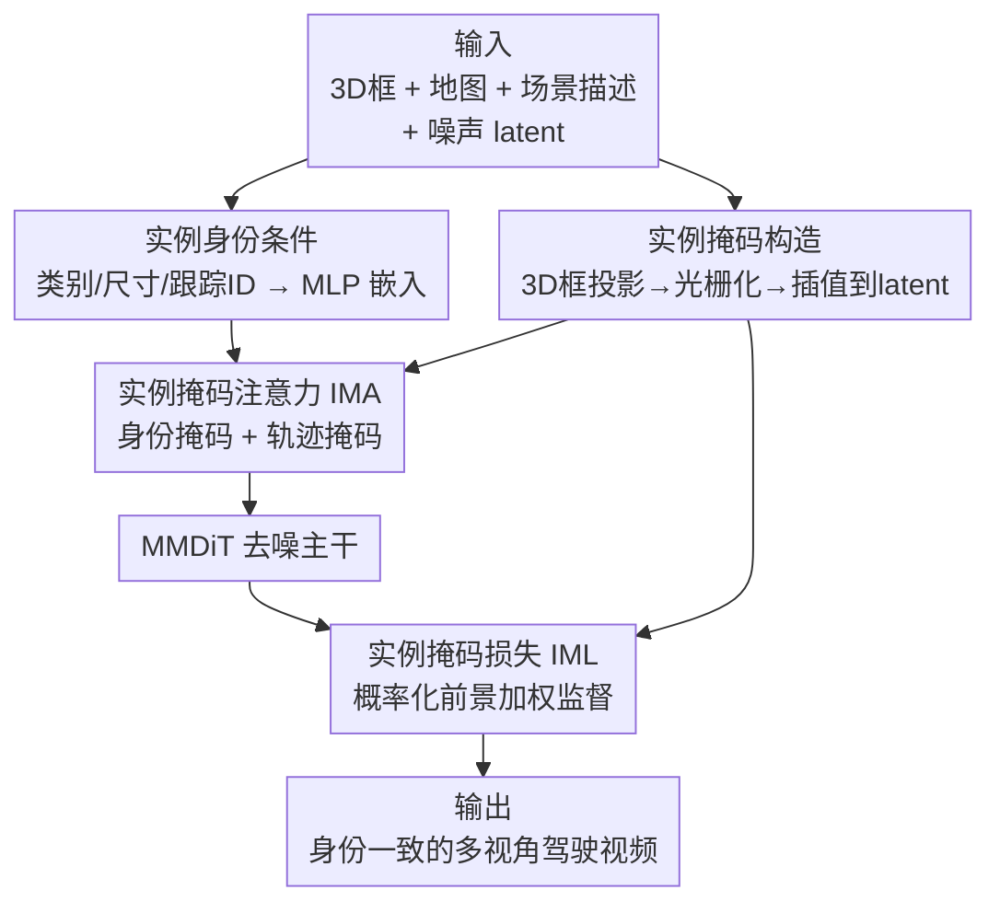

# ConsisDrive: Identity-Preserving Driving World Models for Video Generation by Instance Mask

**会议**: ICLR2026  
**OpenReview**: [https://openreview.net/forum?id=zgqFQM8VNe](https://openreview.net/forum?id=zgqFQM8VNe)  
**代码**: 项目页 https://shanpoyang654.github.io/ConsisDrive/page.html  
**领域**: 视频生成 / 自动驾驶世界模型  
**关键词**: 驾驶世界模型, 身份一致性, 实例掩码注意力, 时序一致性, nuScenes

## 一句话总结
ConsisDrive 在扩散式驾驶世界模型里用「实例掩码」把注意力和损失都约束到单个物体上——既让每个视觉 token 只能与自己实例的身份/轨迹 token 交互（防止 bus 慢慢变 truck、红车变黑车），又把监督重心压到前景，从而在 nuScenes 上把 FVD 降到 37.23、FID 降到 3.88，并显著提升下游感知/跟踪指标。

## 研究背景与动机
**领域现状**：自动驾驶的感知、跟踪、规划模型都依赖大规模、多视角、带精确标注的驾驶视频，但真实数据采集和标注成本极高。借助扩散视频生成的进展，「驾驶世界模型」成了低成本造数据的主流替代方案：给定 3D 框、道路地图、场景描述等条件，就能批量合成逼真的多视角驾驶视频。

**现有痛点**：这些扩散世界模型普遍有 **identity drift（身份漂移）**——同一个物体在不同帧里外观甚至类别都会变。论文用 Fig.1 给出三类典型翻车：DriveDreamer2 里公交车逐渐变成卡车（类别漂移）、MagicDrive-V2 里同一辆车颜色在帧间乱跳（颜色漂移）、以及小目标（行人）因前景被稀释而糊掉（前景稀释）。这种不一致直接拉低视频真实感，也让生成数据没法可靠地喂给跟踪、感知这类强依赖时序稳定性的下游任务。

**核心矛盾**：作者把根因归结为三点。其一，缺乏显式的实例身份条件，模型没有任何「锚」去在长时间跨度上保持同一身份；其二，现有 diffusion transformer 的注意力（如 FLUX 的 MMDiT 做全局 3D full attention）**不是实例感知的**，所有 token 不分实例地互相交互，导致跨实例信息泄漏（一辆车的颜色「渗」进另一辆）；其三，训练目标对整帧做均匀监督，而背景像素（天空、建筑）占绝大多数，监督被稀释，模型顾不上小前景的细粒度身份特征。

**本文目标**：把「实例感知」同时注入注意力机制和训练目标，让世界模型在实例级别上强制时序一致。

**核心 idea**：用从 3D 框投影构造的一组「实例掩码」当结构先验——既掩码注意力（每个 token 只准看自己实例的身份和轨迹），又掩码损失（监督向前景倾斜），一举把身份漂移摁住。

## 方法详解

### 整体框架
ConsisDrive 以 OpenSora V2.0 为底座：用 Video DC-AE 这个 3D VAE 编码视频、用 T5XXL + CLIP-Large 编码文本、用 MMDiT 做去噪主干。控制信号（3D 框投影、道路地图、场景描述）经 ControlNet 风格的注入——复制 MMDiT 双流主干的前 19 个 base block 作为专用 control/copy block，把条件特征与对应 base block 输出融合。在这之上，论文加了两个核心组件：**Instance-Masked Attention（IMA）** 把每个实例的身份条件（类别、尺寸、跟踪 ID）注入注意力，并用两张掩码限制 token 之间的可见性；**Instance-Masked Loss（IML）** 用前景掩码把去噪监督重心压到前景物体上。两组掩码都来自同一套「3D 框投影 → 光栅化 → 三线性插值到 latent」的实例掩码构造流程。

### 关键设计

**1. 实例掩码构造：把 3D 框变成 token 级别的「谁覆盖谁」查找表**

这是后面两个组件共用的地基，目的是回答一个问题——latent 空间里每个视觉 token 究竟属于哪些实例？论文定义了一个 token-to-instance 指示函数 $I(v_k)$：每个实例 $i$ 由 8 个 3D 角点 $C_i=\{X_{i,c}\}_{c=1}^{8}$ 描述，在第 $t$ 帧用相机参数 $(K_t, R_t, T_t)$ 把角点投影到图像平面 $\tilde{x}^t_{i,c}=K_t(R_t X_{i,c}+T_t)$，再做透视除法得到像素坐标，这些点的凸包围成多边形 $P^t_i$。光栅化得到二值掩码 $BM_i\in\{0,1\}^{T\times H\times W}$，再经三线性插值映射到 latent 的 $\widetilde{BM}_i$。于是对 VAE 压缩后的 patch token $v_k\equiv(t,p)$，有

$$I(v_k)=\{\,i \mid \exists(x,y),\ \widetilde{BM}_i(t,x,y)=1\,\}$$

即覆盖该 token 空间位置的所有实例 ID 集合。注意力掩码、轨迹掩码、损失掩码全都从这个 $I(v_k)$ 派生，保证三者口径一致。

**2. 实例身份条件：把类别+尺寸+跟踪 ID 编码成可注入的身份 token**

显式身份条件是治「类别漂移」的关键。对视频里每个实例 $i$，论文把三种属性融成一个全局身份嵌入：用 CLIP-Large 文本编码器 $\tau_\theta(\cdot)$ 提取类别标签 $c_i$ 的语义特征，用 Fourier 映射 $\gamma(\cdot)$ 编码跟踪 ID $\mathrm{ID}_i$ 和框尺寸 $s_i=(dx_i,dy_i,dz_i)$，拼接后过 MLP：

$$g_i=\mathrm{MLP}([\tau_\theta(c_i),\ \gamma(s_i),\ \gamma(\mathrm{ID}_i)])$$

全部 $n$ 个实例的嵌入集合 $G=\{g_i\}_{i=1}^n$ 既带语义身份（类别）又带几何身份（尺寸），还有唯一标识（ID），给模型提供了一个跨帧锚定同一物体的「身份指纹」。

**3. 实例掩码注意力 IMA：用两张掩码切断跨实例泄漏、打通同实例传播**

这是 IMA 的核心，针对「注意力不是实例感知」这一痛点。把 copy block 抽出的 $m=T_{c}\times H_{c}\times W_{c}$ 个视觉 token $V$ 和 $n$ 个身份 token $G$ 拼起来做带掩码的 3D 自注意力 $\tilde{V}=\mathrm{SA}_{\text{mask}}([V,G])$。掩码矩阵 $M\in\mathbb{R}^{(m+n)\times(m+n)}$ 由两条规则构成：

- **实例身份掩码**：若 $i\notin I(v_k)$，则 $M_{k,m+i}=M_{m+i,k}=-\infty$。即每个视觉 token 只能 attend 到覆盖它的那个实例的身份 token，强行把全局身份特征注入对应物体、同时屏蔽不同实例身份 token 之间的串扰，防止身份跨物体泄漏。
- **实例轨迹掩码**：若 $I(v_k)\cap I(v_j)=\varnothing$，则 $M_{k,j}=-\infty$。即只有属于同一实例（跨帧）的视觉 token 才能互相 attend，不同实例之间完全切断，从而让颜色、纹理这类外观特征**沿着物体的轨迹**传播，治住颜色漂移。

最后用门控残差把结果加回主干：$V=V+\tanh(\omega)\,\tilde{V}[{:}m]$，其中标量 $\omega$ 初始化为 0、可学习，让模型平滑地决定 IMA 的贡献权重，避免训练初期破坏底座。

**4. 实例掩码损失 IML：概率化地把监督压向前景，又不牺牲背景**

针对「均匀监督稀释前景」的痛点。先从指示函数构造二值损失掩码 $M_{\text{Loss}}(v_k)=\mathbb{1}\{I(v_k)\neq\varnothing\}$，只选中被至少一个实例覆盖的 token，掩码损失为 $L_{\text{mask}}=M_{\text{Loss}}\odot L$（$L$ 是原始去噪损失，$\odot$ 逐元素乘）。但若对所有样本都只盯前景，模型会过拟合前景、把道路和高精地图等背景生成质量做坏。于是引入概率化动态掩码：以概率 $\alpha$ 用掩码损失、否则用原始全帧损失，

$$\tilde{L}_{\text{mask}}=\begin{cases}L_{\text{mask}}, & p<\alpha\\ L, & p\ge\alpha\end{cases}$$

这种随机切换让模型既能聚焦前景一致性，又能保住背景的自然真实感，在「前景细节」和「全局保真」之间动态平衡。

### 损失函数 / 训练策略
训练目标即上面概率化的 $\tilde{L}_{\text{mask}}$，叠加在 OpenSora V2.0 的去噪损失之上。实现基于 OpenSora V2.0，输入分辨率 $16\times256\times448$，在 64 张 A100 上训练，可稳定生成 200+ 帧的长视频。

## 实验关键数据

### 主实验
数据集为 nuScenes，对比对象包括 BEVControl、DrivingDiffusion、Panacea、MagicDrive-V2、DriveDreamer2 等驾驶世界模型；用 FID/FVD 衡量视觉与时序保真，用 StreamPETR 在感知（NDS、mAP）和多目标跟踪（AMOTA、AMOTP、IDS）上衡量生成数据对下游的价值。

| 数据集 | 指标 | ConsisDrive | 之前最好 | 说明 |
|--------|------|------|----------|------|
| nuScenes val | FVD↓ | **37.23** | 38.06 (InstaDrive) | 时序保真最优 |
| nuScenes val | FID↓ | **3.88** | 3.96 (InstaDrive) | 视觉真实感最优 |

下游感知（用生成数据训练 StreamPETR）：仅用生成数据训练即可达 mAP 31.5（约为真实数据 91.3%）、NDS 42.06；真实+生成增强后 NDS 达 54.6，比仅用真实数据高出 7.7 分。

| 任务/设置 | 指标 | ConsisDrive | 对比 |
|------|------|------|------|
| 感知·真实+生成增强 | NDS↑ | **54.6** (+7.7) | Panacea 49.2 (+2.3) |
| 感知·生成 val 评测 | NDS↑ | **41.38** (88.23%) | MagicDrive-V2 36.82 |
| MOT·数据增强 | IDS↓ | **525** (-162) | InstaDrive 532 (-155) |

### 消融实验（nuScenes val，(T+I)2V）

| 配置 | FVD↓ | FID↓ | NDS↑ | IDS↓ |
|------|------|------|------|------|
| Full model | 37.23 | 3.88 | 41.38 | 525 |
| w/o IMA(身份掩码) | 40.89 (+3.66) | 5.29 (+1.41) | 37.55 (-3.83) | 735 (+210) |
| w/o IMA(轨迹掩码) | 53.66 (+16.43) | 4.41 (+0.53) | 40.40 (-0.98) | 1074 (+549) |
| w/o IML | 40.19 (+2.96) | 4.24 (+0.36) | 36.85 (-4.53) | 637 (+112) |

### 关键发现
- **轨迹掩码对时序保真贡献最大**：去掉它 FVD 暴涨 +16.43、IDS 从 525 翻到 1074（+549），印证「沿轨迹传播外观特征」正是稳住帧间一致性的关键；定性上去掉它会出现颜色漂移。
- **身份掩码对类别正确性最关键**：去掉它 FID +1.41、NDS -3.83，定性里交通锥会渲染成蹲着的行人——说明身份 token 的注入是锚定类别语义的来源。
- **IML 对下游感知影响显著**：去掉它 NDS 掉 4.53、FVD +2.96，说明前景加权监督对小目标保真和属性绑定很重要。
- 生成数据可作真实数据的有效替代/增强：单用生成数据训感知即达真实数据 91.3% 的 mAP。

## 亮点与洞察
- **「一套 3D 框投影掩码、注意力和损失双复用」很优雅**：身份掩码、轨迹掩码、损失掩码都从同一个 $I(v_k)$ 派生，口径天然一致，工程上也省事——这是把几何先验转成 token 级约束的好范例。
- **轨迹掩码把「时序一致性」翻译成「同实例 token 才能互相 attend」**：避免了显式光流/匹配，直接用 3D 框的跨帧关联做注意力可见性约束，思路干净且可迁移到任何带实例标注的视频生成任务。
- **概率化前景损失是个实用 trick**：既想聚焦前景又怕背景塌掉，用一个伯努利开关在两种损失间切换，比固定加权更稳，值得借鉴到其它「前景重要但背景不能丢」的生成场景（如医学影像病灶、遥感目标）。
- **门控残差 $\tanh(\omega)$、$\omega$ 初始化为 0**：让新模块从「零贡献」平滑长入，保护预训练底座，是接 ControlNet 类条件分支的稳妥做法。

## 局限与展望
- **强依赖精确的 3D 框与跟踪 ID 标注**：整套掩码都建立在 3D bbox 投影上，框/ID 标注噪声会直接污染注意力和损失掩码；对没有高质量实例标注的数据集难以直接用。
- **只在 nuScenes 上验证**：跨数据集/跨域（不同城市、传感器配置）泛化未充分检验，FVD/FID 相对前作的领先幅度也不大（FVD 37.23 vs 38.06）。
- **计算开销**：64 张 A100、构造 $(m+n)\times(m+n)$ 掩码矩阵并做带掩码 3D 注意力，token 多时内存/算力压力可观，长视频或更高分辨率的扩展性存疑。
- **可改进方向**：把硬性 $-\infty$ 掩码换成软可学习的实例亲和度，或在框不可靠时引入分割/光流冗余约束，可能进一步提升鲁棒性。

## 相关工作与启发
- **vs MagicDrive-V2**：它加时序注意力层提升帧间全局一致性，但缺乏细粒度、实例感知的时序对齐，仍有颜色漂移；ConsisDrive 用轨迹掩码把对齐做到单实例级别，FVD 从 94.84 降到 37.23。
- **vs DriveDreamer2**：它没有显式实例身份条件（类别等），出现 bus→truck 的语义漂移；本文用身份掩码 + 身份 token 显式锚定类别。
- **vs Panacea**：它做均匀整帧监督，前景小目标被背景稀释而模糊；本文用 IML 概率化前景加权，下游感知 NDS 增益从 +2.3 提到 +7.7。
- **vs DrivingDiffusion**：它用复杂多阶段 pipeline；本文是端到端框架，且用 3D 框（而非投到 2D 的 BEV 布局）保留几何保真。

## 评分
- 新颖性: ⭐⭐⭐⭐ 「实例掩码同时约束注意力与损失」的组合清晰且切中身份漂移痛点，但各组件（掩码注意力、ControlNet 注入）多为已有思想的实例级特化。
- 实验充分度: ⭐⭐⭐⭐ FID/FVD + 感知 + 跟踪 + 完整消融，覆盖面好；但仅限 nuScenes，缺跨域泛化。
- 写作质量: ⭐⭐⭐⭐ 动机三点根因 + 方法图文对照清晰，公式完整。
- 价值: ⭐⭐⭐⭐ 生成数据可达真实数据 91% 感知性能并带来下游增益，对自动驾驶造数据有实用价值。

<!-- RELATED:START -->

## 相关论文

- [\[ICLR 2026\] DrivingGen: A Comprehensive Benchmark for Generative Video World Models in Autonomous Driving](drivinggen_a_comprehensive_benchmark_for_generative_video_world_models_in_autono.md)
- [\[CVPR 2026\] EvoID: Reinforced Evolution for Identity-Preserving Video Generation](../../CVPR2026/video_generation/evoid_reinforced_evolution_for_identity-preserving_video_generation.md)
- [\[CVPR 2026\] ConsID-Gen: View-Consistent and Identity-Preserving Image-to-Video Generation](../../CVPR2026/video_generation/consid-gen_view-consistent_and_identity-preserving_image-to-video_generation.md)
- [\[CVPR 2025\] Identity-Preserving Text-to-Video Generation by Frequency Decomposition](../../CVPR2025/video_generation/identity-preserving_text-to-video_generation_by_frequency_decomposition.md)
- [\[CVPR 2026\] DriveLaW: Unifying Planning and Video Generation in a Latent Driving World](../../CVPR2026/video_generation/drivelaw_unifying_planning_and_video_generation_in_a_latent_driving_world.md)

<!-- RELATED:END -->
