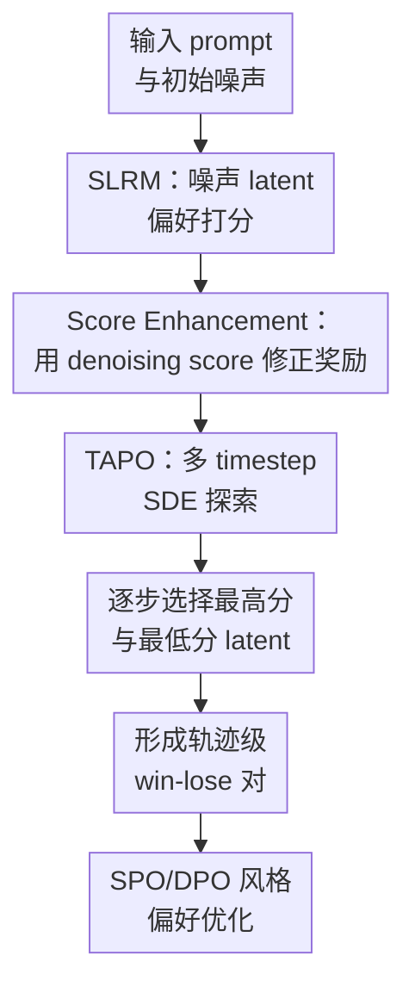

# Consistent Noisy Latent Rewards for Trajectory Preference Optimization in Diffusion Models

**会议**: ICLR2026  
**OpenReview**: [https://openreview.net/forum?id=qGihS60jfT](https://openreview.net/forum?id=qGihS60jfT)  
**代码**: TAPO（论文称将开源，缓存中未给出可访问 URL）  
**领域**: 扩散模型 / 视频生成 / 偏好优化  
**关键词**: 扩散模型偏好对齐、噪声潜变量奖励模型、轨迹级偏好优化、T2I、T2V  

## 一句话总结
本文提出 SLRM + TAPO：先用保留扩散 score 能力的噪声 latent 奖励模型稳定评估中间采样状态，再用多时间步 SDE 探索和筛选构造更一致的 win-lose 轨迹对，从而提升文本到图像和文本到视频扩散模型的偏好对齐效果。

## 研究背景与动机
**领域现状**：扩散模型的视觉生成能力已经很强，下一步自然是像 LLM 的 RLHF / DPO 那样做“人类偏好对齐”。现有视觉扩散对齐大致分两类：一类离线使用人类标注的偏好图像对，只在最终干净图像上学习；另一类引入 reward model，在训练或采样过程中给候选样本打分，从而支持更在线、更轨迹相关的优化。

**现有痛点**：离线 DPO 类方法通常只知道最终图像哪张更好，却不知道扩散采样过程中哪个中间 latent 走向更健康。RM-based 方法看起来更适合轨迹优化，因为它可以给中间 timestep 打分，但这里有两个硬问题。第一，很多奖励模型本质上还是像素级 VLM 或 CLIP/BLIP 变体，对噪声扰动很敏感，把 noisy latent 解读成图像质量时容易失真。第二，即使奖励模型能在某个 timestep 上打分，单个 timestep 的排序也未必代表整条采样轨迹：同一对候选可能在早期、中期、晚期得到相反的偏好顺序。

**核心矛盾**：扩散模型的中间状态不是普通图像，它的可解释性依赖当前噪声水平和 denoising dynamics。若奖励模型只学习“偏好分类”，它可能丢掉原本扩散 backbone 学到的 score / velocity 结构；若偏好优化只看一个时间点，它又会把局部高分误当成全局好轨迹。

**本文目标**：作者把问题拆成两层：先训练一个能在 noisy latent 上可靠打分的奖励模型，再设计一个轨迹采样策略，让偏好对不再由单点评估决定，而是由多个阶段的轨迹优势逐步放大出来。

**切入角度**：论文的关键观察是，扩散模型之所以能处理不同噪声水平，不只是因为它“见过噪声”，而是因为它在训练中学习了与数据分布相关的 score / velocity 场。奖励模型如果直接借用 diffusion backbone，却完全改成偏好分类目标，这种 noise compatibility 会在微调中退化。因此，奖励打分必须显式把 denoising score 信息接回来。

**核心 idea**：用 score-enhanced latent reward model 保住噪声兼容性，再用 multi-timestep trajectory advantage sampling 生成偏好差异更明显、排序更一致的训练轨迹对。

## 方法详解
### 整体框架
本文是一个两阶段框架。第一阶段训练 Score-based Latent Reward Model（SLRM）：它直接初始化完整扩散模型作为 backbone，在文本 token、视觉 latent token 之外加入可学习 task tokens，并用 denoising score enhancement 修正奖励 logit。第二阶段做 Trajectory Advantages Preference Optimization（TAPO）：在扩散采样轨迹中均匀选择若干 timestep 做 SDE 随机探索，用 SLRM 从候选 latent 中保留最好和最差分支，再用这些差异更强的轨迹对进入 SPO/DPO 风格优化。

这个流程里，SLRM 负责“在噪声上看得准”，TAPO 负责“不要只看一帧就判整条轨迹”。二者的衔接也很直接：如果奖励模型不能稳定评估 noisy latent，多步评估只会放大噪声；如果只训练 SLRM 而仍用单 timestep 选样，轨迹排序的不一致问题仍然存在。

### 关键设计
**1. SLRM：把完整扩散模型改造成 noisy latent 奖励判别器**

普通 VLM reward model 通常先把图像和文本分别编码，再用相似度或回归头给分，这类模型对干净图像有效，但 noisy latent 并不是自然图像，直接评价容易被噪声扰动牵着走。SLRM 的选择更激进：它不只借一个视觉编码器，而是把完整预训练扩散模型初始化为奖励模型 backbone，让奖励判别发生在模型本来就熟悉的 latent + timestep 表示空间里。

为了让这个 backbone 不只是做文本图像相似度，作者引入可学习 task tokens。它们和文本 token、视觉 latent token 一起进入 MM-DiT blocks，通过 self-attention 跨层聚合细粒度视觉、语义和噪声阶段信息。最终 task token 的输出经线性层得到基础奖励 $S(x_t, c)$。这样做的重点不是多塞几个 token，而是让“奖励判别”成为扩散 transformer 内部的一个任务条件，而不是在外面套一个脆弱的像素级评分器。

**2. Denoising Score Enhancement：用 score 约束防止噪声兼容性在偏好训练中退化**

仅仅用 diffusion backbone 还不够。论文指出，扩散模型能处理不同噪声水平，是因为原始训练目标在学习 velocity / score function；一旦把它微调成 Bradley-Terry 式偏好排序模型，训练信号会把 backbone 往“区分赢家输家”推，而不是继续保持 denoising score 的几何结构。于是 naive SLRM 在训练过程中会逐渐失去 noisy latent 上的稳定性。

作者的修法是把 denoising score matching distance 作为奖励修正项。对 flow matching 模型，原始 velocity 目标大致是让 $v_\theta(x_t,t,c,s)$ 接近真实速度 $x_1-x_0$。论文用一个单样本估计把这个距离转成可乘的 score compatibility：$\hat D_s(x,y,s)=e^{-\rho\|v_\theta(x_t,t,c,s)-(x_1-x_0)\|^2}$，再用 $\hat S(x_t,c)=S(x_t,c)\cdot \hat D_s(x_t,c,s)$ 得到增强后的奖励。直观地说，一个 latent 即使语义上看起来有优势，如果它在当前噪声水平下不符合 denoising dynamics，最终奖励也会被压下去。

**3. TAPO：用多时间步 SDE 探索把局部偏好变成轨迹优势**

扩散采样的不同阶段关注不同属性：早期更偏布局和构图，中期影响内容一致性，后期补细节和质感。单 timestep 奖励可能在某一阶段偏好 A，在另一阶段偏好 B；如果训练只拿其中一个点来决定 win-lose，就会把偶然的局部优势写进偏好优化目标。TAPO 的核心是把“选样”从单点比较改成沿轨迹逐步筛选。

具体做法是，在总共 $T$ 个采样 step 中均匀选出 $n$ 个评估点 $W_T=\{\tau_1,\tau_2,\ldots,\tau_n\}$。这些点使用 SDE sampling 注入随机性，生成多个候选 latent；其他点保持 ODE sampling，保证采样成本可控。在每个 SDE 点，SLRM 分别对候选集合打分，并保留最高分分支作为 winner、最低分分支作为 loser，然后继续往后采样。这样最终得到的不是“某一帧碰巧更好”的 pair，而是在多个噪声阶段都被逐步拉开差距的轨迹级偏好对。

**4. 轨迹级训练对：让 SPO 优化吃到更高质量的偏好样本**

TAPO 最后并没有另起一个复杂 RL 算法，而是把筛出来的 win-lose latent 对接回 SPO 风格目标。优化项比较当前模型和 reference model 对 winner / loser transition 的相对概率，用 $\beta$ 控制偏离 reference 的强度。关键区别在于，训练样本不是随机两条轨迹加单点评分，而是由 SLRM 在多个 timestep 上持续筛出的高差异轨迹对。

这个设计的价值在于把 reward model 的使用位置前移到了“构造训练数据”阶段。它不是简单地最大化奖励，因而相对降低 reward hacking 风险；也不是穷举每个 timestep，避免计算量爆炸。论文的 ablation 也说明，评估点数 $n$ 过少时轨迹优势不明显，过多时成本上升且收益趋于饱和，主设置选择 $n=8$ 是效果和效率之间的折中。

### 一个完整示例
以文本提示 “a husky wearing a chef hat and apron, cooking soup on the stove” 为例，基础扩散模型从初始噪声开始生成两条候选轨迹。若只在中间某个 timestep 打分，其中一条轨迹可能因为主体轮廓更清楚得到高分，但后续可能丢掉厨师帽或炉灶；另一条轨迹早期略模糊，却在后期保持了狗、围裙、锅和厨房动作的一致性。

TAPO 会在多个均匀分布的 timestep 插入 SDE 探索。第一次评估更像在筛构图，SLRM 选出布局更合理的 winner 分支和明显偏离 prompt 的 loser 分支；中期评估更关注主体与动作是否一致，再从多个随机候选中扩大差距；后期评估则把视觉细节、质感和审美纳入排序。最后进入训练目标的 win-lose 对，已经包含从粗到细的轨迹优势，而不是某个噪声层上的偶然高分。

### 损失函数 / 训练策略
SLRM 采用 Bradley-Terry 风格的对比训练。给定偏好数据 $P=\{(x_i^w,x_i^l,c_i)\}_{i=1}^N$，作者随机采样 timestep，把 winner / loser 图像转成对应 noisy latent，再分别送入 SLRM 得到 $\hat S(x_t^w,c)$ 和 $\hat S(x_t^l,c)$。训练目标鼓励 winner 的增强奖励大于 loser，形式上是对 $\hat S(x_t^w,c)^\eta /(\hat S(x_t^w,c)^\eta+\hat S(x_t^l,c)^\eta)$ 做负对数似然。

TAPO 阶段的实现以 SD3.5-medium 作为 T2I 基座，以 Wan2.1-1.3B 作为 T2V 基座。T2I 的 SLRM 使用 Pick-a-Pic v1 的 58 万偏好对训练，并在约 2.8 万验证/测试样本上评估 noisy latent discrimination；偏好优化时使用 4k prompts，采样 20 timesteps。T2V 因缺少高质量视频偏好数据，作者自建 1 万视频偏好对训练 SLRM，并在 GenAI-Bench 相关设置上验证。

## 实验关键数据

### 主实验
T2I 主实验显示，TAPO 在 SD3.5-M 基座上同时提升一般偏好指标和文本图像对齐指标，尤其 GenEval 提升非常明显。和 LPO 相比，TAPO 的 HPSv3 从 9.10 到 9.89，GenEval 从 59.85 到 68.93，说明多时间步轨迹筛选确实比单点 latent preference 更稳定。

| 方法 | HPSv2.1 ↑ | HPSv3 ↑ | PickScore ↑ | MPS ↑ | CLIP-Score ↑ | GenEval ↑ |
|------|-----------|---------|-------------|-------|--------------|-----------|
| SD3.5-M Base | 27.15 | 8.29 | 22.15 | 1.00 | 25.18 | 55.34 |
| Diffusion-DPO | 28.23 | 7.59 | 22.64 | 1.93 | 25.71 | 54.93 |
| DenseReward | 29.99 | 8.05 | 22.83 | 2.51 | 26.18 | 55.27 |
| SPO | 31.52 | 8.74 | 22.70 | 2.24 | 24.72 | 52.75 |
| LPO | 31.89 | 9.10 | 22.86 | 3.12 | 26.15 | 59.85 |
| TAPO | 32.01 | 9.89 | 23.03 | 3.07 | 27.07 | 68.93 |

奖励模型实验更直接验证了 SLRM 的噪声兼容性。干净图像上 HPSv3 和 PickScore 的准确率很高，但一进入 noisy timestep，它们的准确率明显下滑；SLRM 在高噪声和低噪声区间都保持 66% 左右，超过 LRM-3.5 和各类 VLM reward。

| 奖励模型 | $t\in[501,1000]$ ↑ | $t\in[1,500]$ ↑ | $t=0$ 干净图像 ↑ |
|----------|--------------------|------------------|-------------------|
| CLIP Score | 46.91 | 44.37 | 61.84 |
| ImageReward | 49.68 | 47.92 | 62.66 |
| HPSv3 | 44.26 | 47.26 | 72.80 |
| PickScore | 45.26 | 48.21 | 71.93 |
| LRM-3.5 | 59.56 | 64.12 | 66.41 |
| SLRM | 66.35 | 66.59 | 67.08 |

T2V 定性实验以 Wan2.1-1.3B 为基座。论文展示的例子包括化妆、卡丁车漂移、倒奶油酱等动态场景；TAPO 生成的视频在时间连贯性、prompt 对齐和细节自然度上都优于 base model。这里没有像 T2I 那样给出完整主表，因此更像跨任务适用性的补充证据。

### 消融实验
消融结果说明两个模块都不是装饰。去掉 score enhancement 后，SLRM 的 Val-Test Accuracy 从 67.52 降到 62.49，同时下游 MPS、GenEval、HPSv2.1 都下降；用图文相似度替代 task tokens 也会损失综合质量评估能力。

| 配置 | Val-Test Accuracy ↑ | MPS ↑ | GenEval ↑ | HPSv2.1 ↑ | 说明 |
|------|---------------------|-------|-----------|-----------|------|
| SLRM w/o Score Enhanced | 62.49 | 1.92 | 54.83 | 26.49 | 偏好训练破坏噪声兼容性 |
| SLRM w/o Task Tokens | 65.33 | 2.08 | 55.27 | 28.37 | 退化成更像图文相似度评分 |
| SLRM full | 67.52 | 3.07 | 64.93 | 30.71 | score 修正 + task tokens 都保留 |

TAPO 的评估步数 $n$ 也有清晰趋势。$n=2$ 时探索不足，$n=8$ 时效果最好；继续加到 $n=16$ 后，GenEval 略升但 MPS 和 HPSv2.1 下降，采样时间也从 4.52s/iter 增至 6.08s/iter，说明更密集评估并不总是更好。

| TAPO 设置 | 时间 | MPS ↑ | GenEval ↑ | HPSv2.1 ↑ | 说明 |
|-----------|------|-------|-----------|-----------|------|
| $n=2$ | 3.50s/iter | 2.27 | 52.39 | 27.39 | 轨迹覆盖不足 |
| $n=4$ | 3.91s/iter | 2.93 | 56.20 | 28.31 | 优于少步评估 |
| $n=8$ | 4.52s/iter | 3.07 | 68.93 | 32.01 | 主实验采用，综合最好 |
| $n=16$ | 6.08s/iter | 2.09 | 69.18 | 31.29 | 成本更高，偏好收益不稳定 |

### 关键发现
- SLRM 的核心收益来自“显式保留 denoising score 信息”，不是简单把 noisy latent 喂给 diffusion backbone；否则训练目标转移后，噪声兼容性会退化。
- TAPO 对 GenEval 的提升尤其大，说明多时间步筛选不仅改善审美偏好，也更有利于对象数量、属性绑定和空间关系这类 compositional alignment。
- 轨迹评估步数存在甜点区间。少了看不全轨迹，多了成本上升且可能把局部 reward 噪声重新引入训练。
- T2V 结果表明方法并非只适配静态图像，但视频部分主要依赖定性展示和自建偏好数据，证据强度弱于 T2I。

## 亮点与洞察
- SLRM 最巧妙的地方是没有把“噪声鲁棒性”理解成数据增强，而是回到扩散模型的 score / velocity 学习本质。这个角度解释了为什么已有 latent reward model 即使用 diffusion backbone，仍可能在偏好训练中丢掉 noisy timestep 上的可靠性。
- TAPO 把 reward model 用在构造训练 pair 上，而不是直接贪心最大化 reward。这样既能利用在线采样的动态信息，又避免把优化过程完全暴露给 reward hacking。
- 多时间步选择很好地对应了扩散生成的阶段性：早期看布局，中期看语义一致性，后期看细节和审美。这个思路可以迁移到视频生成、3D 生成，甚至任何有逐步 refinement 轨迹的生成模型。
- 论文把奖励模型和采样策略成对设计，而不是只提出一个新 loss。实际效果也说明，trajectory preference optimization 的瓶颈往往不是 DPO 公式本身，而是 win-lose 对是否真的代表全局生成质量差异。

## 局限与展望
- 计算成本仍然比普通单轨迹采样高。虽然 TAPO 只在 $n$ 个 timestep 做 SDE 探索，但每个评估点都需要候选采样和 SLRM 打分，训练吞吐会受到明显影响。
- T2V 评估还不够充分。论文用 Wan2.1-1.3B 做视频实验，并自建 1 万视频偏好对，但缺少像 T2I 那样完整、多指标、可复现的量化表。
- SLRM 依赖强扩散 backbone，本身参数和训练成本较大。若基座模型换成非 DiT 架构、不同噪声调度或更长视频扩散模型，score enhancement 的具体形式可能需要重调。
- 奖励模型仍可能继承偏好数据集偏差。Pick-a-Pic 和自建视频偏好对主要覆盖常见审美与 prompt 对齐，未必能代表安全性、真实性、版权敏感内容或专业领域需求。
- 未来可以研究自适应选择 evaluation timesteps，而不是均匀放置 $n$ 个 SDE 点。不同 prompt 难度和生成阶段的不确定性不同，固定 $n=8$ 可能不是所有样本的最优预算。

## 相关工作与启发
- **vs Diffusion-DPO**: Diffusion-DPO 把最终图像偏好传播到扩散训练目标中，优点是简洁稳定；本文认为最终图像偏好不足以描述中间轨迹，因此引入 noisy latent reward 和多 timestep 轨迹筛选。
- **vs SPO / LPO**: SPO 和 LPO 已经开始关注 intermediate latent preference，尤其 LPO 也使用 latent reward model；本文进一步指出单 timestep 排序会不一致，并用 TAPO 让偏好选择覆盖多阶段轨迹。
- **vs DenseReward**: DenseReward 将干净图像上的偏好信号分配到轨迹各步，更像把终点评价铺开；本文则直接在 noisy latent 上训练 SLRM，并让每个关键 timestep 都参与候选筛选。
- **vs VLM reward models**: HPS、PickScore、ImageReward 等在干净图像上很强，但面对 noisy latent 会失效；本文的启发是，扩散过程中的 reward model 最好在生成模型自己的状态空间里定义，而不是依赖像素空间语义模型硬判。

## 评分
- 新颖性: ⭐⭐⭐⭐⭐ 把 denoising score preservation 和 trajectory-level preference selection 组合起来，针对扩散偏好优化的两个真实痛点给出成体系解法。
- 实验充分度: ⭐⭐⭐⭐☆ T2I 实验和消融很扎实，奖励模型噪声评估也有说服力；T2V 部分更偏展示，量化还可以更强。
- 写作质量: ⭐⭐⭐⭐☆ 问题定义清楚，方法动机顺，但部分公式和符号排版略粗糙，个别表格描述需要读者自行对齐。
- 价值: ⭐⭐⭐⭐⭐ 对扩散模型在线偏好优化很有参考价值，尤其适合需要沿采样轨迹做筛选、重排序或强化学习式对齐的视觉生成任务。

<!-- RELATED:START -->

## 相关论文

- [\[CVPR 2026\] LocalDPO: Direct Localized Detail Preference Optimization for Video Diffusion Models](../../CVPR2026/video_generation/mind_the_generative_details_direct_localized_detail_preference_optimization_for_.md)
- [\[NeurIPS 2025\] DenseDPO: Fine-Grained Temporal Preference Optimization for Video Diffusion Models](../../NeurIPS2025/video_generation/densedpo_finegrained_temporal_preference_optimization_for_vi.md)
- [\[ICLR 2026\] Dual-IPO: Dual-Iterative Preference Optimization for Text-to-Video Generation](dual-ipo_dual-iterative_preference_optimization_for_text-to-video_generation.md)
- [\[ICLR 2026\] LikePhys: Evaluating Intuitive Physics Understanding in Video Diffusion Models via Likelihood Preference](likephys_evaluating_intuitive_physics_understanding_in_video_diffusion_models_vi.md)
- [\[CVPR 2026\] LaVR: Scene Latent Conditioned Generative Video Trajectory Re-Rendering using Large 4D Reconstruction Models](../../CVPR2026/video_generation/lavr_scene_latent_conditioned_generative_video_trajectory_re-rendering_using_lar.md)

<!-- RELATED:END -->
