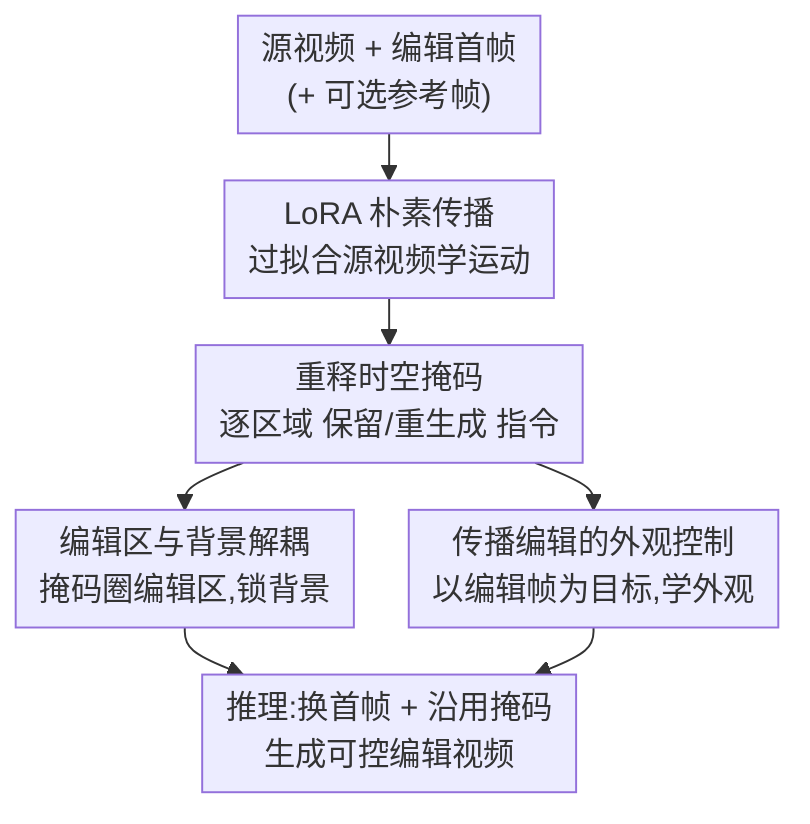

# Controllable First-Frame-Guided Video Editing via Mask-Aware LoRA Fine-Tuning

**会议**: ICLR2026  
**OpenReview**: [https://openreview.net/forum?id=xkRMJ1Y7Um](https://openreview.net/forum?id=xkRMJ1Y7Um)  
**代码**: https://cjeen.github.io/LoRAEdit （项目主页，含代码与视频）  
**领域**: 视频编辑 / 扩散模型 / 图生视频  
**关键词**: 视频编辑, 首帧引导, 时空掩码, LoRA 微调, I2V 扩散模型

## 一句话总结
本文把预训练图生视频（I2V）模型里原本只用来"保首帧、生后续帧"的时空掩码重新挖掘成一个空间可变的"保留/重生成"指令，配合在单条输入视频上做的 LoRA 微调，让模型既能学到源视频的运动、又能从参考帧学到目标外观，从而把"只改第一帧"的编辑可控地传播到整段视频，在首帧引导编辑上全面超过 AnyV2V / I2VEdit / Go-with-the-Flow。

## 研究背景与动机
**领域现状**：视频编辑这几年靠扩散模型大幅进步，但主流路线分两类。一类是大规模条件训练的通用编辑模型（如 VACE），效果强但每换一种编辑类型就得重新喂大量数据微调，扩展成本高、对域外样本不稳。另一类是"首帧引导编辑"（AnyV2V、I2VEdit）：用户用任意图像工具把第一帧改好，再用运动条件的 I2V 模型把改动"传播"到后面所有帧，灵活、不被特定数据集绑死。

**现有痛点**：首帧引导虽灵活，却几乎管不了后续帧的演化。给一段花开的视频，用户能把第一帧的花改掉，但控制不了它"怎么开"；物体旋转到新视角时，被遮挡区域露出来的内容用户也没法指定。更糟的是首帧的改动会**扩散到不该动的区域**，造成背景泄漏（background leakage）。

**核心矛盾**：一段最朴素的做法是直接在源视频上用 LoRA 过拟合，让模型学会内容运动、把编辑一致地传播下去。但这条单一生成通路无法区分"哪些区域该变、哪些该保持"，也无法保证被编辑物体在运动、形变中外观可控——它要凭空补出没见过的外观。保留背景和传播编辑这两个诉求挤在同一条通路里会互相打架。

**本文目标**：要一个既保留首帧引导的灵活性、又能贯穿整段视频做精细控制的编辑框架，且不改模型结构、不做大规模训练。

**切入角度**：作者注意到，近期 I2V 模型为了"用第一帧引导生成"，本身就接收一个伪视频 $V_{cond}$ 和一个二值时空掩码 $M_{cond}$——平时这个掩码只做时间维度的事（首帧=1 保留、其余=0 生成）。作者的观察是：这个掩码其实有更大的**空间控制**潜力，可以被重新解释成"逐区域的保留/重生成指令"。

**核心 idea**：用一个空间可变的时空掩码去"指挥" LoRA 微调——既强化模型对掩码的执行力，又用掩码来**决定 LoRA 学什么**（遮住编辑区→学运动；以参考帧为目标→学外观），把运动与外观解耦，从而获得对整段视频演化的可控编辑。

## 方法详解

### 整体框架
输入是一段源视频 $V_{input}=[I_1,\dots,I_T]$ 和一张被用户改过的首帧 $\tilde{I}_1$（可选地再加若干后续编辑帧作参考），输出是把首帧改动可控传播后的编辑视频 $\tilde{V}=[\tilde{I}_1,\dots,\tilde{I}_T]$。整条流水线建立在现成的 I2V 扩散模型（主用 Wan2.1-I2V 480P）之上，**不改架构、只在单条视频上插 LoRA 微调**，分三步走：先用最朴素的 LoRA 过拟合学到源视频运动；再揭示 I2V 内建掩码机制的空间控制潜力；最后用"掩码感知 LoRA"把掩码配置成不同形态，分别训练出"区分编辑区/背景"和"用参考帧控外观"两种能力。推理时把首帧换成编辑版 $\tilde{I}_1$、沿用训练时的掩码即可生成。

### 关键设计

**1. LoRA 朴素传播：先用单视频过拟合搭出运动底座**

针对"编辑要在后续帧里一致地动起来"这个最基本需求，作者先做一个朴素方案当地基。他们把 LoRA 模块 $\phi_\theta$ 插进 I2V 模型的自注意力和交叉注意力层，只在这一条输入视频 $V_{input}$ 上优化，让它把这段视频自己的运动模式吃进参数里。训练时以原首帧 $I_1$ 加一个固定特殊 token $p^*$ 拼上 Florence-2 给 $I_1$ 生成的字幕 $c$（即 $[p^*]+c$）为条件，监督模型重建整段视频，沿用 I2V 的流匹配（flow matching）目标：

$$L_{flow}=\mathbb{E}_{t,x_0,x_1}\big[\|v_\theta(x_t,t;\,I_1,[p^*]+c)-(x_0-x_1)\|_2^2\big],\quad x_t=(1-t)x_1+tx_0$$

其中 $x_0\sim\mathcal{N}(0,I)$ 是采样噪声，$x_1=E(V_{input})$ 是源视频经 VAE 编码的隐表示，$v_\theta$ 是带 LoRA 的速度预测网络。推理时把 $I_1$ 换成编辑版 $\tilde{I}_1$、字幕换成 $\tilde{c}$，模型就能把编辑沿运动传播出去。这一步保证了运动连贯，但它管不住"内容"——哪里该变、变成什么样都无从控制，所以只是底座。

**2. 重释时空掩码：把"保首帧"的开关挖成逐区域空间控制指令**

针对朴素方案"不分区域"的硬伤，作者去挖 I2V 模型本就有的条件机制。这类模型为了用首帧引导生成，会接收一个伪视频 $V_{cond}\in\mathbb{R}^{C\times T\times H\times W}$（把首帧和零占位帧拼起来）和一个二值时空掩码 $M_{cond}\in\{0,1\}^{1\times T\times h\times w}$，约定 1=保留、0=待生成，默认只有首帧置 1。作者把伪视频换成**真实视频帧**，让模型吃整段视频，于是这个原本只做时间维度的掩码就被重新定义成一个**跨空间和时间、逐区域控制保留/重生成的灵活机制**。他们系统试了几种掩码形态：默认（只保首帧）让模型生成整段运动；全 0 强迫重生成整段外观；全 1 想保全部，却在运动不连续处出现伪影；空间可变（保背景、生前景）则暴露出原始模型"合不出连贯前景"的关键短板。结论是：裸 I2V 能处理整帧级的粗指令，但做不了精细的选择性编辑——而这恰好可以靠 LoRA 来补，且掩码不只用来约束模型、还能反过来"指挥 LoRA 学什么"，这正是全文的基石。

**3. 编辑区与背景解耦：让前景改、背景纹丝不动**

很多首帧编辑只改一小块，于是产生冲突：编辑区要演化、背景要静止，挤在一条生成通路里会互相拖累——保背景会卡住编辑，传编辑又会污染背景。作者通过精心配置掩码与条件视频在 LoRA 微调时把两者分开：把流匹配损失改写成带条件版本

$$L=\mathbb{E}_{t,x_0,x_1}\big[\|v_\theta(x_t,t;\,V_{cond},M_{cond},[p^*]+c)-(x_0-x_1)\|_2^2\big]$$

其中 $x_1=E(V_{target})$。具体地，$M_{cond}$ 首帧全置 1（当参考保留），后续帧把**未编辑区标 1（保留）、编辑区标 0（生成）**；$V_{cond}$ 则把掩码标 0 的区域清空、其余保留；微调目标 $V_{target}$ 设为输入视频本身。这样模型只专注生成被编辑内容、同时锁死未编辑区。推理时沿用同一个 $M_{cond}$，只把 $V_{cond}$ 的首帧换成 $\tilde{I}_1$。一个有意思的现象是：预训练 I2V 本来不擅长选择性编辑，但**仅在单条视频上 LoRA 训练就能学到有效的掩码引导 inpainting 先验**——作者推测是因为 DiT 把输入当离散 token 处理，空间可变掩码在 token 层面表示相近，适配很自然。

**4. 传播编辑的外观控制：用任意后续帧的参考直接指定演化外观**

首帧的编辑很少静止——被改区域会旋转、形变、按自己的轨迹运动（花瓣展开）。只拿首帧当唯一约束时，"这块区域在后续视角/状态下该长什么样"是欠定的，编辑会逐渐漂离用户意图。作者的解法是允许用户编辑**任意后续帧**，给外观演化加直接锚点。LoRA 微调时把这张编辑帧当目标 $V_{target}$，条件 $V_{cond}$ 用编辑前的帧、并掩掉编辑区，$M_{cond}$ 把保留背景标 1、编辑区标 0。若用了多张编辑帧，则把每张当成**孤立的静态图像**分别训练，避免模型在它们之间臆造出错误的时间动态，从而把外观与运动解耦。和那些推理时直接喂编辑帧的方法不同，这里编辑帧只在训练时用来"教外观怎么长"，推理时模型按学到的模式和上下文自行生成，即便编辑不严格时间对齐也能平滑适配。

### 损失函数 / 训练策略
统一用 I2V 的流匹配目标（式 1/2）。流程是两段式训练：先按"编辑区/背景解耦"在输入视频上训 100 步；若有后续编辑帧，再按"外观控制"在含额外修改的数据上续训 100 步。学习率 $1\times10^{-4}$，视频 49 帧、分辨率 $832\times480$ 或 $480\times832$，单样本约需 20GB 显存（附录给了降显存策略）。掩码用自动化工作流获取，且刻意用**宽松的 bounding-box 掩码**而非像素级精确分割。

## 实验关键数据

### 主实验
首帧引导编辑：采用 I2VEdit 的测试集，三项指标全面领先。CLIP Score 衡量生成帧与编辑首帧的语义对齐，DeQA Score 衡量图像质量，Input Similarity 衡量与输入帧的逐帧 CLIP 相似度。

| 方法 | CLIP Score ↑ | DeQA Score ↑ | Input Similarity ↑ |
|------|------|------|------|
| AnyV2V | 0.8995 | 3.7348 | 0.7569 |
| Go-with-the-Flow | 0.9047 | 3.5622 | 0.7504 |
| I2VEdit | 0.9128 | 3.4480 | 0.7536 |
| **Ours** | **0.9172** | **3.8013** | **0.7608** |

参考引导编辑：35 人用户研究，对运动一致性和背景保留两个维度排名（数值=平均排名，越低越好），明显优于 Kling1.6 与 14B 的 VACE。

| 方法 | 运动一致性 ↓ | 背景保留 ↓ |
|------|------|------|
| Kling1.6 | 1.869 | 1.806 |
| VACE (14B) | 2.511 | 2.460 |
| **Ours** | **1.620** | **1.734** |

### 消融实验

| 配置 | 关键发现 | 说明 |
|------|---------|------|
| w/o 前景-背景掩码 | 编辑全局扩散 | 改发色时整帧光照都被改；加掩码后改动被局限在头发区域 |
| 仅用首帧 vs 加后续编辑帧 | 加参考帧外观更可控 | 只用首帧也能出合理结果，但加一张后续编辑帧能更一致准确地传播意图 |
| 紧致掩码 / 噪声掩码 / bbox 掩码 | 像素级精确反而受限 | 紧掩码把新物体硬卡在原轮廓里、削掉自然细节；宽松掩码（含 7×7 噪声掩码和 bbox）反而效果更好 |

### 关键发现
- **掩码条件是背景保留的关键**：去掉它编辑就会全局泄漏（发色→改光照），加上它才能把改动锁在目标区域。
- **"松掩码"反直觉地更好**：因为生成式编辑需要空间缓冲让物体做必要的轮廓变化，紧掩码会过度约束、强迫贴合原轮廓；松掩码让模型用强先验去"愈合"编辑与冻结背景之间的边界。这也验证了用自动化、近似掩码工作流的合理性——框架靠掩码做语义定位而非严格像素裁剪。
- **单视频 LoRA 即可学到掩码引导 inpainting 先验**，无需大规模训练。

## 亮点与洞察
- **把"现成机制"挖出新用途**：I2V 模型里的时空掩码本来只做"保首帧"，作者发现它在空间维度上其实是个逐区域开关，零架构改动就把它变成精细编辑工具——这种"重释已有条件接口"的思路很省力也很可迁移。
- **用掩码去"指挥 LoRA 学什么"**：同一套 LoRA 微调，靠改掩码配置（遮编辑区→学运动；以编辑帧为目标→学外观）就能切换学习目标，把运动与外观解耦，是全文最巧的一笔。
- **松掩码优于紧掩码的洞察**：违反"分割越准越好"的直觉，说明生成式编辑需要边界缓冲，这条结论对其他 inpainting/编辑任务也有参考价值。
- 多编辑帧当孤立静态图训练以避免臆造时间动态，是个干净的小 trick。

## 局限与展望
- 作者承认依赖 Wan2.1-I2V / HunyuanVideo-I2V 等预训练基座，会继承其数据偏见；也提到生成视频技术存在 deepfake 等滥用风险。
- **每条视频都要单独 LoRA 微调（100+100 步、约 20GB 显存）**，是 per-video 优化，不是前馈推理，规模化和实时性受限。
- 自己发现的局限：评测规模偏小（首帧引导 20 段、参考引导用户研究 35 人），定量指标主要靠 CLIP/DeQA 这类代理指标，缺乏更细的时序一致性度量；对运动极不连续的场景（全 1 掩码会出伪影）仍是潜在弱点。
- 改进方向：把 per-video LoRA 蒸馏成一次性前馈适配、或探索跨视频共享的掩码感知适配器以降本。

## 相关工作与启发
- **vs VACE / 大规模条件编辑模型**：VACE 靠大规模条件视频扩散训练，效果强但换编辑类型成本高、域外不稳；本文不做大规模训练，只在单视频上 LoRA，灵活且更好地保留背景与身份，但代价是每段视频都要微调。
- **vs AnyV2V / I2VEdit（首帧引导）**：二者都把编辑解耦成"改首帧 + 传播"，但缺乏显式约束，传播时编辑会被稀释、出现前景不一致和背景泄漏；I2VEdit 用逐 clip LoRA 学粗运动、用注意力差异掩码修外观。本文用**时空掩码显式约束**保留/生成区域，并允许任意后续帧作外观锚点，控制更细。
- **vs 直接喂编辑帧的方法**：本文编辑帧只在训练时用来教外观，推理时不要求编辑帧时间对齐，对不严格对齐的编辑更鲁棒。

## 评分
- 新颖性: ⭐⭐⭐⭐ 重释 I2V 内建掩码 + 用掩码指挥 LoRA 学运动/外观，视角巧、零架构改动
- 实验充分度: ⭐⭐⭐ 对比与消融到位、洞察扎实，但评测规模偏小、缺时序一致性硬指标
- 写作质量: ⭐⭐⭐⭐ 三步递进（朴素→挖掘掩码→掩码感知 LoRA）叙事清晰，图示充分
- 价值: ⭐⭐⭐⭐ 免大规模训练、可控传播编辑，对创作工具实用，但 per-video 微调限制规模化

<!-- RELATED:START -->

## 相关论文

- [\[ICLR 2026\] Anchor Frame Bridging for Coherent First-Last Frame Video Generation](anchor_frame_bridging_for_coherent_first-last_frame_video_generation.md)
- [\[ICLR 2026\] DreamSwapV: Mask-guided Subject Swapping for Any Customized Video Editing](dreamswapv_mask-guided_subject_swapping_for_any_customized_video_editing.md)
- [\[CVPR 2026\] FFP-300K: Scaling First-Frame Propagation for Generalizable Video Editing](../../CVPR2026/video_generation/ffp-300k_scaling_first-frame_propagation_for_generalizable_video_editing.md)
- [\[ICLR 2026\] EditVerse: Unifying Image and Video Editing and Generation with In-Context Learning](editverse_unifying_image_and_video_editing_and_generation_with_in-context_learni.md)
- [\[ICML 2026\] MiVE: Multiscale Vision-language features for reference-guided video Editing](../../ICML2026/video_generation/mive_multiscale_vision-language_features_for_reference-guided_video_editing.md)

<!-- RELATED:END -->
