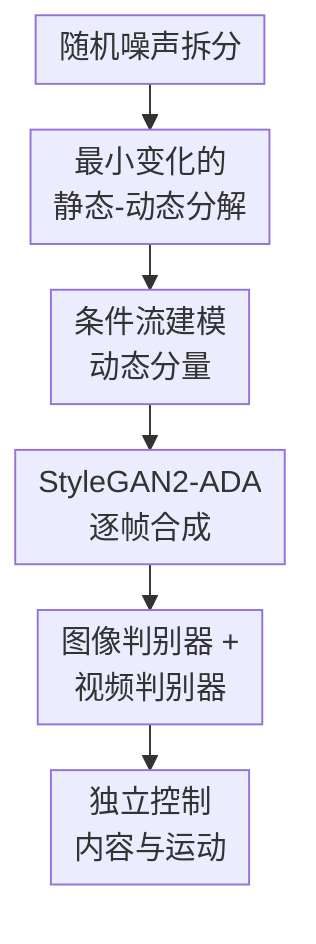

# Controllable Video Generation with Provable Disentanglement

**会议**: ICLR2026  
**OpenReview**: [https://openreview.net/forum?id=OcLNKpcY4J](https://openreview.net/forum?id=OcLNKpcY4J)  
**代码**: 待确认  
**领域**: 视频生成 / 可控视频生成  
**关键词**: 可控视频生成, 表征解耦, 可识别性, 时序动态建模, GAN

## 一句话总结
这篇论文提出 CoVoGAN，把视频里的静态内容变量和随时间变化的动态风格变量分开建模，并用最小变化原则、充分变化性质和时序条件独立约束给出可识别性保证，从而让视频生成中的头部运动、眨眼、相机位移等因素可以被更独立地控制。

## 研究背景与动机
**领域现状**：视频生成模型已经能生成质量较高、时间上较连贯的视频，主流路线包括 GAN、VAE、扩散模型以及大规模文生视频模型。很多可控视频生成方法会把文本、轨迹、姿态或其他条件直接施加到整个视频表示上，把视频看成一个统一的 4D 时空块，再依赖模型自己学会哪些因素该变、哪些因素不该变。

**现有痛点**：这种整体式控制容易出现两个问题。第一，控制粒度不够细，用户想让人物头部逐渐右转，模型可能只完成了部分动作，或者同时改变了脸型、头部大小、背景细节。第二，不同运动因素之间容易耦合，例如调眨眼会牵动头部姿态，调相机方向会影响场景内容，导致同一个潜变量维度在不同样本上表现出不一致的语义。

**核心矛盾**：可控视频生成真正需要的是“只改想改的因素”，但观测到的训练数据只有像素视频，背后的内容因素、运动因素以及运动内部的不同概念都不可见。如果没有可识别性条件，模型即使生成分布看起来对，也可能学到任意混合后的潜变量；这样的潜空间表面可操作，实际控制时却不可预测。

**本文目标**：作者把问题拆成两层。第一层是 block-wise disentanglement，即把静态内容元素 $z^c$ 和动态风格变量 $z_t^s$ 分开，让运动控制不破坏身份或场景。第二层是 component-wise disentanglement，即进一步把动态变量的不同维度对应到不同运动概念，让头部运动、眨眼、相机平移等因素可以分别操作。

**切入角度**：论文从非线性 ICA 和时序因果表征学习里借来“可识别性”的视角。作者认为，视频天然有时间结构：内容在一段视频里保持相对不变，动态因素随时间演化；如果模型既限制动态变量维度，又让动态分量在给定历史后条件独立，就有机会把真实生成因素从观测视频里恢复出来。

**核心 idea**：用一个 Temporal Transition Module 显式生成“静态内容 + 条件独立的动态风格”，再把它作为 GAN 生成器插件嵌入 StyleGAN2-ADA，通过理论假设约束潜变量结构，从而把可控视频生成从经验式解耦推进到有可识别性依据的解耦。

## 方法详解
### 整体框架
CoVoGAN 的生成过程从一段随机噪声开始，先把噪声拆成静态内容噪声和每个时间步的动态噪声，再由 Temporal Transition Module 生成内容变量 $z^c$ 与动态风格变量 $z_t^s$。每一帧使用拼接后的 $z_t = z^c \oplus z_t^s$ 进入 StyleGAN2-ADA 风格的 synthesis network 生成图像帧；训练时再用图像判别器保证单帧质量，用视频判别器约束整段视频分布。

这套框架的关键是：内容变量负责跨帧不变的信息，动态变量负责随时间变化的信息；动态变量内部又通过 GRU 历史状态和 component-wise flow 形成条件独立的分量。这样一来，模型不是在一个混合潜空间里碰运气找控制方向，而是在结构上把“内容不变、运动可变、运动分量可分”写进生成器。

### 关键设计
**1. 最小变化的静态-动态分解：先保证运动和内容不互相污染**

论文先形式化视频生成过程。给定视频 $V=\{x_1,x_2,\ldots,x_T\}$，每一帧由非线性混合函数生成：$x_t = g(z_t^s, z^c)$。其中 $z^c$ 表示一段视频中基本不变的内容元素，例如身份、场景、物体外观；$z_t^s$ 表示随时间变化的 style dynamics，例如头部姿态、眼睛开合、相机移动方向。动态变量本身来自带时间延迟父节点的因果过程，形式上是 $z_{t,i}^s=f_i^s(Pa(z_{t,i}^s),\epsilon_{t,i}^s)$。

“最小变化”在这里不是一句泛泛的正则化口号，而是对应到可识别性定理里的低维动态表示。若一个较小维度的 $z_t^s$ 已经能让生成分布与真实视频分布达到 observational equivalence，就没有必要把静态信息也塞进动态变量。理论上，在正密度、线性算子可注入、弱单调等假设下，观测等价会推出内容子空间和动态子空间的 block-wise identifiability；实践上，作者选择较小的动态变量维度，让模型更倾向于只把真正变化的因素放进 $z_t^s$。

**2. 条件流建模动态分量：把不同运动概念拆到不同维度**

只把内容和运动分开还不够，因为“运动”内部仍可能是混合的。CoVoGAN 用 GRU 汇总历史信息 $h_t$，再用 Deep Sigmoid Flow 为每个动态维度单独建模：$h_t = GRU(h_{t-1},\epsilon_{t-1}^s)$，$z_{t,i}^s = DSF_i(\epsilon_{t,i}^s;h_{t-1})$。这里每个 $DSF_i$ 处理一个独立噪声分量，并以历史状态作为条件，因此动态分量在给定历史后保持互相独立。

这一步对应论文的 component-wise identifiability。作者要求动态分布有 sufficient changes，也就是不同历史条件下动态变量的变化足够丰富；同时要求学习到的 $\hat z_t^s$ 与 $\hat z^c$ 独立，且 $\hat z_t^s$ 的各维在给定 $\hat z_{t-1}^s$ 后条件独立。满足这些条件后，每个真实动态分量至多对应一个学习到的动态分量，剩下的不确定性主要是置换和逐维可逆变换。直观地说，模型可以不知道“第 3 维一定叫眨眼”，但它应当学到某一维稳定地控制眨眼，而不是把眨眼、头转和身份混在一起。

**3. StyleGAN2-ADA 插件化实现：把理论约束落到可训练视频生成器里**

作者没有重新设计完整生成器，而是把 Temporal Transition Module 接到 StyleGAN2-ADA 前面。静态噪声 $\epsilon^c$ 经过 MLP 得到 $z^c$；动态噪声序列 $\epsilon_1^s,\ldots,\epsilon_T^s$ 经过 GRU 与 component-wise flow 得到 $z_1^s,\ldots,z_T^s$；每个时间步再拼接成 $z_t$，送入 mapping network 得到 $w(z_t)\in\mathcal W$，最后由 synthesis network 生成第 $t$ 帧。

这种设计的好处是复用 StyleGAN2-ADA 的图像合成能力，同时把视频的时序结构放在前端潜变量转移里处理。GRU 的门控机制能自动过滤无关历史，适合未知时间滞后的动态过程；component-wise flow 又保留从噪声到动态变量的信息，使“充分变化”更容易在模型里实现。相比用普通 MLP 或普通 RNN 生成运动码，这个模块更直接对应论文定理里的条件独立和历史依赖条件。

**4. 视频判别器与互信息约束：让潜变量结构服务于真实视频分布**

可识别性讨论以 observational equivalence 为前提，也就是模型生成的视频分布要匹配真实数据分布。为此，CoVoGAN 保留 StyleGAN2-ADA 的图像判别器 $D_I$ 来看单帧质量，同时加入视频判别器 $D_V$ 来判断整段视频的时空一致性。视频判别器通过不同分辨率激活的 channel-wise concatenation 来处理时空输出，避免模型只生成好看的单帧却忽略时间演化。

此外，训练目标里加入动态变量 $z_t^s$ 与视频判别器中间层输出之间的互信息最大化项。这个设计类似 InfoGAN 的思路：如果某个动态潜变量真的对应可解释运动，它就应该能在视频判别器学到的时空特征中留下信息。互信息项不是单独保证解耦的核心定理条件，但它能推动动态变量携带更可用、更结构化的运动信息。

### 损失函数 / 训练策略
训练目标由三部分组成。第一部分是 StyleGAN2-ADA 原本的图像级对抗损失，用来保证每一帧看起来真实。第二部分是视频判别器损失，用来约束生成视频的联合分布 $p(V)$，对应理论分析中“生成分布与真实分布观测等价”的实践近似。第三部分是互信息最大化项，鼓励动态潜变量与视频级特征之间保持可预测关系。

实现上，作者在四个真实视频数据集上训练或评估，包括 FaceForensics、SkyTimelapse、RealEstate 和 CelebV-HQ。FaceForensics、SkyTimelapse、RealEstate 使用 $256\times256$ 视频，CelebV-HQ 使用 $512\times512$ 视频。评价既看生成质量，也看解耦控制能力：质量指标主要是 FVD8 和 FVD16；解耦指标包括 MCC、SAP 和 Modularity，其中 FaceForensics 上还利用 Dlib 提取眼睛大小、嘴部大小、头部位置和头部角度等语义属性作为评估信号。

## 实验关键数据
### 主实验
论文首先比较视频生成质量。CoVoGAN 在多个数据集上取得最优或接近最优的 FVD，尤其在 RealEstate 和 CelebV-HQ 上相对 StyleGAN-V、MoStGAN-V 有明显优势。需要注意的是，FVD 只衡量分布质量，不直接等价于可控性；因此作者又单独比较了潜空间操作和解耦指标。

| 数据集 | 指标 | CoVoGAN | 之前较强基线 | 提升 |
|--------|------|---------|--------------|------|
| FaceForensics | FVD8 ↓ | 43.75 | 45.49 (Latte) | 降低 1.74 |
| FaceForensics | FVD16 ↓ | 48.80 | 49.02 (Latte) | 降低 0.22 |
| SkyTimelapse | FVD8 ↓ | 35.58 | 40.21 (Latte) | 降低 4.63 |
| SkyTimelapse | FVD16 ↓ | 46.51 | 41.84 (Latte) | CoVoGAN 略弱 4.67 |
| RealEstate | FVD8 ↓ | 154.88 | 182.86 (DIGAN) | 降低 27.98 |
| RealEstate | FVD16 ↓ | 174.87 | 178.27 (DIGAN) | 降低 3.40 |
| CelebV-HQ | FVD16 ↓ | 97.16 | 127.62 (MoStGAN-V) | 降低 30.46 |

在解耦指标上，CoVoGAN 的优势更稳定。作者在 FaceForensics 上提取面部语义属性，比较 StyleGAN-V、MoStGAN-V、LVDM、Latte 和 CoVoGAN 的潜表示。扩散模型没有紧凑潜表示，因此论文用 PCA 将高维 latent 降到 128 维后再计算指标；CoVoGAN 则直接用动态变量 $z_t^s$。

| 方法 | MCC (%) ↑ | SAP (%) ↑ | Modularity (%) ↑ | 说明 |
|------|-----------|-----------|-------------------|------|
| StyleGAN-V | 29.00 | 4.25 | 7.66 | 有运动码，但语义一致性有限 |
| MoStGAN-V | 27.95 | 5.90 | 13.48 | 模块化较好，MCC 不高 |
| LVDM | 21.60 | 0.72 | 7.25 | 高维 latent 经 PCA 后解耦弱 |
| Latte | 20.87 | 0.75 | 7.44 | 生成质量强，但可解释潜控制弱 |
| CoVoGAN | 33.78 | 8.48 | 17.37 | 三个解耦指标均为最高 |

### 消融实验
消融实验集中验证 Temporal Transition Module 的两个核心组件：GRU 历史建模和 component-wise flow。作者在 FaceForensics 上比较完整 CoVoGAN、去掉 GRU 的版本和去掉 flow 的版本。

| 配置 | FVD16 ↓ | MCC (%) ↑ | SAP (%) ↑ | Modularity (%) ↑ | 说明 |
|------|---------|-----------|-----------|-------------------|------|
| CoVoGAN | 48.80 | 33.78 | 8.48 | 17.37 | 完整模型 |
| w/o GRU | 53.68 | 26.59 | 7.25 | 12.40 | 用非门控时序结构后，历史筛选能力下降 |
| w/o flow | 82.81 | 8.22 | 0.55 | 10.24 | 用全连接 MLP 替代 flow 后，条件独立和充分变化都明显受损 |

### 关键发现
- CoVoGAN 并不是只在某一个数据集上调得好，它在 FaceForensics、SkyTimelapse、RealEstate、CelebV-HQ 上整体表现稳定，说明 Temporal Transition Module 对多类视频动态都有作用。
- 去掉 component-wise flow 的损失最大，FVD16 从 48.80 恶化到 82.81，MCC 从 33.78 降到 8.22，说明“逐分量条件流”是运动概念可分的核心实现。
- 去掉 GRU 后也会掉点，但幅度小于去掉 flow，说明门控历史建模主要帮助找到有效的时间延迟父变量，而 flow 更直接决定动态分量能否保持独立。
- 定性结果里，同一动态维度在不同人物上能产生相似的头部姿态变化；进一步调另一个维度可以叠加眨眼或摇头，说明模型学到的不是单个样本上的局部编辑方向，而是跨身份一致的运动语义。
- SkyTimelapse 的 FVD16 上 Latte 更好，提醒读者 CoVoGAN 的主要卖点不是全面压倒大扩散模型的视觉质量，而是在可控性、解释性和可证明解耦之间取得更清晰的结构优势。

## 亮点与洞察
- 把“可控视频生成为什么难”解释成潜变量不可识别问题，是这篇论文最有价值的角度。它不是再提出一个经验上的 motion/content split，而是问：什么条件下这种 split 有理论意义？
- Temporal Transition Module 的设计和定理条件对得比较紧。低维动态变量对应最小变化，GRU 对应历史依赖，component-wise flow 对应给定历史后的条件独立，视频判别器对应观测分布匹配。
- 论文很好地解释了为什么早期把视频拆成 identity 和 motion 的方法有时有效。只要内容在视频中保持不变、动态因素维度足够小、观测变化足够丰富，block-wise identifiability 就可能成立。
- 这篇工作对“可控生成”有启发：控制接口不一定非要靠文本提示或外部条件堆叠，也可以先把生成过程里的因果因素拆清楚，再在潜空间里做稳定控制。
- 对未来视频扩散模型也有借鉴意义。虽然本文实现放在 GAN 上，但 Temporal Transition Module 更像一个潜变量转移插件，理论上可以移植到更高保真的 latent video diffusion 或 transformer-based video generator 里。

## 局限与展望
- 论文的生成器基础仍是 StyleGAN2-ADA 风格模型，视觉上限和开放域泛化能力不如当前大规模视频扩散模型或文生视频系统。作者也承认，将该框架接入更高保真的生成架构是后续方向。
- 理论保证依赖一组较强但合理的假设，例如正密度、充分变化、条件独立和观测等价。真实训练中这些条件只能近似满足，因此“可证明解耦”更准确地说是给出结构性保证与方向，而不是保证任意数据任意训练都完全解耦。
- 实验主要验证面部、天空延时、房地产漫游等相对结构化的视频场景。对于复杂人-物交互、多主体运动、长时程叙事视频，动态因素可能不是少数低维变量能覆盖的。
- 当前控制方式仍以潜变量维度操作为主，对普通用户不够直观。后续可以把可识别动态维度和文本、轨迹、姿态控制器对齐，让“可证明解耦”的潜空间变成更可用的交互接口。
- 解耦指标主要在 FaceForensics 上通过面部属性评估，其他数据集上的语义控制还依赖定性展示。未来如果有更丰富的视频语义标注，可以更系统地验证 component-wise disentanglement。

## 相关工作与启发
- **vs StyleGAN-V / MoStGAN-V**: 这些方法同样有视频潜空间和运动控制能力，但更多是架构经验上的运动建模。CoVoGAN 的区别在于显式提出静态-动态生成过程，并用可识别性定理说明何时能把内容和运动分开。
- **vs MoCoGAN-HD / DIGAN**: MoCoGAN 系列强调内容与运动分解，DIGAN 关注隐式神经表示的视频生成。CoVoGAN 和它们共享“运动单独建模”的直觉，但进一步要求动态分量在给定历史后条件独立，从而支持更细粒度的 component-wise control。
- **vs LVDM / Latte 等视频扩散模型**: 扩散模型通常能带来更强视觉质量，但潜空间高维且难以直接对应可解释因素。CoVoGAN 的优势不是绝对画质，而是紧凑、可解释、可操作的动态潜变量。
- **vs 非线性 ICA / 时序因果表征学习**: 论文借用了这些领域的可识别性工具，把“充分变化”“条件独立”“历史依赖”转译到视频生成器结构中。对研究者的启发是，生成模型里的可控性可以从因果表征学习中寻找更严格的条件。

## 评分
- 新颖性: ⭐⭐⭐⭐⭐ 把可识别性理论系统引入可控视频生成，并给出 block-wise 与 component-wise 两层 disentanglement 保证，角度很强。
- 实验充分度: ⭐⭐⭐⭐ 覆盖四个数据集、多个 GAN 和扩散基线，也有消融和潜空间控制展示；不足是细粒度语义指标主要集中在人脸数据上。
- 写作质量: ⭐⭐⭐⭐ 理论、架构和实验之间的对应关系清楚，但定理部分对非因果/生成方向读者门槛较高，部分假设需要读附录才能完全把握。
- 价值: ⭐⭐⭐⭐⭐ 这篇论文给可控视频生成提供了比“调 prompt/调 latent”更扎实的解释框架，对后续可解释视频生成和可控扩散模型都有参考价值。

<!-- RELATED:START -->

## 相关论文

- [\[ICLR 2026\] MAGREF: Masked Guidance for Any-Reference Video Generation with Subject Disentanglement](magref_masked_guidance_for_any-reference_video_generation_with_subject_disentang.md)
- [\[CVPR 2025\] ConMo: Controllable Motion Disentanglement and Recomposition for Zero-Shot Motion Transfer](../../CVPR2025/video_generation/conmo_controllable_motion_disentanglement_and_recomposition_for_zero-shot_motion.md)
- [\[CVPR 2026\] PerformRecast: Expression and Head Pose Disentanglement for Portrait Video Editing](../../CVPR2026/video_generation/performrecast_expression_and_head_pose_disentanglement_for_portrait_video_editin.md)
- [\[AAAI 2026\] OmniVDiff: Omni Controllable Video Diffusion for Generation and Understanding](../../AAAI2026/video_generation/omnivdiff_omni_controllable_video_diffusion_for_generation_and_understanding.md)
- [\[ICLR 2026\] 3D Scene Prompting for Scene-Consistent Camera-Controllable Video Generation](3d_scene_prompting_for_scene-consistent_camera-controllable_video_generation.md)

<!-- RELATED:END -->
