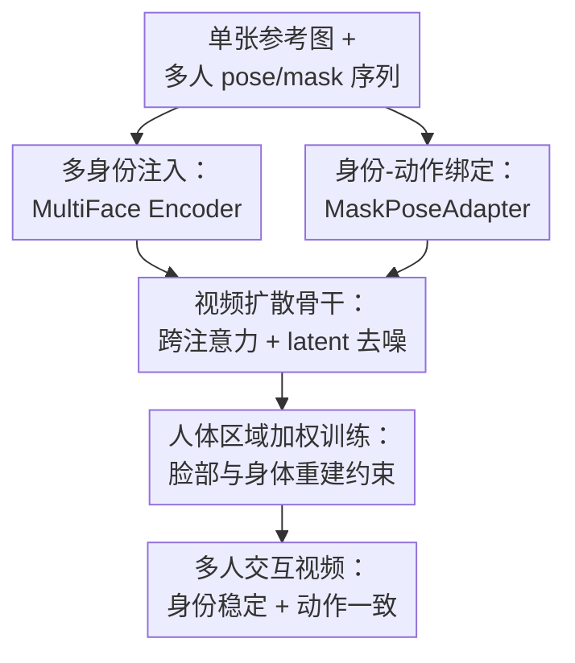

# DanceTogether: Generating Interactive Multi-Person Video without Identity Drifting

**会议**: ICLR2026  
**OpenReview**: [https://openreview.net/forum?id=7VEECFBzmm](https://openreview.net/forum?id=7VEECFBzmm)  
**代码**: 待确认  
**领域**: 视频生成 / 可控人物动画 / 多人交互  
**关键词**: 多人视频生成、身份保持、姿态控制、MaskPoseAdapter、交互一致性

## 一句话总结
DanceTogether 用单张参考图和每个演员各自的姿态-掩码序列生成长时多人交互视频，核心是把“这个人是谁”和“这个人怎么动”在扩散去噪过程中持续绑定，从而显著缓解双人换位、遮挡和肢体接触时的身份漂移。

## 研究背景与动机
**领域现状**：可控人物视频生成已经能在单人舞蹈、姿态迁移和图像到视频动画里做出比较稳定的结果。主流方法通常给模型一张参考人物图，再用逐帧姿态、人体 mask、文本或轨迹作为条件，让扩散模型生成符合控制信号的视频。StableAnimator、AnimateAnyone、HumanVid 这类方法的共同前提是：人物身份主要从参考图提取，动作主要从姿态条件提取，视频骨干负责把二者融合成时间连续的画面。

**现有痛点**：这个设定一到多人交互就会明显失效。两个人牵手、交叉、遮挡、换位时，姿态关键点本身并不携带可靠的身份信息；如果模型只看第 1 路姿态和第 2 路姿态，它很容易在空间位置变化后把 A 的衣服、脸或身体纹理贴到 B 身上。反过来，人体 mask 能稳定告诉模型“这里属于某个跟踪到的人”，但 mask 又缺少骨架、肢体朝向和动作语义，单独使用会让动作控制变粗。

**核心矛盾**：多人交互视频的难点不是单纯的“姿态更复杂”，而是身份线索和动作线索天然分离。姿态告诉模型“怎么动”，但在遮挡和换位时不知道“谁在动”；跟踪 mask 告诉模型“谁占据哪里”，但不知道手臂、腿、身体姿态的精细结构。只在输入端把这些条件拼起来，或逐帧生成再做时间平滑，都无法保证每一步去噪时身份和动作仍然绑定。

**本文目标**：作者希望从单张参考图出发，生成包含两名或多名人物的长时交互视频，并同时满足四个要求：每个人身份不串、动作紧跟独立姿态控制、遮挡和换位时交互仍连贯、视觉质量不能因为多人条件而明显下降。论文还进一步构建训练数据和评测基准，试图把这个问题从“展示几个 demo”推进到可系统比较的任务。

**切入角度**：DanceTogether 的观察很直接：多人生成需要显式、持久的身份-动作绑定。作者没有把 pose、mask、face embedding 当作几路松散条件，而是先拆开身份和动作，再通过 MaskPoseAdapter 与 MultiFace Encoder 在特征层重新耦合，让扩散 UNet 的每个去噪步骤都能读到“第 i 个人的身份 token”和“第 i 个人对应的姿态-mask 条件”。

**核心 idea**：用跟踪 mask 稳住“谁”，用姿态热图表达“怎么动”，再用门控融合和跨人注意力把二者绑定成统一条件，解决多人互动视频生成中的身份漂移和外观串扰。

## 方法详解

### 整体框架
DanceTogether 的输入是一张包含多个人的参考图，以及每个人独立的 pose sequence、human mask sequence 和 face mask sequence；输出是一个多人物交互视频。模型主体继承 StableAnimator / Stable Video Diffusion 风格的 latent video diffusion backbone，但把原本偏单人的条件注入方式扩展为三条协同路径：MultiFace Encoder 从参考图中提炼多个人的身份 token，MaskPoseAdapter 把每个人的姿态和 mask 融成身份-动作绑定条件，视频扩散 UNet 在 latent 空间中生成逐帧视频。

从实现上看，参考图先经 VAE 编码成 latent，并沿时间维复制；真实视频帧在训练时也被编码成 latent。CLIP 图像编码器提供全局视觉语义，ArcFace 提供每个人的 512 维身份向量。MultiFace Encoder 将每个 ArcFace 向量变成一组可被 UNet cross-attention 读取的身份 token；MaskPoseAdapter 则为每个人处理 pose map 和 tracking mask，输出与视频 latent 同分辨率的控制特征。最终，这些条件通过 cross-attention 和 element-wise addition 注入 UNet，让生成过程同时被外观、动作和空间占位约束。

### 关键设计
**1. 多身份注入：让 UNet 同时记住每个演员的外观**

单人动画方法通常只需要一个 face embedding，但双人互动里“只取最大脸”会直接丢掉另一个人的身份。DanceTogether 的 MultiFace Encoder 对每个人分别提取 ArcFace embedding $e_i^{id}\in\mathbb{R}^{512}$，用共享 MLP 投影成 $K=4$ 个宽度为 $768$ 的身份 token，再通过 4 层 FacePerceiver 用 CLIP 图像 embedding 做 cross-attention refinement。所有人的 token 被拼接成 $T\in\mathbb{R}^{B\times NK\times D}$，直接送入 UNet 的 cross-attention 层。

这个设计的重点不是“多放几个 token”这么简单，而是避免多人身份条件被压成一个混合向量。每个人保留独立 token 后，UNet 在生成局部区域时可以选择性读取相应身份信息；FacePerceiver 又让身份 token 和参考图的整体视觉语义对齐，减少 ArcFace 特征与 CLIP 图像特征之间的分布断层。论文还沿用 StableAnimator 的 distribution-aware ID Adapter，把 face branch 的均值和方差对齐到 image branch：$\tilde h_{face}=\frac{h_{face}-\mu_{face}}{\sigma_{face}}\sigma_{img}+\mu_{img}$，再与 image branch 融合，这样身份信息不会以突兀分布进入时序块。

**2. 身份-动作绑定：用 MaskPoseAdapter 把“谁”和“怎么动”绑在同一特征里**

Pose keypoint 在多人遮挡和换位时最容易出错：同一帧里两个骨架可能交叉，某个人的关键点可能缺失，模型很难仅靠 pose 判断这个动作属于哪个身份。MaskPoseAdapter 为每个人建立共享权重的独立分支：PoseNet 把 RGB pose map 编成 $f_i^{pose}\in\mathbb{R}^{320\times64\times64}$，轻量 mask processor 把人体/脸部 mask 压到 3 通道的 $f_i^{mask}$。随后模型用两个 per-pixel gate 分别调节 pose 与 mask 的可信度，并以 $\lambda\approx0.8$ 偏向姿态语义：$f_i=\lambda w_i^{pose}\odot f_i^{pose}+(1-\lambda)w_i^{mask}\odot f_i^{mask}+residual$。

这个门控融合解决的是一个很具体的问题：姿态语义强但身份弱，mask 身份稳定但动作弱。两者在特征层融合后，模型看到的不再是“第 1 张 pose 图”和“一张额外 mask”，而是“第 i 个人在这个位置以这种姿态运动”。论文的可视化也显示，MaskPoseAdapter 的输出在连续帧里能更清楚地区分每个 ID 对应的姿态；原 PoseNet 在遮挡帧则容易让某个人的 pose feature 消失或混在一起。

**3. 跨人注意力：在遮挡、前后关系和换位时动态分配条件权重**

多人交互不是两个单人动画的简单相加。两个人重叠时，前景人物、被遮挡人物和接触区域的条件可信度不同；如果直接把两个分支相加，模型会把互相冲突的 pose/mask 特征揉在一起。DanceTogether 在每个人的融合特征 $f_i$ 上做 LayerNorm，然后把所有人的特征拼接，用轻量网络预测跨人的 attention logits，并用带可学习温度 $\tau$ 的 softmax 得到 $\alpha_{att}$：$\alpha_{att}=softmax(\phi([LN(f_1),...,LN(f_N)])/\tau)$。

最终控制特征不是平均池化，而是 $F=0.95\cdot Conv_{1\times1}(\sum_i\alpha_{att,i}\odot f_i)+0.05\cdot\frac{1}{N}\sum_i f_i$。前面的 0.95 分支让模型根据遮挡和空间关系强调更可靠的人物条件，后面的 0.05 residual mean 保留所有人的弱信息，避免 attention 过度偏向某一方导致另一个人被抹掉。消融里 SimpleFusion 明显落后于完整 MaskPoseAdapter，说明跨人关系建模对交互场景不是装饰项。

**4. 人体区域加权训练：把容量压到最容易漂移的脸和身体上**

DanceTogether 的训练目标仍是扩散重建，但作者把每个人的 body mask 和 face mask 显式放进 reconstruction loss。原始 mask 被下采样到 latent 分辨率 $64\times64$，对第 $i$ 个人使用 $1+M_i^{body}+2M_i^{face}$ 作为区域权重：$L_{rec}=\sum_i\mathbb{E}_{\epsilon\sim\mathcal{N}(0,1)}\|(z_{gt}-z_\epsilon)\odot(1+M_i^{body}+2M_i^{face})\|_2^2$。

这其实是在告诉模型：背景可以相对宽容，但人物身体和尤其脸部不能乱。多人视频里身份漂移最容易被人眼发现的位置正是脸、衣服纹理和身体轮廓；加权损失让训练时的误差重点落在这些区域，配合 MultiFace Encoder 的身份 token 和 MaskPoseAdapter 的空间绑定，形成从条件输入到训练监督的一条闭环。

### 一个完整示例
假设输入参考图里有一对花样滑冰选手，男选手穿黑衣，女选手穿白裙；控制信号给出 16 帧序列，其中第 1 到 6 帧两人并排滑行，第 7 到 11 帧发生交叉遮挡，第 12 到 16 帧完成换位。传统 pose-only 模型在第 8 帧看到两个骨架重叠，可能把白裙纹理延续到前景黑衣选手身上；到第 12 帧两人空间位置交换后，模型甚至可能把“左边的人”默认当作同一个身份，造成身份互换。

DanceTogether 的处理方式更像每帧都带着两条身份线索走。MultiFace Encoder 先把黑衣选手和白裙选手各自变成 4 个身份 token；MaskPoseAdapter 的第 1 分支处理黑衣选手的 pose/mask，第 2 分支处理白裙选手的 pose/mask。第 8 帧遮挡时，如果某个 pose 关键点缺失，mask 仍能指出被遮挡人物的区域；跨人注意力会根据当前重叠关系调节两个分支的贡献，而不是把两个条件硬加。到了第 12 帧换位后，模型跟随的是“身份 token + 跟踪 mask + pose”的绑定，而不是屏幕左/右位置，因此黑衣和白裙仍能跟随各自的人物轨迹。

### 损失函数 / 训练策略
训练从 StableAnimator 初始化 U-Net、PoseNet 和 Face Encoder，再先用大规模单人数据学习身份保持与人体动画，随后把权重迁移到 MaskPoseAdapter 和 MultiFace Encoder，并在多人物数据上完整 fine-tune。论文报告的训练设置是 8 张 NVIDIA A100 80G，batch size 每卡 1，学习率 $1e^{-5}$，训练 20 个 epoch。

数据侧也很关键。作者整合 TikTokDataset、Champ、DisPose、HumanVid 等单人数据，以及 Swing Dance、Harmony4D、CHI3D、Beyond Talking 和自建 PairFS-4K 等双人数据。扩展到 $N$ 人时，MaskPoseAdapter 复制共享权重分支；单人 clip 随机激活一个分支，双人 clip 随机激活两个分支，多人 clip 激活全部分支。这样做的好处是不用为每个人数重新设计结构，也不用引入额外损失。

## 实验关键数据

### 主实验
TogetherVideoBench 把评测拆成三条线：Identity-Consistency、Interaction-Coherence 和 Video Quality。核心测试集 DanceTogEval-100 包含 100 个未见过的双人交互视频，覆盖舞蹈、拳击、摔跤、瑜伽、花滑、拥抱和握手等场景，重点考察遮挡、换位和身体接触。

| 任务维度 | 指标 | 本文最佳 | 之前最强基线 | 提升 |
|--------|------|----------|--------------|------|
| 身份一致性 | HOTA↑ | 83.94 | 71.35（StableAnimator + Dataswing） | +12.59 |
| 身份一致性 | IDF1↑ | 89.59 | 82.53 | +7.06 |
| 交互一致性 | MPJPE2D↓ | 492.24 | 1555.16 | 约 68% 下降 |
| 交互一致性 | OKS↑ | 0.83 | 0.70 | +0.13 |
| 交互一致性 | PoseSSIM↑ | 0.93 | 0.84 | +0.09 |
| 视频质量 | Full-frame FVD↓ | 76.3 | 78.8 | -2.5 |
| 人体区域质量 | Masked FVD↓ | 17.1 | 29.0 | -11.9 |
| 人体区域质量 | Masked FID↓ | 48.0 | 66.7 | -18.7 |

身份一致性结果最能说明问题：StableAnimator 在 Swing Dance 上额外 fine-tune 后已经是很强的基线，但 DanceTogether 加上完整数据和 PairFS-4K 后仍把 HOTA 推到 83.94，IDF1 推到 89.59。交互一致性上，MPJPE2D 从 1555.16 降到 492.24，说明生成视频不只是“人看起来稳定”，也更贴合给定的姿态控制。

### 消融实验
| 配置 | HOTA↑ | IDF1↑ | MPJPE2D↓ | OKS↑ | FVD↓ | C-FID↓ | 说明 |
|------|------|-------|----------|------|------|--------|------|
| w/o mask input | 33.63 | 42.49 | 1625.04 | 0.28 | 40.4 | 14.7 | 没有 mask 后身份定位严重崩溃 |
| w/o pose input | 81.48 | 86.38 | 1292.33 | 0.46 | 19.7 | 9.4 | 身份还能保持，但动作跟随明显变差 |
| w/o MaskPoseAdapter | 48.95 | 62.02 | 1692.55 | 0.48 | 41.3 | 14.2 | 直接用原 PoseNet 难以绑定多人身份 |
| w/ SimpleFusion | 58.23 | 65.71 | 1487.26 | 0.39 | 31.2 | 12.4 | 简单相加不够处理遮挡和换位 |
| w/o MultiFaceEncoder | 83.31 | 88.55 | 893.32 | 0.74 | 17.9 | 8.4 | 多身份 token 对姿态贴合和细节有增益 |
| DanceTog | 83.94 | 89.59 | 492.24 | 0.83 | 17.1 | 7.9 | 完整模型 |

### 关键发现
- Mask 输入是身份一致性的硬支撑。去掉 mask 后 HOTA 从 83.94 掉到 33.63，说明多人位置交换时只靠姿态无法告诉模型“这个动作属于谁”。
- Pose 输入是动作控制的硬支撑。去掉 pose 后 HOTA 仍有 81.48，但 MPJPE2D 恶化到 1292.33、OKS 降到 0.46，说明 mask 可以保身份，却不能替代骨架级运动语义。
- MaskPoseAdapter 比简单融合重要得多。w/o MaskPoseAdapter 和 SimpleFusion 都明显低于完整模型，证明关键不只是“把 mask 加进来”，而是要做门控融合和跨人注意力。
- PairFS-4K 提供了实质增益。DanceTog w. Datafull 的 HOTA 为 81.79，加上 PairFS-4K 后升到 83.94，MPJPE2D 进一步降到 492.24，说明高质量双人花滑数据补足了长时换位、遮挡和同步动作样本。
- 推理速度保持在可用区间。DanceTog 为 0.88 fps，接近 StableAnimator 的 0.89 fps，远快于 UniAnimate-DiT 的 0.03 fps；它不是实时系统，但没有为了多人控制付出数量级的速度代价。

## 亮点与洞察
- **把多人视频生成重新定义为身份-动作绑定问题**：论文没有只追求更大的视频模型，而是抓住“谁”和“怎么动”分离这一根因。这个视角让方法设计、数据标注和评测指标都围绕身份漂移展开，问题闭环比较清楚。
- **MaskPoseAdapter 是一个可复用的控制条件融合范式**：它把稳定但语义弱的 mask、语义强但身份弱的 pose 做特征级门控，并加入跨人 attention。类似思路可以迁移到多人虚拟试衣、群体运动合成、机器人-人交互模拟等需要 per-subject control 的任务。
- **评测基准比单纯视觉 demo 更有价值**：TogetherVideoBench 用 HOTA/IDF1 看身份，用 MPJPE2D/OKS/PoseSSIM 看动作和交互，用 masked FVD/FID 看人体区域质量。这比只报告全帧 FVD 更能反映多人生成的实际失败模式。
- **数据管线补上了多人任务的训练缺口**：PairFS-4K 的价值不只是“多了 26 小时视频”，而是覆盖双人同步、托举、遮挡、换位和相对运动。对可控交互生成来说，数据中的交互结构比总时长本身更重要。
- **人机交互迁移展示了潜在应用面**：作者用约 1 小时 HumanRob-300 fine-tune 出人形机器人交互视频，说明这种 identity-action binding 不只适用于舞蹈，也可能用于 embodied AI 仿真和 HRI 数据生成。

## 局限与展望
- **任务仍依赖高质量控制信号**：模型输入需要每个人独立的 pose、human mask 和 face mask 序列。论文有数据处理管线，但真实部署时如果跟踪、分割或姿态估计失败，生成质量仍会受影响。
- **主要实验集中在双人场景**：方法声称可扩展到 $N$ 人，结构上也支持共享权重分支，但核心 benchmark 和 PairFS-4K 都以双人为主。多人群舞、三人以上遮挡、拥挤场景是否稳定还需要更强证据。
- **不是实时生成系统**：0.88 fps 对离线内容制作可接受，但对实时交互、游戏或机器人闭环仿真仍偏慢。未来可以结合蒸馏、rectified flow、DiT sparse attention 或视频 token 缓存来加速。
- **身份保持仍主要依赖人脸与外观 token**：如果参考图中脸部很小、被遮挡，或者演员穿着高度相似，ArcFace 和 mask 线索都可能变弱。后续可以引入服饰部件、人体 ReID embedding 或 3D body prior 来增强身份描述。
- **物理接触没有显式动力学约束**：论文通过姿态和 mask 提升交互一致性，但托举、摔跤、拥抱这类强接触动作仍可能出现手部穿插或受力不合理。更进一步的方向是把 contact map、depth ordering 或 3D pose consistency 纳入条件和损失。

## 相关工作与启发
- **vs StableAnimator**: StableAnimator 是高质量身份保持人像动画基线，但核心设定更偏单人。DanceTogether 继承其视频扩散骨干和身份注入思想，同时用 MultiFace Encoder 和 MaskPoseAdapter 扩展到多人交互；代价是需要更完整的 per-person pose/mask 条件。
- **vs AnimateAnyone / Champ / DisPose**: 这些方法多围绕单人姿态控制或 3D/SMPL 指导展开，在单人舞蹈上很强，但面对双人遮挡和换位容易丢人、串身份或错动作。DanceTogether 的优势是显式维护每个人的身份-动作对应关系。
- **vs Multi-HumanVid / Follow-your-Multipose / EverybodyDance**: 近期多人动画方法已经开始处理多角色控制，但很多方法仍依赖固定相对位置、文本/pose 粗控制或外部身份匹配。DanceTogether 更强调每个去噪步骤内的身份绑定和跨人 attention，因此更适合频繁位置交换的交互视频。
- **对后续研究的启发**：多人生成不应该只把单人条件复制 $N$ 份，而要设计“主体级条件表示”。对于 VLM 视频编辑、具身仿真、虚拟拍摄等任务，也可以把 person/object mask、motion trajectory、appearance token 绑定成对象级控制单元，再让生成模型处理对象之间的交互。

## 评分
- 新颖性: ⭐⭐⭐⭐☆ 明确抓住多人交互生成中的身份-动作绑定问题，MaskPoseAdapter 和 MultiFace Encoder 的组合有针对性，但整体仍建立在 StableAnimator / SVD 系列骨干上。
- 实验充分度: ⭐⭐⭐⭐⭐ 有主结果、三轨 benchmark、模块消融、数据消融、速度对比和人机迁移展示，数字支撑比较完整。
- 写作质量: ⭐⭐⭐⭐☆ 论文主线清晰，方法和 benchmark 讲得比较完整；部分附录公式和模块细节偏工程化，读者需要结合图理解。
- 价值: ⭐⭐⭐⭐⭐ 多人可控视频生成是内容生产和 embodied AI 都会遇到的真实痛点，这篇把方法、数据和评测一起补齐，后续可复用价值很高。

<!-- RELATED:START -->

## 相关论文

- [\[CVPR 2026\] PLACID: Identity-Preserving Multi-Object Compositing via Video Diffusion with Synthetic Trajectories](../../CVPR2026/video_generation/placid_identity-preserving_multi-object_compositing_via_video_diffusion_with_syn.md)
- [\[ICLR 2026\] EgoTwin: Dreaming Body and View in First Person](egotwin_dreaming_body_and_view_in_first_person.md)
- [\[ICLR 2026\] ReactID: Synchronizing Realistic Actions and Identity in Personalized Video Generation](reactid_synchronizing_realistic_actions_and_identity_in_personalized_video_gener.md)
- [\[ICCV 2025\] Multi-identity Human Image Animation with Structural Video Diffusion](../../ICCV2025/video_generation/multi-identity_human_image_animation_with_structural_video_diffusion.md)
- [\[ICLR 2026\] ConsisDrive: Identity-Preserving Driving World Models for Video Generation by Instance Mask](consisdrive_identity-preserving_driving_world_models_for_video_generation_by_ins.md)

<!-- RELATED:END -->
