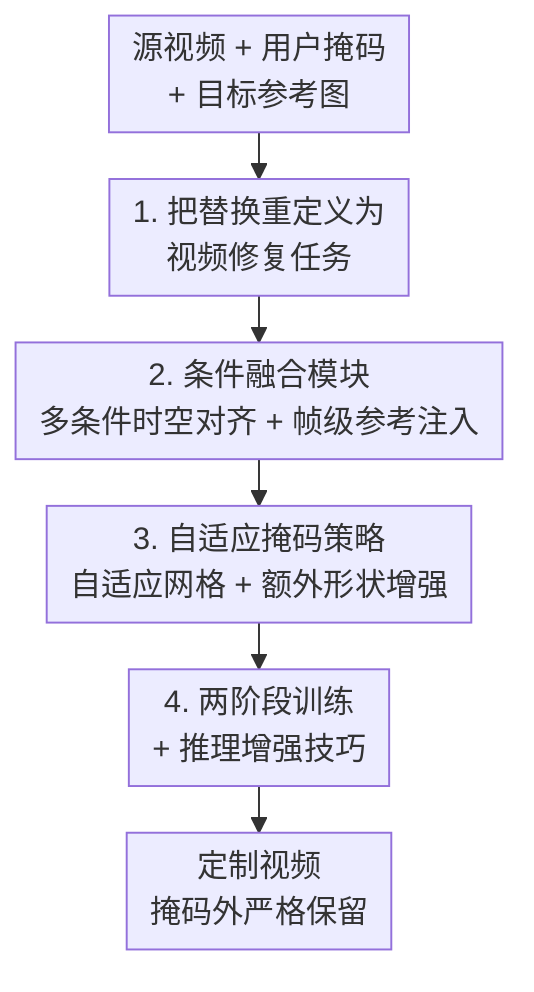

# DreamSwapV: Mask-guided Subject Swapping for Any Customized Video Editing

**会议**: ICLR2026  
**OpenReview**: [https://openreview.net/forum?id=xH0pSRWbFi](https://openreview.net/forum?id=xH0pSRWbFi)  
**代码**: 待确认  
**领域**: 视频生成 / 视频编辑  
**关键词**: 视频主体替换, 掩码引导, 视频修复, 条件融合, Diffusion Transformer

## 一句话总结
DreamSwapV 把"视频主体替换"重新定义成一个**掩码引导的视频修复（inpainting）**任务：给定源视频、一张标定要换对象的掩码、以及目标主体的参考图，模型就能端到端地把视频里任意主体换成任意新主体，靠一个条件融合模块和一套自适应掩码策略实现细粒度控制与自然的主体—环境交互，在自建的 DreamSwapV-Benchmark 上全面超过 VACE、HunyuanCustom 乃至商业模型 Kling 1.6。

## 研究背景与动机
**领域现状**：随着视频生成技术（尤其是 Diffusion Transformer，DiT）成熟，"定制化视频编辑"需求暴涨，其中"主体替换"——把视频里的某个人/物换成用户指定的另一个对象、同时保留原有运动轨迹和场景交互——是最高频也最难的一类需求。

**现有痛点**：现有方法要么**领域太窄**，要么**注入方式太绕**。领域专用方法如 MagicAnimate、Animate Anyone 2 只能换人体；AnchorCrafter、DreamActor-H1 这类人物—物交互（HOI）方法只服务直播/电商里的手持物，泛化不开。通用视频编辑方法也各有硬伤：(1) 免调优方法（如 AnyV2V）靠操纵注意力特征换主体，细节恢复差、几乎不管主体与环境的交互；(2) 调优类方法要么靠文本 prompt（VideoPainter）注入目标，保真度不够，要么为每个主体学 LoRA（VideoSwap），算力高且注入间接；(3) 新兴的统一定制框架（VACE、统一框架）追求"一个模型干所有任务"，但 all-in-one 的设计在主体替换这一具体场景里牺牲了身份一致性和交互真实感。

**核心矛盾**：主体替换本质要同时满足三件事——目标主体的外观细节要保住、源视频的运动轨迹要跟住、换进去的主体要和周围环境自然交互。现有范式（重生成 / 编辑外部对象进场景）天然把"新对象"当成外来物，难以让它"长在"原视频里。

**本文目标**：做一个**主体无关（subject-agnostic）、端到端**的框架，只用"用户掩码 + 一张参考图"就能换视频里任意主体，且把主体—环境交互做真。

**切入角度**：作者换了个视角——不要把替换看成"把外部对象编辑进场景"，而是把它**当成视频修复**：掩码圈出的区域是"缺失的洞"，模型的任务是把目标主体"像它本来就属于这个洞一样"补回去。这样训练和推理都变得直接而直观。

**核心 idea**：用"掩码引导的视频 inpainting"代替"重生成/外部编辑"来做主体替换；训练时参考图就从源视频掩码区抠出来（模型学"把抠掉的主体补回去"），推理时把外部参考图当成"被抠掉的主体"喂进去，复用训练学到的恢复能力。

## 方法详解

### 整体框架
DreamSwapV 建在 Wan2.1-I2V-14B 这个 DiT 视频基座上，整条流水线可以拆成"数据与任务定义 → 多条件融合 → 自适应掩码 → 两阶段训练与推理增强"四块。**输入**是源视频 $V=\{v_t\}$、逐帧主体掩码序列 $M^s=\{m^s_t\}$、参考图 $r^s$，外加从视频里检测出来的姿态与 3D 手部序列 $P$；**输出**是把掩码区主体换成参考主体、其余区域严格保留的定制视频 $V'$。

关键的训练—推理一致性技巧是：训练时参考图由 $r' = v_i \odot m_i$ 得到（随机取一帧，把掩码圈出的主体抠出来当参考），于是损失就是让模型靠这张抠出来的参考把原视频补回去：$V' = f_\theta(M^s, P, r')$。推理时直接把**外部**参考图 $r^s$ 塞进同一个位置，模型就"以为"它是从掩码区抠出来的那个主体，于是完成替换 $V' = f_\theta(M^s, P, r^s)$。多个条件（掩码、agnostic 视频、姿态/3D 手、参考图）经条件融合模块严格对齐后与噪声视频一起送进 DiT，逐 block 自注意力出预测噪声。

### 关键设计

**1. 把替换重定义为视频修复任务：让目标主体"长进"缺失区域**

现有范式把新主体当成外来物去"重生成 / 编辑进场景"，所以总在身份一致性和场景融合之间打架。作者的做法是把替换彻底当成 inpainting：掩码 $m^s_0$ 圈出第一帧要换的区域，参考图 $r^s$ 提供新主体外观，模型只需"把这个洞按参考补好"。这套定义还自然涵盖两个退化任务——参考缺失时退化成标准视频修复，掩码区原本没主体时退化成"视频添加（addition）"。训练时参考从源视频自己抠（$r'=v_i\odot m_i$），让模型学到"忠实恢复外观 + 与场景无缝交互"的能力；推理时把外部参考伪装成被抠的主体喂进去，复用这套能力。这个重定义是后面所有设计的地基：因为是 inpainting，掩码外区域被严格保留当上下文，从根上保证了背景不被乱改（这正是 Kling 这类重生成方法吃亏的地方）。

**2. 条件融合模块：把掩码/姿态/3D手/参考多信号严格时空对齐后高效注入**

二值掩码能让模型分清"要换的区"和"要保的区"，但更难的是（i）准确恢复被换主体的运动轨迹、（ii）处理掩码边界处主体与环境的交互。为此作者引入多条件：动态主体（人、动物）运动中常自遮挡，需**姿态**提供运动信息；静态物体的运动多由相机或外力造成、可从掩码形变推断，但手—物交互的真实感关键，于是引入 **3D 手部估计**。姿态与 3D 手合成统一时序 $P$。除掩码序列 $M^s$ 外，还有 agnostic 掩码视频 $A^s = V\odot(1-M^s)$ 和参考图 $r^s$。这些信号（除二值掩码外）都经预训练 3D VAE 编码进共享潜空间，时间维压 4、空间维压 8；二值掩码不过 VAE，而是每 4 帧沿通道拼接再 8 倍空间下采样，对齐到 $[b,(f{-}1)//4{+}1,4,h//8,w//8]$。

这个设计最关键的是**参考注入方式**。作者对比了三种旧方案并指出其缺陷：(a) 通道拼接会破坏跨帧时空特征对齐，因为参考是适用所有帧的全局信号而非只属于第 0 帧，导致学习混乱、细节注入受损；(b) 用 CLIP 等特征做 cross-attention 受编码器瓶颈限制，难捕捉细粒度细节，且 cross-attention 更适合语义引导而非高保真外观注入；(c) ReferenceNet 引入参数冗余和参考图—噪声视频间的特征空间错位。于是作者改用**帧级（时间维）拼接**：把参考潜变量沿 $f$ 维与噪声/dummy 参考潜变量拼起来，扩展 token 长度。在自注意力里，视频能 attend 到参考、而参考只 attend 自己（用 KV cache），且参考潜变量被排除出损失计算——这等价于用更简洁的时序拼接实现了 ReferenceNet 的效果。此外，把噪声视频潜变量的首帧单独抽出做一个 dummy 参考潜变量（后续帧零填充），显式表达整段视频的第一帧，为后面长视频外推和首帧参考留接口。最后掩码、agnostic、姿态潜变量在参考帧上零填充，所有潜变量沿通道拼成最终输入，保证逐帧严格时空对齐。

**3. 自适应掩码策略：按主体尺度调网格 + 额外形状增强，治"形状泄漏"**

掩码处理是这类任务的命门：掩码过精，模型会过拟合掩码形状，换跨域大的主体时泛化崩（即"形状泄漏 shape leakage"，比如方盒子⇒球）；掩码过糙，又会产生伪影、细节糊。Animate Anyone 2 用网格增强缓解——把掩码的 bounding box 切成 $k_h\times k_w$ 块，含掩码像素的块就膨胀，模糊精确边界。但它是为换人设计的，直接用到通用主体替换上，小物件（首饰、手持物）和大物体（人、车、背景）共享同一增强并不合适。

作者的改法是**自适应网格尺寸**：30% 概率用 bounding box 增强（最粗掩码），其余 70% 沿用网格策略，但**切整帧而非 bbox**，且让网格尺寸与主体尺度成反比。具体地，Animate Anyone 2 用 $k_h^{train}=\text{rand}(1,h)$、$k_h^{inf}=h//10$ 来切 bbox；本文改成 $K_h^{train}=\text{bbox}_h//\text{rand}(h_1,h_2)$、$K_h^{inf}=\text{bbox}_h//h_3$，水平方向 $K_w$ 同理。直觉是：主体越大、$\text{bbox}_h\times\text{bbox}_w$ 越大、$K_h\times K_w$ 越大、网格越细，更精细地控制其运动（而大主体替换本就少有形状泄漏）；小主体反而拿到更粗的掩码，容纳更多样的跨类替换。其次是**额外形状增强**：增强后的掩码总比目标主体大，于是掩码必然盖到一些背景，模型若无约束会把整个掩码都用参考内容填满，产生幻觉（如把头发延伸进掩码区而不是补合理背景）。作者在训练时随机往网格增强后的掩码边缘加简单几何形状（圆、三角、矩形），进一步把主体和掩码精确形状解耦，教会模型"不是所有被掩像素都属于主体"，从而沿掩码边界补更合理的背景，改善主体—环境交互。

**4. 两阶段训练 + 推理增强技巧：补齐跨域参考与长视频/小物体短板**

预训练阶段参考都从源视频自己抠，保持了完美的尺度和亮度，这有风险让模型学到"复制粘贴"的捷径（HunyuanCustom 也提到过），处理真实世界里有尺度/亮度/角度差异的外部参考时就垮。作者用**两阶段训练**解决：(i) 预训练只解冻自注意力层，在 HumanVID 衍生数据（8160 视频、16219 主体实例，人:衣物:小物:大物≈1:0.2:1:1）上训，保住基座生成能力，参考—视频对同域；(ii) 质量微调用一个更小但高质量、跨域的参考—视频对数据集（从 AnyInsertion、Subject200K 抠配对图、再用 Wan2.1-I2V 转视频，外加约 400 个 AnchorCrafter-400 手持配对），全参微调，让模型适应跨域参考。训练目标在原始损失上加了**主体区重加权损失**应对极小主体（如首饰）易被忽略的问题：

$$L_{rw} = \frac{E}{E_s} M^s \odot L_{pt}, \quad L_{final} = (1-M^s)\odot L_{pt} + \lambda L_{rw}$$

其中 $E$、$E_s$ 是整帧与主体面积，$M^s\in\{0,1\}^{h\times w}$ 是主体二值掩码，重加权放大掩码内学习信号。推理侧还配套了几个技巧：掩码面积比低于阈值 0.05 时用 **tunnel 修复**（围着掩码抠紧 crop、在子区域里替换再贴回）聚焦小物体细节；靠 dummy 参考潜变量实现**长视频分段外推**（上一段末帧当下一段首帧+dummy 参考）和**首帧参考**（用户可选地用图像替换模型先换好首帧，再让其连贯传播）；以及掩码约束（bounding-box 推理模式、相邻掩码重叠 ≤5% 时取最小外接区）防止源主体信息泄漏导致重建出原主体。

### 损失函数 / 训练策略
预训练损失 $L_{pt}$ 是标准的扩散去噪目标（恢复原视频），最终训练目标见上式：掩码外区域用普通 $L_{pt}$、掩码内用重加权 $L_{rw}$ 放大信号，$\lambda$ 平衡两者。两阶段：预训练 15000 步（仅自注意力可训）+ 质量微调 10000 步（全参），均在 32 张 H100 80GB 上跑，约 13 天。框架不改基座结构，可迁移到 CogVideoX、HunyuanVideo 等其他基座。

## 实验关键数据

### 主实验
在自建 **DreamSwapV-Benchmark**（100 个 Pexels 视频、167 个主体实例、4 种宽高比）上，用 5 个继承自 VBench 的指标 + 3 个自定义指标（参考外观、背景保留、语义一致）+ 用户研究评测。对比 3 个开源方法（AnyV2V、VACE、HunyuanCustom）和 1 个商业模型（Kling 1.6）。

| 方法 | VBench 平均 | 参考外观 | 背景保留 | 语义一致 | 总平均 | 用户·视觉保真 |
|------|------|------|------|------|------|------|
| AnyV2V | 75.93% | 34.70% | 42.71% | 51.00% | 63.51% | 0.42 |
| VACE | 74.99% | 39.66% | 47.46% | 66.93% | 66.16% | 2.46 |
| HunyuanCustom | 78.17% | 41.33% | 48.14% | 63.65% | 68.00% | 2.13 |
| Kling 1.6 | 79.79% | 42.27% | 39.17% | 69.95% | 68.80% | 3.14 |
| **DreamSwapV** | **80.44%** | **45.22%** | **52.49%** | **72.01%** | **71.49%** | **3.32** |

DreamSwapV 在 VBench 平均、参考外观、背景保留、语义一致、总平均及三项用户研究上全部第一。Kling 1.6 虽 VBench 平均接近，但它的"重生成"框架常改大片背景甚至重画整帧、实用性差；VACE/HunyuanCustom 因 all-in-one 焦点在参考外观和细节一致上吃亏；AnyV2V 的中间特征操纵不稳定常导致视频整体崩塌。

### 消融实验

| 配置 | VBench 平均 | 总平均 | 说明 |
|------|------|------|------|
| Full (ours) | 80.44% | 71.49% | 完整模型 |
| 参考注入→通道拼接 | 77.80% | 67.15% | 换成通道拼接，掉最多 |
| 参考注入→cross-attention | 79.61% | 69.11% | 换成 cross-attn，仍明显低 |
| w/o 自适应网格 | 80.08% | 69.81% | 去掉自适应网格尺寸 |
| w/o 额外形状增强 | 80.19% | 70.34% | 去掉额外形状增强 |
| w/o 两阶段训练 | 80.15% | 70.23% | 不做质量微调 |

### 关键发现
- **参考注入方式是第一贡献**：换成通道拼接总平均从 71.49% 掉到 67.15%（−4.34），换成 cross-attention 也掉到 69.11%，证明"帧级时序拼接 + 自注意力单向 attend"对高保真外观注入的重要性远超其他模块。
- **自适应网格 / 两阶段训练对"语义一致"和"参考外观"提升明显**：去掉自适应网格后语义一致从 72.01% 掉到 65.55%；去掉两阶段训练后参考外观掉到 43.52%，说明跨域质量微调确实补上了"复制粘贴"捷径的短板。
- **额外形状增强贡献相对最小但仍正向**（总平均 70.34→71.49），主要改善掩码边界的背景补全合理性。

## 亮点与洞察
- **"换主体=补缺失"这个重定义非常巧妙**：它把训练目标变成自监督的"抠掉再补回"，免去了配对数据的稀缺问题，还顺带让"掩码外严格保留"成为天然性质，从根上解决了重生成方法乱改背景的痛点——一个视角转换换来三个好处。
- **帧级时序拼接当 ReferenceNet 用**：不额外加参数网络、靠自注意力里"视频 attend 参考、参考只 attend 自己 + KV cache"就实现了高保真注入，是个可迁移到其他参考引导生成任务的轻量 trick。
- **网格尺寸与主体尺度成反比**：大主体细网格、小主体粗掩码，这个反直觉的设计精准对应了"大主体少形状泄漏需精控、小主体跨类替换需松绑"的实际需求，比一刀切的增强聪明。
- **dummy 参考潜变量一物多用**：既支撑长视频分段外推、又支撑首帧参考注入，一个设计接口撑起两个实用能力。

## 局限与展望
- **作者承认的局限**：跨域差异大的替换（如半身人插进全身掩码、动物→人、物体→角色）很吃力，因为方法依赖姿态条件，而动物/物体的姿态与人差异巨大。作者把这类无掩码跨域替换留给未来工作。
- **依赖掩码精度**：方法严格掩码引导，掩码泄漏源主体会导致重建出原主体而非注入参考；虽然提供了 bounding-box 推理模式和重叠约束兜底，但本质上对掩码质量敏感。
- **可改进方向**：探索 mask-free 的跨域替换；把对姿态的强依赖放松，让方法能处理姿态结构差异大的源/目标对；以及把 tunnel 修复这类推理增强从启发式阈值改成自适应触发。

## 相关工作与启发
- **vs Animate Anyone 2**: 都用网格掩码增强治形状泄漏，但 AA2 只为换人设计、对所有尺度一刀切增强；DreamSwapV 改成切整帧 + 网格尺寸随主体尺度自适应，并加额外形状增强，把范围扩到通用主体。
- **vs VideoPainter / VideoSwap**: 前者靠文本 prompt 注入目标、保真不够，后者靠 per-subject LoRA、算力高且注入间接；DreamSwapV 用一张参考图 + 帧级拼接端到端注入，既直接又高保真（论文为公平起见把这类文本指令法排除出主对比）。
- **vs VACE / HunyuanCustom（统一定制框架）**: 它们追求 all-in-one 覆盖 T2V/R2V/V2V/MV2V，主体替换只是其中一项，因而牺牲了身份一致与交互真实；DreamSwapV 专注主体替换单任务，在参考外观和语义一致上明显胜出。
- **vs AnyV2V（免调优）**: 靠操纵中间注意力特征换主体，不稳定常致视频崩塌；DreamSwapV 训练专用模型、用 inpainting 范式，稳定性和细节都强得多。

## 评分
- 新颖性: ⭐⭐⭐⭐ "替换=inpainting"的重定义 + 帧级参考注入 + 自适应网格，组合扎实，单点创新性中上
- 实验充分度: ⭐⭐⭐⭐ 自建首个主体替换 benchmark、5+3 指标 + 用户研究 + 4 组消融，较全面，但 benchmark 自建难免有利己倾向
- 写作质量: ⭐⭐⭐⭐ 方法动机和对比清晰，三种参考注入的取舍讲得很透
- 价值: ⭐⭐⭐⭐ 主体替换是高频实用需求，框架可迁移到任意 DiT 基座，落地价值高

<!-- RELATED:START -->

## 相关论文

- [\[ICLR 2026\] Controllable First-Frame-Guided Video Editing via Mask-Aware LoRA Fine-Tuning](controllable_first-frame-guided_video_editing_via_mask-aware_lora_fine-tuning.md)
- [\[ICLR 2026\] Any-to-Bokeh: Arbitrary-Subject Video Refocusing with Video Diffusion Model](any-to-bokeh_arbitrary-subject_video_refocusing_with_video_diffusion_model.md)
- [\[ICLR 2026\] MAGREF: Masked Guidance for Any-Reference Video Generation with Subject Disentanglement](magref_masked_guidance_for_any-reference_video_generation_with_subject_disentang.md)
- [\[CVPR 2026\] SMRABooth: Subject and Motion Representation Alignment for Customized Video Generation](../../CVPR2026/video_generation/smrabooth_subject_and_motion_representation_alignment_for_customized_video_gener.md)
- [\[ICCV 2025\] DIVE: Taming DINO for Subject-Driven Video Editing](../../ICCV2025/video_generation/dive_taming_dino_for_subject-driven_video_editing.md)

<!-- RELATED:END -->
