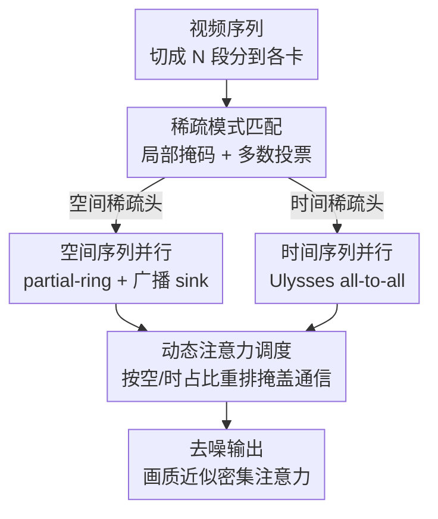

# DSA: Efficient Inference For Video Generation Models via Distributed Sparse Attention

**会议**: ICLR2026  
**OpenReview**: [https://openreview.net/forum?id=1ZmdfDzGE1](https://openreview.net/forum?id=1ZmdfDzGE1)  
**代码**: 待确认  
**领域**: 视频生成 / 扩散模型推理加速 / 分布式系统  
**关键词**: 视频扩散 Transformer、稀疏注意力、序列并行、分布式推理、超线性扩展

## 一句话总结
DSA 把"稀疏注意力"和"序列并行"两条原本各走各路的加速线拧在一起：针对视频扩散模型里的空间稀疏和时间稀疏两种注意力模式，分别配上 partial-ring 和 Ulysses 两种并行策略，再用动态调度把通信藏进计算里，在 8 卡 H100 上生成 720p / 5 秒视频比单卡密集注意力快 10.79×、比现有分布式方法（USP）再快 1.43×，且画质几乎无损。

## 研究背景与动机
**领域现状**：扩散 Transformer（DiT）已经是视频生成的主力骨干，Sora、Wan、Hunyuan-Video 都靠它产出高质量视频。但 DiT 把一段高分辨率视频拍平成超长 token 序列做全注意力——Wan2.1-14B 生成 5 秒 720p 视频，每个通道约 30.2 万 token、共 16 个通道，注意力的计算量随序列长度平方增长，单卡跑一遍要 31 分钟。

**现有痛点**：业界有两条独立的加速路线，但各有天花板。① **稀疏注意力**（SVG、STA、SpargeAttention）利用视频在时空上的稀疏性，只算少数关键 token，能省 FLOPs 且免训练；但它们只为单卡设计，搬到多卡上反而水土不服——稀疏模式的判定需要看完整序列的 query/key，而序列并行恰恰把序列切碎了分到各卡上。② **序列并行**（xDiT/USP）把序列按维度切给多卡，能分摊算力；但卡间要反复交换 Q/K/V，通信开销让扩展只能做到**亚线性**：Wan2.1-14B 从 1 卡到 8 卡，时间只从 1837.9s 降到 287.9s，扩展效率 79.7%。

**核心矛盾**：稀疏注意力省的是"算"，序列并行分的是"卡"，但二者天然打架——稀疏判定要全序列、序列并行偏偏把序列拆了；而且现有稀疏方法压根没考虑分布式下的新问题，比如 **attention sink**（所有 query 都要关注开头那几个文本 token）只落在 1 张卡上，却要被所有其它卡访问。已有的 MagiAttention 虽然合了稀疏+分布式，但是给 LLM **训练**用的，不是推理。

**本文目标**：在分布式推理场景下，既吃到稀疏注意力的省算红利，又吃到多卡的并行红利，还要把序列并行的通信开销压下去，同时保住视频质量。

**切入角度**：作者观察到视频 DiT 的注意力其实是两种**结构清晰**的稀疏模式——**空间稀疏**（query 主要关注同帧或相邻帧的近邻 token）和**时间稀疏**（query 关注不同帧里同一空间位置的 token）。既然两种模式的通信需求截然不同，就不该用同一套并行策略一刀切，而应该"看模式下菜碟"。

**核心 idea**：为每种稀疏模式量身定制并行策略——空间稀疏用只传相邻邻居的 partial-ring，时间稀疏用 Ulysses all-to-all——再用动态调度按层/步的实时空时比例把通信掩进计算，做到**训练免、画质保、超线性扩展**。

## 方法详解

### 整体框架
DSA（Distributed Sparse Attention）是一套训练免（training-free）的分布式注意力推理机制，目标是把一段视频的超长 token 序列切给 $N$ 张 GPU、并在每张卡上只做稀疏计算。整体流程是：输入序列被切成 $N$ 段子序列分到各卡，先由一个轻量 profiler 在**局部**判定每个注意力头属于空间稀疏还是时间稀疏，再用 all-gather 多数投票确定全局模式；空间头走"空间序列并行"（只跟相邻卡通信 + 广播 attention sink），时间头走"时间序列并行"（Ulysses all-to-all 重组 head）；最后由动态注意力调度按空/时头的实时占比重排执行顺序，把卡间通信藏进计算，输出和密集注意力几乎一致的结果。

### 关键设计

**1. 稀疏模式匹配：在切碎的子序列上靠投票还原全局模式**

痛点很直接：SVG 这类静态稀疏方法靠"采样整条序列、把每个头匹配到空间掩码或时间掩码之一"来免训练加速；可一旦做序列并行，每张卡只拿到一段子序列，原来那套依赖完整序列的匹配就失效了。DSA 的做法是**局部模式匹配 + 多数投票**：为局部的 query/key 子序列预先定义好对齐的注意力掩码，每张卡在自己那段上先算出一个局部的稀疏模式判定，再用 all-gather 把各卡的判定汇总、投票得到该头最终的稀疏模式（空间 or 时间）。这样既不用全序列、又能在分布式下复用静态稀疏掩码的高性能 kernel，是后面所有并行策略的"分流器"。

**2. 空间序列并行：partial-ring 只传相邻邻居，把 sink 单独广播**

空间稀疏的特征是 query 主要关注同帧或邻帧的空间近邻，所以理论上每张卡只需要和**相邻**卡交换数据，而不必像标准 ring attention 那样把 K/V 在所有卡间转一整圈（$N-1$ 次传输）。DSA 据此提出 **partial-ring**：只做顺时针、逆时针各一次 send-receive（共 2 次），用 online softmax 分块累积注意力输出并把通信和计算重叠——传输次数从 $N-1$ 降到常数 2，GPU 越多省得越多。但空间模式有两个麻烦得专门处理：其一，第一帧的 **attention sink token**（常是文本 token）落在第一张卡上却要被所有 query 关注，DSA 用一次 **broadcast** 把它从首卡广播给全体；其二，不同头的空间邻近范围不一样，有些头连相邻卡的空间 token 也要看，partial-ring 的双向传输正好覆盖了相邻卡、顺带保住了画质。

**3. 时间序列并行：Ulysses all-to-all 重组 head，把稀疏省在计算上**

时间稀疏更棘手：它是"重复的对角模式"，一张卡上的 query 要关注分散在**所有卡**上、同一空间位置不同帧的 key，partial-ring 那种只摸邻居的玩法救不了它，必须做全局重排。DSA 在这里改用 **Ulysses 式**并行：每张卡初始持有形状 $[B, S/N, H, D]$ 的子序列，先做一次 all-to-all 把布局换成 $[B, S, H/N, D]$，即每张卡拿到**完整序列、但只负责一部分头**；这样每张卡就能在本地对自己那几个头独立施加稀疏掩码，算完再做第二次 all-to-all 还原成 $[B, S/N, H, D]$。它的妙处在于：总通信量和普通 Ulysses 一样，但因为施加了稀疏注意力，**计算量大幅下降**——通信不变、计算省了，净赚。

**4. 动态注意力调度：按空/时占比重排执行，把 all-to-all 藏进计算**

扩散模型在不同层、不同去噪步、不同 prompt 下，空间稀疏头和时间稀疏头的**比例是动态变化**的，固定的执行顺序会让通信和计算干等。DSA 提出 **Dynamic Attention Scheduling（DAS）**，按当前空/时头占比在两种调度间切换：**空间主导调度**——当空间头占多数时，把空间注意力计算和时间注意力计算交错执行，用这段交错把时间路径上 all-to-all 的通信开销掩盖掉；**时间主导调度**——当时间头占多数时，先算空间头的局部注意力并和 all-to-all 重叠，在随后的 Ulysses 计算中做 partial-ring 把空间 token 收齐拼成更大张量，最后再让空间注意力计算和时间 all-to-all 通信重叠。一句话：哪种模式多就先铺哪种，用它的计算去盖另一种的通信。

### 损失函数 / 训练策略
DSA 是**训练免（training-free）**的推理期机制，不引入任何训练目标或微调，直接套在已有的 Wan、Hunyuan-Video 等预训练 DiT 上。可调旋钮主要是稀疏度：实验默认空间/时间稀疏度都设 75%；由于 DSA 把空间和时间的计算**解耦**，二者可以设不同稀疏度（这是相对 SVG 强制统一稀疏度的额外自由度）。

## 实验关键数据

### 主实验
在 Wan2.1-1.3B、Wan2.1-14B、Hunyuan-Video 三个模型上评测，画质用 VBench（4 个维度）+ PSNR/SSIM/LPIPS，系统性能比生成端到端延迟。画质上 DSA 与最强静态稀疏方法 SVG 基本持平、优于 SpargeAttention（Sparge）；系统性能上在 8 卡显著领先。

| 模型 | 方法 | GPU 数 | 生成时间(s) | 加速比 |
|------|------|--------|------------|--------|
| Wan2.1-1.3B | Dense | 1 | 402.34 | 1× |
| Wan2.1-1.3B | SVG | 1 | 310.14 | 1.29× |
| Wan2.1-1.3B | USP | 8 | 59.45 | 6.76× |
| Wan2.1-1.3B | **DSA** | 8 | 54.11 | **7.43×** |
| Wan2.1-14B | Dense | 1 | 1889.25 | 1× |
| Wan2.1-14B | USP | 8 | 251.26 | 7.52× |
| Wan2.1-14B | **DSA** | 8 | 175 | **10.79×** |
| Hunyuan-Video-13B | Dense | 1 | 1790.34 | 1× |
| Hunyuan-Video-13B | USP | 8 | 284.71 | 6.29× |
| Hunyuan-Video-13B | **DSA** | 8 | 189.38 | **9.45×** |

画质对比（VBench / 帧级指标，以 Wan2.1-14B 为例）：DSA 的 PSNR 33.19、SSIM 0.775、LPIPS 0.103，与 SVG（33.03 / 0.781 / 0.109）互有胜负、整体相当，且全面优于 Sparge（30.79 / 0.641 / 0.189）。USP 因为无损，画质等同 Dense，故画质表里不单列。

### 消融实验
调度策略消融（Wan2.1-14B，生成 720p 5 秒视频）：

| 策略 | 生成时间(s) | 说明 |
|------|------------|------|
| Naive Schedule | 188.92 | 空间/时间注意力顺序执行、无重叠 |
| Dynamic Schedule | 180.47 | 按空时比重排 + 计算通信重叠，降 4.7% |
| Spatial Only | 175 | 全部头用空间模式，较 naive 降 8%、画质近乎无损 |

稀疏度敏感性（Wan2.1-14B，空间/时间分别取 80/90/95%）：固定时间稀疏 95% 时，空间稀疏从 80% 升到 95%，overall consistency 从 0.179 掉到 0.174；而很高的时间稀疏（95%）仍能维持和较低空间稀疏相当的画质。

### 关键发现
- **超线性扩展是最大亮点**：Wan2.1-14B 和 Hunyuan-13B 上 8 卡加速比（10.79×、9.45×）超过卡数 8×，说明 DSA 把稀疏省下的算力 + 通信优化叠加后，单卡跑不动的大模型在多卡上反而"跑得更超值"；但 Wan2.1-1.3B 仍是亚线性（7.43×），作者归因于小模型计算分片伤了硬件利用率。
- **时间注意力天生比空间更稀疏**：因为帧数通常远小于单帧内 token 数，同一空间位置跨帧的 key token 比同帧/邻帧内的 key token 少得多，所以时间维度即便设 95% 高稀疏也几乎不掉画质，而空间维度稀疏度一高就掉点——这给"空间/时间分别设稀疏度"提供了实证依据。
- **调度收益有限但稳定**：动态调度相对 naive 降 4.7%，spatial-only 降 8%，说明大头收益来自混合并行本身，调度是锦上添花。

## 亮点与洞察
- **"按模式配并行"的分治思想**：不把稀疏注意力当成一个黑盒去并行，而是先拆出空间/时间两种结构化模式、再给每种配最省通信的并行策略（partial-ring vs Ulysses）。这种"先认清结构、再对症并行"的思路可迁移到任何有明确稀疏结构的长序列模型推理。
- **partial-ring 把 ring 的 $N-1$ 次通信砍成常数 2**：抓住"空间稀疏只需邻居"这一物理事实，是整篇最干净利落的优化——GPU 越多省得越多，直接撑起超线性扩展。
- **通信不变、计算变少的 Ulysses 复用**：时间并行里 all-to-all 通信量和普通 Ulysses 完全一样，但叠加稀疏后计算量骤降，等于零额外通信成本换来稀疏红利，是个很划算的"白嫖"。
- **和 caching 类加速正交**：DSA 只动注意力的算法和并行，不碰跨步复用的缓存机制（PAB、TaylorSeer 等），二者可叠加，工程上很友好。

## 局限与展望
- **作者承认**：当前只针对空间/时间两种已知稀疏模式做并行，未来模型若出现新的稀疏模式尚未覆盖；动态调度虽然重叠了计算和通信，但多次 kernel launch 本身会拖性能，作者计划用 TileLink / Triton-Distributed 把计算-通信融成高效 CUDA kernel。
- **小模型不超线性**：Wan2.1-1.3B 仍是亚线性扩展，计算分片在小模型上反而降低硬件利用率，说明 DSA 的红利更偏向大模型/长序列场景。
- **自己发现的局限**：实验只在 8 卡单节点、720p / 5 秒这一档设置上验证，跨节点通信、更长时长/更高分辨率下的扩展性没有展开；画质评测依赖 VBench 4 个维度 + 传统图像指标，对运动一致性等视频特有质量的刻画有限；稀疏度（75%）是人工设定的全局超参，缺少自适应选择机制。

## 相关工作与启发
- **vs SVG（静态稀疏注意力）**: SVG 用静态空间/时间掩码做单卡免训练加速、画质最好，但只为单卡设计、需全序列匹配且强制空时统一稀疏度；DSA 沿用其静态模式思想，但用局部匹配+投票把它搬上多卡，并解耦空时稀疏度，画质持平的同时拿到分布式扩展。
- **vs USP / xDiT（统一序列并行）**: USP 把 ring 和 Ulysses 混合做无损分布式推理，但主要为跨节点通信优化、且完全忽略视频注意力的稀疏结构，只能亚线性扩展；DSA 在单节点内按稀疏模式分别选并行策略，在 Wan2.1-14B 上比 USP 再快 43%（1.43×）并实现超线性。
- **vs MagiAttention**: 同样合并稀疏+分布式注意力，但 MagiAttention 面向 LLM **训练**，DSA 面向视频生成**推理**，场景与优化目标不同。
- **vs DistriFusion / PipeFusion（系统级并行）**: 它们用 patch 并行 / 流水线并行加速，但主要针对**图像**生成；DSA 专攻视频 DiT 的时空注意力。
- **vs PAB / AdaCache / TaylorSeer（缓存复用）**: 这些方法跨去噪步复用中间激活，和 DSA 正交，可叠加进一步提速。

## 评分
- 新颖性: ⭐⭐⭐⭐ 把稀疏注意力和分布式推理"按模式分治"地拧到一起，partial-ring + 动态调度是实打实的新设计，但单点技术多为已有组件的巧妙组合。
- 实验充分度: ⭐⭐⭐⭐ 三模型、画质+系统双维度、调度与稀疏度消融齐全；但只在 8 卡单节点一档设置上验证，跨节点和更长视频未覆盖。
- 写作质量: ⭐⭐⭐⭐ 动机层层递进、三大挑战交代清楚，图示（注意力模式、partial-ring、调度）直观；部分系统细节偏密集。
- 价值: ⭐⭐⭐⭐⭐ 视频生成推理成本是商用部署的真痛点，10.79× 加速 + 超线性扩展 + 训练免 + 可叠加缓存，落地价值高。

<!-- RELATED:START -->

## 相关论文

- [\[ICLR 2026\] BLADE: Block-Sparse Attention Meets Step Distillation for Efficient Video Generation](blade_block-sparse_attention_meets_step_distillation_for_efficient_video_generat.md)
- [\[ICML 2026\] DFSAttn: Dynamic Fine-Grained Sparse Attention for Efficient Video Generation](../../ICML2026/video_generation/dfsattn_dynamic_fine-grained_sparse_attention_for_efficient_video_generation.md)
- [\[ICML 2026\] VEDA: Scalable Video Diffusion via Distilled Sparse Attention](../../ICML2026/video_generation/veda_scalable_video_diffusion_via_distilled_sparse_attention.md)
- [\[NeurIPS 2025\] VORTA: Efficient Video Diffusion via Routing Sparse Attention](../../NeurIPS2025/video_generation/vorta_efficient_video_diffusion_via_routing_sparse_attention.md)
- [\[NeurIPS 2025\] VSA: Faster Video Diffusion with Trainable Sparse Attention](../../NeurIPS2025/video_generation/vsa_faster_video_diffusion_with_trainable_sparse_attention.md)

<!-- RELATED:END -->
