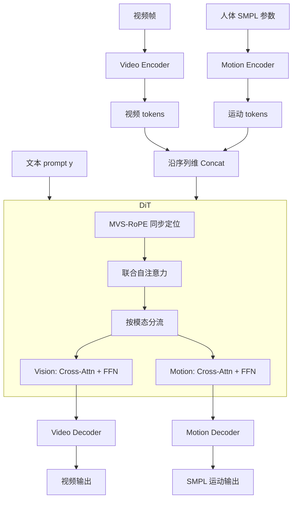

# EchoMotion: Unified Human Video and Motion Generation via Dual-Modality Diffusion Transformer

**会议**: ICLR 2026  
**OpenReview**: [https://openreview.net/forum?id=eflUxFmIhZ](https://openreview.net/forum?id=eflUxFmIhZ)  
**代码**: [项目主页](https://yuxiaoyang23.github.io/EchoMotion-webpage/)  
**领域**: 视频生成 / 人体动作生成  
**关键词**: 人体视频生成, SMPL 运动参数, 双模态扩散 Transformer, MVS-RoPE, 联合分布建模  

## 一句话总结
EchoMotion 不再把人体视频生成当作纯像素回归问题，而是用双分支 DiT 显式联合建模「视频外观 + SMPL 参数化运动」的联合分布 $p(x, m \mid y)$，配合时序同步的 MVS-RoPE 和两阶段训练，把复杂人体动作视频的解剖合理性和运动连贯性显著提上去，并顺带获得视频↔运动双向跨模态生成能力。

## 研究背景与动机

**领域现状**：基于 DiT 的视频扩散模型（Wan、CogVideoX、HunyuanVideo 等）在视觉保真度和时序一致性上已经做得很好，但一碰到复杂人体动作（体操、滑板、格斗）就频繁翻车，生成的视频出现关节扭曲、肢体缠绕、解剖结构错乱。

**现有痛点**：作者把根因归结到训练目标本身——纯像素回归损失被静态外观和背景细节主导，对时序运动学几乎不敏感。人体自由度极高，哪怕细微的运动学误差在视觉上都会显得极不自然，而像素损失根本逼不出模型去学习底层的关节运动规律。一类补救方案是用 2D 关键点或 3D 姿态作为显式条件来引导（DisCo、Animate Anyone、Champ、RealisDance），但这有两个硬伤：一是依赖推理时往往拿不到的控制信号，二是即便用 3D 姿态也要投影回 2D 图像平面去对齐视频帧，投影过程把关键的 3D 几何信息丢掉了。

**核心矛盾**：模型既要学好外观（像素层面），又要学好运动学（结构层面），但纯像素目标天然偏向前者；而外挂式的姿态条件方案又把 3D 结构降维丢失，且只能做条件生成、做不了联合生成。

**本文目标**：让模型原生地、显式地把人体运动当作和视频并列的一个模态来联合建模，从而既提升人体视频质量，又自然支持视频↔运动的双向跨模态生成。

**核心 idea**：**【联合分布建模】** 不再建模 $p(x \mid y)$ 而是建模 $p(x, m \mid y)$，其中 $m$ 是 token 高效且保留原生 3D 结构的 SMPL 参数化运动表示；**【双模态 DiT】** 用双分支 DiT 把视频 token 和运动 token 拼在一起做联合自注意力；**【时序同步定位】** 用 MVS-RoPE 给两个模态一套同步的 3D 坐标系，强制时间对齐。

## 方法详解

### 整体框架

EchoMotion 以 Wan 为骨干，把一段文本 prompt 同时生成视频和与之时序对齐的 SMPL 运动序列。流程是：先把人体运动参数化成紧凑的运动 token，与视频 token 沿序列维拼接成统一的多模态上下文序列；序列送入一串双模态 DiT block，每个 block 内用 MVS-RoPE 注入精确位置，在联合自注意力里完成模态内与跨模态的信息交换，之后各模态分流去各自的 cross-attention（与文本交互）和 FFN；最后由各自的解码器还原视频和运动。训练上用两阶段策略——先单独把运动分支练到收敛，再在视频-运动配对数据上做多任务训练，从而同时掌握联合生成、运动→视频、视频→运动三种范式。

### 关键设计

**1. 参数化人体运动表示：用 SMPL 把运动做成 token 高效又保留 3D 结构的序列。** 给定一段人体运动视频，用 SMPL 模型逐帧提取低维参数：形状 $\beta \in \mathbb{R}^{10}$、姿态 $\theta \in \mathbb{R}^{24\times 6}$、全局朝向 $\gamma \in \mathbb{R}^{6}$、根关节位置 $v \in \mathbb{R}^{3}$，并仿照 DART 额外用 3D 关节位置 $\eta \in \mathbb{R}^{24\times 3}$ 表示每个关节。作者把这些参数按语义分成三组——位置组 $\{v, \eta\}$、6D 旋转组 $\{\theta, \gamma\}$、形状组 $\beta$，分别用三个独立 MLP 投到 Transformer 隐维，每帧产生 51 个运动 token；另三个 MLP 做逆映射回参数空间用于重建。关键点在于：与视频 token 通常在时间维做下采样不同，运动 token 刻意**保留完整时序结构**，从而以极小的算力开销留住快速变化的运动细节。相比 RealisDance 等把多种姿态渲染图沿通道拼接的做法，这种参数化表示既更 token 高效，又不丢 3D 几何信息，更利于模型学习运动学规律。

**2. 双模态 DiT block：靠序列级拼接 + 联合自注意力让两模态真正互通。** block 先用两套模态专属的可学习投影把视频和运动嵌入分别映射，再沿序列维拼成统一的 Q/K/V：
$$Q_{mm}, K_{mm}, V_{mm} = [Q_v; Q_m],\ [K_v; K_m],\ [V_v; V_m]$$
随后一层联合自注意力让视频与运动 token 在同一注意力里捕捉模态内与跨模态依赖；注意力之后各模态特征解耦，分别走各自的 cross-attention（注入文本）和 FFN。这与只对视频做去噪的原始 MMDiT 的根本区别在于：EchoMotion 把参数化运动也当成要显式去噪的对象一起建模，正是这种显式运动建模带来了运动伪影的大幅减少。

**3. MVS-RoPE：给视频和运动一套同步坐标系，把 4:1 时序倍率写进位置编码。** 难点在于视频 VAE 做了 4 倍时序压缩，导致运动序列时间长度是视频的 4 倍，标准 M-RoPE 无法表达这种时序对齐。MVS-RoPE 的做法是空间上「对角扩展」、时间上「按比例缩放」：视频 token 占据基础 $(h, w)$ 空间区域并保留预训练时完全相同的 3D RoPE，运动 token 则把空间索引偏移到 $(H+i, W+i)$ 的对角线区域以避免位置碰撞，时间上运动 token 用缩放索引 $t/4$ 与视频的 $t$ 对齐：
$$\hat{f}^{v}_{t,h,w} = R(t, h, w)\cdot f^{v}_{t,h,w}, \qquad \hat{f}^{m}_{t,i} = R\!\left(\tfrac{1}{4}t,\ H+i,\ W+i\right)\cdot f^{m}_{t,i}$$
这一个设计同时满足三件事：保住预训练知识（视频侧 RoPE 不变）、强制正确时序对齐（$1/4$ 缩放显式编码多速率关系）、保证模态可区分（对角扩展防止位置碰撞）。消融里的注意力可视化证明，有 MVS-RoPE 时视频↔运动注意力会自发形成清晰的非对称对角结构，去掉时序同步后注意力则完全散乱。

**4. 两阶段训练 + In-Context CFG：让运动分支先独立收敛，再多任务对齐三种范式。** Phase 1 冻结视频分支、只用 motion-only 数据（HuMoVe + HumanML3D）把运动分支练到收敛，避免一开始就被算力昂贵的视频分支主导；Phase 2 解冻两分支，在视频-运动配对数据上随机采样三种范式同时训练——联合生成、运动→视频、视频→运动。当某模态作为条件输入时，它的特征在前向扩散里不加噪（noise=0），并由一个轻量 MLP 把任务嵌入投到隐空间作为 task hint 加到 latent 上引导条件预测。配套的 ICCFG 对三种范式用各自的条件丢弃策略，推理时按模式组合多项引导，例如运动→视频模式下同时用文本和运动两路引导：
$$o^{v}_{t} = u_\theta(x_t, \varnothing, \varnothing) + \omega_1\big(u_\theta(x_t, m_t, y) - u_\theta(x_t, m_t, \varnothing)\big) + \omega_2\big(u_\theta(x_t, m_t, \varnothing) - u_\theta(x_t, \varnothing, \varnothing)\big)$$
这样一套模型在推理时既能纯文本联合生成视频+运动，又能做双向跨模态条件生成。

## 实验关键数据

### 主实验表格

在 VBench/VBench-2.0 自动指标 + 人工评测下，对比 1.3B 和 5B 两个规模的视频-only 基线（数值越大越好）：

| 模型 | Human Anatomy | Motion Smoothness | Dynamic Degree | Aesthetic | Video Quality | Prompt Following | Posture Plausibility |
|------|:---:|:---:|:---:|:---:|:---:|:---:|:---:|
| CogVideoX-2B | 61.7 | 97.0 | 49.4 | 51.6 | 55.3 | 52.1 | 53.6 |
| Wan-1.3B | 78.1 | 98.2 | 60.6 | 60.1 | 68.2 | 70.3 | 64.0 |
| Video Tuning (Wan-1.3B) | 77.4 | 98.3 | 61.6 | 59.7 | 69.3 | 73.2 | 65.5 |
| **EchoMotion (Wan-1.3B)** | **79.6** | **98.9** | **61.9** | 60.0 | **71.3** | 73.2 | **66.1** |
| CogVideoX1.5-5B | 65.3 | 98.5 | 54.4 | 53.2 | 62.5 | 60.4 | 59.4 |
| Wan-5B | 83.0 | 98.9 | 62.2 | 58.3 | 72.8 | 78.9 | 68.9 |
| Video Tuning (Wan-5B) | 83.1 | 98.7 | 63.1 | 57.9 | 72.3 | 79.6 | 70.2 |
| **EchoMotion (Wan-5B)** | **85.1** | **99.3** | **64.0** | 58.3 | **81.0** | **81.5** | **81.6** |

前三列（Anatomy / Smoothness 等）为自动指标，后四列为人工评测。

### 消融实验表格

| 消融项 | 结论 |
|--------|------|
| 联合建模 vs 视频-only 微调 | 仅在数据集视频上微调（Video Tuning）只带来边际提升、抬不动运动学指标；EchoMotion 在 Human Anatomy 尤其 Posture Plausibility（5B 上 70.2→81.6）大幅领先，证明关键是「联合建模外观+运动学」而非单纯加人体视频数据 |
| MVS-RoPE（时序同步） | 带 MVS-RoPE 时注意力图呈现清晰的 4:1 非对称对角结构（视频→运动浅对角、运动→视频陡对角）；去掉时序同步后注意力散乱、对角结构消失，模型无法同步两模态 |

### 关键发现
- 在 5B 规模上，EchoMotion 把 Posture Plausibility 从基线的 68.9 推到 81.6、Video Quality 从 72.8 推到 81.0，且 Aesthetic Quality 没有下降——说明显式运动建模是「增益」而非「以画质换运动」。
- 联合建模能力是「补充关系」：显式表示人体运动对外观是互补的，能显著提升人体视频的连贯性与合理性。
- 同一个模型天然支持视频↔运动双向跨模态补全（运动→视频合成、视频→运动恢复即逆运动学），无需为不同任务训练多个模型。

## 亮点与洞察
- **重新定义问题**：把「人体动作生成做不好」从「数据不够多」重新归因为「纯像素目标学不到运动学」，并用联合分布建模而非外挂条件来根治，问题诊断比方法本身更有价值。
- **参数化运动比渲染条件更优雅**：用 SMPL 参数 token 而非渲染姿态图，既 token 高效又保留原生 3D 结构，避开了「3D 投影回 2D 丢几何信息」的老问题。
- **MVS-RoPE 的工程巧思**：用「时间 $t/4$ 缩放 + 空间对角扩展」一个设计同时解决预训练保护、时序对齐、模态区分三件事，注意力可视化提供了干净的因果证据。
- **统一架构换来双向能力**：联合建模顺带白嫖了视频→运动（逆运动学）这种本来要单独建模的任务。

## 局限与展望
- **仅支持单人**：当前框架只做单人生成；扩到多人虽然架构上可行（拼接多人 SMPL token），但需要构建带逐人标注的大规模新数据集，作者选择先把单人做好。
- **依赖 SMPL 质量**：运动表示绑定在 SMPL 参数化和人体网格恢复（HuMoVe 标注流程）上，对手部精细动作、人物交互、宽松衣物等 SMPL 难以刻画的情形可能受限。
- **训练成本不低**：5B 版本需 32×A100 训约 4 天（4000 A100 GPU 小时），两阶段 15k+12k 步，复现门槛较高。
- **评测基准自建**：T2V benchmark 与 30/类的 prompt 集为作者自建，跨工作可比性有待社区统一基准检验。

## 相关工作与启发
- **VideoJAM**（Chefer et al., 2025）：同样想给视频模型注入显式运动先验，但用的是预测光流这种稠密低层短时运动；EchoMotion 改用 SMPL 这种高层结构化人体运动学，互为对照。
- **MMDiT**（Esser et al., 2024）：双模态拼接 token + 分权处理的思想来源，但 MMDiT 只对视频去噪，EchoMotion 把运动也作为显式去噪对象。
- **条件人体视频生成**（Animate Anyone、Champ、RealisDance、Human4DiT）：都是「严格的条件生成器」，依赖外部姿态信号；EchoMotion 把运动和视频当成耦合模态，支持联合生成与跨模态补全。
- **启发**：当某个生成任务质量上不去时，与其堆数据或加外挂条件，不如反思训练目标是否压根没逼模型学到关键的隐变量——把隐变量（这里是运动学）显式提升为一个并列模态来联合建模，可能是更根本的解法。

## 评分
- **新颖性**: ⭐⭐⭐⭐ 「联合建模视频+SMPL 运动的分布」+ MVS-RoPE 时序同步定位是清晰且少见的组合，问题诊断尤其到位；扣分在于双分支 DiT、两阶段训练、参数化运动表示各自都有前作影子。
- **实验充分度**: ⭐⭐⭐⭐ 覆盖 1.3B/5B 两规模、自动+人工双评测、跨模态补全、关键消融（联合建模 vs 视频微调、MVS-RoPE 注意力可视化）齐全；扣分在基准自建、可比性受限且部分对比依赖人工评分。
- **写作质量**: ⭐⭐⭐⭐ 动机链条清晰、图示（双模态 DiT / MVS-RoPE / 两阶段训练 / 注意力可视化）讲得明白，公式与设计动机对得上。
- **价值**: ⭐⭐⭐⭐ 提供了 8 万对高质量视频-运动配对数据集 HuMoVe，并给「人体视频生成」指出一条「联合建模运动学」的可落地路线，对下游可控人体生成有实际推动。

<!-- RELATED:START -->

## 相关论文

- [\[ICLR 2026\] Neodragon: Mobile Video Generation Using Diffusion Transformer](neodragon_mobile_video_generation_using_diffusion_transformer.md)
- [\[ICLR 2026\] Dual-IPO: Dual-Iterative Preference Optimization for Text-to-Video Generation](dual-ipo_dual-iterative_preference_optimization_for_text-to-video_generation.md)
- [\[ICLR 2026\] Syncphony: 用扩散 Transformer 实现音画同步的音频到视频生成](syncphony_synchronized_audio-to-video_generation_with_diffusion_transformers.md)
- [\[ICLR 2026\] MoSA: Motion-Coherent Human Video Generation via Structure-Appearance Decoupling](mosa_motion-coherent_human_video_generation_via_structure-appearance_decoupling.md)
- [\[ICLR 2026\] QuantSparse: Comprehensively Compressing Video Diffusion Transformer with Model Quantization and Attention Sparsification](quantsparse_comprehensively_compressing_video_diffusion_transformer_with_model_q.md)

<!-- RELATED:END -->
