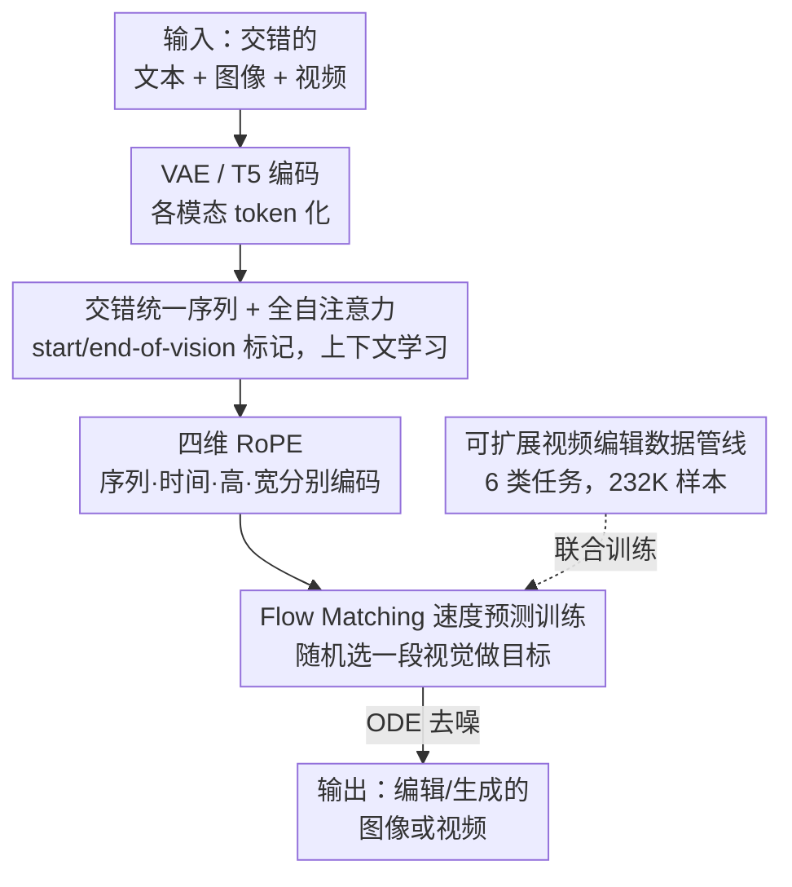

# EditVerse: Unifying Image and Video Editing and Generation with In-Context Learning

**会议**: ICLR2026  
**OpenReview**: [https://openreview.net/forum?id=blJXE07r7I](https://openreview.net/forum?id=blJXE07r7I)  
**代码**: 待确认（项目页见论文）  
**领域**: 视频生成 / 视频编辑 / 多模态生成  
**关键词**: 统一框架, 上下文学习, 全自注意力, 视频编辑, Flow Matching  

## 一句话总结
EditVerse 把文本、图像、视频统一成一条交错的 token 序列，用全自注意力做上下文学习，在单一 2B 模型里同时支持图像与视频的生成和编辑，并通过自建 232K 视频编辑数据管线把图像域的编辑知识迁移到数据稀缺的视频域，在自建 EditVerseBench 上超过开源方法、编辑保真度甚至超过商业模型 Runway Aleph。

## 研究背景与动机
**领域现状**：基础模型的发展方向是「统一 + 扩展」——联合训练多样数据能解锁涌现能力。图像领域已经从针对单任务的专用模型（如各种 ControlNet、inpainting 模型）转向了把生成和编辑统一在一个框架里的通用模型。但视频领域的「统一生成 + 编辑」探索还很初级。

**现有痛点**：视频侧卡在两个具体问题上。其一是**架构受限**：现有视频生成模型大多基于 cross-attention 或 MMDiT，是为「文本生视频」这类单一任务设计的，要扩展到多种编辑任务需要大量额外设计。代表作 VACE 给文本生视频模型加一条额外分支，接收未编辑视频 + mask，把它改造成视频 inpainting 模型——但它依赖 mask 来定位编辑区域、且每个任务要专门的输入配置，实用性差。其二是**数据稀缺**：图像编辑有海量高质量指令数据集（UltraEdit、OmniEdit、AnyEdit 等），而高质量、多样的视频编辑数据极度匮乏，唯一像样的 Se\~norita-2M 在质量和多样性上都明显不足。

**核心矛盾**：要让视频模型涌现出「没在训练数据里见过的编辑任务也能做」的能力，必须有一个真正统一、能灵活吃下任意模态/分辨率/时长输入的架构来支撑上下文学习；但现有针对单任务设计的 cross-attention 架构天然做不到这点，而且视频编辑数据又太少，单靠视频数据根本喂不出泛化能力。

**本文目标**：在单一模型里统一图像与视频的生成和编辑，既要架构上能灵活处理多模态交错输入，又要能把图像域充裕的编辑知识迁移到视频域。

**切入角度**：作者借鉴多模态大语言模型（MLLM）原生图像生成的做法——把所有模态都当成 token 序列、用全自注意力建模。既然自注意力的上下文学习能力是 MLLM 涌现能力的来源，那把文本、图像、视频统一成一条长序列、让它们在自注意力里互相「看」，就既能统一架构，又能让图像和视频的知识在同一注意力空间里自然迁移。

**核心 idea**：把文本/图像/视频全部表示成一条交错的一维 token 序列，用全自注意力替代 cross-attention/MMDiT 来实现强上下文学习与跨模态知识迁移，再配一套自动数据管线补上视频编辑数据的缺口。

## 方法详解

### 整体框架
EditVerse 的核心思路是「万物皆 token 序列」：不管输入里有几段文字、几张图、几个视频，全部按指令里原本的先后顺序拍成一条交错（interleaved）的一维序列，丢进一个带全自注意力的 transformer，让模型在这条长序列里靠上下文学习自己搞清楚「哪段文字描述哪段视觉、要编辑哪一个目标」。

具体地说，一次前向是这样转的：图像/视频先经卷积 VAE 压成时空隐空间、再 patchify 成视觉 token；文本经 Flan-T5-XXL 编码成文本 token。两类 token 各自过一层线性投影到同一隐藏维度 $C$，按指令原序拼成统一序列 $X\in\mathbb{R}^{L\times C}$，并在每段视觉 token 的首尾插入可学习的「start of vision / end of vision」标记。然后给每个 token 打上四维 RoPE（序列 / 时间 / 高 / 宽），喂进 $N$ 个全自注意力块。训练时随机挑序列里的一段图像或视频当生成目标，用 Flow Matching 让模型预测速度场，推理时从噪声出发用 ODE 求解器去噪生成。训练所需的视频编辑数据，则由一条自动管线离线造出来（6 类任务、232K 样本）再混入图像/视频生成与编辑数据联合训练。

### 关键设计

**1. 交错统一序列 + 全自注意力：用一条序列把多模态绑在一起做上下文学习**

这是 EditVerse 区别于 VACE 那类「加分支」方案的根本。痛点是 cross-attention/MMDiT 架构里，条件（未编辑视频、mask）和生成目标走不同通路、需要任务专属配置，模型很难举一反三。EditVerse 的做法是把所有模态投影到共享嵌入空间后拼成一条长序列 $X=\text{Concat}(X^{(0)},X^{(1)},\dots,X^{(n)})$，每个 $X^{(i)}$ 是一段干净图像、视频或文本，然后用**全自注意力**让序列里任意 token 互相可见。这样「指令文本↔参考图↔待编辑视频↔目标输出」的对应关系不再靠人工配置，而是模型在注意力里自己学到的上下文关系。

为了让模型知道一段视觉 token 从哪开始到哪结束，作者在每段视觉 token 首尾各加一个可学习的 start/end-of-vision 标记。这个设计最关键的红利是**跨模态知识迁移**：图像编辑数据（6M）和视频编辑数据（288K）在同一自注意力空间里联合训练，图像域学到的「怎么理解编辑指令、怎么做多样编辑」能直接被视频借用，从而绕开视频编辑数据稀缺的瓶颈——这也是后面涌现能力的来源。文本侧还做了个小优化：T5 编码后只保留对应输入文本的 token、丢掉其余，省算力又不丢信息。

**2. 四维 RoPE：在一条混合序列里同时区分模态、顺序与时空位置**

交错序列带来一个新问题：同一条序列里既有文本又有图像又有视频，模型怎么分清「这个 token 是序列里第几个、是视频的第几帧、在画面的什么位置」？普通的一维位置编码不够用。作者为此设计四维 RoPE，对四个维度各算一套独立的旋转位置编码：（1）**序列维**——捕捉 token 在整条序列里的全局位置，每个文本 token、每个图像/视频帧都让计数加 1；（2）**时间维**——只对视频帧生效，编码帧在片段里的时序，文本和图像该维恒为 0；（3）（4）**高 / 宽维**——对图像和视频帧按像素坐标从左上到右下递增，文本两维恒为 0。

四个维度分配的 RoPE 嵌入维度分别是 12 / 4 / 56 / 56（空间占大头，符合视觉 token 的信息分布）。为支持变长输入，RoPE 计算里用 NTK-aware 插值做上下文窗口外推。这套设计让模型既能区分模态（看哪些维非零就知道是文本还是视觉），又能精确定位时序和空间，是「任意分辨率、任意时长、任意序列位置都能处理」这一灵活性的底层支撑。消融显示去掉序列维 RoPE 会明显拉低文本对齐和编辑质量。

**3. Flow Matching 速度预测训练范式：在长序列里随机挑目标去噪**

模型怎么训练？作者用 Flow Matching。给定交错序列 $X_1=\text{Concat}(X_1^{(0)},\dots,X_1^{(n)})$，随机选其中一段图像或视频 $X_1^{(i)}$ 当生成目标，其余段保持干净当条件。对目标段做扩散：噪声 $X_0^{(i)}\sim\mathcal N(0,1)$ 按 $X_t^{(i)}=tX_1^{(i)}+(1-t)X_0^{(i)}$ 线性插值到干净数据，模型 $u_\Theta$ 学着预测速度场 $V_t=\frac{dX_t^{(i)}}{dt}=X_1^{(i)}-X_0^{(i)}$，损失就是预测速度与真实速度的均方误差：

$$L=\mathbb{E}_{t,X_0,X_1}\big|u_\Theta(X_t,t)-(X_1-X_0)\big|^2$$

注意输入序列里只有被选中的那一段是带噪的、其余段全是干净 token，所以模型本质上是在「以整条上下文为条件、生成其中一段」。推理时从噪声采样、用 50 步 ODE 求解器去噪得到结果。这个「随机选一段当目标」的范式让同一套训练目标天然覆盖了生成（目标段无对应源）和编辑（目标段有源图/源视频做条件）两类任务，不需要为编辑单独设计 loss。

**4. 可扩展视频编辑数据管线：用任务专用模型批量造数据再过滤，补上视频编辑数据缺口**

再好的架构，只喂图像编辑数据也学不会各种视频编辑。痛点是开源视频编辑数据（Se\~norita-2M）量少质差。作者设计了一条能从任意视频造出编辑配对的管线，覆盖 6 类任务：（1）**物体移除/添加**——Grounded-SAM-2 抽 mask（按物名、mask 面积、置信度过滤候选），再用 DiffuEraser 擦除，移除前后的视频对就是移除/添加数据；（2）**物体替换**——SAM-2 抽 mask，VLM 想象合理的替换物，再用 VACE 按 VLM 输出做 inpaint，并按物体大小动态调整 mask 形状提高成功率；（3）**风格迁移**——先用图像风格迁移模型改第一帧，再用 VACE 的深度引导「首帧到视频」生成整段风格化视频（比纯推理式风格迁移可靠，尤其面对 Minecraft 这类极端风格）；（4）**镜头变化**——选 10 种运镜，用 ReCamMaster 生成；（5）**mask 检测**——把前面几类数据套上「我想做 X 编辑，请检测需要编辑的区域」模板转化而来；（6）**传播**——抽取风格迁移/移除/添加/替换数据的首个编辑帧构成。

由于这些数据是模型生成的、含错误，过滤至关重要：作者用 VLM 对编辑质量和视频质量打分（涵盖指令遵循、上下文保持、清晰度、时序一致、伪影、物体完整、美学、物理合理性），人工核对分数与真实质量的关系后定阈值筛选。最终造出 232K 高质量视频编辑样本，配合从 Se\~norita-2M 过滤出的 56K，再混入 ~1.9M 图像生成、3.9M 视频生成、6M 图像编辑样本联合训练。论文强调这条管线过滤后的留存率是 Se\~norita-2M 的 6 倍。

### 损失函数 / 训练策略
模型是 2B 稠密 transformer（结构类似 LLaMA 3），先在 360p 的文本生图/生视频上预训练拿到基础生成能力，再在上述混合数据上训练 ~56K 步。全局 batch size 256，AdamW（$\beta_1=0.9,\beta_2=0.95$），峰值学习率 $8\times10^{-6}$、weight decay 0.01，2K 步 warm-up 后 cosine 衰减到 $1\times10^{-6}$，梯度裁剪范数 1.0。图像/视频按原始宽高比缩放到面积介于 $256\times256$ 与 $512\times512$。由于序列变长难以组 batch，采用 KnapFormer 的 packing 策略。推理用 CFG scale 5.0（只对文本条件）、50 步采样。

## 实验关键数据

### 主实验
作者自建 **EditVerseBench**：100 个视频（50 横 50 竖）× 每个 2 条指令 = 200 个编辑对，覆盖 20 类编辑任务，用 6 个指标评估（VLM 编辑质量、Pick Score 视频质量、CLIP/ViCLIP 文本对齐、CLIP/DINO 时序一致）。

| 方法 | 类型 | 编辑质量(VLM)↑ | Pick↑ | CLIP帧↑ | ViCLIP视频↑ |
|------|------|------|------|------|------|
| TokenFlow | 训练-free | 5.26 | 19.73 | 25.57 | 22.70 |
| STDF | 训练-free | 4.41 | 19.45 | 25.24 | 22.26 |
| Se\~norita-2M | 首帧传播 | 6.97 | 19.71 | 26.34 | 23.24 |
| InsV2V | 指令式 | 5.21 | 19.39 | 24.99 | 22.54 |
| Lucy Edit | 指令式 | 5.89 | 19.67 | 26.00 | 23.11 |
| **EditVerse** | 指令式 | **7.65** | **20.07** | **26.73** | **23.93** |
| Runway Aleph | 商业闭源 | 7.44 | 20.42 | 27.70 | 24.27 |

EditVerse 在所有开源方法上全面领先；相对商业模型 Runway Aleph，虽然生成画质因基模差异略逊，但**编辑保真度（VLM 编辑质量 7.65 vs 7.44）反超**，且更贴近用户研究结论。3000 对人工评测（指令对齐 / 未编辑区保持 / 整体质量）也显示 EditVerse 处于 SOTA。

在 **TGVE+** 上（ViCLIP 方向相似度 / 输出相似度）EditVerse 达 0.225 / 0.252，超过 Movie Gen Edit（0.225 / 0.248）等——值得注意的是 TGVE+ 全是方形视频，而 EditVerse 训练数据里**没有任何方形视频编辑样本**。

### 消融实验
**训练数据消融**（20K 步，编辑质量为 VLM 评分）：

| 图像 | 视频生成 | 视频编辑 | 编辑质量 | 文本对齐(视频) | DINO 一致 |
|:-:|:-:|:-:|------|------|------|
| ✓ | ✓ | ✗ | 3.62 | 20.44 | 90.27 |
| ✗ | ✗ | ✓ | 5.76 | 22.37 | 97.83 |
| ✓ | ✗ | ✓ | 6.52 | 22.63 | 97.97 |
| ✗ | ✓ | ✓ | 6.40 | 22.51 | 98.60 |
| ✓ | ✓ | ✓ | **6.95** | **23.81** | 98.44 |

**模型设计消融**（去掉交错格式 / 去掉序列维 RoPE）：

| 交错 | 序列 PE | 编辑质量 | 文本对齐(视频) |
|:-:|:-:|------|------|
| ✓ | ✗ | 6.42 | 22.74 |
| ✗ | ✓ | 6.84 | 23.51 |
| ✓ | ✓ | **6.95** | **23.81** |

### 关键发现
- **图像数据是涌现能力的关键来源**：只用图像+视频生成、不给视频编辑数据时编辑质量仅 3.62；反之只用视频编辑数据也只有 5.76。图像编辑数据帮模型「理解指令、做多样编辑」，视频生成数据帮「时序一致、运动建模」，两者缺一不可，全量才到 6.95。
- **交错格式 + 序列 RoPE 主要影响文本对齐与编辑质量**（而非时序/画质，后者继承自基模）——因为编辑质量依赖上下文学习能力，而上下文学习正来自交错输入 + 序列位置编码。
- **涌现能力**：模型能做训练分布外的任务（换材质、换天气、加特效），还能组合任务（参考插入 = 定制 + inpaint）；某些任务的输出质量甚至超过训练用的 ground-truth（靠从图像/视频生成域借知识），且即使完全没训过视频编辑也能做部分编辑。

## 亮点与洞察
- **「万物皆 token 序列 + 全自注意力」把架构统一和数据迁移一并解决**：这是最优雅的地方——不需要为每个任务设计分支或 mask 配置，统一序列天然支持任意模态/分辨率/时长，而图像和视频共享同一注意力空间又顺带打通了跨模态知识迁移，一石二鸟。
- **用数据稀缺域的「邻居」来补课**：视频编辑数据少，就靠数据充裕的图像编辑域在同一模型里联合训练「带飞」。消融把这点量化得很干净（去图像数据编辑质量腰斩到 3.62），是「跨模态知识迁移」少见的硬证据。
- **四维 RoPE 的维度分配（12/4/56/56）**是个可复用的小工程经验：序列/时间维只需很小的维度就能区分，空间维要给足。处理混合模态长序列时这个比例值得借鉴。
- **数据管线「先用任务专用模型造、再用 VLM 打分过滤」的范式**可迁移到任何缺配对数据的生成任务——关键是人工标定 VLM 分数与真实质量的对应关系再定阈值，而非盲信打分。

## 局限与展望
- **生成画质受基模限制**：相对 Runway Aleph 在视频质量/Pick Score 上仍有差距，作者归因于基模差异；2B 规模也限制了上限。
- **依赖一连串外部模型造数据**：数据管线串了 Grounded-SAM-2、DiffuEraser、VACE、ReCamMaster、VLM 等，任一环节的偏差都会进入训练数据，过滤虽缓解但难根除（如风格迁移对极端风格仍可能失败）。
- **方形视频泛化靠零样本**：训练数据无方形视频编辑样本却能在 TGVE+ 上表现好，说明泛化不错，但也意味着分辨率/构图分布外的稳健性未被系统评估。
- **改进方向**：扩大基模规模、引入真实而非合成的视频编辑数据提升上限；把数据管线里的多模型串联换成更端到端的自动标注，降低误差累积。

## 相关工作与启发
- **vs VACE**：VACE 给文本生视频模型加额外分支接收未编辑视频 + mask，把它改造成 inpainting 模型，依赖 mask 定位、需任务专属输入配置；EditVerse 用统一交错序列 + 全自注意力，无需 mask 和任务配置，灵活性和任务覆盖面都更广。
- **vs UNIC**：UNIC 也把条件顺序拼接、类似图像编辑架构，但只支持 6 类编辑任务、用任务感知位置编码；EditVerse 覆盖 20 类任务，且靠四维 RoPE 而非任务专属 PE，能涌现训练分布外的能力。
- **vs InsV2V / Se\~norita-2M**：前者把 InstructPix2Pix 扩到视频、后者用任务专用扩散模型造数据做首帧传播，二者在编辑质量和多样性上都受限于其数据/架构；EditVerse 在 EditVerseBench 全指标领先（编辑质量 7.65 vs InsV2V 5.21 / Se\~norita-2M 6.97）。
- **vs 图像统一模型（如 BAGEL / transfusion 路线）**：EditVerse 把图像域已验证的「序列拼接 + 自注意力做上下文学习」思路成功搬到视频，并证明图像知识能反哺视频，填补了视频侧统一框架的空白。

## 评分
- 新颖性: ⭐⭐⭐⭐⭐ 首个真正统一图像与视频「生成 + 编辑」的全自注意力交错序列框架，并实证跨模态知识迁移。
- 实验充分度: ⭐⭐⭐⭐⭐ 自建 benchmark + 自动/人工双评 + 数据与模型双重消融，涌现能力分析扎实。
- 写作质量: ⭐⭐⭐⭐ 动机—架构—数据—实验逻辑清晰，部分管线细节略密。
- 价值: ⭐⭐⭐⭐⭐ 给数据稀缺的视频编辑提供了「靠图像域带飞 + 自动造数据」的可复制路线，并放出 EditVerseBench。

<!-- RELATED:START -->

## 相关论文

- [\[ICML 2026\] Lightning Unified Video Editing via In-Context Sparse Attention](../../ICML2026/video_generation/lightning_unified_video_editing_via_in-context_sparse_attention.md)
- [\[CVPR 2026\] EffectMaker: Unifying Reasoning and Generation for Customized Visual Effect Creation](../../CVPR2026/video_generation/effectmaker_unifying_reasoning_and_generation_for_customized_visual_effect_creat.md)
- [\[CVPR 2025\] Pathways on the Image Manifold: Image Editing via Video Generation](../../CVPR2025/video_generation/pathways_on_the_image_manifold_image_editing_via_video_generation.md)
- [\[CVPR 2026\] Geometry-as-context: Modulating Explicit 3D in Scene-consistent Video Generation to Geometry Context](../../CVPR2026/video_generation/geometry-as-context_modulating_explicit_3d_in_scene-consistent_video_generation_.md)
- [\[ICLR 2026\] Controllable First-Frame-Guided Video Editing via Mask-Aware LoRA Fine-Tuning](controllable_first-frame-guided_video_editing_via_mask-aware_lora_fine-tuning.md)

<!-- RELATED:END -->
