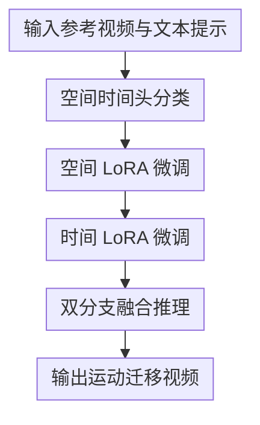

# EffiVMT: Video Motion Transfer via Efficient Spatial-Temporal Decoupled Finetuning

**会议**: ICLR 2026  
**论文**: [OpenReview](https://openreview.net/forum?id=vRgEutPE4m)  
**代码**: 作者称将部分开源（评审阶段未公开完整仓库）  
**领域**: 视频生成 / 视频编辑 / 运动迁移  
**关键词**: 视频运动迁移, Diffusion Transformer, 空间时间解耦, LoRA, 稀疏采样  

## 一句话总结
EffiVMT 针对 DiT 视频运动迁移中的“运动不一致 + 微调太慢”两大问题，提出三阶段空间-时间解耦微调（头分类 -> 空间 LoRA -> 时间 LoRA）并结合稀疏运动采样与自适应 RoPE，在显著提速的同时保持更高的运动保真与时序一致性。

## 研究背景与动机
**领域现状**：视频运动迁移希望把参考视频中的运动模式（镜头运动、目标轨迹、人体动作）转移到新语义内容上。现有路线大致分为 training-free 和 tuning-based 两类。training-free 方法不改参数，部署快但复杂运动迁移能力受预训练先验上限约束；tuning-based 方法通过 LoRA 等参数高效微调能学到更复杂运动，但计算成本和稳定性挑战更高。

**现有痛点**：在 UNet 时代，空间层与时间层常可显式拆开处理；而现代 Video DiT 大多采用 3D 全注意力，空间和时间在同一个 attention 头里“混着学”。如果直接做两阶段 LoRA（先空间、后时间）但每阶段都更新全部 attention 头，会出现两类问题：第一，空间阶段本应用静态帧保外观，却把时间头也改坏，导致后续运动跟随变差；第二，时间阶段处理全帧序列时 token 长度巨大，微调速度慢、成本高。

**核心矛盾**：运动迁移既要求“外观可控”（比如把狗变成猫）又要求“运动忠实”（轨迹和节奏贴近参考），但 3D attention 的空间-时间耦合让两者互相干扰；同时，为保证运动质量通常要长序列训练，这又直接推高了算力开销。

**本文目标**：作者把问题拆为三个子目标：1) 在不改 backbone 架构的前提下，把 attention 头分成更偏空间和更偏时间两类；2) 仅在对应阶段更新对应头，减少不必要参数扰动；3) 在时间微调阶段减少帧数但不牺牲时序定位能力。

**切入角度**：作者观察到预训练 Video DiT 的不同头天然存在关注偏好，可通过 attention map 与伪空间/伪时间模板的匹配度来做头分类。这个切入点的价值在于不需要监督标签，只用模型内部统计结构就能得到可操作的“解耦入口”。

**核心 idea**：先用头级匹配把 3D attention 拆成空间分支与时间分支，再做阶段化 LoRA 微调，并用稀疏帧采样 + 自适应 RoPE 保持时序位置对齐，从而以更少计算获得更高运动迁移质量。

## 方法详解

### 整体框架
EffiVMT 是一个三阶段流程。阶段 1 不训练 LoRA，而是先分析预训练 DiT 的 attention 头类型；阶段 2 只训练空间头 LoRA 来学习目标外观；阶段 3 冻结空间头、只训练时间头 LoRA 来学习运动动态。推理时把两类分支融合，输出兼顾语义外观和运动轨迹的视频。

和“全头一起调”相比，作者的方法把“谁负责外观、谁负责运动”显式化了：空间阶段不再误伤时间表示，时间阶段也不需要重复处理外观重建任务。再叠加稀疏运动采样，时间阶段可在更少帧上学习运动，再通过位置编码校正恢复到原始时间尺度。

### 关键设计
**1. 空间时间头分类：先分清“谁学外观、谁学运动”**

作者对每个 attention 头构造输入注意力图 $M_{input}$，再与两种伪模板比较：空间模板 $M_{spatial}$ 倾向主对角线邻域（同帧内空间关联），时间模板 $M_{temporal}$ 倾向平行对角线（跨帧同位置关联）。若某头满足
$S_{spatial} < \alpha \cdot S_{temporal}$（文中经验值 $\alpha=1.25$），则归为时间头，否则归为空间头。这个判据的作用不是追求“语义完美分类”，而是把可训练参数按功能偏好粗分，避免后续阶段互相污染。

分类后，原本单路 q/k/v/o 线性层被重排为并行双路（spatial branch + temporal branch）。前向时先通道拼接做多头注意力，再按通道拆分分别投影并融合输出。这让“结构不改主干、训练可分路”成为可能。

**2. 空间时间解耦 LoRA：阶段化更新降低冲突与冗余**

阶段 2 只给空间分支注入 LoRA 参数 $\theta_{spat}$，每步随机采样单帧按 text-to-image 目标训练，用于固化外观一致性。阶段 3 冻结 $\theta_{spat}$，只训练时间分支 LoRA 参数 $\theta_{temp}$，专注跨帧动态。

这种“先外观后运动”的关键不在顺序本身，而在参数隔离：空间阶段不会再改时间头，时间阶段也不会反复拉扯外观表示。相比朴素两阶段里“两个阶段都全头更新”，该设计能同时改善重建运动一致性与迁移运动一致性，并减少无效参数更新。

**3. 稀疏运动采样 + 自适应 RoPE：少帧训练但保持时序定位**

时间阶段若直接用原始长序列（例如 81 帧）会非常耗时。作者改为采样较少帧（如 17 帧）训练时间 LoRA，以降低 token 长度与注意力计算量。但稀疏采样会破坏原始帧索引分布，导致 RoPE 时序位置错配。为此作者引入自适应 RoPE，把采样帧索引重新映射回原始帧范围：

$$
PE_{x_i}=f\left(\frac{F}{2}+\frac{F}{F_{samp}}\left(i-\frac{F_{samp}}{2}\right)\right)
$$

其中 $F$ 是原始总帧数，$F_{samp}$ 是采样后帧数，$f(\cdot)$ 是位置编码函数。直观上，这相当于把“稀疏帧时间轴”拉伸回“完整时间轴”，让模型仍以接近预训练分布的时间坐标学习动态。作者还加入基于相邻帧差分的 motion loss（负余弦相似）强化运动方向一致性。

### 一个完整示例
设参考视频是“狗在海滩上奔跑”，目标文本是“一只猫在海滩上奔跑”。

阶段 1，模型先把头分成空间/时间两组。阶段 2，只用随机单帧训练空间 LoRA，模型学习“猫的外观语义 + 海滩纹理风格”，但不要求恢复完整运动。阶段 3，在冻结空间 LoRA 后，用稀疏帧序列训练时间 LoRA，并通过自适应 RoPE校正采样帧位置，使“奔跑节奏、位移方向、速度变化”与原视频保持一致。

最终推理时两分支融合：空间分支负责“像猫”，时间分支负责“按狗原视频的轨迹和节奏跑”。论文可视化显示，该流程对单目标、多目标、复杂人体动作和镜头运动都更稳，尤其在复杂运动下比 training-free 基线更不容易出现轨迹漂移或时序抖动。

### 损失函数 / 训练策略
空间阶段使用标准扩散速度预测损失（文中记为 $L_{spat}$），以单帧随机采样训练空间 LoRA。

时间阶段总损失为
$L_{temp}=L_{video\_denoise}+L_{motion}$。
其中 $L_{motion}$ 基于相邻帧运动 latent 的负余弦相似：
$\hat{v}_{i,t}=v_{i,t}-v_{i-1,t}$，通过最小化预测运动与真实运动的方向差，强化时序动态保持。

实现上，作者使用 WAN-2.1 作为 backbone，LoRA rank 设为 128；空间阶段约 3000 steps，时间阶段约 2000 steps。时间阶段采用稀疏采样训练，显著降低总耗时。

## 实验关键数据

### 主实验
论文在自建 MotionBench 上评估，覆盖四类运动：镜头运动、单目标运动、多目标运动、复杂人体运动。作者与多种 training-free / tuning-based 方法比较，并报告文本对齐、运动保真、时序一致和时间开销。

| 方法 | Text Sim. ↑ | Motion Fid. ↑ | Temp. Cons. ↑ | 时间(s) ↓ |
|------|-------------|---------------|----------------|-----------|
| DiTFlow | 0.375 | 0.807 | 0.941 | 712 |
| MotionDirector | 0.292 | 0.896 | 0.939 | 3008 |
| EffiVMT (Ours) | **0.380** | **0.971** | **0.976** | 727 |

从结果看，EffiVMT 在三项质量指标上都最好；速度上与最快的 training-free 方法接近，但显著快于传统 tuning-based（如 MotionDirector）。这说明“适度训练 + 高效解耦”在质量/效率上取得了更优折中。

### 消融实验
作者系统去掉三个关键模块（STD LoRA、自适应 RoPE、稀疏采样）验证贡献。

| 配置 | Text Sim. ↑ | Motion Fid. ↑ | Temp. Cons. ↑ | 时间(s) ↓ |
|------|-------------|---------------|----------------|-----------|
| Baseline（全关） | 0.362 | 0.658 | 0.824 | 2493 |
| w/o STD LoRA | 0.364 | 0.546 | 0.845 | 971 |
| w/o Adaptive RoPE | 0.371 | 0.655 | 0.817 | 792 |
| w/o Sparse Sampling | 0.369 | **0.975** | 0.967 | 2068 |
| EffiVMT (Ours) | **0.380** | 0.971 | **0.976** | **727** |

### 关键发现
- 空间时间解耦 LoRA 是避免外观/运动相互干扰的核心，否则会出现“外观学到了但运动丢了”或“运动跟上了但语义漂了”。
- 自适应 RoPE 对稀疏采样至关重要，不做位置重标定会明显伤害运动保真。
- 稀疏采样几乎不损失运动质量，却带来大幅提速，是工程上最实用的增益点。

## 亮点与洞察
- 亮点 1：把“是否解耦”从模块层面下沉到“attention 头”粒度。它不要求改主干架构，改造成本低，却能直接缓解 3D attention 混合建模带来的训练冲突。
- 亮点 2：作者没有只追求质量，而是把速度作为同等目标设计到方法里。稀疏采样 + RoPE 校正体现了“先减算，再补齐时序语义”的完整闭环。
- 亮点 3：补了 MotionBench 这个评测空缺。过去运动迁移经常只给可视化 demo，缺少覆盖镜头/多体/人体复杂动作的统一评估集，本文在 benchmark 层面也有实际推动。
- 洞察：对视频 DiT 这类大模型编辑任务，最有效的往往不是“再加一个大模块”，而是先识别参数中天然的功能分工，再做针对性微调路径设计。
- 可迁移性：该思路可扩展到其他“外观-动态”耦合任务，例如视频风格迁移、角色一致视频生成、长视频角色驱动编辑等。

## 局限与展望
- 基准依赖：MotionBench 由作者构建，虽然覆盖面比以往好，但仍可能存在分布偏好，跨域泛化（如极端镜头、超长时序）还需外部基准进一步验证。
- 推理稳定性边界：论文主要报告 32 帧评测设定下优势，超长视频、多镜头切换、严重遮挡的稳定性上限仍需更系统测试。
- 训练成本仍高于纯 training-free：尽管比传统 tuning-based 快很多，但仍需微调流程，不是零成本即插即用。
- 方法假设：头分类基于注意力稀疏结构假设，若 backbone 的头分工不明显，分类质量可能影响后续解耦收益。
- 后续方向：可探索在线自适应头分类、分层时间采样（关键动作密集段多采样）、以及与可控条件（骨架/深度/光流）的轻量融合，进一步提高复杂动作与长程一致性。

## 相关工作与启发
- **vs MotionDirector（UNet 路线）**：MotionDirector 在 UNet 上通过时空路径处理运动迁移较成熟，但迁移到 DiT 后并不天然成立；EffiVMT 的贡献在于针对 3D full attention 做头级解耦，更贴近 DiT 结构现实。
- **vs DiTFlow / SMM（training-free）**：training-free 推理快但复杂运动上限受限；EffiVMT 通过有限微调突破该上限，并在 Motion Fid.、Temp. Cons. 上明显领先。
- **vs 两阶段 LoRA 基线**：本文并非简单“多加一阶段”，而是先做头分类再阶段微调，核心改进是减少跨阶段参数冲突，并通过稀疏采样把时间阶段算力压下来。
- 启发 1：在大模型编辑中，“参数职责清晰化”常比“参数量增加”更有效。
- 启发 2：位置编码与采样策略应联动设计，任何时序降采样若不处理位置信号都会伤害动态对齐。

## 评分
- 新颖性: ⭐⭐⭐⭐☆（4/5）将 attention 头分类用于 DiT 运动迁移解耦，切中结构痛点，方法组合有清晰增量。
- 实验充分度: ⭐⭐⭐⭐⭐（5/5）含主对比、消融、用户研究与多场景可视化，并引入专门 benchmark。
- 写作质量: ⭐⭐⭐⭐☆（4/5）动机与方法脉络清楚，公式与工程实现对应较完整。
- 价值: ⭐⭐⭐⭐⭐（5/5）对“高质量且可负担”的视频运动迁移很实用，兼顾研究和落地价值。

<!-- RELATED:START -->

## 相关论文

- [\[ICLR 2026\] FastVMT: Eliminating Redundancy in Video Motion Transfer](fastvmt_eliminating_redundancy_in_video_motion_transfer.md)
- [\[ICCV 2025\] EfficientMT: Efficient Temporal Adaptation for Motion Transfer in Text-to-Video Diffusion Models](../../ICCV2025/video_generation/efficientmt_efficient_temporal_adaptation_for_motion_transfer_in_text-to-video_d.md)
- [\[ICLR 2026\] TPDiff: Temporal Pyramid Video Diffusion Model](tpdiff_temporal_pyramid_video_diffusion_model.md)
- [\[ICLR 2026\] EchoMotion: Unified Human Video and Motion Generation via Dual-Modality Diffusion Transformer](echomotion_unified_human_video_and_motion_generation_via_dual-modality_diffusion.md)
- [\[ICLR 2026\] MTVCraft: Tokenizing 4D Motion for Arbitrary Character Animation](mtvcraft_tokenizing_4d_motion_for_arbitrary_character_animation.md)

<!-- RELATED:END -->
